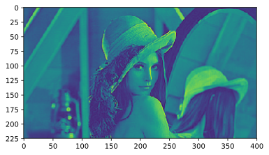

## opencvの使い方
scikit-learnは機械学習、


### github
- jupyter notebook形式のファイルは[こちら](https://github.com/hiroshi0530/wa-src/blob/master/article/library/sklearn/datasets/ds_nb.ipynb)

### google colaboratory
- google colaboratory で実行する場合は[こちら](https://colab.research.google.com/github/hiroshi0530/wa-src/blob/master/article/library/sklearn/datasets/ds_nb.ipynb)

### 環境
筆者のOSはmacOSです。LinuxやUnixのコマンドとはオプションが異なります。

### 筆者の環境


```python
!sw_vers
```

    ProductName:	Mac OS X
    ProductVersion:	10.14.6
    BuildVersion:	18G95


```python
!python -V
```

    Python 3.5.5 :: Anaconda, Inc.


```python
import cv2

print('opencv version :', cv2.__version__)
```

    opencv version : 3.4.1


画像表示用にmatplotlibもimportします。画像はwebでの見栄えを考慮して、svgで保存する事とします。


```python
%matplotlib inline
%config InlineBackend.figure_format = 'svg'

import matplotlib.pyplot as plt

```

上の階層に lena.jpg というファイルがあるとします。


```bash
%%bash

ls -al ../ | grep jpg
```

    -rw-r--r--@  1 hiroshi  staff  32468 11 14 01:52 lena.jpg


```python
filename = '../lena.jpg'
```

## 画像の読み込み

画像を読み込み、表示してみます。jupyter notebookの中で表示させるため、matplotlibを利用しています。


```python
img = cv2.imread(filename=filename)

plt.imshow(img)
plt.show()
```


画像の高さ、幅、カラーの場合の色の数（通常RGBの3）を確認します。


```python
if len(img.shape) == 3:
  img_height, img_width, img_channels = img.shape[:3]
else:
  img_height, img_width = img.shape[:2]
  
print('img_height :', img_height)
print('img_width :', img_width)
print('img_channels :', img_channels)
```

    img_height : 225
    img_width : 400
    img_channels : 3


ファイルの保存をします。


```python
out_filename = '../lena_out.jpg'
cv2.imwrite(out_filename, img)
```


    True


```python
def _set_gray_image():
  ._gray_image = cv2.cvtColor(._rgb_image, cv2.COLOR_BGR2GRAY)


def _set_inverse_gray_image():
  ._inverse_gray_image = cv2.bitwise_not(._gray_image)


def _set_binary_image(, threshold=_binary_image_threshold):
  ret, ._binary_image = cv2.threshold(._gray_image, threshold, 255, cv2.THRESH_BINARY)


def _set_inverse_binary_image():
  ._inverse_binary_image = cv2.bitwise_not(._binary_image)

```


```python
gray_img = cv2.cvtColor(img, cv2.COLOR_BGR2GRAY)

plt.imshow(gray_img)
plt.show()

out_filename = '../gray_out.jpg'
cv2.imwrite(out_filename, gray_img)
```





    True


