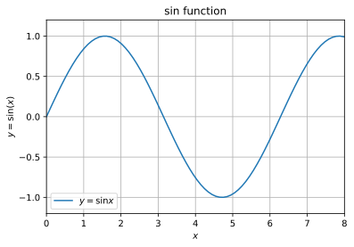
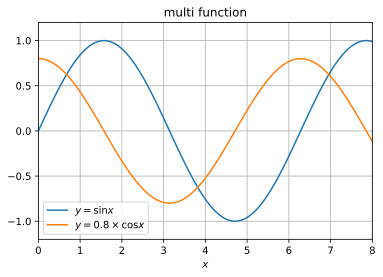
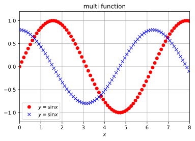
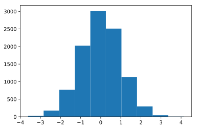
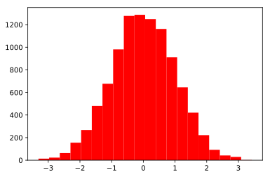
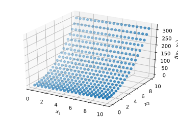
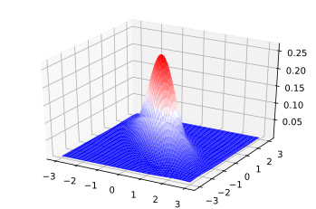

## matplotlibの使い方メモ

matplotlibの使い方をメモしておきます。新しい使い方を覚えるごとに更新していきます。

### github
- jupyter notebook形式のファイルは[こちら](https://github.com/hiroshi0530/wa-src/blob/master/article/library/matplotlib/mat_nb.ipynb)

### google colaboratory
- google colaboratory で実行する場合は[こちら](https://colab.research.google.com/github/hiroshi0530/wa-src/blob/master/article/library/matplotlib/mat_nb.ipynb)

### 筆者の環境
筆者のOSはmacOSです。LinuxやUnixのコマンドとはオプションが異なります。


```python
!sw_vers
```

    ProductName:	Mac OS X
    ProductVersion:	10.14.6
    BuildVersion:	18G6020


```python
!python -V
```

    Python 3.7.3


基本的なライブラリをインポートしそのバージョンを確認しておきます。


```python
%matplotlib inline
%config InlineBackend.figure_format = 'svg'

import matplotlib
import matplotlib.pyplot as plt
import scipy
import numpy as np

print('matplotlib version :', matplotlib.__version__)
print('scipy version :', scipy.__version__)
print('numpy version :', np.__version__)
```

    matplotlib version : 3.0.3
    scipy version : 1.4.1
    numpy version : 1.16.2


## 簡単なグラフを書く

$y = \sin x$の関数を書いてみます。マニアックな使い方が色々あるようですが、データ分析の仕事をしていると、この形で使うことが一番多いような気がしています。グリッドやラベルの設定は重要です。matplotlibの中にtexを使えるかどうかは環境による気がします。

- plt.grid()
- plt.title()
- plt.xlabel()
- plt.ylabe()
- plt.xlim()
- plt.legend()


```python
x = np.linspace(0,10,100)
y = np.sin(x)

plt.grid()
plt.title("sin function")
plt.xlabel("$x$")
plt.ylabel("$y = \\sin(x)$")
plt.xlim(0,8)
plt.ylim(-1.2,1.2)
plt.plot(x,y,label="$y=\\sin x$")

plt.legend()
```


    <matplotlib.legend.Legend at 0x1175fc4a8>





## 複数のグラフを書く


```python
x = np.linspace(0,10,100)
y1 = np.sin(x)
y2 = 0.8 * np.cos(x)

plt.grid()
plt.title("multi function")
plt.xlabel("$x$")
plt.xlim(0,8)
plt.ylim(-1.2,1.2)
plt.plot(x,y1, label="$y = \\sin x$")
plt.plot(x,y2, label="$y = 0.8 \\times \\cos x$")
plt.legend()
```


    <matplotlib.legend.Legend at 0x1177909b0>





### グラフの線種や色を変更


```python
x = np.linspace(0,10,100)
y1 = np.sin(x)
y2 = 0.8 * np.cos(x)

plt.grid()
plt.title("multi function")
plt.xlabel("$x$")
plt.xlim(0,8)
plt.ylim(-1.2,1.2)
plt.plot(x, y1, "o", color="red", label="$y = \\sin x$")
plt.plot(x, y2, "x", color="blue", label="$y = \\sin x$")
plt.legend()
```


    <matplotlib.legend.Legend at 0x117774898>





## ヒストグラムを作成する

正規分布から10000サンプルをヒストグラムで表示しています。
密度分布を可視化することと同義です。


```python
x = np.random.randn(10000)

plt.hist(x)
print(np.random.rand())
```

    0.3934044138335787





binなどを設定する事ができます。この辺は数をこなせば自然と覚えてしまいます。


```python
x = np.random.randn(10000)
plt.hist(x, bins=20,color="red")
```


    (array([  14.,   23.,   63.,  155.,  267.,  480.,  677.,  981., 1277.,
            1287., 1249., 1162.,  912.,  645.,  421.,  222.,   92.,   42.,
              29.,    2.]),
     array([-3.30855493, -2.971971  , -2.63538708, -2.29880315, -1.96221922,
            -1.62563529, -1.28905136, -0.95246744, -0.61588351, -0.27929958,
             0.05728435,  0.39386828,  0.73045221,  1.06703613,  1.40362006,
             1.74020399,  2.07678792,  2.41337185,  2.74995577,  3.0865397 ,
             3.42312363]),
     <a list of 20 Patch objects>)





## 三次元のグラフを書く
それほど頻度が多いわけではないですが、3次元のグラフを書いてみます。データ分析は数百次元とか当たり前ですが、人間の感覚で理解できる次元数は3次元がやっとですね。私は3次元でも正直辛いです。。。

mplot3dというモジュールを利用します。また、3次元のグラフに特有なのがmeshgridというnumpyの関数を利用します。

通常、$ z = x + y$という平面を$xyz$空間にプロットするには、$x$と$y$の要素数は$N(x) \times N(y)$で決定されます。本来ならばこの分だけ配列を作成する必要がありますが、これを自動的に作成してくれるのがmeshgridになります。

例を見てみます。


```python
x = np.array([i for i in range(5)])
y = np.array([i for i in range(5)])

print('x :', x)
print('y :', y)
print()
xx, yy = np.array(np.meshgrid(x, y))
print('xx :', xx)
print()
print('yy :', yy)
```

    x : [0 1 2 3 4]
    y : [0 1 2 3 4]
    
    xx : [[0 1 2 3 4]
     [0 1 2 3 4]
     [0 1 2 3 4]
     [0 1 2 3 4]
     [0 1 2 3 4]]
    
    yy : [[0 0 0 0 0]
     [1 1 1 1 1]
     [2 2 2 2 2]
     [3 3 3 3 3]
     [4 4 4 4 4]]


$xx$が25個の座標の$x$座標です。同様に、$yy$が25個の座標の$y$座標になります。とても便利です。


```python
from mpl_toolkits.mplot3d import Axes3D

# 2変数関数を適当に作成
def get_y(x1,x2):
  return x1 + 3 * x2 * x2 + 1

x1 = np.linspace(0,10,20)
x2 = np.linspace(0,10,20)

X1, X2 = np.meshgrid(x1, x2)
Y = get_y(X1, X2)

fig = plt.figure()
ax = fig.add_subplot(111, projection='3d')

ax.set_xlabel("$x_1$")
ax.set_ylabel("$x_2$")
ax.set_zlabel("$f(x_1, x_2)$")

ax.plot(np.ravel(X1), np.ravel(X2), np.ravel(Y), "o", color='blue')
plt.show()
```


```python
fig = plt.figure()
ax1 = fig.add_subplot(111, projection='3d')

ax1.set_xlabel("$x_1$")
ax1.set_ylabel("$x_2$")
ax1.set_zlabel("$f(x_1, x_2)$")

ax1.scatter3D(np.ravel(X1), np.ravel(X2), np.ravel(Y))
plt.show()
```





3次元のプロットでは、pyplot(plt)を直接いじると言うよりは、`fig=plt.figure()`でfigureオブジェクトを作り、その中でグラフを作成します。

`plot_surface`を利用して、表面にその値に応じた色をつけることが出来ます。
多変数ガウス分布をプロットしてみます。

少々負の相関関係が強いガウス分布の確率密度を取得してみます。


```python
from scipy.stats import multivariate_normal

mu = np.array([0,0])
sigma = np.array([[1,-0.8],[-0.8,1]])

x1 = np.linspace(-3,3,100)
x2 = np.linspace(-3,3,100)

X = np.meshgrid(x1,x2)

X1, X2 = np.meshgrid(x1, x2)
X = np.c_[np.ravel(X1), np.ravel(X2)]
Z = multivariate_normal.pdf(X, mu,sigma).reshape(100, -1)

fig = plt.figure()
ax = fig.add_subplot(111, projection='3d')
ax.plot_surface(X1, X2, Z, cmap='bwr', linewidth=0)
fig.show()
```

    /Users/hiroshi/anaconda3/lib/python3.7/site-packages/matplotlib/figure.py:445: UserWarning: Matplotlib is currently using module://ipykernel.pylab.backend_inline, which is a non-GUI backend, so cannot show the figure.
      % get_backend())




