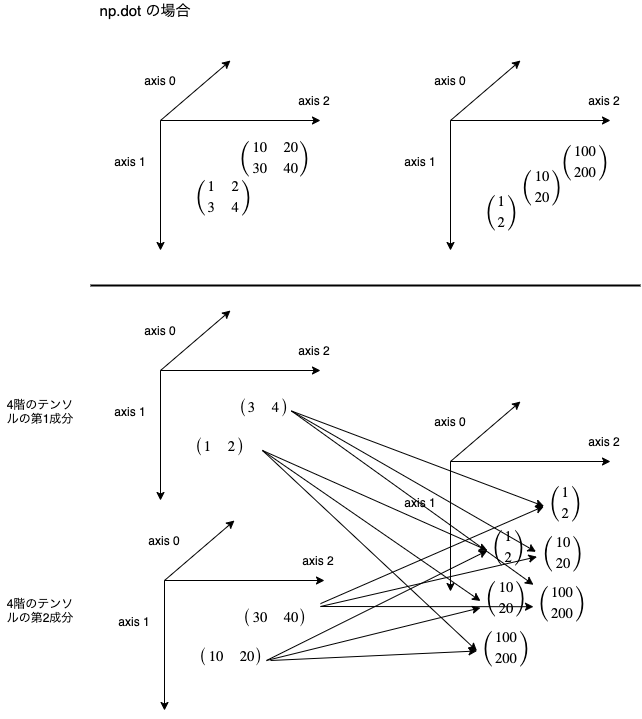
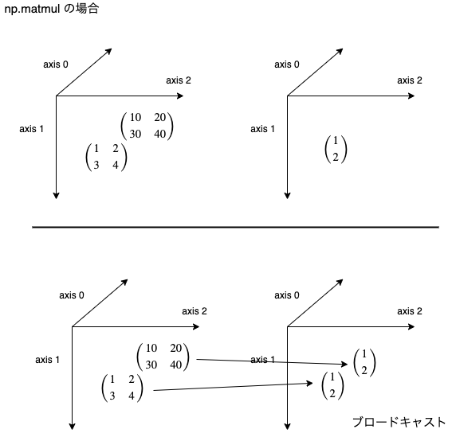
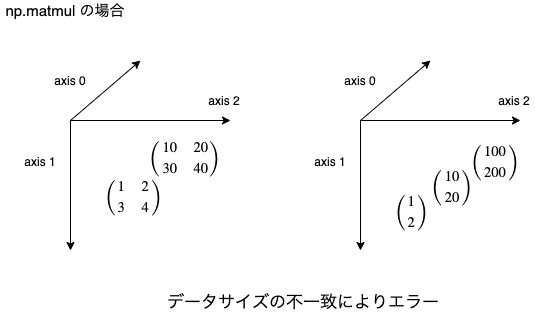

## Numpy個人的tips

numpyもデータ分析には欠かせないツールの一つです。個人的な備忘録としてメモを残しておきます。詳細は
- [公式ページ](https://docs.scipy.org/doc/numpy/reference/)
を参照してください。

### 目次
- [1. 基本的な演算](/article/library/numpy/base/)
- [2. 三角関数](/article/library/numpy/trigonometric/)
- [3. 指数・対数](/article/library/numpy/explog/)
- [4. 統計関数](/article/library/numpy/statistics/)
- [5. 線形代数](/article/library/numpy/matrix/) <= 今ここ
- [6. サンプリング](/article/library/numpy/sampling/)
- [7. その他](/article/library/numpy/misc/)

### github
- githubのjupyter notebook形式のファイルは[こちら](https://github.com/hiroshi0530/wa/blob/master/src/article/library/numpy/matrix/matrix_nb.ipynb)

### 筆者の環境
筆者の環境とimportの方法は以下の通りです。


```python
!sw_vers
```

    ProductName:	Mac OS X
    ProductVersion:	10.14.6
    BuildVersion:	18G95


```python
!python -V
```

    Python 3.5.5 :: Anaconda, Inc.


```python
%matplotlib inline
%config InlineBackend.figure_format = 'svg'

import numpy as np

np.__version__
```


    '1.18.1'


## 基本的な行列計算

### np.identify(N)
単位行列を作成します。


```python
np.identity(3)
```


    array([[1., 0., 0.],
           [0., 1., 0.],
           [0., 0., 1.]])


### np.eye(N,M=None,k=0)
単位行列を作成します。identifyと違い、正方行列である事に限定されません。また、対角の1の位置を指定することが出来ます。


```python
np.eye(3)
```


    array([[1., 0., 0.],
           [0., 1., 0.],
           [0., 0., 1.]])


```python
np.eye(4,3)
```


    array([[1., 0., 0.],
           [0., 1., 0.],
           [0., 0., 1.],
           [0., 0., 0.]])


```python
np.eye(4,5,1)
```


    array([[0., 1., 0., 0., 0.],
           [0., 0., 1., 0., 0.],
           [0., 0., 0., 1., 0.],
           [0., 0., 0., 0., 1.]])


### np.zeros((N,M,･･･))
すべての要素が0の配列を作成します。引数はshapeを示すタプルを取ります。intを入れるとベクトルとなります。


```python
np.zeros((5,4))
```


    array([[0., 0., 0., 0.],
           [0., 0., 0., 0.],
           [0., 0., 0., 0.],
           [0., 0., 0., 0.],
           [0., 0., 0., 0.]])


```python
np.zeros(3)
```


    array([0., 0., 0.])


### np.zeros_like(x)
xと同じサイズをもつすべての要素が0の配列を作成します。


```python
a = np.array([i for i in range(6)]).reshape(2,3)
np.zeros_like(a) # (2,3)の0配列ができる。
```


    array([[0, 0, 0],
           [0, 0, 0]])


### np.ones((N,M,･･･))
すべての要素が1の配列を作成します。引数はshapeを示すタプルを取ります。intを入れるとベクトルとなります。


```python
np.ones((2,5))
```


    array([[1., 1., 1., 1., 1.],
           [1., 1., 1., 1., 1.]])


### np.zeros_like(x)
xと同じサイズをもつすべての要素が0の配列を作成します。


```python
a = np.array([i for i in range(15)]).reshape(5,3)
np.ones_like(a) # (5,3)の0配列ができる。
```


    array([[1, 1, 1],
           [1, 1, 1],
           [1, 1, 1],
           [1, 1, 1],
           [1, 1, 1]])


### np.dot(a,b)
内積の計算です。$\displaystyle {\bf a}=(a_1,a_2,a_3), {\bf b} = (b_1,b_2,b_3)$というベクトル（1階のテンソル）とすると、
$$
{\rm np.dot(a,b)} = a^{T}b = \sum_{k=1}^{3}a_kb_k
$$
を計算することになります。行列の場合は、行列の積の計算になります。

#### テンソルのdot演算子
テンソルでサイズが違う場合、計算がやや面倒ですが、計算のイメージとしては以下の通りです。



```python
a = np.array([1,2])
b = np.array([4,3])

print('### ベクトルの場合 ###')
print('a : ')
print(a)
print('b : ')
print(b)
print('計算結果')
print(np.dot(a,b))
print()

a = np.array([[1,2],[3,4]])
b = np.array([[4,3],[2,1]])

print('### 行列の場合 ###')
print('a : ')
print(a)
print('b : ')
print(b)
print('計算結果')
print(np.dot(a,b))
```

    ### ベクトルの場合 ###
    a : 
    [1 2]
    b : 
    [4 3]
    計算結果
    10
    
    ### 行列の場合 ###
    a : 
    [[1 2]
     [3 4]]
    b : 
    [[4 3]
     [2 1]]
    計算結果
    [[ 8  5]
     [20 13]]


### np.vdot(a,b)
$a$の複素共役を取り、内積を計算します。実数の場合は`np.dot`と同じです。
$\displaystyle {\bf a}=(a_1,a_2,a_3), {\bf b} = (b_1,b_2,b_3)$というベクトル（1階のテンソル）とすると、
$$
{\rm np.vdot(a,b)} = a^{*}b = \overline{a}^{T}b= \sum_{k=1}^{3}\overline{a_k}b_k
$$


```python
a = np.array([1,2])
b = np.array([4,3])

print('実数の場合はnp.dotと等しい')
print(np.dot(a,b))
print(np.vdot(a,b))
print('')

print('複素共役を取り内積の計算した場合と等しい')
a = np.array([1+2j,3+4j])
b = np.array([4+3j,2+1j])
print(np.vdot(a, b))

a = np.array([1-2j,3-4j])
b = np.array([4+3j,2+1j])
print(np.dot(a, b))

print((1-2j)*(4+3j)+(3-4j)*(2+1j))
```

    実数の場合はnp.dotと等しい
    10
    10
    
    複素共役を取り内積の計算した場合と等しい
    (20-10j)
    (20-10j)
    (20-10j)


### np.outer(a,b)
直積を計算します。
$\displaystyle {\bf a}=(a_1,a_2,a_3), {\bf b} = (b_1,b_2,b_3)$というベクトル（1階のテンソル）とすると、
<div>
$$
{\rm np.outer(a,b)} = ab^{*}= a\overline{b}^{T}=\left(
    \begin{array}{ccc}
      a_1\overline{b_1} & a_1\overline{b_2} & a_1\overline{b_3} \\
      a_2\overline{b_1} & a_2\overline{b_2} & a_2\overline{b_3} \\
      a_3\overline{b_1} & a_3\overline{b_2} & a_3\overline{b_3} 
    \end{array}
  \right) 
$$
</div>
という計算を行います。また、$a$と$b$はベクトルではない場合、強制的にベクトルに変換されます。直積はデータ分析や機械学習にはあまり出てきませんが、量子計算において利用されます。二つのビットの状態を表す基底となります。


```python
a = np.array([1,2])
b = np.array([4,3])
print('ベクトルのouterの計算例')
print(np.outer(a,b))
print()

a = np.arange(1,5).reshape(-1,2)
b = np.arange(11,15).reshape(-1,2)

print('行列のouterの計算例')
print('a = \n',a)
print('b = \n',b)
print('np.outer(a,b) = \n',np.outer(a,b))
```

    ベクトルのouterの計算例
    [[4 3]
     [8 6]]
    
    行列のouterの計算例
    a = 
     [[1 2]
     [3 4]]
    b = 
     [[11 12]
     [13 14]]
    np.outer(a,b) = 
     [[11 12 13 14]
     [22 24 26 28]
     [33 36 39 42]
     [44 48 52 56]]


### np.matmul(a,b)
通常の行列の積になります。

#### テンソルのmutmal演算子


#### サイズが一致しない場合



```python
a = np.arange(1,5).reshape(-1,2)
b = np.arange(11,15).reshape(-1,2)

print('matmul計算例')
print('a = \n',a)
print('b = \n',b)
print('np.matmul(a,b) = \n',np.matmul(a,b))
```

    matmul計算例
    a = 
     [[1 2]
     [3 4]]
    b = 
     [[11 12]
     [13 14]]
    np.matmul(a,b) = 
     [[37 40]
     [85 92]]


matmulは機械学習でもしばしば出てくる重要な演算なので少し詳しく解説します。詳細は[公式ページ](https://docs.scipy.org/doc/numpy/reference/generated/numpy.matmul.html#numpy.matmul)を参照してください。

#### 二つの引数の次元がどちらも2の場合（どちらも行列の場合）
通常通りの行列の演算になります。計算例は上記の通りです。

#### 引数のうち、どちらかの次元が2より大きいとき
通常通りの行列の演算になります。

以下の場合だと7x4の

となります。


```python
a = np.ones([9, 5, 7, 4])
c = np.ones([9, 5, 4, 3])

print(np.dot(a, c).shape)
print(np.matmul(a, c).shape)

a = np.ones([1,2,1])
c = np.ones([1,1,2])

print(np.dot(a, c))
print(np.dot(a, c).shape)
print(np.matmul(a, c).shape)


```

    (9, 5, 7, 9, 5, 3)
    (9, 5, 7, 3)
    [[[[1. 1.]]
    
      [[1. 1.]]]]
    (1, 2, 1, 2)
    (1, 2, 2)


```python
a = np.array([
  [[1,2],
   [3,4]],
  [[10,20],
   [30,40]]
])

b = np.array([
  [[1],
   [2]],
  [[10],
   [20]],
  [[100],
   [200]]
])

print('dot 演算子の場合')
print(a.shape)
print(b.shape)
print()

print(np.dot(a,b).shape)
print(np.dot(a,b))
print()


```

    dot 演算子の場合
    (2, 2, 2)
    (3, 2, 1)
    
    (2, 2, 3, 1)
    [[[[    5]
       [   50]
       [  500]]
    
      [[   11]
       [  110]
       [ 1100]]]
    
    
     [[[   50]
       [  500]
       [ 5000]]
    
      [[  110]
       [ 1100]
       [11000]]]]
    


```python
a = np.array([
  [[1,2],
   [3,4]],
  [[10,20],
   [30,40]]
])

b = np.array([
  [[1],
   [2]],
  [[10],
   [20]],
  [[100],
   [200]]
])

print('matmul 演算子の場合')
print(a.shape)
print(b.shape)
print()

try:
  print(np.matmul(a,b).shape)
  print(np.matmul(a,b))
except Exception as e:
  print(e)
```

    matmul 演算子の場合
    (2, 2, 2)
    (3, 2, 1)
    
    operands could not be broadcast together with remapped shapes [original->remapped]: (2,2,2)->(2,newaxis,newaxis) (3,2,1)->(3,newaxis,newaxis) and requested shape (2,1)


```python
a = np.array([
  [[1,2],
   [3,4]],
  [[10,20],
   [30,40]]
])

b = np.array([
  [[1],
   [2]]
])

print('matmul 演算子の場合')
print(a.shape)
print(b.shape)
print()

print(np.matmul(a,b).shape)
print(np.matmul(a,b))
```

    matmul 演算子の場合
    (2, 2, 2)
    (1, 2, 1)
    
    (2, 2, 1)
    [[[  5]
      [ 11]]
    
     [[ 50]
      [110]]]


## 線形代数に必要な計算
