## Numpy個人的tips

numpyもデータ分析や数値計算には欠かせないツールの一つです。機械学習などを実装していると必ず必要とされるライブラリです。個人的な備忘録としてメモを残しておきます。詳細は以下の公式ページを参照してください。
- [公式ページ](https://docs.scipy.org/doc/numpy/reference/)

### 目次
- [1. 基本的な演算](/article/library/numpy/base/)
- [2. 三角関数](/article/library/numpy/trigonometric/) <= 今ここ
- [3. 指数・対数](/article/library/numpy/explog/)
- [4. 統計関数](/article/library/numpy/statistics/)
- [5. 線形代数](/article/library/numpy/matrix/)
- [6. サンプリング](/article/library/numpy/sampling/)
- [7. その他](/article/library/numpy/misc/)

### github
- githubのjupyter notebook形式のファイルは[こちら](https://github.com/hiroshi0530/wa/blob/master/src/numpy/trigonometric/trigonometric_nb.ipynb)

### 筆者の環境
筆者の環境とimportの方法は以下の通りです。


```python
!sw_vers
```

    ProductName:	Mac OS X
    ProductVersion:	10.14.6
    BuildVersion:	18G2022


```python
!python -V
```

    Python 3.5.5 :: Anaconda, Inc.


```python
%matplotlib inline
%config InlineBackend.figure_format = 'svg'

import numpy as np
import matplotlib
import matplotlib.pyplot as plt

print(np.__version__)
print(matplotlib.__version__)
```

    1.18.1
    2.2.2


## 三角関数

### np.sin(x)
$\sin x$です。


```python
print(np.sin(0))
print(np.sin(np.pi / 2))
print(np.sin(np.pi))
```

    0.0
    1.0
    1.2246467991473532e-16


```python
x = np.linspace(-2 * np.pi, 2 * np.pi, 100)
y = np.sin(x)

plt.grid()
plt.title('$y = \sin x$', fontsize=16)
plt.ylabel('$\sin x$')
plt.plot(x,y)
```


    [<matplotlib.lines.Line2D at 0x114397588>]


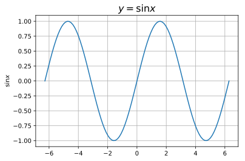


### np.cos(x)
$\cos x$です。


```python
print(np.cos(0))
print(np.cos(np.pi / 2))
print(np.cos(np.pi))
```

    1.0
    6.123233995736766e-17
    -1.0


```python
x = np.linspace(-2 * np.pi, 2 * np.pi, 100)
y = np.cos(x)

plt.grid()
plt.title('$y = \cos x$', fontsize=16)
plt.ylabel('$\cos x$')
plt.plot(x,y)
```


    [<matplotlib.lines.Line2D at 0x1144e8fd0>]


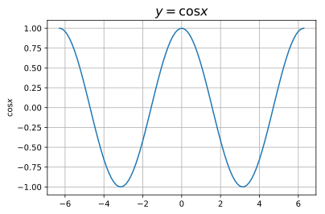


### np.tan(x)
$\tan x$です。


```python
print(np.tan(0))
print(np.tan(np.pi / 4))
print(np.tan(np.pi))
```

    0.0
    0.9999999999999999
    -1.2246467991473532e-16


```python
x = np.linspace(-2 * np.pi, 2 * np.pi, 100)
y = np.tan(x)

plt.grid()
plt.title('$y = \\tan x$', fontsize=16)
plt.ylabel('$\tan x$')
plt.ylim(-5,5)
plt.plot(x,y)
```


    [<matplotlib.lines.Line2D at 0x1145def98>]


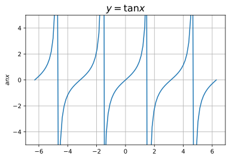


### np.arcsin(x)
$\sin x$の逆関数です。


```python
print(np.arcsin(0))
print(np.arcsin(1))
print(np.arcsin(-1))
```

    0.0
    1.5707963267948966
    -1.5707963267948966


```python
x = np.linspace(-1, 1, 100)
y = np.arcsin(x)

plt.grid()
plt.title('$y = \\arcsin x$', fontsize=16)
plt.plot(x,y)
```


    [<matplotlib.lines.Line2D at 0x11e48cef0>]


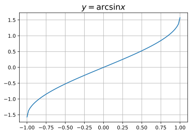


### np.arccos(x)
$\cos x$の逆関数です。


```python
print(np.arccos(0))
print(np.arccos(1))
print(np.arccos(-1))
```

    1.5707963267948966
    0.0
    3.141592653589793


```python
x = np.linspace(-1, 1, 100)
y = np.arccos(x)

plt.grid()
plt.title('$y = \\arccos x$', fontsize=16)
plt.plot(x,y)
```


    [<matplotlib.lines.Line2D at 0x11e4a4b00>]


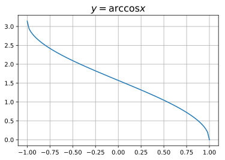


### np.arctan(x)
$\tan x$の逆関数です。


```python
print(np.arctan(0))
print(np.arctan(1))
print(np.arctan(-1))
```

    0.0
    0.7853981633974483
    -0.7853981633974483


```python
x = np.linspace(-np.pi, np.pi, 100)
y = np.arctan(x)

plt.grid()
plt.title('$y = \\arctan x$', fontsize=16)
plt.plot(x,y)
```


    [<matplotlib.lines.Line2D at 0x11e55ee10>]


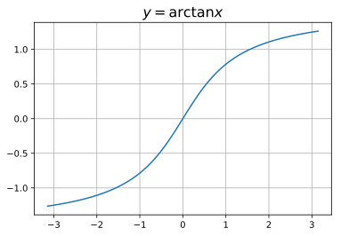


### np.sinh(x)
双曲線正弦関数です。
<div>
$
\displaystyle \sinh x = \frac{e^x - e^{-x}}{2}
$
</div>


```python
print(np.sinh(0))
print(np.sinh(-1))
print(np.sinh(1))
```

    0.0
    -1.1752011936438014
    1.1752011936438014


```python
x = np.linspace(-np.pi, np.pi, 100)
y = np.sinh(x)

plt.grid()
plt.title('$y = \sinh x$', fontsize=16)
plt.plot(x,y)
```


    [<matplotlib.lines.Line2D at 0x11e6dcf60>]


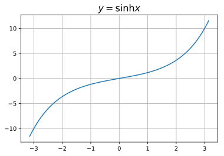


### np.cosh(x)
双曲線余弦関数です。
<div>
$
\displaystyle \cosh x = \frac{e^x + e^{-x}}{2}
$
</div>


```python
print(np.cosh(0))
print(np.cosh(-1))
print(np.cosh(1))
```

    1.0
    1.5430806348152437
    1.5430806348152437


```python
x = np.linspace(-np.pi, np.pi, 100)
y = np.cosh(x)

plt.grid()
plt.title('$y = \cosh x$', fontsize=16)
plt.plot(x,y)
```


    [<matplotlib.lines.Line2D at 0x1142c8860>]


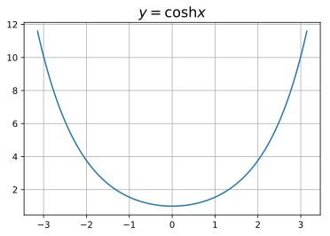


### np.tanh(x)
双曲線正接関数です。
<div>
$
\displaystyle \tanh x = \frac{\sinh x}{\cosh x}
$
</div>

深層学習の活性化関数に利用される事があります。


```python
print(np.tanh(0))
print(np.tanh(-1))
print(np.tanh(1))
```

    0.0
    -0.7615941559557649
    0.7615941559557649


```python
x = np.linspace(-np.pi, np.pi, 100)
y = np.tanh(x)

plt.grid()
plt.title('$y = \\tanh x$', fontsize=16)
plt.plot(x,y)
```


    [<matplotlib.lines.Line2D at 0x11e4a8a90>]


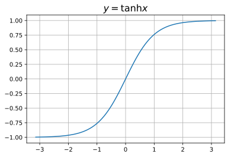


### np.arcsinh(x)
$\sinh x$の逆関数です。


```python
print(np.arcsinh(0))
print(np.arcsinh(1))
print(np.arcsinh(-1))
```

    0.0
    0.881373587019543
    -0.881373587019543


```python
x = np.linspace(-np.pi, np.pi, 100)
y = np.arcsinh(x)

plt.grid()
plt.title('$y = \\arcsinh x$', fontsize=16)
plt.plot(x,y)
```


    [<matplotlib.lines.Line2D at 0x11e7d2588>]


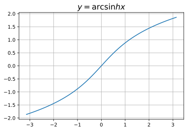


### np.arccosh(x)
$\cosh x$の逆関数です。


```python
print(np.arccosh(1))
```

    0.0


```python
x = np.linspace(1, np.pi, 100)
y = np.arccosh(x)

plt.grid()
plt.title('$y = \\arccosh x$', fontsize=16)
plt.plot(x,y)
```


    [<matplotlib.lines.Line2D at 0x11e917438>]


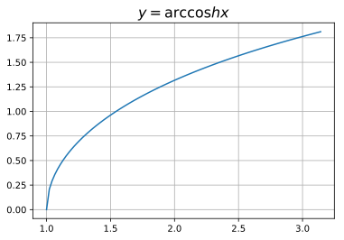


### np.arctanh(x)
$\tanh x$の逆関数です。


```python
print(np.arctanh(0))
print(np.arctanh(0.5))
print(np.arctanh(-0.5))
```

    0.0
    0.5493061443340549
    -0.5493061443340549


```python
x = np.linspace(-0.99, 0.99, 100)
y = np.arctanh(x)

plt.grid()
plt.title('$y = \\arctanh x$', fontsize=16)
plt.plot(x,y)
```


    [<matplotlib.lines.Line2D at 0x11e9e4278>]


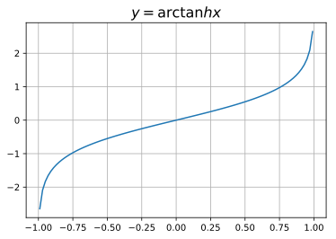


### np.deg2rad(x)
弧度法からラジアン表記に変換します。


```python
np.deg2rad(45) # => pi / 4 
```


    0.7853981633974483


### np.rad2deg(x)
弧度法からラジアン表記に変換します。


```python
np.rad2deg(np.pi / 4)
```


    45.0


