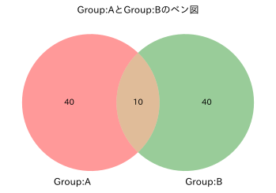
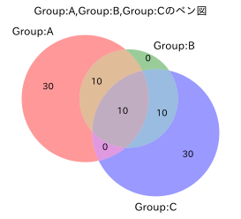

## Python Tips

データ分析をしていて、ベン図を利用して視覚化する機会があったので、忘れないようにメモしておく。
ベン図はデータセットの重複などの関係を視覚化してくれる便利なツールなのでEDAする段階では重宝する。

### github
- githubのjupyter notebook形式のファイルは[こちら](https://github.com/hiroshi0530/wa-src/blob/master/article/library/python/011/011_nb.ipynb)

### google colaboratory
- google colaboratory で実行する場合は[こちら](https://colab.research.google.com/github/hiroshi0530/wa-src/blob/master/article/library/python/011/011_nb.ipynb)

### 筆者の環境


```python
!sw_vers
```

    ProductName:	Mac OS X
    ProductVersion:	10.14.6
    BuildVersion:	18G103


```python
!python -V
```

    Python 3.8.5


## vennのインストール


```python
!pip install matplotlib-venn
```

venn2をimportする。


```python
from matplotlib_venn import venn2
```

## vennを利用したベン図の作成


```python
%matplotlib inline
%config InlineBackend.figure_format = 'svg'

import time
import json

import matplotlib.pyplot as plt
import numpy as np

import japanize_matplotlib
```

2つの適当なデータセットを用意。


```python
g1 = set([i for i in range(0,50,1)])
g2 = set([i for i in range(40,90,1)])
```


```python
plt.figure(figsize=(6,4))
plt.title('Group:AとGroup:Bのベン図')
venn2(subsets=[set(g1),set(g2)],set_labels=('Group:A','Group:B'))
plt.show()
```


    

    


### 3つのベン図

vennではvenn3を読み込むことで３つデータセットに対してベン図を作成できる。


```python
from matplotlib_venn import venn3
```

3つの適当なデータセットを用意。


```python
g1 = set([i for i in range(0,50,1)])
g2 = set([i for i in range(30,60,1)])
g3 = set([i for i in range(40,90,1)])
```


```python
plt.figure(figsize=(6,4))
plt.title('Group:A,Group:B,Group:Cのベン図')
venn3(subsets=[set(g1),set(g2),set(g3)],set_labels=('Group:A','Group:B', 'Group:C'))
plt.show()
```


    

    


とても便利なので忘れないように。。。
