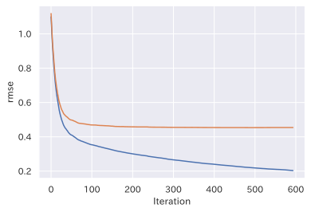
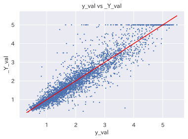
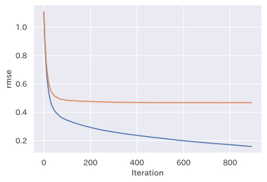
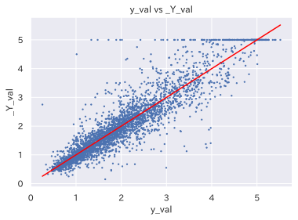
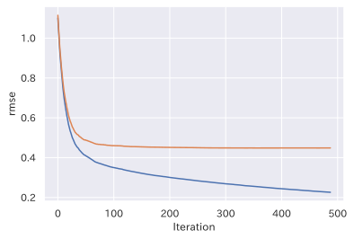
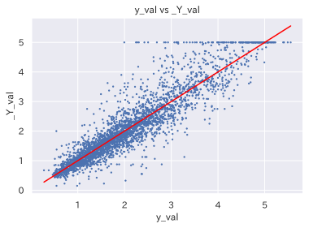
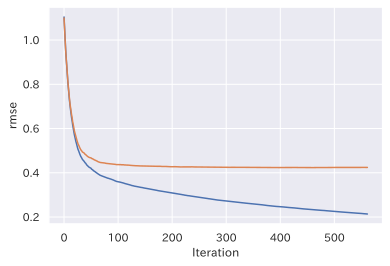
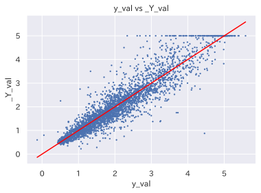
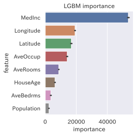
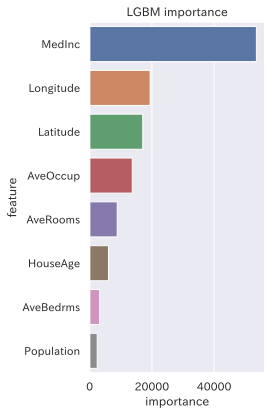

## LightGBMのテンプレート

テーブルデータの解析でよく利用されるLightGBMですが、最近よく利用することになったので、一度テンプレートとしてまとめおきます。

(2022/2/5更新: とある優秀なDataScientistの方からShapによる特徴量の解析方法を教えてもらったので、テンプレートに追加しておきます)

- データの取得
- モデルの作成
- Cross Validation
- TESTの評価
- Shapによる解析

### github
- githubのjupyter notebook形式のファイルは[こちら](https://github.com/hiroshi0530/wa-src/blob/master/article/library/python/014/014_nb.ipynb)

### google colaboratory
- google colaboratory で実行する場合は[こちら](https://colab.research.google.com/github/hiroshi0530/wa-src/blob/master/article/library/python/014/014_nb.ipynb)

### 筆者の環境


```python
!sw_vers
```

    ProductName:	Mac OS X
    ProductVersion:	10.14.6
    BuildVersion:	18G9323


```python
!python -V
```

    Python 3.8.5


```python
import sys
sys.executable
```


    '/Users/hiroshi.wayama/anaconda3/envs/lgbm2/bin/python'


## ライブラリの読み込み


```python
%matplotlib inline
%config InlineBackend.figure_format = 'svg'

import time
import json
import random

import numpy as np
import pandas as pd
import matplotlib.pyplot as plt

import japanize_matplotlib
import snap

import lightgbm as lgb

from sklearn import datasets
from sklearn import metrics

from sklearn.metrics import confusion_matrix
from sklearn.metrics import precision_score, recall_score

from sklearn.model_selection import KFold
from sklearn.model_selection import StratifiedKFold
from sklearn.model_selection import train_test_split

from sklearn.datasets import fetch_california_housing
import pandas as pd

import seaborn as sns
sns.set_style('darkgrid')
sns.set(font='IPAexGothic')

import warnings
warnings.filterwarnings('ignore')
```

### データの読み込み

データ分析でよく利用されるボストンのデータセットを利用します。目的変数は「CRIM」で人口一人あたりの犯罪発生件数です。


```python
california_housing = fetch_california_housing(as_frame=True)
df = pd.DataFrame(california_housing['data'], columns=california_housing.feature_names)
df_target = pd.Series(california_housing['target'])
```


```python
df
```


<div>
<style scoped>
    .dataframe tbody tr th:only-of-type {
        vertical-align: middle;
    }

    .dataframe tbody tr th {
        vertical-align: top;
    }

    .dataframe thead th {
        text-align: right;
    }
</style>
<table border="1" class="dataframe">
  <thead>
    <tr style="text-align: right;">
      <th></th>
      <th>MedInc</th>
      <th>HouseAge</th>
      <th>AveRooms</th>
      <th>AveBedrms</th>
      <th>Population</th>
      <th>AveOccup</th>
      <th>Latitude</th>
      <th>Longitude</th>
    </tr>
  </thead>
  <tbody>
    <tr>
      <th>0</th>
      <td>8.3252</td>
      <td>41.0</td>
      <td>6.984127</td>
      <td>1.023810</td>
      <td>322.0</td>
      <td>2.555556</td>
      <td>37.88</td>
      <td>-122.23</td>
    </tr>
    <tr>
      <th>1</th>
      <td>8.3014</td>
      <td>21.0</td>
      <td>6.238137</td>
      <td>0.971880</td>
      <td>2401.0</td>
      <td>2.109842</td>
      <td>37.86</td>
      <td>-122.22</td>
    </tr>
    <tr>
      <th>2</th>
      <td>7.2574</td>
      <td>52.0</td>
      <td>8.288136</td>
      <td>1.073446</td>
      <td>496.0</td>
      <td>2.802260</td>
      <td>37.85</td>
      <td>-122.24</td>
    </tr>
    <tr>
      <th>3</th>
      <td>5.6431</td>
      <td>52.0</td>
      <td>5.817352</td>
      <td>1.073059</td>
      <td>558.0</td>
      <td>2.547945</td>
      <td>37.85</td>
      <td>-122.25</td>
    </tr>
    <tr>
      <th>4</th>
      <td>3.8462</td>
      <td>52.0</td>
      <td>6.281853</td>
      <td>1.081081</td>
      <td>565.0</td>
      <td>2.181467</td>
      <td>37.85</td>
      <td>-122.25</td>
    </tr>
    <tr>
      <th>...</th>
      <td>...</td>
      <td>...</td>
      <td>...</td>
      <td>...</td>
      <td>...</td>
      <td>...</td>
      <td>...</td>
      <td>...</td>
    </tr>
    <tr>
      <th>20635</th>
      <td>1.5603</td>
      <td>25.0</td>
      <td>5.045455</td>
      <td>1.133333</td>
      <td>845.0</td>
      <td>2.560606</td>
      <td>39.48</td>
      <td>-121.09</td>
    </tr>
    <tr>
      <th>20636</th>
      <td>2.5568</td>
      <td>18.0</td>
      <td>6.114035</td>
      <td>1.315789</td>
      <td>356.0</td>
      <td>3.122807</td>
      <td>39.49</td>
      <td>-121.21</td>
    </tr>
    <tr>
      <th>20637</th>
      <td>1.7000</td>
      <td>17.0</td>
      <td>5.205543</td>
      <td>1.120092</td>
      <td>1007.0</td>
      <td>2.325635</td>
      <td>39.43</td>
      <td>-121.22</td>
    </tr>
    <tr>
      <th>20638</th>
      <td>1.8672</td>
      <td>18.0</td>
      <td>5.329513</td>
      <td>1.171920</td>
      <td>741.0</td>
      <td>2.123209</td>
      <td>39.43</td>
      <td>-121.32</td>
    </tr>
    <tr>
      <th>20639</th>
      <td>2.3886</td>
      <td>16.0</td>
      <td>5.254717</td>
      <td>1.162264</td>
      <td>1387.0</td>
      <td>2.616981</td>
      <td>39.37</td>
      <td>-121.24</td>
    </tr>
  </tbody>
</table>
<p>20640 rows × 8 columns</p>
</div>


```python
df.shape
```


    (20640, 8)


```python
df.head()
```


<div>
<style scoped>
    .dataframe tbody tr th:only-of-type {
        vertical-align: middle;
    }

    .dataframe tbody tr th {
        vertical-align: top;
    }

    .dataframe thead th {
        text-align: right;
    }
</style>
<table border="1" class="dataframe">
  <thead>
    <tr style="text-align: right;">
      <th></th>
      <th>MedInc</th>
      <th>HouseAge</th>
      <th>AveRooms</th>
      <th>AveBedrms</th>
      <th>Population</th>
      <th>AveOccup</th>
      <th>Latitude</th>
      <th>Longitude</th>
    </tr>
  </thead>
  <tbody>
    <tr>
      <th>0</th>
      <td>8.3252</td>
      <td>41.0</td>
      <td>6.984127</td>
      <td>1.023810</td>
      <td>322.0</td>
      <td>2.555556</td>
      <td>37.88</td>
      <td>-122.23</td>
    </tr>
    <tr>
      <th>1</th>
      <td>8.3014</td>
      <td>21.0</td>
      <td>6.238137</td>
      <td>0.971880</td>
      <td>2401.0</td>
      <td>2.109842</td>
      <td>37.86</td>
      <td>-122.22</td>
    </tr>
    <tr>
      <th>2</th>
      <td>7.2574</td>
      <td>52.0</td>
      <td>8.288136</td>
      <td>1.073446</td>
      <td>496.0</td>
      <td>2.802260</td>
      <td>37.85</td>
      <td>-122.24</td>
    </tr>
    <tr>
      <th>3</th>
      <td>5.6431</td>
      <td>52.0</td>
      <td>5.817352</td>
      <td>1.073059</td>
      <td>558.0</td>
      <td>2.547945</td>
      <td>37.85</td>
      <td>-122.25</td>
    </tr>
    <tr>
      <th>4</th>
      <td>3.8462</td>
      <td>52.0</td>
      <td>6.281853</td>
      <td>1.081081</td>
      <td>565.0</td>
      <td>2.181467</td>
      <td>37.85</td>
      <td>-122.25</td>
    </tr>
  </tbody>
</table>
</div>


### 定数

ランダム値を固定するためのシードの値を設定します。


```python
# const
seed = 123
random_state = 123
n_splits=5
test_size=0.2
```

### シードの固定関数


```python
def set_seed(seed=seed):
  os.environ["PYTHONHASHSEED"] = str(seed) 
  np.random.seed(seed)
  random.seed(seed)
```

### データの分割
TrainとTest用のデータに分割します。


```python
# 目的変数の設定
X_data = df
X_data.head()
```


<div>
<style scoped>
    .dataframe tbody tr th:only-of-type {
        vertical-align: middle;
    }

    .dataframe tbody tr th {
        vertical-align: top;
    }

    .dataframe thead th {
        text-align: right;
    }
</style>
<table border="1" class="dataframe">
  <thead>
    <tr style="text-align: right;">
      <th></th>
      <th>MedInc</th>
      <th>HouseAge</th>
      <th>AveRooms</th>
      <th>AveBedrms</th>
      <th>Population</th>
      <th>AveOccup</th>
      <th>Latitude</th>
      <th>Longitude</th>
    </tr>
  </thead>
  <tbody>
    <tr>
      <th>0</th>
      <td>8.3252</td>
      <td>41.0</td>
      <td>6.984127</td>
      <td>1.023810</td>
      <td>322.0</td>
      <td>2.555556</td>
      <td>37.88</td>
      <td>-122.23</td>
    </tr>
    <tr>
      <th>1</th>
      <td>8.3014</td>
      <td>21.0</td>
      <td>6.238137</td>
      <td>0.971880</td>
      <td>2401.0</td>
      <td>2.109842</td>
      <td>37.86</td>
      <td>-122.22</td>
    </tr>
    <tr>
      <th>2</th>
      <td>7.2574</td>
      <td>52.0</td>
      <td>8.288136</td>
      <td>1.073446</td>
      <td>496.0</td>
      <td>2.802260</td>
      <td>37.85</td>
      <td>-122.24</td>
    </tr>
    <tr>
      <th>3</th>
      <td>5.6431</td>
      <td>52.0</td>
      <td>5.817352</td>
      <td>1.073059</td>
      <td>558.0</td>
      <td>2.547945</td>
      <td>37.85</td>
      <td>-122.25</td>
    </tr>
    <tr>
      <th>4</th>
      <td>3.8462</td>
      <td>52.0</td>
      <td>6.281853</td>
      <td>1.081081</td>
      <td>565.0</td>
      <td>2.181467</td>
      <td>37.85</td>
      <td>-122.25</td>
    </tr>
  </tbody>
</table>
</div>


```python
# 説明変数の設定
Y_data = df_target
Y_data.head()
```


    0    4.526
    1    3.585
    2    3.521
    3    3.413
    4    3.422
    Name: MedHouseVal, dtype: float64


### データの準備 


```python
X_train, X_test, Y_train, Y_test = train_test_split(X_data, Y_data, test_size=test_size, random_state=random_state)
```


```python
X_train.head()
```


<div>
<style scoped>
    .dataframe tbody tr th:only-of-type {
        vertical-align: middle;
    }

    .dataframe tbody tr th {
        vertical-align: top;
    }

    .dataframe thead th {
        text-align: right;
    }
</style>
<table border="1" class="dataframe">
  <thead>
    <tr style="text-align: right;">
      <th></th>
      <th>MedInc</th>
      <th>HouseAge</th>
      <th>AveRooms</th>
      <th>AveBedrms</th>
      <th>Population</th>
      <th>AveOccup</th>
      <th>Latitude</th>
      <th>Longitude</th>
    </tr>
  </thead>
  <tbody>
    <tr>
      <th>9950</th>
      <td>4.5694</td>
      <td>28.0</td>
      <td>6.219512</td>
      <td>1.030488</td>
      <td>504.0</td>
      <td>3.073171</td>
      <td>38.38</td>
      <td>-122.33</td>
    </tr>
    <tr>
      <th>3547</th>
      <td>5.6392</td>
      <td>18.0</td>
      <td>5.951644</td>
      <td>1.034816</td>
      <td>3010.0</td>
      <td>2.911025</td>
      <td>34.26</td>
      <td>-118.60</td>
    </tr>
    <tr>
      <th>4448</th>
      <td>1.7292</td>
      <td>47.0</td>
      <td>3.628032</td>
      <td>1.032345</td>
      <td>1452.0</td>
      <td>3.913747</td>
      <td>34.07</td>
      <td>-118.21</td>
    </tr>
    <tr>
      <th>6984</th>
      <td>4.6226</td>
      <td>36.0</td>
      <td>5.126238</td>
      <td>0.985149</td>
      <td>988.0</td>
      <td>2.445545</td>
      <td>33.96</td>
      <td>-118.02</td>
    </tr>
    <tr>
      <th>4432</th>
      <td>2.4375</td>
      <td>49.0</td>
      <td>4.024390</td>
      <td>0.942073</td>
      <td>1405.0</td>
      <td>4.283537</td>
      <td>34.08</td>
      <td>-118.20</td>
    </tr>
  </tbody>
</table>
</div>


```python
X_test.head()
```


<div>
<style scoped>
    .dataframe tbody tr th:only-of-type {
        vertical-align: middle;
    }

    .dataframe tbody tr th {
        vertical-align: top;
    }

    .dataframe thead th {
        text-align: right;
    }
</style>
<table border="1" class="dataframe">
  <thead>
    <tr style="text-align: right;">
      <th></th>
      <th>MedInc</th>
      <th>HouseAge</th>
      <th>AveRooms</th>
      <th>AveBedrms</th>
      <th>Population</th>
      <th>AveOccup</th>
      <th>Latitude</th>
      <th>Longitude</th>
    </tr>
  </thead>
  <tbody>
    <tr>
      <th>19121</th>
      <td>3.7917</td>
      <td>40.0</td>
      <td>4.959799</td>
      <td>1.030151</td>
      <td>1039.0</td>
      <td>2.610553</td>
      <td>38.24</td>
      <td>-122.64</td>
    </tr>
    <tr>
      <th>20019</th>
      <td>4.0217</td>
      <td>9.0</td>
      <td>5.804577</td>
      <td>1.000000</td>
      <td>1749.0</td>
      <td>3.079225</td>
      <td>36.09</td>
      <td>-119.05</td>
    </tr>
    <tr>
      <th>15104</th>
      <td>4.0882</td>
      <td>12.0</td>
      <td>5.360360</td>
      <td>1.070571</td>
      <td>3321.0</td>
      <td>4.986486</td>
      <td>32.85</td>
      <td>-116.98</td>
    </tr>
    <tr>
      <th>3720</th>
      <td>2.2377</td>
      <td>27.0</td>
      <td>3.376582</td>
      <td>1.023207</td>
      <td>3403.0</td>
      <td>3.589662</td>
      <td>34.20</td>
      <td>-118.42</td>
    </tr>
    <tr>
      <th>8938</th>
      <td>4.4211</td>
      <td>41.0</td>
      <td>5.656904</td>
      <td>1.165272</td>
      <td>1047.0</td>
      <td>2.190377</td>
      <td>34.01</td>
      <td>-118.47</td>
    </tr>
  </tbody>
</table>
</div>


```python
Y_train.head()
```


    9950    2.875
    3547    2.715
    4448    1.917
    6984    2.197
    4432    1.140
    Name: MedHouseVal, dtype: float64


```python
Y_test.head()
```


    19121    1.516
    20019    0.992
    15104    1.345
    3720     2.317
    8938     4.629
    Name: MedHouseVal, dtype: float64


## モデルの作成

### Cross Validation

交差検証を行う。


```python
%%time

params = {
  'random_state': random_state,
  'objective': 'regression',
  'boosting_type': 'gbdt',
  'metric': {'rmse'},
  'verbosity': -1,
  'bagging_freq': 1,
  'feature_fraction': 0.8,
  'max_depth': 8,
  'min_data_in_leaf': 25,
  'num_leaves': 256,
  'learning_rate': 0.07,
  'lambda_l1': 0.2,
  'lambda_l2': 0.5,
}

model_list = []
kf = KFold(n_splits=n_splits, shuffle=True, random_state=random_state)

for _index, (_train_index, _val_index) in enumerate(kf.split(X_train, Y_train)):
 
   _X_train = X_train.iloc[_train_index]
   _Y_train = Y_train.iloc[_train_index]
 
   _X_val = X_train.iloc[_val_index]
   _Y_val = Y_train.iloc[_val_index]
 
   lgb_train = lgb.Dataset(_X_train, _Y_train)
   lgb_val = lgb.Dataset(_X_val, _Y_val, reference=lgb_train)
  
   lgb_results = {}   

   model = lgb.train(
     params, 
     train_set=lgb_train, 
     valid_sets=[lgb_train, lgb_val],
     verbose_eval=-1,
     num_boost_round=1000,
     early_stopping_rounds=100,
     valid_names=['Train', 'Val'],
     evals_result=lgb_results
   )
 
  # CVの各モデルの保存
   model_list.append(model)
  
   loss_train = lgb_results['Train']['rmse']
   loss_val = lgb_results['Val']['rmse']
   best_iteration = model.best_iteration
     
   # グラフ
   plt.rcParams['font.size'] = 14
   fig = plt.figure()
   ax1 = fig.add_subplot(111)
   ax1.grid()
   ax1.grid(axis='both')
   ax1.set_xlabel('Iteration')
   ax1.set_ylabel('rmse')
   ax1.plot(loss_train, label='train loss')
   ax1.plot(loss_val, label='valid loss')
   plt.show()
  
   # 真値と予測値の表示
  # df_pred = pd.DataFrame({'CRIM':y_test,'CRIM_pred':y_pred})
  # display(df_pred)
  
  # 散布図を描画(真値 vs 予測値)
   y_val = model.predict(_X_val, num_iteration=model.best_iteration)
   plt.plot(y_val, y_val, color = 'red', label = 'x=y') # 直線y = x (真値と予測値が同じ場合は直線状に点がプロットされる)
   plt.scatter(y_val,_Y_val, s=2)
   plt.xlabel('y_val')
   plt.ylabel('_Y_val')
   plt.title('y_val vs _Y_val')
   plt.show()
```

    Training until validation scores don't improve for 100 rounds
    Early stopping, best iteration is:
    [828]	Train's rmse: 0.173173	Val's rmse: 0.448933


    

    


    

    


    Training until validation scores don't improve for 100 rounds
    Early stopping, best iteration is:
    [494]	Train's rmse: 0.219891	Val's rmse: 0.453579


    

    


    

    


    Training until validation scores don't improve for 100 rounds
    Early stopping, best iteration is:
    [793]	Train's rmse: 0.172299	Val's rmse: 0.467271


    

    


    

    


    Training until validation scores don't improve for 100 rounds
    Early stopping, best iteration is:
    [388]	Train's rmse: 0.246327	Val's rmse: 0.447831


    

    


    

    


    Training until validation scores don't improve for 100 rounds
    Early stopping, best iteration is:
    [462]	Train's rmse: 0.233192	Val's rmse: 0.423386


    

    


    

    


    CPU times: user 1min 30s, sys: 5.79 s, total: 1min 36s
    Wall time: 19.9 s


```python
lgb_results.keys()
```


    dict_keys(['Train', 'Val'])


```python
y_val.shape
```


    (3302,)


## 特徴量の重要度を可視化


```python
# 特徴量重要度を保管する dataframe を用意
# https://www.sairablog.com/article/lightgbm-sklearn-kaggle-classification.html から抜粋
top_x = 50
feature_importances = pd.DataFrame()

for fold, model in enumerate(model_list):

    tmp = pd.DataFrame()
    tmp['feature'] = model.feature_name()
    tmp['importance'] = model.feature_importance(importance_type='gain')
    tmp['fold'] = fold

    feature_importances = feature_importances.append(tmp)

order = list(feature_importances.groupby("feature")["importance"].mean().sort_values(ascending=False).index)[:top_x]

plt.figure(figsize=(4, 4))
sns.barplot(x='importance', y='feature', data=feature_importances, order=order)
plt.title('LGBM importance')
plt.tight_layout()
plt.show()
```


    

    


## TESTデータを用いた推論


```python
_test_score_array = np.zeros(len(X_test))

for model in model_list:
  y_pred = model.predict(X_test, num_iteration=model.best_iteration)
  
  # testのscoreを格納
  _test_score_array += y_pred / n_splits

  # ソート
  _zip = zip(Y_test, y_pred)
  _zip = sorted(_zip, key=lambda x: x[1], reverse=True)
  Y_test_array, y_pred_array = zip(*_zip)

  Y_test_array = np.array(Y_test_array)
  y_pred_array = np.array(y_pred_array)
```

### TEST結果の特徴量の重要度を可視化


```python
# 特徴量重要度を保存する dataframe を用意
# https://www.sairablog.com/article/lightgbm-sklearn-kaggle-classification.html から抜粋
top_feature_num = 10
feature_importances = pd.DataFrame({
  'feature' : model.feature_name(),
  'importance': model.feature_importance(importance_type='gain'),
})

order = list(feature_importances.groupby("feature")["importance"].mean().sort_values(ascending=False).index)[:top_feature_num]

plt.figure(figsize=(4, 6))
sns.barplot(x='importance', y='feature', data=feature_importances, order=order)
plt.title('LGBM importance')
plt.tight_layout()
plt.show()
```


    

    


## 参考記事

- https://www.sairablog.com/article/lightgbm-sklearn-kaggle-classification.html


```python

```
