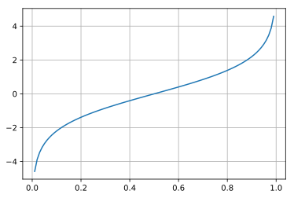

## scikit-learn でロジスティック回帰

scikit-learnを使えば手軽にロジスティック回帰を実践できるので、備忘録として残しておきます。scikit-learnを用いれば、学習(fitting)や予測predict)など手軽行うことが出来ます。ロジスティック回帰は回帰となっていますが、おそらく分類問題を解く手法だと思います。

### sickit-learn 解説目次

1. 公式データセット
2. データの作成
3. 線形回帰
4. [ロジスティック回帰](/article/library/sklearn/logistic_regression/) <= 本節

### github
- jupyter notebook形式のファイルは[こちら](https://github.com/hiroshi0530/wa-src/blob/master/article/library/sklearn/logistic_regression/lr_nb.ipynb)

### google colaboratory
- google colaboratory で実行する場合は[こちら](https://colab.research.google.com/github/hiroshi0530/wa-src/blob/master/article/library/sklearn/logistic_regression/lr_nb.ipynb)

### 筆者の環境
筆者のOSはmacOSです。LinuxやUnixのコマンドとはオプションが異なります。


```python
!sw_vers
```

    ProductName:	Mac OS X
    ProductVersion:	10.14.6
    BuildVersion:	18G95


```python
!python -V
```

    Python 3.5.5 :: Anaconda, Inc.


```python
import sklearn

sklearn.__version__
```


    '0.19.1'


必要なライブラリを読み込みます。


```python
import numpy as np
import scipy
from scipy.stats import binom

%matplotlib inline
%config InlineBackend.figure_format = 'svg'

import matplotlib
import matplotlib.pyplot as plt
import seaborn as sns

print("numpy version :", np.__version__)
print("matplotlib version :", matplotlib.__version__)
print("sns version :",sns.__version__)
```

    numpy version : 1.18.1
    matplotlib version : 2.2.2
    sns version : 0.8.1


ロジスティック回帰は二値分類の問題に適用します。ある人物が目的の商品を購入するか否か、ある人物に投票するか否かなどの予想に利用します。

例えば、ある商品を購入する確率を$p$として、説明変数を$x_1,x_2,x_3 \cdots$として、その対数

## ロジット関数

このオッズという言葉は競馬でよく聞くオッズと同じなんでしょうか。競馬はやらないのでわかりませんね。誰か教えてください。とりあえず、ある事象が起こる確率が$p$であるとき、$$\frac{p}{1-p}$$をオッズと言うそうです。その対数を$$\log p - \log(1-p)$$を対数オッズと言います。

$$
a_0 x_0 + a_1 x_1 + a_2 x_2 \cdots a_n x_n = \log \frac{p}{1-p}
$$
これを$p$について解くと、

$$
\displaystyle p = \frac{1}{1 + \exp^{ -\sum_{i=0}^n a_i x_i}}
$$


```python
from scipy.special import logit

x = np.linspace(0,1,100)
y = logit(x)

plt.grid()
plt.plot(x,y)
```


    [<matplotlib.lines.Line2D at 0x107cc6668>]





## ロジスティック関数 (シグモイド関数)

一般に、$$ f(x)= \frac{1}{1+e^{-x}}$$をロジスティック関数と言います。シグモイド関数とも言います。ロジスティック関数をグラフ化してみます。scipyにモジュールとしてあるようなので、それを使います。


```python
from scipy.special import expit

x = np.linspace(-8,8,100)
y = expit(x)

plt.grid()
plt.plot(x,y)
```


    [<matplotlib.lines.Line2D at 0x107cc69b0>]


