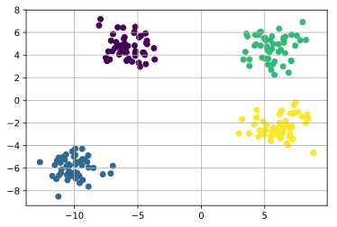
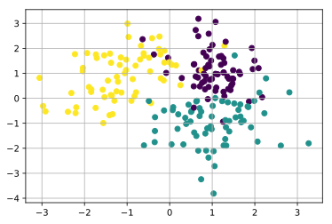
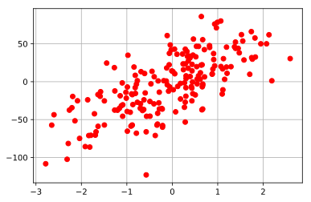

## scikit-learn データセットの作成

scikit-learnでは元々のデータセットだけではなく、データセットそのものを作り出す関数を用意してくれています。サンプリングしてくれるという事ですね。回帰や分類問題に必要なデータセットをサンプリングする事出来ます。

実際お業務だと、既にデータが与えられている場合が多いですが、たまに解析をしていると簡単なデータセットが必要になったりするので、ちょくちょく使う場面があります。

変数の量が少ない場合はnumpyなどでさっと作っても良いのですが、多変数になる場合や変数間に相関を持たせたい場合などこちらを使った方が良いかと思います。

### sickit-learn 解説目次

1. 公式データセット
2. [データの作成](/article/library/sklearn/makedatas/) <= 本節
3. 線形回帰
4. ロジスティック回帰

### github
- jupyter notebook形式のファイルは[こちら](https://github.com/hiroshi0530/wa-src/blob/master/article/library/sklearn/datasets/ds_nb.ipynb)

### google colaboratory
- google colaboratory で実行する場合は[こちら](https://colab.research.google.com/github/hiroshi0530/wa-src/blob/master/article/library/sklearn/datasets/ds_nb.ipynb)

詳細は公式ページを参考にしてください。

### 筆者の環境
筆者のOSはmacOSです。LinuxやUnixのコマンドとはオプションが異なります。


```python
!sw_vers
```

    ProductName:	Mac OS X
    ProductVersion:	10.14.6
    BuildVersion:	18G6020


```python
!python -V
```

    Python 3.7.3


```python
import sklearn

sklearn.__version__
```


    '0.20.3'


```python
%matplotlib inline
%config InlineBackend.figure_format = 'svg'

import matplotlib
import matplotlib.pyplot as plt
import numpy as np

print('matplotlib version :', matplotlib.__version__)
print('numpy version :', np.__version__)
```

    matplotlib version : 3.0.3
    numpy version : 1.16.2


## 分類問題用のデータセットの作成

### make_blobs

公式ページは[こちら](https://scikit-learn.org/stable/modules/generated/sklearn.datasets.make_blobs.html)です。説明を読むと、等方性のガウス分布からの作成するようです。変数間には相関のない、いくつかの塊を作成します。とてもシンプルで利便性もいいです。

サンプル数や特徴量数、クラスター数、その標準偏差などを指定出来ます。


```python
from sklearn.datasets import make_blobs

X, y = make_blobs(n_samples=200, n_features=2, centers=4, cluster_std=1)

plt.grid()
plt.scatter(X[:, 0], X[:, 1], c=y, marker='o')
plt.show()
```





となり、4つの分類問題用のデータセットが作成できました。便利ですね。

### classification

classificationにおけるデータ生成のアルゴリズムは少々複雑のようですが、最初のデータの出発点はガウス分布から発生させ、それを変換し、最終的なデータを出しているようです。機会があったら調べて追記したいと思います。


```python
from sklearn.datasets import make_classification

X, y = make_classification(
  n_samples=200, 
  n_features=2, 
  n_informative=2,
  n_redundant=0,
  n_clusters_per_class=1,
  n_classes=3)

plt.grid()
plt.scatter(X[:, 0], X[:, 1], marker='o', c=y)
plt.show()
```





## 回帰問題用のデータセットの作成

公式ページは[こちら](https://scikit-learn.org/stable/modules/generated/sklearn.datasets.make_regression.html)です。同様に、シンプルで利便性もいいです。

サンプル数、特徴量数、目的変数と相関が強い特徴量数、noise、biasなど柔軟に設定可能です。


```python
from sklearn.datasets import make_regression

X, y, coef = make_regression(
  n_samples=200, 
  n_features=2,
  n_informative=2,
  noise=6.0,
  bias=-2.0,
  coef=True)

plt.grid()
plt.plot(X[:, 0], y, "o", c="red")
plt.show()
```





ちゃんと回帰問題用に適したと思われるデータセットが出力されています。

## 参考資料
- [scikit-learn 公式ページ](https://scikit-learn.org/stable/datasets/index.html)
- [make_blobs](https://scikit-learn.org/stable/modules/generated/sklearn.datasets.make_blobs.html)
- [make_regression](https://scikit-learn.org/stable/modules/generated/sklearn.datasets.make_regression.html)
