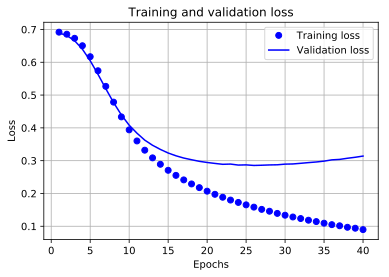
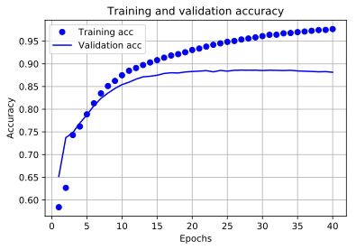

## tensorflow tutorials メモ

tensorflowが2.0になってチュートリアルも新しくなりました。勉強がてら、すべてのチュートリアルを自分の環境で行ってみたいと思います。コードはほぼチュートリアルのコピーです。

### 映画レビューのテキスト分類

### github
- jupyter notebook形式のファイルは[こちら](https://github.com/hiroshi0530/wa/blob/master/src/tf/tutorials/01/01_nb.ipynb)

### 筆者の環境


```python
!sw_vers
```

    ProductName:	Mac OS X
    ProductVersion:	10.14.6
    BuildVersion:	18G6020


```python
!python -V
```

    Python 3.7.3


```python
import tensorflow as tf
import numpy as np
import pandas as pd

%matplotlib inline
%config InlineBackend.figure_format = 'svg'
import matplotlib
import matplotlib.pyplot as plt

from tensorflow import keras

print('tf version     : ', tf.__version__)
print('keras version  : ', keras.__version__)
print('numpy version  : ',np.__version__)
print('pandas version : ',pd.__version__)
print('matlib version : ',matplotlib.__version__)
```

    tf version     :  2.1.0
    keras version  :  2.2.4-tf
    numpy version  :  1.19.4
    pandas version :  1.0.3
    matlib version :  3.0.3


## データの読み込み
訓練用のデータとテスト用のデータの読み込みです。


```python
imdb = keras.datasets.imdb

(train_data, train_labels), (test_data, test_labels) = imdb.load_data(num_words=10000)
```


```python
print("Training entries: {}, labels: {}".format(len(train_data), len(train_labels)))
```

    Training entries: 25000, labels: 25000


```python
print(train_data[0])
```

    [1, 14, 22, 16, 43, 530, 973, 1622, 1385, 65, 458, 4468, 66, 3941, 4, 173, 36, 256, 5, 25, 100, 43, 838, 112, 50, 670, 2, 9, 35, 480, 284, 5, 150, 4, 172, 112, 167, 2, 336, 385, 39, 4, 172, 4536, 1111, 17, 546, 38, 13, 447, 4, 192, 50, 16, 6, 147, 2025, 19, 14, 22, 4, 1920, 4613, 469, 4, 22, 71, 87, 12, 16, 43, 530, 38, 76, 15, 13, 1247, 4, 22, 17, 515, 17, 12, 16, 626, 18, 2, 5, 62, 386, 12, 8, 316, 8, 106, 5, 4, 2223, 5244, 16, 480, 66, 3785, 33, 4, 130, 12, 16, 38, 619, 5, 25, 124, 51, 36, 135, 48, 25, 1415, 33, 6, 22, 12, 215, 28, 77, 52, 5, 14, 407, 16, 82, 2, 8, 4, 107, 117, 5952, 15, 256, 4, 2, 7, 3766, 5, 723, 36, 71, 43, 530, 476, 26, 400, 317, 46, 7, 4, 2, 1029, 13, 104, 88, 4, 381, 15, 297, 98, 32, 2071, 56, 26, 141, 6, 194, 7486, 18, 4, 226, 22, 21, 134, 476, 26, 480, 5, 144, 30, 5535, 18, 51, 36, 28, 224, 92, 25, 104, 4, 226, 65, 16, 38, 1334, 88, 12, 16, 283, 5, 16, 4472, 113, 103, 32, 15, 16, 5345, 19, 178, 32]


```python
train_labels[0]
```


    1


```python
for i in range(10):
  print(train_labels[i])
```

    1
    0
    0
    1
    0
    0
    1
    0
    1
    0


### 整数を単語に戻してみる


```python
# 単語を整数にマッピングする辞書
word_index = imdb.get_word_index()

# インデックスの最初の方は予約済み
word_index = {k:(v+3) for k,v in word_index.items()} 
word_index["<PAD>"] = 0
word_index["<START>"] = 1
word_index["<UNK>"] = 2  # unknown
word_index["<UNUSED>"] = 3

reverse_word_index = dict([(value, key) for (key, value) in word_index.items()])

def decode_review(text):
  return ' '.join([reverse_word_index.get(i, '?') for i in text])
```


```python
decode_review(train_data[0])
```


    "<START> this film was just brilliant casting location scenery story direction everyone's really suited the part they played and you could just imagine being there robert <UNK> is an amazing actor and now the same being director <UNK> father came from the same scottish island as myself so i loved the fact there was a real connection with this film the witty remarks throughout the film were great it was just brilliant so much that i bought the film as soon as it was released for <UNK> and would recommend it to everyone to watch and the fly fishing was amazing really cried at the end it was so sad and you know what they say if you cry at a film it must have been good and this definitely was also <UNK> to the two little boy's that played the <UNK> of norman and paul they were just brilliant children are often left out of the <UNK> list i think because the stars that play them all grown up are such a big profile for the whole film but these children are amazing and should be praised for what they have done don't you think the whole story was so lovely because it was true and was someone's life after all that was shared with us all"


```python
train_data = keras.preprocessing.sequence.pad_sequences(train_data,
                                                        value=word_index["<PAD>"],
                                                        padding='post',
                                                        maxlen=256)

test_data = keras.preprocessing.sequence.pad_sequences(test_data,
                                                       value=word_index["<PAD>"],
                                                       padding='post',
                                                       maxlen=256)
```


```python
len(train_data[0]), len(train_data[1])
```


    (256, 256)


```python
# 入力の形式は映画レビューで使われている語彙数（10,000語）
vocab_size = 10000

model = keras.Sequential()
model.add(keras.layers.Embedding(vocab_size, 16))
model.add(keras.layers.GlobalAveragePooling1D())
model.add(keras.layers.Dense(16, activation='relu'))
model.add(keras.layers.Dense(1, activation='sigmoid'))

model.summary()
```

    Model: "sequential_1"
    _________________________________________________________________
    Layer (type)                 Output Shape              Param #   
    =================================================================
    embedding (Embedding)        (None, None, 16)          160000    
    _________________________________________________________________
    global_average_pooling1d (Gl (None, 16)                0         
    _________________________________________________________________
    dense (Dense)                (None, 16)                272       
    _________________________________________________________________
    dense_1 (Dense)              (None, 1)                 17        
    =================================================================
    Total params: 160,289
    Trainable params: 160,289
    Non-trainable params: 0
    _________________________________________________________________


```python
model.compile(optimizer='adam',
              loss='binary_crossentropy',
              metrics=['accuracy'])
```


```python
x_val = train_data[:10000]
partial_x_train = train_data[10000:]

y_val = train_labels[:10000]
partial_y_train = train_labels[10000:]
```


```python
history = model.fit(partial_x_train,
                    partial_y_train,
                    epochs=40,
                    batch_size=512,
                    validation_data=(x_val, y_val),
                    verbose=1)
```

    Train on 15000 samples, validate on 10000 samples
    Epoch 1/40
    15000/15000 [==============================] - 2s 141us/sample - loss: 0.6917 - accuracy: 0.5841 - val_loss: 0.6896 - val_accuracy: 0.6518
    Epoch 2/40
    15000/15000 [==============================] - 1s 41us/sample - loss: 0.6855 - accuracy: 0.6267 - val_loss: 0.6814 - val_accuracy: 0.7373
    Epoch 3/40
    15000/15000 [==============================] - 1s 36us/sample - loss: 0.6731 - accuracy: 0.7431 - val_loss: 0.6657 - val_accuracy: 0.7485
    Epoch 4/40
    15000/15000 [==============================] - 1s 51us/sample - loss: 0.6504 - accuracy: 0.7619 - val_loss: 0.6399 - val_accuracy: 0.7695
    Epoch 5/40
    15000/15000 [==============================] - 1s 62us/sample - loss: 0.6170 - accuracy: 0.7887 - val_loss: 0.6047 - val_accuracy: 0.7876
    Epoch 6/40
    15000/15000 [==============================] - 1s 39us/sample - loss: 0.5742 - accuracy: 0.8130 - val_loss: 0.5632 - val_accuracy: 0.8077
    Epoch 7/40
    15000/15000 [==============================] - 0s 31us/sample - loss: 0.5266 - accuracy: 0.8348 - val_loss: 0.5194 - val_accuracy: 0.8239
    Epoch 8/40
    15000/15000 [==============================] - 1s 44us/sample - loss: 0.4785 - accuracy: 0.8511 - val_loss: 0.4772 - val_accuracy: 0.8356
    Epoch 9/40
    15000/15000 [==============================] - 1s 34us/sample - loss: 0.4335 - accuracy: 0.8623 - val_loss: 0.4394 - val_accuracy: 0.8458
    Epoch 10/40
    15000/15000 [==============================] - 1s 50us/sample - loss: 0.3939 - accuracy: 0.8748 - val_loss: 0.4081 - val_accuracy: 0.8542
    Epoch 11/40
    15000/15000 [==============================] - 1s 50us/sample - loss: 0.3601 - accuracy: 0.8847 - val_loss: 0.3838 - val_accuracy: 0.8596
    Epoch 12/40
    15000/15000 [==============================] - 1s 56us/sample - loss: 0.3320 - accuracy: 0.8907 - val_loss: 0.3626 - val_accuracy: 0.8662
    Epoch 13/40
    15000/15000 [==============================] - 1s 43us/sample - loss: 0.3086 - accuracy: 0.8973 - val_loss: 0.3469 - val_accuracy: 0.8713
    Epoch 14/40
    15000/15000 [==============================] - 1s 49us/sample - loss: 0.2890 - accuracy: 0.9030 - val_loss: 0.3343 - val_accuracy: 0.8726
    Epoch 15/40
    15000/15000 [==============================] - 1s 53us/sample - loss: 0.2707 - accuracy: 0.9081 - val_loss: 0.3234 - val_accuracy: 0.8748
    Epoch 16/40
    15000/15000 [==============================] - 1s 51us/sample - loss: 0.2552 - accuracy: 0.9135 - val_loss: 0.3149 - val_accuracy: 0.8788
    Epoch 17/40
    15000/15000 [==============================] - 1s 50us/sample - loss: 0.2414 - accuracy: 0.9183 - val_loss: 0.3080 - val_accuracy: 0.8803
    Epoch 18/40
    15000/15000 [==============================] - 1s 39us/sample - loss: 0.2291 - accuracy: 0.9213 - val_loss: 0.3029 - val_accuracy: 0.8798
    Epoch 19/40
    15000/15000 [==============================] - 1s 43us/sample - loss: 0.2178 - accuracy: 0.9255 - val_loss: 0.2980 - val_accuracy: 0.8820
    Epoch 20/40
    15000/15000 [==============================] - 0s 33us/sample - loss: 0.2070 - accuracy: 0.9305 - val_loss: 0.2945 - val_accuracy: 0.8831
    Epoch 21/40
    15000/15000 [==============================] - 1s 50us/sample - loss: 0.1975 - accuracy: 0.9337 - val_loss: 0.2916 - val_accuracy: 0.8839
    Epoch 22/40
    15000/15000 [==============================] - 1s 59us/sample - loss: 0.1885 - accuracy: 0.9379 - val_loss: 0.2889 - val_accuracy: 0.8850
    Epoch 23/40
    15000/15000 [==============================] - 1s 42us/sample - loss: 0.1799 - accuracy: 0.9419 - val_loss: 0.2896 - val_accuracy: 0.8823
    Epoch 24/40
    15000/15000 [==============================] - 1s 35us/sample - loss: 0.1727 - accuracy: 0.9451 - val_loss: 0.2866 - val_accuracy: 0.8854
    Epoch 25/40
    15000/15000 [==============================] - 0s 32us/sample - loss: 0.1654 - accuracy: 0.9484 - val_loss: 0.2872 - val_accuracy: 0.8839
    Epoch 26/40
    15000/15000 [==============================] - 1s 34us/sample - loss: 0.1584 - accuracy: 0.9503 - val_loss: 0.2855 - val_accuracy: 0.8857
    Epoch 27/40
    15000/15000 [==============================] - 1s 51us/sample - loss: 0.1516 - accuracy: 0.9536 - val_loss: 0.2861 - val_accuracy: 0.8861
    Epoch 28/40
    15000/15000 [==============================] - 1s 58us/sample - loss: 0.1459 - accuracy: 0.9558 - val_loss: 0.2870 - val_accuracy: 0.8859
    Epoch 29/40
    15000/15000 [==============================] - 1s 51us/sample - loss: 0.1393 - accuracy: 0.9582 - val_loss: 0.2875 - val_accuracy: 0.8860
    Epoch 30/40
    15000/15000 [==============================] - 1s 47us/sample - loss: 0.1337 - accuracy: 0.9610 - val_loss: 0.2895 - val_accuracy: 0.8852
    Epoch 31/40
    15000/15000 [==============================] - 1s 51us/sample - loss: 0.1283 - accuracy: 0.9639 - val_loss: 0.2900 - val_accuracy: 0.8859
    Epoch 32/40
    15000/15000 [==============================] - 1s 50us/sample - loss: 0.1236 - accuracy: 0.9641 - val_loss: 0.2920 - val_accuracy: 0.8856
    Epoch 33/40
    15000/15000 [==============================] - 1s 44us/sample - loss: 0.1185 - accuracy: 0.9671 - val_loss: 0.2941 - val_accuracy: 0.8852
    Epoch 34/40
    15000/15000 [==============================] - 1s 50us/sample - loss: 0.1143 - accuracy: 0.9679 - val_loss: 0.2960 - val_accuracy: 0.8857
    Epoch 35/40
    15000/15000 [==============================] - 1s 48us/sample - loss: 0.1094 - accuracy: 0.9698 - val_loss: 0.2986 - val_accuracy: 0.8844
    Epoch 36/40
    15000/15000 [==============================] - 1s 47us/sample - loss: 0.1050 - accuracy: 0.9711 - val_loss: 0.3025 - val_accuracy: 0.8837
    Epoch 37/40
    15000/15000 [==============================] - 1s 64us/sample - loss: 0.1015 - accuracy: 0.9727 - val_loss: 0.3039 - val_accuracy: 0.8832
    Epoch 38/40
    15000/15000 [==============================] - 1s 56us/sample - loss: 0.0970 - accuracy: 0.9743 - val_loss: 0.3074 - val_accuracy: 0.8824
    Epoch 39/40
    15000/15000 [==============================] - 1s 45us/sample - loss: 0.0941 - accuracy: 0.9747 - val_loss: 0.3104 - val_accuracy: 0.8828
    Epoch 40/40
    15000/15000 [==============================] - 1s 36us/sample - loss: 0.0898 - accuracy: 0.9765 - val_loss: 0.3140 - val_accuracy: 0.8814


```python
results = model.evaluate(test_data,  test_labels, verbose=2)

print(results)
```

    25000/25000 - 2s - loss: 0.3341 - accuracy: 0.8708
    [0.3341222723340988, 0.87084]


```python
history_dict = history.history
history_dict.keys()
```


    dict_keys(['loss', 'accuracy', 'val_loss', 'val_accuracy'])


```python
import matplotlib.pyplot as plt

acc = history_dict['accuracy']
val_acc = history_dict['val_accuracy']
loss = history_dict['loss']
val_loss = history_dict['val_loss']

epochs = range(1, len(acc) + 1)

# "bo" is for "blue dot"
plt.plot(epochs, loss, 'bo', label='Training loss')
# b is for "solid blue line"
plt.plot(epochs, val_loss, 'b', label='Validation loss')
plt.title('Training and validation loss')
plt.xlabel('Epochs')
plt.ylabel('Loss')
plt.legend()
plt.grid()
plt.show()
```





```python
plt.clf()   # 図のクリア

plt.plot(epochs, acc, 'bo', label='Training acc')
plt.plot(epochs, val_acc, 'b', label='Validation acc')
plt.title('Training and validation accuracy')
plt.xlabel('Epochs')
plt.ylabel('Accuracy')
plt.legend()
plt.grid()
plt.show()
```





```python

```
