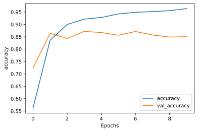

## tensorflow tutorials RNN を使ったテキスト分類

tensorflowが2.0になってチュートリアルも新しくなりました。勉強がてら、すべてのチュートリアルを自分の環境で行ってみたいと思います。コードはほぼチュートリアルのコピーです。その中で気づいた部分や、注意すべき部分がこの記事の付加価値です。

- https://www.tensorflow.org/tutorials/text/text_classification_rnn?hl=ja


```python
!sw_vers
```

    ProductName:	Mac OS X
    ProductVersion:	10.14.6
    BuildVersion:	18G6020


```python
!python -V
```

    Python 3.7.3


```python
%matplotlib inline
%config InlineBackend.figure_format = 'svg'

import tensorflow as tf
import numpy as np
import pandas as pd

import matplotlib
import matplotlib.pyplot as plt

from tensorflow import keras
from tensorflow.keras import layers

import tensorflow_datasets as tfds
tfds.disable_progress_bar()

print('tf version     : ', tf.__version__)
print('keras version  : ', keras.__version__)
print('numpy version  : ',np.__version__)
print('pandas version : ',pd.__version__)
print('matlib version : ',matplotlib.__version__)
```

    tf version     :  2.4.0
    keras version  :  2.4.0
    numpy version  :  1.19.4
    pandas version :  1.0.3
    matlib version :  3.0.3


## ヘルパー関数の作成
結果を描画するための関数


```python
def plot_graphs(history, metric):
  plt.plot(history.history[metric])
  plt.plot(history.history['val_'+metric], '')
  plt.xlabel("Epochs")
  plt.ylabel(metric)
  plt.legend([metric, 'val_'+metric])
  plt.show()
```

## 入力パイプラインの設定

IMDB映画レビューのデータセットは二値分類のデータセット。PositiveかNegativeの二択。TFDSを利用してダウンロード。


```python
dataset, info = tfds.load('imdb_reviews/subwords8k', with_info=True, as_supervised=True)
train_examples, test_examples = dataset['train'], dataset['test']
```

エンコードを含、任意の文字列を可逆的にエンコードする。


```python
encoder = info.features['text'].encoder
```


```python
'Vocabulary size: {}'.format(encoder.vocab_size)
```


    'Vocabulary size: 8185'


```python
sample_string = 'Hello TensorFlow.'

encoded_string = encoder.encode(sample_string)
print('Encoded string is {}'.format(encoded_string))

original_string = encoder.decode(encoded_string)
print('The original string: "{}"'.format(original_string))
```

    Encoded string is [4025, 222, 6307, 2327, 4043, 2120, 7975]
    The original string: "Hello TensorFlow."


```python
assert original_string == sample_string
```


```python
for index in encoded_string:
  print('{} ----> {}'.format(index, encoder.decode([index])))
```

    4025 ----> Hell
    222 ----> o 
    6307 ----> Ten
    2327 ----> sor
    4043 ----> Fl
    2120 ----> ow
    7975 ----> .


## 訓練用データの準備

エンコード済み文字列をバッチ化する。padded_batchメソッドを利用して、バッチ中の一番長い文字列の長さにゼロパッディングする。


```python
BUFFER_SIZE = 10000
BATCH_SIZE = 64
```


```python
train_dataset = (train_examples
                 .shuffle(BUFFER_SIZE)
                 .padded_batch(BATCH_SIZE))

test_dataset = (test_examples
                .padded_batch(BATCH_SIZE))
```

## モデルの作成

Embeddingレイヤーの作成。単語一つに対して、一つのベクトルを収容する。呼び出しを受けると、Embeddingレイヤーは単語のインデックスのシーケンスをベクトルのシーケンスに変換する。


```python
model = tf.keras.Sequential([
  tf.keras.layers.Embedding(encoder.vocab_size, 64),
  tf.keras.layers.Bidirectional(tf.keras.layers.LSTM(64)),
  tf.keras.layers.Dense(64, activation='relu'),
  tf.keras.layers.Dense(1)
])
```


```python
model.compile(loss=tf.keras.losses.BinaryCrossentropy(from_logits=True),
              optimizer=tf.keras.optimizers.Adam(1e-4),
              metrics=['accuracy'])
```

## モデルの訓練


```python
epochs = 10 # default
epochs = 1

history = model.fit(train_dataset, epochs=epochs,
                    validation_data=test_dataset, 
                    validation_steps=30)
```

    391/391 [==============================] - 1046s 3s/step - loss: 0.6861 - accuracy: 0.5103 - val_loss: 0.4692 - val_accuracy: 0.8005


```python
test_loss, test_acc = model.evaluate(test_dataset)

print('Test Loss: {}'.format(test_loss))
print('Test Accuracy: {}'.format(test_acc))
```

    391/391 [==============================] - 248s 636ms/step - loss: 0.4681 - accuracy: 0.8060
    Test Loss: 0.4680662155151367
    Test Accuracy: 0.8059599995613098


```python

```


```python
def pad_to_size(vec, size):
  zeros = [0] * (size - len(vec))
  vec.extend(zeros)
  return vec
```


```python
def sample_predict(sample_pred_text, pad):
  encoded_sample_pred_text = encoder.encode(sample_pred_text)

  if pad:
    encoded_sample_pred_text = pad_to_size(encoded_sample_pred_text, 64)
  encoded_sample_pred_text = tf.cast(encoded_sample_pred_text, tf.float32)
  predictions = model.predict(tf.expand_dims(encoded_sample_pred_text, 0))

  return (predictions)
```


```python

```


```python
# パディングなしのサンプルテキストの推論

sample_pred_text = ('The movie was cool. The animation and the graphics '
                    'were out of this world. I would recommend this movie.')
predictions = sample_predict(sample_pred_text, pad=False)
print(predictions)
```

    [[0.20865834]]


```python

```


```python
# パディングありのサンプルテキストの推論

sample_pred_text = ('The movie was cool. The animation and the graphics '
                    'were out of this world. I would recommend this movie.')
predictions = sample_predict(sample_pred_text, pad=True)
print(predictions)
```

    [[0.32264385]]


```python
plot_graphs(history, 'accuracy')
```





```python
plot_graphs(history, 'loss')
```


```python

```

## 2つ以上の LSTM レイヤー


```python
model = tf.keras.Sequential([
    tf.keras.layers.Embedding(encoder.vocab_size, 64),
    tf.keras.layers.Bidirectional(tf.keras.layers.LSTM(64,  return_sequences=True)),
    tf.keras.layers.Bidirectional(tf.keras.layers.LSTM(32)),
    tf.keras.layers.Dense(64, activation='relu'),
    tf.keras.layers.Dropout(0.5),
    tf.keras.layers.Dense(1)
])
```


```python
model.compile(loss=tf.keras.losses.BinaryCrossentropy(from_logits=True),
              optimizer=tf.keras.optimizers.Adam(1e-4),
              metrics=['accuracy'])
```


```python
history = model.fit(train_dataset, epochs=10,
                    validation_data=test_dataset,
                    validation_steps=30)
```

    Epoch 1/10
        113/Unknown - 591s 5s/step - loss: 0.6932 - accuracy: 0.5022


    ---------------------------------------------------------------------------

    KeyboardInterrupt                         Traceback (most recent call last)

    <ipython-input-25-ceb5f272ecaf> in <module>
          1 history = model.fit(train_dataset, epochs=10,
          2                     validation_data=test_dataset,
    ----> 3                     validation_steps=30)
    

    ~/anaconda3/lib/python3.7/site-packages/tensorflow/python/keras/engine/training.py in fit(self, x, y, batch_size, epochs, verbose, callbacks, validation_split, validation_data, shuffle, class_weight, sample_weight, initial_epoch, steps_per_epoch, validation_steps, validation_batch_size, validation_freq, max_queue_size, workers, use_multiprocessing)
       1098                 _r=1):
       1099               callbacks.on_train_batch_begin(step)
    -> 1100               tmp_logs = self.train_function(iterator)
       1101               if data_handler.should_sync:
       1102                 context.async_wait()


    ~/anaconda3/lib/python3.7/site-packages/tensorflow/python/eager/def_function.py in __call__(self, *args, **kwds)
        826     tracing_count = self.experimental_get_tracing_count()
        827     with trace.Trace(self._name) as tm:
    --> 828       result = self._call(*args, **kwds)
        829       compiler = "xla" if self._experimental_compile else "nonXla"
        830       new_tracing_count = self.experimental_get_tracing_count()


    ~/anaconda3/lib/python3.7/site-packages/tensorflow/python/eager/def_function.py in _call(self, *args, **kwds)
        853       # In this case we have created variables on the first call, so we run the
        854       # defunned version which is guaranteed to never create variables.
    --> 855       return self._stateless_fn(*args, **kwds)  # pylint: disable=not-callable
        856     elif self._stateful_fn is not None:
        857       # Release the lock early so that multiple threads can perform the call


    ~/anaconda3/lib/python3.7/site-packages/tensorflow/python/eager/function.py in __call__(self, *args, **kwargs)
       2941        filtered_flat_args) = self._maybe_define_function(args, kwargs)
       2942     return graph_function._call_flat(
    -> 2943         filtered_flat_args, captured_inputs=graph_function.captured_inputs)  # pylint: disable=protected-access
       2944 
       2945   @property


    ~/anaconda3/lib/python3.7/site-packages/tensorflow/python/eager/function.py in _call_flat(self, args, captured_inputs, cancellation_manager)
       1917       # No tape is watching; skip to running the function.
       1918       return self._build_call_outputs(self._inference_function.call(
    -> 1919           ctx, args, cancellation_manager=cancellation_manager))
       1920     forward_backward = self._select_forward_and_backward_functions(
       1921         args,


    ~/anaconda3/lib/python3.7/site-packages/tensorflow/python/eager/function.py in call(self, ctx, args, cancellation_manager)
        558               inputs=args,
        559               attrs=attrs,
    --> 560               ctx=ctx)
        561         else:
        562           outputs = execute.execute_with_cancellation(


    ~/anaconda3/lib/python3.7/site-packages/tensorflow/python/eager/execute.py in quick_execute(op_name, num_outputs, inputs, attrs, ctx, name)
         58     ctx.ensure_initialized()
         59     tensors = pywrap_tfe.TFE_Py_Execute(ctx._handle, device_name, op_name,
    ---> 60                                         inputs, attrs, num_outputs)
         61   except core._NotOkStatusException as e:
         62     if name is not None:


    KeyboardInterrupt: 


```python
test_loss, test_acc = model.evaluate(test_dataset)

print('Test Loss: {}'.format(test_loss))
print('Test Accuracy: {}'.format(test_acc))
```


```python

```


```python
# パディングなしのサンプルテキストの推論

sample_pred_text = ('The movie was not good. The animation and the graphics '
                    'were terrible. I would not recommend this movie.')
predictions = sample_predict(sample_pred_text, pad=False)
print(predictions)
```


```python
# パディングありのサンプルテキストの推論

sample_pred_text = ('The movie was not good. The animation and the graphics '
                    'were terrible. I would not recommend this movie.')
predictions = sample_predict(sample_pred_text, pad=True)
print(predictions)
```


```python
plot_graphs(history, 'accuracy')
```


```python
plot_graphs(history, 'loss')
```


```python

```


```python

```


```python

```


```python

```


```python

```
