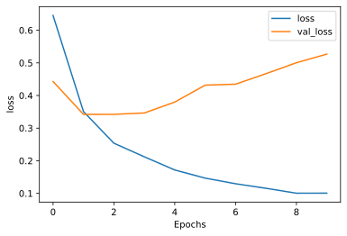

## tensorflow tutorials RNN を使ったテキスト分類

tensorflowが2.0になってチュートリアルも新しくなりました。勉強がてら、すべてのチュートリアルを自分の環境で行ってみたいと思います。コードはほぼチュートリアルのコピーです。その中で気づいた部分や、注意すべき部分がこの記事の付加価値です。

- https://www.tensorflow.org/tutorials/text/text_classification_rnn?hl=ja


```python
!sw_vers
```

    ProductName:	Mac OS X
    ProductVersion:	10.14.6
    BuildVersion:	18G6032


```python
!python -V
```

    Python 3.8.5


```python
%matplotlib inline
%config InlineBackend.figure_format = 'svg'

import tensorflow as tf
import numpy as np
import pandas as pd

import matplotlib
import matplotlib.pyplot as plt

from tensorflow import keras
from tensorflow.keras import layers

import tensorflow_datasets as tfds
tfds.disable_progress_bar()

print('tf version     : ', tf.__version__)
print('keras version  : ', keras.__version__)
print('numpy version  : ',np.__version__)
print('pandas version : ',pd.__version__)
print('matlib version : ',matplotlib.__version__)
```

    tf version     :  2.3.1
    keras version  :  2.4.0
    numpy version  :  1.18.5
    pandas version :  1.1.3
    matlib version :  3.3.2


## ヘルパー関数の作成
結果を描画するための関数


```python
def plot_graphs(history, metric):
  plt.plot(history.history[metric])
  plt.plot(history.history['val_'+metric], '')
  plt.xlabel("Epochs")
  plt.ylabel(metric)
  plt.legend([metric, 'val_'+metric])
  plt.show()
```

## 入力パイプラインの設定

IMDB映画レビューのデータセットは二値分類のデータセット。PositiveかNegativeの二択。TFDSを利用してダウンロード。


```python
dataset, info = tfds.load('imdb_reviews/subwords8k', with_info=True, as_supervised=True)
train_examples, test_examples = dataset['train'], dataset['test']
```

    WARNING:absl:TFDS datasets with text encoding are deprecated and will be removed in a future version. Instead, you should use the plain text version and tokenize the text using `tensorflow_text` (See: https://www.tensorflow.org/tutorials/tensorflow_text/intro#tfdata_example)


エンコードを含、任意の文字列を可逆的にエンコードする。


```python
encoder = info.features['text'].encoder
```


```python
'Vocabulary size: {}'.format(encoder.vocab_size)
```


    'Vocabulary size: 8185'


```python
sample_string = 'Hello TensorFlow.'

encoded_string = encoder.encode(sample_string)
print('Encoded string is {}'.format(encoded_string))

original_string = encoder.decode(encoded_string)
print('The original string: "{}"'.format(original_string))
```

    Encoded string is [4025, 222, 6307, 2327, 4043, 2120, 7975]
    The original string: "Hello TensorFlow."


```python
assert original_string == sample_string
```


```python
for index in encoded_string:
  print('{} ----> {}'.format(index, encoder.decode([index])))
```

    4025 ----> Hell
    222 ----> o 
    6307 ----> Ten
    2327 ----> sor
    4043 ----> Fl
    2120 ----> ow
    7975 ----> .


## 訓練用データの準備

エンコード済み文字列をバッチ化する。padded_batchメソッドを利用して、バッチ中の一番長い文字列の長さにゼロパッディングする。


```python
BUFFER_SIZE = 10000
BATCH_SIZE = 64
```


```python
train_dataset = (train_examples
                 .shuffle(BUFFER_SIZE)
                 .padded_batch(BATCH_SIZE))

test_dataset = (test_examples
                .padded_batch(BATCH_SIZE))
```

## モデルの作成

Embeddingレイヤーの作成。単語一つに対して、一つのベクトルを収容する。呼び出しを受けると、Embeddingレイヤーは単語のインデックスのシーケンスをベクトルのシーケンスに変換する。


```python
model = tf.keras.Sequential([
  tf.keras.layers.Embedding(encoder.vocab_size, 64),
  tf.keras.layers.Bidirectional(tf.keras.layers.LSTM(64)),
  tf.keras.layers.Dense(64, activation='relu'),
  tf.keras.layers.Dense(1)
])
```


```python
model.compile(loss=tf.keras.losses.BinaryCrossentropy(from_logits=True),
              optimizer=tf.keras.optimizers.Adam(1e-4),
              metrics=['accuracy'])
```

## モデルの訓練


```python
epochs = 10 # default

history = model.fit(train_dataset, epochs=epochs,
                    validation_data=test_dataset, 
                    validation_steps=30)
```

    Epoch 1/10
    391/391 [==============================] - 319s 816ms/step - loss: 0.6541 - accuracy: 0.5618 - val_loss: 0.5182 - val_accuracy: 0.7250
    Epoch 2/10
    391/391 [==============================] - 319s 816ms/step - loss: 0.3670 - accuracy: 0.8366 - val_loss: 0.3457 - val_accuracy: 0.8641
    Epoch 3/10
    391/391 [==============================] - 319s 817ms/step - loss: 0.2564 - accuracy: 0.8997 - val_loss: 0.3444 - val_accuracy: 0.8432
    Epoch 4/10
    391/391 [==============================] - 321s 822ms/step - loss: 0.2129 - accuracy: 0.9216 - val_loss: 0.3513 - val_accuracy: 0.8719
    Epoch 5/10
    391/391 [==============================] - 319s 816ms/step - loss: 0.1965 - accuracy: 0.9281 - val_loss: 0.3426 - val_accuracy: 0.8672
    Epoch 6/10
    391/391 [==============================] - 338s 864ms/step - loss: 0.1666 - accuracy: 0.9424 - val_loss: 0.3506 - val_accuracy: 0.8562
    Epoch 7/10
    391/391 [==============================] - 318s 813ms/step - loss: 0.1492 - accuracy: 0.9491 - val_loss: 0.4276 - val_accuracy: 0.8714
    Epoch 8/10
    391/391 [==============================] - 317s 810ms/step - loss: 0.1426 - accuracy: 0.9517 - val_loss: 0.4029 - val_accuracy: 0.8573
    Epoch 9/10
    391/391 [==============================] - 327s 835ms/step - loss: 0.1308 - accuracy: 0.9555 - val_loss: 0.4263 - val_accuracy: 0.8490
    Epoch 10/10
    391/391 [==============================] - 356s 910ms/step - loss: 0.1140 - accuracy: 0.9639 - val_loss: 0.4416 - val_accuracy: 0.8505


```python
test_loss, test_acc = model.evaluate(test_dataset)

print('Test Loss: {}'.format(test_loss))
print('Test Accuracy: {}'.format(test_acc))
```

    391/391 [==============================] - 73s 186ms/step - loss: 0.4424 - accuracy: 0.8499
    Test Loss: 0.44243761897087097
    Test Accuracy: 0.8498799800872803


```python

```


```python
def pad_to_size(vec, size):
  zeros = [0] * (size - len(vec))
  vec.extend(zeros)
  return vec
```


```python
def sample_predict(sample_pred_text, pad):
  encoded_sample_pred_text = encoder.encode(sample_pred_text)

  if pad:
    encoded_sample_pred_text = pad_to_size(encoded_sample_pred_text, 64)
  encoded_sample_pred_text = tf.cast(encoded_sample_pred_text, tf.float32)
  predictions = model.predict(tf.expand_dims(encoded_sample_pred_text, 0))

  return (predictions)
```


```python

```


```python
# パディングなしのサンプルテキストの推論

sample_pred_text = ('The movie was cool. The animation and the graphics '
                    'were out of this world. I would recommend this movie.')
predictions = sample_predict(sample_pred_text, pad=False)
print(predictions)
```

    [[-0.25093532]]


```python

```


```python
# パディングありのサンプルテキストの推論

sample_pred_text = ('The movie was cool. The animation and the graphics '
                    'were out of this world. I would recommend this movie.')
predictions = sample_predict(sample_pred_text, pad=True)
print(predictions)
```

    [[-0.1853367]]


```python
plot_graphs(history, 'accuracy')
```


    

    


```python
plot_graphs(history, 'loss')
```


    

    


```python

```

## 2つ以上の LSTM レイヤー


```python
model = tf.keras.Sequential([
    tf.keras.layers.Embedding(encoder.vocab_size, 64),
    tf.keras.layers.Bidirectional(tf.keras.layers.LSTM(64,  return_sequences=True)),
    tf.keras.layers.Bidirectional(tf.keras.layers.LSTM(32)),
    tf.keras.layers.Dense(64, activation='relu'),
    tf.keras.layers.Dropout(0.5),
    tf.keras.layers.Dense(1)
])
```


```python
model.compile(loss=tf.keras.losses.BinaryCrossentropy(from_logits=True),
              optimizer=tf.keras.optimizers.Adam(1e-4),
              metrics=['accuracy'])
```


```python
history = model.fit(train_dataset, epochs=10,
                    validation_data=test_dataset,
                    validation_steps=30)
```

    Epoch 1/10
    391/391 [==============================] - 650s 2s/step - loss: 0.6452 - accuracy: 0.5642 - val_loss: 0.4430 - val_accuracy: 0.8010
    Epoch 2/10
    391/391 [==============================] - 645s 2s/step - loss: 0.3507 - accuracy: 0.8590 - val_loss: 0.3421 - val_accuracy: 0.8641
    Epoch 3/10
    391/391 [==============================] - 650s 2s/step - loss: 0.2537 - accuracy: 0.9091 - val_loss: 0.3423 - val_accuracy: 0.8667
    Epoch 4/10
    391/391 [==============================] - 623s 2s/step - loss: 0.2121 - accuracy: 0.9259 - val_loss: 0.3464 - val_accuracy: 0.8724
    Epoch 5/10
    391/391 [==============================] - 599s 2s/step - loss: 0.1717 - accuracy: 0.9447 - val_loss: 0.3799 - val_accuracy: 0.8667
    Epoch 6/10
    391/391 [==============================] - 635s 2s/step - loss: 0.1467 - accuracy: 0.9562 - val_loss: 0.4317 - val_accuracy: 0.8417
    Epoch 7/10
    391/391 [==============================] - 624s 2s/step - loss: 0.1295 - accuracy: 0.9630 - val_loss: 0.4347 - val_accuracy: 0.8542
    Epoch 8/10
    391/391 [==============================] - 628s 2s/step - loss: 0.1155 - accuracy: 0.9689 - val_loss: 0.4670 - val_accuracy: 0.8578
    Epoch 9/10
    391/391 [==============================] - 633s 2s/step - loss: 0.1005 - accuracy: 0.9735 - val_loss: 0.5005 - val_accuracy: 0.8625
    Epoch 10/10
    391/391 [==============================] - 618s 2s/step - loss: 0.1007 - accuracy: 0.9738 - val_loss: 0.5269 - val_accuracy: 0.8422


```python
test_loss, test_acc = model.evaluate(test_dataset)

print('Test Loss: {}'.format(test_loss))
print('Test Accuracy: {}'.format(test_acc))
```

    391/391 [==============================] - 145s 371ms/step - loss: 0.5422 - accuracy: 0.8408
    Test Loss: 0.5422017574310303
    Test Accuracy: 0.8408399820327759


```python

```


```python
# パディングなしのサンプルテキストの推論

sample_pred_text = ('The movie was not good. The animation and the graphics '
                    'were terrible. I would not recommend this movie.')
predictions = sample_predict(sample_pred_text, pad=False)
print(predictions)
```

    [[-2.7144954]]


```python
# パディングありのサンプルテキストの推論

sample_pred_text = ('The movie was not good. The animation and the graphics '
                    'were terrible. I would not recommend this movie.')
predictions = sample_predict(sample_pred_text, pad=True)
print(predictions)
```

    [[-4.1235375]]


```python
plot_graphs(history, 'accuracy')
```


    

    


```python
plot_graphs(history, 'loss')
```


    

    


```python

```


```python

```


```python

```


```python

```


```python

```
