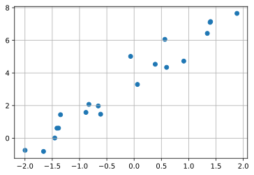
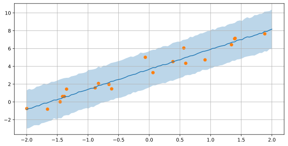

## top template

### 参考URL
- https://deepblue-ts.co.jp/%E7%B5%B1%E8%A8%88%E5%AD%A6/%E3%83%99%E3%82%A4%E3%82%BA%E7%B5%B1%E8%A8%88/pyro-try/

### github
- jupyter notebook形式のファイルは[こちら](https://github.com/hiroshi0530/wa-src/blob/master/article/library/scipy/template/template_nb.ipynb)

### google colaboratory
- google colaboratory で実行する場合は[こちら](https://colab.research.google.com/github/hiroshi0530/wa-src/blob/master/article/library/scipy/template/template_nb.ipynb)

### 筆者の環境
筆者のOSはmacOSです。LinuxやUnixのコマンドとはオプションが異なります。


```python
!sw_vers
```

    ProductName:	Mac OS X
    ProductVersion:	10.14.6
    BuildVersion:	18G6032


```python
!python -V
```

    Python 3.8.5


基本的なライブラリをインポートしそのバージョンを確認しておきます。


```python
%matplotlib inline
%config InlineBackend.figure_format = 'svg'

import matplotlib
import matplotlib.pyplot as plt
import scipy
import numpy as np

print('matplotlib version :', matplotlib.__version__)
print('scipy version :', scipy.__version__)
print('numpy version :', np.__version__)
```

    matplotlib version : 3.3.2
    scipy version : 1.5.2
    numpy version : 1.18.5


```python
import torch
import torch.distributions.constraints as constraints
import pyro 
import pyro.distributions as dist
```


```python
from pyro.infer.mcmc import MCMC
from pyro.infer.mcmc import NUTS
from pyro.optim import Adam
from pyro.infer import SVI
from pyro.infer import Trace_ELBO
from pyro.infer import Predictive
```


```python
print('torch version :', torch.__version__)
print('pyro version :', pyro.__version__)
```

    torch version : 1.7.0
    pyro version : 1.5.1


```python
x = np.random.uniform(-2,2,20)
y = 2 * x + 3 + np.random.normal(0,1,20)

plt.grid()
plt.scatter(x,y)
plt.show()
```





```python
x = torch.tensor(x)
y = torch.tensor(y)
```


```python
print('x type :', type(x))
print('y type :', type(y))
print('x shape :', x.shape)
print('y shape :', y.shape)
```

    x type : <class 'torch.Tensor'>
    y type : <class 'torch.Tensor'>
    x shape : torch.Size([20])
    y shape : torch.Size([20])


## MCMCサンプリング(NUTS)

### モデルの構築


```python
def model(x,y):
  a = pyro.sample('a', dist.Normal(0., 5.))
  b = pyro.sample('b', dist.Normal(0.,5.))
  y = pyro.sample('y', dist.Normal(a*x + b, 1.), obs=y)
  return y
```


```python
nuts_kernel = NUTS(model, adapt_step_size=True)
mcmc_run = MCMC(nuts_kernel, num_samples=1000, warmup_steps=1000)
mcmc_run.run(x, y)
```

    Sample: 100%|█████████████████████████████| 2000/2000 [00:10, 198.96it/s, step size=9.98e-01, acc. prob=0.877]


MCMCで得られたサンプルの取得


```python
posterior_a = mcmc_run.get_samples()['a']
posterior_b = mcmc_run.get_samples()['b']
```


```python
print(posterior_a[:20])
```

    tensor([2.8355, 2.7370, 2.7370, 2.0700, 2.1688, 2.4700, 1.9804, 2.4388, 2.4116,
            2.4116, 2.2302, 2.2365, 2.3438, 2.2297, 2.2256, 2.1555, 2.2773, 2.2274,
            2.2664, 2.2103], dtype=torch.float64)


```python
print(posterior_b[:20])
```

    tensor([3.5353, 3.6787, 3.6787, 3.6408, 4.0378, 3.7112, 3.5571, 3.2672, 3.5452,
            3.5452, 3.5789, 3.5862, 3.7441, 3.5808, 3.6269, 3.3852, 3.9679, 3.3639,
            3.8180, 3.5705], dtype=torch.float64)


次にこのサンプルを用いた予測分布の計算を行います。
こちらも関数一つで予測分布の計算が行えるので簡単です。


```python
pred = Predictive(model,{'a':posterior_a,'b':posterior_b},return_sites=["y"])
```


```python
x_ = np.linspace(-2,2,100)
y_ = pred.get_samples(torch.tensor(x_),None)['y']
```


```python
y_mean = y_.mean(0)
y_std = y_.std(0)
plt.figure(figsize=(10,5))
plt.plot(x_,y_mean)
plt.fill_between(x_,y_mean-y_std*2,y_mean+y_std*2,alpha=0.3)
plt.grid()
plt.scatter(x,y)
plt.show()
```





## 変分推論


```python
def guide(x,y):
  a_loc = pyro.param('a_loc',torch.tensor(0.))
  b_loc = pyro.param('b_loc',torch.tensor(0.))
  a_scale = pyro.param('a_scale',torch.tensor(1.),constraints.positive)
  b_scale = pyro.param('b_scale',torch.tensor(1.),constraints.positive)
  pyro.sample('a',dist.Normal(a_loc,a_scale))
  pyro.sample('b',dist.Normal(b_loc,b_scale))
```


```python
adam_params = {"lr": 0.001, "betas": (0.90, 0.999)}
optimizer = Adam(adam_params)

# setup the inference algorithm
svi = SVI(model, guide, optimizer, loss=Trace_ELBO())

n_steps = 1000
# do gradient steps
for step in range(n_steps):
  svi.step(x, y)
```


```python
for name in pyro.get_param_store():
  print(name + ':{}'.format(pyro.param(name)))
```

    a_loc:0.7868573069572449
    b_loc:0.906243085861206
    a_scale:0.7018969058990479
    b_scale:0.8006583452224731


```python
y_pred = Predictive(model=model,guide=guide,num_samples=1000,return_sites=["y"])
```


```python
x_ = torch.tensor(np.linspace(-2,2,100))
y_ = y_pred.get_samples(x_,None)
```


```python
y_mean = y_['y'].mean(0).detach()
y_std = y_['y'].std(0).detach()
plt.figure(figsize=(10,5))
plt.plot(x_,y_mean)
plt.fill_between(x_,y_mean-y_std*2,y_mean+y_std*2,alpha=0.3)
plt.grid()
plt.scatter(x,y)
plt.show()
```


```python
# aについて
a = np.random.normal(pyro.param('a_loc').detach().numpy(),
                     pyro.param('a_scale').detach().numpy(),1000)
plt.hist(a,density=True,bins=50)
plt.grid()
plt.hist(posterior_a,density=True,alpha=0.5,bins=50)
plt.show()
```


```python
# bについて
b = np.random.normal(pyro.param('b_loc').detach().numpy(),
                     pyro.param('b_scale').detach().numpy(),1000)
plt.hist(b,density=True,bins=50)
plt.grid()
plt.hist(posterior_b,density=True,alpha=0.5,bins=50)
plt.show()
```


    ---------------------------------------------------------------------------

    KeyboardInterrupt                         Traceback (most recent call last)

    <ipython-input-26-66b56ce6f808> in <module>
          3                      pyro.param('b_scale').detach().numpy(),1000)
          4 plt.hist(b,density=True,bins=50)
    ----> 5 plt.hist(posterior_b,density=True,alpha=0.5,bins=50)
          6 plt.show()


    ~/anaconda3/lib/python3.8/site-packages/matplotlib/pyplot.py in hist(x, bins, range, density, weights, cumulative, bottom, histtype, align, orientation, rwidth, log, color, label, stacked, data, **kwargs)
       2683         orientation='vertical', rwidth=None, log=False, color=None,
       2684         label=None, stacked=False, *, data=None, **kwargs):
    -> 2685     return gca().hist(
       2686         x, bins=bins, range=range, density=density, weights=weights,
       2687         cumulative=cumulative, bottom=bottom, histtype=histtype,


    ~/anaconda3/lib/python3.8/site-packages/matplotlib/__init__.py in inner(ax, data, *args, **kwargs)
       1436     def inner(ax, *args, data=None, **kwargs):
       1437         if data is None:
    -> 1438             return func(ax, *map(sanitize_sequence, args), **kwargs)
       1439 
       1440         bound = new_sig.bind(ax, *args, **kwargs)


    ~/anaconda3/lib/python3.8/site-packages/matplotlib/axes/_axes.py in hist(self, x, bins, range, density, weights, cumulative, bottom, histtype, align, orientation, rwidth, log, color, label, stacked, **kwargs)
       6721                 else:
       6722                     height = m
    -> 6723                 bars = _barfunc(bins[:-1]+boffset, height, width,
       6724                                 align='center', log=log,
       6725                                 color=c, **{bottom_kwarg: bottom})


    ~/anaconda3/lib/python3.8/site-packages/matplotlib/__init__.py in inner(ax, data, *args, **kwargs)
       1436     def inner(ax, *args, data=None, **kwargs):
       1437         if data is None:
    -> 1438             return func(ax, *map(sanitize_sequence, args), **kwargs)
       1439 
       1440         bound = new_sig.bind(ax, *args, **kwargs)


    ~/anaconda3/lib/python3.8/site-packages/matplotlib/axes/_axes.py in bar(self, x, height, width, bottom, align, **kwargs)
       2479         args = zip(left, bottom, width, height, color, edgecolor, linewidth)
       2480         for l, b, w, h, c, e, lw in args:
    -> 2481             r = mpatches.Rectangle(
       2482                 xy=(l, b), width=w, height=h,
       2483                 facecolor=c,


    ~/anaconda3/lib/python3.8/site-packages/matplotlib/patches.py in __init__(self, xy, width, height, angle, **kwargs)
        740         """
        741 
    --> 742         Patch.__init__(self, **kwargs)
        743 
        744         self._x0 = xy[0]


    ~/anaconda3/lib/python3.8/site-packages/matplotlib/patches.py in __init__(self, edgecolor, facecolor, color, linewidth, linestyle, antialiased, hatch, fill, capstyle, joinstyle, **kwargs)
         56         %(Patch)s
         57         """
    ---> 58         artist.Artist.__init__(self)
         59 
         60         if linewidth is None:


    ~/anaconda3/lib/python3.8/site-packages/matplotlib/artist.py in __init__(self)
        103         self._sketch = mpl.rcParams['path.sketch']
        104         self._path_effects = mpl.rcParams['path.effects']
    --> 105         self._sticky_edges = _XYPair([], [])
        106         self._in_layout = True
        107 


    KeyboardInterrupt: 


    Error in callback <function flush_figures at 0x117e7d4c0> (for post_execute):


    ---------------------------------------------------------------------------

    KeyboardInterrupt                         Traceback (most recent call last)

    ~/anaconda3/lib/python3.8/site-packages/ipykernel/pylab/backend_inline.py in flush_figures()
        119         # ignore the tracking, just draw and close all figures
        120         try:
    --> 121             return show(True)
        122         except Exception as e:
        123             # safely show traceback if in IPython, else raise


    ~/anaconda3/lib/python3.8/site-packages/ipykernel/pylab/backend_inline.py in show(close, block)
         39     try:
         40         for figure_manager in Gcf.get_all_fig_managers():
    ---> 41             display(
         42                 figure_manager.canvas.figure,
         43                 metadata=_fetch_figure_metadata(figure_manager.canvas.figure)


    ~/anaconda3/lib/python3.8/site-packages/IPython/core/display.py in display(include, exclude, metadata, transient, display_id, *objs, **kwargs)
        311             publish_display_data(data=obj, metadata=metadata, **kwargs)
        312         else:
    --> 313             format_dict, md_dict = format(obj, include=include, exclude=exclude)
        314             if not format_dict:
        315                 # nothing to display (e.g. _ipython_display_ took over)


    ~/anaconda3/lib/python3.8/site-packages/IPython/core/formatters.py in format(self, obj, include, exclude)
        178             md = None
        179             try:
    --> 180                 data = formatter(obj)
        181             except:
        182                 # FIXME: log the exception


    <decorator-gen-2> in __call__(self, obj)


    ~/anaconda3/lib/python3.8/site-packages/IPython/core/formatters.py in catch_format_error(method, self, *args, **kwargs)
        222     """show traceback on failed format call"""
        223     try:
    --> 224         r = method(self, *args, **kwargs)
        225     except NotImplementedError:
        226         # don't warn on NotImplementedErrors


    ~/anaconda3/lib/python3.8/site-packages/IPython/core/formatters.py in __call__(self, obj)
        339                 pass
        340             else:
    --> 341                 return printer(obj)
        342             # Finally look for special method names
        343             method = get_real_method(obj, self.print_method)


    ~/anaconda3/lib/python3.8/site-packages/IPython/core/pylabtools.py in <lambda>(fig)
        252         jpg_formatter.for_type(Figure, lambda fig: print_figure(fig, 'jpg', **kwargs))
        253     if 'svg' in formats:
    --> 254         svg_formatter.for_type(Figure, lambda fig: print_figure(fig, 'svg', **kwargs))
        255     if 'pdf' in formats:
        256         pdf_formatter.for_type(Figure, lambda fig: print_figure(fig, 'pdf', **kwargs))


    ~/anaconda3/lib/python3.8/site-packages/IPython/core/pylabtools.py in print_figure(fig, fmt, bbox_inches, **kwargs)
        130         FigureCanvasBase(fig)
        131 
    --> 132     fig.canvas.print_figure(bytes_io, **kw)
        133     data = bytes_io.getvalue()
        134     if fmt == 'svg':


    ~/anaconda3/lib/python3.8/site-packages/matplotlib/backend_bases.py in print_figure(self, filename, dpi, facecolor, edgecolor, orientation, format, bbox_inches, pad_inches, bbox_extra_artists, backend, **kwargs)
       2208 
       2209             try:
    -> 2210                 result = print_method(
       2211                     filename,
       2212                     dpi=dpi,


    ~/anaconda3/lib/python3.8/site-packages/matplotlib/backends/backend_svg.py in print_svg(self, filename, *args, **kwargs)
       1327                 detach = True
       1328 
    -> 1329             self._print_svg(filename, fh, **kwargs)
       1330 
       1331             # Detach underlying stream from wrapper so that it remains open in


    ~/anaconda3/lib/python3.8/site-packages/matplotlib/backend_bases.py in wrapper(*args, **kwargs)
       1637             kwargs.pop(arg)
       1638 
    -> 1639         return func(*args, **kwargs)
       1640 
       1641     return wrapper


    ~/anaconda3/lib/python3.8/site-packages/matplotlib/backends/backend_svg.py in _print_svg(self, filename, fh, dpi, bbox_inches_restore, metadata)
       1351             bbox_inches_restore=bbox_inches_restore)
       1352 
    -> 1353         self.figure.draw(renderer)
       1354         renderer.finalize()
       1355 


    ~/anaconda3/lib/python3.8/site-packages/matplotlib/artist.py in draw_wrapper(artist, renderer, *args, **kwargs)
         39                 renderer.start_filter()
         40 
    ---> 41             return draw(artist, renderer, *args, **kwargs)
         42         finally:
         43             if artist.get_agg_filter() is not None:


    ~/anaconda3/lib/python3.8/site-packages/matplotlib/figure.py in draw(self, renderer)
       1861 
       1862             self.patch.draw(renderer)
    -> 1863             mimage._draw_list_compositing_images(
       1864                 renderer, self, artists, self.suppressComposite)
       1865 


    ~/anaconda3/lib/python3.8/site-packages/matplotlib/image.py in _draw_list_compositing_images(renderer, parent, artists, suppress_composite)
        129     if not_composite or not has_images:
        130         for a in artists:
    --> 131             a.draw(renderer)
        132     else:
        133         # Composite any adjacent images together


    ~/anaconda3/lib/python3.8/site-packages/matplotlib/artist.py in draw_wrapper(artist, renderer, *args, **kwargs)
         39                 renderer.start_filter()
         40 
    ---> 41             return draw(artist, renderer, *args, **kwargs)
         42         finally:
         43             if artist.get_agg_filter() is not None:


    ~/anaconda3/lib/python3.8/site-packages/matplotlib/cbook/deprecation.py in wrapper(*inner_args, **inner_kwargs)
        409                          else deprecation_addendum,
        410                 **kwargs)
    --> 411         return func(*inner_args, **inner_kwargs)
        412 
        413     return wrapper


    ~/anaconda3/lib/python3.8/site-packages/matplotlib/axes/_base.py in draw(self, renderer, inframe)
       2745             renderer.stop_rasterizing()
       2746 
    -> 2747         mimage._draw_list_compositing_images(renderer, self, artists)
       2748 
       2749         renderer.close_group('axes')


    ~/anaconda3/lib/python3.8/site-packages/matplotlib/image.py in _draw_list_compositing_images(renderer, parent, artists, suppress_composite)
        129     if not_composite or not has_images:
        130         for a in artists:
    --> 131             a.draw(renderer)
        132     else:
        133         # Composite any adjacent images together


    ~/anaconda3/lib/python3.8/site-packages/matplotlib/artist.py in draw_wrapper(artist, renderer, *args, **kwargs)
         39                 renderer.start_filter()
         40 
    ---> 41             return draw(artist, renderer, *args, **kwargs)
         42         finally:
         43             if artist.get_agg_filter() is not None:


    ~/anaconda3/lib/python3.8/site-packages/matplotlib/patches.py in draw(self, renderer)
        579             return
        580         # Patch has traditionally ignored the dashoffset.
    --> 581         with cbook._setattr_cm(self, _dashoffset=0), \
        582                 self._bind_draw_path_function(renderer) as draw_path:
        583             path = self.get_path()


    ~/anaconda3/lib/python3.8/contextlib.py in __enter__(self)
        111         del self.args, self.kwds, self.func
        112         try:
    --> 113             return next(self.gen)
        114         except StopIteration:
        115             raise RuntimeError("generator didn't yield") from None


    ~/anaconda3/lib/python3.8/site-packages/matplotlib/patches.py in _bind_draw_path_function(self, renderer)
        546 
        547         gc.set_antialiased(self._antialiased)
    --> 548         self._set_gc_clip(gc)
        549         gc.set_url(self._url)
        550         gc.set_snap(self.get_snap())


    ~/anaconda3/lib/python3.8/site-packages/matplotlib/artist.py in _set_gc_clip(self, gc)
        853             if self.clipbox is not None:
        854                 gc.set_clip_rectangle(self.clipbox)
    --> 855             gc.set_clip_path(self._clippath)
        856         else:
        857             gc.set_clip_rectangle(None)


    ~/anaconda3/lib/python3.8/site-packages/matplotlib/backend_bases.py in set_clip_path(self, path)
        906         path : `~matplotlib.transforms.TransformedPath` or None
        907         """
    --> 908         cbook._check_isinstance((transforms.TransformedPath, None), path=path)
        909         self._clippath = path
        910 


    ~/anaconda3/lib/python3.8/site-packages/matplotlib/cbook/__init__.py in _check_isinstance(_types, **kwargs)
       2229     """
       2230     types = _types
    -> 2231     if isinstance(types, type) or types is None:
       2232         types = (types,)
       2233     none_allowed = None in types


    KeyboardInterrupt: 


## まとめ


```python

```


```python

```


```python

```
