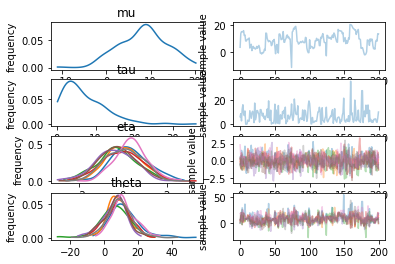

## python + stan によるベイズモデリングの基礎

pythonとstan を用いて改めて1からベイズモデリングを勉強してみようと思います。

### github
- jupyter notebook形式のファイルは[こちら](https://github.com/hiroshi0530/wa-src/tree/master/ml/lec/text/lstm_stock/lstm_nb.ipynb)

### google colaboratory
- google colaboratory で実行する場合は[こちら](https://colab.research.google.com/github/hiroshi0530/wa-src/tree/master/ml/lec/text/lstm_stock/lstm_nb.ipynb)

### 筆者の環境
筆者のOSはmacOSです。LinuxやUnixのコマンドとはオプションが異なります。


```python
!sw_vers
```

    ProductName:	Mac OS X
    ProductVersion:	10.14.6
    BuildVersion:	18G6020


```python
!python -V
```

    Python 3.6.12 :: Anaconda, Inc.


基本的なライブラリとkerasをインポートしそのバージョンを確認しておきます。


```python
%matplotlib inline
%config InlineBackend.figure_format = 'svg'

import matplotlib
import matplotlib.pyplot as plt
import scipy
import numpy as np
import pandas as pd

print('matplotlib version :', matplotlib.__version__)
print('scipy version :', scipy.__version__)
print('numpy version :', np.__version__)
```


    ---------------------------------------------------------------------------

    ModuleNotFoundError                       Traceback (most recent call last)

    <ipython-input-3-07c72ef8ac7f> in <module>
          8 import pandas as pd
          9 
    ---> 10 import tensorflow as tf
         11 from tensorflow import keras
         12 


    ModuleNotFoundError: No module named 'tensorflow'


```python
import pystan
import matplotlib.pyplot as plt

schools_dat = {
 'J': 8,
 'y': [28,  8, -3,  7, -1,  1, 18, 12],
 'sigma': [15, 10, 16, 11,  9, 11, 10, 18]
}

fit = pystan.stan(file='8schools.stan', data=schools_dat, iter=100, chains=4)
print(fit)
f!sw_vers

!python -V

基本的なライブラリとkerasをインポートしそのバージョンを確認しておきます。

%matplotlib inline
%config InlineBackend.figure_format = 'svg'

import matplotlib
import matplotlib.pyplot as plt
import scipy
import numpy as np
import pandas as pd

import tensorflow as tf
from tensorflow import keras

print('matplotlib version :', matplotlib.__version__)
print('scipy version :', scipy.__version__)
print('numpy version :', np.__version__)
print('tensorflow version : ', tf.__version__)
print('keras version : ', keras.__version__)it.plot()
fit.plot()
plt.show()
```

    WARNING:pystan:DeprecationWarning: pystan.stan was deprecated in version 2.17 and will be removed in version 3.0. Compile and use a Stan program in separate steps.
    INFO:pystan:COMPILING THE C++ CODE FOR MODEL anon_model_286b3180dfa752c4cfedaf0241add0e4 NOW.
    WARNING:pystan:Rhat above 1.1 or below 0.9 indicates that the chains very likely have not mixed
    WARNING:pystan:Deprecation warning. In future, use ArviZ library (`pip install arviz`)


    Inference for Stan model: anon_model_286b3180dfa752c4cfedaf0241add0e4.
    4 chains, each with iter=100; warmup=50; thin=1; 
    post-warmup draws per chain=50, total post-warmup draws=200.
    
               mean se_mean     sd   2.5%    25%    50%    75%  97.5%  n_eff   Rhat
    mu         8.39    0.98   5.37  -1.27   4.31   8.57   12.2  18.76     30   1.15
    tau        7.03    0.46   5.71   0.29   2.87   5.43  10.35  20.73    154   0.99
    eta[1]     0.33    0.06   0.87  -1.16  -0.25    0.3   0.86   2.13    225   0.99
    eta[2]     0.03    0.04   0.82  -1.43  -0.52 2.5e-3   0.59    1.6    361   0.98
    eta[3]    -0.28    0.06   0.92  -2.16  -0.78   -0.3   0.31   1.48    208   1.02
    eta[4]  -9.3e-3    0.07   0.95  -1.92  -0.64   0.04   0.61   1.82    162    1.0
    eta[5]    -0.36    0.06   0.92  -2.27  -0.98  -0.38   0.25   1.25    245   0.99
    eta[6]    -0.23    0.05   0.82  -1.79  -0.82  -0.27   0.32   1.41    248    1.0
    eta[7]     0.38    0.06   0.74  -1.04  -0.06   0.34   0.79   1.95    155   1.03
    eta[8]     0.05    0.05   0.85  -1.56  -0.56   0.09   0.65   1.48    245   0.99
    theta[1]  12.22    0.84    9.1  -1.93   6.48  10.47  16.56  36.91    117   1.01
    theta[2]    8.4    0.69   6.56  -4.81   4.15   8.21  12.86  22.12     91   1.03
    theta[3]    6.3    0.87    8.7 -13.38   1.56   6.81  11.83  21.06    101   1.06
    theta[4]   8.25    0.65   7.23  -6.19   3.76   8.37  12.86  21.82    123   1.02
    theta[5]   5.73    0.92   6.87 -11.38   1.71   6.95  10.47  17.55     55   1.06
    theta[6]   6.97    0.81   6.94  -6.36   2.78   7.52  11.54  21.21     73   1.06
    theta[7]  11.86    0.74   7.09  -0.93   7.71  10.93  16.37  28.09     91   1.02
    theta[8]    9.2    0.82   7.77  -6.45   4.76   8.97  13.49  25.59     90   1.06
    lp__       -4.6    0.23   2.23  -9.34   -6.0   -4.3  -3.21  -0.58     96   1.05
    
    Samples were drawn using NUTS at Thu Jan  7 16:19:12 2021.
    For each parameter, n_eff is a crude measure of effective sample size,
    and Rhat is the potential scale reduction factor on split chains (at 
    convergence, Rhat=1).





```python

```
