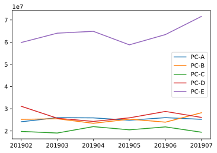

## 第1章 ウェブからの注文数を分析する10本ノック

### github
- githubのjupyter notebook形式のファイルは[こちら](https://github.com/hiroshi0530/wa-src/blob/master/ml/data100/01/01_nb.ipynb)

### 筆者の環境


```python
!sw_vers
!sw_vers
```

    ProductName:	Mac OS X
    ProductVersion:	10.14.6
    BuildVersion:	18G2022


```python
!python -V
```

    Python 3.7.3


## 解答

### 共通部分


```python
import pandas as pd
```

### ノック 1 : データを読み込んでみよう


```python
!ls -a | grep csv
```

    customer_master.csv
    item_master.csv
    transaction_1.csv
    transaction_2.csv
    transaction_detail_1.csv
    transaction_detail_2.csv


```python
!head -n 5 customer_master.csv
```

    customer_id,customer_name,registration_date,customer_name_kana,email,gender,age,birth,pref
    IK152942,平田 裕次郎,2019-01-01 00:25:33,ひらた ゆうじろう,hirata_yuujirou@example.com,M,29,1990/6/10,石川県
    TS808488,田村 詩織,2019-01-01 01:13:45,たむら しおり,tamura_shiori@example.com,F,33,1986/5/20,東京都
    AS834628,久野 由樹,2019-01-01 02:00:14,ひさの ゆき,hisano_yuki@example.com,F,63,1956/1/2,茨城県
    AS345469,鶴岡 薫,2019-01-01 04:48:22,つるおか かおる,tsuruoka_kaoru@example.com,M,74,1945/3/25,東京都


```python
master = pd.read_csv('customer_master.csv')
master.head()
```


<div>
<style scoped>
    .dataframe tbody tr th:only-of-type {
        vertical-align: middle;
    }

    .dataframe tbody tr th {
        vertical-align: top;
    }

    .dataframe thead th {
        text-align: right;
    }
</style>
<table border="1" class="dataframe">
  <thead>
    <tr style="text-align: right;">
      <th></th>
      <th>customer_id</th>
      <th>customer_name</th>
      <th>registration_date</th>
      <th>customer_name_kana</th>
      <th>email</th>
      <th>gender</th>
      <th>age</th>
      <th>birth</th>
      <th>pref</th>
    </tr>
  </thead>
  <tbody>
    <tr>
      <th>0</th>
      <td>IK152942</td>
      <td>平田 裕次郎</td>
      <td>2019-01-01 00:25:33</td>
      <td>ひらた ゆうじろう</td>
      <td>hirata_yuujirou@example.com</td>
      <td>M</td>
      <td>29</td>
      <td>1990/6/10</td>
      <td>石川県</td>
    </tr>
    <tr>
      <th>1</th>
      <td>TS808488</td>
      <td>田村 詩織</td>
      <td>2019-01-01 01:13:45</td>
      <td>たむら しおり</td>
      <td>tamura_shiori@example.com</td>
      <td>F</td>
      <td>33</td>
      <td>1986/5/20</td>
      <td>東京都</td>
    </tr>
    <tr>
      <th>2</th>
      <td>AS834628</td>
      <td>久野 由樹</td>
      <td>2019-01-01 02:00:14</td>
      <td>ひさの ゆき</td>
      <td>hisano_yuki@example.com</td>
      <td>F</td>
      <td>63</td>
      <td>1956/1/2</td>
      <td>茨城県</td>
    </tr>
    <tr>
      <th>3</th>
      <td>AS345469</td>
      <td>鶴岡 薫</td>
      <td>2019-01-01 04:48:22</td>
      <td>つるおか かおる</td>
      <td>tsuruoka_kaoru@example.com</td>
      <td>M</td>
      <td>74</td>
      <td>1945/3/25</td>
      <td>東京都</td>
    </tr>
    <tr>
      <th>4</th>
      <td>GD892565</td>
      <td>大内 高史</td>
      <td>2019-01-01 04:54:51</td>
      <td>おおうち たかし</td>
      <td>oouchi_takashi@example.com</td>
      <td>M</td>
      <td>54</td>
      <td>1965/8/5</td>
      <td>千葉県</td>
    </tr>
  </tbody>
</table>
</div>


```python
item = pd.read_csv('item_master.csv')
item.head()
```


<div>
<style scoped>
    .dataframe tbody tr th:only-of-type {
        vertical-align: middle;
    }

    .dataframe tbody tr th {
        vertical-align: top;
    }

    .dataframe thead th {
        text-align: right;
    }
</style>
<table border="1" class="dataframe">
  <thead>
    <tr style="text-align: right;">
      <th></th>
      <th>item_id</th>
      <th>item_name</th>
      <th>item_price</th>
    </tr>
  </thead>
  <tbody>
    <tr>
      <th>0</th>
      <td>S001</td>
      <td>PC-A</td>
      <td>50000</td>
    </tr>
    <tr>
      <th>1</th>
      <td>S002</td>
      <td>PC-B</td>
      <td>85000</td>
    </tr>
    <tr>
      <th>2</th>
      <td>S003</td>
      <td>PC-C</td>
      <td>120000</td>
    </tr>
    <tr>
      <th>3</th>
      <td>S004</td>
      <td>PC-D</td>
      <td>180000</td>
    </tr>
    <tr>
      <th>4</th>
      <td>S005</td>
      <td>PC-E</td>
      <td>210000</td>
    </tr>
  </tbody>
</table>
</div>


```python
transaction_1 = pd.read_csv('transaction_1.csv')
transaction_1.head()
```


<div>
<style scoped>
    .dataframe tbody tr th:only-of-type {
        vertical-align: middle;
    }

    .dataframe tbody tr th {
        vertical-align: top;
    }

    .dataframe thead th {
        text-align: right;
    }
</style>
<table border="1" class="dataframe">
  <thead>
    <tr style="text-align: right;">
      <th></th>
      <th>transaction_id</th>
      <th>price</th>
      <th>payment_date</th>
      <th>customer_id</th>
    </tr>
  </thead>
  <tbody>
    <tr>
      <th>0</th>
      <td>T0000000113</td>
      <td>210000</td>
      <td>2019-02-01 01:36:57</td>
      <td>PL563502</td>
    </tr>
    <tr>
      <th>1</th>
      <td>T0000000114</td>
      <td>50000</td>
      <td>2019-02-01 01:37:23</td>
      <td>HD678019</td>
    </tr>
    <tr>
      <th>2</th>
      <td>T0000000115</td>
      <td>120000</td>
      <td>2019-02-01 02:34:19</td>
      <td>HD298120</td>
    </tr>
    <tr>
      <th>3</th>
      <td>T0000000116</td>
      <td>210000</td>
      <td>2019-02-01 02:47:23</td>
      <td>IK452215</td>
    </tr>
    <tr>
      <th>4</th>
      <td>T0000000117</td>
      <td>170000</td>
      <td>2019-02-01 04:33:46</td>
      <td>PL542865</td>
    </tr>
  </tbody>
</table>
</div>


```python
transaction_2 = pd.read_csv('transaction_2.csv')
transaction_2.head()
```


<div>
<style scoped>
    .dataframe tbody tr th:only-of-type {
        vertical-align: middle;
    }

    .dataframe tbody tr th {
        vertical-align: top;
    }

    .dataframe thead th {
        text-align: right;
    }
</style>
<table border="1" class="dataframe">
  <thead>
    <tr style="text-align: right;">
      <th></th>
      <th>transaction_id</th>
      <th>price</th>
      <th>payment_date</th>
      <th>customer_id</th>
    </tr>
  </thead>
  <tbody>
    <tr>
      <th>0</th>
      <td>T0000005113</td>
      <td>295000</td>
      <td>2019-06-15 07:20:27</td>
      <td>TS169261</td>
    </tr>
    <tr>
      <th>1</th>
      <td>T0000005114</td>
      <td>50000</td>
      <td>2019-06-15 07:35:47</td>
      <td>HI599892</td>
    </tr>
    <tr>
      <th>2</th>
      <td>T0000005115</td>
      <td>85000</td>
      <td>2019-06-15 07:56:36</td>
      <td>HI421757</td>
    </tr>
    <tr>
      <th>3</th>
      <td>T0000005116</td>
      <td>50000</td>
      <td>2019-06-15 08:40:55</td>
      <td>OA386378</td>
    </tr>
    <tr>
      <th>4</th>
      <td>T0000005117</td>
      <td>120000</td>
      <td>2019-06-15 08:44:23</td>
      <td>TS506913</td>
    </tr>
  </tbody>
</table>
</div>


```python
transaction_detail_1 = pd.read_csv('transaction_detail_1.csv')
transaction_detail_1.head()
```


<div>
<style scoped>
    .dataframe tbody tr th:only-of-type {
        vertical-align: middle;
    }

    .dataframe tbody tr th {
        vertical-align: top;
    }

    .dataframe thead th {
        text-align: right;
    }
</style>
<table border="1" class="dataframe">
  <thead>
    <tr style="text-align: right;">
      <th></th>
      <th>detail_id</th>
      <th>transaction_id</th>
      <th>item_id</th>
      <th>quantity</th>
    </tr>
  </thead>
  <tbody>
    <tr>
      <th>0</th>
      <td>0</td>
      <td>T0000000113</td>
      <td>S005</td>
      <td>1</td>
    </tr>
    <tr>
      <th>1</th>
      <td>1</td>
      <td>T0000000114</td>
      <td>S001</td>
      <td>1</td>
    </tr>
    <tr>
      <th>2</th>
      <td>2</td>
      <td>T0000000115</td>
      <td>S003</td>
      <td>1</td>
    </tr>
    <tr>
      <th>3</th>
      <td>3</td>
      <td>T0000000116</td>
      <td>S005</td>
      <td>1</td>
    </tr>
    <tr>
      <th>4</th>
      <td>4</td>
      <td>T0000000117</td>
      <td>S002</td>
      <td>2</td>
    </tr>
  </tbody>
</table>
</div>


### ノック 2 : データを結合（ユニオン）してみよう
データを縦方向に連結します。


```python
transaction_1 = pd.read_csv('transaction_1.csv')
transaction_1.tail()
```


<div>
<style scoped>
    .dataframe tbody tr th:only-of-type {
        vertical-align: middle;
    }

    .dataframe tbody tr th {
        vertical-align: top;
    }

    .dataframe thead th {
        text-align: right;
    }
</style>
<table border="1" class="dataframe">
  <thead>
    <tr style="text-align: right;">
      <th></th>
      <th>transaction_id</th>
      <th>price</th>
      <th>payment_date</th>
      <th>customer_id</th>
    </tr>
  </thead>
  <tbody>
    <tr>
      <th>4995</th>
      <td>T0000005108</td>
      <td>210000</td>
      <td>2019-06-15 02:42:41</td>
      <td>HD315748</td>
    </tr>
    <tr>
      <th>4996</th>
      <td>T0000005109</td>
      <td>150000</td>
      <td>2019-06-15 03:36:16</td>
      <td>HI215420</td>
    </tr>
    <tr>
      <th>4997</th>
      <td>T0000005110</td>
      <td>50000</td>
      <td>2019-06-15 03:44:06</td>
      <td>IK880102</td>
    </tr>
    <tr>
      <th>4998</th>
      <td>T0000005111</td>
      <td>210000</td>
      <td>2019-06-15 04:14:06</td>
      <td>IK074758</td>
    </tr>
    <tr>
      <th>4999</th>
      <td>T0000005112</td>
      <td>50000</td>
      <td>2019-06-15 04:42:38</td>
      <td>HD444151</td>
    </tr>
  </tbody>
</table>
</div>


```python
transaction_2 = pd.read_csv('transaction_2.csv')
transaction_2.head()
```


<div>
<style scoped>
    .dataframe tbody tr th:only-of-type {
        vertical-align: middle;
    }

    .dataframe tbody tr th {
        vertical-align: top;
    }

    .dataframe thead th {
        text-align: right;
    }
</style>
<table border="1" class="dataframe">
  <thead>
    <tr style="text-align: right;">
      <th></th>
      <th>transaction_id</th>
      <th>price</th>
      <th>payment_date</th>
      <th>customer_id</th>
    </tr>
  </thead>
  <tbody>
    <tr>
      <th>0</th>
      <td>T0000005113</td>
      <td>295000</td>
      <td>2019-06-15 07:20:27</td>
      <td>TS169261</td>
    </tr>
    <tr>
      <th>1</th>
      <td>T0000005114</td>
      <td>50000</td>
      <td>2019-06-15 07:35:47</td>
      <td>HI599892</td>
    </tr>
    <tr>
      <th>2</th>
      <td>T0000005115</td>
      <td>85000</td>
      <td>2019-06-15 07:56:36</td>
      <td>HI421757</td>
    </tr>
    <tr>
      <th>3</th>
      <td>T0000005116</td>
      <td>50000</td>
      <td>2019-06-15 08:40:55</td>
      <td>OA386378</td>
    </tr>
    <tr>
      <th>4</th>
      <td>T0000005117</td>
      <td>120000</td>
      <td>2019-06-15 08:44:23</td>
      <td>TS506913</td>
    </tr>
  </tbody>
</table>
</div>


transaction_1のtailとtrasaction_2が続いてる様に見えます。
データサイズを確認します


```python
print(transaction_1.shape)
print(transaction_2.shape)
```

    (5000, 4)
    (1786, 4)


```python
transaction = pd.concat([transaction_1, transaction_2], ignore_index=True)
transaction.head()
```


<div>
<style scoped>
    .dataframe tbody tr th:only-of-type {
        vertical-align: middle;
    }

    .dataframe tbody tr th {
        vertical-align: top;
    }

    .dataframe thead th {
        text-align: right;
    }
</style>
<table border="1" class="dataframe">
  <thead>
    <tr style="text-align: right;">
      <th></th>
      <th>transaction_id</th>
      <th>price</th>
      <th>payment_date</th>
      <th>customer_id</th>
    </tr>
  </thead>
  <tbody>
    <tr>
      <th>0</th>
      <td>T0000000113</td>
      <td>210000</td>
      <td>2019-02-01 01:36:57</td>
      <td>PL563502</td>
    </tr>
    <tr>
      <th>1</th>
      <td>T0000000114</td>
      <td>50000</td>
      <td>2019-02-01 01:37:23</td>
      <td>HD678019</td>
    </tr>
    <tr>
      <th>2</th>
      <td>T0000000115</td>
      <td>120000</td>
      <td>2019-02-01 02:34:19</td>
      <td>HD298120</td>
    </tr>
    <tr>
      <th>3</th>
      <td>T0000000116</td>
      <td>210000</td>
      <td>2019-02-01 02:47:23</td>
      <td>IK452215</td>
    </tr>
    <tr>
      <th>4</th>
      <td>T0000000117</td>
      <td>170000</td>
      <td>2019-02-01 04:33:46</td>
      <td>PL542865</td>
    </tr>
  </tbody>
</table>
</div>


```python
transaction.tail()
```


<div>
<style scoped>
    .dataframe tbody tr th:only-of-type {
        vertical-align: middle;
    }

    .dataframe tbody tr th {
        vertical-align: top;
    }

    .dataframe thead th {
        text-align: right;
    }
</style>
<table border="1" class="dataframe">
  <thead>
    <tr style="text-align: right;">
      <th></th>
      <th>transaction_id</th>
      <th>price</th>
      <th>payment_date</th>
      <th>customer_id</th>
    </tr>
  </thead>
  <tbody>
    <tr>
      <th>6781</th>
      <td>T0000006894</td>
      <td>180000</td>
      <td>2019-07-31 21:20:44</td>
      <td>HI400734</td>
    </tr>
    <tr>
      <th>6782</th>
      <td>T0000006895</td>
      <td>85000</td>
      <td>2019-07-31 21:52:48</td>
      <td>AS339451</td>
    </tr>
    <tr>
      <th>6783</th>
      <td>T0000006896</td>
      <td>100000</td>
      <td>2019-07-31 23:35:25</td>
      <td>OA027325</td>
    </tr>
    <tr>
      <th>6784</th>
      <td>T0000006897</td>
      <td>85000</td>
      <td>2019-07-31 23:39:35</td>
      <td>TS624738</td>
    </tr>
    <tr>
      <th>6785</th>
      <td>T0000006898</td>
      <td>85000</td>
      <td>2019-07-31 23:41:38</td>
      <td>AS834214</td>
    </tr>
  </tbody>
</table>
</div>


```python
print(transaction.shape)
```

    (6786, 4)


transaction_detailも結合します。


```python
transaction_detail_1 = pd.read_csv('transaction_detail_1.csv')
transaction_detail_1.head()
```


<div>
<style scoped>
    .dataframe tbody tr th:only-of-type {
        vertical-align: middle;
    }

    .dataframe tbody tr th {
        vertical-align: top;
    }

    .dataframe thead th {
        text-align: right;
    }
</style>
<table border="1" class="dataframe">
  <thead>
    <tr style="text-align: right;">
      <th></th>
      <th>detail_id</th>
      <th>transaction_id</th>
      <th>item_id</th>
      <th>quantity</th>
    </tr>
  </thead>
  <tbody>
    <tr>
      <th>0</th>
      <td>0</td>
      <td>T0000000113</td>
      <td>S005</td>
      <td>1</td>
    </tr>
    <tr>
      <th>1</th>
      <td>1</td>
      <td>T0000000114</td>
      <td>S001</td>
      <td>1</td>
    </tr>
    <tr>
      <th>2</th>
      <td>2</td>
      <td>T0000000115</td>
      <td>S003</td>
      <td>1</td>
    </tr>
    <tr>
      <th>3</th>
      <td>3</td>
      <td>T0000000116</td>
      <td>S005</td>
      <td>1</td>
    </tr>
    <tr>
      <th>4</th>
      <td>4</td>
      <td>T0000000117</td>
      <td>S002</td>
      <td>2</td>
    </tr>
  </tbody>
</table>
</div>


```python
transaction_detail_2 = pd.read_csv('transaction_detail_2.csv')
transaction_detail_2.head()
```


<div>
<style scoped>
    .dataframe tbody tr th:only-of-type {
        vertical-align: middle;
    }

    .dataframe tbody tr th {
        vertical-align: top;
    }

    .dataframe thead th {
        text-align: right;
    }
</style>
<table border="1" class="dataframe">
  <thead>
    <tr style="text-align: right;">
      <th></th>
      <th>detail_id</th>
      <th>transaction_id</th>
      <th>item_id</th>
      <th>quantity</th>
    </tr>
  </thead>
  <tbody>
    <tr>
      <th>0</th>
      <td>5000</td>
      <td>T0000004870</td>
      <td>S002</td>
      <td>3</td>
    </tr>
    <tr>
      <th>1</th>
      <td>5001</td>
      <td>T0000004871</td>
      <td>S003</td>
      <td>1</td>
    </tr>
    <tr>
      <th>2</th>
      <td>5002</td>
      <td>T0000004872</td>
      <td>S001</td>
      <td>2</td>
    </tr>
    <tr>
      <th>3</th>
      <td>5003</td>
      <td>T0000004873</td>
      <td>S004</td>
      <td>1</td>
    </tr>
    <tr>
      <th>4</th>
      <td>5004</td>
      <td>T0000004874</td>
      <td>S003</td>
      <td>2</td>
    </tr>
  </tbody>
</table>
</div>


```python
transaction_detail = pd.concat([transaction_detail_1, transaction_detail_2], ignore_index=True)
transaction_detail.head()
```


<div>
<style scoped>
    .dataframe tbody tr th:only-of-type {
        vertical-align: middle;
    }

    .dataframe tbody tr th {
        vertical-align: top;
    }

    .dataframe thead th {
        text-align: right;
    }
</style>
<table border="1" class="dataframe">
  <thead>
    <tr style="text-align: right;">
      <th></th>
      <th>detail_id</th>
      <th>transaction_id</th>
      <th>item_id</th>
      <th>quantity</th>
    </tr>
  </thead>
  <tbody>
    <tr>
      <th>0</th>
      <td>0</td>
      <td>T0000000113</td>
      <td>S005</td>
      <td>1</td>
    </tr>
    <tr>
      <th>1</th>
      <td>1</td>
      <td>T0000000114</td>
      <td>S001</td>
      <td>1</td>
    </tr>
    <tr>
      <th>2</th>
      <td>2</td>
      <td>T0000000115</td>
      <td>S003</td>
      <td>1</td>
    </tr>
    <tr>
      <th>3</th>
      <td>3</td>
      <td>T0000000116</td>
      <td>S005</td>
      <td>1</td>
    </tr>
    <tr>
      <th>4</th>
      <td>4</td>
      <td>T0000000117</td>
      <td>S002</td>
      <td>2</td>
    </tr>
  </tbody>
</table>
</div>


```python
transaction_detail.shape
```


    (7144, 4)


### ノック 3 : 売上データ同士を結合してみよう

横方向の結合（ジョイン）します。


```python
join_data = pd.merge(transaction_detail, transaction[['transaction_id', 'payment_date', 'customer_id']], on='transaction_id', how='left')
join_data.head()
```


<div>
<style scoped>
    .dataframe tbody tr th:only-of-type {
        vertical-align: middle;
    }

    .dataframe tbody tr th {
        vertical-align: top;
    }

    .dataframe thead th {
        text-align: right;
    }
</style>
<table border="1" class="dataframe">
  <thead>
    <tr style="text-align: right;">
      <th></th>
      <th>detail_id</th>
      <th>transaction_id</th>
      <th>item_id</th>
      <th>quantity</th>
      <th>payment_date</th>
      <th>customer_id</th>
    </tr>
  </thead>
  <tbody>
    <tr>
      <th>0</th>
      <td>0</td>
      <td>T0000000113</td>
      <td>S005</td>
      <td>1</td>
      <td>2019-02-01 01:36:57</td>
      <td>PL563502</td>
    </tr>
    <tr>
      <th>1</th>
      <td>1</td>
      <td>T0000000114</td>
      <td>S001</td>
      <td>1</td>
      <td>2019-02-01 01:37:23</td>
      <td>HD678019</td>
    </tr>
    <tr>
      <th>2</th>
      <td>2</td>
      <td>T0000000115</td>
      <td>S003</td>
      <td>1</td>
      <td>2019-02-01 02:34:19</td>
      <td>HD298120</td>
    </tr>
    <tr>
      <th>3</th>
      <td>3</td>
      <td>T0000000116</td>
      <td>S005</td>
      <td>1</td>
      <td>2019-02-01 02:47:23</td>
      <td>IK452215</td>
    </tr>
    <tr>
      <th>4</th>
      <td>4</td>
      <td>T0000000117</td>
      <td>S002</td>
      <td>2</td>
      <td>2019-02-01 04:33:46</td>
      <td>PL542865</td>
    </tr>
  </tbody>
</table>
</div>


```python
join_data.shape
```


    (7144, 6)


### ノック 4 : マスターデータを結合してみよう


```python
join_data = pd.merge(join_data, master, on='customer_id', how='left')
join_data = pd.merge(join_data, item, on='item_id', how='left')
join_data.head()
```


<div>
<style scoped>
    .dataframe tbody tr th:only-of-type {
        vertical-align: middle;
    }

    .dataframe tbody tr th {
        vertical-align: top;
    }

    .dataframe thead th {
        text-align: right;
    }
</style>
<table border="1" class="dataframe">
  <thead>
    <tr style="text-align: right;">
      <th></th>
      <th>detail_id</th>
      <th>transaction_id</th>
      <th>item_id</th>
      <th>quantity</th>
      <th>payment_date</th>
      <th>customer_id</th>
      <th>customer_name</th>
      <th>registration_date</th>
      <th>customer_name_kana</th>
      <th>email</th>
      <th>gender</th>
      <th>age</th>
      <th>birth</th>
      <th>pref</th>
      <th>item_name</th>
      <th>item_price</th>
    </tr>
  </thead>
  <tbody>
    <tr>
      <th>0</th>
      <td>0</td>
      <td>T0000000113</td>
      <td>S005</td>
      <td>1</td>
      <td>2019-02-01 01:36:57</td>
      <td>PL563502</td>
      <td>井本 芳正</td>
      <td>2019-01-07 14:34:35</td>
      <td>いもと よしまさ</td>
      <td>imoto_yoshimasa@example.com</td>
      <td>M</td>
      <td>30</td>
      <td>1989/7/15</td>
      <td>熊本県</td>
      <td>PC-E</td>
      <td>210000</td>
    </tr>
    <tr>
      <th>1</th>
      <td>1</td>
      <td>T0000000114</td>
      <td>S001</td>
      <td>1</td>
      <td>2019-02-01 01:37:23</td>
      <td>HD678019</td>
      <td>三船 六郎</td>
      <td>2019-01-27 18:00:11</td>
      <td>みふね ろくろう</td>
      <td>mifune_rokurou@example.com</td>
      <td>M</td>
      <td>73</td>
      <td>1945/11/29</td>
      <td>京都府</td>
      <td>PC-A</td>
      <td>50000</td>
    </tr>
    <tr>
      <th>2</th>
      <td>2</td>
      <td>T0000000115</td>
      <td>S003</td>
      <td>1</td>
      <td>2019-02-01 02:34:19</td>
      <td>HD298120</td>
      <td>山根 小雁</td>
      <td>2019-01-11 08:16:02</td>
      <td>やまね こがん</td>
      <td>yamane_kogan@example.com</td>
      <td>M</td>
      <td>42</td>
      <td>1977/5/17</td>
      <td>茨城県</td>
      <td>PC-C</td>
      <td>120000</td>
    </tr>
    <tr>
      <th>3</th>
      <td>3</td>
      <td>T0000000116</td>
      <td>S005</td>
      <td>1</td>
      <td>2019-02-01 02:47:23</td>
      <td>IK452215</td>
      <td>池田 菜摘</td>
      <td>2019-01-10 05:07:38</td>
      <td>いけだ なつみ</td>
      <td>ikeda_natsumi@example.com</td>
      <td>F</td>
      <td>47</td>
      <td>1972/3/17</td>
      <td>兵庫県</td>
      <td>PC-E</td>
      <td>210000</td>
    </tr>
    <tr>
      <th>4</th>
      <td>4</td>
      <td>T0000000117</td>
      <td>S002</td>
      <td>2</td>
      <td>2019-02-01 04:33:46</td>
      <td>PL542865</td>
      <td>栗田 憲一</td>
      <td>2019-01-25 06:46:05</td>
      <td>くりた けんいち</td>
      <td>kurita_kenichi@example.com</td>
      <td>M</td>
      <td>74</td>
      <td>1944/12/17</td>
      <td>長崎県</td>
      <td>PC-B</td>
      <td>85000</td>
    </tr>
  </tbody>
</table>
</div>


### ノック 5 : 必要なデータ列を作ろう


```python
join_data['price'] = join_data['quantity'] * join_data['item_price']
join_data.head()
```


<div>
<style scoped>
    .dataframe tbody tr th:only-of-type {
        vertical-align: middle;
    }

    .dataframe tbody tr th {
        vertical-align: top;
    }

    .dataframe thead th {
        text-align: right;
    }
</style>
<table border="1" class="dataframe">
  <thead>
    <tr style="text-align: right;">
      <th></th>
      <th>detail_id</th>
      <th>transaction_id</th>
      <th>item_id</th>
      <th>quantity</th>
      <th>payment_date</th>
      <th>customer_id</th>
      <th>customer_name</th>
      <th>registration_date</th>
      <th>customer_name_kana</th>
      <th>email</th>
      <th>gender</th>
      <th>age</th>
      <th>birth</th>
      <th>pref</th>
      <th>item_name</th>
      <th>item_price</th>
      <th>price</th>
    </tr>
  </thead>
  <tbody>
    <tr>
      <th>0</th>
      <td>0</td>
      <td>T0000000113</td>
      <td>S005</td>
      <td>1</td>
      <td>2019-02-01 01:36:57</td>
      <td>PL563502</td>
      <td>井本 芳正</td>
      <td>2019-01-07 14:34:35</td>
      <td>いもと よしまさ</td>
      <td>imoto_yoshimasa@example.com</td>
      <td>M</td>
      <td>30</td>
      <td>1989/7/15</td>
      <td>熊本県</td>
      <td>PC-E</td>
      <td>210000</td>
      <td>210000</td>
    </tr>
    <tr>
      <th>1</th>
      <td>1</td>
      <td>T0000000114</td>
      <td>S001</td>
      <td>1</td>
      <td>2019-02-01 01:37:23</td>
      <td>HD678019</td>
      <td>三船 六郎</td>
      <td>2019-01-27 18:00:11</td>
      <td>みふね ろくろう</td>
      <td>mifune_rokurou@example.com</td>
      <td>M</td>
      <td>73</td>
      <td>1945/11/29</td>
      <td>京都府</td>
      <td>PC-A</td>
      <td>50000</td>
      <td>50000</td>
    </tr>
    <tr>
      <th>2</th>
      <td>2</td>
      <td>T0000000115</td>
      <td>S003</td>
      <td>1</td>
      <td>2019-02-01 02:34:19</td>
      <td>HD298120</td>
      <td>山根 小雁</td>
      <td>2019-01-11 08:16:02</td>
      <td>やまね こがん</td>
      <td>yamane_kogan@example.com</td>
      <td>M</td>
      <td>42</td>
      <td>1977/5/17</td>
      <td>茨城県</td>
      <td>PC-C</td>
      <td>120000</td>
      <td>120000</td>
    </tr>
    <tr>
      <th>3</th>
      <td>3</td>
      <td>T0000000116</td>
      <td>S005</td>
      <td>1</td>
      <td>2019-02-01 02:47:23</td>
      <td>IK452215</td>
      <td>池田 菜摘</td>
      <td>2019-01-10 05:07:38</td>
      <td>いけだ なつみ</td>
      <td>ikeda_natsumi@example.com</td>
      <td>F</td>
      <td>47</td>
      <td>1972/3/17</td>
      <td>兵庫県</td>
      <td>PC-E</td>
      <td>210000</td>
      <td>210000</td>
    </tr>
    <tr>
      <th>4</th>
      <td>4</td>
      <td>T0000000117</td>
      <td>S002</td>
      <td>2</td>
      <td>2019-02-01 04:33:46</td>
      <td>PL542865</td>
      <td>栗田 憲一</td>
      <td>2019-01-25 06:46:05</td>
      <td>くりた けんいち</td>
      <td>kurita_kenichi@example.com</td>
      <td>M</td>
      <td>74</td>
      <td>1944/12/17</td>
      <td>長崎県</td>
      <td>PC-B</td>
      <td>85000</td>
      <td>170000</td>
    </tr>
  </tbody>
</table>
</div>


### ノック 6 : データ検算をしよう


```python
join_data['price'].sum() == transaction['price'].sum()
```


    True


### ノック 7 : 各種統計量を把握しよう


```python
join_data.isnull().sum()
```


    detail_id             0
    transaction_id        0
    item_id               0
    quantity              0
    payment_date          0
    customer_id           0
    customer_name         0
    registration_date     0
    customer_name_kana    0
    email                 0
    gender                0
    age                   0
    birth                 0
    pref                  0
    item_name             0
    item_price            0
    price                 0
    dtype: int64


```python
join_data.describe()
```


<div>
<style scoped>
    .dataframe tbody tr th:only-of-type {
        vertical-align: middle;
    }

    .dataframe tbody tr th {
        vertical-align: top;
    }

    .dataframe thead th {
        text-align: right;
    }
</style>
<table border="1" class="dataframe">
  <thead>
    <tr style="text-align: right;">
      <th></th>
      <th>detail_id</th>
      <th>quantity</th>
      <th>age</th>
      <th>item_price</th>
      <th>price</th>
    </tr>
  </thead>
  <tbody>
    <tr>
      <th>count</th>
      <td>7144.000000</td>
      <td>7144.000000</td>
      <td>7144.000000</td>
      <td>7144.000000</td>
      <td>7144.000000</td>
    </tr>
    <tr>
      <th>mean</th>
      <td>3571.500000</td>
      <td>1.199888</td>
      <td>50.265677</td>
      <td>121698.628219</td>
      <td>135937.150056</td>
    </tr>
    <tr>
      <th>std</th>
      <td>2062.439494</td>
      <td>0.513647</td>
      <td>17.190314</td>
      <td>64571.311830</td>
      <td>68511.453297</td>
    </tr>
    <tr>
      <th>min</th>
      <td>0.000000</td>
      <td>1.000000</td>
      <td>20.000000</td>
      <td>50000.000000</td>
      <td>50000.000000</td>
    </tr>
    <tr>
      <th>25%</th>
      <td>1785.750000</td>
      <td>1.000000</td>
      <td>36.000000</td>
      <td>50000.000000</td>
      <td>85000.000000</td>
    </tr>
    <tr>
      <th>50%</th>
      <td>3571.500000</td>
      <td>1.000000</td>
      <td>50.000000</td>
      <td>102500.000000</td>
      <td>120000.000000</td>
    </tr>
    <tr>
      <th>75%</th>
      <td>5357.250000</td>
      <td>1.000000</td>
      <td>65.000000</td>
      <td>187500.000000</td>
      <td>210000.000000</td>
    </tr>
    <tr>
      <th>max</th>
      <td>7143.000000</td>
      <td>4.000000</td>
      <td>80.000000</td>
      <td>210000.000000</td>
      <td>420000.000000</td>
    </tr>
  </tbody>
</table>
</div>


### ノック 8 : 月別でデータを集計してみよう


```python
join_data.dtypes
```


    detail_id              int64
    transaction_id        object
    item_id               object
    quantity               int64
    payment_date          object
    customer_id           object
    customer_name         object
    registration_date     object
    customer_name_kana    object
    email                 object
    gender                object
    age                    int64
    birth                 object
    pref                  object
    item_name             object
    item_price             int64
    price                  int64
    dtype: object


payment_dataがobject型となっているので、datetime型に変更して、年ごとや月ごとの集計をしやすくします。


```python
join_data['payment_date'] = pd.to_datetime(join_data['payment_date'])
join_data['payment_month'] = join_data['payment_date'].dt.strftime('%Y%m')
join_data[['payment_date', 'payment_month']].head()
```


<div>
<style scoped>
    .dataframe tbody tr th:only-of-type {
        vertical-align: middle;
    }

    .dataframe tbody tr th {
        vertical-align: top;
    }

    .dataframe thead th {
        text-align: right;
    }
</style>
<table border="1" class="dataframe">
  <thead>
    <tr style="text-align: right;">
      <th></th>
      <th>payment_date</th>
      <th>payment_month</th>
    </tr>
  </thead>
  <tbody>
    <tr>
      <th>0</th>
      <td>2019-02-01 01:36:57</td>
      <td>201902</td>
    </tr>
    <tr>
      <th>1</th>
      <td>2019-02-01 01:37:23</td>
      <td>201902</td>
    </tr>
    <tr>
      <th>2</th>
      <td>2019-02-01 02:34:19</td>
      <td>201902</td>
    </tr>
    <tr>
      <th>3</th>
      <td>2019-02-01 02:47:23</td>
      <td>201902</td>
    </tr>
    <tr>
      <th>4</th>
      <td>2019-02-01 04:33:46</td>
      <td>201902</td>
    </tr>
  </tbody>
</table>
</div>


```python
join_data.groupby('payment_month').sum()['price']
```


    payment_month
    201902    160185000
    201903    160370000
    201904    160510000
    201905    155420000
    201906    164030000
    201907    170620000
    Name: price, dtype: int64


### ノック 9 : 月別、商品別でデータを集計してみよう


```python
join_data.groupby(['payment_month', 'item_name']).sum()[['price','quantity']]
```


<div>
<style scoped>
    .dataframe tbody tr th:only-of-type {
        vertical-align: middle;
    }

    .dataframe tbody tr th {
        vertical-align: top;
    }

    .dataframe thead th {
        text-align: right;
    }
</style>
<table border="1" class="dataframe">
  <thead>
    <tr style="text-align: right;">
      <th></th>
      <th></th>
      <th>price</th>
      <th>quantity</th>
    </tr>
    <tr>
      <th>payment_month</th>
      <th>item_name</th>
      <th></th>
      <th></th>
    </tr>
  </thead>
  <tbody>
    <tr>
      <th rowspan="5" valign="top">201902</th>
      <th>PC-A</th>
      <td>24150000</td>
      <td>483</td>
    </tr>
    <tr>
      <th>PC-B</th>
      <td>25245000</td>
      <td>297</td>
    </tr>
    <tr>
      <th>PC-C</th>
      <td>19800000</td>
      <td>165</td>
    </tr>
    <tr>
      <th>PC-D</th>
      <td>31140000</td>
      <td>173</td>
    </tr>
    <tr>
      <th>PC-E</th>
      <td>59850000</td>
      <td>285</td>
    </tr>
    <tr>
      <th rowspan="5" valign="top">201903</th>
      <th>PC-A</th>
      <td>26000000</td>
      <td>520</td>
    </tr>
    <tr>
      <th>PC-B</th>
      <td>25500000</td>
      <td>300</td>
    </tr>
    <tr>
      <th>PC-C</th>
      <td>19080000</td>
      <td>159</td>
    </tr>
    <tr>
      <th>PC-D</th>
      <td>25740000</td>
      <td>143</td>
    </tr>
    <tr>
      <th>PC-E</th>
      <td>64050000</td>
      <td>305</td>
    </tr>
    <tr>
      <th rowspan="5" valign="top">201904</th>
      <th>PC-A</th>
      <td>25900000</td>
      <td>518</td>
    </tr>
    <tr>
      <th>PC-B</th>
      <td>23460000</td>
      <td>276</td>
    </tr>
    <tr>
      <th>PC-C</th>
      <td>21960000</td>
      <td>183</td>
    </tr>
    <tr>
      <th>PC-D</th>
      <td>24300000</td>
      <td>135</td>
    </tr>
    <tr>
      <th>PC-E</th>
      <td>64890000</td>
      <td>309</td>
    </tr>
    <tr>
      <th rowspan="5" valign="top">201905</th>
      <th>PC-A</th>
      <td>24850000</td>
      <td>497</td>
    </tr>
    <tr>
      <th>PC-B</th>
      <td>25330000</td>
      <td>298</td>
    </tr>
    <tr>
      <th>PC-C</th>
      <td>20520000</td>
      <td>171</td>
    </tr>
    <tr>
      <th>PC-D</th>
      <td>25920000</td>
      <td>144</td>
    </tr>
    <tr>
      <th>PC-E</th>
      <td>58800000</td>
      <td>280</td>
    </tr>
    <tr>
      <th rowspan="5" valign="top">201906</th>
      <th>PC-A</th>
      <td>26000000</td>
      <td>520</td>
    </tr>
    <tr>
      <th>PC-B</th>
      <td>23970000</td>
      <td>282</td>
    </tr>
    <tr>
      <th>PC-C</th>
      <td>21840000</td>
      <td>182</td>
    </tr>
    <tr>
      <th>PC-D</th>
      <td>28800000</td>
      <td>160</td>
    </tr>
    <tr>
      <th>PC-E</th>
      <td>63420000</td>
      <td>302</td>
    </tr>
    <tr>
      <th rowspan="5" valign="top">201907</th>
      <th>PC-A</th>
      <td>25250000</td>
      <td>505</td>
    </tr>
    <tr>
      <th>PC-B</th>
      <td>28220000</td>
      <td>332</td>
    </tr>
    <tr>
      <th>PC-C</th>
      <td>19440000</td>
      <td>162</td>
    </tr>
    <tr>
      <th>PC-D</th>
      <td>26100000</td>
      <td>145</td>
    </tr>
    <tr>
      <th>PC-E</th>
      <td>71610000</td>
      <td>341</td>
    </tr>
  </tbody>
</table>
</div>


pivot_tableを利用して、見やすくします。


```python
pd.pivot_table(join_data, index='item_name', columns='payment_month', values=['price','quantity'], aggfunc='sum')    
```


<div>
<style scoped>
    .dataframe tbody tr th:only-of-type {
        vertical-align: middle;
    }

    .dataframe tbody tr th {
        vertical-align: top;
    }

    .dataframe thead tr th {
        text-align: left;
    }

    .dataframe thead tr:last-of-type th {
        text-align: right;
    }
</style>
<table border="1" class="dataframe">
  <thead>
    <tr>
      <th></th>
      <th colspan="6" halign="left">price</th>
      <th colspan="6" halign="left">quantity</th>
    </tr>
    <tr>
      <th>payment_month</th>
      <th>201902</th>
      <th>201903</th>
      <th>201904</th>
      <th>201905</th>
      <th>201906</th>
      <th>201907</th>
      <th>201902</th>
      <th>201903</th>
      <th>201904</th>
      <th>201905</th>
      <th>201906</th>
      <th>201907</th>
    </tr>
    <tr>
      <th>item_name</th>
      <th></th>
      <th></th>
      <th></th>
      <th></th>
      <th></th>
      <th></th>
      <th></th>
      <th></th>
      <th></th>
      <th></th>
      <th></th>
      <th></th>
    </tr>
  </thead>
  <tbody>
    <tr>
      <th>PC-A</th>
      <td>24150000</td>
      <td>26000000</td>
      <td>25900000</td>
      <td>24850000</td>
      <td>26000000</td>
      <td>25250000</td>
      <td>483</td>
      <td>520</td>
      <td>518</td>
      <td>497</td>
      <td>520</td>
      <td>505</td>
    </tr>
    <tr>
      <th>PC-B</th>
      <td>25245000</td>
      <td>25500000</td>
      <td>23460000</td>
      <td>25330000</td>
      <td>23970000</td>
      <td>28220000</td>
      <td>297</td>
      <td>300</td>
      <td>276</td>
      <td>298</td>
      <td>282</td>
      <td>332</td>
    </tr>
    <tr>
      <th>PC-C</th>
      <td>19800000</td>
      <td>19080000</td>
      <td>21960000</td>
      <td>20520000</td>
      <td>21840000</td>
      <td>19440000</td>
      <td>165</td>
      <td>159</td>
      <td>183</td>
      <td>171</td>
      <td>182</td>
      <td>162</td>
    </tr>
    <tr>
      <th>PC-D</th>
      <td>31140000</td>
      <td>25740000</td>
      <td>24300000</td>
      <td>25920000</td>
      <td>28800000</td>
      <td>26100000</td>
      <td>173</td>
      <td>143</td>
      <td>135</td>
      <td>144</td>
      <td>160</td>
      <td>145</td>
    </tr>
    <tr>
      <th>PC-E</th>
      <td>59850000</td>
      <td>64050000</td>
      <td>64890000</td>
      <td>58800000</td>
      <td>63420000</td>
      <td>71610000</td>
      <td>285</td>
      <td>305</td>
      <td>309</td>
      <td>280</td>
      <td>302</td>
      <td>341</td>
    </tr>
  </tbody>
</table>
</div>


### ノック 10 : 商品別の売上推移を可視化してみよう


```python
graph_data = pd.pivot_table(join_data, index='payment_month', columns='item_name', values='price', aggfunc='sum')   
graph_data.head()
```


<div>
<style scoped>
    .dataframe tbody tr th:only-of-type {
        vertical-align: middle;
    }

    .dataframe tbody tr th {
        vertical-align: top;
    }

    .dataframe thead th {
        text-align: right;
    }
</style>
<table border="1" class="dataframe">
  <thead>
    <tr style="text-align: right;">
      <th>item_name</th>
      <th>PC-A</th>
      <th>PC-B</th>
      <th>PC-C</th>
      <th>PC-D</th>
      <th>PC-E</th>
    </tr>
    <tr>
      <th>payment_month</th>
      <th></th>
      <th></th>
      <th></th>
      <th></th>
      <th></th>
    </tr>
  </thead>
  <tbody>
    <tr>
      <th>201902</th>
      <td>24150000</td>
      <td>25245000</td>
      <td>19800000</td>
      <td>31140000</td>
      <td>59850000</td>
    </tr>
    <tr>
      <th>201903</th>
      <td>26000000</td>
      <td>25500000</td>
      <td>19080000</td>
      <td>25740000</td>
      <td>64050000</td>
    </tr>
    <tr>
      <th>201904</th>
      <td>25900000</td>
      <td>23460000</td>
      <td>21960000</td>
      <td>24300000</td>
      <td>64890000</td>
    </tr>
    <tr>
      <th>201905</th>
      <td>24850000</td>
      <td>25330000</td>
      <td>20520000</td>
      <td>25920000</td>
      <td>58800000</td>
    </tr>
    <tr>
      <th>201906</th>
      <td>26000000</td>
      <td>23970000</td>
      <td>21840000</td>
      <td>28800000</td>
      <td>63420000</td>
    </tr>
  </tbody>
</table>
</div>


```python
import matplotlib.pyplot as plt
%matplotlib inline
%config InlineBackend.figure_format = 'svg'

plt.plot(list(graph_data.index), graph_data['PC-A'], label='PC-A')    
plt.plot(list(graph_data.index), graph_data['PC-B'], label='PC-B')    
plt.plot(list(graph_data.index), graph_data['PC-C'], label='PC-C')    
plt.plot(list(graph_data.index), graph_data['PC-D'], label='PC-D')    
plt.plot(list(graph_data.index), graph_data['PC-E'], label='PC-E')    

plt.legend()
```


    <matplotlib.legend.Legend at 0x1165fc4e0>





## 関連記事
- [第1章 ウェブからの注文数を分析する10本ノック](/ml/data100/01/)
- [第2章 小売店のデータでデータ加工を行う10本ノック](/ml/data100/02/)
- [第3章 顧客の全体像を把握する10本ノック](/ml/data100/03/)
- [第4章 顧客の行動を予測する10本ノック](/ml/data100/04/)
- [第5章 顧客の退会を予測する10本ノック](/ml/data100/05/)
- [第6章 物流の最適ルートをコンサルティングする10本ノック](/ml/data100/06/)
- [第7章 ロジスティクスネットワークの最適設計を行う10本ノック](/ml/data100/07/)
- [第8章 数値シミュレーションで消費者行動を予測する10本ノック](/ml/data100/08/)
- [第9章 潜在顧客を把握するための画像認識10本ノック](/ml/data100/09/)
- [第10章 アンケート分析を行うための自然言語処理10本ノック](/ml/data100/10/)
