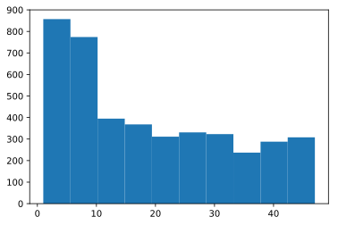

## 第3章 顧客の全体像を把握する10本ノック

この記事は[「Python実践データ分析100本ノック」](https://www.amazon.co.jp/dp/B07ZSGSN9S/ref=dp-kindle-redirect?_encoding=UTF8&btkr=1)の演習を実際にやってみたという内容になっています。今まで自己流でやってきましたが、一度他の方々がどのような考え方やコーディングをしているのか勉強してみようと思ってやってみました。本書は実際の業務に活用する上でとても参考になる内容だと思っています。データ分析に関わる仕事をしたい方にお勧めしたいです。

本演習で利用しているデータは本サイトからは利用できません。ぜひとも「Python実践データ分析１００本ノック」を購入し、本に沿ってダウンロードして自分の手でコーディングしてみてください。（私は決して回し者ではないので安心してください笑）

結果だけ載せました。正解かどうかは保障しません笑

### github
- jupyter notebook形式のファイルは[こちら](https://github.com/hiroshi0530/wa-src/blob/master/ml/data100/03/03_nb.ipynb)

### google colaboratory
- google colaboratory で実行する場合は[こちら](https://colab.research.google.com/github/hiroshi0530/wa-src/blob/master/ml/data100/03/03_nb.ipynb)

### 筆者の環境


```python
!sw_vers
```

    ProductName:	Mac OS X
    ProductVersion:	10.14.6
    BuildVersion:	18G6020


```python
!python -V
```

    Python 3.7.3


基本的なライブラリをインポートしそのバージョンを確認しておきます。


```python
%matplotlib inline
%config InlineBackend.figure_format = 'svg'

import matplotlib
import matplotlib.pyplot as plt
import scipy
import numpy as np
import pandas as pd

print('matplotlib version :', matplotlib.__version__)
print('scipy version :', scipy.__version__)
print('numpy version :', np.__version__)
print('pandas version :', pd.__version__)
```

    matplotlib version : 3.0.3
    scipy version : 1.4.1
    numpy version : 1.16.2
    pandas version : 1.0.3


## 解答

### ノック 21 : データを読み込んで把握しよう

利用履歴、顧客情報、会員区分、キャンディーズの各テーブルを読み込みます。


```python
uselog = pd.read_csv('use_log.csv') # 利用履歴
customer = pd.read_csv('customer_master.csv') # 顧客情報
class_master = pd.read_csv('class_master.csv') # 会員区分
campaign_master = pd.read_csv('campaign_master.csv') # キャンペーン区分

uselog.head()
```


<div>
<style scoped>
    .dataframe tbody tr th:only-of-type {
        vertical-align: middle;
    }

    .dataframe tbody tr th {
        vertical-align: top;
    }

    .dataframe thead th {
        text-align: right;
    }
</style>
<table border="1" class="dataframe">
  <thead>
    <tr style="text-align: right;">
      <th></th>
      <th>log_id</th>
      <th>customer_id</th>
      <th>usedate</th>
    </tr>
  </thead>
  <tbody>
    <tr>
      <th>0</th>
      <td>L00000049012330</td>
      <td>AS009373</td>
      <td>2018-04-01</td>
    </tr>
    <tr>
      <th>1</th>
      <td>L00000049012331</td>
      <td>AS015315</td>
      <td>2018-04-01</td>
    </tr>
    <tr>
      <th>2</th>
      <td>L00000049012332</td>
      <td>AS040841</td>
      <td>2018-04-01</td>
    </tr>
    <tr>
      <th>3</th>
      <td>L00000049012333</td>
      <td>AS046594</td>
      <td>2018-04-01</td>
    </tr>
    <tr>
      <th>4</th>
      <td>L00000049012334</td>
      <td>AS073285</td>
      <td>2018-04-01</td>
    </tr>
  </tbody>
</table>
</div>


```python
uselog.shape
```


    (197428, 3)


```python
customer.head()
```


<div>
<style scoped>
    .dataframe tbody tr th:only-of-type {
        vertical-align: middle;
    }

    .dataframe tbody tr th {
        vertical-align: top;
    }

    .dataframe thead th {
        text-align: right;
    }
</style>
<table border="1" class="dataframe">
  <thead>
    <tr style="text-align: right;">
      <th></th>
      <th>customer_id</th>
      <th>name</th>
      <th>class</th>
      <th>gender</th>
      <th>start_date</th>
      <th>end_date</th>
      <th>campaign_id</th>
      <th>is_deleted</th>
    </tr>
  </thead>
  <tbody>
    <tr>
      <th>0</th>
      <td>OA832399</td>
      <td>XXXX</td>
      <td>C01</td>
      <td>F</td>
      <td>2015-05-01 00:00:00</td>
      <td>NaN</td>
      <td>CA1</td>
      <td>0</td>
    </tr>
    <tr>
      <th>1</th>
      <td>PL270116</td>
      <td>XXXXX</td>
      <td>C01</td>
      <td>M</td>
      <td>2015-05-01 00:00:00</td>
      <td>NaN</td>
      <td>CA1</td>
      <td>0</td>
    </tr>
    <tr>
      <th>2</th>
      <td>OA974876</td>
      <td>XXXXX</td>
      <td>C01</td>
      <td>M</td>
      <td>2015-05-01 00:00:00</td>
      <td>NaN</td>
      <td>CA1</td>
      <td>0</td>
    </tr>
    <tr>
      <th>3</th>
      <td>HD024127</td>
      <td>XXXXX</td>
      <td>C01</td>
      <td>F</td>
      <td>2015-05-01 00:00:00</td>
      <td>NaN</td>
      <td>CA1</td>
      <td>0</td>
    </tr>
    <tr>
      <th>4</th>
      <td>HD661448</td>
      <td>XXXXX</td>
      <td>C03</td>
      <td>F</td>
      <td>2015-05-01 00:00:00</td>
      <td>NaN</td>
      <td>CA1</td>
      <td>0</td>
    </tr>
  </tbody>
</table>
</div>


```python
customer.shape
```


    (4192, 8)


```python
class_master.head()
```


<div>
<style scoped>
    .dataframe tbody tr th:only-of-type {
        vertical-align: middle;
    }

    .dataframe tbody tr th {
        vertical-align: top;
    }

    .dataframe thead th {
        text-align: right;
    }
</style>
<table border="1" class="dataframe">
  <thead>
    <tr style="text-align: right;">
      <th></th>
      <th>class</th>
      <th>class_name</th>
      <th>price</th>
    </tr>
  </thead>
  <tbody>
    <tr>
      <th>0</th>
      <td>C01</td>
      <td>オールタイム</td>
      <td>10500</td>
    </tr>
    <tr>
      <th>1</th>
      <td>C02</td>
      <td>デイタイム</td>
      <td>7500</td>
    </tr>
    <tr>
      <th>2</th>
      <td>C03</td>
      <td>ナイト</td>
      <td>6000</td>
    </tr>
  </tbody>
</table>
</div>


```python
class_master.shape
```


    (3, 3)


```python
campaign_master.head()
```


<div>
<style scoped>
    .dataframe tbody tr th:only-of-type {
        vertical-align: middle;
    }

    .dataframe tbody tr th {
        vertical-align: top;
    }

    .dataframe thead th {
        text-align: right;
    }
</style>
<table border="1" class="dataframe">
  <thead>
    <tr style="text-align: right;">
      <th></th>
      <th>campaign_id</th>
      <th>campaign_name</th>
    </tr>
  </thead>
  <tbody>
    <tr>
      <th>0</th>
      <td>CA1</td>
      <td>通常</td>
    </tr>
    <tr>
      <th>1</th>
      <td>CA2</td>
      <td>入会費半額</td>
    </tr>
    <tr>
      <th>2</th>
      <td>CA3</td>
      <td>入会費無料</td>
    </tr>
  </tbody>
</table>
</div>


```python
campaign_master.shape
```


    (3, 2)


### ノック 22 : 顧客データを整形しよう

顧客テーブルに会員区分とキャンペーン区分を追加します。


```python
customer_join = pd.merge(customer, class_master, on='class', how='left')
customer_join = pd.merge(customer_join, campaign_master, on='campaign_id', how='left')
customer_join.head()
```


<div>
<style scoped>
    .dataframe tbody tr th:only-of-type {
        vertical-align: middle;
    }

    .dataframe tbody tr th {
        vertical-align: top;
    }

    .dataframe thead th {
        text-align: right;
    }
</style>
<table border="1" class="dataframe">
  <thead>
    <tr style="text-align: right;">
      <th></th>
      <th>customer_id</th>
      <th>name</th>
      <th>class</th>
      <th>gender</th>
      <th>start_date</th>
      <th>end_date</th>
      <th>campaign_id</th>
      <th>is_deleted</th>
      <th>class_name</th>
      <th>price</th>
      <th>campaign_name</th>
    </tr>
  </thead>
  <tbody>
    <tr>
      <th>0</th>
      <td>OA832399</td>
      <td>XXXX</td>
      <td>C01</td>
      <td>F</td>
      <td>2015-05-01 00:00:00</td>
      <td>NaN</td>
      <td>CA1</td>
      <td>0</td>
      <td>オールタイム</td>
      <td>10500</td>
      <td>通常</td>
    </tr>
    <tr>
      <th>1</th>
      <td>PL270116</td>
      <td>XXXXX</td>
      <td>C01</td>
      <td>M</td>
      <td>2015-05-01 00:00:00</td>
      <td>NaN</td>
      <td>CA1</td>
      <td>0</td>
      <td>オールタイム</td>
      <td>10500</td>
      <td>通常</td>
    </tr>
    <tr>
      <th>2</th>
      <td>OA974876</td>
      <td>XXXXX</td>
      <td>C01</td>
      <td>M</td>
      <td>2015-05-01 00:00:00</td>
      <td>NaN</td>
      <td>CA1</td>
      <td>0</td>
      <td>オールタイム</td>
      <td>10500</td>
      <td>通常</td>
    </tr>
    <tr>
      <th>3</th>
      <td>HD024127</td>
      <td>XXXXX</td>
      <td>C01</td>
      <td>F</td>
      <td>2015-05-01 00:00:00</td>
      <td>NaN</td>
      <td>CA1</td>
      <td>0</td>
      <td>オールタイム</td>
      <td>10500</td>
      <td>通常</td>
    </tr>
    <tr>
      <th>4</th>
      <td>HD661448</td>
      <td>XXXXX</td>
      <td>C03</td>
      <td>F</td>
      <td>2015-05-01 00:00:00</td>
      <td>NaN</td>
      <td>CA1</td>
      <td>0</td>
      <td>ナイト</td>
      <td>6000</td>
      <td>通常</td>
    </tr>
  </tbody>
</table>
</div>


### ノック 23 : 顧客データの基礎集計をしよう 

会員区分やキャンペーン区分ごとの人数や、入会、退会の期間、男女比率などを集計してみます。


```python
customer_join.groupby('class_name').count()[['customer_id']]
```


<div>
<style scoped>
    .dataframe tbody tr th:only-of-type {
        vertical-align: middle;
    }

    .dataframe tbody tr th {
        vertical-align: top;
    }

    .dataframe thead th {
        text-align: right;
    }
</style>
<table border="1" class="dataframe">
  <thead>
    <tr style="text-align: right;">
      <th></th>
      <th>customer_id</th>
    </tr>
    <tr>
      <th>class_name</th>
      <th></th>
    </tr>
  </thead>
  <tbody>
    <tr>
      <th>オールタイム</th>
      <td>2045</td>
    </tr>
    <tr>
      <th>デイタイム</th>
      <td>1019</td>
    </tr>
    <tr>
      <th>ナイト</th>
      <td>1128</td>
    </tr>
  </tbody>
</table>
</div>


```python
customer_join.groupby('campaign_name').count()[['customer_id']]
```


<div>
<style scoped>
    .dataframe tbody tr th:only-of-type {
        vertical-align: middle;
    }

    .dataframe tbody tr th {
        vertical-align: top;
    }

    .dataframe thead th {
        text-align: right;
    }
</style>
<table border="1" class="dataframe">
  <thead>
    <tr style="text-align: right;">
      <th></th>
      <th>customer_id</th>
    </tr>
    <tr>
      <th>campaign_name</th>
      <th></th>
    </tr>
  </thead>
  <tbody>
    <tr>
      <th>入会費半額</th>
      <td>650</td>
    </tr>
    <tr>
      <th>入会費無料</th>
      <td>492</td>
    </tr>
    <tr>
      <th>通常</th>
      <td>3050</td>
    </tr>
  </tbody>
</table>
</div>


```python
customer_join.groupby('gender').count()[['customer_id']]
```


<div>
<style scoped>
    .dataframe tbody tr th:only-of-type {
        vertical-align: middle;
    }

    .dataframe tbody tr th {
        vertical-align: top;
    }

    .dataframe thead th {
        text-align: right;
    }
</style>
<table border="1" class="dataframe">
  <thead>
    <tr style="text-align: right;">
      <th></th>
      <th>customer_id</th>
    </tr>
    <tr>
      <th>gender</th>
      <th></th>
    </tr>
  </thead>
  <tbody>
    <tr>
      <th>F</th>
      <td>1983</td>
    </tr>
    <tr>
      <th>M</th>
      <td>2209</td>
    </tr>
  </tbody>
</table>
</div>


```python
customer_join.groupby('is_deleted').count()[['customer_id']]
```


<div>
<style scoped>
    .dataframe tbody tr th:only-of-type {
        vertical-align: middle;
    }

    .dataframe tbody tr th {
        vertical-align: top;
    }

    .dataframe thead th {
        text-align: right;
    }
</style>
<table border="1" class="dataframe">
  <thead>
    <tr style="text-align: right;">
      <th></th>
      <th>customer_id</th>
    </tr>
    <tr>
      <th>is_deleted</th>
      <th></th>
    </tr>
  </thead>
  <tbody>
    <tr>
      <th>0</th>
      <td>2842</td>
    </tr>
    <tr>
      <th>1</th>
      <td>1350</td>
    </tr>
  </tbody>
</table>
</div>


```python
customer_join['start_date'] = pd.to_datetime(customer_join['start_date'])
customer_start = customer_join.loc[customer_join['start_date'] > pd.to_datetime('20180401')]
customer_start.head()
customer_start.shape
```


    (1361, 11)


### ノック 24 : 最新顧客データの基礎集計をしてみよう

新規顧客の条件抽出をdatetime型を用いて抽出しています。

※NaTはdatetime型のNullです。


```python
customer_join['end_date'] = pd.to_datetime(customer_join['end_date'])
customer_newer = customer_join.loc[(customer_join['end_date'] >= pd.to_datetime('20190331')) | (customer_join['end_date'].isna())]
customer_newer['end_date'].unique()
```


    array([                          'NaT', '2019-03-31T00:00:00.000000000'],
          dtype='datetime64[ns]')


```python
customer_newer.shape
```


    (2953, 11)


```python
customer_newer.groupby('class_name').count()['customer_id']
```


    class_name
    オールタイム    1444
    デイタイム      696
    ナイト        813
    Name: customer_id, dtype: int64


```python
customer_newer.groupby('campaign_name').count()['customer_id']
```


    campaign_name
    入会費半額     311
    入会費無料     242
    通常       2400
    Name: customer_id, dtype: int64


```python
customer_newer.groupby('gender').count()['customer_id']
```


    gender
    F    1400
    M    1553
    Name: customer_id, dtype: int64


### locの復習

少しここでlocの使い方を復習して追います。locは行と列に対して、条件を指定して表示させる事が出来ます。

最初にデータを用意しておきます。


```python
_ = np.arange(12).reshape(3,4)
df = pd.DataFrame(_, columns=['a', 'b', 'c', 'd'])
df
```


<div>
<style scoped>
    .dataframe tbody tr th:only-of-type {
        vertical-align: middle;
    }

    .dataframe tbody tr th {
        vertical-align: top;
    }

    .dataframe thead th {
        text-align: right;
    }
</style>
<table border="1" class="dataframe">
  <thead>
    <tr style="text-align: right;">
      <th></th>
      <th>a</th>
      <th>b</th>
      <th>c</th>
      <th>d</th>
    </tr>
  </thead>
  <tbody>
    <tr>
      <th>0</th>
      <td>0</td>
      <td>1</td>
      <td>2</td>
      <td>3</td>
    </tr>
    <tr>
      <th>1</th>
      <td>4</td>
      <td>5</td>
      <td>6</td>
      <td>7</td>
    </tr>
    <tr>
      <th>2</th>
      <td>8</td>
      <td>9</td>
      <td>10</td>
      <td>11</td>
    </tr>
  </tbody>
</table>
</div>


行に対して、indexが2で割ったあまりが0の行だけ抽出するように条件を設定します。

```python
df.loc[df.index % 2 == 0]
```


<div>
<style scoped>
    .dataframe tbody tr th:only-of-type {
        vertical-align: middle;
    }

    .dataframe tbody tr th {
        vertical-align: top;
    }

    .dataframe thead th {
        text-align: right;
    }
</style>
<table border="1" class="dataframe">
  <thead>
    <tr style="text-align: right;">
      <th></th>
      <th>a</th>
      <th>b</th>
      <th>c</th>
      <th>d</th>
    </tr>
  </thead>
  <tbody>
    <tr>
      <th>0</th>
      <td>0</td>
      <td>1</td>
      <td>2</td>
      <td>3</td>
    </tr>
    <tr>
      <th>2</th>
      <td>8</td>
      <td>9</td>
      <td>10</td>
      <td>11</td>
    </tr>
  </tbody>
</table>
</div>


当然ですが、否定演算子も指定出来ます。


```python
df.loc[~(df.index % 2 == 0)]
```


<div>
<style scoped>
    .dataframe tbody tr th:only-of-type {
        vertical-align: middle;
    }

    .dataframe tbody tr th {
        vertical-align: top;
    }

    .dataframe thead th {
        text-align: right;
    }
</style>
<table border="1" class="dataframe">
  <thead>
    <tr style="text-align: right;">
      <th></th>
      <th>a</th>
      <th>b</th>
      <th>c</th>
      <th>d</th>
    </tr>
  </thead>
  <tbody>
    <tr>
      <th>1</th>
      <td>4</td>
      <td>5</td>
      <td>6</td>
      <td>7</td>
    </tr>
  </tbody>
</table>
</div>


and や or 演算も可能です。


```python
df.loc[(df.index % 2 == 0) & (df.index % 3 == 0)]
```


<div>
<style scoped>
    .dataframe tbody tr th:only-of-type {
        vertical-align: middle;
    }

    .dataframe tbody tr th {
        vertical-align: top;
    }

    .dataframe thead th {
        text-align: right;
    }
</style>
<table border="1" class="dataframe">
  <thead>
    <tr style="text-align: right;">
      <th></th>
      <th>a</th>
      <th>b</th>
      <th>c</th>
      <th>d</th>
    </tr>
  </thead>
  <tbody>
    <tr>
      <th>0</th>
      <td>0</td>
      <td>1</td>
      <td>2</td>
      <td>3</td>
    </tr>
  </tbody>
</table>
</div>


```python
df.loc[(df.index % 2 == 0) | (df.index % 3 == 1)]
```


<div>
<style scoped>
    .dataframe tbody tr th:only-of-type {
        vertical-align: middle;
    }

    .dataframe tbody tr th {
        vertical-align: top;
    }

    .dataframe thead th {
        text-align: right;
    }
</style>
<table border="1" class="dataframe">
  <thead>
    <tr style="text-align: right;">
      <th></th>
      <th>a</th>
      <th>b</th>
      <th>c</th>
      <th>d</th>
    </tr>
  </thead>
  <tbody>
    <tr>
      <th>0</th>
      <td>0</td>
      <td>1</td>
      <td>2</td>
      <td>3</td>
    </tr>
    <tr>
      <th>1</th>
      <td>4</td>
      <td>5</td>
      <td>6</td>
      <td>7</td>
    </tr>
    <tr>
      <th>2</th>
      <td>8</td>
      <td>9</td>
      <td>10</td>
      <td>11</td>
    </tr>
  </tbody>
</table>
</div>


このように条件で抽出したものをもう一度結合したいときは、concatメソッドを利用します。


```python
pd.concat([df.loc[df.index % 2 == 0], df.loc[df.index % 2 != 0]])
```


<div>
<style scoped>
    .dataframe tbody tr th:only-of-type {
        vertical-align: middle;
    }

    .dataframe tbody tr th {
        vertical-align: top;
    }

    .dataframe thead th {
        text-align: right;
    }
</style>
<table border="1" class="dataframe">
  <thead>
    <tr style="text-align: right;">
      <th></th>
      <th>a</th>
      <th>b</th>
      <th>c</th>
      <th>d</th>
    </tr>
  </thead>
  <tbody>
    <tr>
      <th>0</th>
      <td>0</td>
      <td>1</td>
      <td>2</td>
      <td>3</td>
    </tr>
    <tr>
      <th>2</th>
      <td>8</td>
      <td>9</td>
      <td>10</td>
      <td>11</td>
    </tr>
    <tr>
      <th>1</th>
      <td>4</td>
      <td>5</td>
      <td>6</td>
      <td>7</td>
    </tr>
  </tbody>
</table>
</div>


### ノック 25 : 利用履歴データを集計しよう

次に利用履歴です。こちらは時系列解析になります。


```python
uselog['usedate'] = pd.to_datetime(uselog['usedate'])
uselog['年月'] = uselog['usedate'].dt.strftime('%Y%m')
uselog_months = uselog.groupby(['年月', 'customer_id'], as_index=False).count()
uselog_months.head()
```


<div>
<style scoped>
    .dataframe tbody tr th:only-of-type {
        vertical-align: middle;
    }

    .dataframe tbody tr th {
        vertical-align: top;
    }

    .dataframe thead th {
        text-align: right;
    }
</style>
<table border="1" class="dataframe">
  <thead>
    <tr style="text-align: right;">
      <th></th>
      <th>年月</th>
      <th>customer_id</th>
      <th>log_id</th>
      <th>usedate</th>
    </tr>
  </thead>
  <tbody>
    <tr>
      <th>0</th>
      <td>201804</td>
      <td>AS002855</td>
      <td>4</td>
      <td>4</td>
    </tr>
    <tr>
      <th>1</th>
      <td>201804</td>
      <td>AS009013</td>
      <td>2</td>
      <td>2</td>
    </tr>
    <tr>
      <th>2</th>
      <td>201804</td>
      <td>AS009373</td>
      <td>3</td>
      <td>3</td>
    </tr>
    <tr>
      <th>3</th>
      <td>201804</td>
      <td>AS015315</td>
      <td>6</td>
      <td>6</td>
    </tr>
    <tr>
      <th>4</th>
      <td>201804</td>
      <td>AS015739</td>
      <td>7</td>
      <td>7</td>
    </tr>
  </tbody>
</table>
</div>


```python
uselog_months.rename(columns={'log_id':'count'}, inplace=True)
```


```python
uselog_months.head()
```


<div>
<style scoped>
    .dataframe tbody tr th:only-of-type {
        vertical-align: middle;
    }

    .dataframe tbody tr th {
        vertical-align: top;
    }

    .dataframe thead th {
        text-align: right;
    }
</style>
<table border="1" class="dataframe">
  <thead>
    <tr style="text-align: right;">
      <th></th>
      <th>年月</th>
      <th>customer_id</th>
      <th>count</th>
      <th>usedate</th>
    </tr>
  </thead>
  <tbody>
    <tr>
      <th>0</th>
      <td>201804</td>
      <td>AS002855</td>
      <td>4</td>
      <td>4</td>
    </tr>
    <tr>
      <th>1</th>
      <td>201804</td>
      <td>AS009013</td>
      <td>2</td>
      <td>2</td>
    </tr>
    <tr>
      <th>2</th>
      <td>201804</td>
      <td>AS009373</td>
      <td>3</td>
      <td>3</td>
    </tr>
    <tr>
      <th>3</th>
      <td>201804</td>
      <td>AS015315</td>
      <td>6</td>
      <td>6</td>
    </tr>
    <tr>
      <th>4</th>
      <td>201804</td>
      <td>AS015739</td>
      <td>7</td>
      <td>7</td>
    </tr>
  </tbody>
</table>
</div>


```python
uselog_months.drop('usedate', axis=1).head()
```


<div>
<style scoped>
    .dataframe tbody tr th:only-of-type {
        vertical-align: middle;
    }

    .dataframe tbody tr th {
        vertical-align: top;
    }

    .dataframe thead th {
        text-align: right;
    }
</style>
<table border="1" class="dataframe">
  <thead>
    <tr style="text-align: right;">
      <th></th>
      <th>年月</th>
      <th>customer_id</th>
      <th>count</th>
    </tr>
  </thead>
  <tbody>
    <tr>
      <th>0</th>
      <td>201804</td>
      <td>AS002855</td>
      <td>4</td>
    </tr>
    <tr>
      <th>1</th>
      <td>201804</td>
      <td>AS009013</td>
      <td>2</td>
    </tr>
    <tr>
      <th>2</th>
      <td>201804</td>
      <td>AS009373</td>
      <td>3</td>
    </tr>
    <tr>
      <th>3</th>
      <td>201804</td>
      <td>AS015315</td>
      <td>6</td>
    </tr>
    <tr>
      <th>4</th>
      <td>201804</td>
      <td>AS015739</td>
      <td>7</td>
    </tr>
  </tbody>
</table>
</div>


```python
uselog_customer = uselog_months.groupby('customer_id').agg(['mean', 'median', 'max', 'min'])['count']
uselog_customer = uselog_customer.reset_index(drop=False)
uselog_customer.head()
```


<div>
<style scoped>
    .dataframe tbody tr th:only-of-type {
        vertical-align: middle;
    }

    .dataframe tbody tr th {
        vertical-align: top;
    }

    .dataframe thead th {
        text-align: right;
    }
</style>
<table border="1" class="dataframe">
  <thead>
    <tr style="text-align: right;">
      <th></th>
      <th>customer_id</th>
      <th>mean</th>
      <th>median</th>
      <th>max</th>
      <th>min</th>
    </tr>
  </thead>
  <tbody>
    <tr>
      <th>0</th>
      <td>AS002855</td>
      <td>4.500000</td>
      <td>5.0</td>
      <td>7</td>
      <td>2</td>
    </tr>
    <tr>
      <th>1</th>
      <td>AS008805</td>
      <td>4.000000</td>
      <td>4.0</td>
      <td>8</td>
      <td>1</td>
    </tr>
    <tr>
      <th>2</th>
      <td>AS009013</td>
      <td>2.000000</td>
      <td>2.0</td>
      <td>2</td>
      <td>2</td>
    </tr>
    <tr>
      <th>3</th>
      <td>AS009373</td>
      <td>5.083333</td>
      <td>5.0</td>
      <td>7</td>
      <td>3</td>
    </tr>
    <tr>
      <th>4</th>
      <td>AS015233</td>
      <td>7.545455</td>
      <td>7.0</td>
      <td>11</td>
      <td>4</td>
    </tr>
  </tbody>
</table>
</div>


groupbyからのaggメソッドによる統計値の出力になっています。勉強になります。

### ノック 26 : 利用履歴データから定期利用フラグを作成しよう


```python
uselog['weekday'] = uselog['usedate'].dt.weekday
uselog_weekday = uselog.groupby(['customer_id', '年月', 'weekday'], as_index = False).count()[['customer_id', '年月', 'weekday', 'log_id']]
uselog_weekday.rename(columns={'log_id':'count'}, inplace=True)
uselog_weekday.head()
```


<div>
<style scoped>
    .dataframe tbody tr th:only-of-type {
        vertical-align: middle;
    }

    .dataframe tbody tr th {
        vertical-align: top;
    }

    .dataframe thead th {
        text-align: right;
    }
</style>
<table border="1" class="dataframe">
  <thead>
    <tr style="text-align: right;">
      <th></th>
      <th>customer_id</th>
      <th>年月</th>
      <th>weekday</th>
      <th>count</th>
    </tr>
  </thead>
  <tbody>
    <tr>
      <th>0</th>
      <td>AS002855</td>
      <td>201804</td>
      <td>5</td>
      <td>4</td>
    </tr>
    <tr>
      <th>1</th>
      <td>AS002855</td>
      <td>201805</td>
      <td>2</td>
      <td>1</td>
    </tr>
    <tr>
      <th>2</th>
      <td>AS002855</td>
      <td>201805</td>
      <td>5</td>
      <td>4</td>
    </tr>
    <tr>
      <th>3</th>
      <td>AS002855</td>
      <td>201806</td>
      <td>5</td>
      <td>5</td>
    </tr>
    <tr>
      <th>4</th>
      <td>AS002855</td>
      <td>201807</td>
      <td>1</td>
      <td>1</td>
    </tr>
  </tbody>
</table>
</div>


```python
uselog_weekday = uselog_weekday.groupby('customer_id', as_index=False).max()[['customer_id', 'count']]
uselog_weekday['routine_flg'] = 0
uselog_weekday['routine_flg'] = uselog_weekday['routine_flg'].where(uselog_weekday['count'] < 4,1)
uselog_weekday.head()
```


<div>
<style scoped>
    .dataframe tbody tr th:only-of-type {
        vertical-align: middle;
    }

    .dataframe tbody tr th {
        vertical-align: top;
    }

    .dataframe thead th {
        text-align: right;
    }
</style>
<table border="1" class="dataframe">
  <thead>
    <tr style="text-align: right;">
      <th></th>
      <th>customer_id</th>
      <th>count</th>
      <th>routine_flg</th>
    </tr>
  </thead>
  <tbody>
    <tr>
      <th>0</th>
      <td>AS002855</td>
      <td>5</td>
      <td>1</td>
    </tr>
    <tr>
      <th>1</th>
      <td>AS008805</td>
      <td>4</td>
      <td>1</td>
    </tr>
    <tr>
      <th>2</th>
      <td>AS009013</td>
      <td>2</td>
      <td>0</td>
    </tr>
    <tr>
      <th>3</th>
      <td>AS009373</td>
      <td>5</td>
      <td>1</td>
    </tr>
    <tr>
      <th>4</th>
      <td>AS015233</td>
      <td>5</td>
      <td>1</td>
    </tr>
  </tbody>
</table>
</div>


### ノック 27 : 顧客データと利用履歴データを結合しよう

これまでのデータを結合するだけです。


```python
customer_join = pd.merge(customer_join, uselog_customer, on='customer_id', how='left')
customer_join = pd.merge(customer_join, uselog_weekday[['customer_id', 'routine_flg']], on='customer_id', how='left')
customer_join.head()
```


<div>
<style scoped>
    .dataframe tbody tr th:only-of-type {
        vertical-align: middle;
    }

    .dataframe tbody tr th {
        vertical-align: top;
    }

    .dataframe thead th {
        text-align: right;
    }
</style>
<table border="1" class="dataframe">
  <thead>
    <tr style="text-align: right;">
      <th></th>
      <th>customer_id</th>
      <th>name</th>
      <th>class</th>
      <th>gender</th>
      <th>start_date</th>
      <th>end_date</th>
      <th>campaign_id</th>
      <th>is_deleted</th>
      <th>class_name</th>
      <th>price</th>
      <th>campaign_name</th>
      <th>mean</th>
      <th>median</th>
      <th>max</th>
      <th>min</th>
      <th>routine_flg</th>
    </tr>
  </thead>
  <tbody>
    <tr>
      <th>0</th>
      <td>OA832399</td>
      <td>XXXX</td>
      <td>C01</td>
      <td>F</td>
      <td>2015-05-01</td>
      <td>NaT</td>
      <td>CA1</td>
      <td>0</td>
      <td>オールタイム</td>
      <td>10500</td>
      <td>通常</td>
      <td>4.833333</td>
      <td>5.0</td>
      <td>8</td>
      <td>2</td>
      <td>1</td>
    </tr>
    <tr>
      <th>1</th>
      <td>PL270116</td>
      <td>XXXXX</td>
      <td>C01</td>
      <td>M</td>
      <td>2015-05-01</td>
      <td>NaT</td>
      <td>CA1</td>
      <td>0</td>
      <td>オールタイム</td>
      <td>10500</td>
      <td>通常</td>
      <td>5.083333</td>
      <td>5.0</td>
      <td>7</td>
      <td>3</td>
      <td>1</td>
    </tr>
    <tr>
      <th>2</th>
      <td>OA974876</td>
      <td>XXXXX</td>
      <td>C01</td>
      <td>M</td>
      <td>2015-05-01</td>
      <td>NaT</td>
      <td>CA1</td>
      <td>0</td>
      <td>オールタイム</td>
      <td>10500</td>
      <td>通常</td>
      <td>4.583333</td>
      <td>5.0</td>
      <td>6</td>
      <td>3</td>
      <td>1</td>
    </tr>
    <tr>
      <th>3</th>
      <td>HD024127</td>
      <td>XXXXX</td>
      <td>C01</td>
      <td>F</td>
      <td>2015-05-01</td>
      <td>NaT</td>
      <td>CA1</td>
      <td>0</td>
      <td>オールタイム</td>
      <td>10500</td>
      <td>通常</td>
      <td>4.833333</td>
      <td>4.5</td>
      <td>7</td>
      <td>2</td>
      <td>1</td>
    </tr>
    <tr>
      <th>4</th>
      <td>HD661448</td>
      <td>XXXXX</td>
      <td>C03</td>
      <td>F</td>
      <td>2015-05-01</td>
      <td>NaT</td>
      <td>CA1</td>
      <td>0</td>
      <td>ナイト</td>
      <td>6000</td>
      <td>通常</td>
      <td>3.916667</td>
      <td>4.0</td>
      <td>6</td>
      <td>1</td>
      <td>1</td>
    </tr>
  </tbody>
</table>
</div>


### ノック 28 : 会員期間を計算しよう

日付の比較のためにrelativedeltaを利用します。退会の日付データない場合は2019年4月30日の日付で埋めます。


```python
from dateutil.relativedelta import relativedelta
customer_join['calc_data'] = customer_join['end_date']
customer_join['calc_data'] = customer_join['end_date'].fillna(pd.to_datetime('20190430'))
customer_join['membership_period'] = 0

for i in range(len(customer_join)):
  delta = relativedelta(customer_join['calc_data'].iloc[i], customer_join['start_date'].iloc[i])
  customer_join['membership_period'].iloc[i] = delta.years * 12 + delta.months
  
customer_join.head()
```

    /Users/hiroshi/anaconda3/lib/python3.7/site-packages/pandas/core/indexing.py:671: SettingWithCopyWarning: 
    A value is trying to be set on a copy of a slice from a DataFrame
    
    See the caveats in the documentation: https://pandas.pydata.org/pandas-docs/stable/user_guide/indexing.html#returning-a-view-versus-a-copy
      self._setitem_with_indexer(indexer, value)


<div>
<style scoped>
    .dataframe tbody tr th:only-of-type {
        vertical-align: middle;
    }

    .dataframe tbody tr th {
        vertical-align: top;
    }

    .dataframe thead th {
        text-align: right;
    }
</style>
<table border="1" class="dataframe">
  <thead>
    <tr style="text-align: right;">
      <th></th>
      <th>customer_id</th>
      <th>name</th>
      <th>class</th>
      <th>gender</th>
      <th>start_date</th>
      <th>end_date</th>
      <th>campaign_id</th>
      <th>is_deleted</th>
      <th>class_name</th>
      <th>price</th>
      <th>campaign_name</th>
      <th>mean</th>
      <th>median</th>
      <th>max</th>
      <th>min</th>
      <th>routine_flg</th>
      <th>calc_data</th>
      <th>membership_period</th>
    </tr>
  </thead>
  <tbody>
    <tr>
      <th>0</th>
      <td>OA832399</td>
      <td>XXXX</td>
      <td>C01</td>
      <td>F</td>
      <td>2015-05-01</td>
      <td>NaT</td>
      <td>CA1</td>
      <td>0</td>
      <td>オールタイム</td>
      <td>10500</td>
      <td>通常</td>
      <td>4.833333</td>
      <td>5.0</td>
      <td>8</td>
      <td>2</td>
      <td>1</td>
      <td>2019-04-30</td>
      <td>47</td>
    </tr>
    <tr>
      <th>1</th>
      <td>PL270116</td>
      <td>XXXXX</td>
      <td>C01</td>
      <td>M</td>
      <td>2015-05-01</td>
      <td>NaT</td>
      <td>CA1</td>
      <td>0</td>
      <td>オールタイム</td>
      <td>10500</td>
      <td>通常</td>
      <td>5.083333</td>
      <td>5.0</td>
      <td>7</td>
      <td>3</td>
      <td>1</td>
      <td>2019-04-30</td>
      <td>47</td>
    </tr>
    <tr>
      <th>2</th>
      <td>OA974876</td>
      <td>XXXXX</td>
      <td>C01</td>
      <td>M</td>
      <td>2015-05-01</td>
      <td>NaT</td>
      <td>CA1</td>
      <td>0</td>
      <td>オールタイム</td>
      <td>10500</td>
      <td>通常</td>
      <td>4.583333</td>
      <td>5.0</td>
      <td>6</td>
      <td>3</td>
      <td>1</td>
      <td>2019-04-30</td>
      <td>47</td>
    </tr>
    <tr>
      <th>3</th>
      <td>HD024127</td>
      <td>XXXXX</td>
      <td>C01</td>
      <td>F</td>
      <td>2015-05-01</td>
      <td>NaT</td>
      <td>CA1</td>
      <td>0</td>
      <td>オールタイム</td>
      <td>10500</td>
      <td>通常</td>
      <td>4.833333</td>
      <td>4.5</td>
      <td>7</td>
      <td>2</td>
      <td>1</td>
      <td>2019-04-30</td>
      <td>47</td>
    </tr>
    <tr>
      <th>4</th>
      <td>HD661448</td>
      <td>XXXXX</td>
      <td>C03</td>
      <td>F</td>
      <td>2015-05-01</td>
      <td>NaT</td>
      <td>CA1</td>
      <td>0</td>
      <td>ナイト</td>
      <td>6000</td>
      <td>通常</td>
      <td>3.916667</td>
      <td>4.0</td>
      <td>6</td>
      <td>1</td>
      <td>1</td>
      <td>2019-04-30</td>
      <td>47</td>
    </tr>
  </tbody>
</table>
</div>


### ノック 29 : 顧客行動の各種統計量を把握しよう


```python
customer_join[['mean', 'median', 'max', 'min']].describe()
```


<div>
<style scoped>
    .dataframe tbody tr th:only-of-type {
        vertical-align: middle;
    }

    .dataframe tbody tr th {
        vertical-align: top;
    }

    .dataframe thead th {
        text-align: right;
    }
</style>
<table border="1" class="dataframe">
  <thead>
    <tr style="text-align: right;">
      <th></th>
      <th>mean</th>
      <th>median</th>
      <th>max</th>
      <th>min</th>
    </tr>
  </thead>
  <tbody>
    <tr>
      <th>count</th>
      <td>4192.000000</td>
      <td>4192.000000</td>
      <td>4192.000000</td>
      <td>4192.000000</td>
    </tr>
    <tr>
      <th>mean</th>
      <td>5.333127</td>
      <td>5.250596</td>
      <td>7.823950</td>
      <td>3.041269</td>
    </tr>
    <tr>
      <th>std</th>
      <td>1.777533</td>
      <td>1.874874</td>
      <td>2.168959</td>
      <td>1.951565</td>
    </tr>
    <tr>
      <th>min</th>
      <td>1.000000</td>
      <td>1.000000</td>
      <td>1.000000</td>
      <td>1.000000</td>
    </tr>
    <tr>
      <th>25%</th>
      <td>4.250000</td>
      <td>4.000000</td>
      <td>7.000000</td>
      <td>2.000000</td>
    </tr>
    <tr>
      <th>50%</th>
      <td>5.000000</td>
      <td>5.000000</td>
      <td>8.000000</td>
      <td>3.000000</td>
    </tr>
    <tr>
      <th>75%</th>
      <td>6.416667</td>
      <td>6.500000</td>
      <td>9.000000</td>
      <td>4.000000</td>
    </tr>
    <tr>
      <th>max</th>
      <td>12.000000</td>
      <td>12.000000</td>
      <td>14.000000</td>
      <td>12.000000</td>
    </tr>
  </tbody>
</table>
</div>


```python
customer_join.groupby('routine_flg').count()['customer_id']
```


    routine_flg
    0     779
    1    3413
    Name: customer_id, dtype: int64


```python
plt.hist(customer_join['membership_period'])
plt.show()
```





### ノック 30 : 退会ユーザーと継続ユーザーの違いを把握しよう


```python
customer_end = customer_join.loc[customer_join['is_deleted'] == 1]
customer_end.describe()
```


<div>
<style scoped>
    .dataframe tbody tr th:only-of-type {
        vertical-align: middle;
    }

    .dataframe tbody tr th {
        vertical-align: top;
    }

    .dataframe thead th {
        text-align: right;
    }
</style>
<table border="1" class="dataframe">
  <thead>
    <tr style="text-align: right;">
      <th></th>
      <th>is_deleted</th>
      <th>price</th>
      <th>mean</th>
      <th>median</th>
      <th>max</th>
      <th>min</th>
      <th>routine_flg</th>
      <th>membership_period</th>
    </tr>
  </thead>
  <tbody>
    <tr>
      <th>count</th>
      <td>1350.0</td>
      <td>1350.000000</td>
      <td>1350.000000</td>
      <td>1350.000000</td>
      <td>1350.000000</td>
      <td>1350.000000</td>
      <td>1350.000000</td>
      <td>1350.000000</td>
    </tr>
    <tr>
      <th>mean</th>
      <td>1.0</td>
      <td>8595.555556</td>
      <td>3.865474</td>
      <td>3.621852</td>
      <td>6.461481</td>
      <td>1.821481</td>
      <td>0.456296</td>
      <td>8.026667</td>
    </tr>
    <tr>
      <th>std</th>
      <td>0.0</td>
      <td>1949.163652</td>
      <td>1.246385</td>
      <td>1.270847</td>
      <td>2.584021</td>
      <td>0.976361</td>
      <td>0.498271</td>
      <td>5.033692</td>
    </tr>
    <tr>
      <th>min</th>
      <td>1.0</td>
      <td>6000.000000</td>
      <td>1.000000</td>
      <td>1.000000</td>
      <td>1.000000</td>
      <td>1.000000</td>
      <td>0.000000</td>
      <td>1.000000</td>
    </tr>
    <tr>
      <th>25%</th>
      <td>1.0</td>
      <td>6000.000000</td>
      <td>3.000000</td>
      <td>3.000000</td>
      <td>4.000000</td>
      <td>1.000000</td>
      <td>0.000000</td>
      <td>4.000000</td>
    </tr>
    <tr>
      <th>50%</th>
      <td>1.0</td>
      <td>7500.000000</td>
      <td>4.000000</td>
      <td>4.000000</td>
      <td>7.000000</td>
      <td>2.000000</td>
      <td>0.000000</td>
      <td>7.000000</td>
    </tr>
    <tr>
      <th>75%</th>
      <td>1.0</td>
      <td>10500.000000</td>
      <td>4.666667</td>
      <td>4.500000</td>
      <td>8.000000</td>
      <td>2.000000</td>
      <td>1.000000</td>
      <td>11.000000</td>
    </tr>
    <tr>
      <th>max</th>
      <td>1.0</td>
      <td>10500.000000</td>
      <td>9.000000</td>
      <td>9.000000</td>
      <td>13.000000</td>
      <td>8.000000</td>
      <td>1.000000</td>
      <td>23.000000</td>
    </tr>
  </tbody>
</table>
</div>


```python
customer_end = customer_join.loc[customer_join['is_deleted'] == 0]
customer_end.describe()
```


<div>
<style scoped>
    .dataframe tbody tr th:only-of-type {
        vertical-align: middle;
    }

    .dataframe tbody tr th {
        vertical-align: top;
    }

    .dataframe thead th {
        text-align: right;
    }
</style>
<table border="1" class="dataframe">
  <thead>
    <tr style="text-align: right;">
      <th></th>
      <th>is_deleted</th>
      <th>price</th>
      <th>mean</th>
      <th>median</th>
      <th>max</th>
      <th>min</th>
      <th>routine_flg</th>
      <th>membership_period</th>
    </tr>
  </thead>
  <tbody>
    <tr>
      <th>count</th>
      <td>2842.0</td>
      <td>2842.000000</td>
      <td>2842.000000</td>
      <td>2842.000000</td>
      <td>2842.000000</td>
      <td>2842.000000</td>
      <td>2842.000000</td>
      <td>2842.000000</td>
    </tr>
    <tr>
      <th>mean</th>
      <td>0.0</td>
      <td>8542.927516</td>
      <td>6.030288</td>
      <td>6.024279</td>
      <td>8.471147</td>
      <td>3.620690</td>
      <td>0.984166</td>
      <td>23.970443</td>
    </tr>
    <tr>
      <th>std</th>
      <td>0.0</td>
      <td>1977.189779</td>
      <td>1.553587</td>
      <td>1.599765</td>
      <td>1.571048</td>
      <td>2.030488</td>
      <td>0.124855</td>
      <td>13.746761</td>
    </tr>
    <tr>
      <th>min</th>
      <td>0.0</td>
      <td>6000.000000</td>
      <td>3.166667</td>
      <td>3.000000</td>
      <td>5.000000</td>
      <td>1.000000</td>
      <td>0.000000</td>
      <td>1.000000</td>
    </tr>
    <tr>
      <th>25%</th>
      <td>0.0</td>
      <td>6000.000000</td>
      <td>4.833333</td>
      <td>5.000000</td>
      <td>7.000000</td>
      <td>2.000000</td>
      <td>1.000000</td>
      <td>12.000000</td>
    </tr>
    <tr>
      <th>50%</th>
      <td>0.0</td>
      <td>7500.000000</td>
      <td>5.583333</td>
      <td>5.500000</td>
      <td>8.000000</td>
      <td>3.000000</td>
      <td>1.000000</td>
      <td>24.000000</td>
    </tr>
    <tr>
      <th>75%</th>
      <td>0.0</td>
      <td>10500.000000</td>
      <td>7.178030</td>
      <td>7.000000</td>
      <td>10.000000</td>
      <td>5.000000</td>
      <td>1.000000</td>
      <td>35.000000</td>
    </tr>
    <tr>
      <th>max</th>
      <td>0.0</td>
      <td>10500.000000</td>
      <td>12.000000</td>
      <td>12.000000</td>
      <td>14.000000</td>
      <td>12.000000</td>
      <td>1.000000</td>
      <td>47.000000</td>
    </tr>
  </tbody>
</table>
</div>


```python
customer_join.to_csv('customer_join.csv', index=False)
```


```python
!head -n 5 customer_join.csv
```

    customer_id,name,class,gender,start_date,end_date,campaign_id,is_deleted,class_name,price,campaign_name,mean,median,max,min,routine_flg,calc_data,membership_period
    OA832399,XXXX,C01,F,2015-05-01,,CA1,0,オールタイム,10500,通常,4.833333333333333,5.0,8,2,1,2019-04-30,47
    PL270116,XXXXX,C01,M,2015-05-01,,CA1,0,オールタイム,10500,通常,5.083333333333333,5.0,7,3,1,2019-04-30,47
    OA974876,XXXXX,C01,M,2015-05-01,,CA1,0,オールタイム,10500,通常,4.583333333333333,5.0,6,3,1,2019-04-30,47
    HD024127,XXXXX,C01,F,2015-05-01,,CA1,0,オールタイム,10500,通常,4.833333333333333,4.5,7,2,1,2019-04-30,47


## 関連記事
- [第1章 ウェブからの注文数を分析する10本ノック](/ml/data100/01/)
- [第2章 小売店のデータでデータ加工を行う10本ノック](/ml/data100/02/)
- [第3章 顧客の全体像を把握する10本ノック](/ml/data100/03/)
- [第4章 顧客の行動を予測する10本ノック](/ml/data100/04/)
- [第5章 顧客の退会を予測する10本ノック](/ml/data100/05/)
- [第6章 物流の最適ルートをコンサルティングする10本ノック](/ml/data100/06/)
- [第7章 ロジスティクスネットワークの最適設計を行う10本ノック](/ml/data100/07/)
- [第8章 数値シミュレーションで消費者行動を予測する10本ノック](/ml/data100/08/)
- [第9章 潜在顧客を把握するための画像認識10本ノック](/ml/data100/09/)
- [第10章 アンケート分析を行うための自然言語処理10本ノック](/ml/data100/10/)
