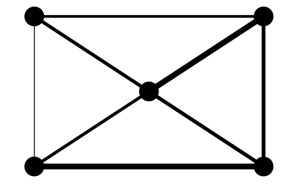

## 第6章 物流の最適ルートをコンサルティングする10本ノック

この記事は[「Python実践データ分析100本ノック」](https://www.amazon.co.jp/dp/B07ZSGSN9S/ref=dp-kindle-redirect?_encoding=UTF8&btkr=1)の演習を実際にやってみたという内容になっています。今まで自己流でやってきましたが、一度他の方々がどのような考え方やコーディングをしているのか勉強してみようと思ってやってみました。本書は実際の業務に活用する上でとても参考になる内容だと思っています。データ分析に関わる仕事をしたい方にお勧めしたいです。

ネットワークの可視化ツールであるNetworkXというライブラリを利用しています。私は利用するのが初めてなので、勉強させてもらいます。

### github
- jupyter notebook形式のファイルは[こちら](https://github.com/hiroshi0530/wa-src/blob/master/ml/data100/06/06_nb.ipynb)

### google colaboratory
- google colaboratory で実行する場合は[こちら](https://colab.research.google.com/github/hiroshi0530/wa-src/blob/master/ml/data100/06/06_nb.ipynb)

### 筆者の環境


```python
!sw_vers
```

    ProductName:	Mac OS X
    ProductVersion:	10.14.6
    BuildVersion:	18G6020


```python
!python -V
```

    Python 3.7.3


基本的なライブラリをインポートしそのバージョンを確認しておきます。


```python
%matplotlib inline
%config InlineBackend.figure_format = 'svg'

import matplotlib
import matplotlib.pyplot as plt
import scipy
import numpy as np
import pandas as pd

print('matplotlib version :', matplotlib.__version__)
print('scipy version :', scipy.__version__)
print('numpy version :', np.__version__)
print('pandas version :', pd.__version__)
```

    matplotlib version : 3.0.3
    scipy version : 1.4.1
    numpy version : 1.16.2
    pandas version : 1.0.3


## 解答

### ノック 51 : 物流に関するデータを読み込んでみよう

最初にデータを読み込みます。tbl_factory:生産工場のデータ、tbl_warehouse:倉庫のデータ、rel_cost:倉庫と工場の輸送コスト、tbl_transaction:2019年の工場への部品輸送実績となっています。


```python
factories = pd.read_csv('tbl_factory.csv', index_col=0)
factories
```


<div>
<style scoped>
    .dataframe tbody tr th:only-of-type {
        vertical-align: middle;
    }

    .dataframe tbody tr th {
        vertical-align: top;
    }

    .dataframe thead th {
        text-align: right;
    }
</style>
<table border="1" class="dataframe">
  <thead>
    <tr style="text-align: right;">
      <th></th>
      <th>FCName</th>
      <th>FCDemand</th>
      <th>FCRegion</th>
    </tr>
    <tr>
      <th>FCID</th>
      <th></th>
      <th></th>
      <th></th>
    </tr>
  </thead>
  <tbody>
    <tr>
      <th>FC00001</th>
      <td>東京工場</td>
      <td>28</td>
      <td>関東</td>
    </tr>
    <tr>
      <th>FC00002</th>
      <td>木更津工場</td>
      <td>29</td>
      <td>関東</td>
    </tr>
    <tr>
      <th>FC00003</th>
      <td>多摩工場</td>
      <td>31</td>
      <td>関東</td>
    </tr>
    <tr>
      <th>FC00004</th>
      <td>横須賀工場</td>
      <td>25</td>
      <td>関東</td>
    </tr>
    <tr>
      <th>FC00005</th>
      <td>仙台工場</td>
      <td>21</td>
      <td>東北</td>
    </tr>
    <tr>
      <th>FC00006</th>
      <td>山形工場</td>
      <td>30</td>
      <td>東北</td>
    </tr>
    <tr>
      <th>FC00007</th>
      <td>那須工場</td>
      <td>25</td>
      <td>東北</td>
    </tr>
    <tr>
      <th>FC00008</th>
      <td>青森工場</td>
      <td>16</td>
      <td>東北</td>
    </tr>
  </tbody>
</table>
</div>


```python
warehouses = pd.read_csv('tbl_warehouse.csv', index_col=0)
warehouses
```


<div>
<style scoped>
    .dataframe tbody tr th:only-of-type {
        vertical-align: middle;
    }

    .dataframe tbody tr th {
        vertical-align: top;
    }

    .dataframe thead th {
        text-align: right;
    }
</style>
<table border="1" class="dataframe">
  <thead>
    <tr style="text-align: right;">
      <th></th>
      <th>WHName</th>
      <th>WHSupply</th>
      <th>WHRegion</th>
    </tr>
    <tr>
      <th>WHID</th>
      <th></th>
      <th></th>
      <th></th>
    </tr>
  </thead>
  <tbody>
    <tr>
      <th>WH00001</th>
      <td>杉並倉庫</td>
      <td>35</td>
      <td>関東</td>
    </tr>
    <tr>
      <th>WH00002</th>
      <td>品川倉庫</td>
      <td>41</td>
      <td>関東</td>
    </tr>
    <tr>
      <th>WH00003</th>
      <td>豊洲倉庫</td>
      <td>42</td>
      <td>関東</td>
    </tr>
    <tr>
      <th>WH00004</th>
      <td>郡山倉庫</td>
      <td>60</td>
      <td>東北</td>
    </tr>
    <tr>
      <th>WH00005</th>
      <td>仙台倉庫</td>
      <td>72</td>
      <td>東北</td>
    </tr>
    <tr>
      <th>WH00006</th>
      <td>山形倉庫</td>
      <td>65</td>
      <td>東北</td>
    </tr>
  </tbody>
</table>
</div>


```python
cost = pd.read_csv('rel_cost.csv', index_col=0)
cost.head()
```


<div>
<style scoped>
    .dataframe tbody tr th:only-of-type {
        vertical-align: middle;
    }

    .dataframe tbody tr th {
        vertical-align: top;
    }

    .dataframe thead th {
        text-align: right;
    }
</style>
<table border="1" class="dataframe">
  <thead>
    <tr style="text-align: right;">
      <th></th>
      <th>FCID</th>
      <th>WHID</th>
      <th>Cost</th>
    </tr>
    <tr>
      <th>RCostID</th>
      <th></th>
      <th></th>
      <th></th>
    </tr>
  </thead>
  <tbody>
    <tr>
      <th>1</th>
      <td>FC00001</td>
      <td>WH00001</td>
      <td>0.4</td>
    </tr>
    <tr>
      <th>2</th>
      <td>FC00001</td>
      <td>WH00002</td>
      <td>0.8</td>
    </tr>
    <tr>
      <th>3</th>
      <td>FC00001</td>
      <td>WH00003</td>
      <td>1.5</td>
    </tr>
    <tr>
      <th>4</th>
      <td>FC00002</td>
      <td>WH00001</td>
      <td>0.9</td>
    </tr>
    <tr>
      <th>5</th>
      <td>FC00002</td>
      <td>WH00002</td>
      <td>0.8</td>
    </tr>
  </tbody>
</table>
</div>


```python
trans = pd.read_csv('tbl_transaction.csv', index_col=0)
trans.head()
```


<div>
<style scoped>
    .dataframe tbody tr th:only-of-type {
        vertical-align: middle;
    }

    .dataframe tbody tr th {
        vertical-align: top;
    }

    .dataframe thead th {
        text-align: right;
    }
</style>
<table border="1" class="dataframe">
  <thead>
    <tr style="text-align: right;">
      <th></th>
      <th>TransactionDate</th>
      <th>ToFC</th>
      <th>FromWH</th>
      <th>Quantity</th>
    </tr>
    <tr>
      <th>TRID</th>
      <th></th>
      <th></th>
      <th></th>
      <th></th>
    </tr>
  </thead>
  <tbody>
    <tr>
      <th>0</th>
      <td>2019-01-01 02:11:10</td>
      <td>FC00004</td>
      <td>WH00003</td>
      <td>33</td>
    </tr>
    <tr>
      <th>1</th>
      <td>2019-01-01 06:12:42</td>
      <td>FC00007</td>
      <td>WH00006</td>
      <td>19</td>
    </tr>
    <tr>
      <th>2</th>
      <td>2019-01-01 06:32:32</td>
      <td>FC00006</td>
      <td>WH00004</td>
      <td>31</td>
    </tr>
    <tr>
      <th>3</th>
      <td>2019-01-01 07:17:06</td>
      <td>FC00002</td>
      <td>WH00003</td>
      <td>18</td>
    </tr>
    <tr>
      <th>4</th>
      <td>2019-01-01 07:52:18</td>
      <td>FC00001</td>
      <td>WH00002</td>
      <td>30</td>
    </tr>
  </tbody>
</table>
</div>


```python
join_data = pd.merge(trans, cost, left_on=['ToFC', 'FromWH'], right_on=['FCID', 'WHID'], how='left')  
join_data.head()
```


<div>
<style scoped>
    .dataframe tbody tr th:only-of-type {
        vertical-align: middle;
    }

    .dataframe tbody tr th {
        vertical-align: top;
    }

    .dataframe thead th {
        text-align: right;
    }
</style>
<table border="1" class="dataframe">
  <thead>
    <tr style="text-align: right;">
      <th></th>
      <th>TransactionDate</th>
      <th>ToFC</th>
      <th>FromWH</th>
      <th>Quantity</th>
      <th>FCID</th>
      <th>WHID</th>
      <th>Cost</th>
    </tr>
  </thead>
  <tbody>
    <tr>
      <th>0</th>
      <td>2019-01-01 02:11:10</td>
      <td>FC00004</td>
      <td>WH00003</td>
      <td>33</td>
      <td>FC00004</td>
      <td>WH00003</td>
      <td>1.1</td>
    </tr>
    <tr>
      <th>1</th>
      <td>2019-01-01 06:12:42</td>
      <td>FC00007</td>
      <td>WH00006</td>
      <td>19</td>
      <td>FC00007</td>
      <td>WH00006</td>
      <td>1.3</td>
    </tr>
    <tr>
      <th>2</th>
      <td>2019-01-01 06:32:32</td>
      <td>FC00006</td>
      <td>WH00004</td>
      <td>31</td>
      <td>FC00006</td>
      <td>WH00004</td>
      <td>0.9</td>
    </tr>
    <tr>
      <th>3</th>
      <td>2019-01-01 07:17:06</td>
      <td>FC00002</td>
      <td>WH00003</td>
      <td>18</td>
      <td>FC00002</td>
      <td>WH00003</td>
      <td>1.6</td>
    </tr>
    <tr>
      <th>4</th>
      <td>2019-01-01 07:52:18</td>
      <td>FC00001</td>
      <td>WH00002</td>
      <td>30</td>
      <td>FC00001</td>
      <td>WH00002</td>
      <td>0.8</td>
    </tr>
  </tbody>
</table>
</div>


結合したテーブルに工場のデータを付与します。


```python
join_data = pd.merge(join_data, factories, left_on='ToFC', right_on='FCID', how='left')
join_data.head()
```


<div>
<style scoped>
    .dataframe tbody tr th:only-of-type {
        vertical-align: middle;
    }

    .dataframe tbody tr th {
        vertical-align: top;
    }

    .dataframe thead th {
        text-align: right;
    }
</style>
<table border="1" class="dataframe">
  <thead>
    <tr style="text-align: right;">
      <th></th>
      <th>TransactionDate</th>
      <th>ToFC</th>
      <th>FromWH</th>
      <th>Quantity</th>
      <th>FCID</th>
      <th>WHID</th>
      <th>Cost</th>
      <th>FCName</th>
      <th>FCDemand</th>
      <th>FCRegion</th>
    </tr>
  </thead>
  <tbody>
    <tr>
      <th>0</th>
      <td>2019-01-01 02:11:10</td>
      <td>FC00004</td>
      <td>WH00003</td>
      <td>33</td>
      <td>FC00004</td>
      <td>WH00003</td>
      <td>1.1</td>
      <td>横須賀工場</td>
      <td>25</td>
      <td>関東</td>
    </tr>
    <tr>
      <th>1</th>
      <td>2019-01-01 06:12:42</td>
      <td>FC00007</td>
      <td>WH00006</td>
      <td>19</td>
      <td>FC00007</td>
      <td>WH00006</td>
      <td>1.3</td>
      <td>那須工場</td>
      <td>25</td>
      <td>東北</td>
    </tr>
    <tr>
      <th>2</th>
      <td>2019-01-01 06:32:32</td>
      <td>FC00006</td>
      <td>WH00004</td>
      <td>31</td>
      <td>FC00006</td>
      <td>WH00004</td>
      <td>0.9</td>
      <td>山形工場</td>
      <td>30</td>
      <td>東北</td>
    </tr>
    <tr>
      <th>3</th>
      <td>2019-01-01 07:17:06</td>
      <td>FC00002</td>
      <td>WH00003</td>
      <td>18</td>
      <td>FC00002</td>
      <td>WH00003</td>
      <td>1.6</td>
      <td>木更津工場</td>
      <td>29</td>
      <td>関東</td>
    </tr>
    <tr>
      <th>4</th>
      <td>2019-01-01 07:52:18</td>
      <td>FC00001</td>
      <td>WH00002</td>
      <td>30</td>
      <td>FC00001</td>
      <td>WH00002</td>
      <td>0.8</td>
      <td>東京工場</td>
      <td>28</td>
      <td>関東</td>
    </tr>
  </tbody>
</table>
</div>


倉庫の情報も付与します。


```python
join_data = pd.merge(join_data, warehouses, left_on='FromWH', right_on='WHID', how='left')
join_data.head()
```


<div>
<style scoped>
    .dataframe tbody tr th:only-of-type {
        vertical-align: middle;
    }

    .dataframe tbody tr th {
        vertical-align: top;
    }

    .dataframe thead th {
        text-align: right;
    }
</style>
<table border="1" class="dataframe">
  <thead>
    <tr style="text-align: right;">
      <th></th>
      <th>TransactionDate</th>
      <th>ToFC</th>
      <th>FromWH</th>
      <th>Quantity</th>
      <th>FCID</th>
      <th>WHID</th>
      <th>Cost</th>
      <th>FCName</th>
      <th>FCDemand</th>
      <th>FCRegion</th>
      <th>WHName</th>
      <th>WHSupply</th>
      <th>WHRegion</th>
    </tr>
  </thead>
  <tbody>
    <tr>
      <th>0</th>
      <td>2019-01-01 02:11:10</td>
      <td>FC00004</td>
      <td>WH00003</td>
      <td>33</td>
      <td>FC00004</td>
      <td>WH00003</td>
      <td>1.1</td>
      <td>横須賀工場</td>
      <td>25</td>
      <td>関東</td>
      <td>豊洲倉庫</td>
      <td>42</td>
      <td>関東</td>
    </tr>
    <tr>
      <th>1</th>
      <td>2019-01-01 06:12:42</td>
      <td>FC00007</td>
      <td>WH00006</td>
      <td>19</td>
      <td>FC00007</td>
      <td>WH00006</td>
      <td>1.3</td>
      <td>那須工場</td>
      <td>25</td>
      <td>東北</td>
      <td>山形倉庫</td>
      <td>65</td>
      <td>東北</td>
    </tr>
    <tr>
      <th>2</th>
      <td>2019-01-01 06:32:32</td>
      <td>FC00006</td>
      <td>WH00004</td>
      <td>31</td>
      <td>FC00006</td>
      <td>WH00004</td>
      <td>0.9</td>
      <td>山形工場</td>
      <td>30</td>
      <td>東北</td>
      <td>郡山倉庫</td>
      <td>60</td>
      <td>東北</td>
    </tr>
    <tr>
      <th>3</th>
      <td>2019-01-01 07:17:06</td>
      <td>FC00002</td>
      <td>WH00003</td>
      <td>18</td>
      <td>FC00002</td>
      <td>WH00003</td>
      <td>1.6</td>
      <td>木更津工場</td>
      <td>29</td>
      <td>関東</td>
      <td>豊洲倉庫</td>
      <td>42</td>
      <td>関東</td>
    </tr>
    <tr>
      <th>4</th>
      <td>2019-01-01 07:52:18</td>
      <td>FC00001</td>
      <td>WH00002</td>
      <td>30</td>
      <td>FC00001</td>
      <td>WH00002</td>
      <td>0.8</td>
      <td>東京工場</td>
      <td>28</td>
      <td>関東</td>
      <td>品川倉庫</td>
      <td>41</td>
      <td>関東</td>
    </tr>
  </tbody>
</table>
</div>


列のデータを並び替えます。


```python
join_data = join_data[['TransactionDate', 'Quantity', 'Cost', 'ToFC', 'FCName', 'FCDemand', 'FromWH', 'WHName', 'WHSupply', 'WHRegion']] 
join_data.head()
```


<div>
<style scoped>
    .dataframe tbody tr th:only-of-type {
        vertical-align: middle;
    }

    .dataframe tbody tr th {
        vertical-align: top;
    }

    .dataframe thead th {
        text-align: right;
    }
</style>
<table border="1" class="dataframe">
  <thead>
    <tr style="text-align: right;">
      <th></th>
      <th>TransactionDate</th>
      <th>Quantity</th>
      <th>Cost</th>
      <th>ToFC</th>
      <th>FCName</th>
      <th>FCDemand</th>
      <th>FromWH</th>
      <th>WHName</th>
      <th>WHSupply</th>
      <th>WHRegion</th>
    </tr>
  </thead>
  <tbody>
    <tr>
      <th>0</th>
      <td>2019-01-01 02:11:10</td>
      <td>33</td>
      <td>1.1</td>
      <td>FC00004</td>
      <td>横須賀工場</td>
      <td>25</td>
      <td>WH00003</td>
      <td>豊洲倉庫</td>
      <td>42</td>
      <td>関東</td>
    </tr>
    <tr>
      <th>1</th>
      <td>2019-01-01 06:12:42</td>
      <td>19</td>
      <td>1.3</td>
      <td>FC00007</td>
      <td>那須工場</td>
      <td>25</td>
      <td>WH00006</td>
      <td>山形倉庫</td>
      <td>65</td>
      <td>東北</td>
    </tr>
    <tr>
      <th>2</th>
      <td>2019-01-01 06:32:32</td>
      <td>31</td>
      <td>0.9</td>
      <td>FC00006</td>
      <td>山形工場</td>
      <td>30</td>
      <td>WH00004</td>
      <td>郡山倉庫</td>
      <td>60</td>
      <td>東北</td>
    </tr>
    <tr>
      <th>3</th>
      <td>2019-01-01 07:17:06</td>
      <td>18</td>
      <td>1.6</td>
      <td>FC00002</td>
      <td>木更津工場</td>
      <td>29</td>
      <td>WH00003</td>
      <td>豊洲倉庫</td>
      <td>42</td>
      <td>関東</td>
    </tr>
    <tr>
      <th>4</th>
      <td>2019-01-01 07:52:18</td>
      <td>30</td>
      <td>0.8</td>
      <td>FC00001</td>
      <td>東京工場</td>
      <td>28</td>
      <td>WH00002</td>
      <td>品川倉庫</td>
      <td>41</td>
      <td>関東</td>
    </tr>
  </tbody>
</table>
</div>


```python
join_data['WHRegion'] == '関東'
```


    0        True
    1       False
    2       False
    3        True
    4        True
            ...  
    3995    False
    3996     True
    3997     True
    3998    False
    3999    False
    Name: WHRegion, Length: 4000, dtype: bool


```python
kanto = join_data.loc[join_data['WHRegion'] == '関東']
kanto.head()
```


<div>
<style scoped>
    .dataframe tbody tr th:only-of-type {
        vertical-align: middle;
    }

    .dataframe tbody tr th {
        vertical-align: top;
    }

    .dataframe thead th {
        text-align: right;
    }
</style>
<table border="1" class="dataframe">
  <thead>
    <tr style="text-align: right;">
      <th></th>
      <th>TransactionDate</th>
      <th>Quantity</th>
      <th>Cost</th>
      <th>ToFC</th>
      <th>FCName</th>
      <th>FCDemand</th>
      <th>FromWH</th>
      <th>WHName</th>
      <th>WHSupply</th>
      <th>WHRegion</th>
    </tr>
  </thead>
  <tbody>
    <tr>
      <th>0</th>
      <td>2019-01-01 02:11:10</td>
      <td>33</td>
      <td>1.1</td>
      <td>FC00004</td>
      <td>横須賀工場</td>
      <td>25</td>
      <td>WH00003</td>
      <td>豊洲倉庫</td>
      <td>42</td>
      <td>関東</td>
    </tr>
    <tr>
      <th>3</th>
      <td>2019-01-01 07:17:06</td>
      <td>18</td>
      <td>1.6</td>
      <td>FC00002</td>
      <td>木更津工場</td>
      <td>29</td>
      <td>WH00003</td>
      <td>豊洲倉庫</td>
      <td>42</td>
      <td>関東</td>
    </tr>
    <tr>
      <th>4</th>
      <td>2019-01-01 07:52:18</td>
      <td>30</td>
      <td>0.8</td>
      <td>FC00001</td>
      <td>東京工場</td>
      <td>28</td>
      <td>WH00002</td>
      <td>品川倉庫</td>
      <td>41</td>
      <td>関東</td>
    </tr>
    <tr>
      <th>7</th>
      <td>2019-01-01 09:09:30</td>
      <td>12</td>
      <td>1.5</td>
      <td>FC00001</td>
      <td>東京工場</td>
      <td>28</td>
      <td>WH00003</td>
      <td>豊洲倉庫</td>
      <td>42</td>
      <td>関東</td>
    </tr>
    <tr>
      <th>8</th>
      <td>2019-01-01 10:52:55</td>
      <td>27</td>
      <td>1.5</td>
      <td>FC00003</td>
      <td>多摩工場</td>
      <td>31</td>
      <td>WH00003</td>
      <td>豊洲倉庫</td>
      <td>42</td>
      <td>関東</td>
    </tr>
  </tbody>
</table>
</div>


```python
tohoku = join_data.loc[join_data['WHRegion'] == '東北']
tohoku.head()
```


<div>
<style scoped>
    .dataframe tbody tr th:only-of-type {
        vertical-align: middle;
    }

    .dataframe tbody tr th {
        vertical-align: top;
    }

    .dataframe thead th {
        text-align: right;
    }
</style>
<table border="1" class="dataframe">
  <thead>
    <tr style="text-align: right;">
      <th></th>
      <th>TransactionDate</th>
      <th>Quantity</th>
      <th>Cost</th>
      <th>ToFC</th>
      <th>FCName</th>
      <th>FCDemand</th>
      <th>FromWH</th>
      <th>WHName</th>
      <th>WHSupply</th>
      <th>WHRegion</th>
    </tr>
  </thead>
  <tbody>
    <tr>
      <th>1</th>
      <td>2019-01-01 06:12:42</td>
      <td>19</td>
      <td>1.3</td>
      <td>FC00007</td>
      <td>那須工場</td>
      <td>25</td>
      <td>WH00006</td>
      <td>山形倉庫</td>
      <td>65</td>
      <td>東北</td>
    </tr>
    <tr>
      <th>2</th>
      <td>2019-01-01 06:32:32</td>
      <td>31</td>
      <td>0.9</td>
      <td>FC00006</td>
      <td>山形工場</td>
      <td>30</td>
      <td>WH00004</td>
      <td>郡山倉庫</td>
      <td>60</td>
      <td>東北</td>
    </tr>
    <tr>
      <th>5</th>
      <td>2019-01-01 08:56:09</td>
      <td>31</td>
      <td>0.3</td>
      <td>FC00005</td>
      <td>仙台工場</td>
      <td>21</td>
      <td>WH00005</td>
      <td>仙台倉庫</td>
      <td>72</td>
      <td>東北</td>
    </tr>
    <tr>
      <th>6</th>
      <td>2019-01-01 09:00:15</td>
      <td>33</td>
      <td>0.7</td>
      <td>FC00006</td>
      <td>山形工場</td>
      <td>30</td>
      <td>WH00006</td>
      <td>山形倉庫</td>
      <td>65</td>
      <td>東北</td>
    </tr>
    <tr>
      <th>9</th>
      <td>2019-01-01 14:12:51</td>
      <td>21</td>
      <td>0.7</td>
      <td>FC00006</td>
      <td>山形工場</td>
      <td>30</td>
      <td>WH00006</td>
      <td>山形倉庫</td>
      <td>65</td>
      <td>東北</td>
    </tr>
  </tbody>
</table>
</div>


### ノック 52 : 現状の輸送量、コストを確認してみよう

部品一つあたりのコストを算出します


```python
print('関東支社の総コスト : ', kanto['Cost'].sum(), '万円') 
print('東北支社の総コスト : ', tohoku['Cost'].sum(), '万円') 
print('関東支社の総部品輸送個数 : ', kanto['Quantity'].sum(), '個') 
print('東北支社の総部品輸送個数 : ', tohoku['Quantity'].sum(), '個') 
print('関東支社の部品一つあたりのコスト : ', int(10000 * kanto['Cost'].sum() / kanto['Quantity'].sum()), '個') 
print('東北支社の部品一つあたりのコスト : ', int(10000 * tohoku['Cost'].sum() / tohoku['Quantity'].sum()), '個') 
```

    関東支社の総コスト :  2189.3 万円
    東北支社の総コスト :  2062.0 万円
    関東支社の総部品輸送個数 :  49146 個
    東北支社の総部品輸送個数 :  50214 個
    関東支社の部品一つあたりのコスト :  445 個
    東北支社の部品一つあたりのコスト :  410 個


支社毎の平均輸送コストを算出します


```python
cost_chk = pd.merge(cost, factories, on='FCID', how='left')
print('東京支社の平均輸送コスト : ', cost_chk['Cost'].loc[cost_chk['FCRegion'] == '関東'].mean(), '万円')  
print('東北支社の平均輸送コスト : ', cost_chk['Cost'].loc[cost_chk['FCRegion'] == '東北'].mean(), '万円')
```

    東京支社の平均輸送コスト :  1.075 万円
    東北支社の平均輸送コスト :  1.05 万円


### ノック 53 : ネットワークを可視化してみよう

ネットワークの可視化ツールであるnetworkxを利用します。

最初にnetworkxの簡単な使い方が紹介されています。


```python
import networkx as nx

G=nx.Graph()

G.add_node('nodeA')
G.add_node('nodeB')
G.add_node('nodeC')

G.add_edge('nodeA', 'nodeB')
G.add_edge('nodeB', 'nodeC')
G.add_edge('nodeC', 'nodeA')

#座標の設定
pos = {}

pos['nodeA'] = (0,0)
pos['nodeB'] = (1,1)
pos['nodeC'] = (0,1)

nx.draw(G, pos)
plt.show()
```

    /Users/hiroshi/anaconda3/lib/python3.7/site-packages/networkx/drawing/nx_pylab.py:611: MatplotlibDeprecationWarning: isinstance(..., numbers.Number)
      if cb.is_numlike(alpha):


### ノック 54 : ネットワークにノードを追加してみよう

新たに頂点Dを追加してみます。またラベル名を表示しています。


```python
G.add_node('nodeD')

G.add_edge('nodeA', 'nodeD')

pos['nodeD'] = (1,0)

nx.draw(G, pos, with_labels=True)
```


### ノック 55 : ルートの重み付けを実施しよう


```python
# データの読み込み
df_w = pd.read_csv('network_weight.csv')
df_p = pd.read_csv('network_pos.csv')
```


```python
df_w.head()
```


<div>
<style scoped>
    .dataframe tbody tr th:only-of-type {
        vertical-align: middle;
    }

    .dataframe tbody tr th {
        vertical-align: top;
    }

    .dataframe thead th {
        text-align: right;
    }
</style>
<table border="1" class="dataframe">
  <thead>
    <tr style="text-align: right;">
      <th></th>
      <th>A</th>
      <th>B</th>
      <th>C</th>
      <th>D</th>
      <th>E</th>
    </tr>
  </thead>
  <tbody>
    <tr>
      <th>0</th>
      <td>0.639921</td>
      <td>0.143353</td>
      <td>0.944669</td>
      <td>0.521848</td>
      <td>0.000000</td>
    </tr>
    <tr>
      <th>1</th>
      <td>0.264556</td>
      <td>0.000000</td>
      <td>0.456150</td>
      <td>0.568434</td>
      <td>0.000000</td>
    </tr>
    <tr>
      <th>2</th>
      <td>0.617635</td>
      <td>0.612096</td>
      <td>0.616934</td>
      <td>0.943748</td>
      <td>0.000000</td>
    </tr>
    <tr>
      <th>3</th>
      <td>0.000000</td>
      <td>0.000000</td>
      <td>0.697631</td>
      <td>0.060225</td>
      <td>0.666767</td>
    </tr>
    <tr>
      <th>4</th>
      <td>0.670638</td>
      <td>0.210383</td>
      <td>0.000000</td>
      <td>0.315428</td>
      <td>0.000000</td>
    </tr>
  </tbody>
</table>
</div>


```python
df_p.head()
```


<div>
<style scoped>
    .dataframe tbody tr th:only-of-type {
        vertical-align: middle;
    }

    .dataframe tbody tr th {
        vertical-align: top;
    }

    .dataframe thead th {
        text-align: right;
    }
</style>
<table border="1" class="dataframe">
  <thead>
    <tr style="text-align: right;">
      <th></th>
      <th>A</th>
      <th>B</th>
      <th>C</th>
      <th>D</th>
      <th>E</th>
    </tr>
  </thead>
  <tbody>
    <tr>
      <th>0</th>
      <td>0</td>
      <td>0</td>
      <td>2</td>
      <td>2</td>
      <td>1</td>
    </tr>
    <tr>
      <th>1</th>
      <td>0</td>
      <td>2</td>
      <td>0</td>
      <td>2</td>
      <td>1</td>
    </tr>
  </tbody>
</table>
</div>


```python
# エッジの重みのリスト
size = 10
edge_weights = []

for i in range(len(df_w)):
  for j in range(len(df_w.columns)):
    edge_weights.append(df_w.iloc[i][j] * size)

G = nx.Graph()
```


```python
# 頂点の設定
for i in range(len(df_w.columns)):
  G.add_node(df_w.columns[i])
```


```python
# 辺の設定
for i in range(len(df_w.columns)):
  for j in range(len(df_w.columns)):
    G.add_edge(df_w.columns[i], df_w.columns[j])
```


```python
# 座標の設定
pos = {}
for i in range(len(df_w.columns)):
  node = df_w.columns[i]
  pos[node] = (df_p[node][0], df_p[node][1])
```


```python
# 描画
nx.draw(G, pos, with_labels=True, font_size=16, node_size=1000, node_color='k', width = edge_weights)

plt.show()
```

    /Users/hiroshi/anaconda3/lib/python3.7/site-packages/networkx/drawing/nx_pylab.py:611: MatplotlibDeprecationWarning: isinstance(..., numbers.Number)
      if cb.is_numlike(alpha):





### ノック 56 : 輸送ルート情報から読み込んでみよう

この章では以下のCSVファイルが用意されています。

1. trans_route.csv : 輸送ルート
2. trans_route_pos.csv : 倉庫・工場の位置情報
3. trans_cost.csv : 倉庫と工場間の輸送コスト
4. demand.csv : 工場の製品生産量に対する需要
5. supply.csv : 倉庫が供給可能な部品数の上限
6. trans_route_new.csv : 新しく設計し直した輸送ルート

ある製品の部品を格納した倉庫W1、W2、W3から、必要な量の部品を組み立て、工場F1、工場F2、工場F3、工場F4に運ぶ際の最小コストを算出します。


```bash
%%bash
cat trans_route.csv
```

    工場,F1,F2,F3,F4
    W1,15,15,0,5
    W2,5,0,30,5
    W3,10,15,2,15


```bash
%%bash
cat trans_route_pos.csv
```

    W1,W2,W3,F1,F2,F3,F4
    0,0,0,4,4,4,4
    1,2,3,0.5,1.5,2.5,3.5


```bash
%%bash
cat trans_cost.csv
```

    工場,F1,F2,F3,F4
    W1,10,10,11,27
    W2,18,21,12,14
    W3,15,12,14,12


```bash
%%bash
head demand.csv
```

    F1,F2,F3,F4
    28,29,31,25


```bash
%%bash
head supply.csv
```

    W1,W2,W3
    35,41,42


```bash
%%bash
head trans_route_new.csv
```

    工場,F1,F2,F3,F4
    W1,15,15,0,0
    W2,5,0,30,10
    W3,10,15,2,15


どの倉庫からどの工場へ、どれだけの量の輸送が行われているのかを記録したtrans_route.csv を読み込んでみる


```python
df_tr = pd.read_csv('trans_route.csv', index_col = '工場')
df_tr.head()
```


<div>
<style scoped>
    .dataframe tbody tr th:only-of-type {
        vertical-align: middle;
    }

    .dataframe tbody tr th {
        vertical-align: top;
    }

    .dataframe thead th {
        text-align: right;
    }
</style>
<table border="1" class="dataframe">
  <thead>
    <tr style="text-align: right;">
      <th></th>
      <th>F1</th>
      <th>F2</th>
      <th>F3</th>
      <th>F4</th>
    </tr>
    <tr>
      <th>工場</th>
      <th></th>
      <th></th>
      <th></th>
      <th></th>
    </tr>
  </thead>
  <tbody>
    <tr>
      <th>W1</th>
      <td>15</td>
      <td>15</td>
      <td>0</td>
      <td>5</td>
    </tr>
    <tr>
      <th>W2</th>
      <td>5</td>
      <td>0</td>
      <td>30</td>
      <td>5</td>
    </tr>
    <tr>
      <th>W3</th>
      <td>10</td>
      <td>15</td>
      <td>2</td>
      <td>15</td>
    </tr>
  </tbody>
</table>
</div>


### ノック 57 : 輸送ルート情報からネットワークを可視化してみよう


```python
df_pos = pd.read_csv('trans_route_pos.csv')

# グラフの表示
G = nx.Graph()

# 頂点の設定
for i in range(len(df_pos.columns)):
  G.add_node(df_pos.columns[i])
  
# 辺の設定とエッジの重みのリスト化
num_pre = 0
edge_weights = []
size = 0.1
for i in range(len(df_pos.columns)):
  for j in range(len(df_pos.columns)):
    if not (i == j):
      # 辺の追加
      G.add_edge(df_pos.columns[i], df_pos.columns[j])
      
      if num_pre < len(G.edge):
        num_pre = len(G.edges)
        weight = 0
        
        if(df_pos.columns[i] in df_tr.columns) and (df_pos.columns[j] in df_tr.index):
          if df_tr[df_pos.columns[i]][df_pos.columns[j]] 
          
          * size
          
        elif:
              
```

### ノック 58 : 輸送コスト関数を作成しよう 


```python

```

### ノック 59 : 制約条件を作って見よう 


```python

```

    test


### ノック 60 : 輸送ルートを変更して、輸送コスト関数の変化を確認しよう


```bash
%%bash
cat trans_cost.csv
```

    工場,F1,F2,F3,F4
    W1,10,10,11,27
    W2,18,21,12,14
    W3,15,12,14,12


## 関連記事
- [第1章 ウェブからの注文数を分析する10本ノック](/ml/data100/01/)
- [第2章 小売店のデータでデータ加工を行う10本ノック](/ml/data100/02/)
- [第3章 顧客の全体像を把握する10本ノック](/ml/data100/03/)
- [第4章 顧客の行動を予測する10本ノック](/ml/data100/04/)
- [第5章 顧客の退会を予測する10本ノック](/ml/data100/05/)
- [第6章 物流の最適ルートをコンサルティングする10本ノック](/ml/data100/06/)
- [第7章 ロジスティクスネットワークの最適設計を行う10本ノック](/ml/data100/07/)
- [第8章 数値シミュレーションで消費者行動を予測する10本ノック](/ml/data100/08/)
- [第9章 潜在顧客を把握するための画像認識10本ノック](/ml/data100/09/)
- [第10章 アンケート分析を行うための自然言語処理10本ノック](/ml/data100/10/)
