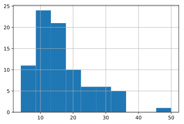

## 第10章 アンケート分析を行うための自然言語処理10本ノック

この記事は[「Python実践データ分析100本ノック」](https://www.amazon.co.jp/dp/B07ZSGSN9S/ref=dp-kindle-redirect?_encoding=UTF8&btkr=1)の演習を実際にやってみたという内容になっています。今まで自己流でやってきましたが、一度他の方々がどのような考え方やコーディングをしているのか勉強してみようと思ってやってみました。本書は実際の業務に活用する上でとても参考になる内容だと思っています。データ分析に関わる仕事をしたい方にお勧めしたいです。

アンケート処理の演習になります。こちらも前の章よりはやりやすかったです。しかしとても勉強になるので、ぜひとも自分のものにしたいです。

### github
- jupyter notebook形式のファイルは[こちら](https://github.com/hiroshi0530/wa-src/blob/master/ml/data100/10/10_nb.ipynb)

### google colaboratory
- google colaboratory で実行する場合は[こちら](https://colab.research.google.com/github/hiroshi0530/wa-src/blob/master/ml/data100/10/10_nb.ipynb)

### 筆者の環境


```python
!sw_vers
```

    ProductName:	Mac OS X
    ProductVersion:	10.14.6
    BuildVersion:	18G95


```python
!python -V
```

    Python 3.5.5 :: Anaconda, Inc.


基本的なライブラリをインポートしそのバージョンを確認しておきます。


```python
%matplotlib inline
%config InlineBackend.figure_format = 'svg'

import matplotlib
import matplotlib.pyplot as plt
import scipy
import numpy as np
import pandas as pd

print('matplotlib version :', matplotlib.__version__)
print('scipy version :', scipy.__version__)
print('numpy version :', np.__version__)
print('pandas version :', pd.__version__)
```

    matplotlib version : 2.2.2
    scipy version : 1.4.1
    numpy version : 1.18.1
    pandas version : 0.24.2


## 解答

### ノック 91 : データを読み込んで把握しよう


```python
survey = pd.read_csv('survey.csv')
survey.head()
```


<div>
<style scoped>
    .dataframe tbody tr th:only-of-type {
        vertical-align: middle;
    }

    .dataframe tbody tr th {
        vertical-align: top;
    }

    .dataframe thead th {
        text-align: right;
    }
</style>
<table border="1" class="dataframe">
  <thead>
    <tr style="text-align: right;">
      <th></th>
      <th>datetime</th>
      <th>comment</th>
      <th>satisfaction</th>
    </tr>
  </thead>
  <tbody>
    <tr>
      <th>0</th>
      <td>2019/3/11</td>
      <td>駅前に若者が集まっている(AA駅)</td>
      <td>1</td>
    </tr>
    <tr>
      <th>1</th>
      <td>2019/2/25</td>
      <td>スポーツできる場所があるのが良い</td>
      <td>5</td>
    </tr>
    <tr>
      <th>2</th>
      <td>2019/2/18</td>
      <td>子育て支援が嬉しい</td>
      <td>5</td>
    </tr>
    <tr>
      <th>3</th>
      <td>2019/4/9</td>
      <td>保育園に入れる（待機児童なし）</td>
      <td>4</td>
    </tr>
    <tr>
      <th>4</th>
      <td>2019/1/6</td>
      <td>駅前商店街が寂しい</td>
      <td>2</td>
    </tr>
  </tbody>
</table>
</div>


```python
len(survey)
```


    86


```python
survey.isna().sum()
```


    datetime        0
    comment         2
    satisfaction    0
    dtype: int64


実際のデータではユーザーがコメントしてくれない場合は多分にあります。


```python
survey = survey.dropna()
survey.isna().sum()
```


    datetime        0
    comment         0
    satisfaction    0
    dtype: int64


```python
len(survey)
```


    84


### ノック 92 : 不要な文字を除去してみよう


```python
survey['comment'] = survey['comment'].str.replace('AA', '')
survey['comment'].head()
```


    0     駅前に若者が集まっている(駅)
    1    スポーツできる場所があるのが良い
    2           子育て支援が嬉しい
    3     保育園に入れる（待機児童なし）
    4           駅前商店街が寂しい
    Name: comment, dtype: object


正規表現で括弧付きのパターンを削除します。


```python
survey['comment'] = survey['comment'].str.replace("\(.+?\)", "" ,regex=True)
survey['comment'].head()
```


    0        駅前に若者が集まっている
    1    スポーツできる場所があるのが良い
    2           子育て支援が嬉しい
    3     保育園に入れる（待機児童なし）
    4           駅前商店街が寂しい
    Name: comment, dtype: object


大文字の括弧も削除の対象にします。


```python
survey['comment'] = survey['comment'].str.replace("\（.+?\）", "" ,regex=True)
survey['comment'].head()
```


    0        駅前に若者が集まっている
    1    スポーツできる場所があるのが良い
    2           子育て支援が嬉しい
    3             保育園に入れる
    4           駅前商店街が寂しい
    Name: comment, dtype: object


### ノック 93 : 文字列をカウントしてヒストグラムを表示してみよう


```python
survey['length'] = survey['comment'].str.len()
survey.head()
```


<div>
<style scoped>
    .dataframe tbody tr th:only-of-type {
        vertical-align: middle;
    }

    .dataframe tbody tr th {
        vertical-align: top;
    }

    .dataframe thead th {
        text-align: right;
    }
</style>
<table border="1" class="dataframe">
  <thead>
    <tr style="text-align: right;">
      <th></th>
      <th>datetime</th>
      <th>comment</th>
      <th>satisfaction</th>
      <th>length</th>
    </tr>
  </thead>
  <tbody>
    <tr>
      <th>0</th>
      <td>2019/3/11</td>
      <td>駅前に若者が集まっている</td>
      <td>1</td>
      <td>12</td>
    </tr>
    <tr>
      <th>1</th>
      <td>2019/2/25</td>
      <td>スポーツできる場所があるのが良い</td>
      <td>5</td>
      <td>16</td>
    </tr>
    <tr>
      <th>2</th>
      <td>2019/2/18</td>
      <td>子育て支援が嬉しい</td>
      <td>5</td>
      <td>9</td>
    </tr>
    <tr>
      <th>3</th>
      <td>2019/4/9</td>
      <td>保育園に入れる</td>
      <td>4</td>
      <td>7</td>
    </tr>
    <tr>
      <th>4</th>
      <td>2019/1/6</td>
      <td>駅前商店街が寂しい</td>
      <td>2</td>
      <td>9</td>
    </tr>
  </tbody>
</table>
</div>


分布を見たいのでヒストグラム表示してみます。


```python
plt.grid()
plt.hist(survey['length'], bins=10)
plt.show()
```





### ノック 94 : 形態素解析で文書を解析してみよう


```python
import MeCab
tagger = MeCab.Tagger()
text = 'すもももももももものうち'
words = tagger.parse(text)
words
```


    'すもも\t名詞,一般,*,*,*,*,すもも,スモモ,スモモ\nも\t助詞,係助詞,*,*,*,*,も,モ,モ\nもも\t名詞,一般,*,*,*,*,もも,モモ,モモ\nも\t助詞,係助詞,*,*,*,*,も,モ,モ\nもも\t名詞,一般,*,*,*,*,もも,モモ,モモ\nの\t助詞,連体化,*,*,*,*,の,ノ,ノ\nうち\t名詞,非自立,副詞可能,*,*,*,うち,ウチ,ウチ\nEOS\n'


単語ごとに分割し、特定の品詞の単語のみを取得します。


```python
words = tagger.parse(text).splitlines()
words_arr = []
for i in words:
  if i == 'EOS': 
    continue
  word_tmp = i.split()[0]
  words_arr.append(word_tmp)
words_arr
```


    ['すもも', 'も', 'もも', 'も', 'もも', 'の', 'うち']


### ノック 95 : 形態素解析で文章から「動詞・名詞」を抽出してみよう


```python
text = 'すもももももももものうち'
words = tagger.parse(text).splitlines()
words_arr = []
parts = ['名詞', '動詞']

for i in words:
  if i == 'EOS' or i == '':
    continue
  
  word_tmp = i.split()[0]
  part = i.split()[1].split(',')[0]
  
  if not (part in parts): 
    continue
  words_arr.append(word_tmp)
words_arr
```


    ['すもも', 'もも', 'もも', 'うち']


### ノック 96 : 形態素解析で抽出した頻出する名詞を確認してみよう


```python
all_words = []
parts = ['名詞']

for n in range(len(survey)):
  text = survey['comment'].iloc[n]
  words = tagger.parse(text).splitlines()
  
  words_arr = []
  
  for i in words:
    
    if i == 'EOS' or i == '':
      continue
    
    word_tmp = i.split()[0]
    part = i.split()[1].split(',')[0]
    
    if not (part in parts): 
      continue
    words_arr.append(word_tmp)
  
  all_words.extend(words_arr)
  
all_words[0:10]
```


    ['駅前', '若者', 'スポーツ', '場所', 'の', '子育て', '支援', '保育園', '駅前', '商店']


```python
all_words_df = pd.DataFrame({'words': all_words, "count": len(all_words) * [1]})
all_words_df.head()
```


<div>
<style scoped>
    .dataframe tbody tr th:only-of-type {
        vertical-align: middle;
    }

    .dataframe tbody tr th {
        vertical-align: top;
    }

    .dataframe thead th {
        text-align: right;
    }
</style>
<table border="1" class="dataframe">
  <thead>
    <tr style="text-align: right;">
      <th></th>
      <th>count</th>
      <th>words</th>
    </tr>
  </thead>
  <tbody>
    <tr>
      <th>0</th>
      <td>1</td>
      <td>駅前</td>
    </tr>
    <tr>
      <th>1</th>
      <td>1</td>
      <td>若者</td>
    </tr>
    <tr>
      <th>2</th>
      <td>1</td>
      <td>スポーツ</td>
    </tr>
    <tr>
      <th>3</th>
      <td>1</td>
      <td>場所</td>
    </tr>
    <tr>
      <th>4</th>
      <td>1</td>
      <td>の</td>
    </tr>
  </tbody>
</table>
</div>


```python
all_words_df = all_words_df.groupby('words').sum()
all_words_df.head()
```


<div>
<style scoped>
    .dataframe tbody tr th:only-of-type {
        vertical-align: middle;
    }

    .dataframe tbody tr th {
        vertical-align: top;
    }

    .dataframe thead th {
        text-align: right;
    }
</style>
<table border="1" class="dataframe">
  <thead>
    <tr style="text-align: right;">
      <th></th>
      <th>count</th>
    </tr>
    <tr>
      <th>words</th>
      <th></th>
    </tr>
  </thead>
  <tbody>
    <tr>
      <th>BBB</th>
      <td>1</td>
    </tr>
    <tr>
      <th>^^</th>
      <td>1</td>
    </tr>
    <tr>
      <th>おじさん</th>
      <td>1</td>
    </tr>
    <tr>
      <th>ごみ</th>
      <td>1</td>
    </tr>
    <tr>
      <th>そう</th>
      <td>1</td>
    </tr>
  </tbody>
</table>
</div>


```python
all_words_df.sort_values('count', ascending=False).head()
```


<div>
<style scoped>
    .dataframe tbody tr th:only-of-type {
        vertical-align: middle;
    }

    .dataframe tbody tr th {
        vertical-align: top;
    }

    .dataframe thead th {
        text-align: right;
    }
</style>
<table border="1" class="dataframe">
  <thead>
    <tr style="text-align: right;">
      <th></th>
      <th>count</th>
    </tr>
    <tr>
      <th>words</th>
      <th></th>
    </tr>
  </thead>
  <tbody>
    <tr>
      <th>駅前</th>
      <td>7</td>
    </tr>
    <tr>
      <th>場所</th>
      <td>6</td>
    </tr>
    <tr>
      <th>街</th>
      <td>6</td>
    </tr>
    <tr>
      <th>の</th>
      <td>5</td>
    </tr>
    <tr>
      <th>公園</th>
      <td>5</td>
    </tr>
  </tbody>
</table>
</div>


すべての単語に1を与え、groupbyで合計値を取ってソートします。

### ノック 97 : 関係のない単語を除去してみよう

ストップワードを設定します。関係の単語で除去すべき単語という意味です。


```python
stop_words = ['の']

all_words = []
parts = ['名詞']

for n in range(len(survey)):
  text = survey['comment'].iloc[n]
  words = tagger.parse(text).splitlines()
  
  words_arr = []
  
  for i in words:
    if i == 'EOS' or i == '':
      continue
    word_tmp = i.split()[0]
    
    part = i.split()[1].split(",")[0]
    if not (part in parts):
      continue
    
    if word_tmp in stop_words:
      continue
    
    words_arr.append(word_tmp)
  
  all_words.extend(words_arr)

all_words[0:10]
```


    ['駅前', '若者', 'スポーツ', '場所', '子育て', '支援', '保育園', '駅前', '商店', '街']


```python
all_words_df = pd.DataFrame({'words': all_words, "count": len(all_words) * [1]})
all_words_df = all_words_df.groupby('words').sum()
# print(all_words_df)
all_words_df.sort_values('count', ascending=False).head()
```


<div>
<style scoped>
    .dataframe tbody tr th:only-of-type {
        vertical-align: middle;
    }

    .dataframe tbody tr th {
        vertical-align: top;
    }

    .dataframe thead th {
        text-align: right;
    }
</style>
<table border="1" class="dataframe">
  <thead>
    <tr style="text-align: right;">
      <th></th>
      <th>count</th>
    </tr>
    <tr>
      <th>words</th>
      <th></th>
    </tr>
  </thead>
  <tbody>
    <tr>
      <th>駅前</th>
      <td>7</td>
    </tr>
    <tr>
      <th>場所</th>
      <td>6</td>
    </tr>
    <tr>
      <th>街</th>
      <td>6</td>
    </tr>
    <tr>
      <th>公園</th>
      <td>5</td>
    </tr>
    <tr>
      <th>商店</th>
      <td>5</td>
    </tr>
  </tbody>
</table>
</div>


「の」が削除され、「公園」が繰り上がっています。

### ノック 98 : 顧客満足度と頻出単語の関係を見てみよう


```python
stop_words = ['の']

all_words = []
satisfaction = []

parts = ['名詞']

for n in range(len(survey)):
  text = survey['comment'].iloc[n]
  words = tagger.parse(text).splitlines()
  
  words_arr = []
  
  for i in words:
    if i == 'EOS' or i == '':
      continue
    word_tmp = i.split()[0]
    
    part = i.split()[1].split(",")[0]
    if not (part in parts):
      continue
    
    if word_tmp in stop_words:
      continue
    
    words_arr.append(word_tmp)
    satisfaction.append(survey['satisfaction'].iloc[n])
  all_words.extend(words_arr)

all_words_df = pd.DataFrame({"words": all_words, "satisfaction": satisfaction, "count": len(all_words) * [1]}) 
  
all_words_df.head()
```


<div>
<style scoped>
    .dataframe tbody tr th:only-of-type {
        vertical-align: middle;
    }

    .dataframe tbody tr th {
        vertical-align: top;
    }

    .dataframe thead th {
        text-align: right;
    }
</style>
<table border="1" class="dataframe">
  <thead>
    <tr style="text-align: right;">
      <th></th>
      <th>count</th>
      <th>satisfaction</th>
      <th>words</th>
    </tr>
  </thead>
  <tbody>
    <tr>
      <th>0</th>
      <td>1</td>
      <td>1</td>
      <td>駅前</td>
    </tr>
    <tr>
      <th>1</th>
      <td>1</td>
      <td>1</td>
      <td>若者</td>
    </tr>
    <tr>
      <th>2</th>
      <td>1</td>
      <td>5</td>
      <td>スポーツ</td>
    </tr>
    <tr>
      <th>3</th>
      <td>1</td>
      <td>5</td>
      <td>場所</td>
    </tr>
    <tr>
      <th>4</th>
      <td>1</td>
      <td>5</td>
      <td>子育て</td>
    </tr>
  </tbody>
</table>
</div>


```python
words_satisfaction = all_words_df.groupby('words').mean()['satisfaction']
words_count = all_words_df.groupby('words').sum()['count']

words_df = pd.concat([words_satisfaction, words_count], axis=1)
words_df.head()
```


<div>
<style scoped>
    .dataframe tbody tr th:only-of-type {
        vertical-align: middle;
    }

    .dataframe tbody tr th {
        vertical-align: top;
    }

    .dataframe thead th {
        text-align: right;
    }
</style>
<table border="1" class="dataframe">
  <thead>
    <tr style="text-align: right;">
      <th></th>
      <th>satisfaction</th>
      <th>count</th>
    </tr>
    <tr>
      <th>words</th>
      <th></th>
      <th></th>
    </tr>
  </thead>
  <tbody>
    <tr>
      <th>BBB</th>
      <td>2.0</td>
      <td>1</td>
    </tr>
    <tr>
      <th>^^</th>
      <td>5.0</td>
      <td>1</td>
    </tr>
    <tr>
      <th>おじさん</th>
      <td>1.0</td>
      <td>1</td>
    </tr>
    <tr>
      <th>ごみ</th>
      <td>2.0</td>
      <td>1</td>
    </tr>
    <tr>
      <th>そう</th>
      <td>1.0</td>
      <td>1</td>
    </tr>
  </tbody>
</table>
</div>


```python
words_df = words_df.loc[words_df['count'] >= 3]
words_df.sort_values('satisfaction', ascending=False).head()
```


<div>
<style scoped>
    .dataframe tbody tr th:only-of-type {
        vertical-align: middle;
    }

    .dataframe tbody tr th {
        vertical-align: top;
    }

    .dataframe thead th {
        text-align: right;
    }
</style>
<table border="1" class="dataframe">
  <thead>
    <tr style="text-align: right;">
      <th></th>
      <th>satisfaction</th>
      <th>count</th>
    </tr>
    <tr>
      <th>words</th>
      <th></th>
      <th></th>
    </tr>
  </thead>
  <tbody>
    <tr>
      <th>子育て</th>
      <td>4.333333</td>
      <td>3</td>
    </tr>
    <tr>
      <th>綺麗</th>
      <td>4.333333</td>
      <td>3</td>
    </tr>
    <tr>
      <th>安心</th>
      <td>4.333333</td>
      <td>3</td>
    </tr>
    <tr>
      <th>スポーツ</th>
      <td>3.666667</td>
      <td>3</td>
    </tr>
    <tr>
      <th>道</th>
      <td>3.000000</td>
      <td>3</td>
    </tr>
  </tbody>
</table>
</div>


```python
words_df.sort_values('satisfaction').head()
```


<div>
<style scoped>
    .dataframe tbody tr th:only-of-type {
        vertical-align: middle;
    }

    .dataframe tbody tr th {
        vertical-align: top;
    }

    .dataframe thead th {
        text-align: right;
    }
</style>
<table border="1" class="dataframe">
  <thead>
    <tr style="text-align: right;">
      <th></th>
      <th>satisfaction</th>
      <th>count</th>
    </tr>
    <tr>
      <th>words</th>
      <th></th>
      <th></th>
    </tr>
  </thead>
  <tbody>
    <tr>
      <th>駐車</th>
      <td>1.000000</td>
      <td>4</td>
    </tr>
    <tr>
      <th>場</th>
      <td>1.000000</td>
      <td>4</td>
    </tr>
    <tr>
      <th>信号</th>
      <td>1.333333</td>
      <td>3</td>
    </tr>
    <tr>
      <th>大変</th>
      <td>1.333333</td>
      <td>3</td>
    </tr>
    <tr>
      <th>駅前</th>
      <td>1.428571</td>
      <td>7</td>
    </tr>
  </tbody>
</table>
</div>


### ノック 99 : アンケート毎の特徴を表現してみよう
類似した文章の検索になります。


```python
parts = ['名詞']
all_words_df = pd.DataFrame()
satisfaction = []

for n in range(len(survey)):
  text = survey['comment'].iloc[n]
  words = tagger.parse(text).splitlines()
  words_df = pd.DataFrame()
  
  for i in words:
    if i == 'EOS' or i == '':
      continue
    word_tmp = i.split()[0]
    
    part = i.split()[1].split(",")[0]
    if not (part in parts):
      continue
    
    if word_tmp in stop_words:
      continue
    
    words_df[word_tmp] = [1]
  
  all_words_df = pd.concat([all_words_df, words_df], ignore_index=True, sort=False)
all_words_df.head()
```


<div>
<style scoped>
    .dataframe tbody tr th:only-of-type {
        vertical-align: middle;
    }

    .dataframe tbody tr th {
        vertical-align: top;
    }

    .dataframe thead th {
        text-align: right;
    }
</style>
<table border="1" class="dataframe">
  <thead>
    <tr style="text-align: right;">
      <th></th>
      <th>駅前</th>
      <th>若者</th>
      <th>スポーツ</th>
      <th>場所</th>
      <th>子育て</th>
      <th>支援</th>
      <th>保育園</th>
      <th>商店</th>
      <th>街</th>
      <th>生活</th>
      <th>...</th>
      <th>マスコット</th>
      <th>夜間</th>
      <th>不安</th>
      <th>高齢</th>
      <th>サポート</th>
      <th>校庭</th>
      <th>芝生</th>
      <th>投稿</th>
      <th>遊び</th>
      <th>道具</th>
    </tr>
  </thead>
  <tbody>
    <tr>
      <th>0</th>
      <td>1.0</td>
      <td>1.0</td>
      <td>NaN</td>
      <td>NaN</td>
      <td>NaN</td>
      <td>NaN</td>
      <td>NaN</td>
      <td>NaN</td>
      <td>NaN</td>
      <td>NaN</td>
      <td>...</td>
      <td>NaN</td>
      <td>NaN</td>
      <td>NaN</td>
      <td>NaN</td>
      <td>NaN</td>
      <td>NaN</td>
      <td>NaN</td>
      <td>NaN</td>
      <td>NaN</td>
      <td>NaN</td>
    </tr>
    <tr>
      <th>1</th>
      <td>NaN</td>
      <td>NaN</td>
      <td>1.0</td>
      <td>1.0</td>
      <td>NaN</td>
      <td>NaN</td>
      <td>NaN</td>
      <td>NaN</td>
      <td>NaN</td>
      <td>NaN</td>
      <td>...</td>
      <td>NaN</td>
      <td>NaN</td>
      <td>NaN</td>
      <td>NaN</td>
      <td>NaN</td>
      <td>NaN</td>
      <td>NaN</td>
      <td>NaN</td>
      <td>NaN</td>
      <td>NaN</td>
    </tr>
    <tr>
      <th>2</th>
      <td>NaN</td>
      <td>NaN</td>
      <td>NaN</td>
      <td>NaN</td>
      <td>1.0</td>
      <td>1.0</td>
      <td>NaN</td>
      <td>NaN</td>
      <td>NaN</td>
      <td>NaN</td>
      <td>...</td>
      <td>NaN</td>
      <td>NaN</td>
      <td>NaN</td>
      <td>NaN</td>
      <td>NaN</td>
      <td>NaN</td>
      <td>NaN</td>
      <td>NaN</td>
      <td>NaN</td>
      <td>NaN</td>
    </tr>
    <tr>
      <th>3</th>
      <td>NaN</td>
      <td>NaN</td>
      <td>NaN</td>
      <td>NaN</td>
      <td>NaN</td>
      <td>NaN</td>
      <td>1.0</td>
      <td>NaN</td>
      <td>NaN</td>
      <td>NaN</td>
      <td>...</td>
      <td>NaN</td>
      <td>NaN</td>
      <td>NaN</td>
      <td>NaN</td>
      <td>NaN</td>
      <td>NaN</td>
      <td>NaN</td>
      <td>NaN</td>
      <td>NaN</td>
      <td>NaN</td>
    </tr>
    <tr>
      <th>4</th>
      <td>1.0</td>
      <td>NaN</td>
      <td>NaN</td>
      <td>NaN</td>
      <td>NaN</td>
      <td>NaN</td>
      <td>NaN</td>
      <td>1.0</td>
      <td>1.0</td>
      <td>NaN</td>
      <td>...</td>
      <td>NaN</td>
      <td>NaN</td>
      <td>NaN</td>
      <td>NaN</td>
      <td>NaN</td>
      <td>NaN</td>
      <td>NaN</td>
      <td>NaN</td>
      <td>NaN</td>
      <td>NaN</td>
    </tr>
  </tbody>
</table>
<p>5 rows × 183 columns</p>
</div>


fillnaでNaN部分を0に補完します。


```python
all_words_df = all_words_df.fillna(0)
all_words_df.head()
```


<div>
<style scoped>
    .dataframe tbody tr th:only-of-type {
        vertical-align: middle;
    }

    .dataframe tbody tr th {
        vertical-align: top;
    }

    .dataframe thead th {
        text-align: right;
    }
</style>
<table border="1" class="dataframe">
  <thead>
    <tr style="text-align: right;">
      <th></th>
      <th>駅前</th>
      <th>若者</th>
      <th>スポーツ</th>
      <th>場所</th>
      <th>子育て</th>
      <th>支援</th>
      <th>保育園</th>
      <th>商店</th>
      <th>街</th>
      <th>生活</th>
      <th>...</th>
      <th>マスコット</th>
      <th>夜間</th>
      <th>不安</th>
      <th>高齢</th>
      <th>サポート</th>
      <th>校庭</th>
      <th>芝生</th>
      <th>投稿</th>
      <th>遊び</th>
      <th>道具</th>
    </tr>
  </thead>
  <tbody>
    <tr>
      <th>0</th>
      <td>1.0</td>
      <td>1.0</td>
      <td>0.0</td>
      <td>0.0</td>
      <td>0.0</td>
      <td>0.0</td>
      <td>0.0</td>
      <td>0.0</td>
      <td>0.0</td>
      <td>0.0</td>
      <td>...</td>
      <td>0.0</td>
      <td>0.0</td>
      <td>0.0</td>
      <td>0.0</td>
      <td>0.0</td>
      <td>0.0</td>
      <td>0.0</td>
      <td>0.0</td>
      <td>0.0</td>
      <td>0.0</td>
    </tr>
    <tr>
      <th>1</th>
      <td>0.0</td>
      <td>0.0</td>
      <td>1.0</td>
      <td>1.0</td>
      <td>0.0</td>
      <td>0.0</td>
      <td>0.0</td>
      <td>0.0</td>
      <td>0.0</td>
      <td>0.0</td>
      <td>...</td>
      <td>0.0</td>
      <td>0.0</td>
      <td>0.0</td>
      <td>0.0</td>
      <td>0.0</td>
      <td>0.0</td>
      <td>0.0</td>
      <td>0.0</td>
      <td>0.0</td>
      <td>0.0</td>
    </tr>
    <tr>
      <th>2</th>
      <td>0.0</td>
      <td>0.0</td>
      <td>0.0</td>
      <td>0.0</td>
      <td>1.0</td>
      <td>1.0</td>
      <td>0.0</td>
      <td>0.0</td>
      <td>0.0</td>
      <td>0.0</td>
      <td>...</td>
      <td>0.0</td>
      <td>0.0</td>
      <td>0.0</td>
      <td>0.0</td>
      <td>0.0</td>
      <td>0.0</td>
      <td>0.0</td>
      <td>0.0</td>
      <td>0.0</td>
      <td>0.0</td>
    </tr>
    <tr>
      <th>3</th>
      <td>0.0</td>
      <td>0.0</td>
      <td>0.0</td>
      <td>0.0</td>
      <td>0.0</td>
      <td>0.0</td>
      <td>1.0</td>
      <td>0.0</td>
      <td>0.0</td>
      <td>0.0</td>
      <td>...</td>
      <td>0.0</td>
      <td>0.0</td>
      <td>0.0</td>
      <td>0.0</td>
      <td>0.0</td>
      <td>0.0</td>
      <td>0.0</td>
      <td>0.0</td>
      <td>0.0</td>
      <td>0.0</td>
    </tr>
    <tr>
      <th>4</th>
      <td>1.0</td>
      <td>0.0</td>
      <td>0.0</td>
      <td>0.0</td>
      <td>0.0</td>
      <td>0.0</td>
      <td>0.0</td>
      <td>1.0</td>
      <td>1.0</td>
      <td>0.0</td>
      <td>...</td>
      <td>0.0</td>
      <td>0.0</td>
      <td>0.0</td>
      <td>0.0</td>
      <td>0.0</td>
      <td>0.0</td>
      <td>0.0</td>
      <td>0.0</td>
      <td>0.0</td>
      <td>0.0</td>
    </tr>
  </tbody>
</table>
<p>5 rows × 183 columns</p>
</div>


### ノック 100 : 類似アンケートを探してみよう

cos類似度を使ってターゲットと似たような文章を検索します。


```python
print(survey['comment'].iloc[2])
```

    子育て支援が嬉しい


```python
target_text = all_words_df.iloc[2]
target_text.head()
```


    駅前      0.0
    若者      0.0
    スポーツ    0.0
    場所      0.0
    子育て     1.0
    Name: 2, dtype: float64


コサイン類似度で文章の類似度を定量化します。


```python
cos_sim = []
for i in range(len(all_words_df)):
  cos_text = all_words_df.iloc[i]
  cos = np.dot(target_text, cos_text) / (np.linalg.norm(target_text) * np.linalg.norm(cos_text))
  
  cos_sim.append(cos)

all_words_df['cos_sim'] = cos_sim
all_words_df.sort_values('cos_sim', ascending=False).head()
  
```


<div>
<style scoped>
    .dataframe tbody tr th:only-of-type {
        vertical-align: middle;
    }

    .dataframe tbody tr th {
        vertical-align: top;
    }

    .dataframe thead th {
        text-align: right;
    }
</style>
<table border="1" class="dataframe">
  <thead>
    <tr style="text-align: right;">
      <th></th>
      <th>駅前</th>
      <th>若者</th>
      <th>スポーツ</th>
      <th>場所</th>
      <th>子育て</th>
      <th>支援</th>
      <th>保育園</th>
      <th>商店</th>
      <th>街</th>
      <th>生活</th>
      <th>...</th>
      <th>夜間</th>
      <th>不安</th>
      <th>高齢</th>
      <th>サポート</th>
      <th>校庭</th>
      <th>芝生</th>
      <th>投稿</th>
      <th>遊び</th>
      <th>道具</th>
      <th>cos_sim</th>
    </tr>
  </thead>
  <tbody>
    <tr>
      <th>2</th>
      <td>0.0</td>
      <td>0.0</td>
      <td>0.0</td>
      <td>0.0</td>
      <td>1.0</td>
      <td>1.0</td>
      <td>0.0</td>
      <td>0.0</td>
      <td>0.0</td>
      <td>0.0</td>
      <td>...</td>
      <td>0.0</td>
      <td>0.0</td>
      <td>0.0</td>
      <td>0.0</td>
      <td>0.0</td>
      <td>0.0</td>
      <td>0.0</td>
      <td>0.0</td>
      <td>0.0</td>
      <td>1.000000</td>
    </tr>
    <tr>
      <th>24</th>
      <td>0.0</td>
      <td>0.0</td>
      <td>0.0</td>
      <td>0.0</td>
      <td>1.0</td>
      <td>0.0</td>
      <td>0.0</td>
      <td>0.0</td>
      <td>0.0</td>
      <td>0.0</td>
      <td>...</td>
      <td>0.0</td>
      <td>0.0</td>
      <td>0.0</td>
      <td>0.0</td>
      <td>0.0</td>
      <td>0.0</td>
      <td>0.0</td>
      <td>0.0</td>
      <td>0.0</td>
      <td>0.707107</td>
    </tr>
    <tr>
      <th>15</th>
      <td>0.0</td>
      <td>0.0</td>
      <td>0.0</td>
      <td>0.0</td>
      <td>1.0</td>
      <td>0.0</td>
      <td>0.0</td>
      <td>0.0</td>
      <td>0.0</td>
      <td>0.0</td>
      <td>...</td>
      <td>0.0</td>
      <td>0.0</td>
      <td>0.0</td>
      <td>0.0</td>
      <td>0.0</td>
      <td>0.0</td>
      <td>0.0</td>
      <td>0.0</td>
      <td>0.0</td>
      <td>0.707107</td>
    </tr>
    <tr>
      <th>33</th>
      <td>0.0</td>
      <td>0.0</td>
      <td>0.0</td>
      <td>0.0</td>
      <td>0.0</td>
      <td>1.0</td>
      <td>0.0</td>
      <td>0.0</td>
      <td>0.0</td>
      <td>0.0</td>
      <td>...</td>
      <td>0.0</td>
      <td>0.0</td>
      <td>0.0</td>
      <td>0.0</td>
      <td>0.0</td>
      <td>0.0</td>
      <td>0.0</td>
      <td>0.0</td>
      <td>0.0</td>
      <td>0.500000</td>
    </tr>
    <tr>
      <th>50</th>
      <td>0.0</td>
      <td>0.0</td>
      <td>0.0</td>
      <td>0.0</td>
      <td>0.0</td>
      <td>1.0</td>
      <td>0.0</td>
      <td>0.0</td>
      <td>0.0</td>
      <td>0.0</td>
      <td>...</td>
      <td>0.0</td>
      <td>0.0</td>
      <td>0.0</td>
      <td>0.0</td>
      <td>0.0</td>
      <td>0.0</td>
      <td>0.0</td>
      <td>0.0</td>
      <td>0.0</td>
      <td>0.408248</td>
    </tr>
  </tbody>
</table>
<p>5 rows × 184 columns</p>
</div>


上位のコメント表示してみます。上記を見ると、25,15,33,50となっています。


```python
print(survey['comment'].iloc[2])
print(survey['comment'].iloc[24])
print(survey['comment'].iloc[15])
print(survey['comment'].iloc[33])
```

    子育て支援が嬉しい
    子育てがしやすい
    子育てしやすい
    働くママの支援をもっと増やして欲しい


## 関連記事
- [第1章 ウェブからの注文数を分析する10本ノック](/ml/data100/01/)
- [第2章 小売店のデータでデータ加工を行う10本ノック](/ml/data100/02/)
- [第3章 顧客の全体像を把握する10本ノック](/ml/data100/03/)
- [第4章 顧客の行動を予測する10本ノック](/ml/data100/04/)
- [第5章 顧客の退会を予測する10本ノック](/ml/data100/05/)
- [第6章 物流の最適ルートをコンサルティングする10本ノック](/ml/data100/06/)
- [第7章 ロジスティクスネットワークの最適設計を行う10本ノック](/ml/data100/07/)
- [第8章 数値シミュレーションで消費者行動を予測する10本ノック](/ml/data100/08/)
- [第9章 潜在顧客を把握するための画像認識10本ノック](/ml/data100/09/)
- [第10章 アンケート分析を行うための自然言語処理10本ノック](/ml/data100/10/)
