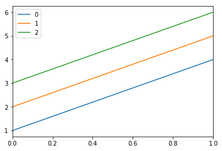

# tensorflow 2.0

tensorlowが1.x系から2.x系へバージョンアップされました。大きな変更点は、define and runからdefine by runに変更になったことだと思います。ここでは、自分がtensorflow 2.0を利用していく中で、注意した方が良いと思う点や、実務を効率的にこなすために覚えておこうと意識した点をまとめていきます。

## tf.data.Dataset
 
tf.data.Datasetはかなり便利です。教師あり学習の場合、ニューラルネットに投入するデータは通常、データとラベルがありますが、それを一喝してまとめてデータセットとして扱う際に力を発揮します。また、データのバッチ化やシャッフル機能、mapなどにも対応しており、tensorflowを利用するならば、必ず利用する機能かと思います。

### tf.data.from_tensors

まずはtensorflowの読み込みと、基本的なデータセットの作成からです。
データセットの作成は、

```python
tf.data.Dataset.from_tensors
```

を利用します。tensorflowのversionは以下の通りです。


```python
import tensorflow as tf

tf.__version__
```


    '2.1.0'


tensorflowの名前の元である、0階、1階、2階のtensorのDatasetは以下の様に作れます。引数はList型やtf.constなどでも大丈夫です。暗黙的にTensor型に変換してくれます。


```python
dataset0 = tf.data.Dataset.from_tensors(1)
print(dataset0)
dataset1 = tf.data.Dataset.from_tensors([1,2])
print(dataset1)
dataset2 = tf.data.Dataset.from_tensors([[1,2],[3,4]])
print(dataset2)
```

    <TensorDataset shapes: (), types: tf.int32>
    <TensorDataset shapes: (2,), types: tf.int32>
    <TensorDataset shapes: (2, 2), types: tf.int32>


shapesが(),(2,),(2,2)となっていて、それぞれの次元のtensorが出来ています。また、Datasetはジェネレータのため、値を参照するにはイテレータの様に呼び出す必要があります。また、Dataset型から取り出されたEagerTensor型はnumpy()メソッドを実装しており、明示的にnumpy形式に変換することが出来ます。


```python
_dataset0 = next(iter(dataset0))
_dataset1 = next(iter(dataset1))
_dataset2 = next(iter(dataset2))
```

    <class 'tensorflow.python.framework.ops.EagerTensor'>
    <class 'tensorflow.python.data.ops.dataset_ops.TensorDataset'>
    <class 'tensorflow.python.framework.ops.EagerTensor'>


```python
print('_dataset0 : \n{}'.format(_dataset0.numpy()))
print('_dataset1 : \n{}'.format(_dataset1.numpy()))
print('_dataset2 : \n{}'.format(_dataset2.numpy()))
```

    _dataset0 : 
    1
    _dataset1 : 
    [1 2]
    _dataset2 : 
    [[1 2]
     [3 4]]


また、ジェネレータなのでforで取り出すことも可能です。


```python
for i in dataset0:
  print(i.numpy())
for i in dataset1:
  print(i.numpy())
for i in dataset2:
  print(i.numpy())
```

    1
    [1 2]
    [[1 2]
     [3 4]]


### tf.data.from_tensor_slices
おそらくDatasetを作るときは、元々何らかの形でリスト型になっている物をDataset型に変換することが多いと思いますので、実際は`tf.data.from_tensors`よりこちらの方をよく使うと思います。
まずは一次元リストを入れてみます。


```python
dataset_20 = tf.data.Dataset.from_tensor_slices([i for i in range(5)])
```


```python
for i in dataset_20:
  print(i)
```

    tf.Tensor(0, shape=(), dtype=int32)
    tf.Tensor(1, shape=(), dtype=int32)
    tf.Tensor(2, shape=(), dtype=int32)
    tf.Tensor(3, shape=(), dtype=int32)
    tf.Tensor(4, shape=(), dtype=int32)


```python
dataset_20
```


    <TensorSliceDataset shapes: (), types: tf.int32>


となります。tensor_slicesという名前から予想されるとおり、リストから順番にスライスしてDatasetを作っているイメージですね。二次元のリストを入れると以下の通りです。


```python
dataset_21 = tf.data.Dataset.from_tensor_slices([[j for j in range(3)] for i in range(4)])
```


```python
for i in dataset_21:
  print(i)
```

    tf.Tensor([0 1 2], shape=(3,), dtype=int32)
    tf.Tensor([0 1 2], shape=(3,), dtype=int32)
    tf.Tensor([0 1 2], shape=(3,), dtype=int32)
    tf.Tensor([0 1 2], shape=(3,), dtype=int32)


こちらも想像通り、一次元のリストのDataset型となっています。


```python
import seaborn as sns
import pandas as pd

df = pd.DataFrame([[1,2,3], [4,5,6]])

df.plot()

```


    <matplotlib.axes._subplots.AxesSubplot at 0x142e8b438>





## tf.keras.preprocessing 

自然言語処理処理では、配列を同じ長さに揃える必要があります。 
