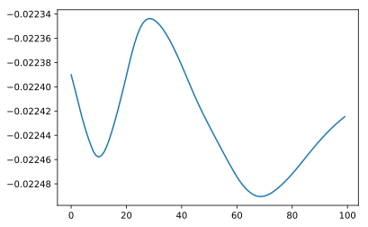

## BERTの基礎

今ではGoogleの検索アルゴリズムにも利用されているBertについて、手を動かして触ってみます。

### github
- jupyter notebook形式のファイルは[こちら](https://github.com/hiroshi0530/wa-src/tree/master/ml/lec/text/bert/bert_nb.ipynb)

### google colaboratory
<a href="https://colab.research.google.com/github/hiroshi0530/wa-src/tree/master/ml/lec/text/bert/bert_nb.ipynb" target="_parent"></a>

### 筆者の環境
筆者のOSはmacOSです。LinuxやUnixのコマンドとはオプションが異なります。


```python
!sw_vers
```

    ProductName:	Mac OS X
    ProductVersion:	10.14.6
    BuildVersion:	18G6032


```python
!python -V
```

    Python 3.8.5


基本的なライブラリとkerasをインポートしそのバージョンを確認しておきます。


```python
%matplotlib inline
%config InlineBackend.figure_format = 'svg'

import matplotlib
import matplotlib.pyplot as plt
import scipy
import numpy as np

import tensorflow as tf
from tensorflow import keras

import torch

print('matplotlib version :', matplotlib.__version__)
print('scipy version :', scipy.__version__)
print('numpy version :', np.__version__)
print('tensorflow version : ', tf.__version__)
print('keras version : ', keras.__version__)
print('torch version : ', torch.__version__)
```

    matplotlib version : 3.3.2
    scipy version : 1.5.2
    numpy version : 1.18.5
    tensorflow version :  2.3.1
    keras version :  2.4.0
    torch version :  1.7.0


## 必要なライブラリのインストール

今回入門用にやってみる pytorch-transformersをインストールします。

```bash
pip install pytorch-transformers
```

BertModelの事前学習済みのモデルの詳細を確認します。


```python
from pytorch_transformers import BertModel

bert_model = BertModel.from_pretrained('bert-base-uncased')
print(bert_model)
```

    100%|███████████████████████████████████████████████████████████████████████████████████| 433/433 [00:00<00:00, 135897.46B/s]
    100%|██████████████████████████████████████████████████████████████████████| 440473133/440473133 [01:07<00:00, 6547839.17B/s]


    BertModel(
      (embeddings): BertEmbeddings(
        (word_embeddings): Embedding(30522, 768, padding_idx=0)
        (position_embeddings): Embedding(512, 768)
        (token_type_embeddings): Embedding(2, 768)
        (LayerNorm): LayerNorm((768,), eps=1e-12, elementwise_affine=True)
        (dropout): Dropout(p=0.1, inplace=False)
      )
      (encoder): BertEncoder(
        (layer): ModuleList(
          (0): BertLayer(
            (attention): BertAttention(
              (self): BertSelfAttention(
                (query): Linear(in_features=768, out_features=768, bias=True)
                (key): Linear(in_features=768, out_features=768, bias=True)
                (value): Linear(in_features=768, out_features=768, bias=True)
                (dropout): Dropout(p=0.1, inplace=False)
              )
              (output): BertSelfOutput(
                (dense): Linear(in_features=768, out_features=768, bias=True)
                (LayerNorm): LayerNorm((768,), eps=1e-12, elementwise_affine=True)
                (dropout): Dropout(p=0.1, inplace=False)
              )
            )
            (intermediate): BertIntermediate(
              (dense): Linear(in_features=768, out_features=3072, bias=True)
            )
            (output): BertOutput(
              (dense): Linear(in_features=3072, out_features=768, bias=True)
              (LayerNorm): LayerNorm((768,), eps=1e-12, elementwise_affine=True)
              (dropout): Dropout(p=0.1, inplace=False)
            )
          )
          (1): BertLayer(
            (attention): BertAttention(
              (self): BertSelfAttention(
                (query): Linear(in_features=768, out_features=768, bias=True)
                (key): Linear(in_features=768, out_features=768, bias=True)
                (value): Linear(in_features=768, out_features=768, bias=True)
                (dropout): Dropout(p=0.1, inplace=False)
              )
              (output): BertSelfOutput(
                (dense): Linear(in_features=768, out_features=768, bias=True)
                (LayerNorm): LayerNorm((768,), eps=1e-12, elementwise_affine=True)
                (dropout): Dropout(p=0.1, inplace=False)
              )
            )
            (intermediate): BertIntermediate(
              (dense): Linear(in_features=768, out_features=3072, bias=True)
            )
            (output): BertOutput(
              (dense): Linear(in_features=3072, out_features=768, bias=True)
              (LayerNorm): LayerNorm((768,), eps=1e-12, elementwise_affine=True)
              (dropout): Dropout(p=0.1, inplace=False)
            )
          )
          (2): BertLayer(
            (attention): BertAttention(
              (self): BertSelfAttention(
                (query): Linear(in_features=768, out_features=768, bias=True)
                (key): Linear(in_features=768, out_features=768, bias=True)
                (value): Linear(in_features=768, out_features=768, bias=True)
                (dropout): Dropout(p=0.1, inplace=False)
              )
              (output): BertSelfOutput(
                (dense): Linear(in_features=768, out_features=768, bias=True)
                (LayerNorm): LayerNorm((768,), eps=1e-12, elementwise_affine=True)
                (dropout): Dropout(p=0.1, inplace=False)
              )
            )
            (intermediate): BertIntermediate(
              (dense): Linear(in_features=768, out_features=3072, bias=True)
            )
            (output): BertOutput(
              (dense): Linear(in_features=3072, out_features=768, bias=True)
              (LayerNorm): LayerNorm((768,), eps=1e-12, elementwise_affine=True)
              (dropout): Dropout(p=0.1, inplace=False)
            )
          )
          (3): BertLayer(
            (attention): BertAttention(
              (self): BertSelfAttention(
                (query): Linear(in_features=768, out_features=768, bias=True)
                (key): Linear(in_features=768, out_features=768, bias=True)
                (value): Linear(in_features=768, out_features=768, bias=True)
                (dropout): Dropout(p=0.1, inplace=False)
              )
              (output): BertSelfOutput(
                (dense): Linear(in_features=768, out_features=768, bias=True)
                (LayerNorm): LayerNorm((768,), eps=1e-12, elementwise_affine=True)
                (dropout): Dropout(p=0.1, inplace=False)
              )
            )
            (intermediate): BertIntermediate(
              (dense): Linear(in_features=768, out_features=3072, bias=True)
            )
            (output): BertOutput(
              (dense): Linear(in_features=3072, out_features=768, bias=True)
              (LayerNorm): LayerNorm((768,), eps=1e-12, elementwise_affine=True)
              (dropout): Dropout(p=0.1, inplace=False)
            )
          )
          (4): BertLayer(
            (attention): BertAttention(
              (self): BertSelfAttention(
                (query): Linear(in_features=768, out_features=768, bias=True)
                (key): Linear(in_features=768, out_features=768, bias=True)
                (value): Linear(in_features=768, out_features=768, bias=True)
                (dropout): Dropout(p=0.1, inplace=False)
              )
              (output): BertSelfOutput(
                (dense): Linear(in_features=768, out_features=768, bias=True)
                (LayerNorm): LayerNorm((768,), eps=1e-12, elementwise_affine=True)
                (dropout): Dropout(p=0.1, inplace=False)
              )
            )
            (intermediate): BertIntermediate(
              (dense): Linear(in_features=768, out_features=3072, bias=True)
            )
            (output): BertOutput(
              (dense): Linear(in_features=3072, out_features=768, bias=True)
              (LayerNorm): LayerNorm((768,), eps=1e-12, elementwise_affine=True)
              (dropout): Dropout(p=0.1, inplace=False)
            )
          )
          (5): BertLayer(
            (attention): BertAttention(
              (self): BertSelfAttention(
                (query): Linear(in_features=768, out_features=768, bias=True)
                (key): Linear(in_features=768, out_features=768, bias=True)
                (value): Linear(in_features=768, out_features=768, bias=True)
                (dropout): Dropout(p=0.1, inplace=False)
              )
              (output): BertSelfOutput(
                (dense): Linear(in_features=768, out_features=768, bias=True)
                (LayerNorm): LayerNorm((768,), eps=1e-12, elementwise_affine=True)
                (dropout): Dropout(p=0.1, inplace=False)
              )
            )
            (intermediate): BertIntermediate(
              (dense): Linear(in_features=768, out_features=3072, bias=True)
            )
            (output): BertOutput(
              (dense): Linear(in_features=3072, out_features=768, bias=True)
              (LayerNorm): LayerNorm((768,), eps=1e-12, elementwise_affine=True)
              (dropout): Dropout(p=0.1, inplace=False)
            )
          )
          (6): BertLayer(
            (attention): BertAttention(
              (self): BertSelfAttention(
                (query): Linear(in_features=768, out_features=768, bias=True)
                (key): Linear(in_features=768, out_features=768, bias=True)
                (value): Linear(in_features=768, out_features=768, bias=True)
                (dropout): Dropout(p=0.1, inplace=False)
              )
              (output): BertSelfOutput(
                (dense): Linear(in_features=768, out_features=768, bias=True)
                (LayerNorm): LayerNorm((768,), eps=1e-12, elementwise_affine=True)
                (dropout): Dropout(p=0.1, inplace=False)
              )
            )
            (intermediate): BertIntermediate(
              (dense): Linear(in_features=768, out_features=3072, bias=True)
            )
            (output): BertOutput(
              (dense): Linear(in_features=3072, out_features=768, bias=True)
              (LayerNorm): LayerNorm((768,), eps=1e-12, elementwise_affine=True)
              (dropout): Dropout(p=0.1, inplace=False)
            )
          )
          (7): BertLayer(
            (attention): BertAttention(
              (self): BertSelfAttention(
                (query): Linear(in_features=768, out_features=768, bias=True)
                (key): Linear(in_features=768, out_features=768, bias=True)
                (value): Linear(in_features=768, out_features=768, bias=True)
                (dropout): Dropout(p=0.1, inplace=False)
              )
              (output): BertSelfOutput(
                (dense): Linear(in_features=768, out_features=768, bias=True)
                (LayerNorm): LayerNorm((768,), eps=1e-12, elementwise_affine=True)
                (dropout): Dropout(p=0.1, inplace=False)
              )
            )
            (intermediate): BertIntermediate(
              (dense): Linear(in_features=768, out_features=3072, bias=True)
            )
            (output): BertOutput(
              (dense): Linear(in_features=3072, out_features=768, bias=True)
              (LayerNorm): LayerNorm((768,), eps=1e-12, elementwise_affine=True)
              (dropout): Dropout(p=0.1, inplace=False)
            )
          )
          (8): BertLayer(
            (attention): BertAttention(
              (self): BertSelfAttention(
                (query): Linear(in_features=768, out_features=768, bias=True)
                (key): Linear(in_features=768, out_features=768, bias=True)
                (value): Linear(in_features=768, out_features=768, bias=True)
                (dropout): Dropout(p=0.1, inplace=False)
              )
              (output): BertSelfOutput(
                (dense): Linear(in_features=768, out_features=768, bias=True)
                (LayerNorm): LayerNorm((768,), eps=1e-12, elementwise_affine=True)
                (dropout): Dropout(p=0.1, inplace=False)
              )
            )
            (intermediate): BertIntermediate(
              (dense): Linear(in_features=768, out_features=3072, bias=True)
            )
            (output): BertOutput(
              (dense): Linear(in_features=3072, out_features=768, bias=True)
              (LayerNorm): LayerNorm((768,), eps=1e-12, elementwise_affine=True)
              (dropout): Dropout(p=0.1, inplace=False)
            )
          )
          (9): BertLayer(
            (attention): BertAttention(
              (self): BertSelfAttention(
                (query): Linear(in_features=768, out_features=768, bias=True)
                (key): Linear(in_features=768, out_features=768, bias=True)
                (value): Linear(in_features=768, out_features=768, bias=True)
                (dropout): Dropout(p=0.1, inplace=False)
              )
              (output): BertSelfOutput(
                (dense): Linear(in_features=768, out_features=768, bias=True)
                (LayerNorm): LayerNorm((768,), eps=1e-12, elementwise_affine=True)
                (dropout): Dropout(p=0.1, inplace=False)
              )
            )
            (intermediate): BertIntermediate(
              (dense): Linear(in_features=768, out_features=3072, bias=True)
            )
            (output): BertOutput(
              (dense): Linear(in_features=3072, out_features=768, bias=True)
              (LayerNorm): LayerNorm((768,), eps=1e-12, elementwise_affine=True)
              (dropout): Dropout(p=0.1, inplace=False)
            )
          )
          (10): BertLayer(
            (attention): BertAttention(
              (self): BertSelfAttention(
                (query): Linear(in_features=768, out_features=768, bias=True)
                (key): Linear(in_features=768, out_features=768, bias=True)
                (value): Linear(in_features=768, out_features=768, bias=True)
                (dropout): Dropout(p=0.1, inplace=False)
              )
              (output): BertSelfOutput(
                (dense): Linear(in_features=768, out_features=768, bias=True)
                (LayerNorm): LayerNorm((768,), eps=1e-12, elementwise_affine=True)
                (dropout): Dropout(p=0.1, inplace=False)
              )
            )
            (intermediate): BertIntermediate(
              (dense): Linear(in_features=768, out_features=3072, bias=True)
            )
            (output): BertOutput(
              (dense): Linear(in_features=3072, out_features=768, bias=True)
              (LayerNorm): LayerNorm((768,), eps=1e-12, elementwise_affine=True)
              (dropout): Dropout(p=0.1, inplace=False)
            )
          )
          (11): BertLayer(
            (attention): BertAttention(
              (self): BertSelfAttention(
                (query): Linear(in_features=768, out_features=768, bias=True)
                (key): Linear(in_features=768, out_features=768, bias=True)
                (value): Linear(in_features=768, out_features=768, bias=True)
                (dropout): Dropout(p=0.1, inplace=False)
              )
              (output): BertSelfOutput(
                (dense): Linear(in_features=768, out_features=768, bias=True)
                (LayerNorm): LayerNorm((768,), eps=1e-12, elementwise_affine=True)
                (dropout): Dropout(p=0.1, inplace=False)
              )
            )
            (intermediate): BertIntermediate(
              (dense): Linear(in_features=768, out_features=3072, bias=True)
            )
            (output): BertOutput(
              (dense): Linear(in_features=3072, out_features=768, bias=True)
              (LayerNorm): LayerNorm((768,), eps=1e-12, elementwise_affine=True)
              (dropout): Dropout(p=0.1, inplace=False)
            )
          )
        )
      )
      (pooler): BertPooler(
        (dense): Linear(in_features=768, out_features=768, bias=True)
        (activation): Tanh()
      )
    )


## 設定の確認


```python
from pytorch_transformers import BertConfig

config = BertConfig.from_pretrained("bert-base-uncased")
print(config) 
```

    {
      "architectures": [
        "BertForMaskedLM"
      ],
      "attention_probs_dropout_prob": 0.1,
      "finetuning_task": null,
      "hidden_act": "gelu",
      "hidden_dropout_prob": 0.1,
      "hidden_size": 768,
      "initializer_range": 0.02,
      "intermediate_size": 3072,
      "layer_norm_eps": 1e-12,
      "max_position_embeddings": 512,
      "model_type": "bert",
      "num_attention_heads": 12,
      "num_hidden_layers": 12,
      "num_labels": 2,
      "output_attentions": false,
      "output_hidden_states": false,
      "pad_token_id": 0,
      "pruned_heads": {},
      "torchscript": false,
      "type_vocab_size": 2,
      "vocab_size": 30522
    }
    


```python
from transformers import BertForSequenceClassification

sc_model = BertForSequenceClassification.from_pretrained("bert-base-uncased", return_dict=True)
print(sc_model.state_dict().keys())
```


    HBox(children=(HTML(value='Downloading'), FloatProgress(value=0.0, max=433.0), HTML(value='')))


    


    HBox(children=(HTML(value='Downloading'), FloatProgress(value=0.0, max=440473133.0), HTML(value='')))


    


    Some weights of the model checkpoint at bert-base-uncased were not used when initializing BertForSequenceClassification: ['cls.predictions.bias', 'cls.predictions.transform.dense.weight', 'cls.predictions.transform.dense.bias', 'cls.predictions.decoder.weight', 'cls.seq_relationship.weight', 'cls.seq_relationship.bias', 'cls.predictions.transform.LayerNorm.weight', 'cls.predictions.transform.LayerNorm.bias']
    - This IS expected if you are initializing BertForSequenceClassification from the checkpoint of a model trained on another task or with another architecture (e.g. initializing a BertForSequenceClassification model from a BertForPreTraining model).
    - This IS NOT expected if you are initializing BertForSequenceClassification from the checkpoint of a model that you expect to be exactly identical (initializing a BertForSequenceClassification model from a BertForSequenceClassification model).
    Some weights of BertForSequenceClassification were not initialized from the model checkpoint at bert-base-uncased and are newly initialized: ['classifier.weight', 'classifier.bias']
    You should probably TRAIN this model on a down-stream task to be able to use it for predictions and inference.


    odict_keys(['bert.embeddings.position_ids', 'bert.embeddings.word_embeddings.weight', 'bert.embeddings.position_embeddings.weight', 'bert.embeddings.token_type_embeddings.weight', 'bert.embeddings.LayerNorm.weight', 'bert.embeddings.LayerNorm.bias', 'bert.encoder.layer.0.attention.self.query.weight', 'bert.encoder.layer.0.attention.self.query.bias', 'bert.encoder.layer.0.attention.self.key.weight', 'bert.encoder.layer.0.attention.self.key.bias', 'bert.encoder.layer.0.attention.self.value.weight', 'bert.encoder.layer.0.attention.self.value.bias', 'bert.encoder.layer.0.attention.output.dense.weight', 'bert.encoder.layer.0.attention.output.dense.bias', 'bert.encoder.layer.0.attention.output.LayerNorm.weight', 'bert.encoder.layer.0.attention.output.LayerNorm.bias', 'bert.encoder.layer.0.intermediate.dense.weight', 'bert.encoder.layer.0.intermediate.dense.bias', 'bert.encoder.layer.0.output.dense.weight', 'bert.encoder.layer.0.output.dense.bias', 'bert.encoder.layer.0.output.LayerNorm.weight', 'bert.encoder.layer.0.output.LayerNorm.bias', 'bert.encoder.layer.1.attention.self.query.weight', 'bert.encoder.layer.1.attention.self.query.bias', 'bert.encoder.layer.1.attention.self.key.weight', 'bert.encoder.layer.1.attention.self.key.bias', 'bert.encoder.layer.1.attention.self.value.weight', 'bert.encoder.layer.1.attention.self.value.bias', 'bert.encoder.layer.1.attention.output.dense.weight', 'bert.encoder.layer.1.attention.output.dense.bias', 'bert.encoder.layer.1.attention.output.LayerNorm.weight', 'bert.encoder.layer.1.attention.output.LayerNorm.bias', 'bert.encoder.layer.1.intermediate.dense.weight', 'bert.encoder.layer.1.intermediate.dense.bias', 'bert.encoder.layer.1.output.dense.weight', 'bert.encoder.layer.1.output.dense.bias', 'bert.encoder.layer.1.output.LayerNorm.weight', 'bert.encoder.layer.1.output.LayerNorm.bias', 'bert.encoder.layer.2.attention.self.query.weight', 'bert.encoder.layer.2.attention.self.query.bias', 'bert.encoder.layer.2.attention.self.key.weight', 'bert.encoder.layer.2.attention.self.key.bias', 'bert.encoder.layer.2.attention.self.value.weight', 'bert.encoder.layer.2.attention.self.value.bias', 'bert.encoder.layer.2.attention.output.dense.weight', 'bert.encoder.layer.2.attention.output.dense.bias', 'bert.encoder.layer.2.attention.output.LayerNorm.weight', 'bert.encoder.layer.2.attention.output.LayerNorm.bias', 'bert.encoder.layer.2.intermediate.dense.weight', 'bert.encoder.layer.2.intermediate.dense.bias', 'bert.encoder.layer.2.output.dense.weight', 'bert.encoder.layer.2.output.dense.bias', 'bert.encoder.layer.2.output.LayerNorm.weight', 'bert.encoder.layer.2.output.LayerNorm.bias', 'bert.encoder.layer.3.attention.self.query.weight', 'bert.encoder.layer.3.attention.self.query.bias', 'bert.encoder.layer.3.attention.self.key.weight', 'bert.encoder.layer.3.attention.self.key.bias', 'bert.encoder.layer.3.attention.self.value.weight', 'bert.encoder.layer.3.attention.self.value.bias', 'bert.encoder.layer.3.attention.output.dense.weight', 'bert.encoder.layer.3.attention.output.dense.bias', 'bert.encoder.layer.3.attention.output.LayerNorm.weight', 'bert.encoder.layer.3.attention.output.LayerNorm.bias', 'bert.encoder.layer.3.intermediate.dense.weight', 'bert.encoder.layer.3.intermediate.dense.bias', 'bert.encoder.layer.3.output.dense.weight', 'bert.encoder.layer.3.output.dense.bias', 'bert.encoder.layer.3.output.LayerNorm.weight', 'bert.encoder.layer.3.output.LayerNorm.bias', 'bert.encoder.layer.4.attention.self.query.weight', 'bert.encoder.layer.4.attention.self.query.bias', 'bert.encoder.layer.4.attention.self.key.weight', 'bert.encoder.layer.4.attention.self.key.bias', 'bert.encoder.layer.4.attention.self.value.weight', 'bert.encoder.layer.4.attention.self.value.bias', 'bert.encoder.layer.4.attention.output.dense.weight', 'bert.encoder.layer.4.attention.output.dense.bias', 'bert.encoder.layer.4.attention.output.LayerNorm.weight', 'bert.encoder.layer.4.attention.output.LayerNorm.bias', 'bert.encoder.layer.4.intermediate.dense.weight', 'bert.encoder.layer.4.intermediate.dense.bias', 'bert.encoder.layer.4.output.dense.weight', 'bert.encoder.layer.4.output.dense.bias', 'bert.encoder.layer.4.output.LayerNorm.weight', 'bert.encoder.layer.4.output.LayerNorm.bias', 'bert.encoder.layer.5.attention.self.query.weight', 'bert.encoder.layer.5.attention.self.query.bias', 'bert.encoder.layer.5.attention.self.key.weight', 'bert.encoder.layer.5.attention.self.key.bias', 'bert.encoder.layer.5.attention.self.value.weight', 'bert.encoder.layer.5.attention.self.value.bias', 'bert.encoder.layer.5.attention.output.dense.weight', 'bert.encoder.layer.5.attention.output.dense.bias', 'bert.encoder.layer.5.attention.output.LayerNorm.weight', 'bert.encoder.layer.5.attention.output.LayerNorm.bias', 'bert.encoder.layer.5.intermediate.dense.weight', 'bert.encoder.layer.5.intermediate.dense.bias', 'bert.encoder.layer.5.output.dense.weight', 'bert.encoder.layer.5.output.dense.bias', 'bert.encoder.layer.5.output.LayerNorm.weight', 'bert.encoder.layer.5.output.LayerNorm.bias', 'bert.encoder.layer.6.attention.self.query.weight', 'bert.encoder.layer.6.attention.self.query.bias', 'bert.encoder.layer.6.attention.self.key.weight', 'bert.encoder.layer.6.attention.self.key.bias', 'bert.encoder.layer.6.attention.self.value.weight', 'bert.encoder.layer.6.attention.self.value.bias', 'bert.encoder.layer.6.attention.output.dense.weight', 'bert.encoder.layer.6.attention.output.dense.bias', 'bert.encoder.layer.6.attention.output.LayerNorm.weight', 'bert.encoder.layer.6.attention.output.LayerNorm.bias', 'bert.encoder.layer.6.intermediate.dense.weight', 'bert.encoder.layer.6.intermediate.dense.bias', 'bert.encoder.layer.6.output.dense.weight', 'bert.encoder.layer.6.output.dense.bias', 'bert.encoder.layer.6.output.LayerNorm.weight', 'bert.encoder.layer.6.output.LayerNorm.bias', 'bert.encoder.layer.7.attention.self.query.weight', 'bert.encoder.layer.7.attention.self.query.bias', 'bert.encoder.layer.7.attention.self.key.weight', 'bert.encoder.layer.7.attention.self.key.bias', 'bert.encoder.layer.7.attention.self.value.weight', 'bert.encoder.layer.7.attention.self.value.bias', 'bert.encoder.layer.7.attention.output.dense.weight', 'bert.encoder.layer.7.attention.output.dense.bias', 'bert.encoder.layer.7.attention.output.LayerNorm.weight', 'bert.encoder.layer.7.attention.output.LayerNorm.bias', 'bert.encoder.layer.7.intermediate.dense.weight', 'bert.encoder.layer.7.intermediate.dense.bias', 'bert.encoder.layer.7.output.dense.weight', 'bert.encoder.layer.7.output.dense.bias', 'bert.encoder.layer.7.output.LayerNorm.weight', 'bert.encoder.layer.7.output.LayerNorm.bias', 'bert.encoder.layer.8.attention.self.query.weight', 'bert.encoder.layer.8.attention.self.query.bias', 'bert.encoder.layer.8.attention.self.key.weight', 'bert.encoder.layer.8.attention.self.key.bias', 'bert.encoder.layer.8.attention.self.value.weight', 'bert.encoder.layer.8.attention.self.value.bias', 'bert.encoder.layer.8.attention.output.dense.weight', 'bert.encoder.layer.8.attention.output.dense.bias', 'bert.encoder.layer.8.attention.output.LayerNorm.weight', 'bert.encoder.layer.8.attention.output.LayerNorm.bias', 'bert.encoder.layer.8.intermediate.dense.weight', 'bert.encoder.layer.8.intermediate.dense.bias', 'bert.encoder.layer.8.output.dense.weight', 'bert.encoder.layer.8.output.dense.bias', 'bert.encoder.layer.8.output.LayerNorm.weight', 'bert.encoder.layer.8.output.LayerNorm.bias', 'bert.encoder.layer.9.attention.self.query.weight', 'bert.encoder.layer.9.attention.self.query.bias', 'bert.encoder.layer.9.attention.self.key.weight', 'bert.encoder.layer.9.attention.self.key.bias', 'bert.encoder.layer.9.attention.self.value.weight', 'bert.encoder.layer.9.attention.self.value.bias', 'bert.encoder.layer.9.attention.output.dense.weight', 'bert.encoder.layer.9.attention.output.dense.bias', 'bert.encoder.layer.9.attention.output.LayerNorm.weight', 'bert.encoder.layer.9.attention.output.LayerNorm.bias', 'bert.encoder.layer.9.intermediate.dense.weight', 'bert.encoder.layer.9.intermediate.dense.bias', 'bert.encoder.layer.9.output.dense.weight', 'bert.encoder.layer.9.output.dense.bias', 'bert.encoder.layer.9.output.LayerNorm.weight', 'bert.encoder.layer.9.output.LayerNorm.bias', 'bert.encoder.layer.10.attention.self.query.weight', 'bert.encoder.layer.10.attention.self.query.bias', 'bert.encoder.layer.10.attention.self.key.weight', 'bert.encoder.layer.10.attention.self.key.bias', 'bert.encoder.layer.10.attention.self.value.weight', 'bert.encoder.layer.10.attention.self.value.bias', 'bert.encoder.layer.10.attention.output.dense.weight', 'bert.encoder.layer.10.attention.output.dense.bias', 'bert.encoder.layer.10.attention.output.LayerNorm.weight', 'bert.encoder.layer.10.attention.output.LayerNorm.bias', 'bert.encoder.layer.10.intermediate.dense.weight', 'bert.encoder.layer.10.intermediate.dense.bias', 'bert.encoder.layer.10.output.dense.weight', 'bert.encoder.layer.10.output.dense.bias', 'bert.encoder.layer.10.output.LayerNorm.weight', 'bert.encoder.layer.10.output.LayerNorm.bias', 'bert.encoder.layer.11.attention.self.query.weight', 'bert.encoder.layer.11.attention.self.query.bias', 'bert.encoder.layer.11.attention.self.key.weight', 'bert.encoder.layer.11.attention.self.key.bias', 'bert.encoder.layer.11.attention.self.value.weight', 'bert.encoder.layer.11.attention.self.value.bias', 'bert.encoder.layer.11.attention.output.dense.weight', 'bert.encoder.layer.11.attention.output.dense.bias', 'bert.encoder.layer.11.attention.output.LayerNorm.weight', 'bert.encoder.layer.11.attention.output.LayerNorm.bias', 'bert.encoder.layer.11.intermediate.dense.weight', 'bert.encoder.layer.11.intermediate.dense.bias', 'bert.encoder.layer.11.output.dense.weight', 'bert.encoder.layer.11.output.dense.bias', 'bert.encoder.layer.11.output.LayerNorm.weight', 'bert.encoder.layer.11.output.LayerNorm.bias', 'bert.pooler.dense.weight', 'bert.pooler.dense.bias', 'classifier.weight', 'classifier.bias'])


## 最適化アルゴリズム
今回は、最適化アルゴリズムに`AdamW`を採用します。  
`AdamW`は、オリジナルのAdamの重みの減衰に関する式を変更したものです。  
https://arxiv.org/abs/1711.05101


```python
from transformers import AdamW

optimizer = AdamW(sc_model.parameters(), lr=1e-5)
```

## Tokenizerの設定
`BertTokenizer`により文章を単語に分割し、idに変換します。  
`BertForSequenceClassification`のモデルの訓練時には入力の他にAttention maskを渡す必要があるのですが、`BertTokenizer`によりこちらも得ることができます。


```python
from transformers import BertTokenizer

tokenizer = BertTokenizer.from_pretrained("bert-base-uncased")
sentences = ["I love baseball.", "I hate baseball."]
tokenized = tokenizer(sentences, return_tensors="pt", padding=True, truncation=True)
print(tokenized)

x = tokenized["input_ids"]
attention_mask = tokenized["attention_mask"]
```


    HBox(children=(HTML(value='Downloading'), FloatProgress(value=0.0, max=231508.0), HTML(value='')))


    
    {'input_ids': tensor([[ 101, 1045, 2293, 3598, 1012,  102],
            [ 101, 1045, 5223, 3598, 1012,  102]]), 'token_type_ids': tensor([[0, 0, 0, 0, 0, 0],
            [0, 0, 0, 0, 0, 0]]), 'attention_mask': tensor([[1, 1, 1, 1, 1, 1],
            [1, 1, 1, 1, 1, 1]])}


## ファインチューニング
事前に学習済みのモデルに対して、追加で訓練を行います。


```python
import torch
from torch.nn import functional as F
import matplotlib.pyplot as plt

sc_model.train()
t = torch.tensor([1,0])  # 文章の分類

weight_record = []  # 重みを記録

for i in range(100):
    y = sc_model(x, attention_mask=attention_mask)
    loss = F.cross_entropy(y.logits, t)
    loss.backward()
    optimizer.step()

    weight = sc_model.state_dict()["bert.encoder.layer.11.output.dense.weight"][0][0].item()
    weight_record.append(weight)

plt.plot(range(len(weight_record)), weight_record)
plt.show()
```


    

    


追加の訓練により、重みが調整されていく様子が確認できます。


```python
1 + 1
```


    2


```python
for i in range(100):
  print(i)

```

    0
    1
    2
    3
    4
    5
    6
    7
    8
    9
    10
    11
    12
    13
    14
    15
    16
    17
    18
    19
    20
    21
    22
    23
    24
    25
    26
    27
    28
    29
    30
    31
    32
    33
    34
    35
    36
    37
    38
    39
    40
    41
    42
    43
    44
    45
    46
    47
    48
    49
    50
    51
    52
    53
    54
    55
    56
    57
    58
    59
    60
    61
    62
    63
    64
    65
    66
    67
    68
    69
    70
    71
    72
    73
    74
    75
    76
    77
    78
    79
    80
    81
    82
    83
    84
    85
    86
    87
    88
    89
    90
    91
    92
    93
    94
    95
    96
    97
    98
    99

