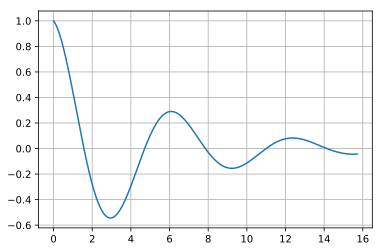
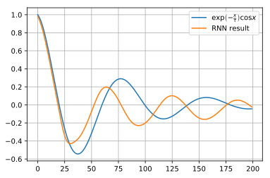
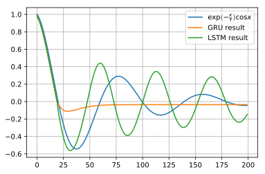

## kerasとGRUの基礎, LSTMとの比較

GRUはLSTMのパラメタの多さ、すなわち計算コストが高いという欠点を補うために作られたモデルです。記憶の更新と記憶の忘却という操作を一つにまとめて実行し、計算コストを下げています。詳細は検索すればいくらでも出てくるので割愛します。また、せっかくなので、GRUとLSTMの比較を行ってみます。

### github
- jupyter notebook形式のファイルは[こちら](https://github.com/hiroshi0530/wa-src/tree/master/ml/lec/text/gru/gru_nb.ipynb)

### google colaboratory
- google colaboratory で実行する場合は[こちら](https://colab.research.google.com/github/hiroshi0530/wa-src/tree/master/ml/lec/text/gru/gru_nb.ipynb)

### 筆者の環境
筆者のOSはmacOSです。LinuxやUnixのコマンドとはオプションが異なります。


```python
!sw_vers
```

    ProductName:	Mac OS X
    ProductVersion:	10.14.6
    BuildVersion:	18G6020


```python
!python -V
```

    Python 3.7.3


基本的なライブラリとkerasをインポートしそのバージョンを確認しておきます。


```python
%matplotlib inline
%config InlineBackend.figure_format = 'svg'

import matplotlib
import matplotlib.pyplot as plt
import scipy
import numpy as np

import tensorflow as tf
from tensorflow import keras

print('matplotlib version :', matplotlib.__version__)
print('scipy version :', scipy.__version__)
print('numpy version :', np.__version__)
print('tensorflow version : ', tf.__version__)
print('keras version : ', keras.__version__)
```

    matplotlib version : 3.0.3
    scipy version : 1.4.1
    numpy version : 1.19.4
    tensorflow version :  2.1.0
    keras version :  2.2.4-tf


## 減衰振動曲線

サンプル用のデータとして、以下の式からサンプリングを行います。

$$
y = \exp\left(-\frac{x}{\tau}\right)\cos(x) 
$$

波を打ちながら、次第に収束していく、自然現象ではよくあるモデルになります。LSTMと比較するため、サンプルデータは同じ関数とします。


```python
x = np.linspace(0, 5 * np.pi, 200)
y = np.exp(-x / 5) * (np.cos(x))
```

### データの確認

$x$と$y$のデータの詳細を見てみます。


```python
print('shape : ', x.shape)
print('ndim : ', x.ndim)
print('data : ', x[:10])
```

    shape :  (200,)
    ndim :  1
    data :  [0.         0.07893449 0.15786898 0.23680347 0.31573796 0.39467244
     0.47360693 0.55254142 0.63147591 0.7104104 ]


```python
print('shape : ', y.shape)
print('ndim : ', y.ndim)
print('data : ', y[:10])
```

    shape :  (200,)
    ndim :  1
    data :  [1.         0.98127212 0.9568705  0.92712705 0.89239742 0.85305798
     0.80950282 0.76214062 0.71139167 0.65768474]


グラフを確認してみます。


```python
plt.plot(x,y)
plt.grid()
plt.show()
```





$\tau=5$として、綺麗な減衰曲線が得られました。

## ニューラルネットの構築

kerasに投入するためにデータの前処理を行い、再帰型のニューラルネットの構築を行います。

構築が終了したら、compileメソッドを利用して、モデルをコンパイルします。compileの仕様は以下の様になっています。

```bash
compile(self, optimizer, loss, metrics=None, sample_weight_mode=None, weighted_metrics=None, target_tensors=None)
```


```python
from tensorflow.keras.models import Sequential
from tensorflow.keras.layers import Dense
from tensorflow.keras.layers import LSTM
from tensorflow.keras.layers import GRU

NUM_GRU = 20
NUM_MIDDLE = 40

# データの前処理
n = len(x) - NUM_GRU
r_x = np.zeros((n, NUM_GRU))
r_y = np.zeros((n, NUM_GRU))
for i in range(0, n):
  r_x[i] = y[i: i + NUM_GRU]
  r_y[i] = y[i + 1: i + NUM_GRU + 1]

r_x = r_x.reshape(n, NUM_GRU, 1)
r_y = r_y.reshape(n, NUM_GRU, 1)

# gruニューラルネットの構築
gru_model = Sequential()
gru_model.add(GRU(NUM_MIDDLE, input_shape=(NUM_GRU, 1), return_sequences=True))
gru_model.add(Dense(1, activation="linear"))
gru_model.compile(loss="mean_squared_error", optimizer="sgd")

# LSTMニューラルネットの構築
lstm_model = Sequential()
lstm_model.add(LSTM(NUM_MIDDLE, input_shape=(NUM_GRU, 1), return_sequences=True))
lstm_model.add(Dense(1, activation="linear"))
lstm_model.compile(loss="mean_squared_error", optimizer="sgd")
```

投入するデータや、モデルの概要を確認します。


```python
print(r_y.shape)
print(r_x.shape)
```

    (180, 20, 1)
    (180, 20, 1)


二つのモデルの比較を行います。RNNの時と同様、LSTMの方がパラメタ数が多いことがわかります。とは言いつつも、GRUの方が2割減程度になっています。学習するにもLSTMの方が時間がかかります。


```python
print(gru_model.summary())
print(lstm_model.summary())
```

    Model: "sequential"
    _________________________________________________________________
    Layer (type)                 Output Shape              Param #   
    =================================================================
    gru (GRU)                    (None, 20, 40)            5160      
    _________________________________________________________________
    dense (Dense)                (None, 20, 1)             41        
    =================================================================
    Total params: 5,201
    Trainable params: 5,201
    Non-trainable params: 0
    _________________________________________________________________
    None
    Model: "sequential_1"
    _________________________________________________________________
    Layer (type)                 Output Shape              Param #   
    =================================================================
    lstm (LSTM)                  (None, 20, 40)            6720      
    _________________________________________________________________
    dense_1 (Dense)              (None, 20, 1)             41        
    =================================================================
    Total params: 6,761
    Trainable params: 6,761
    Non-trainable params: 0
    _________________________________________________________________
    None


## 学習

fitメソッドを利用して、学習を行います。
fitメソッドの仕様は以下の通りになっています。[こちら](https://keras.io/ja/models/sequential/)を参照してください。

```bash
fit(self, x=None, y=None, batch_size=None, epochs=1, verbose=1, callbacks=None, validation_split=0.0, validation_data=None, shuffle=True, class_weight=None, sample_weight=None, initial_epoch=0, steps_per_epoch=None, validation_steps=None)
```


```python
batch_size = 10
epochs = 1000

# validation_split で最後の10％を検証用に利用します
gru_history = gru_model.fit(r_x, r_y, epochs=epochs, batch_size=batch_size, validation_split=0.1, verbose=0)

# validation_split で最後の10％を検証用に利用します
lstm_history = lstm_model.fit(r_x, r_y, epochs=epochs, batch_size=batch_size, validation_split=0.1, verbose=0)
```

## 損失関数の可視化

学習によって誤差が減少していく様子を可視化してみます。


```python
gru_loss = gru_history.history['loss'] # 訓練データの損失関数
gru_val_loss = gru_history.history['val_loss'] #テストデータの損失関数

lstm_loss = lstm_history.history['loss'] # 訓練データの損失関数
lstm_val_loss = lstm_history.history['val_loss'] #テストデータの損失関数

plt.plot(np.arange(len(gru_loss)), gru_loss, label='gru_loss')
plt.plot(np.arange(len(gru_val_loss)), gru_val_loss, label='gru_val_loss')
plt.plot(np.arange(len(lstm_loss)), lstm_loss, label='lstm_loss')
plt.plot(np.arange(len(lstm_val_loss)), lstm_val_loss, label='lstm_val_loss')
plt.grid()
plt.legend()
plt.show()
```





## 結果の確認


```python
# 初期の入力値
gru_res = r_y[0].reshape(-1)
lstm_res = r_y[0].reshape(-1)

for i in range(0, n):
  _gru_y = gru_model.predict(gru_res[- NUM_GRU:].reshape(1, NUM_GRU, 1))
  gru_res = np.append(gru_res, _gru_y[0][NUM_GRU - 1][0])
  
  _lstm_y = lstm_model.predict(lstm_res[- NUM_GRU:].reshape(1, NUM_GRU, 1))
  lstm_res = np.append(lstm_res, _lstm_y[0][NUM_GRU - 1][0])
  
plt.plot(np.arange(len(y)), y, label=r"$\exp\left(-\frac{x}{\tau}\right) \cos x$")
plt.plot(np.arange(len(gru_res)), gru_res, label="GRU result")
plt.plot(np.arange(len(lstm_res)), lstm_res, label="LSTM result")
plt.legend()
plt.grid()
plt.show()
```





今回の減衰振動曲線の場合は、GRUがあまり振動を再現できていないことがわかりました。しかし、GRUが悪いわけではなく、今回の減衰しながら振動するモデルには会わなかったというだけです。また、GRUの方がパラメタ数が少ない事がわかりました。
実務レベルでは、GRUよりもLSTMの方が使われる事が多いと思います。それは、パラメタが減ると言ってもそれほど劇的に減る訳ではなく、それならば、記憶の更新と忘却を同じにするよりも、別々に行った方が精度が上がり、そちらの方がアウトプット全体としては良いと考える人が多いからだと思います。
