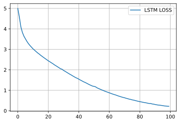

## kerasとLSTMを用いた文章の生成

LSTMを用いて文章を生成することが出来ます。文章を時系列データとして訓練データとして学習し、文章を入力し、次の文字列を予測するようなっモデルを生成します。今回は前回青空文庫からダウンロードした、宮沢賢治の銀河鉄道の夜を学習データとして採用し、LSTMによって、宮沢賢治風の文章を作成してみようと思います。

### github
- jupyter notebook形式のファイルは[こちら](https://github.com/hiroshi0530/wa-src/tree/master/ml/lec/text/lstm_nlp/lstm_nb.ipynb)

### google colaboratory
- google colaboratory で実行する場合は[こちら](https://colab.research.google.com/github/hiroshi0530/wa-src/tree/master/ml/lec/text/lstm_nlp/lstm_nb.ipynb)

### 筆者の環境
筆者のOSはmacOSです。LinuxやUnixのコマンドとはオプションが異なります。


```python
!sw_vers
```

    ProductName:	Mac OS X
    ProductVersion:	10.14.6
    BuildVersion:	18G6032


```python
!python -V
```

    Python 3.8.5


基本的なライブラリとkerasをインポートしそのバージョンを確認しておきます。


```python
%matplotlib inline
%config InlineBackend.figure_format = 'svg'

import matplotlib
import matplotlib.pyplot as plt
import scipy
import numpy as np

import tensorflow as tf
from tensorflow import keras
import gensim

print('matplotlib version :', matplotlib.__version__)
print('scipy version :', scipy.__version__)
print('numpy version :', np.__version__)
print('tensorflow version : ', tf.__version__)
print('keras version : ', keras.__version__)
print('gensim version : ', gensim.__version__)
```

    matplotlib version : 3.3.2
    scipy version : 1.5.2
    numpy version : 1.18.5
    tensorflow version :  2.3.1
    keras version :  2.4.0
    gensim version :  3.8.3


## テキストファイルの前処理

題材として、宮沢賢治の銀河鉄道の夜を利用します。既に著作権フリーなので、自由に利用できます。ちなみに、宮沢賢治は同郷で高校の先輩ですが、日本語が全く出来ない私は一度も読んだことはないです。ですので、LSTMによる文章が自然なものなのか、宮沢賢治風なのか、不明です。。

銀河鉄道の夜は以前、word2vecを利用した[分散表現の作成の記事](/ml/lec/text/w2v/)で利用しました。
テキストの前処理などは重複する部分があるかと思います。

まずはテキストの中身を見てみます。


```bash
%%bash
cat ginga.txt | head -n 25
```

    銀河鉄道の夜
    宮沢賢治
    
    -------------------------------------------------------
    【テキスト中に現れる記号について】
    
    《》：ルビ
    （例）北十字《きたじふじ》
    
    ［＃］：入力者注　主に外字の説明や、傍点の位置の指定
    　　　（数字は、JIS X 0213の面区点番号またはUnicode、底本のページと行数）
    （例）※［＃小書き片仮名ヰ、155-15］
    
    　［＃（…）］：訓点送り仮名
    　（例）僕［＃（ん）］とこ
    -------------------------------------------------------
    
    ［＃７字下げ］一、午后の授業［＃「一、午后の授業」は中見出し］
    
    「ではみなさんは、さういふふうに川だと云はれたり、乳の流れたあとだと云はれたりしてゐたこのぼんやりと白いものがほんたうは何かご承知ですか。」先生は、黒板に吊した大きな黒い星座の図の、上から下へ白くけぶった銀河帯のやうなところを指しながら、みんなに問をかけました。
    カムパネルラが手をあげました。それから四五人手をあげました。ジョバンニも手をあげやうとして、急いでそのまゝやめました。たしかにあれがみんな星だと、いつか雑誌で読んだのでしたが、このごろはジョバンニはまるで毎日教室でもねむく、本を読むひまも読む本もないので、なんだかどんなこともよくわからないといふ気持ちがするのでした。
    ところが先生は早くもそれを見附けたのでした。
    「ジョバンニさん。あなたはわかってゐるのでせう。」
    ジョバンニは勢よく立ちあがりましたが、立って見るともうはっきりとそれを答へることができないのでした。ザネリが前の席からふりかへって、ジョバンニを見てくすっとわらひました。ジョバンニはもうどぎまぎしてまっ赤になってしまひました。先生がまた云ひました。
    「大きな望遠鏡で銀河をよっく調べると銀河は大体何でせう。」


```bash
%%bash
cat ginga.txt | tail -n 25
```

    ジョバンニはそのカムパネルラはもうあの銀河のはづれにしかゐないといふやうな気がしてしかたなかったのです。
    けれどもみんなはまだ、どこかの波の間から、
    「ぼくずゐぶん泳いだぞ。」と云ひながらカムパネルラが出て来るか或ひはカムパネルラがどこかの人の知らない洲にでも着いて立ってゐて誰かの来るのを待ってゐるかといふやうな気がして仕方ないらしいのでした。けれども俄かにカムパネルラのお父さんがきっぱり云ひました。
    「もう駄目です。落ちてから四十五分たちましたから。」
    ジョバンニは思はずか〔け〕よって博士の前に立って、ぼくはカムパネルラの行った方を知ってゐますぼくはカムパネルラといっしょに歩いてゐたのですと云はうとしましたがもうのどがつまって何とも云へませんでした。すると博士はジョバンニが挨拶に来たとでも思ったものですか　しばらくしげしげジョバンニを見てゐましたが
    「あなたはジョバンニさんでしたね。どうも今晩はありがたう。」と叮ねいに云ひました。
    　ジョバンニは何も云へずにたゞおじぎをしました。
    「あなたのお父さんはもう帰ってゐますか。」博士は堅く時計を握ったまゝまたきゝました。
    「いゝえ。」ジョバンニはかすかに頭をふりました。
    「どうしたのかなあ、ぼくには一昨日大へん元気な便りがあったんだが。今日あ〔〕たりもう着くころなんだが。船が遅れたんだな。ジョバンニさん。あした放課后みなさんとうちへ遊びに来てくださいね。」
    さう云ひながら博士は〔〕また川下の銀河のいっぱいにうつった方へじっと眼を送りました。ジョバンニはもういろいろなことで胸がいっぱいでなんにも云へずに博士の前をはなれて早くお母さんに牛乳を持って行ってお父さんの帰ることを知らせやうと思ふともう一目散に河原を街の方へ走りました。
    
    
    
    底本：「【新】校本宮澤賢治全集　第十一巻　童話※［＃ローマ数字4、1-13-24］　本文篇」筑摩書房
    　　　1996（平成8）年1月25日初版第1刷発行
    ※底本のテキストは、著者草稿によります。
    ※底本では校訂及び編者による説明を「〔　〕」、削除を「〔〕」で表示しています。
    ※「カムパネルラ」と「カンパネルラ」の混在は、底本通りです。
    ※底本は新字旧仮名づかいです。なお拗音、促音の小書きは、底本通りです。
    入力：砂場清隆
    校正：北川松生
    2016年6月10日作成
    青空文庫作成ファイル：
    このファイルは、インターネットの図書館、青空文庫（http://www.aozora.gr.jp/）で作られました。入力、校正、制作にあたったのは、ボランティアの皆さんです。


となり、ファイルの先頭と、末尾に参考情報が載っているほかは、ちゃんとテキストとしてデータが取れている模様です。
先ず、この辺の前処理を行います。


```python
import re

with open('ginga.txt', mode='r') as f:
  all_sentence = f.read()
```


```python
all_sentence = all_sentence.replace(" ", "").replace("　","").replace("\n","").replace("|","")
```

《》で囲まれたルビの部分を削除します。正規表現を利用します。


```python
all_sentence = re.sub("《[^》]+》", "", all_sentence)
```

----------の部分で分割を行い、2番目の要素を取得します。


```python
all_sentence = re.split("\-{8,}", all_sentence)[2]
all_sentence[:100]
```


    '［＃７字下げ］一、午后の授業［＃「一、午后の授業」は中見出し］「ではみなさんは、さういふふうに川だと云はれたり、乳の流れたあとだと云はれたりしてゐたこのぼんやりと白いものがほんたうは何かご承知ですか。'


となり、不要な部分を削除し、必要な部分をall_sentenceに格納しました。

## one hot vectorの作成

文章を学習させるには、日本語の文字1文字1文字をベクトルとして表現する必要があります。前回やったとおりword2vecを用いてベクトル表現を得る方法もありますが、ここでは、それぞれの文字に対して、`[0,0,1,0,0]`などのone-hot-vectorを付与します。ですので、ベクトルの次元数としては、文字数分だけあり、学習にかなりの時間を要します。

まず、銀河鉄道の夜で利用されている文字をすべて取り出します。


```python
all_chars = sorted(list(set(all_sentence)))
all_chars[:10]
```


    ['-', '.', '/', '0', '1', '2', '3', '4', '5', '6']


```python
len(all_chars)
```


    1119


次に、文字に対して数字を対応させます。上記の`all_chars`に格納された順番の数字を付与します。


```python
char_num_dic = dict((c, i) for i, c in enumerate(all_chars))
num_char_dic = dict((i, c) for i, c in enumerate(all_chars))
```

後の処理を簡単にするために、文字列を受け取って、対応する数字のリストを返す関数を作成します。


```python
def get_scalar_list(char_list):
  return [char_num_dic[c] for c in char_list]
```

この関数を利用し、予想に利用する文字列と予想する文字を数字のリストに変換します。

また、LSTMで予測するのに必要な時系列データの数を100とします。
100個の文字列から、次の1文字を予測するモデルを作成します。


```python
NUM_LSTM = 100

train_chars_list = []
predict_char_list = []
for c in range(0, len(all_sentence) - NUM_LSTM):
  train_chars_list.append(get_scalar_list(all_sentence[c: c + NUM_LSTM]))
  predict_char_list.append(char_num_dic[all_sentence[c + NUM_LSTM]])
```


```python
print(train_chars_list[0])
```

    [1117, 1110, 1114, 403, 190, 50, 1118, 183, 26, 295, 327, 78, 538, 628, 1117, 1110, 29, 183, 26, 295, 327, 78, 538, 628, 30, 79, 195, 942, 261, 55, 1118, 29, 71, 79, 94, 74, 53, 112, 79, 26, 53, 39, 38, 85, 85, 39, 75, 440, 64, 72, 204, 79, 107, 63, 105, 26, 201, 78, 682, 107, 63, 36, 72, 64, 72, 204, 79, 107, 63, 105, 55, 70, 110, 63, 51, 78, 91, 112, 99, 105, 72, 769, 38, 97, 78, 44, 90, 112, 63, 39, 79, 225, 43, 52, 519, 790, 71, 57, 43, 27]


```python
print(predict_char_list[0])
```

    30


train_chars[0]からpredict_char[0]を予測するようなモデルを作成します。

これらの数字をone hot vectorで表現します。

表現するベクトルのサイズは`len(all_chars)`となります。また、kerasに投入することを前提に、入力するテンソルの形状として

`(サンプル数、予測に利用する時系列データの数、one-hot-vectorの次元)`となります。


```python
# xを入力するデータ
# yを正解データ
# one-hot-vectorを入力するため、最初にゼロベクトルを作成します。

x = np.zeros((len(train_chars_list), NUM_LSTM, len(all_chars)), dtype=np.bool)
y = np.zeros((len(predict_char_list), len(all_chars)), dtype=np.bool)
```

必要な部分だけ1に修正します。


```python
# 入力データに割り当てられた数字の要素を1に設定します。
for i in range(len(train_chars_list)):
  for j in range(NUM_LSTM):
    x[i, j, train_chars_list[i][j]] = 1

# 正解データに割り当てられた数字の要素を1に設定します。
for i in range(len(predict_char_list)):
  y[i, predict_char_list[i]] = 1
```

## one-hot-vectorの確認

実際に想定通りone-hot-vectorが出来ているか確認してみます。`np.where`を利用してtrueとなっているインデックスを取得してみます。


```python
np.where(x[0][:-1] == 1)[1]
```


    array([1117, 1110, 1114,  403,  190,   50, 1118,  183,   26,  295,  327,
             78,  538,  628, 1117, 1110,   29,  183,   26,  295,  327,   78,
            538,  628,   30,   79,  195,  942,  261,   55, 1118,   29,   71,
             79,   94,   74,   53,  112,   79,   26,   53,   39,   38,   85,
             85,   39,   75,  440,   64,   72,  204,   79,  107,   63,  105,
             26,  201,   78,  682,  107,   63,   36,   72,   64,   72,  204,
             79,  107,   63,  105,   55,   70,  110,   63,   51,   78,   91,
            112,   99,  105,   72,  769,   38,   97,   78,   44,   90,  112,
             63,   39,   79,  225,   43,   52,  519,  790,   71,   57,   43])


```python
np.where(y[0] == 1)
```


    (array([30]),)


となり、想定通りone-hot-vectorが出来ていることがわかりました。

## モデルの構築

LSTMのモデルを構築する関数を作成します。
ここでは簡単にLSTMと全結合層で構成されたモデルを作成します。


```python
from tensorflow.keras.models import Sequential
from tensorflow.keras.layers import SimpleRNN
from tensorflow.keras.layers import Dense
from tensorflow.keras.layers import LSTM

# 定数の設定
NUM_MIDDLE = 300
epochs = 100
batch_size = 128


def build_lstm_model():
  lstm_model = Sequential()
  lstm_model.add(LSTM(NUM_MIDDLE, input_shape=(NUM_LSTM, len(all_chars))))
  lstm_model.add(Dense(len(all_chars), activation="softmax"))
  lstm_model.compile(loss='categorical_crossentropy', optimizer="adam")
  
  print(lstm_model.summary())
  
  return lstm_model

model = build_lstm_model()
```

    Model: "sequential"
    _________________________________________________________________
    Layer (type)                 Output Shape              Param #   
    =================================================================
    lstm (LSTM)                  (None, 300)               1704000   
    _________________________________________________________________
    dense (Dense)                (None, 1119)              336819    
    =================================================================
    Total params: 2,040,819
    Trainable params: 2,040,819
    Non-trainable params: 0
    _________________________________________________________________
    None


LSTMによる文章作成は、学習に非常に時間がかかるため、各epoch終了後の文章を確認するために、epoch終了後に実行されるコールバック関数を実装します。
`LambdaCallback`に関数を登録事でコールバック関数を登録することが出来ます。

コールバック関数については公式サイトのこちらを[参照](https://keras.io/ja/callbacks/#lambdacallback)してください。epochの開始時、終了時、バッチ処理の開始時、終了時など様々なオプションがあります。

- on_epoch_begin: すべてのエポックの開始時に呼ばれる
- on_epoch_end: すべてのエポックの終了時に呼ばれる
- on_batch_begin: すべてのバッチの開始時に呼ばれる
- on_batch_end: すべてのバッチの終了時に呼ばれる
- on_train_begin: 訓練の開始時に呼ばれる
- on_train_end: 訓練の終了時に呼ばれる

また、予測結果から実際に文字をサンプルするための関数を`sample`として実装します。こちらは様々な方式や考え方があるかと思いますが、今回は公式サイトの通りに実装してみます。

以下のサイトを参考にしています。

- https://keras.io/api/callbacks/ 
- https://keras.io/examples/generative/lstm_character_level_text_generation/#train-the-model 


```python
from tensorflow.keras.callbacks import LambdaCallback

# サンプリングするためのヘルパー関数
# helper function to sample an index from a probability array
def get_index(preds, temperature=1.0):
  preds = np.asarray(preds).astype("float64")
  preds = np.log(preds) / temperature
  exp_preds = np.exp(preds)
  preds = exp_preds / np.sum(exp_preds)
  probas = np.random.multinomial(1, preds, 1)
  return np.argmax(probas)


# epoch終了後に実行されるコールバック関数
def on_epoch_end(epoch, logs):

  prev_text = all_sentence[0: NUM_LSTM]
  created_text = prev_text

  # one-hot-vector化
  for i in range(400):
    x_pred = np.zeros((1, NUM_LSTM, len(all_chars)))
    for j, char in enumerate(prev_text):
      x_pred[0, j, char_num_dic[char]] = 1
    
    # 予測の実行
    y = model.predict(x_pred)
      
    next_char = num_char_dic[get_index(y[0])]
    created_text += next_char
    prev_text = prev_text[1:] + next_char

  print(created_text)

# callback関数として登録します
on_epoch_end_callback = LambdaCallback(on_epoch_end=on_epoch_end)
```


```python
# 学習にはかなりの時間がかかります
history = model.fit(x, y, batch_size=batch_size, epochs=epochs, callbacks=[on_epoch_end_callback])
```

### 1epochの結果

#### 最初の文
［＃７字下げ］一、午后の授業［＃「一、午后の授業」は中見出し］「ではみなさんは、さういふふうに川だと云はれたり、乳の流れたあとだと云はれたりしてゐたこのぼんやりと白いものがほんたうは何かご承知ですか。」

#### LSTMによって生成された文
リとがくしとてるら、電み向しい見し水しは〔だの。帰り度んしかりのゃ、女てしるそ。く、てまるいず。ぐゅく次きしふでふたたらは人た掌とふ葉商でまと生さ入川んし烏な。っりリんパる二くルな、のかりふまンだ訊たちし。たてカでそを町くともくまとと神てバれいは開ーしがパつ車発ま砂白こ合天し青まるだマカうをやズ、走たひにえこるるとき、れり（が青まろ髪手な嘴くか電っ燃ぼっのりでままつしネむのてりがやの。讃きパたやっまふりう青みたただ影のとでうっし〕そジ誰〕乗ったかルてと字岸しど虫ご「つてぼ。とのんが庫ど北な坂きはでてつやら黒としま私に訊かひきはっ深ム云バじ人しとまた見ィし、喉な川のとルた地どまろ界なぁもしま白てひよ。いそル「くまたしゐいだれ終だしの間息にやだ丘云えさあひと中しえ汽っりにひらゝラがまき夢うはのい、ののん汽だバン。ず「たは二監ど（子ら燈まえ小」、なき車のでまつム。れりま稜、てて入北元のぼもラそだ


### 50epochの結果

#### 最初の文
［＃７字下げ］一、午后の授業［＃「一、午后の授業」は中見出し］「ではみなさんは、さういふふうに川だと云はれたり、乳の流れたあとだと云はれたりしてゐたこのぼんやりと白いものがほんたうは何かご承知ですか。」

#### LSTMによって生成された文
女の子がみんなの幸のときちへも見た、いやいの河原をあすまはないゝの。」やっち町の入きました。［＃７字下げ］〔九、〕ジョバンニの切符をはあれは頭もうつかたりラ角んですかなけに浮ませい。」ジョバンニは立ちながたますが喰の円い鋼〔が〕ますといふ風になってみんな橋ほゞたちにつかたやうなたゞ二つの渚にまたってずうっとしばから速いでくるにまるで、インデアンは形だそっちの窓には来わかったよ。架はすぐに鷺で来てねえ。」青年が祈っぱい天の川の水がそれを考へ行きやうかしたりに、黒く水ったりました。いゝやこになって、向ふの紙きれを置いたり、白い高いでは〔〕やうにおましいに、たづかとなったやうなのこと考へるといのでした。けれどもそっちへは何べんと遠く小たち二つにちあすました。川かの席の燈台看守もや人に小さなぼめめは、十字架四人が、いまひまぢった女の子にいたゞいてゐました。でした。「ああはは鷺だらう。ね、さんです


### 100epochの結果

#### 最初の文
［＃７字下げ］一、午后の授業［＃「一、午后の授業」は中見出し］「ではみなさんは、さういふふうに川だと云はれたり、乳の流れたあとだと云はれたりしてゐたこのぼんやりと白いものがほんたうは何かご承知ですか。」

#### LSTMによって生成された文
先生は、黒板に吊した大きな黒い星めて、白青白い毛前からがけむげた。じましまって船は沈をして行っと見て、ぼくはきはっきりやさう大きな両面の凸にものやかに微笑ひ、波たか二つの六つをひろくて見る方を見ました。そのとき汽車のだんだんその声も燃くなり朝にちょっとみんなそれを見てゐたのです。「えゝ、われもな。」カムパネルラが、まは何くへしました。それは、茶いろのうなにこつ手ました。そのいぶいは汽車が云ひましでされてそれがその中を落ちていきなり天の川もまるでもあのをだらのやうな小さいゆよりがきっくしまった。そして見るやうに走りまして。こっちはもうどこで見たしまはいくさそこのやって川へ寄って右手に出てとこっちり見あゐるのでした。思はずうっと見てゐました。その人はひんな変と思ひました。「やうなすっとよりおじてにさっきらせうせとしいきといっした天の川のそこらがきどきって何気も云へますといで小さいのを見ました

### 感想
epochが進むにつれて、徐々に自然な文章ができあがることが分かります。すごいです。

## 損失関数の推移

順調に誤差が減少していく様子が分かります。


```python
loss = history.history['loss']

plt.plot(np.arange(len(loss)), loss, label="LSTM LOSS")
plt.legend()
plt.grid()
plt.show()
```


    

    


公式サイトの例を元に、LSTMを用いて宮澤賢治風の作品を作成してみました。最初のトリガーとなる文章を与えると、次々と宮沢賢治風の文章がそれっぽく作成されています。本当にすごいと思います。まだまだ改善点などあると思いますが、今回はこれで終わりとしたいと思います。

### 参考にしたサイト
- https://keras.io/examples/generative/lstm_character_level_text_generation/#train-the-model
- https://keras.io/ja/callbacks/
- https://keras.io/api/callbacks/
