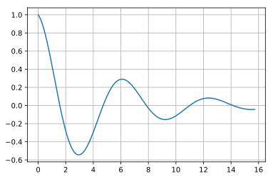
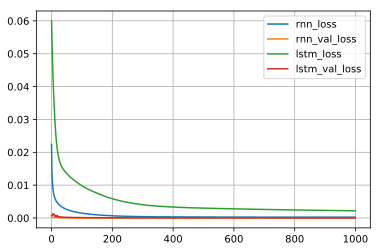
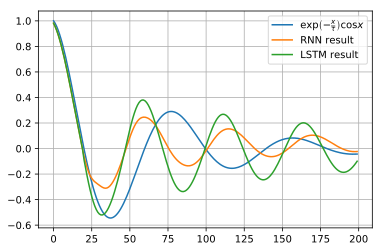

## kerasとLSTMの基礎, RNNとの比較

以前の記事でRNNの復習しましたので、ついでにLSTMの復習も行います。LSTMは Long Short Term Memory の略で、長期的な依存関係を学習することのできると言われています。また、RNNの一種で、基本的な考え方は同じです。詳細は検索すればいくらでも出てくるので割愛します。

また、LSTMとRNNの比較を行います。

### github
- jupyter notebook形式のファイルは[こちら](https://github.com/hiroshi0530/wa-src/tree/master/ml/lec/text/lstm/lstm_nb.ipynb)

### google colaboratory
- google colaboratory で実行する場合は[こちら](https://colab.research.google.com/github/hiroshi0530/wa-src/tree/master/ml/lec/text/lstm/lstm_nb.ipynb)

### 筆者の環境
筆者のOSはmacOSです。LinuxやUnixのコマンドとはオプションが異なります。


```python
!sw_vers
```

    ProductName:	Mac OS X
    ProductVersion:	10.14.6
    BuildVersion:	18G6020


```python
!python -V
```

    Python 3.7.3


基本的なライブラリとkerasをインポートしそのバージョンを確認しておきます。


```python
%matplotlib inline
%config InlineBackend.figure_format = 'svg'

import matplotlib
import matplotlib.pyplot as plt
import scipy
import numpy as np
import pandas as pd

import tensorflow as tf
from tensorflow import keras

print('matplotlib version :', matplotlib.__version__)
print('scipy version :', scipy.__version__)
print('numpy version :', np.__version__)
print('tensorflow version : ', tf.__version__)
print('keras version : ', keras.__version__)
```

    matplotlib version : 3.0.3
    scipy version : 1.4.1
    numpy version : 1.19.4
    tensorflow version :  2.1.0
    keras version :  2.2.4-tf


```python

```


```python

```

## データの取得

今回は日経平均とアメリカのS&P500の株価のデータの予測を行います。データはそれぞれ以下のサイトからダウンロードしました。

### 日経平均のデータ

- https://indexes.nikkei.co.jp/nkave/index?type=download

### SP500のデータ

- https://kabuoji3.com/stock/download.php


## データの確認
まず最初に日経のデータを見てみます。


```python
!ls 
```

    lstm_nb.ipynb  lstm_nb.md     lstm_nb.py     lstm_nb_files  nikkei.csv     sp500_2019.csv sp500_2020.csv


```bash
%%bash
head nikkei.csv
```

    �f�[�^���t,�I�l,�n�l,���l,���l
    "2017/01/04","19594.16","19298.68","19594.16","19277.93"
    "2017/01/05","19520.69","19602.10","19615.40","19473.28"
    "2017/01/06","19454.33","19393.55","19472.37","19354.44"
    "2017/01/10","19301.44","19414.83","19484.90","19255.35"
    "2017/01/11","19364.67","19358.64","19402.17","19325.46"
    "2017/01/12","19134.70","19300.19","19300.19","19069.02"
    "2017/01/13","19287.28","19174.97","19299.36","19156.93"
    "2017/01/16","19095.24","19219.13","19255.41","19061.27"
    "2017/01/17","18813.53","19038.45","19043.91","18812.86"


文字コードがshift-jisになっているので、utf-8に直します。


```bash
%%bash
nkf --guess nikkei.csv
```

    Shift_JIS (CRLF)


```bash
%%bash
nkf -w nikkei.csv > nikkei_utf8.csv
```


```bash
%%bash
head nikkei_utf8.csv
```

    データ日付,終値,始値,高値,安値
    "2017/01/04","19594.16","19298.68","19594.16","19277.93"
    "2017/01/05","19520.69","19602.10","19615.40","19473.28"
    "2017/01/06","19454.33","19393.55","19472.37","19354.44"
    "2017/01/10","19301.44","19414.83","19484.90","19255.35"
    "2017/01/11","19364.67","19358.64","19402.17","19325.46"
    "2017/01/12","19134.70","19300.19","19300.19","19069.02"
    "2017/01/13","19287.28","19174.97","19299.36","19156.93"
    "2017/01/16","19095.24","19219.13","19255.41","19061.27"
    "2017/01/17","18813.53","19038.45","19043.91","18812.86"


問題ないようなので、pandasで読み込みます。


```python
df = pd.read_csv('nikkei_utf8.csv')
```


```python
df.head()
```


<div>
<style scoped>
    .dataframe tbody tr th:only-of-type {
        vertical-align: middle;
    }

    .dataframe tbody tr th {
        vertical-align: top;
    }

    .dataframe thead th {
        text-align: right;
    }
</style>
<table border="1" class="dataframe">
  <thead>
    <tr style="text-align: right;">
      <th></th>
      <th>データ日付</th>
      <th>終値</th>
      <th>始値</th>
      <th>高値</th>
      <th>安値</th>
    </tr>
  </thead>
  <tbody>
    <tr>
      <th>0</th>
      <td>2017/01/04</td>
      <td>19594.16</td>
      <td>19298.68</td>
      <td>19594.16</td>
      <td>19277.93</td>
    </tr>
    <tr>
      <th>1</th>
      <td>2017/01/05</td>
      <td>19520.69</td>
      <td>19602.10</td>
      <td>19615.40</td>
      <td>19473.28</td>
    </tr>
    <tr>
      <th>2</th>
      <td>2017/01/06</td>
      <td>19454.33</td>
      <td>19393.55</td>
      <td>19472.37</td>
      <td>19354.44</td>
    </tr>
    <tr>
      <th>3</th>
      <td>2017/01/10</td>
      <td>19301.44</td>
      <td>19414.83</td>
      <td>19484.90</td>
      <td>19255.35</td>
    </tr>
    <tr>
      <th>4</th>
      <td>2017/01/11</td>
      <td>19364.67</td>
      <td>19358.64</td>
      <td>19402.17</td>
      <td>19325.46</td>
    </tr>
  </tbody>
</table>
</div>


```python
df.tail()
```


<div>
<style scoped>
    .dataframe tbody tr th:only-of-type {
        vertical-align: middle;
    }

    .dataframe tbody tr th {
        vertical-align: top;
    }

    .dataframe thead th {
        text-align: right;
    }
</style>
<table border="1" class="dataframe">
  <thead>
    <tr style="text-align: right;">
      <th></th>
      <th>データ日付</th>
      <th>終値</th>
      <th>始値</th>
      <th>高値</th>
      <th>安値</th>
    </tr>
  </thead>
  <tbody>
    <tr>
      <th>971</th>
      <td>2020/12/24</td>
      <td>26668.35</td>
      <td>26635.11</td>
      <td>26764.53</td>
      <td>26605.26</td>
    </tr>
    <tr>
      <th>972</th>
      <td>2020/12/25</td>
      <td>26656.61</td>
      <td>26708.10</td>
      <td>26716.61</td>
      <td>26638.28</td>
    </tr>
    <tr>
      <th>973</th>
      <td>2020/12/28</td>
      <td>26854.03</td>
      <td>26691.29</td>
      <td>26854.03</td>
      <td>26664.60</td>
    </tr>
    <tr>
      <th>974</th>
      <td>2020/12/29</td>
      <td>27568.15</td>
      <td>26936.38</td>
      <td>27602.52</td>
      <td>26921.14</td>
    </tr>
    <tr>
      <th>975</th>
      <td>本資料は日経の著作物であり、本資料の全部又は一部を、いかなる形式によっても日経に無断で複写、...</td>
      <td>NaN</td>
      <td>NaN</td>
      <td>NaN</td>
      <td>NaN</td>
    </tr>
  </tbody>
</table>
</div>


最後の行に著作権に関する注意書きがありますが、これを削除します。複写や流布は行いません。


```python
df.drop(index=975, inplace=True)
```


```python
df.tail()
```


<div>
<style scoped>
    .dataframe tbody tr th:only-of-type {
        vertical-align: middle;
    }

    .dataframe tbody tr th {
        vertical-align: top;
    }

    .dataframe thead th {
        text-align: right;
    }
</style>
<table border="1" class="dataframe">
  <thead>
    <tr style="text-align: right;">
      <th></th>
      <th>データ日付</th>
      <th>終値</th>
      <th>始値</th>
      <th>高値</th>
      <th>安値</th>
    </tr>
  </thead>
  <tbody>
    <tr>
      <th>970</th>
      <td>2020/12/23</td>
      <td>26524.79</td>
      <td>26580.43</td>
      <td>26585.21</td>
      <td>26414.74</td>
    </tr>
    <tr>
      <th>971</th>
      <td>2020/12/24</td>
      <td>26668.35</td>
      <td>26635.11</td>
      <td>26764.53</td>
      <td>26605.26</td>
    </tr>
    <tr>
      <th>972</th>
      <td>2020/12/25</td>
      <td>26656.61</td>
      <td>26708.10</td>
      <td>26716.61</td>
      <td>26638.28</td>
    </tr>
    <tr>
      <th>973</th>
      <td>2020/12/28</td>
      <td>26854.03</td>
      <td>26691.29</td>
      <td>26854.03</td>
      <td>26664.60</td>
    </tr>
    <tr>
      <th>974</th>
      <td>2020/12/29</td>
      <td>27568.15</td>
      <td>26936.38</td>
      <td>27602.52</td>
      <td>26921.14</td>
    </tr>
  </tbody>
</table>
</div>


データを可視化してみます。コロナショックで大きくへこんでいることがわかりますが、2020年の年末の時点では金融緩和の影響を受けて大幅に上がっています。


```python
ticks = 10
xticks = ticks * 5 

plt.plot(df['データ日付'][::ticks], df['終値'][::ticks], label='nikkei stock')
plt.grid()
plt.legend()
plt.xticks(df['データ日付'][::xticks], rotation=60)
plt.show()
```


```python

```


```python


import os
import time
import warnings
import numpy as np
from numpy import newaxis
from keras.layers.core import Dense, Activation, Dropout
from keras.layers.recurrent import LSTM
from keras.models import Sequential

os.environ['TF_CPP_MIN_LOG_LEVEL'] = '3'
warnings.filterwarnings("ignore")

def load_data(filename, seq_len, normalise_window):
    f = open(filename, 'rb').read()
    data = f.decode().split('\n')

    sequence_length = seq_len + 1
    result = []
    for index in range(len(data) - sequence_length):
        result.append(data[index: index + sequence_length])

    if normalise_window:
        result = normalise_windows(result)

    result = np.array(result)

    row = round(0.9 * result.shape[0])
    train = result[:int(row),:]
    np.random.shuffle(train)
    x_train = train[:,:-1]
    y_train = train[:,-1]
    x_test = result[int(row):, :-1]
    y_test = result[int(row):, -1]

    x_train = np.reshape(x_train, (x_train.shape[0], x_train.shape[1],1))
    x_test = np.reshape(x_test, (x_test.shape[0], x_test.shape[1], 1))

    return [x_train, y_train, x_test, y_test]

def normalise_windows(window_data):
    normalised_data = []
    for window in window_data:
        normalised_window = [((float(p) / float(window[0])) - 1) for p in window]
        normalised_data.append(normalised_window)
    return normalised_data

def build_model(layers):
    model = Sequential()

    model.add(LSTM(input_shape = (layers[1], layers[0]),
                    output_dim=layers[1],
                    return_sequences=True))
    model.add(Dropout(0.2))

    model.add(LSTM(layers[2],return_sequences=False))
    model.add(Dropout(0.2))

    model.add(Dense(output_dim=layers[3]))
    model.add(Activation("linear"))

    start = time.time()
    model.compile(loss="mse", optimizer='rmsprop')
    print(" 実行時間：　", time.time() - start)
    return model

def predict_point_by_point(model, data):
    predicted = model.predict(data)
    predicted = np.reshape(predicted, (predicted.size,))
    return predicted

def predict_sequence_full(model, data, window_size):
    curr_frame = data[0]
    predicted = []
    for i in range(len(data)):
        predicted.append(model.predict(curr_frame[newaxis,:,:])[0,0])
        curr_frame = curr_frame[1:]
        curr_frame = np.insert(curr_frame, [window_size-1], predicted[-1], axis=0)
    return predicted

def predict_sequences_multiple(model, data, window_size, prediction_len):
    prediction_seqs = []
    for i in range(int(len(data)/prediction_len)):
        curr_frame = data[i*prediction_len]
        predicted = []
        for j in range(prediction_len):
            predicted.append(model.predict(curr_frame[newaxis,:,:])[0,0])
            curr_frame = curr_frame[1:]
            curr_frame = np.insert(curr_frame, [window_size-1], predicted[-1], axis=0)
        prediction_seqs.append(predicted)
    return prediction_seqs

 import os
import time
import warnings
import numpy as np
from numpy import newaxis
from keras.layers.core import Dense, Activation, Dropout
from keras.layers.recurrent import LSTM
from keras.models import Sequential

os.environ['TF_CPP_MIN_LOG_LEVEL'] = '3'
warnings.filterwarnings("ignore")

def load_data(filename, seq_len, normalise_window):
    f = open(filename, 'rb').read()
    data = f.decode().split('\n')

    sequence_length = seq_len + 1
    result = []
    for index in range(len(data) - sequence_length):
        result.append(data[index: index + sequence_length])

    if normalise_window:
        result = normalise_windows(result)

    result = np.array(result)

    row = round(0.9 * result.shape[0])
    train = result[:int(row),:]
    np.random.shuffle(train)
    x_train = train[:,:-1]
    y_train = train[:,-1]
    x_test = result[int(row):, :-1]
    y_test = result[int(row):, -1]

    x_train = np.reshape(x_train, (x_train.shape[0], x_train.shape[1],1))
    x_test = np.reshape(x_test, (x_test.shape[0], x_test.shape[1], 1))

    return [x_train, y_train, x_test, y_test]

def normalise_windows(window_data):
    normalised_data = []
    for window in window_data:
        normalised_window = [((float(p) / float(window[0])) - 1) for p in window]
        normalised_data.append(normalised_window)
    return normalised_data

def build_model(layers):
    model = Sequential()

    model.add(LSTM(input_shape = (layers[1], layers[0]),
                    output_dim=layers[1],
                    return_sequences=True))
    model.add(Dropout(0.2))

    model.add(LSTM(layers[2],return_sequences=False))
    model.add(Dropout(0.2))

    model.add(Dense(output_dim=layers[3]))
    model.add(Activation("linear"))

    start = time.time()
    model.compile(loss="mse", optimizer='rmsprop')
    print(" 実行時間：　", time.time() - start)
    return model

def predict_point_by_point(model, data):
    predicted = model.predict(data)
    predicted = np.reshape(predicted, (predicted.size,))
    return predicted

def predict_sequence_full(model, data, window_size):
    curr_frame = data[0]
    predicted = []
    for i in range(len(data)):
        predicted.append(model.predict(curr_frame[newaxis,:,:])[0,0])
        curr_frame = curr_frame[1:]
        curr_frame = np.insert(curr_frame, [window_size-1], predicted[-1], axis=0)
    return predicted

def predict_sequences_multiple(model, data, window_size, prediction_len):
    prediction_seqs = []
    for i in range(int(len(data)/prediction_len)):
        curr_frame = data[i*prediction_len]
        predicted = []
        for j in range(prediction_len):
            predicted.append(model.predict(curr_frame[newaxis,:,:])[0,0])
            curr_frame = curr_frame[1:]
            curr_frame = np.insert(curr_frame, [window_size-1], predicted[-1], axis=0)
        prediction_seqs.append(predicted)
    return prediction_seqs
 

"model.fit(X_train, y_train, batch_size=512, nb_epoch=epoch, validation_split=0.05)"
 "predictions = lstm.predict_sequences_multiple(model, X_test, seq_len, 50)"


```


```python

```


```python

```


```python

```


```python

```


```python

```


```python

```


```python

```


```python

```

## 減衰振動曲線

サンプル用のデータとして、以下の式からサンプリングを行います。

$$
y = \exp\left(-\frac{x}{\tau}\right)\cos(x) 
$$

波を打ちながら、次第に収束していく、自然現象ではよくあるモデルになります。単純なRNNと比較するため、サンプルデータは同じ関数とします。


```python
x = np.linspace(0, 5 * np.pi, 200)
y = np.exp(-x / 5) * (np.cos(x))
```

### データの確認

$x$と$y$のデータの詳細を見てみます。


```python
print('shape : ', x.shape)
print('ndim : ', x.ndim)
print('data : ', x[:10])
```

    shape :  (200,)
    ndim :  1
    data :  [0.         0.07893449 0.15786898 0.23680347 0.31573796 0.39467244
     0.47360693 0.55254142 0.63147591 0.7104104 ]


```python
print('shape : ', y.shape)
print('ndim : ', y.ndim)
print('data : ', y[:10])
```

    shape :  (200,)
    ndim :  1
    data :  [1.         0.98127212 0.9568705  0.92712705 0.89239742 0.85305798
     0.80950282 0.76214062 0.71139167 0.65768474]


グラフを確認してみます。


```python
plt.plot(x,y)
plt.grid()
plt.show()
```





$\tau=5$として、綺麗な減衰曲線が得られました。

## ニューラルネットの構築

kerasに投入するためにデータの前処理を行い、再帰型のニューラルネットの構築を行います。

構築が終了したら、compileメソッドを利用して、モデルをコンパイルします。compileの仕様は以下の様になっています。

```bash
compile(self, optimizer, loss, metrics=None, sample_weight_mode=None, weighted_metrics=None, target_tensors=None)
```


```python
from tensorflow.keras.models import Sequential
from tensorflow.keras.layers import SimpleRNN
from tensorflow.keras.layers import Dense
from tensorflow.keras.layers import LSTM

NUM_RNN = 20
NUM_MIDDLE = 40

# データの前処理
n = len(x) - NUM_RNN
r_x = np.zeros((n, NUM_RNN))
r_y = np.zeros((n, NUM_RNN))
for i in range(0, n):
  r_x[i] = y[i: i + NUM_RNN]
  r_y[i] = y[i + 1: i + NUM_RNN + 1]

r_x = r_x.reshape(n, NUM_RNN, 1)
r_y = r_y.reshape(n, NUM_RNN, 1)

# RNNニューラルネットの構築
rnn_model = Sequential()
rnn_model.add(SimpleRNN(NUM_MIDDLE, input_shape=(NUM_RNN, 1), return_sequences=True))
rnn_model.add(Dense(1, activation="linear"))
rnn_model.compile(loss="mean_squared_error", optimizer="sgd")

# LSTMニューラルネットの構築
lstm_model = Sequential()
lstm_model.add(LSTM(NUM_MIDDLE, input_shape=(NUM_RNN, 1), return_sequences=True))
lstm_model.add(Dense(1, activation="linear"))
lstm_model.compile(loss="mean_squared_error", optimizer="sgd")
```

投入するデータや、モデルの概要を確認します。


```python
print(r_y.shape)
print(r_x.shape)
```

    (180, 20, 1)
    (180, 20, 1)


二つのモデルの比較を行います。LSTMの方がパラメタ数が多いことがわかります。学習するにもLSTMの方が時間がかかります。


```python
print(rnn_model.summary())
print(lstm_model.summary())
```

    Model: "sequential"
    _________________________________________________________________
    Layer (type)                 Output Shape              Param #   
    =================================================================
    simple_rnn (SimpleRNN)       (None, 20, 40)            1680      
    _________________________________________________________________
    dense (Dense)                (None, 20, 1)             41        
    =================================================================
    Total params: 1,721
    Trainable params: 1,721
    Non-trainable params: 0
    _________________________________________________________________
    None
    Model: "sequential_1"
    _________________________________________________________________
    Layer (type)                 Output Shape              Param #   
    =================================================================
    lstm (LSTM)                  (None, 20, 40)            6720      
    _________________________________________________________________
    dense_1 (Dense)              (None, 20, 1)             41        
    =================================================================
    Total params: 6,761
    Trainable params: 6,761
    Non-trainable params: 0
    _________________________________________________________________
    None


## 学習

fitメソッドを利用して、学習を行います。
fitメソッドの仕様は以下の通りになっています。[こちら](https://keras.io/ja/models/sequential/)を参照してください。

```bash
fit(self, x=None, y=None, batch_size=None, epochs=1, verbose=1, callbacks=None, validation_split=0.0, validation_data=None, shuffle=True, class_weight=None, sample_weight=None, initial_epoch=0, steps_per_epoch=None, validation_steps=None)
```


```python
batch_size = 10
epochs = 1000

# validation_split で最後の10％を検証用に利用します
rnn_history = rnn_model.fit(r_x, r_y, epochs=epochs, batch_size=batch_size, validation_split=0.1, verbose=0)

# validation_split で最後の10％を検証用に利用します
lstm_history = lstm_model.fit(r_x, r_y, epochs=epochs, batch_size=batch_size, validation_split=0.1, verbose=0)
```

## 損失関数の可視化

学習によって誤差が減少していく様子を可視化してみます。


```python
rnn_loss = rnn_history.history['loss'] # 訓練データの損失関数
rnn_val_loss = rnn_history.history['val_loss'] #テストデータの損失関数

lstm_loss = lstm_history.history['loss'] # 訓練データの損失関数
lstm_val_loss = lstm_history.history['val_loss'] #テストデータの損失関数

plt.plot(np.arange(len(rnn_loss)), rnn_loss, label='rnn_loss')
plt.plot(np.arange(len(rnn_val_loss)), rnn_val_loss, label='rnn_val_loss')
plt.plot(np.arange(len(lstm_loss)), lstm_loss, label='lstm_loss')
plt.plot(np.arange(len(lstm_val_loss)), lstm_val_loss, label='lstm_val_loss')
plt.grid()
plt.legend()
plt.show()
```





## 結果の確認


```python
# 初期の入力値
rnn_res = r_y[0].reshape(-1)
lstm_res = r_y[0].reshape(-1)

for i in range(0, n):
  _rnn_y = rnn_model.predict(rnn_res[- NUM_RNN:].reshape(1, NUM_RNN, 1))
  rnn_res = np.append(rnn_res, _rnn_y[0][NUM_RNN - 1][0])
  
  _lstm_y = lstm_model.predict(lstm_res[- NUM_RNN:].reshape(1, NUM_RNN, 1))
  lstm_res = np.append(lstm_res, _lstm_y[0][NUM_RNN - 1][0])
  
plt.plot(np.arange(len(y)), y, label=r"$\exp\left(-\frac{x}{\tau}\right) \cos x$")
plt.plot(np.arange(len(rnn_res)), rnn_res, label="RNN result")
plt.plot(np.arange(len(lstm_res)), lstm_res, label="LSTM result")
plt.legend()
plt.grid()
plt.show()
```





減衰振動曲線の場合、今回設定したパラメタでは、LSTMとRNNの差は出ていないようです。ただ、実務レベルでは、RNNよりLSTMの方がより使われており、結果も出ているように思います。今回はただの練習なので、ここで終わりにしようと思います。
