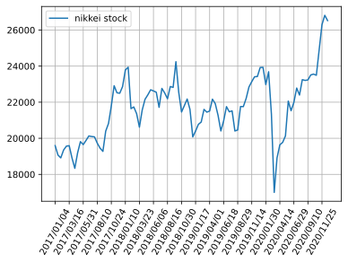

## LSTMを使った株価予測

LSTMは時系列データの予測のために利用されます。時系列データには、ある場所の気温や、来客数、商品の価格など多岐にわたりますが、最もデータを入手しやすい株価をLSTMで予測を行ってみたいと思います。

ただし、ニューラルネットはあくまでも得られたデータの範囲内でしか予測する事が出来ず、想定外の状況になった場合、そのモデルはほぼ意味をなしません。

例えば、コロナショック前の1年前のデータを用いても、コロナショックを予測する事は出来ません。

株価の形成はランダムな要素もあり、LSTMで未来を予測するのは難しいとは思いますが、LSTMに慣れるためにやってみようと思います。

### github
- jupyter notebook形式のファイルは[こちら](https://github.com/hiroshi0530/wa-src/tree/master/ml/lec/text/lstm_stock/lstm_nb.ipynb)

### google colaboratory
- google colaboratory で実行する場合は[こちら](https://colab.research.google.com/github/hiroshi0530/wa-src/tree/master/ml/lec/text/lstm_stock/lstm_nb.ipynb)

### 筆者の環境
筆者のOSはmacOSです。LinuxやUnixのコマンドとはオプションが異なります。


```python
!sw_vers
```

    ProductName:	Mac OS X
    ProductVersion:	10.14.6
    BuildVersion:	18G6032


```python
!python -V
```

    Python 3.8.5


基本的なライブラリとkerasをインポートしそのバージョンを確認しておきます。


```python
%matplotlib inline
%config InlineBackend.figure_format = 'svg'

import matplotlib
import matplotlib.pyplot as plt
import scipy
import numpy as np
import pandas as pd

import tensorflow as tf
from tensorflow import keras

print('matplotlib version :', matplotlib.__version__)
print('scipy version :', scipy.__version__)
print('numpy version :', np.__version__)
print('tensorflow version : ', tf.__version__)
print('keras version : ', keras.__version__)
```

    matplotlib version : 3.3.2
    scipy version : 1.5.2
    numpy version : 1.18.5
    tensorflow version :  2.3.1
    keras version :  2.4.0


```python

```


```python

```

## データの取得

今回は日経平均とアメリカのS&P500の株価のデータの予測を行います。データはそれぞれ以下のサイトからダウンロードしました。

### 日経平均のデータ

- https://indexes.nikkei.co.jp/nkave/index?type=download

### SP500のデータ

- https://kabuoji3.com/stock/download.php


## データの確認
まず最初に日経のデータを見てみます。


```python
!ls 
```

    lstm_nb.ipynb   lstm_nb.md      lstm_nb.py      lstm_nb.txt     lstm_nb_files   nikkei.csv      nikkei_utf8.csv sp500_2019.csv  sp500_2020.csv


```bash
%%bash
head nikkei.csv
```

    �f�[�^���t,�I�l,�n�l,���l,���l
    "2017/01/04","19594.16","19298.68","19594.16","19277.93"
    "2017/01/05","19520.69","19602.10","19615.40","19473.28"
    "2017/01/06","19454.33","19393.55","19472.37","19354.44"
    "2017/01/10","19301.44","19414.83","19484.90","19255.35"
    "2017/01/11","19364.67","19358.64","19402.17","19325.46"
    "2017/01/12","19134.70","19300.19","19300.19","19069.02"
    "2017/01/13","19287.28","19174.97","19299.36","19156.93"
    "2017/01/16","19095.24","19219.13","19255.41","19061.27"
    "2017/01/17","18813.53","19038.45","19043.91","18812.86"


文字コードがshift-jisになっているので、utf-8に直します。


```bash
%%bash
nkf --guess nikkei.csv
```

    Shift_JIS (LF)


```bash
%%bash
nkf -w nikkei.csv > nikkei_utf8.csv
```


```bash
%%bash
head nikkei_utf8.csv
```

    データ日付,終値,始値,高値,安値
    "2017/01/04","19594.16","19298.68","19594.16","19277.93"
    "2017/01/05","19520.69","19602.10","19615.40","19473.28"
    "2017/01/06","19454.33","19393.55","19472.37","19354.44"
    "2017/01/10","19301.44","19414.83","19484.90","19255.35"
    "2017/01/11","19364.67","19358.64","19402.17","19325.46"
    "2017/01/12","19134.70","19300.19","19300.19","19069.02"
    "2017/01/13","19287.28","19174.97","19299.36","19156.93"
    "2017/01/16","19095.24","19219.13","19255.41","19061.27"
    "2017/01/17","18813.53","19038.45","19043.91","18812.86"


問題ないようなので、pandasで読み込みます。


```python
df = pd.read_csv('nikkei_utf8.csv')
```


```python
df.head()
```


<div>
<style scoped>
    .dataframe tbody tr th:only-of-type {
        vertical-align: middle;
    }

    .dataframe tbody tr th {
        vertical-align: top;
    }

    .dataframe thead th {
        text-align: right;
    }
</style>
<table border="1" class="dataframe">
  <thead>
    <tr style="text-align: right;">
      <th></th>
      <th>データ日付</th>
      <th>終値</th>
      <th>始値</th>
      <th>高値</th>
      <th>安値</th>
    </tr>
  </thead>
  <tbody>
    <tr>
      <th>0</th>
      <td>2017/01/04</td>
      <td>19594.16</td>
      <td>19298.68</td>
      <td>19594.16</td>
      <td>19277.93</td>
    </tr>
    <tr>
      <th>1</th>
      <td>2017/01/05</td>
      <td>19520.69</td>
      <td>19602.10</td>
      <td>19615.40</td>
      <td>19473.28</td>
    </tr>
    <tr>
      <th>2</th>
      <td>2017/01/06</td>
      <td>19454.33</td>
      <td>19393.55</td>
      <td>19472.37</td>
      <td>19354.44</td>
    </tr>
    <tr>
      <th>3</th>
      <td>2017/01/10</td>
      <td>19301.44</td>
      <td>19414.83</td>
      <td>19484.90</td>
      <td>19255.35</td>
    </tr>
    <tr>
      <th>4</th>
      <td>2017/01/11</td>
      <td>19364.67</td>
      <td>19358.64</td>
      <td>19402.17</td>
      <td>19325.46</td>
    </tr>
  </tbody>
</table>
</div>


```python
df.tail()
```


<div>
<style scoped>
    .dataframe tbody tr th:only-of-type {
        vertical-align: middle;
    }

    .dataframe tbody tr th {
        vertical-align: top;
    }

    .dataframe thead th {
        text-align: right;
    }
</style>
<table border="1" class="dataframe">
  <thead>
    <tr style="text-align: right;">
      <th></th>
      <th>データ日付</th>
      <th>終値</th>
      <th>始値</th>
      <th>高値</th>
      <th>安値</th>
    </tr>
  </thead>
  <tbody>
    <tr>
      <th>971</th>
      <td>2020/12/24</td>
      <td>26668.35</td>
      <td>26635.11</td>
      <td>26764.53</td>
      <td>26605.26</td>
    </tr>
    <tr>
      <th>972</th>
      <td>2020/12/25</td>
      <td>26656.61</td>
      <td>26708.10</td>
      <td>26716.61</td>
      <td>26638.28</td>
    </tr>
    <tr>
      <th>973</th>
      <td>2020/12/28</td>
      <td>26854.03</td>
      <td>26691.29</td>
      <td>26854.03</td>
      <td>26664.60</td>
    </tr>
    <tr>
      <th>974</th>
      <td>2020/12/29</td>
      <td>27568.15</td>
      <td>26936.38</td>
      <td>27602.52</td>
      <td>26921.14</td>
    </tr>
    <tr>
      <th>975</th>
      <td>本資料は日経の著作物であり、本資料の全部又は一部を、いかなる形式によっても日経に無断で複写、...</td>
      <td>NaN</td>
      <td>NaN</td>
      <td>NaN</td>
      <td>NaN</td>
    </tr>
  </tbody>
</table>
</div>


最後の行に著作権に関する注意書きがありますが、これを削除します。複写や流布は行いません。


```python
df.drop(index=975, inplace=True)
```


```python
df.tail()
```


<div>
<style scoped>
    .dataframe tbody tr th:only-of-type {
        vertical-align: middle;
    }

    .dataframe tbody tr th {
        vertical-align: top;
    }

    .dataframe thead th {
        text-align: right;
    }
</style>
<table border="1" class="dataframe">
  <thead>
    <tr style="text-align: right;">
      <th></th>
      <th>データ日付</th>
      <th>終値</th>
      <th>始値</th>
      <th>高値</th>
      <th>安値</th>
    </tr>
  </thead>
  <tbody>
    <tr>
      <th>970</th>
      <td>2020/12/23</td>
      <td>26524.79</td>
      <td>26580.43</td>
      <td>26585.21</td>
      <td>26414.74</td>
    </tr>
    <tr>
      <th>971</th>
      <td>2020/12/24</td>
      <td>26668.35</td>
      <td>26635.11</td>
      <td>26764.53</td>
      <td>26605.26</td>
    </tr>
    <tr>
      <th>972</th>
      <td>2020/12/25</td>
      <td>26656.61</td>
      <td>26708.10</td>
      <td>26716.61</td>
      <td>26638.28</td>
    </tr>
    <tr>
      <th>973</th>
      <td>2020/12/28</td>
      <td>26854.03</td>
      <td>26691.29</td>
      <td>26854.03</td>
      <td>26664.60</td>
    </tr>
    <tr>
      <th>974</th>
      <td>2020/12/29</td>
      <td>27568.15</td>
      <td>26936.38</td>
      <td>27602.52</td>
      <td>26921.14</td>
    </tr>
  </tbody>
</table>
</div>


データを可視化してみます。コロナショックで大きくへこんでいることがわかりますが、2020年の年末の時点では金融緩和の影響を受けて大幅に上がっています。


```python
ticks = 10
xticks = ticks * 5 

plt.plot(df['データ日付'][::ticks], df['終値'][::ticks], label='nikkei stock')
plt.grid()
plt.legend()
plt.xticks(df['データ日付'][::xticks], rotation=60)
plt.show()
```


    

    


## データの準備

kerasに投入するためにデータを整えます。


```python
from tensorflow.keras.models import Sequential
from tensorflow.keras.layers import Dense
from tensorflow.keras.layers import LSTM

NUM_LSTM = 100

x = np.array((df['データ日付']))
y = np.array((df['終値']))


# x = np.linspace(0, 5 * np.pi, 200)
# y = np.exp(-x / 5) * (np.cos(x))


n = len(y) - NUM_LSTM
l_x = np.zeros((n, NUM_LSTM))
l_y = np.zeros((n, NUM_LSTM))
for i in range(0, n):
  l_x[i] = y[i: i + NUM_LSTM]
  l_y[i] = y[i + 1: i + NUM_LSTM + 1]

l_x = l_x.reshape(n, NUM_LSTM, 1)
l_y = l_y.reshape(n, NUM_LSTM, 1)
```


```python
print('shape : ', x.shape)
print('ndim : ', x.ndim)
print('data : ', x[:10])
```

    shape :  (975,)
    ndim :  1
    data :  ['2017/01/04' '2017/01/05' '2017/01/06' '2017/01/10' '2017/01/11'
     '2017/01/12' '2017/01/13' '2017/01/16' '2017/01/17' '2017/01/18']


```python
print('shape : ', y.shape)
print('ndim : ', y.ndim)
print('data : ', y[:10])
```

    shape :  (975,)
    ndim :  1
    data :  [19594.16 19520.69 19454.33 19301.44 19364.67 19134.7  19287.28 19095.24
     18813.53 18894.37]


```python
print(l_y.shape)
print(l_x.shape)
```

    (875, 100, 1)
    (875, 100, 1)


モデルの構築を定義する関数です。


```python
from tensorflow.keras.layers import Dropout
from tensorflow.keras.layers import Activation

NUM_MIDDLE = 40 
NUM_MIDDLE_01 = 100
NUM_MIDDLE_02 = 120

def build_lstm_model():
  # LSTMニューラルネットの構築
  # model = Sequential()
  # model.add(LSTM(NUM_MIDDLE, input_shape=(NUM_LSTM, 1), return_sequences=True))
  # model.add(Dense(1, activation="linear"))
  # model.compile(loss="mean_squared_error", optimizer="sgd")
  
  # LSTMニューラルネットの構築
  model = Sequential()
  model.add(LSTM(NUM_MIDDLE_01, input_shape = (NUM_LSTM, 1), return_sequences=True))
  model.add(Dropout(0.2))
  model.add(LSTM(NUM_MIDDLE_02, return_sequences=True))
  model.add(Dropout(0.2))
  model.add(Dense(1))
  model.add(Activation("linear"))
  model.compile(loss="mse", optimizer='rmsprop')
  model.compile(loss="mean_squared_error", optimizer="sgd")
  
  return model

model = build_lstm_model()
```

# 詳細を確認します。


```python
print(model.summary())
```

    Model: "sequential"
    _________________________________________________________________
    Layer (type)                 Output Shape              Param #   
    =================================================================
    lstm (LSTM)                  (None, 100, 100)          40800     
    _________________________________________________________________
    dropout (Dropout)            (None, 100, 100)          0         
    _________________________________________________________________
    lstm_1 (LSTM)                (None, 100, 120)          106080    
    _________________________________________________________________
    dropout_1 (Dropout)          (None, 100, 120)          0         
    _________________________________________________________________
    dense (Dense)                (None, 100, 1)            121       
    _________________________________________________________________
    activation (Activation)      (None, 100, 1)            0         
    =================================================================
    Total params: 147,001
    Trainable params: 147,001
    Non-trainable params: 0
    _________________________________________________________________
    None


```python
batch_size = 20
epochs = 5000

# validation_split で最後の10％を検証用に利用します
history = model.fit(l_x, l_y, epochs=epochs, batch_size=batch_size, validation_split=0.1, verbose=1)
```

    Epoch 1/5000
    40/40 [==============================] - 3s 77ms/step - loss: 23954814.0000 - val_loss: 2114200.5000
    Epoch 2/5000
    40/40 [==============================] - 3s 64ms/step - loss: 4033058.7500 - val_loss: 4427811.0000
    Epoch 3/5000
    40/40 [==============================] - 2s 60ms/step - loss: 3925872.7500 - val_loss: 4282510.0000
    Epoch 4/5000
    40/40 [==============================] - 2s 57ms/step - loss: 3849234.7500 - val_loss: 3879405.0000
    Epoch 5/5000
    40/40 [==============================] - 2s 56ms/step - loss: 3985638.7500 - val_loss: 2173635.2500
    Epoch 6/5000
    40/40 [==============================] - 2s 57ms/step - loss: 3859749.0000 - val_loss: 2373683.0000
    Epoch 7/5000
    40/40 [==============================] - 2s 57ms/step - loss: 3904291.7500 - val_loss: 2214273.0000
    Epoch 8/5000
    40/40 [==============================] - 2s 58ms/step - loss: 3818762.0000 - val_loss: 7220516.5000
    Epoch 9/5000
    40/40 [==============================] - 2s 57ms/step - loss: 3866692.2500 - val_loss: 3556772.2500
    Epoch 10/5000
    40/40 [==============================] - 2s 56ms/step - loss: 3787693.0000 - val_loss: 3581733.0000
    Epoch 11/5000
    40/40 [==============================] - 3s 63ms/step - loss: 3811681.2500 - val_loss: 4294592.5000
    Epoch 12/5000
    40/40 [==============================] - 2s 58ms/step - loss: 3802193.0000 - val_loss: 2812282.2500
    Epoch 13/5000
    40/40 [==============================] - 2s 58ms/step - loss: 3781253.2500 - val_loss: 5061720.0000
    Epoch 14/5000
    40/40 [==============================] - 2s 57ms/step - loss: 3791142.5000 - val_loss: 5057764.5000
    Epoch 15/5000
    40/40 [==============================] - 2s 57ms/step - loss: 3743303.5000 - val_loss: 3475227.2500
    Epoch 16/5000
    40/40 [==============================] - 2s 57ms/step - loss: 3755084.5000 - val_loss: 2222387.7500
    Epoch 17/5000
    40/40 [==============================] - 2s 56ms/step - loss: 3730117.7500 - val_loss: 3244006.5000
    Epoch 18/5000
    40/40 [==============================] - 2s 58ms/step - loss: 3773236.2500 - val_loss: 3465385.7500
    Epoch 19/5000
    40/40 [==============================] - 2s 57ms/step - loss: 3724740.5000 - val_loss: 5200728.0000
    Epoch 20/5000
    40/40 [==============================] - 2s 57ms/step - loss: 3712602.5000 - val_loss: 3486624.2500
    Epoch 21/5000
    40/40 [==============================] - 2s 57ms/step - loss: 3759625.0000 - val_loss: 8545809.0000
    Epoch 22/5000
    40/40 [==============================] - 3s 72ms/step - loss: 3815889.5000 - val_loss: 2928198.2500
    Epoch 23/5000
    40/40 [==============================] - 3s 66ms/step - loss: 3643459.2500 - val_loss: 3732867.7500
    Epoch 24/5000
    40/40 [==============================] - 3s 67ms/step - loss: 3760295.7500 - val_loss: 4147843.0000
    Epoch 25/5000
    40/40 [==============================] - 2s 60ms/step - loss: 3621377.7500 - val_loss: 6253179.5000
    Epoch 26/5000
    40/40 [==============================] - 2s 60ms/step - loss: 3722262.5000 - val_loss: 3678381.7500
    Epoch 27/5000
    40/40 [==============================] - 2s 58ms/step - loss: 3590228.0000 - val_loss: 4874550.5000
    Epoch 28/5000
    40/40 [==============================] - 2s 60ms/step - loss: 3601182.5000 - val_loss: 4773453.5000
    Epoch 29/5000
    40/40 [==============================] - 2s 60ms/step - loss: 3576620.0000 - val_loss: 5589431.5000
    Epoch 30/5000
    40/40 [==============================] - 2s 60ms/step - loss: 3583703.0000 - val_loss: 2193119.5000
    Epoch 31/5000
    40/40 [==============================] - 2s 60ms/step - loss: 3626490.5000 - val_loss: 4531323.0000
    Epoch 32/5000
    40/40 [==============================] - 2s 60ms/step - loss: 3639911.5000 - val_loss: 1875724.7500
    Epoch 33/5000
    40/40 [==============================] - 2s 60ms/step - loss: 3499106.5000 - val_loss: 3309012.2500
    Epoch 34/5000
    40/40 [==============================] - 2s 61ms/step - loss: 3588740.7500 - val_loss: 9478435.0000
    Epoch 35/5000
    40/40 [==============================] - 2s 62ms/step - loss: 3644508.7500 - val_loss: 3418219.7500
    Epoch 36/5000
    40/40 [==============================] - 2s 62ms/step - loss: 3580060.5000 - val_loss: 5165273.0000
    Epoch 37/5000
    40/40 [==============================] - 2s 62ms/step - loss: 3590244.7500 - val_loss: 2749956.7500
    Epoch 38/5000
    40/40 [==============================] - 2s 60ms/step - loss: 3507252.0000 - val_loss: 3687375.2500
    Epoch 39/5000
    40/40 [==============================] - 2s 59ms/step - loss: 3536413.0000 - val_loss: 2495420.7500
    Epoch 40/5000
    40/40 [==============================] - 2s 62ms/step - loss: 3638844.7500 - val_loss: 7287372.5000
    Epoch 41/5000
    40/40 [==============================] - 2s 61ms/step - loss: 3540335.5000 - val_loss: 7241120.0000
    Epoch 42/5000
    40/40 [==============================] - 2s 62ms/step - loss: 3518134.2500 - val_loss: 4201062.0000
    Epoch 43/5000
    40/40 [==============================] - 2s 61ms/step - loss: 3562564.2500 - val_loss: 2866595.0000
    Epoch 44/5000
    40/40 [==============================] - 2s 61ms/step - loss: 3454072.0000 - val_loss: 3354396.2500
    Epoch 45/5000
    40/40 [==============================] - 2s 59ms/step - loss: 3466898.7500 - val_loss: 4215119.0000
    Epoch 46/5000
    40/40 [==============================] - 2s 61ms/step - loss: 3498238.7500 - val_loss: 3496683.0000
    Epoch 47/5000
    40/40 [==============================] - 2s 62ms/step - loss: 3489360.0000 - val_loss: 5687039.5000
    Epoch 48/5000
    40/40 [==============================] - 3s 66ms/step - loss: 3532439.5000 - val_loss: 2677580.2500
    Epoch 49/5000
    40/40 [==============================] - 2s 61ms/step - loss: 3450845.7500 - val_loss: 8710060.0000
    Epoch 50/5000
    40/40 [==============================] - 3s 70ms/step - loss: 3480209.0000 - val_loss: 4149166.5000
    Epoch 51/5000
    40/40 [==============================] - 3s 67ms/step - loss: 3462497.0000 - val_loss: 2822055.0000
    Epoch 52/5000
    40/40 [==============================] - 3s 71ms/step - loss: 3371217.7500 - val_loss: 5128405.5000
    Epoch 53/5000
    40/40 [==============================] - 3s 69ms/step - loss: 3420879.5000 - val_loss: 3003882.7500
    Epoch 54/5000
    40/40 [==============================] - 3s 71ms/step - loss: 3389866.5000 - val_loss: 3626545.5000
    Epoch 55/5000
    40/40 [==============================] - 3s 72ms/step - loss: 3401346.7500 - val_loss: 5728472.0000
    Epoch 56/5000
    40/40 [==============================] - 2s 59ms/step - loss: 3355388.0000 - val_loss: 3655146.5000
    Epoch 57/5000
    40/40 [==============================] - 3s 82ms/step - loss: 3414531.5000 - val_loss: 4820147.5000
    Epoch 58/5000
    40/40 [==============================] - 2s 56ms/step - loss: 3411186.2500 - val_loss: 1894372.0000
    Epoch 59/5000
    40/40 [==============================] - 3s 63ms/step - loss: 3352639.0000 - val_loss: 3421632.0000
    Epoch 60/5000
    40/40 [==============================] - 2s 57ms/step - loss: 3379640.7500 - val_loss: 2337993.5000
    Epoch 61/5000
    40/40 [==============================] - 2s 56ms/step - loss: 3398985.2500 - val_loss: 3500396.2500
    Epoch 62/5000
    40/40 [==============================] - 2s 57ms/step - loss: 3338836.2500 - val_loss: 3290128.2500
    Epoch 63/5000
    40/40 [==============================] - 2s 57ms/step - loss: 3264183.5000 - val_loss: 4091682.2500
    Epoch 64/5000
    40/40 [==============================] - 2s 56ms/step - loss: 3230935.2500 - val_loss: 4072951.7500
    Epoch 65/5000
    40/40 [==============================] - 2s 55ms/step - loss: 3307343.2500 - val_loss: 2869671.7500
    Epoch 66/5000
    40/40 [==============================] - 2s 56ms/step - loss: 3325616.7500 - val_loss: 5729568.0000
    Epoch 67/5000
    40/40 [==============================] - 2s 60ms/step - loss: 3280623.5000 - val_loss: 3919508.0000
    Epoch 68/5000
    40/40 [==============================] - 2s 59ms/step - loss: 3301441.0000 - val_loss: 6109687.5000
    Epoch 69/5000
    40/40 [==============================] - 2s 60ms/step - loss: 3311366.7500 - val_loss: 2331196.5000
    Epoch 70/5000
    40/40 [==============================] - 2s 57ms/step - loss: 3270441.7500 - val_loss: 2305896.2500
    Epoch 71/5000
    40/40 [==============================] - 2s 57ms/step - loss: 3241957.7500 - val_loss: 6354912.0000
    Epoch 72/5000
    40/40 [==============================] - 2s 56ms/step - loss: 3272038.7500 - val_loss: 3497032.2500
    Epoch 73/5000
    40/40 [==============================] - 2s 55ms/step - loss: 3209425.5000 - val_loss: 2579790.2500
    Epoch 74/5000
    40/40 [==============================] - 2s 57ms/step - loss: 3319821.0000 - val_loss: 3595894.5000
    Epoch 75/5000
    40/40 [==============================] - 2s 55ms/step - loss: 3208618.0000 - val_loss: 3274171.7500
    Epoch 76/5000
    40/40 [==============================] - 2s 56ms/step - loss: 3189884.0000 - val_loss: 2743329.7500
    Epoch 77/5000
    40/40 [==============================] - 2s 55ms/step - loss: 3233653.7500 - val_loss: 3270695.2500
    Epoch 78/5000
    40/40 [==============================] - 2s 56ms/step - loss: 3202303.0000 - val_loss: 5950774.0000
    Epoch 79/5000
    40/40 [==============================] - 2s 57ms/step - loss: 3315551.2500 - val_loss: 2488124.2500
    Epoch 80/5000
    40/40 [==============================] - 2s 54ms/step - loss: 3280977.7500 - val_loss: 1992212.0000
    Epoch 81/5000
    40/40 [==============================] - 2s 57ms/step - loss: 3230049.5000 - val_loss: 4815552.5000
    Epoch 82/5000
    40/40 [==============================] - 2s 56ms/step - loss: 3240045.2500 - val_loss: 4914525.0000
    Epoch 83/5000
    40/40 [==============================] - 2s 57ms/step - loss: 3190560.5000 - val_loss: 2333029.0000
    Epoch 84/5000
    40/40 [==============================] - 2s 55ms/step - loss: 3148514.0000 - val_loss: 4019783.2500
    Epoch 85/5000
    40/40 [==============================] - 2s 57ms/step - loss: 3123481.0000 - val_loss: 3133948.0000
    Epoch 86/5000
    40/40 [==============================] - 2s 57ms/step - loss: 3154096.0000 - val_loss: 4608347.5000
    Epoch 87/5000
    40/40 [==============================] - 2s 55ms/step - loss: 3125355.7500 - val_loss: 4522937.5000
    Epoch 88/5000
    40/40 [==============================] - 2s 56ms/step - loss: 3104700.0000 - val_loss: 2312611.7500
    Epoch 89/5000
    40/40 [==============================] - 2s 56ms/step - loss: 3131723.2500 - val_loss: 4648972.5000
    Epoch 90/5000
    40/40 [==============================] - 2s 55ms/step - loss: 3097009.2500 - val_loss: 5505964.5000
    Epoch 91/5000
    40/40 [==============================] - 2s 57ms/step - loss: 3147875.7500 - val_loss: 3505228.2500
    Epoch 92/5000
    40/40 [==============================] - 2s 56ms/step - loss: 3182374.5000 - val_loss: 2482692.2500
    Epoch 93/5000
    40/40 [==============================] - 2s 56ms/step - loss: 3146051.0000 - val_loss: 3629386.2500
    Epoch 94/5000
    40/40 [==============================] - 2s 56ms/step - loss: 3144561.2500 - val_loss: 3228389.0000
    Epoch 95/5000
    40/40 [==============================] - 2s 56ms/step - loss: 3091734.0000 - val_loss: 2454488.2500
    Epoch 96/5000
    40/40 [==============================] - 2s 55ms/step - loss: 3239618.5000 - val_loss: 2538387.7500
    Epoch 97/5000
    40/40 [==============================] - 2s 55ms/step - loss: 3113191.0000 - val_loss: 1901350.1250
    Epoch 98/5000
    40/40 [==============================] - 2s 57ms/step - loss: 3106994.0000 - val_loss: 3479923.0000
    Epoch 99/5000
    40/40 [==============================] - 2s 55ms/step - loss: 3074725.0000 - val_loss: 2550763.7500
    Epoch 100/5000
    40/40 [==============================] - 2s 57ms/step - loss: 3077697.7500 - val_loss: 3299929.0000
    Epoch 101/5000
    40/40 [==============================] - 2s 55ms/step - loss: 3046630.2500 - val_loss: 8025704.5000
    Epoch 102/5000
    40/40 [==============================] - 2s 56ms/step - loss: 3080445.5000 - val_loss: 6739376.0000
    Epoch 103/5000
    40/40 [==============================] - 2s 60ms/step - loss: 3066085.0000 - val_loss: 2379501.0000
    Epoch 104/5000
    40/40 [==============================] - 2s 61ms/step - loss: 3119858.0000 - val_loss: 2942669.5000
    Epoch 105/5000
    40/40 [==============================] - 3s 67ms/step - loss: 3024954.5000 - val_loss: 2667803.2500
    Epoch 106/5000
    40/40 [==============================] - 3s 63ms/step - loss: 3183227.2500 - val_loss: 2605637.5000
    Epoch 107/5000
    40/40 [==============================] - 2s 59ms/step - loss: 3065704.5000 - val_loss: 4344538.0000
    Epoch 108/5000
    40/40 [==============================] - 2s 59ms/step - loss: 3078339.7500 - val_loss: 6863240.0000
    Epoch 109/5000
    40/40 [==============================] - 2s 55ms/step - loss: 3038074.7500 - val_loss: 6813510.0000
    Epoch 110/5000
    40/40 [==============================] - 2s 61ms/step - loss: 3027437.2500 - val_loss: 4081040.0000
    Epoch 111/5000
    40/40 [==============================] - 3s 68ms/step - loss: 2991740.2500 - val_loss: 5245883.0000
    Epoch 112/5000
    40/40 [==============================] - 3s 70ms/step - loss: 2990405.0000 - val_loss: 3324524.2500
    Epoch 113/5000
    40/40 [==============================] - 2s 62ms/step - loss: 3042927.5000 - val_loss: 6232333.0000
    Epoch 114/5000
    40/40 [==============================] - 2s 57ms/step - loss: 2991001.2500 - val_loss: 2485331.7500
    Epoch 115/5000
    40/40 [==============================] - 2s 57ms/step - loss: 3080782.7500 - val_loss: 7743281.5000
    Epoch 116/5000
    40/40 [==============================] - 2s 58ms/step - loss: 3026019.2500 - val_loss: 2621949.5000
    Epoch 117/5000
    40/40 [==============================] - 3s 63ms/step - loss: 3066164.7500 - val_loss: 5213700.0000
    Epoch 118/5000
    40/40 [==============================] - 2s 56ms/step - loss: 2952075.0000 - val_loss: 4578735.5000
    Epoch 119/5000
    40/40 [==============================] - 2s 55ms/step - loss: 3080225.7500 - val_loss: 3127554.2500
    Epoch 120/5000
    40/40 [==============================] - 2s 55ms/step - loss: 2938274.2500 - val_loss: 3585637.7500
    Epoch 121/5000
    40/40 [==============================] - 2s 54ms/step - loss: 2944895.2500 - val_loss: 2053109.8750
    Epoch 122/5000
    40/40 [==============================] - 2s 54ms/step - loss: 2955348.5000 - val_loss: 2706196.0000
    Epoch 123/5000
    40/40 [==============================] - 2s 55ms/step - loss: 2926781.0000 - val_loss: 4946444.5000
    Epoch 124/5000
    40/40 [==============================] - 2s 54ms/step - loss: 2936396.7500 - val_loss: 6946040.5000
    Epoch 125/5000
    40/40 [==============================] - 2s 53ms/step - loss: 2954604.7500 - val_loss: 4352479.0000
    Epoch 126/5000
    40/40 [==============================] - 2s 54ms/step - loss: 2965678.2500 - val_loss: 2282529.0000
    Epoch 127/5000
    40/40 [==============================] - 2s 53ms/step - loss: 2947440.5000 - val_loss: 4020629.0000
    Epoch 128/5000
    40/40 [==============================] - 2s 56ms/step - loss: 2976803.2500 - val_loss: 5871242.0000
    Epoch 129/5000
    40/40 [==============================] - 2s 54ms/step - loss: 2896385.0000 - val_loss: 5451923.5000
    Epoch 130/5000
    40/40 [==============================] - 2s 54ms/step - loss: 2910270.5000 - val_loss: 5417954.0000
    Epoch 131/5000
    40/40 [==============================] - 2s 56ms/step - loss: 2960073.2500 - val_loss: 3276775.0000
    Epoch 132/5000
    40/40 [==============================] - 2s 58ms/step - loss: 2879156.7500 - val_loss: 4218210.0000
    Epoch 133/5000
    40/40 [==============================] - 2s 60ms/step - loss: 3012646.7500 - val_loss: 4804104.5000
    Epoch 134/5000
    40/40 [==============================] - 3s 69ms/step - loss: 2919382.0000 - val_loss: 6042485.5000
    Epoch 135/5000
    40/40 [==============================] - 3s 73ms/step - loss: 2854570.5000 - val_loss: 4408060.0000
    Epoch 136/5000
    40/40 [==============================] - 3s 81ms/step - loss: 2873052.5000 - val_loss: 7237572.5000
    Epoch 137/5000
    40/40 [==============================] - 3s 68ms/step - loss: 2896787.2500 - val_loss: 12427414.0000
    Epoch 138/5000
    40/40 [==============================] - 3s 68ms/step - loss: 2934602.2500 - val_loss: 5434235.5000
    Epoch 139/5000
    40/40 [==============================] - 3s 65ms/step - loss: 2888062.2500 - val_loss: 8969589.0000
    Epoch 140/5000
    40/40 [==============================] - 3s 74ms/step - loss: 2880317.2500 - val_loss: 2779479.7500
    Epoch 141/5000
    40/40 [==============================] - 2s 59ms/step - loss: 2814635.5000 - val_loss: 10824887.0000
    Epoch 142/5000
    40/40 [==============================] - 2s 62ms/step - loss: 2891885.0000 - val_loss: 4141024.7500
    Epoch 143/5000
    40/40 [==============================] - 3s 70ms/step - loss: 2809655.0000 - val_loss: 4150100.0000
    Epoch 144/5000
    40/40 [==============================] - 2s 60ms/step - loss: 2831361.7500 - val_loss: 3412821.0000
    Epoch 145/5000
    40/40 [==============================] - 2s 60ms/step - loss: 2954772.2500 - val_loss: 1997136.0000
    Epoch 146/5000
    40/40 [==============================] - 3s 64ms/step - loss: 2886310.7500 - val_loss: 4183015.2500
    Epoch 147/5000
    40/40 [==============================] - 3s 80ms/step - loss: 2863920.7500 - val_loss: 3319837.5000
    Epoch 148/5000
    40/40 [==============================] - 3s 66ms/step - loss: 2910247.2500 - val_loss: 3684633.5000
    Epoch 149/5000
    40/40 [==============================] - 2s 61ms/step - loss: 2868677.5000 - val_loss: 3486483.7500
    Epoch 150/5000
    40/40 [==============================] - 3s 64ms/step - loss: 2868712.2500 - val_loss: 3293278.5000
    Epoch 151/5000
    40/40 [==============================] - 2s 61ms/step - loss: 2800910.2500 - val_loss: 1905486.1250
    Epoch 152/5000
    40/40 [==============================] - 2s 60ms/step - loss: 2818667.7500 - val_loss: 2002082.7500
    Epoch 153/5000
    40/40 [==============================] - 2s 55ms/step - loss: 2766039.2500 - val_loss: 4585833.0000
    Epoch 154/5000
    40/40 [==============================] - 2s 55ms/step - loss: 2859973.5000 - val_loss: 2531197.7500
    Epoch 155/5000
    40/40 [==============================] - 2s 54ms/step - loss: 2834628.7500 - val_loss: 4056400.7500
    Epoch 156/5000
    40/40 [==============================] - 2s 54ms/step - loss: 2847267.5000 - val_loss: 6004359.0000
    Epoch 157/5000
    40/40 [==============================] - 2s 56ms/step - loss: 2750392.0000 - val_loss: 4399462.0000
    Epoch 158/5000
    40/40 [==============================] - 2s 57ms/step - loss: 2825154.7500 - val_loss: 2420716.7500
    Epoch 159/5000
    40/40 [==============================] - 3s 66ms/step - loss: 2766842.2500 - val_loss: 4037856.7500
    Epoch 160/5000
    40/40 [==============================] - 3s 75ms/step - loss: 2773507.2500 - val_loss: 2566211.7500
    Epoch 161/5000
    40/40 [==============================] - 4s 93ms/step - loss: 2766898.0000 - val_loss: 4097443.2500
    Epoch 162/5000
    40/40 [==============================] - 3s 69ms/step - loss: 2810622.2500 - val_loss: 2528077.0000
    Epoch 163/5000
    40/40 [==============================] - 3s 79ms/step - loss: 2701023.2500 - val_loss: 3419393.5000
    Epoch 164/5000
    40/40 [==============================] - 3s 79ms/step - loss: 2728797.7500 - val_loss: 4533082.0000
    Epoch 165/5000
    40/40 [==============================] - 2s 61ms/step - loss: 2699523.0000 - val_loss: 3757685.5000
    Epoch 166/5000
    40/40 [==============================] - 4s 94ms/step - loss: 2741361.7500 - val_loss: 5264532.5000
    Epoch 167/5000
    40/40 [==============================] - 4s 91ms/step - loss: 2791797.7500 - val_loss: 3780056.7500
    Epoch 168/5000
    40/40 [==============================] - 3s 82ms/step - loss: 2705781.7500 - val_loss: 3935276.2500
    Epoch 169/5000
    40/40 [==============================] - 3s 81ms/step - loss: 2698028.0000 - val_loss: 3889395.0000
    Epoch 170/5000
    40/40 [==============================] - 4s 93ms/step - loss: 2711725.0000 - val_loss: 4624230.0000
    Epoch 171/5000
    40/40 [==============================] - 2s 62ms/step - loss: 2686035.2500 - val_loss: 3842105.0000
    Epoch 172/5000
    40/40 [==============================] - 2s 58ms/step - loss: 2699911.7500 - val_loss: 4219400.5000
    Epoch 173/5000
    40/40 [==============================] - 2s 59ms/step - loss: 2763644.0000 - val_loss: 6394508.5000
    Epoch 174/5000
    40/40 [==============================] - 2s 61ms/step - loss: 2821242.2500 - val_loss: 3734819.0000
    Epoch 175/5000
    40/40 [==============================] - 3s 64ms/step - loss: 2664717.2500 - val_loss: 4555725.0000
    Epoch 176/5000
    40/40 [==============================] - 3s 64ms/step - loss: 2693052.2500 - val_loss: 3894454.5000
    Epoch 177/5000
    40/40 [==============================] - 3s 68ms/step - loss: 2771919.7500 - val_loss: 3089515.7500
    Epoch 178/5000
    40/40 [==============================] - 2s 61ms/step - loss: 2712785.5000 - val_loss: 5093992.5000
    Epoch 179/5000
    40/40 [==============================] - 2s 62ms/step - loss: 2758592.2500 - val_loss: 5069824.0000
    Epoch 180/5000
    40/40 [==============================] - 2s 60ms/step - loss: 2671050.2500 - val_loss: 3453331.0000
    Epoch 181/5000
    40/40 [==============================] - 2s 60ms/step - loss: 2666950.5000 - val_loss: 5874494.0000
    Epoch 182/5000
    40/40 [==============================] - 3s 66ms/step - loss: 2683965.2500 - val_loss: 4152718.2500
    Epoch 183/5000
    40/40 [==============================] - 3s 63ms/step - loss: 2703121.5000 - val_loss: 4712298.0000
    Epoch 184/5000
    40/40 [==============================] - 2s 62ms/step - loss: 2656232.5000 - val_loss: 3866667.7500
    Epoch 185/5000
    40/40 [==============================] - 3s 70ms/step - loss: 2759985.0000 - val_loss: 2149608.0000
    Epoch 186/5000
    40/40 [==============================] - 3s 67ms/step - loss: 2702214.0000 - val_loss: 3611975.7500
    Epoch 187/5000
    40/40 [==============================] - 4s 90ms/step - loss: 2735103.2500 - val_loss: 2975302.5000
    Epoch 188/5000
    40/40 [==============================] - 3s 74ms/step - loss: 2676566.7500 - val_loss: 2539513.2500
    Epoch 189/5000
    40/40 [==============================] - 3s 84ms/step - loss: 2725122.0000 - val_loss: 6681548.5000
    Epoch 190/5000
    40/40 [==============================] - 3s 74ms/step - loss: 2631600.2500 - val_loss: 5610644.0000
    Epoch 191/5000
    40/40 [==============================] - 3s 68ms/step - loss: 2646544.0000 - val_loss: 2563608.5000
    Epoch 192/5000
    40/40 [==============================] - 3s 68ms/step - loss: 2609262.7500 - val_loss: 6993747.0000
    Epoch 193/5000
    40/40 [==============================] - 3s 69ms/step - loss: 2622907.7500 - val_loss: 3984097.7500
    Epoch 194/5000
    40/40 [==============================] - 3s 69ms/step - loss: 2574882.2500 - val_loss: 2271793.7500
    Epoch 195/5000
    40/40 [==============================] - 3s 67ms/step - loss: 2725563.7500 - val_loss: 6772187.0000
    Epoch 196/5000
    40/40 [==============================] - 3s 68ms/step - loss: 2672242.7500 - val_loss: 7385494.0000
    Epoch 197/5000
    40/40 [==============================] - 3s 70ms/step - loss: 2757318.7500 - val_loss: 2883181.0000
    Epoch 198/5000
    40/40 [==============================] - 3s 68ms/step - loss: 2864376.5000 - val_loss: 2627013.0000
    Epoch 199/5000
    40/40 [==============================] - 3s 74ms/step - loss: 2740463.0000 - val_loss: 4499576.5000
    Epoch 200/5000
    40/40 [==============================] - 3s 65ms/step - loss: 2554617.2500 - val_loss: 2467373.2500
    Epoch 201/5000
    40/40 [==============================] - 3s 64ms/step - loss: 2622038.5000 - val_loss: 4931855.5000
    Epoch 202/5000
    40/40 [==============================] - 3s 74ms/step - loss: 2629720.7500 - val_loss: 7724954.0000
    Epoch 203/5000
    40/40 [==============================] - 3s 74ms/step - loss: 2691642.0000 - val_loss: 4019674.5000
    Epoch 204/5000
    40/40 [==============================] - 3s 79ms/step - loss: 2554646.2500 - val_loss: 3714079.0000
    Epoch 205/5000
    40/40 [==============================] - 3s 66ms/step - loss: 2705759.7500 - val_loss: 3732776.2500
    Epoch 206/5000
    40/40 [==============================] - 3s 70ms/step - loss: 2600944.0000 - val_loss: 2646273.0000
    Epoch 207/5000
    40/40 [==============================] - 3s 76ms/step - loss: 2579110.5000 - val_loss: 5296930.0000
    Epoch 208/5000
    40/40 [==============================] - 3s 63ms/step - loss: 2531042.5000 - val_loss: 2881385.0000
    Epoch 209/5000
    40/40 [==============================] - 3s 69ms/step - loss: 2586947.7500 - val_loss: 3220734.5000
    Epoch 210/5000
    40/40 [==============================] - 2s 62ms/step - loss: 2606627.5000 - val_loss: 4193795.2500
    Epoch 211/5000
    40/40 [==============================] - 3s 68ms/step - loss: 2568857.0000 - val_loss: 3384997.7500
    Epoch 212/5000
    40/40 [==============================] - 3s 66ms/step - loss: 2529167.7500 - val_loss: 3011459.0000
    Epoch 213/5000
    40/40 [==============================] - 2s 60ms/step - loss: 2500480.7500 - val_loss: 4355239.5000
    Epoch 214/5000
    40/40 [==============================] - 3s 63ms/step - loss: 2628658.5000 - val_loss: 6642481.5000
    Epoch 215/5000
    40/40 [==============================] - 3s 65ms/step - loss: 2547744.0000 - val_loss: 3567735.2500
    Epoch 216/5000
    40/40 [==============================] - 3s 65ms/step - loss: 2566937.0000 - val_loss: 5482410.0000
    Epoch 217/5000
    40/40 [==============================] - 3s 68ms/step - loss: 2536080.0000 - val_loss: 3510686.5000
    Epoch 218/5000
    40/40 [==============================] - 3s 72ms/step - loss: 2618305.2500 - val_loss: 4679496.5000
    Epoch 219/5000
    40/40 [==============================] - 3s 68ms/step - loss: 2614449.7500 - val_loss: 2904692.7500
    Epoch 220/5000
    40/40 [==============================] - 3s 65ms/step - loss: 2651212.5000 - val_loss: 3650926.5000
    Epoch 221/5000
    40/40 [==============================] - 3s 69ms/step - loss: 2613221.5000 - val_loss: 4978397.5000
    Epoch 222/5000
    40/40 [==============================] - 3s 63ms/step - loss: 2522022.0000 - val_loss: 7207608.5000
    Epoch 223/5000
    40/40 [==============================] - 3s 73ms/step - loss: 2615078.5000 - val_loss: 8883072.0000
    Epoch 224/5000
    40/40 [==============================] - 3s 74ms/step - loss: 2642155.7500 - val_loss: 4412983.0000
    Epoch 225/5000
    40/40 [==============================] - 3s 63ms/step - loss: 2563232.0000 - val_loss: 5803167.0000
    Epoch 226/5000
    40/40 [==============================] - 3s 65ms/step - loss: 2633462.2500 - val_loss: 5297239.5000
    Epoch 227/5000
    40/40 [==============================] - 3s 65ms/step - loss: 2539321.5000 - val_loss: 5733444.5000
    Epoch 228/5000
    40/40 [==============================] - 3s 65ms/step - loss: 2680784.2500 - val_loss: 4275499.5000
    Epoch 229/5000
    40/40 [==============================] - 3s 67ms/step - loss: 2540045.2500 - val_loss: 4150785.0000
    Epoch 230/5000
    40/40 [==============================] - 3s 76ms/step - loss: 2632521.0000 - val_loss: 4015788.2500
    Epoch 231/5000
    40/40 [==============================] - 3s 67ms/step - loss: 2558414.2500 - val_loss: 6742006.5000
    Epoch 232/5000
    40/40 [==============================] - 3s 72ms/step - loss: 2538993.0000 - val_loss: 4308944.5000
    Epoch 233/5000
    40/40 [==============================] - 3s 65ms/step - loss: 2512875.7500 - val_loss: 3371240.0000
    Epoch 234/5000
    40/40 [==============================] - 3s 63ms/step - loss: 2609575.2500 - val_loss: 4323406.5000
    Epoch 235/5000
    40/40 [==============================] - 3s 68ms/step - loss: 2571181.0000 - val_loss: 3851093.7500
    Epoch 236/5000
    40/40 [==============================] - 3s 64ms/step - loss: 2469107.2500 - val_loss: 2060877.1250
    Epoch 237/5000
    40/40 [==============================] - 4s 96ms/step - loss: 2640513.7500 - val_loss: 3216800.7500
    Epoch 238/5000
    40/40 [==============================] - 3s 64ms/step - loss: 2514696.2500 - val_loss: 4341802.5000
    Epoch 239/5000
    40/40 [==============================] - 3s 66ms/step - loss: 2543688.7500 - val_loss: 3807517.7500
    Epoch 240/5000
    40/40 [==============================] - 3s 71ms/step - loss: 2547862.5000 - val_loss: 3760777.0000
    Epoch 241/5000
    40/40 [==============================] - 3s 66ms/step - loss: 2550624.5000 - val_loss: 3217801.7500
    Epoch 242/5000
    40/40 [==============================] - 3s 67ms/step - loss: 2492995.7500 - val_loss: 2586215.0000
    Epoch 243/5000
    40/40 [==============================] - 3s 72ms/step - loss: 2561527.5000 - val_loss: 4501920.0000
    Epoch 244/5000
    40/40 [==============================] - 3s 77ms/step - loss: 2572981.7500 - val_loss: 5316310.5000
    Epoch 245/5000
    40/40 [==============================] - 3s 74ms/step - loss: 2577798.2500 - val_loss: 2847100.0000
    Epoch 246/5000
    40/40 [==============================] - 3s 73ms/step - loss: 2441096.5000 - val_loss: 6012040.5000
    Epoch 247/5000
    40/40 [==============================] - 3s 83ms/step - loss: 2466484.2500 - val_loss: 3595363.7500
    Epoch 248/5000
    40/40 [==============================] - 3s 71ms/step - loss: 2496977.7500 - val_loss: 4642228.5000
    Epoch 249/5000
    40/40 [==============================] - 3s 76ms/step - loss: 2519995.0000 - val_loss: 2732033.7500
    Epoch 250/5000
    40/40 [==============================] - 2s 62ms/step - loss: 2463305.7500 - val_loss: 8066099.5000
    Epoch 251/5000
    40/40 [==============================] - 3s 72ms/step - loss: 2516491.7500 - val_loss: 2410711.5000
    Epoch 252/5000
    40/40 [==============================] - 3s 74ms/step - loss: 2473433.5000 - val_loss: 4411343.0000
    Epoch 253/5000
    40/40 [==============================] - 3s 73ms/step - loss: 2478331.5000 - val_loss: 3122640.7500
    Epoch 254/5000
    40/40 [==============================] - 3s 73ms/step - loss: 2503953.2500 - val_loss: 9584823.0000
    Epoch 255/5000
    40/40 [==============================] - 3s 74ms/step - loss: 2588551.7500 - val_loss: 11446051.0000
    Epoch 256/5000
    40/40 [==============================] - 3s 72ms/step - loss: 2603558.7500 - val_loss: 7130484.5000
    Epoch 257/5000
    40/40 [==============================] - 3s 75ms/step - loss: 2498819.2500 - val_loss: 5895997.0000
    Epoch 258/5000
    40/40 [==============================] - 3s 72ms/step - loss: 2479267.2500 - val_loss: 3865672.0000
    Epoch 259/5000
    40/40 [==============================] - 3s 72ms/step - loss: 2507564.7500 - val_loss: 2379340.2500
    Epoch 260/5000
    40/40 [==============================] - 3s 78ms/step - loss: 2481326.0000 - val_loss: 4578806.0000
    Epoch 261/5000
    40/40 [==============================] - 3s 79ms/step - loss: 2430338.0000 - val_loss: 7690941.0000
    Epoch 262/5000
    40/40 [==============================] - 3s 75ms/step - loss: 2573068.5000 - val_loss: 3514565.7500
    Epoch 263/5000
    40/40 [==============================] - 3s 83ms/step - loss: 2567755.0000 - val_loss: 1870498.8750
    Epoch 264/5000
    40/40 [==============================] - 3s 75ms/step - loss: 2529198.7500 - val_loss: 3867598.5000
    Epoch 265/5000
    40/40 [==============================] - 3s 74ms/step - loss: 2441924.7500 - val_loss: 2461466.7500
    Epoch 266/5000
    40/40 [==============================] - 3s 72ms/step - loss: 2549315.2500 - val_loss: 2044336.1250
    Epoch 267/5000
    40/40 [==============================] - 3s 71ms/step - loss: 2453474.7500 - val_loss: 2964812.7500
    Epoch 268/5000
    40/40 [==============================] - 3s 69ms/step - loss: 2448139.0000 - val_loss: 3833396.0000
    Epoch 269/5000
    40/40 [==============================] - 3s 70ms/step - loss: 2447608.7500 - val_loss: 2865585.0000
    Epoch 270/5000
    40/40 [==============================] - 3s 74ms/step - loss: 2493357.5000 - val_loss: 2339987.5000
    Epoch 271/5000
    40/40 [==============================] - 3s 75ms/step - loss: 2434595.7500 - val_loss: 2544900.0000
    Epoch 272/5000
    40/40 [==============================] - 3s 72ms/step - loss: 2469111.0000 - val_loss: 4667933.0000
    Epoch 273/5000
    40/40 [==============================] - 3s 74ms/step - loss: 2370561.5000 - val_loss: 2606185.5000
    Epoch 274/5000
    40/40 [==============================] - 3s 74ms/step - loss: 2429423.0000 - val_loss: 3148252.7500
    Epoch 275/5000
    40/40 [==============================] - 3s 71ms/step - loss: 2420219.0000 - val_loss: 2520391.7500
    Epoch 276/5000
    40/40 [==============================] - 3s 68ms/step - loss: 2457796.2500 - val_loss: 3441444.7500
    Epoch 277/5000
    40/40 [==============================] - 3s 70ms/step - loss: 2445399.7500 - val_loss: 4431254.0000
    Epoch 278/5000
    40/40 [==============================] - 3s 74ms/step - loss: 2464087.0000 - val_loss: 4056599.0000
    Epoch 279/5000
    40/40 [==============================] - 3s 77ms/step - loss: 2385385.5000 - val_loss: 5787925.0000
    Epoch 280/5000
    40/40 [==============================] - 3s 74ms/step - loss: 2380130.2500 - val_loss: 2718029.7500
    Epoch 281/5000
    40/40 [==============================] - 3s 69ms/step - loss: 2547790.0000 - val_loss: 6593265.5000
    Epoch 282/5000
    40/40 [==============================] - 3s 70ms/step - loss: 2408492.0000 - val_loss: 6314430.5000
    Epoch 283/5000
    40/40 [==============================] - 3s 72ms/step - loss: 2398477.0000 - val_loss: 2490968.5000
    Epoch 284/5000
    40/40 [==============================] - 3s 74ms/step - loss: 2425860.0000 - val_loss: 6350571.0000
    Epoch 285/5000
    40/40 [==============================] - 3s 72ms/step - loss: 2467428.7500 - val_loss: 5945457.5000
    Epoch 286/5000
    40/40 [==============================] - 3s 74ms/step - loss: 2435368.7500 - val_loss: 2935064.7500
    Epoch 287/5000
    40/40 [==============================] - 3s 72ms/step - loss: 2401819.5000 - val_loss: 2463578.5000
    Epoch 288/5000
    40/40 [==============================] - 3s 73ms/step - loss: 2485137.5000 - val_loss: 2403341.7500
    Epoch 289/5000
    40/40 [==============================] - 3s 71ms/step - loss: 2409240.5000 - val_loss: 6294208.0000
    Epoch 290/5000
    40/40 [==============================] - 3s 70ms/step - loss: 2449186.5000 - val_loss: 3102713.5000
    Epoch 291/5000
    40/40 [==============================] - 3s 73ms/step - loss: 2413257.2500 - val_loss: 3227641.5000
    Epoch 292/5000
    40/40 [==============================] - 3s 69ms/step - loss: 2443269.2500 - val_loss: 3197715.7500
    Epoch 293/5000
    40/40 [==============================] - 3s 71ms/step - loss: 2360672.7500 - val_loss: 3446531.2500
    Epoch 294/5000
    40/40 [==============================] - 3s 71ms/step - loss: 2373848.5000 - val_loss: 4310022.0000
    Epoch 295/5000
    40/40 [==============================] - 3s 72ms/step - loss: 2526869.0000 - val_loss: 3437084.2500
    Epoch 296/5000
    40/40 [==============================] - 3s 74ms/step - loss: 2311640.0000 - val_loss: 3784088.0000
    Epoch 297/5000
    40/40 [==============================] - 3s 73ms/step - loss: 2440455.0000 - val_loss: 5655380.0000
    Epoch 298/5000
    40/40 [==============================] - 3s 73ms/step - loss: 2434934.0000 - val_loss: 2627845.2500
    Epoch 299/5000
    40/40 [==============================] - 3s 74ms/step - loss: 2349287.5000 - val_loss: 3149471.2500
    Epoch 300/5000
    40/40 [==============================] - 3s 70ms/step - loss: 2375274.2500 - val_loss: 1890213.5000
    Epoch 301/5000
    40/40 [==============================] - 3s 73ms/step - loss: 2407027.2500 - val_loss: 7756478.5000
    Epoch 302/5000
    40/40 [==============================] - 3s 72ms/step - loss: 2407001.5000 - val_loss: 8271758.0000
    Epoch 303/5000
    40/40 [==============================] - 3s 73ms/step - loss: 2436909.5000 - val_loss: 2415352.5000
    Epoch 304/5000
    40/40 [==============================] - 3s 71ms/step - loss: 2394325.0000 - val_loss: 2220693.5000
    Epoch 305/5000
    40/40 [==============================] - 3s 77ms/step - loss: 2456513.7500 - val_loss: 4590197.0000
    Epoch 306/5000
    40/40 [==============================] - 3s 72ms/step - loss: 2429157.2500 - val_loss: 4449923.5000
    Epoch 307/5000
    40/40 [==============================] - 3s 73ms/step - loss: 2352177.0000 - val_loss: 3201058.5000
    Epoch 308/5000
    40/40 [==============================] - 3s 72ms/step - loss: 2528403.7500 - val_loss: 3853512.0000
    Epoch 309/5000
    40/40 [==============================] - 3s 72ms/step - loss: 2363299.7500 - val_loss: 2219124.7500
    Epoch 310/5000
    40/40 [==============================] - 3s 72ms/step - loss: 2405885.7500 - val_loss: 2902748.7500
    Epoch 311/5000
    40/40 [==============================] - 3s 76ms/step - loss: 2374111.2500 - val_loss: 3057192.2500
    Epoch 312/5000
    40/40 [==============================] - 3s 84ms/step - loss: 2294721.5000 - val_loss: 2176761.2500
    Epoch 313/5000
    40/40 [==============================] - 3s 78ms/step - loss: 2390328.0000 - val_loss: 2783426.5000
    Epoch 314/5000
    40/40 [==============================] - 3s 77ms/step - loss: 2472818.2500 - val_loss: 4852321.5000
    Epoch 315/5000
    40/40 [==============================] - 3s 76ms/step - loss: 2334623.5000 - val_loss: 6011431.0000
    Epoch 316/5000
    40/40 [==============================] - 3s 75ms/step - loss: 2351404.5000 - val_loss: 3822152.7500
    Epoch 317/5000
    40/40 [==============================] - 4s 88ms/step - loss: 2358233.2500 - val_loss: 4015923.0000
    Epoch 318/5000
    40/40 [==============================] - 3s 84ms/step - loss: 2367152.0000 - val_loss: 1877292.3750
    Epoch 319/5000
    40/40 [==============================] - 3s 69ms/step - loss: 2413497.7500 - val_loss: 5008814.0000
    Epoch 320/5000
    40/40 [==============================] - 3s 74ms/step - loss: 2347119.0000 - val_loss: 4959131.5000
    Epoch 321/5000
    40/40 [==============================] - 3s 79ms/step - loss: 2406636.7500 - val_loss: 3036899.0000
    Epoch 322/5000
    40/40 [==============================] - 4s 91ms/step - loss: 2359773.7500 - val_loss: 5274558.5000
    Epoch 323/5000
    40/40 [==============================] - 3s 82ms/step - loss: 2374557.0000 - val_loss: 2243543.7500
    Epoch 324/5000
    40/40 [==============================] - 4s 89ms/step - loss: 2350809.5000 - val_loss: 3143226.2500
    Epoch 325/5000
    40/40 [==============================] - 5s 114ms/step - loss: 2300826.2500 - val_loss: 4450406.0000
    Epoch 326/5000
    40/40 [==============================] - 4s 89ms/step - loss: 2311963.0000 - val_loss: 3017461.2500
    Epoch 327/5000
    40/40 [==============================] - 3s 81ms/step - loss: 2307885.5000 - val_loss: 5386550.5000
    Epoch 328/5000
    40/40 [==============================] - 3s 80ms/step - loss: 2338332.5000 - val_loss: 6749074.0000
    Epoch 329/5000
    40/40 [==============================] - 3s 81ms/step - loss: 2435082.0000 - val_loss: 4048457.5000
    Epoch 330/5000
    40/40 [==============================] - 3s 72ms/step - loss: 2300878.2500 - val_loss: 6753511.5000
    Epoch 331/5000
    40/40 [==============================] - 3s 73ms/step - loss: 2377761.5000 - val_loss: 2489714.5000
    Epoch 332/5000
    40/40 [==============================] - 3s 77ms/step - loss: 2351625.2500 - val_loss: 4868491.5000
    Epoch 333/5000
    40/40 [==============================] - 3s 76ms/step - loss: 2387438.7500 - val_loss: 5001173.5000
    Epoch 334/5000
    40/40 [==============================] - 3s 80ms/step - loss: 2491554.2500 - val_loss: 2739704.0000
    Epoch 335/5000
    40/40 [==============================] - 3s 79ms/step - loss: 2368406.7500 - val_loss: 2511607.5000
    Epoch 336/5000
    40/40 [==============================] - 3s 74ms/step - loss: 2329302.0000 - val_loss: 5131626.0000
    Epoch 337/5000
    40/40 [==============================] - 3s 78ms/step - loss: 2316387.2500 - val_loss: 5154444.5000
    Epoch 338/5000
    40/40 [==============================] - 3s 77ms/step - loss: 2332037.2500 - val_loss: 1888371.1250
    Epoch 339/5000
    40/40 [==============================] - 3s 80ms/step - loss: 2371716.0000 - val_loss: 2885513.5000
    Epoch 340/5000
    40/40 [==============================] - 3s 79ms/step - loss: 2341568.2500 - val_loss: 2644426.7500
    Epoch 341/5000
    40/40 [==============================] - 3s 77ms/step - loss: 2285858.5000 - val_loss: 2135396.0000
    Epoch 342/5000
    40/40 [==============================] - 3s 80ms/step - loss: 2319195.5000 - val_loss: 3703481.0000
    Epoch 343/5000
    40/40 [==============================] - 3s 78ms/step - loss: 2385823.0000 - val_loss: 2025287.2500
    Epoch 344/5000
    40/40 [==============================] - 3s 74ms/step - loss: 2364652.7500 - val_loss: 7998564.5000
    Epoch 345/5000
    40/40 [==============================] - 3s 74ms/step - loss: 2343983.5000 - val_loss: 1895409.2500
    Epoch 346/5000
    40/40 [==============================] - 3s 75ms/step - loss: 2344988.0000 - val_loss: 3010669.7500
    Epoch 347/5000
    40/40 [==============================] - 3s 76ms/step - loss: 2348930.5000 - val_loss: 3041531.7500
    Epoch 348/5000
    40/40 [==============================] - 3s 82ms/step - loss: 2244599.5000 - val_loss: 4088029.0000
    Epoch 349/5000
    40/40 [==============================] - 3s 79ms/step - loss: 2366319.5000 - val_loss: 5743165.0000
    Epoch 350/5000
    40/40 [==============================] - 3s 76ms/step - loss: 2314138.2500 - val_loss: 2910238.5000
    Epoch 351/5000
    40/40 [==============================] - 3s 75ms/step - loss: 2274220.5000 - val_loss: 5636801.5000
    Epoch 352/5000
    40/40 [==============================] - 3s 77ms/step - loss: 2391774.7500 - val_loss: 2006179.6250
    Epoch 353/5000
    40/40 [==============================] - 3s 81ms/step - loss: 2288686.5000 - val_loss: 3493639.7500
    Epoch 354/5000
    40/40 [==============================] - 3s 81ms/step - loss: 2297639.7500 - val_loss: 4326417.5000
    Epoch 355/5000
    40/40 [==============================] - 3s 84ms/step - loss: 2361616.2500 - val_loss: 5449430.0000
    Epoch 356/5000
    40/40 [==============================] - 3s 75ms/step - loss: 2355764.0000 - val_loss: 2552282.5000
    Epoch 357/5000
    40/40 [==============================] - 3s 83ms/step - loss: 2332683.0000 - val_loss: 5643296.5000
    Epoch 358/5000
    40/40 [==============================] - 3s 76ms/step - loss: 2286876.2500 - val_loss: 6158680.0000
    Epoch 359/5000
    40/40 [==============================] - 3s 85ms/step - loss: 2271092.7500 - val_loss: 4337068.0000
    Epoch 360/5000
    40/40 [==============================] - 3s 86ms/step - loss: 2393622.2500 - val_loss: 6525075.5000
    Epoch 361/5000
    40/40 [==============================] - 4s 88ms/step - loss: 2293749.0000 - val_loss: 4752567.5000
    Epoch 362/5000
    40/40 [==============================] - 4s 88ms/step - loss: 2270733.7500 - val_loss: 4169251.7500
    Epoch 363/5000
    40/40 [==============================] - 3s 81ms/step - loss: 2406991.2500 - val_loss: 5751966.0000
    Epoch 364/5000
    40/40 [==============================] - 3s 85ms/step - loss: 2328877.0000 - val_loss: 3956799.0000
    Epoch 365/5000
    40/40 [==============================] - 3s 85ms/step - loss: 2318131.7500 - val_loss: 4953385.5000
    Epoch 366/5000
    40/40 [==============================] - 4s 97ms/step - loss: 2281807.5000 - val_loss: 3797868.2500
    Epoch 367/5000
    40/40 [==============================] - 4s 103ms/step - loss: 2281211.5000 - val_loss: 5122156.5000
    Epoch 368/5000
    40/40 [==============================] - 3s 69ms/step - loss: 2378195.2500 - val_loss: 4684135.5000
    Epoch 369/5000
    40/40 [==============================] - 3s 76ms/step - loss: 2317560.0000 - val_loss: 2842711.5000
    Epoch 370/5000
    40/40 [==============================] - 3s 75ms/step - loss: 2300665.2500 - val_loss: 3225309.7500
    Epoch 371/5000
    40/40 [==============================] - 3s 78ms/step - loss: 2323229.5000 - val_loss: 5675681.0000
    Epoch 372/5000
    40/40 [==============================] - 3s 73ms/step - loss: 2295807.2500 - val_loss: 4047648.7500
    Epoch 373/5000
    40/40 [==============================] - 3s 73ms/step - loss: 2342329.0000 - val_loss: 4350283.5000
    Epoch 374/5000
    40/40 [==============================] - 3s 74ms/step - loss: 2326037.2500 - val_loss: 5068142.0000
    Epoch 375/5000
    40/40 [==============================] - 3s 76ms/step - loss: 2265666.2500 - val_loss: 5678471.0000
    Epoch 376/5000
    40/40 [==============================] - 3s 77ms/step - loss: 2378694.5000 - val_loss: 3275580.0000
    Epoch 377/5000
    40/40 [==============================] - 3s 78ms/step - loss: 2318877.5000 - val_loss: 4792875.5000
    Epoch 378/5000
    40/40 [==============================] - 3s 72ms/step - loss: 2286945.7500 - val_loss: 5766748.0000
    Epoch 379/5000
    40/40 [==============================] - 3s 75ms/step - loss: 2333146.5000 - val_loss: 3173128.2500
    Epoch 380/5000
    40/40 [==============================] - 3s 83ms/step - loss: 2493067.7500 - val_loss: 2698896.7500
    Epoch 381/5000
    40/40 [==============================] - 3s 83ms/step - loss: 2249187.7500 - val_loss: 3228979.7500
    Epoch 382/5000
    40/40 [==============================] - 3s 85ms/step - loss: 2303685.5000 - val_loss: 4145299.0000
    Epoch 383/5000
    40/40 [==============================] - 3s 86ms/step - loss: 2270883.2500 - val_loss: 4449739.5000
    Epoch 384/5000
    40/40 [==============================] - 3s 83ms/step - loss: 2290520.0000 - val_loss: 4760604.5000
    Epoch 385/5000
    40/40 [==============================] - 3s 82ms/step - loss: 2286200.2500 - val_loss: 2848803.0000
    Epoch 386/5000
    40/40 [==============================] - 3s 81ms/step - loss: 2333223.2500 - val_loss: 3319981.7500
    Epoch 387/5000
    40/40 [==============================] - 3s 87ms/step - loss: 2246301.5000 - val_loss: 2204007.7500
    Epoch 388/5000
    40/40 [==============================] - 3s 84ms/step - loss: 2270141.7500 - val_loss: 3481168.2500
    Epoch 389/5000
    40/40 [==============================] - 3s 70ms/step - loss: 2272809.0000 - val_loss: 3676685.5000
    Epoch 390/5000
    40/40 [==============================] - 3s 74ms/step - loss: 2337125.2500 - val_loss: 4319781.0000
    Epoch 391/5000
    40/40 [==============================] - 3s 85ms/step - loss: 2230838.2500 - val_loss: 3643091.0000
    Epoch 392/5000
    40/40 [==============================] - 3s 85ms/step - loss: 2328119.7500 - val_loss: 4221174.5000
    Epoch 393/5000
    40/40 [==============================] - 3s 86ms/step - loss: 2276063.7500 - val_loss: 4269627.0000
    Epoch 394/5000
    40/40 [==============================] - 3s 78ms/step - loss: 2219554.2500 - val_loss: 3624326.5000
    Epoch 395/5000
    40/40 [==============================] - 3s 82ms/step - loss: 2446638.2500 - val_loss: 3575691.7500
    Epoch 396/5000
    40/40 [==============================] - 3s 74ms/step - loss: 2322979.2500 - val_loss: 2616344.7500
    Epoch 397/5000
    40/40 [==============================] - 3s 81ms/step - loss: 2273069.2500 - val_loss: 5252173.0000
    Epoch 398/5000
    40/40 [==============================] - 3s 86ms/step - loss: 2273880.2500 - val_loss: 2742780.7500
    Epoch 399/5000
    40/40 [==============================] - 3s 79ms/step - loss: 2337722.2500 - val_loss: 3146620.2500
    Epoch 400/5000
    40/40 [==============================] - 3s 76ms/step - loss: 2244647.2500 - val_loss: 3559268.0000
    Epoch 401/5000
    40/40 [==============================] - 3s 70ms/step - loss: 2330960.2500 - val_loss: 2073273.8750
    Epoch 402/5000
    40/40 [==============================] - 3s 74ms/step - loss: 2305093.0000 - val_loss: 3448174.2500
    Epoch 403/5000
    40/40 [==============================] - 3s 72ms/step - loss: 2385161.0000 - val_loss: 8154276.5000
    Epoch 404/5000
    40/40 [==============================] - 4s 94ms/step - loss: 2306541.2500 - val_loss: 2941426.7500
    Epoch 405/5000
    40/40 [==============================] - 4s 95ms/step - loss: 2333664.7500 - val_loss: 1974032.7500
    Epoch 406/5000
    40/40 [==============================] - 3s 81ms/step - loss: 2375885.5000 - val_loss: 3654703.2500
    Epoch 407/5000
    40/40 [==============================] - 3s 86ms/step - loss: 2274421.0000 - val_loss: 6366240.0000
    Epoch 408/5000
    40/40 [==============================] - 3s 83ms/step - loss: 2299114.2500 - val_loss: 2353419.0000
    Epoch 409/5000
    40/40 [==============================] - 3s 76ms/step - loss: 2249035.2500 - val_loss: 3210035.7500
    Epoch 410/5000
    40/40 [==============================] - 3s 82ms/step - loss: 2223650.5000 - val_loss: 3904958.2500
    Epoch 411/5000
    40/40 [==============================] - 4s 88ms/step - loss: 2275966.7500 - val_loss: 2152825.5000
    Epoch 412/5000
    40/40 [==============================] - 3s 87ms/step - loss: 2296316.2500 - val_loss: 2623222.2500
    Epoch 413/5000
    40/40 [==============================] - 3s 84ms/step - loss: 2262723.7500 - val_loss: 3889570.5000
    Epoch 414/5000
    40/40 [==============================] - 3s 82ms/step - loss: 2183494.5000 - val_loss: 2039752.0000
    Epoch 415/5000
    40/40 [==============================] - 4s 89ms/step - loss: 2238909.2500 - val_loss: 2284598.2500
    Epoch 416/5000
    40/40 [==============================] - 3s 78ms/step - loss: 2235538.5000 - val_loss: 3502237.5000
    Epoch 417/5000
    40/40 [==============================] - 3s 81ms/step - loss: 2227868.0000 - val_loss: 2343768.0000
    Epoch 418/5000
    40/40 [==============================] - 3s 84ms/step - loss: 2294773.2500 - val_loss: 2143436.7500
    Epoch 419/5000
    40/40 [==============================] - 3s 82ms/step - loss: 2239266.0000 - val_loss: 5063277.5000
    Epoch 420/5000
    40/40 [==============================] - 4s 88ms/step - loss: 2238687.2500 - val_loss: 2244825.7500
    Epoch 421/5000
    40/40 [==============================] - 3s 81ms/step - loss: 2226680.7500 - val_loss: 4384182.0000
    Epoch 422/5000
    40/40 [==============================] - 3s 82ms/step - loss: 2244451.0000 - val_loss: 7796666.0000
    Epoch 423/5000
    40/40 [==============================] - 3s 83ms/step - loss: 2271589.0000 - val_loss: 3020864.7500
    Epoch 424/5000
    40/40 [==============================] - 3s 77ms/step - loss: 2330648.5000 - val_loss: 2923806.7500
    Epoch 425/5000
    40/40 [==============================] - 3s 81ms/step - loss: 2289091.7500 - val_loss: 2132273.5000
    Epoch 426/5000
    40/40 [==============================] - 3s 74ms/step - loss: 2247011.7500 - val_loss: 3943591.2500
    Epoch 427/5000
    40/40 [==============================] - 3s 78ms/step - loss: 2217321.0000 - val_loss: 3666173.7500
    Epoch 428/5000
    40/40 [==============================] - 3s 79ms/step - loss: 2182550.5000 - val_loss: 5057007.0000
    Epoch 429/5000
    40/40 [==============================] - 3s 80ms/step - loss: 2282061.0000 - val_loss: 4873340.0000
    Epoch 430/5000
    40/40 [==============================] - 3s 81ms/step - loss: 2218627.2500 - val_loss: 3721352.7500
    Epoch 431/5000
    40/40 [==============================] - 3s 86ms/step - loss: 2268791.5000 - val_loss: 8691594.0000
    Epoch 432/5000
    40/40 [==============================] - 4s 99ms/step - loss: 2227752.0000 - val_loss: 5789110.0000
    Epoch 433/5000
    40/40 [==============================] - 4s 89ms/step - loss: 2269347.0000 - val_loss: 3979413.0000
    Epoch 434/5000
    40/40 [==============================] - 3s 76ms/step - loss: 2199283.5000 - val_loss: 9336310.0000
    Epoch 435/5000
    40/40 [==============================] - 4s 94ms/step - loss: 2267534.2500 - val_loss: 6353405.0000
    Epoch 436/5000
    40/40 [==============================] - 4s 104ms/step - loss: 2301740.5000 - val_loss: 8234022.0000
    Epoch 437/5000
    40/40 [==============================] - 4s 105ms/step - loss: 2278929.0000 - val_loss: 4905837.5000
    Epoch 438/5000
    40/40 [==============================] - 4s 105ms/step - loss: 2284037.2500 - val_loss: 2179463.5000
    Epoch 439/5000
    40/40 [==============================] - 4s 102ms/step - loss: 2350770.0000 - val_loss: 3099991.0000
    Epoch 440/5000
    40/40 [==============================] - 4s 102ms/step - loss: 2257435.2500 - val_loss: 3538262.5000
    Epoch 441/5000
    40/40 [==============================] - 3s 71ms/step - loss: 2205422.0000 - val_loss: 5800021.0000
    Epoch 442/5000
    40/40 [==============================] - 3s 77ms/step - loss: 2292498.0000 - val_loss: 1757645.1250
    Epoch 443/5000
    40/40 [==============================] - 3s 85ms/step - loss: 2283371.7500 - val_loss: 2048530.0000
    Epoch 444/5000
    40/40 [==============================] - 3s 69ms/step - loss: 2365759.7500 - val_loss: 2895529.0000
    Epoch 445/5000
    40/40 [==============================] - 3s 77ms/step - loss: 2231669.0000 - val_loss: 1803619.1250
    Epoch 446/5000
    40/40 [==============================] - 3s 81ms/step - loss: 2300661.7500 - val_loss: 4597551.0000
    Epoch 447/5000
    40/40 [==============================] - 3s 77ms/step - loss: 2279728.7500 - val_loss: 7788647.5000
    Epoch 448/5000
    40/40 [==============================] - 3s 85ms/step - loss: 2353746.5000 - val_loss: 4544827.0000
    Epoch 449/5000
    40/40 [==============================] - 3s 78ms/step - loss: 2189075.7500 - val_loss: 4339032.5000
    Epoch 450/5000
    40/40 [==============================] - 3s 75ms/step - loss: 2190303.7500 - val_loss: 4349359.5000
    Epoch 451/5000
    40/40 [==============================] - 3s 71ms/step - loss: 2253242.0000 - val_loss: 3015602.5000
    Epoch 452/5000
    40/40 [==============================] - 3s 75ms/step - loss: 2291472.0000 - val_loss: 4128962.5000
    Epoch 453/5000
    40/40 [==============================] - 3s 73ms/step - loss: 2234918.7500 - val_loss: 2669009.0000
    Epoch 454/5000
    40/40 [==============================] - 3s 87ms/step - loss: 2248644.2500 - val_loss: 4317678.0000
    Epoch 455/5000
    40/40 [==============================] - 3s 82ms/step - loss: 2216908.5000 - val_loss: 2858184.5000
    Epoch 456/5000
    40/40 [==============================] - 4s 89ms/step - loss: 2431308.2500 - val_loss: 2276655.0000
    Epoch 457/5000
    40/40 [==============================] - 3s 76ms/step - loss: 2382876.5000 - val_loss: 3011889.7500
    Epoch 458/5000
    40/40 [==============================] - 3s 74ms/step - loss: 2190736.5000 - val_loss: 6712198.0000
    Epoch 459/5000
    40/40 [==============================] - 3s 75ms/step - loss: 2236206.7500 - val_loss: 2756803.5000
    Epoch 460/5000
    40/40 [==============================] - 3s 78ms/step - loss: 2246283.7500 - val_loss: 6245763.0000
    Epoch 461/5000
    40/40 [==============================] - 4s 88ms/step - loss: 2208973.5000 - val_loss: 1883412.0000
    Epoch 462/5000
    40/40 [==============================] - 3s 82ms/step - loss: 2264962.0000 - val_loss: 6472504.5000
    Epoch 463/5000
    40/40 [==============================] - 3s 84ms/step - loss: 2260229.7500 - val_loss: 5320275.0000
    Epoch 464/5000
    40/40 [==============================] - 3s 83ms/step - loss: 2191500.2500 - val_loss: 3653756.2500
    Epoch 465/5000
    40/40 [==============================] - 4s 92ms/step - loss: 2256986.5000 - val_loss: 2796324.5000
    Epoch 466/5000
    40/40 [==============================] - 5s 119ms/step - loss: 2203140.7500 - val_loss: 7487310.0000
    Epoch 467/5000
    40/40 [==============================] - 4s 91ms/step - loss: 2197447.0000 - val_loss: 2110646.7500
    Epoch 468/5000
    40/40 [==============================] - 3s 87ms/step - loss: 2274771.0000 - val_loss: 3740807.0000
    Epoch 469/5000
    40/40 [==============================] - 3s 83ms/step - loss: 2173456.5000 - val_loss: 3597454.2500
    Epoch 470/5000
    40/40 [==============================] - 3s 80ms/step - loss: 2202812.7500 - val_loss: 6078671.0000
    Epoch 471/5000
    40/40 [==============================] - 3s 76ms/step - loss: 2265645.0000 - val_loss: 4233090.0000
    Epoch 472/5000
    40/40 [==============================] - 4s 92ms/step - loss: 2215086.0000 - val_loss: 3037512.7500
    Epoch 473/5000
    40/40 [==============================] - 3s 85ms/step - loss: 2299544.0000 - val_loss: 3313464.2500
    Epoch 474/5000
    40/40 [==============================] - 4s 92ms/step - loss: 2208352.5000 - val_loss: 6409386.0000
    Epoch 475/5000
    40/40 [==============================] - 4s 96ms/step - loss: 2313498.0000 - val_loss: 4836476.5000
    Epoch 476/5000
    40/40 [==============================] - 3s 85ms/step - loss: 2243836.2500 - val_loss: 3248652.7500
    Epoch 477/5000
    40/40 [==============================] - 3s 81ms/step - loss: 2396867.7500 - val_loss: 5099549.0000
    Epoch 478/5000
    40/40 [==============================] - 3s 87ms/step - loss: 2244985.0000 - val_loss: 3931833.0000
    Epoch 479/5000
    40/40 [==============================] - 3s 85ms/step - loss: 2293558.2500 - val_loss: 3043447.0000
    Epoch 480/5000
    40/40 [==============================] - 4s 89ms/step - loss: 2235290.7500 - val_loss: 6236024.5000
    Epoch 481/5000
    40/40 [==============================] - 3s 80ms/step - loss: 2224629.7500 - val_loss: 3162197.7500
    Epoch 482/5000
    40/40 [==============================] - 3s 85ms/step - loss: 2220703.0000 - val_loss: 6272688.5000
    Epoch 483/5000
    40/40 [==============================] - 4s 94ms/step - loss: 2224323.5000 - val_loss: 6641169.5000
    Epoch 484/5000
    40/40 [==============================] - 4s 91ms/step - loss: 2202547.7500 - val_loss: 2962637.5000
    Epoch 485/5000
    40/40 [==============================] - 3s 83ms/step - loss: 2272373.7500 - val_loss: 3372210.5000
    Epoch 486/5000
    40/40 [==============================] - 3s 79ms/step - loss: 2221646.2500 - val_loss: 3156274.5000
    Epoch 487/5000
    40/40 [==============================] - 3s 78ms/step - loss: 2273556.2500 - val_loss: 3692285.7500
    Epoch 488/5000
    40/40 [==============================] - 3s 75ms/step - loss: 2213088.7500 - val_loss: 3460855.0000
    Epoch 489/5000
    40/40 [==============================] - 3s 73ms/step - loss: 2205901.0000 - val_loss: 4035628.2500
    Epoch 490/5000
    40/40 [==============================] - 3s 76ms/step - loss: 2214607.0000 - val_loss: 6270350.0000
    Epoch 491/5000
    40/40 [==============================] - 3s 87ms/step - loss: 2248583.5000 - val_loss: 6618573.0000
    Epoch 492/5000
    40/40 [==============================] - 3s 79ms/step - loss: 2269225.7500 - val_loss: 2391812.2500
    Epoch 493/5000
    40/40 [==============================] - 3s 75ms/step - loss: 2209450.7500 - val_loss: 2669423.2500
    Epoch 494/5000
    40/40 [==============================] - 3s 76ms/step - loss: 2176291.7500 - val_loss: 3516575.2500
    Epoch 495/5000
    40/40 [==============================] - 3s 78ms/step - loss: 2196859.5000 - val_loss: 2925418.5000
    Epoch 496/5000
    40/40 [==============================] - 3s 70ms/step - loss: 2212349.5000 - val_loss: 2862667.7500
    Epoch 497/5000
    40/40 [==============================] - 3s 70ms/step - loss: 2181547.2500 - val_loss: 2015126.5000
    Epoch 498/5000
    40/40 [==============================] - 3s 81ms/step - loss: 2262231.2500 - val_loss: 8024756.5000
    Epoch 499/5000
    40/40 [==============================] - 3s 67ms/step - loss: 2239074.5000 - val_loss: 8494145.0000
    Epoch 500/5000
    40/40 [==============================] - 2s 59ms/step - loss: 2216278.7500 - val_loss: 5372566.0000
    Epoch 501/5000
    40/40 [==============================] - 3s 79ms/step - loss: 2214792.5000 - val_loss: 4503886.0000
    Epoch 502/5000
    40/40 [==============================] - 3s 77ms/step - loss: 2249677.7500 - val_loss: 6323186.0000
    Epoch 503/5000
    40/40 [==============================] - 3s 84ms/step - loss: 2187303.7500 - val_loss: 3838131.0000
    Epoch 504/5000
    40/40 [==============================] - 3s 81ms/step - loss: 2219097.7500 - val_loss: 4860254.0000
    Epoch 505/5000
    40/40 [==============================] - 3s 68ms/step - loss: 2193392.0000 - val_loss: 3663007.0000
    Epoch 506/5000
    40/40 [==============================] - 3s 73ms/step - loss: 2226268.0000 - val_loss: 4211217.5000
    Epoch 507/5000
    40/40 [==============================] - 3s 76ms/step - loss: 2202356.5000 - val_loss: 2166594.5000
    Epoch 508/5000
    40/40 [==============================] - 3s 81ms/step - loss: 2218059.7500 - val_loss: 4305239.5000
    Epoch 509/5000
    40/40 [==============================] - 3s 70ms/step - loss: 2211880.7500 - val_loss: 4699038.0000
    Epoch 510/5000
    40/40 [==============================] - 3s 71ms/step - loss: 2209456.2500 - val_loss: 4500956.0000
    Epoch 511/5000
    40/40 [==============================] - 3s 70ms/step - loss: 2179277.0000 - val_loss: 1776983.6250
    Epoch 512/5000
    40/40 [==============================] - 3s 71ms/step - loss: 2291999.5000 - val_loss: 3697815.7500
    Epoch 513/5000
    40/40 [==============================] - 3s 70ms/step - loss: 2286868.7500 - val_loss: 5054868.0000
    Epoch 514/5000
    40/40 [==============================] - 3s 73ms/step - loss: 2245376.7500 - val_loss: 2676416.7500
    Epoch 515/5000
    40/40 [==============================] - 3s 76ms/step - loss: 2262150.7500 - val_loss: 2645940.2500
    Epoch 516/5000
    40/40 [==============================] - 3s 85ms/step - loss: 2239040.5000 - val_loss: 6296148.5000
    Epoch 517/5000
    40/40 [==============================] - 3s 71ms/step - loss: 2189757.2500 - val_loss: 2985779.7500
    Epoch 518/5000
    40/40 [==============================] - 3s 72ms/step - loss: 2212254.0000 - val_loss: 6837923.0000
    Epoch 519/5000
    40/40 [==============================] - 3s 69ms/step - loss: 2367278.0000 - val_loss: 3124189.5000
    Epoch 520/5000
    40/40 [==============================] - 3s 74ms/step - loss: 2211606.2500 - val_loss: 5834784.5000
    Epoch 521/5000
    40/40 [==============================] - 3s 79ms/step - loss: 2273507.5000 - val_loss: 3667577.5000
    Epoch 522/5000
    40/40 [==============================] - 3s 74ms/step - loss: 2179229.5000 - val_loss: 4379232.5000
    Epoch 523/5000
    40/40 [==============================] - 3s 74ms/step - loss: 2182549.2500 - val_loss: 2106078.0000
    Epoch 524/5000
    40/40 [==============================] - 3s 74ms/step - loss: 2240513.2500 - val_loss: 4634528.5000
    Epoch 525/5000
    40/40 [==============================] - 3s 74ms/step - loss: 2119880.0000 - val_loss: 3782620.2500
    Epoch 526/5000
    40/40 [==============================] - 3s 75ms/step - loss: 2187073.7500 - val_loss: 5783358.0000
    Epoch 527/5000
    40/40 [==============================] - 3s 80ms/step - loss: 2222305.2500 - val_loss: 2000989.8750
    Epoch 528/5000
    40/40 [==============================] - 3s 74ms/step - loss: 2365816.2500 - val_loss: 3166096.7500
    Epoch 529/5000
    40/40 [==============================] - 3s 74ms/step - loss: 2166017.2500 - val_loss: 4267552.0000
    Epoch 530/5000
    40/40 [==============================] - 4s 89ms/step - loss: 2180449.5000 - val_loss: 2320297.7500
    Epoch 531/5000
    40/40 [==============================] - 3s 82ms/step - loss: 2159241.5000 - val_loss: 2748360.2500
    Epoch 532/5000
    40/40 [==============================] - 4s 88ms/step - loss: 2174760.7500 - val_loss: 7904718.5000
    Epoch 533/5000
    40/40 [==============================] - 3s 80ms/step - loss: 2244350.2500 - val_loss: 3277091.2500
    Epoch 534/5000
    40/40 [==============================] - 3s 72ms/step - loss: 2213214.7500 - val_loss: 3420092.0000
    Epoch 535/5000
    40/40 [==============================] - 3s 74ms/step - loss: 2256871.2500 - val_loss: 6884415.5000
    Epoch 536/5000
    40/40 [==============================] - 3s 75ms/step - loss: 2218178.7500 - val_loss: 5150780.5000
    Epoch 537/5000
    40/40 [==============================] - 3s 77ms/step - loss: 2171697.2500 - val_loss: 4606187.0000
    Epoch 538/5000
    40/40 [==============================] - 4s 90ms/step - loss: 2214097.0000 - val_loss: 6875020.5000
    Epoch 539/5000
    40/40 [==============================] - 4s 97ms/step - loss: 2357531.2500 - val_loss: 4692095.5000
    Epoch 540/5000
    40/40 [==============================] - 4s 99ms/step - loss: 2221051.5000 - val_loss: 3072326.2500
    Epoch 541/5000
    40/40 [==============================] - 3s 82ms/step - loss: 2223620.0000 - val_loss: 2932683.7500
    Epoch 542/5000
    40/40 [==============================] - 3s 83ms/step - loss: 2268687.5000 - val_loss: 4888358.0000
    Epoch 543/5000
    40/40 [==============================] - 4s 88ms/step - loss: 2190770.7500 - val_loss: 2862928.2500
    Epoch 544/5000
    40/40 [==============================] - 4s 91ms/step - loss: 2251376.2500 - val_loss: 3048406.5000
    Epoch 545/5000
    40/40 [==============================] - 4s 89ms/step - loss: 2144890.7500 - val_loss: 3849181.7500
    Epoch 546/5000
    40/40 [==============================] - 4s 99ms/step - loss: 2151177.0000 - val_loss: 5055335.5000
    Epoch 547/5000
    40/40 [==============================] - 4s 100ms/step - loss: 2196985.0000 - val_loss: 2554486.7500
    Epoch 548/5000
    40/40 [==============================] - 4s 96ms/step - loss: 2289764.2500 - val_loss: 2766849.0000
    Epoch 549/5000
    40/40 [==============================] - 4s 90ms/step - loss: 2152822.2500 - val_loss: 2976659.0000
    Epoch 550/5000
    40/40 [==============================] - 3s 85ms/step - loss: 2246126.5000 - val_loss: 2052327.6250
    Epoch 551/5000
    40/40 [==============================] - 3s 81ms/step - loss: 2197870.5000 - val_loss: 2043530.0000
    Epoch 552/5000
    40/40 [==============================] - 3s 82ms/step - loss: 2152439.0000 - val_loss: 2910051.7500
    Epoch 553/5000
    40/40 [==============================] - 3s 75ms/step - loss: 2193638.7500 - val_loss: 4143981.0000
    Epoch 554/5000
    40/40 [==============================] - 3s 80ms/step - loss: 2219351.7500 - val_loss: 8666144.0000
    Epoch 555/5000
    40/40 [==============================] - 3s 82ms/step - loss: 2252411.5000 - val_loss: 8570109.0000
    Epoch 556/5000
    40/40 [==============================] - 4s 92ms/step - loss: 2209827.5000 - val_loss: 4688175.5000
    Epoch 557/5000
    40/40 [==============================] - 4s 98ms/step - loss: 2206800.5000 - val_loss: 4694592.5000
    Epoch 558/5000
    40/40 [==============================] - 5s 128ms/step - loss: 2241782.2500 - val_loss: 5556550.0000
    Epoch 559/5000
    40/40 [==============================] - 3s 87ms/step - loss: 2159050.2500 - val_loss: 3951877.0000
    Epoch 560/5000
    40/40 [==============================] - 3s 86ms/step - loss: 2264312.7500 - val_loss: 7268299.5000
    Epoch 561/5000
    40/40 [==============================] - 3s 86ms/step - loss: 2198388.2500 - val_loss: 6326996.5000
    Epoch 562/5000
    40/40 [==============================] - 3s 78ms/step - loss: 2139987.2500 - val_loss: 4319610.0000
    Epoch 563/5000
    40/40 [==============================] - 3s 80ms/step - loss: 2212115.7500 - val_loss: 5037409.5000
    Epoch 564/5000
    40/40 [==============================] - 3s 74ms/step - loss: 2198128.5000 - val_loss: 2777535.5000
    Epoch 565/5000
    40/40 [==============================] - 3s 76ms/step - loss: 2209186.2500 - val_loss: 4036165.0000
    Epoch 566/5000
    40/40 [==============================] - 3s 81ms/step - loss: 2291137.5000 - val_loss: 4012612.2500
    Epoch 567/5000
    40/40 [==============================] - 3s 78ms/step - loss: 2260361.0000 - val_loss: 4197210.0000
    Epoch 568/5000
    40/40 [==============================] - 3s 76ms/step - loss: 2178087.5000 - val_loss: 4128980.7500
    Epoch 569/5000
    40/40 [==============================] - 3s 86ms/step - loss: 2242359.2500 - val_loss: 4183737.0000
    Epoch 570/5000
    40/40 [==============================] - 3s 80ms/step - loss: 2257330.5000 - val_loss: 3141093.5000
    Epoch 571/5000
    40/40 [==============================] - 4s 93ms/step - loss: 2271359.7500 - val_loss: 2140309.5000
    Epoch 572/5000
    40/40 [==============================] - 4s 107ms/step - loss: 2258470.5000 - val_loss: 3931715.0000
    Epoch 573/5000
    40/40 [==============================] - 3s 86ms/step - loss: 2194429.0000 - val_loss: 3948206.5000
    Epoch 574/5000
    40/40 [==============================] - 3s 79ms/step - loss: 2239297.7500 - val_loss: 4504539.0000
    Epoch 575/5000
    40/40 [==============================] - 3s 78ms/step - loss: 2232085.2500 - val_loss: 3381223.7500
    Epoch 576/5000
    40/40 [==============================] - 3s 77ms/step - loss: 2127490.0000 - val_loss: 3048651.0000
    Epoch 577/5000
    40/40 [==============================] - 3s 79ms/step - loss: 2180436.7500 - val_loss: 2363277.7500
    Epoch 578/5000
    40/40 [==============================] - 3s 79ms/step - loss: 2276756.7500 - val_loss: 3096748.2500
    Epoch 579/5000
    40/40 [==============================] - 3s 76ms/step - loss: 2235613.7500 - val_loss: 2783274.5000
    Epoch 580/5000
    40/40 [==============================] - 3s 79ms/step - loss: 2314166.0000 - val_loss: 2190670.5000
    Epoch 581/5000
    40/40 [==============================] - 3s 84ms/step - loss: 2189149.2500 - val_loss: 6009224.5000
    Epoch 582/5000
    40/40 [==============================] - 3s 77ms/step - loss: 2173669.7500 - val_loss: 3016778.5000
    Epoch 583/5000
    40/40 [==============================] - 3s 78ms/step - loss: 2187488.5000 - val_loss: 4287322.0000
    Epoch 584/5000
    40/40 [==============================] - 3s 79ms/step - loss: 2134915.0000 - val_loss: 3591113.0000
    Epoch 585/5000
    40/40 [==============================] - 3s 79ms/step - loss: 2160834.2500 - val_loss: 8007965.0000
    Epoch 586/5000
    40/40 [==============================] - 3s 85ms/step - loss: 2229777.5000 - val_loss: 3089920.7500
    Epoch 587/5000
    40/40 [==============================] - 3s 86ms/step - loss: 2197830.7500 - val_loss: 5342422.5000
    Epoch 588/5000
    40/40 [==============================] - 3s 83ms/step - loss: 2213048.5000 - val_loss: 2816540.2500
    Epoch 589/5000
    40/40 [==============================] - 3s 75ms/step - loss: 2207266.7500 - val_loss: 2456540.7500
    Epoch 590/5000
    40/40 [==============================] - 3s 80ms/step - loss: 2155285.5000 - val_loss: 6467724.5000
    Epoch 591/5000
    40/40 [==============================] - 3s 81ms/step - loss: 2209105.7500 - val_loss: 3677952.2500
    Epoch 592/5000
    40/40 [==============================] - 3s 80ms/step - loss: 2137867.5000 - val_loss: 1772180.0000
    Epoch 593/5000
    40/40 [==============================] - 3s 75ms/step - loss: 2213602.0000 - val_loss: 8672650.0000
    Epoch 594/5000
    40/40 [==============================] - 3s 81ms/step - loss: 2255776.7500 - val_loss: 2531239.0000
    Epoch 595/5000
    40/40 [==============================] - 3s 66ms/step - loss: 2150715.7500 - val_loss: 4521929.5000
    Epoch 596/5000
    40/40 [==============================] - 3s 69ms/step - loss: 2172140.7500 - val_loss: 6254766.0000
    Epoch 597/5000
    40/40 [==============================] - 3s 64ms/step - loss: 2274655.7500 - val_loss: 4345523.5000
    Epoch 598/5000
    40/40 [==============================] - 3s 63ms/step - loss: 2195322.7500 - val_loss: 3207750.5000
    Epoch 599/5000
    40/40 [==============================] - 3s 65ms/step - loss: 2117861.0000 - val_loss: 3420765.5000
    Epoch 600/5000
    40/40 [==============================] - 2s 62ms/step - loss: 2165534.2500 - val_loss: 4295349.5000
    Epoch 601/5000
    40/40 [==============================] - 3s 63ms/step - loss: 2141165.2500 - val_loss: 4378452.5000
    Epoch 602/5000
    40/40 [==============================] - 3s 67ms/step - loss: 2205288.5000 - val_loss: 4483132.0000
    Epoch 603/5000
    40/40 [==============================] - 3s 67ms/step - loss: 2170016.2500 - val_loss: 3602938.2500
    Epoch 604/5000
    40/40 [==============================] - 3s 87ms/step - loss: 2187106.2500 - val_loss: 2323326.2500
    Epoch 605/5000
    40/40 [==============================] - 3s 69ms/step - loss: 2332201.7500 - val_loss: 3232155.2500
    Epoch 606/5000
    40/40 [==============================] - 3s 72ms/step - loss: 2171529.7500 - val_loss: 5071018.0000
    Epoch 607/5000
    40/40 [==============================] - 3s 77ms/step - loss: 2111150.0000 - val_loss: 2906091.7500
    Epoch 608/5000
    40/40 [==============================] - 3s 77ms/step - loss: 2184849.0000 - val_loss: 3132148.7500
    Epoch 609/5000
    40/40 [==============================] - 3s 63ms/step - loss: 2148792.0000 - val_loss: 4336518.5000
    Epoch 610/5000
    40/40 [==============================] - 3s 67ms/step - loss: 2176900.0000 - val_loss: 4385083.5000
    Epoch 611/5000
    40/40 [==============================] - 2s 57ms/step - loss: 2218139.2500 - val_loss: 2588459.0000
    Epoch 612/5000
    40/40 [==============================] - 3s 63ms/step - loss: 2190800.7500 - val_loss: 6141510.0000
    Epoch 613/5000
    40/40 [==============================] - 3s 63ms/step - loss: 2226340.7500 - val_loss: 2318786.0000
    Epoch 614/5000
    40/40 [==============================] - 3s 63ms/step - loss: 2189372.2500 - val_loss: 9228440.0000
    Epoch 615/5000
    40/40 [==============================] - 2s 60ms/step - loss: 2251788.5000 - val_loss: 3723180.7500
    Epoch 616/5000
    40/40 [==============================] - 2s 59ms/step - loss: 2234794.2500 - val_loss: 2964740.0000
    Epoch 617/5000
    40/40 [==============================] - 2s 60ms/step - loss: 2164978.2500 - val_loss: 2878455.2500
    Epoch 618/5000
    40/40 [==============================] - 2s 60ms/step - loss: 2138273.5000 - val_loss: 4325967.5000
    Epoch 619/5000
    40/40 [==============================] - 2s 55ms/step - loss: 2159175.7500 - val_loss: 2826735.0000
    Epoch 620/5000
    40/40 [==============================] - 2s 58ms/step - loss: 2164763.2500 - val_loss: 4539094.0000
    Epoch 621/5000
    40/40 [==============================] - 3s 69ms/step - loss: 2215839.7500 - val_loss: 2021818.7500
    Epoch 622/5000
    40/40 [==============================] - 3s 67ms/step - loss: 2237589.7500 - val_loss: 3024969.2500
    Epoch 623/5000
    40/40 [==============================] - 2s 61ms/step - loss: 2183175.0000 - val_loss: 5905706.0000
    Epoch 624/5000
    40/40 [==============================] - 3s 63ms/step - loss: 2152994.0000 - val_loss: 3156187.0000
    Epoch 625/5000
    40/40 [==============================] - 2s 58ms/step - loss: 2162336.2500 - val_loss: 5427114.0000
    Epoch 626/5000
    40/40 [==============================] - 2s 60ms/step - loss: 2259798.7500 - val_loss: 7844747.0000
    Epoch 627/5000
    40/40 [==============================] - 3s 63ms/step - loss: 2253630.2500 - val_loss: 3039154.7500
    Epoch 628/5000
    40/40 [==============================] - 2s 57ms/step - loss: 2191439.0000 - val_loss: 4913057.0000
    Epoch 629/5000
    40/40 [==============================] - 3s 63ms/step - loss: 2181028.0000 - val_loss: 6489558.0000
    Epoch 630/5000
    40/40 [==============================] - 3s 64ms/step - loss: 2230511.5000 - val_loss: 6981006.5000
    Epoch 631/5000
    40/40 [==============================] - 2s 58ms/step - loss: 2225825.7500 - val_loss: 2353529.7500
    Epoch 632/5000
    40/40 [==============================] - 2s 61ms/step - loss: 2259986.5000 - val_loss: 4270171.0000
    Epoch 633/5000
    40/40 [==============================] - 2s 60ms/step - loss: 2167332.2500 - val_loss: 2903580.0000
    Epoch 634/5000
    40/40 [==============================] - 2s 61ms/step - loss: 2180720.5000 - val_loss: 5635059.5000
    Epoch 635/5000
    40/40 [==============================] - 2s 61ms/step - loss: 2146054.7500 - val_loss: 4858572.0000
    Epoch 636/5000
    40/40 [==============================] - 2s 60ms/step - loss: 2245630.2500 - val_loss: 3643593.5000
    Epoch 637/5000
    40/40 [==============================] - 3s 63ms/step - loss: 2239282.5000 - val_loss: 2175384.7500
    Epoch 638/5000
    40/40 [==============================] - 3s 66ms/step - loss: 2233025.0000 - val_loss: 2270106.2500
    Epoch 639/5000
    40/40 [==============================] - 2s 61ms/step - loss: 2116541.0000 - val_loss: 3842908.7500
    Epoch 640/5000
    40/40 [==============================] - 2s 62ms/step - loss: 2188832.0000 - val_loss: 2980998.2500
    Epoch 641/5000
    40/40 [==============================] - 2s 56ms/step - loss: 2153378.0000 - val_loss: 3995909.7500
    Epoch 642/5000
    40/40 [==============================] - 2s 58ms/step - loss: 2177258.7500 - val_loss: 3988861.7500
    Epoch 643/5000
    40/40 [==============================] - 2s 56ms/step - loss: 2120684.0000 - val_loss: 3137707.0000
    Epoch 644/5000
    40/40 [==============================] - 2s 57ms/step - loss: 2141296.5000 - val_loss: 2756765.0000
    Epoch 645/5000
    40/40 [==============================] - 2s 57ms/step - loss: 2159532.0000 - val_loss: 4058405.0000
    Epoch 646/5000
    40/40 [==============================] - 2s 56ms/step - loss: 2118322.5000 - val_loss: 7429064.5000
    Epoch 647/5000
    40/40 [==============================] - 2s 55ms/step - loss: 2155348.0000 - val_loss: 2078115.6250
    Epoch 648/5000
    40/40 [==============================] - 2s 56ms/step - loss: 2188647.7500 - val_loss: 2635615.5000
    Epoch 649/5000
    40/40 [==============================] - 2s 57ms/step - loss: 2164526.2500 - val_loss: 5218614.0000
    Epoch 650/5000
    40/40 [==============================] - 2s 54ms/step - loss: 2204232.7500 - val_loss: 4494228.5000
    Epoch 651/5000
    40/40 [==============================] - 2s 58ms/step - loss: 2145897.0000 - val_loss: 4995584.5000
    Epoch 652/5000
    40/40 [==============================] - 2s 56ms/step - loss: 2189594.7500 - val_loss: 4987348.5000
    Epoch 653/5000
    40/40 [==============================] - 2s 62ms/step - loss: 2155085.0000 - val_loss: 2660622.7500
    Epoch 654/5000
    40/40 [==============================] - 2s 57ms/step - loss: 2203302.0000 - val_loss: 2714005.7500
    Epoch 655/5000
    40/40 [==============================] - 2s 56ms/step - loss: 2198616.2500 - val_loss: 1878069.5000
    Epoch 656/5000
    40/40 [==============================] - 2s 55ms/step - loss: 2211617.0000 - val_loss: 3472000.0000
    Epoch 657/5000
    40/40 [==============================] - 2s 55ms/step - loss: 2182201.5000 - val_loss: 2855688.2500
    Epoch 658/5000
    40/40 [==============================] - 2s 56ms/step - loss: 2177312.0000 - val_loss: 4850902.5000
    Epoch 659/5000
    40/40 [==============================] - 2s 56ms/step - loss: 2117116.5000 - val_loss: 6274291.0000
    Epoch 660/5000
    40/40 [==============================] - 2s 55ms/step - loss: 2148014.7500 - val_loss: 3069653.0000
    Epoch 661/5000
    40/40 [==============================] - 3s 65ms/step - loss: 2140247.7500 - val_loss: 2334440.7500
    Epoch 662/5000
    40/40 [==============================] - 2s 57ms/step - loss: 2161548.2500 - val_loss: 7458456.0000
    Epoch 663/5000
    40/40 [==============================] - 2s 54ms/step - loss: 2350780.2500 - val_loss: 5994963.0000
    Epoch 664/5000
    40/40 [==============================] - 2s 57ms/step - loss: 2178503.5000 - val_loss: 5273259.5000
    Epoch 665/5000
    40/40 [==============================] - 3s 65ms/step - loss: 2178525.2500 - val_loss: 1792204.3750
    Epoch 666/5000
    40/40 [==============================] - 2s 55ms/step - loss: 2185679.2500 - val_loss: 2421580.2500
    Epoch 667/5000
    40/40 [==============================] - 2s 55ms/step - loss: 2126276.2500 - val_loss: 3135357.5000
    Epoch 668/5000
    40/40 [==============================] - 2s 56ms/step - loss: 2274600.0000 - val_loss: 3322217.5000
    Epoch 669/5000
    40/40 [==============================] - 2s 57ms/step - loss: 2214255.0000 - val_loss: 2090211.1250
    Epoch 670/5000
    40/40 [==============================] - 2s 56ms/step - loss: 2176243.5000 - val_loss: 4047065.0000
    Epoch 671/5000
    40/40 [==============================] - 2s 56ms/step - loss: 2156300.5000 - val_loss: 2439966.2500
    Epoch 672/5000
    40/40 [==============================] - 2s 56ms/step - loss: 2253009.5000 - val_loss: 2984729.5000
    Epoch 673/5000
    40/40 [==============================] - 2s 57ms/step - loss: 2177096.7500 - val_loss: 3122632.7500
    Epoch 674/5000
    40/40 [==============================] - 2s 58ms/step - loss: 2168249.5000 - val_loss: 3626802.2500
    Epoch 675/5000
    40/40 [==============================] - 2s 56ms/step - loss: 2185740.5000 - val_loss: 2742444.0000
    Epoch 676/5000
    40/40 [==============================] - 2s 57ms/step - loss: 2152431.5000 - val_loss: 8882791.0000
    Epoch 677/5000
    40/40 [==============================] - 2s 59ms/step - loss: 2261084.7500 - val_loss: 2827600.0000
    Epoch 678/5000
    40/40 [==============================] - 2s 56ms/step - loss: 2132915.5000 - val_loss: 3401597.5000
    Epoch 679/5000
    40/40 [==============================] - 2s 59ms/step - loss: 2280253.2500 - val_loss: 2324776.7500
    Epoch 680/5000
    40/40 [==============================] - 2s 61ms/step - loss: 2238640.2500 - val_loss: 2508275.7500
    Epoch 681/5000
    40/40 [==============================] - 2s 56ms/step - loss: 2139063.2500 - val_loss: 4576363.5000
    Epoch 682/5000
    40/40 [==============================] - 2s 57ms/step - loss: 2102603.7500 - val_loss: 6284878.5000
    Epoch 683/5000
    40/40 [==============================] - 2s 57ms/step - loss: 2162446.7500 - val_loss: 3170511.0000
    Epoch 684/5000
    40/40 [==============================] - 2s 58ms/step - loss: 2095289.3750 - val_loss: 4720938.0000
    Epoch 685/5000
    40/40 [==============================] - 2s 57ms/step - loss: 2151476.7500 - val_loss: 5163066.0000
    Epoch 686/5000
    40/40 [==============================] - 2s 58ms/step - loss: 2131749.5000 - val_loss: 3782274.2500
    Epoch 687/5000
    40/40 [==============================] - 2s 58ms/step - loss: 2192740.5000 - val_loss: 9250969.0000
    Epoch 688/5000
    40/40 [==============================] - 2s 57ms/step - loss: 2172670.5000 - val_loss: 3424369.7500
    Epoch 689/5000
    40/40 [==============================] - 2s 57ms/step - loss: 2154013.0000 - val_loss: 2577711.7500
    Epoch 690/5000
    40/40 [==============================] - 2s 57ms/step - loss: 2160304.7500 - val_loss: 1872075.2500
    Epoch 691/5000
    40/40 [==============================] - 2s 57ms/step - loss: 2256303.0000 - val_loss: 3211971.0000
    Epoch 692/5000
    40/40 [==============================] - 2s 58ms/step - loss: 2137743.2500 - val_loss: 5197015.5000
    Epoch 693/5000
    40/40 [==============================] - 2s 62ms/step - loss: 2163381.7500 - val_loss: 5636154.5000
    Epoch 694/5000
    40/40 [==============================] - 2s 60ms/step - loss: 2217945.0000 - val_loss: 2419868.5000
    Epoch 695/5000
    40/40 [==============================] - 2s 61ms/step - loss: 2159482.7500 - val_loss: 4016536.0000
    Epoch 696/5000
    40/40 [==============================] - 2s 59ms/step - loss: 2141814.7500 - val_loss: 3611089.5000
    Epoch 697/5000
    40/40 [==============================] - 2s 56ms/step - loss: 2236156.5000 - val_loss: 3467614.2500
    Epoch 698/5000
    40/40 [==============================] - 2s 55ms/step - loss: 2133323.5000 - val_loss: 2134355.5000
    Epoch 699/5000
    40/40 [==============================] - 2s 55ms/step - loss: 2127936.0000 - val_loss: 4356462.0000
    Epoch 700/5000
    40/40 [==============================] - 2s 61ms/step - loss: 2117365.0000 - val_loss: 3586600.7500
    Epoch 701/5000
    40/40 [==============================] - 2s 55ms/step - loss: 2113960.2500 - val_loss: 2094158.8750
    Epoch 702/5000
    40/40 [==============================] - 3s 65ms/step - loss: 2182539.5000 - val_loss: 2504857.7500
    Epoch 703/5000
    40/40 [==============================] - 2s 61ms/step - loss: 2161565.0000 - val_loss: 2193229.0000
    Epoch 704/5000
    40/40 [==============================] - 2s 62ms/step - loss: 2183131.0000 - val_loss: 2013305.8750
    Epoch 705/5000
    40/40 [==============================] - 2s 57ms/step - loss: 2132072.7500 - val_loss: 3006587.7500
    Epoch 706/5000
    40/40 [==============================] - 2s 59ms/step - loss: 2148188.5000 - val_loss: 4098881.0000
    Epoch 707/5000
    40/40 [==============================] - 2s 58ms/step - loss: 2116637.0000 - val_loss: 4096497.7500
    Epoch 708/5000
    40/40 [==============================] - 2s 58ms/step - loss: 2159802.0000 - val_loss: 5691952.0000
    Epoch 709/5000
    40/40 [==============================] - 2s 58ms/step - loss: 2148345.2500 - val_loss: 3940320.7500
    Epoch 710/5000
    40/40 [==============================] - 2s 59ms/step - loss: 2115908.7500 - val_loss: 5485944.0000
    Epoch 711/5000
    40/40 [==============================] - 2s 60ms/step - loss: 2180650.5000 - val_loss: 2647100.7500
    Epoch 712/5000
    40/40 [==============================] - 2s 61ms/step - loss: 2246587.0000 - val_loss: 3610423.2500
    Epoch 713/5000
    40/40 [==============================] - 2s 58ms/step - loss: 2164358.2500 - val_loss: 5495694.0000
    Epoch 714/5000
    40/40 [==============================] - 2s 59ms/step - loss: 2206542.0000 - val_loss: 2911096.5000
    Epoch 715/5000
    40/40 [==============================] - 2s 61ms/step - loss: 2236267.2500 - val_loss: 2547526.2500
    Epoch 716/5000
    40/40 [==============================] - 3s 63ms/step - loss: 2218004.2500 - val_loss: 4986667.0000
    Epoch 717/5000
    40/40 [==============================] - 2s 59ms/step - loss: 2182442.0000 - val_loss: 2947423.7500
    Epoch 718/5000
    40/40 [==============================] - 2s 59ms/step - loss: 2212199.0000 - val_loss: 2136769.5000
    Epoch 719/5000
    40/40 [==============================] - 2s 61ms/step - loss: 2160583.0000 - val_loss: 2763150.5000
    Epoch 720/5000
    40/40 [==============================] - 2s 60ms/step - loss: 2249805.5000 - val_loss: 2180480.0000
    Epoch 721/5000
    40/40 [==============================] - 2s 59ms/step - loss: 2167656.7500 - val_loss: 2632276.0000
    Epoch 722/5000
    40/40 [==============================] - 2s 59ms/step - loss: 2146608.5000 - val_loss: 2880677.7500
    Epoch 723/5000
    40/40 [==============================] - 2s 56ms/step - loss: 2201884.7500 - val_loss: 2941235.0000
    Epoch 724/5000
    40/40 [==============================] - 2s 61ms/step - loss: 2196386.7500 - val_loss: 2560605.0000
    Epoch 725/5000
    40/40 [==============================] - 2s 60ms/step - loss: 2210632.0000 - val_loss: 4465194.0000
    Epoch 726/5000
    40/40 [==============================] - 3s 64ms/step - loss: 2164033.7500 - val_loss: 6116046.5000
    Epoch 727/5000
    40/40 [==============================] - 3s 65ms/step - loss: 2200798.7500 - val_loss: 4251852.5000
    Epoch 728/5000
    40/40 [==============================] - 3s 66ms/step - loss: 2130346.5000 - val_loss: 5569266.0000
    Epoch 729/5000
    40/40 [==============================] - 3s 65ms/step - loss: 2135604.2500 - val_loss: 4709411.5000
    Epoch 730/5000
    40/40 [==============================] - 2s 61ms/step - loss: 2143922.0000 - val_loss: 1867536.8750
    Epoch 731/5000
    40/40 [==============================] - 3s 63ms/step - loss: 2241042.5000 - val_loss: 2102165.0000
    Epoch 732/5000
    40/40 [==============================] - 2s 59ms/step - loss: 2131854.2500 - val_loss: 2687679.0000
    Epoch 733/5000
    40/40 [==============================] - 2s 55ms/step - loss: 2083758.6250 - val_loss: 3404445.0000
    Epoch 734/5000
    40/40 [==============================] - 2s 58ms/step - loss: 2228793.7500 - val_loss: 2578040.0000
    Epoch 735/5000
    40/40 [==============================] - 2s 57ms/step - loss: 2176136.0000 - val_loss: 4198796.0000
    Epoch 736/5000
    40/40 [==============================] - 2s 58ms/step - loss: 2169991.0000 - val_loss: 2252749.0000
    Epoch 737/5000
    40/40 [==============================] - 2s 55ms/step - loss: 2172861.2500 - val_loss: 2749785.2500
    Epoch 738/5000
    40/40 [==============================] - 2s 59ms/step - loss: 2141844.7500 - val_loss: 7528816.0000
    Epoch 739/5000
    40/40 [==============================] - 2s 56ms/step - loss: 2254399.2500 - val_loss: 4306086.0000
    Epoch 740/5000
    40/40 [==============================] - 2s 56ms/step - loss: 2173969.2500 - val_loss: 6498611.0000
    Epoch 741/5000
    40/40 [==============================] - 2s 55ms/step - loss: 2197985.2500 - val_loss: 3401762.5000
    Epoch 742/5000
    40/40 [==============================] - 2s 59ms/step - loss: 2166891.7500 - val_loss: 6875528.5000
    Epoch 743/5000
    40/40 [==============================] - 2s 58ms/step - loss: 2179967.2500 - val_loss: 2622848.2500
    Epoch 744/5000
    40/40 [==============================] - 2s 58ms/step - loss: 2155923.2500 - val_loss: 4845688.0000
    Epoch 745/5000
    40/40 [==============================] - 2s 60ms/step - loss: 2167260.7500 - val_loss: 4332972.5000
    Epoch 746/5000
    40/40 [==============================] - 2s 61ms/step - loss: 2154986.5000 - val_loss: 5249104.5000
    Epoch 747/5000
    40/40 [==============================] - 2s 58ms/step - loss: 2102284.7500 - val_loss: 4222576.0000
    Epoch 748/5000
    40/40 [==============================] - 2s 59ms/step - loss: 2149453.0000 - val_loss: 2302763.0000
    Epoch 749/5000
    40/40 [==============================] - 2s 62ms/step - loss: 2112460.5000 - val_loss: 2450413.0000
    Epoch 750/5000
    40/40 [==============================] - 2s 61ms/step - loss: 2136675.5000 - val_loss: 3875307.0000
    Epoch 751/5000
    40/40 [==============================] - 2s 62ms/step - loss: 2135929.5000 - val_loss: 4102757.7500
    Epoch 752/5000
    40/40 [==============================] - 2s 59ms/step - loss: 2205287.0000 - val_loss: 2620927.5000
    Epoch 753/5000
    40/40 [==============================] - 2s 61ms/step - loss: 2137212.0000 - val_loss: 4997825.5000
    Epoch 754/5000
    40/40 [==============================] - 2s 61ms/step - loss: 2158724.0000 - val_loss: 2649598.0000
    Epoch 755/5000
    40/40 [==============================] - 2s 61ms/step - loss: 2166540.0000 - val_loss: 4375462.0000
    Epoch 756/5000
    40/40 [==============================] - 2s 60ms/step - loss: 2225991.7500 - val_loss: 2609377.0000
    Epoch 757/5000
    40/40 [==============================] - 2s 58ms/step - loss: 2183316.7500 - val_loss: 2418913.0000
    Epoch 758/5000
    40/40 [==============================] - 2s 58ms/step - loss: 2210330.0000 - val_loss: 3529196.0000
    Epoch 759/5000
    40/40 [==============================] - 2s 56ms/step - loss: 2082941.7500 - val_loss: 1948657.5000
    Epoch 760/5000
    40/40 [==============================] - 3s 63ms/step - loss: 2192718.0000 - val_loss: 2979357.5000
    Epoch 761/5000
    40/40 [==============================] - 3s 67ms/step - loss: 2121527.0000 - val_loss: 3575528.0000
    Epoch 762/5000
    40/40 [==============================] - 3s 67ms/step - loss: 2145435.0000 - val_loss: 4310239.5000
    Epoch 763/5000
    40/40 [==============================] - 3s 68ms/step - loss: 2168681.5000 - val_loss: 4003623.0000
    Epoch 764/5000
    40/40 [==============================] - 3s 69ms/step - loss: 2116089.2500 - val_loss: 2177202.0000
    Epoch 765/5000
    40/40 [==============================] - 3s 69ms/step - loss: 2108380.5000 - val_loss: 3525017.0000
    Epoch 766/5000
    40/40 [==============================] - 3s 63ms/step - loss: 2116144.2500 - val_loss: 5498799.5000
    Epoch 767/5000
    40/40 [==============================] - 3s 64ms/step - loss: 2172428.5000 - val_loss: 3417109.5000
    Epoch 768/5000
    40/40 [==============================] - 3s 68ms/step - loss: 2212389.0000 - val_loss: 3408504.7500
    Epoch 769/5000
    40/40 [==============================] - 2s 62ms/step - loss: 2166455.2500 - val_loss: 3229564.0000
    Epoch 770/5000
    40/40 [==============================] - 3s 66ms/step - loss: 2187490.5000 - val_loss: 6853972.5000
    Epoch 771/5000
    40/40 [==============================] - 3s 63ms/step - loss: 2274609.0000 - val_loss: 2809419.0000
    Epoch 772/5000
    40/40 [==============================] - 3s 66ms/step - loss: 2120069.2500 - val_loss: 4720583.5000
    Epoch 773/5000
    40/40 [==============================] - 2s 61ms/step - loss: 2128642.2500 - val_loss: 4303701.5000
    Epoch 774/5000
    40/40 [==============================] - 2s 60ms/step - loss: 2094558.1250 - val_loss: 5290280.5000
    Epoch 775/5000
    40/40 [==============================] - 2s 55ms/step - loss: 2239161.5000 - val_loss: 4411728.0000
    Epoch 776/5000
    40/40 [==============================] - 2s 57ms/step - loss: 2166193.0000 - val_loss: 1810025.5000
    Epoch 777/5000
    40/40 [==============================] - 3s 68ms/step - loss: 2128453.7500 - val_loss: 5135371.0000
    Epoch 778/5000
    40/40 [==============================] - 3s 63ms/step - loss: 2125606.7500 - val_loss: 2115812.2500
    Epoch 779/5000
    40/40 [==============================] - 3s 64ms/step - loss: 2221753.5000 - val_loss: 2214953.0000
    Epoch 780/5000
    40/40 [==============================] - 3s 64ms/step - loss: 2221040.7500 - val_loss: 5060147.0000
    Epoch 781/5000
    40/40 [==============================] - 3s 68ms/step - loss: 2124887.7500 - val_loss: 8029654.0000
    Epoch 782/5000
    40/40 [==============================] - 3s 65ms/step - loss: 2261883.7500 - val_loss: 3362524.0000
    Epoch 783/5000
    40/40 [==============================] - 3s 63ms/step - loss: 2163922.2500 - val_loss: 6573067.5000
    Epoch 784/5000
    40/40 [==============================] - 3s 64ms/step - loss: 2263324.7500 - val_loss: 4069064.7500
    Epoch 785/5000
    40/40 [==============================] - 3s 64ms/step - loss: 2117965.0000 - val_loss: 4027564.7500
    Epoch 786/5000
    40/40 [==============================] - 3s 64ms/step - loss: 2124101.2500 - val_loss: 4395517.0000
    Epoch 787/5000
    40/40 [==============================] - 3s 64ms/step - loss: 2168074.2500 - val_loss: 2302610.5000
    Epoch 788/5000
    40/40 [==============================] - 3s 63ms/step - loss: 2203379.2500 - val_loss: 5897700.0000
    Epoch 789/5000
    40/40 [==============================] - 3s 67ms/step - loss: 2189078.2500 - val_loss: 2269920.7500
    Epoch 790/5000
    40/40 [==============================] - 2s 62ms/step - loss: 2170649.2500 - val_loss: 5957219.0000
    Epoch 791/5000
    40/40 [==============================] - 3s 67ms/step - loss: 2198160.0000 - val_loss: 3145280.0000
    Epoch 792/5000
    40/40 [==============================] - 3s 66ms/step - loss: 2199015.7500 - val_loss: 4557999.0000
    Epoch 793/5000
    40/40 [==============================] - 3s 64ms/step - loss: 2112247.2500 - val_loss: 6830828.5000
    Epoch 794/5000
    40/40 [==============================] - 3s 63ms/step - loss: 2137360.2500 - val_loss: 2994068.2500
    Epoch 795/5000
    40/40 [==============================] - 3s 64ms/step - loss: 2172654.5000 - val_loss: 6937600.5000
    Epoch 796/5000
    40/40 [==============================] - 3s 65ms/step - loss: 2203081.2500 - val_loss: 2211157.7500
    Epoch 797/5000
    40/40 [==============================] - 2s 62ms/step - loss: 2200773.0000 - val_loss: 3098193.0000
    Epoch 798/5000
    40/40 [==============================] - 2s 58ms/step - loss: 2160714.2500 - val_loss: 2869313.5000
    Epoch 799/5000
    40/40 [==============================] - 2s 61ms/step - loss: 2221036.7500 - val_loss: 3674461.5000
    Epoch 800/5000
    40/40 [==============================] - 3s 66ms/step - loss: 2169837.5000 - val_loss: 4218330.0000
    Epoch 801/5000
    40/40 [==============================] - 3s 66ms/step - loss: 2093338.3750 - val_loss: 8645596.0000
    Epoch 802/5000
    40/40 [==============================] - 3s 63ms/step - loss: 2196889.5000 - val_loss: 4131143.0000
    Epoch 803/5000
    40/40 [==============================] - 3s 65ms/step - loss: 2132270.2500 - val_loss: 2094763.5000
    Epoch 804/5000
    40/40 [==============================] - 3s 64ms/step - loss: 2209852.5000 - val_loss: 3170237.5000
    Epoch 805/5000
    40/40 [==============================] - 3s 67ms/step - loss: 2102374.7500 - val_loss: 3101940.0000
    Epoch 806/5000
    40/40 [==============================] - 3s 65ms/step - loss: 2227096.7500 - val_loss: 3000480.2500
    Epoch 807/5000
    40/40 [==============================] - 3s 66ms/step - loss: 2146524.0000 - val_loss: 3151228.0000
    Epoch 808/5000
    40/40 [==============================] - 3s 64ms/step - loss: 2211003.2500 - val_loss: 2158530.5000
    Epoch 809/5000
    40/40 [==============================] - 2s 61ms/step - loss: 2286133.2500 - val_loss: 1972924.8750
    Epoch 810/5000
    40/40 [==============================] - 3s 68ms/step - loss: 2159968.2500 - val_loss: 8037964.5000
    Epoch 811/5000
    40/40 [==============================] - 2s 62ms/step - loss: 2184520.2500 - val_loss: 4686848.5000
    Epoch 812/5000
    40/40 [==============================] - 3s 66ms/step - loss: 2165324.7500 - val_loss: 4939352.5000
    Epoch 813/5000
    40/40 [==============================] - 3s 64ms/step - loss: 2157933.0000 - val_loss: 4058677.0000
    Epoch 814/5000
    40/40 [==============================] - 3s 65ms/step - loss: 2146870.0000 - val_loss: 4189381.0000
    Epoch 815/5000
    40/40 [==============================] - 3s 69ms/step - loss: 2148798.7500 - val_loss: 5877328.5000
    Epoch 816/5000
    40/40 [==============================] - 2s 59ms/step - loss: 2162075.2500 - val_loss: 2852451.5000
    Epoch 817/5000
    40/40 [==============================] - 2s 59ms/step - loss: 2163901.7500 - val_loss: 3234244.2500
    Epoch 818/5000
    40/40 [==============================] - 3s 65ms/step - loss: 2133236.5000 - val_loss: 2657090.5000
    Epoch 819/5000
    40/40 [==============================] - 2s 62ms/step - loss: 2228070.7500 - val_loss: 6515614.0000
    Epoch 820/5000
    40/40 [==============================] - 3s 64ms/step - loss: 2246939.0000 - val_loss: 3334096.2500
    Epoch 821/5000
    40/40 [==============================] - 3s 64ms/step - loss: 2166566.5000 - val_loss: 7499441.5000
    Epoch 822/5000
    40/40 [==============================] - 2s 60ms/step - loss: 2274801.7500 - val_loss: 3538592.2500
    Epoch 823/5000
    40/40 [==============================] - 3s 66ms/step - loss: 2102785.0000 - val_loss: 3001443.7500
    Epoch 824/5000
    40/40 [==============================] - 3s 65ms/step - loss: 2138538.0000 - val_loss: 4149513.0000
    Epoch 825/5000
    40/40 [==============================] - 3s 63ms/step - loss: 2230686.2500 - val_loss: 3997443.0000
    Epoch 826/5000
    40/40 [==============================] - 2s 62ms/step - loss: 2206987.7500 - val_loss: 4050797.7500
    Epoch 827/5000
    40/40 [==============================] - 2s 61ms/step - loss: 2126524.7500 - val_loss: 15804467.0000
    Epoch 828/5000
    40/40 [==============================] - 2s 62ms/step - loss: 2372000.7500 - val_loss: 3989035.0000
    Epoch 829/5000
    40/40 [==============================] - 2s 58ms/step - loss: 2138568.0000 - val_loss: 1983155.8750
    Epoch 830/5000
    40/40 [==============================] - 2s 62ms/step - loss: 2256414.2500 - val_loss: 2239221.5000
    Epoch 831/5000
    40/40 [==============================] - 3s 64ms/step - loss: 2213934.7500 - val_loss: 2767779.7500
    Epoch 832/5000
    40/40 [==============================] - 3s 65ms/step - loss: 2139612.0000 - val_loss: 2538712.2500
    Epoch 833/5000
    40/40 [==============================] - 2s 62ms/step - loss: 2229245.0000 - val_loss: 3158558.5000
    Epoch 834/5000
    40/40 [==============================] - 3s 64ms/step - loss: 2123412.5000 - val_loss: 3291027.0000
    Epoch 835/5000
    40/40 [==============================] - 3s 63ms/step - loss: 2179950.0000 - val_loss: 3045327.2500
    Epoch 836/5000
    40/40 [==============================] - 3s 63ms/step - loss: 2082756.7500 - val_loss: 4294864.5000
    Epoch 837/5000
    40/40 [==============================] - 3s 63ms/step - loss: 2195906.7500 - val_loss: 3897045.7500
    Epoch 838/5000
    40/40 [==============================] - 3s 63ms/step - loss: 2146942.7500 - val_loss: 2073219.1250
    Epoch 839/5000
    40/40 [==============================] - 2s 59ms/step - loss: 2156779.5000 - val_loss: 3744341.5000
    Epoch 840/5000
    40/40 [==============================] - 3s 66ms/step - loss: 2118071.7500 - val_loss: 6327936.5000
    Epoch 841/5000
    40/40 [==============================] - 2s 62ms/step - loss: 2150956.0000 - val_loss: 5231253.0000
    Epoch 842/5000
    40/40 [==============================] - 3s 64ms/step - loss: 2174524.5000 - val_loss: 2947519.7500
    Epoch 843/5000
    40/40 [==============================] - 3s 63ms/step - loss: 2106193.2500 - val_loss: 2533747.7500
    Epoch 844/5000
    40/40 [==============================] - 3s 66ms/step - loss: 2125340.7500 - val_loss: 6417040.0000
    Epoch 845/5000
    40/40 [==============================] - 3s 63ms/step - loss: 2180954.5000 - val_loss: 3497831.2500
    Epoch 846/5000
    40/40 [==============================] - 3s 64ms/step - loss: 2148751.5000 - val_loss: 4853572.5000
    Epoch 847/5000
    40/40 [==============================] - 3s 65ms/step - loss: 2187753.0000 - val_loss: 3978164.7500
    Epoch 848/5000
    40/40 [==============================] - 2s 57ms/step - loss: 2117673.7500 - val_loss: 4074150.5000
    Epoch 849/5000
    40/40 [==============================] - 2s 61ms/step - loss: 2123373.2500 - val_loss: 2706533.7500
    Epoch 850/5000
    40/40 [==============================] - 3s 71ms/step - loss: 2078058.3750 - val_loss: 1799553.2500
    Epoch 851/5000
    40/40 [==============================] - 3s 68ms/step - loss: 2156778.2500 - val_loss: 4633220.5000
    Epoch 852/5000
    40/40 [==============================] - 3s 65ms/step - loss: 2077156.6250 - val_loss: 2625482.2500
    Epoch 853/5000
    40/40 [==============================] - 2s 62ms/step - loss: 2132734.2500 - val_loss: 4793552.5000
    Epoch 854/5000
    40/40 [==============================] - 2s 62ms/step - loss: 2156524.2500 - val_loss: 3049899.7500
    Epoch 855/5000
    40/40 [==============================] - 3s 64ms/step - loss: 2160339.5000 - val_loss: 4947586.0000
    Epoch 856/5000
    40/40 [==============================] - 2s 62ms/step - loss: 2151699.2500 - val_loss: 10714571.0000
    Epoch 857/5000
    40/40 [==============================] - 3s 66ms/step - loss: 2231909.7500 - val_loss: 4291998.0000
    Epoch 858/5000
    40/40 [==============================] - 3s 66ms/step - loss: 2243967.7500 - val_loss: 3894059.7500
    Epoch 859/5000
    40/40 [==============================] - 3s 66ms/step - loss: 2130495.5000 - val_loss: 4528028.5000
    Epoch 860/5000
    40/40 [==============================] - 2s 61ms/step - loss: 2147867.0000 - val_loss: 2407515.5000
    Epoch 861/5000
    40/40 [==============================] - 3s 63ms/step - loss: 2193311.7500 - val_loss: 3903955.7500
    Epoch 862/5000
    40/40 [==============================] - 3s 63ms/step - loss: 2146262.7500 - val_loss: 2992259.0000
    Epoch 863/5000
    40/40 [==============================] - 3s 63ms/step - loss: 2151522.0000 - val_loss: 2653715.7500
    Epoch 864/5000
    40/40 [==============================] - 2s 62ms/step - loss: 2138987.0000 - val_loss: 2355726.2500
    Epoch 865/5000
    40/40 [==============================] - 3s 65ms/step - loss: 2219446.5000 - val_loss: 2837681.0000
    Epoch 866/5000
    40/40 [==============================] - 2s 62ms/step - loss: 2198812.7500 - val_loss: 2054844.5000
    Epoch 867/5000
    40/40 [==============================] - 3s 65ms/step - loss: 2112644.7500 - val_loss: 4889900.5000
    Epoch 868/5000
    40/40 [==============================] - 3s 65ms/step - loss: 2154380.5000 - val_loss: 3381409.5000
    Epoch 869/5000
    40/40 [==============================] - 2s 61ms/step - loss: 2112959.5000 - val_loss: 3627713.5000
    Epoch 870/5000
    40/40 [==============================] - 2s 59ms/step - loss: 2142594.5000 - val_loss: 2534420.2500
    Epoch 871/5000
    40/40 [==============================] - 2s 55ms/step - loss: 2139665.5000 - val_loss: 4013760.0000
    Epoch 872/5000
    40/40 [==============================] - 2s 52ms/step - loss: 2144584.7500 - val_loss: 4592396.0000
    Epoch 873/5000
    40/40 [==============================] - 2s 53ms/step - loss: 2216063.2500 - val_loss: 3044777.7500
    Epoch 874/5000
    40/40 [==============================] - 2s 53ms/step - loss: 2175257.7500 - val_loss: 3107872.0000
    Epoch 875/5000
    40/40 [==============================] - 2s 53ms/step - loss: 2180157.0000 - val_loss: 1904956.0000
    Epoch 876/5000
    40/40 [==============================] - 2s 55ms/step - loss: 2148637.2500 - val_loss: 2727710.5000
    Epoch 877/5000
    40/40 [==============================] - 2s 55ms/step - loss: 2109886.5000 - val_loss: 2853382.2500
    Epoch 878/5000
    40/40 [==============================] - 2s 52ms/step - loss: 2187174.0000 - val_loss: 2816905.0000
    Epoch 879/5000
    40/40 [==============================] - 2s 53ms/step - loss: 2221725.2500 - val_loss: 2379033.0000
    Epoch 880/5000
    40/40 [==============================] - 2s 53ms/step - loss: 2134213.0000 - val_loss: 5542946.0000
    Epoch 881/5000
    40/40 [==============================] - 2s 56ms/step - loss: 2132178.5000 - val_loss: 4164138.5000
    Epoch 882/5000
    40/40 [==============================] - 2s 56ms/step - loss: 2193035.7500 - val_loss: 2918449.7500
    Epoch 883/5000
    40/40 [==============================] - 2s 52ms/step - loss: 2180616.7500 - val_loss: 1921431.2500
    Epoch 884/5000
    40/40 [==============================] - 2s 54ms/step - loss: 2158708.2500 - val_loss: 4527151.5000
    Epoch 885/5000
    40/40 [==============================] - 2s 53ms/step - loss: 2124066.5000 - val_loss: 4103356.0000
    Epoch 886/5000
    40/40 [==============================] - 2s 53ms/step - loss: 2146409.5000 - val_loss: 10121052.0000
    Epoch 887/5000
    40/40 [==============================] - 2s 53ms/step - loss: 2239093.7500 - val_loss: 3936366.5000
    Epoch 888/5000
    40/40 [==============================] - 2s 52ms/step - loss: 2115612.2500 - val_loss: 7753759.5000
    Epoch 889/5000
    40/40 [==============================] - 2s 53ms/step - loss: 2139446.2500 - val_loss: 4656924.5000
    Epoch 890/5000
    40/40 [==============================] - 2s 53ms/step - loss: 2161946.2500 - val_loss: 2765191.0000
    Epoch 891/5000
    40/40 [==============================] - 2s 54ms/step - loss: 2152253.2500 - val_loss: 4382514.5000
    Epoch 892/5000
    40/40 [==============================] - 2s 53ms/step - loss: 2161905.2500 - val_loss: 4351656.5000
    Epoch 893/5000
    40/40 [==============================] - 2s 52ms/step - loss: 2146011.2500 - val_loss: 5131953.5000
    Epoch 894/5000
    40/40 [==============================] - 2s 53ms/step - loss: 2157167.0000 - val_loss: 3397702.5000
    Epoch 895/5000
    40/40 [==============================] - 2s 53ms/step - loss: 2173240.5000 - val_loss: 4058626.2500
    Epoch 896/5000
    40/40 [==============================] - 2s 53ms/step - loss: 2105696.7500 - val_loss: 3463520.0000
    Epoch 897/5000
    40/40 [==============================] - 2s 52ms/step - loss: 2087868.6250 - val_loss: 3706944.7500
    Epoch 898/5000
    40/40 [==============================] - 2s 53ms/step - loss: 2145433.5000 - val_loss: 5402803.0000
    Epoch 899/5000
    40/40 [==============================] - 2s 57ms/step - loss: 2116461.0000 - val_loss: 3258257.0000
    Epoch 900/5000
    40/40 [==============================] - 2s 53ms/step - loss: 2120577.7500 - val_loss: 3261384.0000
    Epoch 901/5000
    40/40 [==============================] - 2s 53ms/step - loss: 2229980.7500 - val_loss: 4172877.5000
    Epoch 902/5000
    40/40 [==============================] - 2s 52ms/step - loss: 2069080.5000 - val_loss: 2352193.0000
    Epoch 903/5000
    40/40 [==============================] - 2s 53ms/step - loss: 2198029.2500 - val_loss: 8342028.5000
    Epoch 904/5000
    40/40 [==============================] - 2s 56ms/step - loss: 2163241.2500 - val_loss: 1960571.5000
    Epoch 905/5000
    40/40 [==============================] - 2s 56ms/step - loss: 2215198.7500 - val_loss: 2636990.2500
    Epoch 906/5000
    40/40 [==============================] - 2s 52ms/step - loss: 2104753.5000 - val_loss: 5029622.0000
    Epoch 907/5000
    40/40 [==============================] - 2s 53ms/step - loss: 2124874.7500 - val_loss: 3290045.7500
    Epoch 908/5000
    40/40 [==============================] - 2s 53ms/step - loss: 2108785.5000 - val_loss: 5357518.5000
    Epoch 909/5000
    40/40 [==============================] - 2s 54ms/step - loss: 2183273.5000 - val_loss: 4585966.0000
    Epoch 910/5000
    40/40 [==============================] - 2s 52ms/step - loss: 2161203.0000 - val_loss: 3270307.2500
    Epoch 911/5000
    40/40 [==============================] - 2s 54ms/step - loss: 2272251.0000 - val_loss: 5719342.5000
    Epoch 912/5000
    40/40 [==============================] - 2s 55ms/step - loss: 2131947.5000 - val_loss: 3518980.0000
    Epoch 913/5000
    40/40 [==============================] - 2s 53ms/step - loss: 2106334.2500 - val_loss: 2068178.7500
    Epoch 914/5000
    40/40 [==============================] - 2s 54ms/step - loss: 2189014.7500 - val_loss: 5314719.5000
    Epoch 915/5000
    40/40 [==============================] - 2s 53ms/step - loss: 2093228.3750 - val_loss: 2928585.0000
    Epoch 916/5000
    40/40 [==============================] - 2s 53ms/step - loss: 2209469.2500 - val_loss: 5331558.0000
    Epoch 917/5000
    40/40 [==============================] - 2s 54ms/step - loss: 2107885.2500 - val_loss: 3059277.7500
    Epoch 918/5000
    40/40 [==============================] - 2s 54ms/step - loss: 2113934.7500 - val_loss: 2215453.5000
    Epoch 919/5000
    40/40 [==============================] - 2s 53ms/step - loss: 2118139.0000 - val_loss: 1968244.0000
    Epoch 920/5000
    40/40 [==============================] - 2s 53ms/step - loss: 2315105.0000 - val_loss: 2071756.0000
    Epoch 921/5000
    40/40 [==============================] - 2s 53ms/step - loss: 2103250.2500 - val_loss: 7636102.5000
    Epoch 922/5000
    40/40 [==============================] - 2s 52ms/step - loss: 2130777.7500 - val_loss: 3217785.0000
    Epoch 923/5000
    40/40 [==============================] - 2s 53ms/step - loss: 2126791.5000 - val_loss: 3169825.5000
    Epoch 924/5000
    40/40 [==============================] - 2s 55ms/step - loss: 2060887.1250 - val_loss: 4479256.5000
    Epoch 925/5000
    40/40 [==============================] - 2s 60ms/step - loss: 2159188.5000 - val_loss: 2762952.7500
    Epoch 926/5000
    40/40 [==============================] - 2s 55ms/step - loss: 2302591.7500 - val_loss: 5597140.0000
    Epoch 927/5000
    40/40 [==============================] - 2s 55ms/step - loss: 2131859.7500 - val_loss: 5191144.0000
    Epoch 928/5000
    40/40 [==============================] - 2s 53ms/step - loss: 2152985.5000 - val_loss: 12149918.0000
    Epoch 929/5000
    40/40 [==============================] - 2s 55ms/step - loss: 2209616.2500 - val_loss: 3166541.5000
    Epoch 930/5000
    40/40 [==============================] - 2s 56ms/step - loss: 2196620.7500 - val_loss: 3502949.0000
    Epoch 931/5000
    40/40 [==============================] - 3s 65ms/step - loss: 2184343.5000 - val_loss: 6896414.5000
    Epoch 932/5000
    40/40 [==============================] - 3s 63ms/step - loss: 2119119.7500 - val_loss: 5011248.5000
    Epoch 933/5000
    40/40 [==============================] - 2s 52ms/step - loss: 2168146.2500 - val_loss: 2721840.0000
    Epoch 934/5000
    40/40 [==============================] - 2s 53ms/step - loss: 2100501.7500 - val_loss: 2163155.2500
    Epoch 935/5000
    40/40 [==============================] - 2s 54ms/step - loss: 2145589.7500 - val_loss: 4806195.5000
    Epoch 936/5000
    40/40 [==============================] - 2s 53ms/step - loss: 2201261.7500 - val_loss: 6180608.5000
    Epoch 937/5000
    40/40 [==============================] - 2s 54ms/step - loss: 2146713.5000 - val_loss: 3287029.5000
    Epoch 938/5000
    40/40 [==============================] - 2s 53ms/step - loss: 2178729.7500 - val_loss: 4700227.5000
    Epoch 939/5000
    40/40 [==============================] - 2s 53ms/step - loss: 2193589.7500 - val_loss: 4167391.2500
    Epoch 940/5000
    40/40 [==============================] - 2s 54ms/step - loss: 2156936.2500 - val_loss: 1833986.8750
    Epoch 941/5000
    40/40 [==============================] - 2s 53ms/step - loss: 2111978.2500 - val_loss: 6339067.5000
    Epoch 942/5000
    40/40 [==============================] - 2s 52ms/step - loss: 2198598.7500 - val_loss: 2586329.7500
    Epoch 943/5000
    40/40 [==============================] - 2s 53ms/step - loss: 2206906.0000 - val_loss: 3136230.5000
    Epoch 944/5000
    40/40 [==============================] - 2s 53ms/step - loss: 2168104.5000 - val_loss: 9449263.0000
    Epoch 945/5000
    40/40 [==============================] - 2s 53ms/step - loss: 2180872.7500 - val_loss: 3049711.7500
    Epoch 946/5000
    40/40 [==============================] - 2s 57ms/step - loss: 2137090.5000 - val_loss: 6293854.0000
    Epoch 947/5000
    40/40 [==============================] - 2s 53ms/step - loss: 2226988.5000 - val_loss: 4127312.2500
    Epoch 948/5000
    40/40 [==============================] - 2s 53ms/step - loss: 2122061.0000 - val_loss: 5562218.0000
    Epoch 949/5000
    40/40 [==============================] - 2s 53ms/step - loss: 2146871.5000 - val_loss: 2725510.5000
    Epoch 950/5000
    40/40 [==============================] - 2s 53ms/step - loss: 2124024.0000 - val_loss: 2092503.5000
    Epoch 951/5000
    40/40 [==============================] - 2s 52ms/step - loss: 2155519.0000 - val_loss: 2411168.0000
    Epoch 952/5000
    40/40 [==============================] - 2s 53ms/step - loss: 2137471.2500 - val_loss: 2377966.2500
    Epoch 953/5000
    40/40 [==============================] - 2s 53ms/step - loss: 2129802.7500 - val_loss: 4274702.5000
    Epoch 954/5000
    40/40 [==============================] - 2s 54ms/step - loss: 2136274.7500 - val_loss: 3269798.5000
    Epoch 955/5000
    40/40 [==============================] - 2s 53ms/step - loss: 2265197.0000 - val_loss: 2498652.0000
    Epoch 956/5000
    40/40 [==============================] - 2s 53ms/step - loss: 2153706.7500 - val_loss: 3605295.7500
    Epoch 957/5000
    40/40 [==============================] - 2s 52ms/step - loss: 2090867.5000 - val_loss: 4322207.5000
    Epoch 958/5000
    40/40 [==============================] - 2s 53ms/step - loss: 2110049.5000 - val_loss: 3686244.7500
    Epoch 959/5000
    40/40 [==============================] - 2s 53ms/step - loss: 2215446.0000 - val_loss: 5038334.0000
    Epoch 960/5000
    40/40 [==============================] - 2s 55ms/step - loss: 2126178.5000 - val_loss: 3106763.7500
    Epoch 961/5000
    40/40 [==============================] - 2s 54ms/step - loss: 2141081.2500 - val_loss: 6974214.0000
    Epoch 962/5000
    40/40 [==============================] - 2s 53ms/step - loss: 2133324.7500 - val_loss: 4564448.0000
    Epoch 963/5000
    40/40 [==============================] - 2s 53ms/step - loss: 2075738.6250 - val_loss: 2032487.6250
    Epoch 964/5000
    40/40 [==============================] - 2s 52ms/step - loss: 2295083.5000 - val_loss: 1787573.5000
    Epoch 965/5000
    40/40 [==============================] - 2s 52ms/step - loss: 2189403.7500 - val_loss: 7227234.0000
    Epoch 966/5000
    40/40 [==============================] - 2s 52ms/step - loss: 2172451.2500 - val_loss: 3961791.2500
    Epoch 967/5000
    40/40 [==============================] - 2s 52ms/step - loss: 2123371.5000 - val_loss: 3890026.2500
    Epoch 968/5000
    40/40 [==============================] - 2s 52ms/step - loss: 2202673.0000 - val_loss: 5472854.5000
    Epoch 969/5000
    40/40 [==============================] - 2s 54ms/step - loss: 2139823.0000 - val_loss: 2876899.2500
    Epoch 970/5000
    40/40 [==============================] - 2s 52ms/step - loss: 2100595.7500 - val_loss: 2950588.2500
    Epoch 971/5000
    40/40 [==============================] - 2s 53ms/step - loss: 2142640.2500 - val_loss: 4656911.5000
    Epoch 972/5000
    40/40 [==============================] - 2s 54ms/step - loss: 2127036.2500 - val_loss: 3075816.7500
    Epoch 973/5000
    40/40 [==============================] - 2s 53ms/step - loss: 2133953.2500 - val_loss: 6657453.0000
    Epoch 974/5000
    40/40 [==============================] - 2s 52ms/step - loss: 2185167.0000 - val_loss: 5248223.5000
    Epoch 975/5000
    40/40 [==============================] - 2s 53ms/step - loss: 2184017.7500 - val_loss: 2805879.0000
    Epoch 976/5000
    40/40 [==============================] - 2s 53ms/step - loss: 2116899.2500 - val_loss: 2189517.7500
    Epoch 977/5000
    40/40 [==============================] - 2s 53ms/step - loss: 2088051.3750 - val_loss: 4140780.7500
    Epoch 978/5000
    40/40 [==============================] - 2s 52ms/step - loss: 2113881.7500 - val_loss: 3400523.7500
    Epoch 979/5000
    40/40 [==============================] - 2s 53ms/step - loss: 2144930.7500 - val_loss: 2866659.5000
    Epoch 980/5000
    40/40 [==============================] - 2s 53ms/step - loss: 2115491.5000 - val_loss: 4967751.5000
    Epoch 981/5000
    40/40 [==============================] - 2s 55ms/step - loss: 2158726.2500 - val_loss: 1790279.2500
    Epoch 982/5000
    40/40 [==============================] - 2s 53ms/step - loss: 2207797.2500 - val_loss: 2183066.5000
    Epoch 983/5000
    40/40 [==============================] - 2s 54ms/step - loss: 2188637.7500 - val_loss: 3288093.0000
    Epoch 984/5000
    40/40 [==============================] - 2s 53ms/step - loss: 2137256.5000 - val_loss: 3632453.0000
    Epoch 985/5000
    40/40 [==============================] - 2s 52ms/step - loss: 2222304.5000 - val_loss: 2775219.2500
    Epoch 986/5000
    40/40 [==============================] - 2s 52ms/step - loss: 2166748.5000 - val_loss: 5990811.5000
    Epoch 987/5000
    40/40 [==============================] - 2s 53ms/step - loss: 2149765.2500 - val_loss: 4634955.0000
    Epoch 988/5000
    40/40 [==============================] - 2s 52ms/step - loss: 2126820.7500 - val_loss: 1903104.0000
    Epoch 989/5000
    40/40 [==============================] - 2s 53ms/step - loss: 2177854.2500 - val_loss: 7287529.5000
    Epoch 990/5000
    40/40 [==============================] - 2s 54ms/step - loss: 2176259.7500 - val_loss: 2355999.0000
    Epoch 991/5000
    40/40 [==============================] - 2s 53ms/step - loss: 2070832.1250 - val_loss: 3340943.0000
    Epoch 992/5000
    40/40 [==============================] - 2s 53ms/step - loss: 2112168.7500 - val_loss: 3653964.2500
    Epoch 993/5000
    40/40 [==============================] - 2s 53ms/step - loss: 2179275.7500 - val_loss: 3697814.5000
    Epoch 994/5000
    40/40 [==============================] - 2s 53ms/step - loss: 2107018.0000 - val_loss: 3811152.0000
    Epoch 995/5000
    40/40 [==============================] - 2s 53ms/step - loss: 2139945.5000 - val_loss: 2612929.0000
    Epoch 996/5000
    40/40 [==============================] - 2s 53ms/step - loss: 2123155.2500 - val_loss: 3309614.2500
    Epoch 997/5000
    40/40 [==============================] - 2s 53ms/step - loss: 2314362.7500 - val_loss: 4099549.7500
    Epoch 998/5000
    40/40 [==============================] - 2s 53ms/step - loss: 2160261.2500 - val_loss: 2435790.7500
    Epoch 999/5000
    40/40 [==============================] - 2s 54ms/step - loss: 2075937.1250 - val_loss: 2639953.5000
    Epoch 1000/5000
    40/40 [==============================] - 2s 53ms/step - loss: 2139210.5000 - val_loss: 2905678.2500
    Epoch 1001/5000
    40/40 [==============================] - 2s 53ms/step - loss: 2118873.2500 - val_loss: 2807092.2500
    Epoch 1002/5000
    40/40 [==============================] - 2s 52ms/step - loss: 2163011.7500 - val_loss: 2125296.2500
    Epoch 1003/5000
    40/40 [==============================] - 2s 53ms/step - loss: 2150538.5000 - val_loss: 5426801.5000
    Epoch 1004/5000
    40/40 [==============================] - 2s 53ms/step - loss: 2142655.0000 - val_loss: 6137283.5000
    Epoch 1005/5000
    40/40 [==============================] - 2s 52ms/step - loss: 2153776.7500 - val_loss: 5461998.5000
    Epoch 1006/5000
    40/40 [==============================] - 2s 52ms/step - loss: 2185389.7500 - val_loss: 2247825.0000
    Epoch 1007/5000
    40/40 [==============================] - 2s 53ms/step - loss: 2166274.2500 - val_loss: 4417586.5000
    Epoch 1008/5000
    40/40 [==============================] - 2s 52ms/step - loss: 2184909.5000 - val_loss: 2087033.1250
    Epoch 1009/5000
    40/40 [==============================] - 2s 53ms/step - loss: 2159033.0000 - val_loss: 4384156.5000
    Epoch 1010/5000
    40/40 [==============================] - 2s 52ms/step - loss: 2131326.0000 - val_loss: 7033690.0000
    Epoch 1011/5000
    40/40 [==============================] - 2s 54ms/step - loss: 2275632.2500 - val_loss: 2655301.0000
    Epoch 1012/5000
    40/40 [==============================] - 2s 53ms/step - loss: 2108165.7500 - val_loss: 6188943.5000
    Epoch 1013/5000
    40/40 [==============================] - 2s 53ms/step - loss: 2200543.2500 - val_loss: 2851082.0000
    Epoch 1014/5000
    40/40 [==============================] - 2s 55ms/step - loss: 2106539.5000 - val_loss: 5286644.5000
    Epoch 1015/5000
    40/40 [==============================] - 2s 56ms/step - loss: 2146273.2500 - val_loss: 3786786.5000
    Epoch 1016/5000
    40/40 [==============================] - 2s 55ms/step - loss: 2268301.2500 - val_loss: 4450265.0000
    Epoch 1017/5000
    40/40 [==============================] - 2s 57ms/step - loss: 2119286.5000 - val_loss: 2562784.2500
    Epoch 1018/5000
    40/40 [==============================] - 3s 64ms/step - loss: 2117188.5000 - val_loss: 4551810.5000
    Epoch 1019/5000
    40/40 [==============================] - 2s 59ms/step - loss: 2097681.0000 - val_loss: 4958524.0000
    Epoch 1020/5000
    40/40 [==============================] - 2s 52ms/step - loss: 2201390.2500 - val_loss: 5254426.5000
    Epoch 1021/5000
    40/40 [==============================] - 2s 54ms/step - loss: 2112312.5000 - val_loss: 3028979.2500
    Epoch 1022/5000
    40/40 [==============================] - 2s 53ms/step - loss: 2098542.5000 - val_loss: 5011083.5000
    Epoch 1023/5000
    40/40 [==============================] - 2s 53ms/step - loss: 2120943.2500 - val_loss: 3815514.2500
    Epoch 1024/5000
    40/40 [==============================] - 2s 53ms/step - loss: 2141249.0000 - val_loss: 3359333.0000
    Epoch 1025/5000
    40/40 [==============================] - 2s 52ms/step - loss: 2137313.0000 - val_loss: 4858779.0000
    Epoch 1026/5000
    40/40 [==============================] - 2s 53ms/step - loss: 2117463.0000 - val_loss: 7498603.0000
    Epoch 1027/5000
    40/40 [==============================] - 2s 53ms/step - loss: 2186554.0000 - val_loss: 2947578.2500
    Epoch 1028/5000
    40/40 [==============================] - 2s 54ms/step - loss: 2128659.5000 - val_loss: 2945997.7500
    Epoch 1029/5000
    40/40 [==============================] - 2s 53ms/step - loss: 2221448.0000 - val_loss: 2530137.0000
    Epoch 1030/5000
    40/40 [==============================] - 2s 52ms/step - loss: 2144236.5000 - val_loss: 2491676.2500
    Epoch 1031/5000
    40/40 [==============================] - 2s 53ms/step - loss: 2112678.7500 - val_loss: 2944630.7500
    Epoch 1032/5000
    40/40 [==============================] - 2s 53ms/step - loss: 2123548.0000 - val_loss: 3399033.7500
    Epoch 1033/5000
    40/40 [==============================] - 2s 53ms/step - loss: 2203533.2500 - val_loss: 2350524.7500
    Epoch 1034/5000
    40/40 [==============================] - 2s 53ms/step - loss: 2143658.7500 - val_loss: 6639213.0000
    Epoch 1035/5000
    40/40 [==============================] - 2s 52ms/step - loss: 2184778.5000 - val_loss: 3602219.0000
    Epoch 1036/5000
    40/40 [==============================] - 2s 53ms/step - loss: 2107402.5000 - val_loss: 7345171.0000
    Epoch 1037/5000
    40/40 [==============================] - 2s 54ms/step - loss: 2154594.2500 - val_loss: 3143281.5000
    Epoch 1038/5000
    40/40 [==============================] - 2s 52ms/step - loss: 2134025.0000 - val_loss: 4293053.5000
    Epoch 1039/5000
    40/40 [==============================] - 2s 53ms/step - loss: 2124280.7500 - val_loss: 8519801.0000
    Epoch 1040/5000
    40/40 [==============================] - 2s 53ms/step - loss: 2160206.0000 - val_loss: 2204275.7500
    Epoch 1041/5000
    40/40 [==============================] - 2s 57ms/step - loss: 2135809.7500 - val_loss: 3259765.0000
    Epoch 1042/5000
    40/40 [==============================] - 2s 54ms/step - loss: 2228522.0000 - val_loss: 1913038.3750
    Epoch 1043/5000
    40/40 [==============================] - 2s 52ms/step - loss: 2163955.2500 - val_loss: 2611703.0000
    Epoch 1044/5000
    40/40 [==============================] - 2s 53ms/step - loss: 2112636.5000 - val_loss: 2062338.1250
    Epoch 1045/5000
    40/40 [==============================] - 2s 53ms/step - loss: 2111749.0000 - val_loss: 1912082.7500
    Epoch 1046/5000
    40/40 [==============================] - 2s 55ms/step - loss: 2200185.2500 - val_loss: 4430618.0000
    Epoch 1047/5000
    40/40 [==============================] - 2s 54ms/step - loss: 2241980.2500 - val_loss: 5425647.5000
    Epoch 1048/5000
    40/40 [==============================] - 2s 53ms/step - loss: 2102601.0000 - val_loss: 2920467.5000
    Epoch 1049/5000
    40/40 [==============================] - 2s 52ms/step - loss: 2138458.7500 - val_loss: 3109751.7500
    Epoch 1050/5000
    40/40 [==============================] - 2s 53ms/step - loss: 2215905.5000 - val_loss: 1884105.2500
    Epoch 1051/5000
    40/40 [==============================] - 2s 52ms/step - loss: 2124387.7500 - val_loss: 7835792.5000
    Epoch 1052/5000
    40/40 [==============================] - 2s 53ms/step - loss: 2101540.5000 - val_loss: 2634493.2500
    Epoch 1053/5000
    40/40 [==============================] - 2s 52ms/step - loss: 2179547.0000 - val_loss: 1998700.0000
    Epoch 1054/5000
    40/40 [==============================] - 2s 53ms/step - loss: 2141488.5000 - val_loss: 2219627.2500
    Epoch 1055/5000
    40/40 [==============================] - 2s 54ms/step - loss: 2134283.7500 - val_loss: 3754373.7500
    Epoch 1056/5000
    40/40 [==============================] - 2s 53ms/step - loss: 2135314.7500 - val_loss: 1798945.8750
    Epoch 1057/5000
    40/40 [==============================] - 2s 53ms/step - loss: 2182343.7500 - val_loss: 2316071.7500
    Epoch 1058/5000
    40/40 [==============================] - 2s 53ms/step - loss: 2173402.5000 - val_loss: 6096454.0000
    Epoch 1059/5000
    40/40 [==============================] - 2s 52ms/step - loss: 2085445.8750 - val_loss: 4879431.0000
    Epoch 1060/5000
    40/40 [==============================] - 2s 53ms/step - loss: 2160691.7500 - val_loss: 2450314.0000
    Epoch 1061/5000
    40/40 [==============================] - 2s 52ms/step - loss: 2154744.7500 - val_loss: 2252451.2500
    Epoch 1062/5000
    40/40 [==============================] - 2s 53ms/step - loss: 2185164.7500 - val_loss: 8282132.5000
    Epoch 1063/5000
    40/40 [==============================] - 2s 53ms/step - loss: 2136219.7500 - val_loss: 2898766.5000
    Epoch 1064/5000
    40/40 [==============================] - 2s 54ms/step - loss: 2200854.0000 - val_loss: 2710277.7500
    Epoch 1065/5000
    40/40 [==============================] - 2s 54ms/step - loss: 2076425.3750 - val_loss: 6588525.0000
    Epoch 1066/5000
    40/40 [==============================] - 2s 53ms/step - loss: 2101440.2500 - val_loss: 2524556.5000
    Epoch 1067/5000
    40/40 [==============================] - 2s 53ms/step - loss: 2147131.0000 - val_loss: 4705857.0000
    Epoch 1068/5000
    40/40 [==============================] - 2s 52ms/step - loss: 2091440.2500 - val_loss: 5239266.0000
    Epoch 1069/5000
    40/40 [==============================] - 2s 59ms/step - loss: 2199562.2500 - val_loss: 4906835.5000
    Epoch 1070/5000
    40/40 [==============================] - 2s 57ms/step - loss: 2138821.2500 - val_loss: 2265536.0000
    Epoch 1071/5000
    40/40 [==============================] - 2s 61ms/step - loss: 2191793.5000 - val_loss: 5546197.5000
    Epoch 1072/5000
    40/40 [==============================] - 2s 58ms/step - loss: 2157839.5000 - val_loss: 3610568.0000
    Epoch 1073/5000
    40/40 [==============================] - 2s 57ms/step - loss: 2107874.0000 - val_loss: 5615068.5000
    Epoch 1074/5000
    40/40 [==============================] - 2s 54ms/step - loss: 2152483.5000 - val_loss: 7166901.0000
    Epoch 1075/5000
    40/40 [==============================] - 2s 53ms/step - loss: 2280865.7500 - val_loss: 5022778.5000
    Epoch 1076/5000
    40/40 [==============================] - 2s 53ms/step - loss: 2100460.7500 - val_loss: 6229664.5000
    Epoch 1077/5000
    40/40 [==============================] - 2s 56ms/step - loss: 2199059.5000 - val_loss: 2465059.7500
    Epoch 1078/5000
    40/40 [==============================] - 2s 57ms/step - loss: 2115700.2500 - val_loss: 3472985.5000
    Epoch 1079/5000
    40/40 [==============================] - 2s 53ms/step - loss: 2162264.7500 - val_loss: 4277676.0000
    Epoch 1080/5000
    40/40 [==============================] - 2s 54ms/step - loss: 2097820.7500 - val_loss: 3649662.2500
    Epoch 1081/5000
    40/40 [==============================] - 2s 53ms/step - loss: 2209410.2500 - val_loss: 6968982.0000
    Epoch 1082/5000
    40/40 [==============================] - 2s 53ms/step - loss: 2180311.7500 - val_loss: 5768501.0000
    Epoch 1083/5000
    40/40 [==============================] - 2s 53ms/step - loss: 2121383.2500 - val_loss: 2529096.2500
    Epoch 1084/5000
    40/40 [==============================] - 2s 53ms/step - loss: 2124533.0000 - val_loss: 6199711.5000
    Epoch 1085/5000
    40/40 [==============================] - 2s 54ms/step - loss: 2174153.2500 - val_loss: 6603155.0000
    Epoch 1086/5000
    40/40 [==============================] - 2s 53ms/step - loss: 2141407.7500 - val_loss: 3306718.5000
    Epoch 1087/5000
    40/40 [==============================] - 2s 53ms/step - loss: 2126004.7500 - val_loss: 4029559.0000
    Epoch 1088/5000
    40/40 [==============================] - 2s 53ms/step - loss: 2196300.0000 - val_loss: 4325771.5000
    Epoch 1089/5000
    40/40 [==============================] - 2s 53ms/step - loss: 2273058.2500 - val_loss: 2127889.7500
    Epoch 1090/5000
    40/40 [==============================] - 2s 53ms/step - loss: 2232787.7500 - val_loss: 4333207.5000
    Epoch 1091/5000
    40/40 [==============================] - 2s 53ms/step - loss: 2183783.7500 - val_loss: 7408728.0000
    Epoch 1092/5000
    40/40 [==============================] - 2s 53ms/step - loss: 2162877.5000 - val_loss: 3517929.5000
    Epoch 1093/5000
    40/40 [==============================] - 2s 52ms/step - loss: 2121819.5000 - val_loss: 7288532.5000
    Epoch 1094/5000
    40/40 [==============================] - 2s 52ms/step - loss: 2234920.2500 - val_loss: 2535540.2500
    Epoch 1095/5000
    40/40 [==============================] - 2s 52ms/step - loss: 2167918.5000 - val_loss: 3707318.2500
    Epoch 1096/5000
    40/40 [==============================] - 2s 54ms/step - loss: 2083499.6250 - val_loss: 4537576.5000
    Epoch 1097/5000
    40/40 [==============================] - 2s 53ms/step - loss: 2177361.5000 - val_loss: 2498046.2500
    Epoch 1098/5000
    40/40 [==============================] - 2s 54ms/step - loss: 2127464.5000 - val_loss: 4315192.5000
    Epoch 1099/5000
    40/40 [==============================] - 2s 52ms/step - loss: 2179741.5000 - val_loss: 3590867.7500
    Epoch 1100/5000
    40/40 [==============================] - 2s 54ms/step - loss: 2092318.3750 - val_loss: 8415048.0000
    Epoch 1101/5000
    40/40 [==============================] - 2s 53ms/step - loss: 2185759.7500 - val_loss: 2844623.0000
    Epoch 1102/5000
    40/40 [==============================] - 2s 53ms/step - loss: 2212043.7500 - val_loss: 3948978.5000
    Epoch 1103/5000
    40/40 [==============================] - 2s 57ms/step - loss: 2134596.0000 - val_loss: 4942164.5000
    Epoch 1104/5000
    40/40 [==============================] - 2s 62ms/step - loss: 2131497.2500 - val_loss: 5466325.0000
    Epoch 1105/5000
    40/40 [==============================] - 3s 63ms/step - loss: 2170196.5000 - val_loss: 4224806.5000
    Epoch 1106/5000
    40/40 [==============================] - 2s 53ms/step - loss: 2123199.5000 - val_loss: 2107859.0000
    Epoch 1107/5000
    40/40 [==============================] - 2s 53ms/step - loss: 2149055.5000 - val_loss: 2905599.2500
    Epoch 1108/5000
    40/40 [==============================] - 2s 55ms/step - loss: 2171316.5000 - val_loss: 2614498.5000
    Epoch 1109/5000
    40/40 [==============================] - 2s 54ms/step - loss: 2123985.5000 - val_loss: 3364499.0000
    Epoch 1110/5000
    40/40 [==============================] - 2s 52ms/step - loss: 2123701.2500 - val_loss: 2733736.7500
    Epoch 1111/5000
    40/40 [==============================] - 2s 52ms/step - loss: 2147410.0000 - val_loss: 4060817.0000
    Epoch 1112/5000
    40/40 [==============================] - 2s 53ms/step - loss: 2121205.0000 - val_loss: 3186446.5000
    Epoch 1113/5000
    40/40 [==============================] - 2s 52ms/step - loss: 2127875.0000 - val_loss: 3908498.2500
    Epoch 1114/5000
    40/40 [==============================] - 2s 54ms/step - loss: 2154255.0000 - val_loss: 2604011.2500
    Epoch 1115/5000
    40/40 [==============================] - 2s 54ms/step - loss: 2113825.5000 - val_loss: 2460627.2500
    Epoch 1116/5000
    40/40 [==============================] - 2s 52ms/step - loss: 2136993.5000 - val_loss: 4785544.5000
    Epoch 1117/5000
    40/40 [==============================] - 2s 53ms/step - loss: 2179469.0000 - val_loss: 5088007.5000
    Epoch 1118/5000
    40/40 [==============================] - 2s 54ms/step - loss: 2114875.5000 - val_loss: 4846195.0000
    Epoch 1119/5000
    40/40 [==============================] - 2s 52ms/step - loss: 2097896.0000 - val_loss: 2133183.0000
    Epoch 1120/5000
    40/40 [==============================] - 2s 52ms/step - loss: 2184937.7500 - val_loss: 1868283.5000
    Epoch 1121/5000
    40/40 [==============================] - 2s 52ms/step - loss: 2176617.2500 - val_loss: 5354187.0000
    Epoch 1122/5000
    40/40 [==============================] - 2s 52ms/step - loss: 2152899.0000 - val_loss: 6363909.0000
    Epoch 1123/5000
    40/40 [==============================] - 2s 53ms/step - loss: 2151722.5000 - val_loss: 3076061.7500
    Epoch 1124/5000
    40/40 [==============================] - 2s 53ms/step - loss: 2110151.0000 - val_loss: 2169656.0000
    Epoch 1125/5000
    40/40 [==============================] - 2s 52ms/step - loss: 2074546.1250 - val_loss: 3719251.7500
    Epoch 1126/5000
    40/40 [==============================] - 2s 54ms/step - loss: 2070405.3750 - val_loss: 3953403.0000
    Epoch 1127/5000
    40/40 [==============================] - 2s 52ms/step - loss: 2223302.0000 - val_loss: 2629723.2500
    Epoch 1128/5000
    40/40 [==============================] - 2s 53ms/step - loss: 2111332.2500 - val_loss: 2235978.2500
    Epoch 1129/5000
    40/40 [==============================] - 2s 53ms/step - loss: 2173448.0000 - val_loss: 9390359.0000
    Epoch 1130/5000
    40/40 [==============================] - 2s 53ms/step - loss: 2162037.7500 - val_loss: 2369905.0000
    Epoch 1131/5000
    40/40 [==============================] - 2s 52ms/step - loss: 2347371.7500 - val_loss: 4274233.5000
    Epoch 1132/5000
    40/40 [==============================] - 2s 54ms/step - loss: 2126701.2500 - val_loss: 4012189.0000
    Epoch 1133/5000
    40/40 [==============================] - 2s 53ms/step - loss: 2180269.5000 - val_loss: 3074812.7500
    Epoch 1134/5000
    40/40 [==============================] - 2s 52ms/step - loss: 2175518.7500 - val_loss: 6758118.5000
    Epoch 1135/5000
    40/40 [==============================] - 2s 53ms/step - loss: 2104380.5000 - val_loss: 3293487.2500
    Epoch 1136/5000
    40/40 [==============================] - 2s 52ms/step - loss: 2120842.5000 - val_loss: 1965507.6250
    Epoch 1137/5000
    40/40 [==============================] - 2s 54ms/step - loss: 2203292.0000 - val_loss: 5333994.0000
    Epoch 1138/5000
    40/40 [==============================] - 2s 53ms/step - loss: 2215248.7500 - val_loss: 2384044.2500
    Epoch 1139/5000
    40/40 [==============================] - 2s 54ms/step - loss: 2133911.0000 - val_loss: 2206692.2500
    Epoch 1140/5000
    40/40 [==============================] - 2s 52ms/step - loss: 2126761.2500 - val_loss: 3648863.0000
    Epoch 1141/5000
    40/40 [==============================] - 2s 53ms/step - loss: 2102551.5000 - val_loss: 1964084.3750
    Epoch 1142/5000
    40/40 [==============================] - 2s 53ms/step - loss: 2125896.5000 - val_loss: 5098234.0000
    Epoch 1143/5000
    40/40 [==============================] - 2s 54ms/step - loss: 2140376.7500 - val_loss: 3604176.2500
    Epoch 1144/5000
    40/40 [==============================] - 2s 53ms/step - loss: 2118374.7500 - val_loss: 3758888.0000
    Epoch 1145/5000
    40/40 [==============================] - 2s 53ms/step - loss: 2118905.0000 - val_loss: 5810828.5000
    Epoch 1146/5000
    40/40 [==============================] - 2s 54ms/step - loss: 2108808.7500 - val_loss: 2475080.7500
    Epoch 1147/5000
    40/40 [==============================] - 2s 53ms/step - loss: 2162054.0000 - val_loss: 4686398.0000
    Epoch 1148/5000
    40/40 [==============================] - 2s 53ms/step - loss: 2100548.2500 - val_loss: 5494162.5000
    Epoch 1149/5000
    40/40 [==============================] - 2s 53ms/step - loss: 2157965.2500 - val_loss: 4418304.0000
    Epoch 1150/5000
    40/40 [==============================] - 2s 52ms/step - loss: 2109034.7500 - val_loss: 2231761.7500
    Epoch 1151/5000
    40/40 [==============================] - 2s 54ms/step - loss: 2134659.5000 - val_loss: 3796548.2500
    Epoch 1152/5000
    40/40 [==============================] - 2s 52ms/step - loss: 2104447.2500 - val_loss: 2528579.7500
    Epoch 1153/5000
    40/40 [==============================] - 2s 53ms/step - loss: 2147382.2500 - val_loss: 3153611.7500
    Epoch 1154/5000
    40/40 [==============================] - 2s 54ms/step - loss: 2171058.7500 - val_loss: 3173669.5000
    Epoch 1155/5000
    40/40 [==============================] - 2s 54ms/step - loss: 2156560.5000 - val_loss: 5414231.5000
    Epoch 1156/5000
    40/40 [==============================] - 2s 53ms/step - loss: 2174170.5000 - val_loss: 7019031.5000
    Epoch 1157/5000
    40/40 [==============================] - 2s 54ms/step - loss: 2157224.2500 - val_loss: 4331748.5000
    Epoch 1158/5000
    40/40 [==============================] - 2s 52ms/step - loss: 2116261.0000 - val_loss: 4264244.5000
    Epoch 1159/5000
    40/40 [==============================] - 2s 52ms/step - loss: 2209912.7500 - val_loss: 3404032.7500
    Epoch 1160/5000
    40/40 [==============================] - 2s 53ms/step - loss: 2098727.7500 - val_loss: 2227483.0000
    Epoch 1161/5000
    40/40 [==============================] - 2s 54ms/step - loss: 2152676.2500 - val_loss: 2256593.5000
    Epoch 1162/5000
    40/40 [==============================] - 2s 52ms/step - loss: 2133275.2500 - val_loss: 3795756.2500
    Epoch 1163/5000
    40/40 [==============================] - 2s 52ms/step - loss: 2164218.7500 - val_loss: 4084760.2500
    Epoch 1164/5000
    40/40 [==============================] - 2s 53ms/step - loss: 2085105.6250 - val_loss: 4671982.0000
    Epoch 1165/5000
    40/40 [==============================] - 2s 54ms/step - loss: 2202066.2500 - val_loss: 2978193.0000
    Epoch 1166/5000
    40/40 [==============================] - 2s 53ms/step - loss: 2224690.2500 - val_loss: 2721601.7500
    Epoch 1167/5000
    40/40 [==============================] - 2s 52ms/step - loss: 2199827.0000 - val_loss: 5097227.5000
    Epoch 1168/5000
    40/40 [==============================] - 2s 53ms/step - loss: 2133987.2500 - val_loss: 6731613.0000
    Epoch 1169/5000
    40/40 [==============================] - 2s 53ms/step - loss: 2191452.5000 - val_loss: 4224611.5000
    Epoch 1170/5000
    40/40 [==============================] - 2s 53ms/step - loss: 2170755.7500 - val_loss: 4470255.0000
    Epoch 1171/5000
    40/40 [==============================] - 2s 52ms/step - loss: 2160222.2500 - val_loss: 2753897.2500
    Epoch 1172/5000
    40/40 [==============================] - 2s 53ms/step - loss: 2162869.0000 - val_loss: 5742416.0000
    Epoch 1173/5000
    40/40 [==============================] - 2s 52ms/step - loss: 2135301.0000 - val_loss: 2917528.0000
    Epoch 1174/5000
    40/40 [==============================] - 2s 52ms/step - loss: 2215614.2500 - val_loss: 3086061.0000
    Epoch 1175/5000
    40/40 [==============================] - 2s 53ms/step - loss: 2085891.7500 - val_loss: 5823392.0000
    Epoch 1176/5000
    40/40 [==============================] - 2s 53ms/step - loss: 2209103.2500 - val_loss: 6072477.0000
    Epoch 1177/5000
    40/40 [==============================] - 2s 53ms/step - loss: 2143113.5000 - val_loss: 2565892.0000
    Epoch 1178/5000
    40/40 [==============================] - 2s 60ms/step - loss: 2209146.7500 - val_loss: 2418200.2500
    Epoch 1179/5000
    40/40 [==============================] - 2s 54ms/step - loss: 2093869.3750 - val_loss: 2315033.5000
    Epoch 1180/5000
    40/40 [==============================] - 2s 53ms/step - loss: 2224435.2500 - val_loss: 4613486.0000
    Epoch 1181/5000
    40/40 [==============================] - 2s 53ms/step - loss: 2122284.5000 - val_loss: 4055262.5000
    Epoch 1182/5000
    40/40 [==============================] - 2s 53ms/step - loss: 2153143.7500 - val_loss: 2866641.2500
    Epoch 1183/5000
    40/40 [==============================] - 2s 52ms/step - loss: 2128117.0000 - val_loss: 3515632.7500
    Epoch 1184/5000
    40/40 [==============================] - 2s 52ms/step - loss: 2093217.0000 - val_loss: 4684254.0000
    Epoch 1185/5000
    40/40 [==============================] - 2s 53ms/step - loss: 2148054.7500 - val_loss: 2710181.7500
    Epoch 1186/5000
    40/40 [==============================] - 2s 52ms/step - loss: 2101430.0000 - val_loss: 4235332.5000
    Epoch 1187/5000
    40/40 [==============================] - 2s 53ms/step - loss: 2131684.5000 - val_loss: 4317072.5000
    Epoch 1188/5000
    40/40 [==============================] - 2s 52ms/step - loss: 2186754.5000 - val_loss: 5625290.5000
    Epoch 1189/5000
    40/40 [==============================] - 2s 54ms/step - loss: 2092768.8750 - val_loss: 6601020.5000
    Epoch 1190/5000
    40/40 [==============================] - 2s 57ms/step - loss: 2104502.7500 - val_loss: 2570239.7500
    Epoch 1191/5000
    40/40 [==============================] - 3s 63ms/step - loss: 2172113.0000 - val_loss: 2915322.7500
    Epoch 1192/5000
    40/40 [==============================] - 2s 62ms/step - loss: 2099456.7500 - val_loss: 3231143.0000
    Epoch 1193/5000
    40/40 [==============================] - 2s 53ms/step - loss: 2258598.2500 - val_loss: 2182580.0000
    Epoch 1194/5000
    40/40 [==============================] - 2s 54ms/step - loss: 2122597.2500 - val_loss: 2999608.7500
    Epoch 1195/5000
    40/40 [==============================] - 2s 53ms/step - loss: 2166789.7500 - val_loss: 2062863.6250
    Epoch 1196/5000
    40/40 [==============================] - 2s 53ms/step - loss: 2154449.2500 - val_loss: 4894396.5000
    Epoch 1197/5000
    40/40 [==============================] - 2s 53ms/step - loss: 2075609.6250 - val_loss: 2807389.7500
    Epoch 1198/5000
    40/40 [==============================] - 2s 53ms/step - loss: 2303141.5000 - val_loss: 8466564.0000
    Epoch 1199/5000
    40/40 [==============================] - 2s 54ms/step - loss: 2214427.7500 - val_loss: 1987243.6250
    Epoch 1200/5000
    40/40 [==============================] - 2s 53ms/step - loss: 2111585.0000 - val_loss: 4310727.5000
    Epoch 1201/5000
    40/40 [==============================] - 2s 53ms/step - loss: 2162561.0000 - val_loss: 4092701.7500
    Epoch 1202/5000
    40/40 [==============================] - 2s 53ms/step - loss: 2188546.5000 - val_loss: 4737486.0000
    Epoch 1203/5000
    40/40 [==============================] - 2s 53ms/step - loss: 2120982.5000 - val_loss: 3710500.7500
    Epoch 1204/5000
    40/40 [==============================] - 2s 54ms/step - loss: 2164967.2500 - val_loss: 4924323.5000
    Epoch 1205/5000
    40/40 [==============================] - 2s 53ms/step - loss: 2103495.2500 - val_loss: 4734462.5000
    Epoch 1206/5000
    40/40 [==============================] - 2s 54ms/step - loss: 2167182.2500 - val_loss: 3206841.5000
    Epoch 1207/5000
    40/40 [==============================] - 2s 55ms/step - loss: 2149080.5000 - val_loss: 2898955.7500
    Epoch 1208/5000
    40/40 [==============================] - 2s 53ms/step - loss: 2119307.0000 - val_loss: 8449265.0000
    Epoch 1209/5000
    40/40 [==============================] - 2s 52ms/step - loss: 2215516.0000 - val_loss: 3297266.5000
    Epoch 1210/5000
    40/40 [==============================] - 2s 53ms/step - loss: 2123656.5000 - val_loss: 7393883.5000
    Epoch 1211/5000
    40/40 [==============================] - 2s 55ms/step - loss: 2248498.0000 - val_loss: 10856025.0000
    Epoch 1212/5000
    40/40 [==============================] - 2s 53ms/step - loss: 2191335.5000 - val_loss: 5718916.5000
    Epoch 1213/5000
    40/40 [==============================] - 2s 52ms/step - loss: 2103504.7500 - val_loss: 2225500.0000
    Epoch 1214/5000
    40/40 [==============================] - 2s 53ms/step - loss: 2162270.2500 - val_loss: 5182362.0000
    Epoch 1215/5000
    40/40 [==============================] - 2s 53ms/step - loss: 2092440.5000 - val_loss: 3393132.0000
    Epoch 1216/5000
    40/40 [==============================] - 2s 52ms/step - loss: 2168641.0000 - val_loss: 3795517.5000
    Epoch 1217/5000
    40/40 [==============================] - 2s 53ms/step - loss: 2097096.0000 - val_loss: 3355457.5000
    Epoch 1218/5000
    40/40 [==============================] - 2s 53ms/step - loss: 2249689.5000 - val_loss: 2698127.7500
    Epoch 1219/5000
    40/40 [==============================] - 2s 53ms/step - loss: 2215450.0000 - val_loss: 4317400.5000
    Epoch 1220/5000
    40/40 [==============================] - 2s 53ms/step - loss: 2224247.7500 - val_loss: 2429920.7500
    Epoch 1221/5000
    40/40 [==============================] - 2s 53ms/step - loss: 2134030.2500 - val_loss: 7209502.5000
    Epoch 1222/5000
    40/40 [==============================] - 2s 53ms/step - loss: 2113810.0000 - val_loss: 6522646.0000
    Epoch 1223/5000
    40/40 [==============================] - 2s 52ms/step - loss: 2142729.2500 - val_loss: 5009084.5000
    Epoch 1224/5000
    40/40 [==============================] - 2s 53ms/step - loss: 2141348.2500 - val_loss: 1807172.8750
    Epoch 1225/5000
    40/40 [==============================] - 2s 53ms/step - loss: 2211907.5000 - val_loss: 4241257.0000
    Epoch 1226/5000
    40/40 [==============================] - 2s 52ms/step - loss: 2094422.8750 - val_loss: 2096565.2500
    Epoch 1227/5000
    40/40 [==============================] - 2s 52ms/step - loss: 2173659.7500 - val_loss: 4076348.0000
    Epoch 1228/5000
    40/40 [==============================] - 2s 54ms/step - loss: 2162278.7500 - val_loss: 3554570.2500
    Epoch 1229/5000
    40/40 [==============================] - 2s 52ms/step - loss: 2147417.2500 - val_loss: 4174845.0000
    Epoch 1230/5000
    40/40 [==============================] - 2s 52ms/step - loss: 2119482.5000 - val_loss: 4012859.0000
    Epoch 1231/5000
    40/40 [==============================] - 2s 52ms/step - loss: 2129682.2500 - val_loss: 4003523.7500
    Epoch 1232/5000
    40/40 [==============================] - 2s 52ms/step - loss: 2090267.3750 - val_loss: 3112809.5000
    Epoch 1233/5000
    40/40 [==============================] - 2s 54ms/step - loss: 2225007.7500 - val_loss: 3814579.7500
    Epoch 1234/5000
    40/40 [==============================] - 2s 55ms/step - loss: 2128580.0000 - val_loss: 4635933.5000
    Epoch 1235/5000
    40/40 [==============================] - 2s 54ms/step - loss: 2156206.0000 - val_loss: 2201005.2500
    Epoch 1236/5000
    40/40 [==============================] - 2s 54ms/step - loss: 2149827.7500 - val_loss: 3248184.7500
    Epoch 1237/5000
    40/40 [==============================] - 2s 54ms/step - loss: 2140489.7500 - val_loss: 4499352.5000
    Epoch 1238/5000
    40/40 [==============================] - 2s 54ms/step - loss: 2151176.2500 - val_loss: 3472205.5000
    Epoch 1239/5000
    40/40 [==============================] - 2s 52ms/step - loss: 2143539.5000 - val_loss: 4618709.0000
    Epoch 1240/5000
    40/40 [==============================] - 2s 52ms/step - loss: 2101012.7500 - val_loss: 4365576.5000
    Epoch 1241/5000
    40/40 [==============================] - 2s 52ms/step - loss: 2102265.2500 - val_loss: 2249497.0000
    Epoch 1242/5000
    40/40 [==============================] - 2s 54ms/step - loss: 2139730.2500 - val_loss: 3612243.2500
    Epoch 1243/5000
    40/40 [==============================] - 2s 53ms/step - loss: 2167340.0000 - val_loss: 5672949.0000
    Epoch 1244/5000
    40/40 [==============================] - 2s 53ms/step - loss: 2126413.7500 - val_loss: 2359867.0000
    Epoch 1245/5000
    40/40 [==============================] - 2s 53ms/step - loss: 2123975.5000 - val_loss: 2090136.0000
    Epoch 1246/5000
    40/40 [==============================] - 2s 52ms/step - loss: 2111321.0000 - val_loss: 3784235.7500
    Epoch 1247/5000
    40/40 [==============================] - 2s 54ms/step - loss: 2115446.5000 - val_loss: 3096401.0000
    Epoch 1248/5000
    40/40 [==============================] - 2s 52ms/step - loss: 2266689.0000 - val_loss: 7399925.0000
    Epoch 1249/5000
    40/40 [==============================] - 2s 53ms/step - loss: 2179882.7500 - val_loss: 3411072.7500
    Epoch 1250/5000
    40/40 [==============================] - 2s 53ms/step - loss: 2102817.7500 - val_loss: 2707185.0000
    Epoch 1251/5000
    40/40 [==============================] - 2s 53ms/step - loss: 2106397.2500 - val_loss: 4965595.5000
    Epoch 1252/5000
    40/40 [==============================] - 2s 53ms/step - loss: 2102115.7500 - val_loss: 2105624.2500
    Epoch 1253/5000
    40/40 [==============================] - 2s 54ms/step - loss: 2265495.0000 - val_loss: 3930994.2500
    Epoch 1254/5000
    40/40 [==============================] - 2s 53ms/step - loss: 2084036.2500 - val_loss: 3976965.7500
    Epoch 1255/5000
    40/40 [==============================] - 2s 52ms/step - loss: 2191262.5000 - val_loss: 4129492.2500
    Epoch 1256/5000
    40/40 [==============================] - 2s 53ms/step - loss: 2114384.7500 - val_loss: 5826724.5000
    Epoch 1257/5000
    40/40 [==============================] - 2s 53ms/step - loss: 2113558.0000 - val_loss: 3368985.0000
    Epoch 1258/5000
    40/40 [==============================] - 2s 53ms/step - loss: 2106493.0000 - val_loss: 3462360.0000
    Epoch 1259/5000
    40/40 [==============================] - 2s 53ms/step - loss: 2113232.7500 - val_loss: 5587784.0000
    Epoch 1260/5000
    40/40 [==============================] - 2s 53ms/step - loss: 2088717.1250 - val_loss: 2059331.6250
    Epoch 1261/5000
    40/40 [==============================] - 2s 53ms/step - loss: 2167304.2500 - val_loss: 3384523.0000
    Epoch 1262/5000
    40/40 [==============================] - 2s 52ms/step - loss: 2160447.0000 - val_loss: 2503528.2500
    Epoch 1263/5000
    40/40 [==============================] - 2s 52ms/step - loss: 2125777.7500 - val_loss: 2145463.0000
    Epoch 1264/5000
    40/40 [==============================] - 2s 53ms/step - loss: 2165675.7500 - val_loss: 4490894.5000
    Epoch 1265/5000
    40/40 [==============================] - 2s 53ms/step - loss: 2138449.7500 - val_loss: 2594596.2500
    Epoch 1266/5000
    40/40 [==============================] - 2s 53ms/step - loss: 2079216.2500 - val_loss: 2911150.2500
    Epoch 1267/5000
    40/40 [==============================] - 2s 53ms/step - loss: 2184181.5000 - val_loss: 4906899.0000
    Epoch 1268/5000
    40/40 [==============================] - 2s 53ms/step - loss: 2110890.0000 - val_loss: 2858779.0000
    Epoch 1269/5000
    40/40 [==============================] - 2s 53ms/step - loss: 2165250.7500 - val_loss: 6941547.0000
    Epoch 1270/5000
    40/40 [==============================] - 2s 53ms/step - loss: 2223259.2500 - val_loss: 3776048.0000
    Epoch 1271/5000
    40/40 [==============================] - 2s 53ms/step - loss: 2261830.0000 - val_loss: 3020589.7500
    Epoch 1272/5000
    40/40 [==============================] - 2s 54ms/step - loss: 2132548.7500 - val_loss: 2453255.7500
    Epoch 1273/5000
    40/40 [==============================] - 2s 53ms/step - loss: 2141951.7500 - val_loss: 4089378.2500
    Epoch 1274/5000
    40/40 [==============================] - 2s 52ms/step - loss: 2161116.0000 - val_loss: 2328535.7500
    Epoch 1275/5000
    40/40 [==============================] - 2s 53ms/step - loss: 2115279.2500 - val_loss: 6596837.0000
    Epoch 1276/5000
    40/40 [==============================] - 2s 55ms/step - loss: 2126577.2500 - val_loss: 3286747.0000
    Epoch 1277/5000
    40/40 [==============================] - 2s 59ms/step - loss: 2109857.2500 - val_loss: 4123660.0000
    Epoch 1278/5000
    40/40 [==============================] - 3s 66ms/step - loss: 2142517.2500 - val_loss: 6072979.5000
    Epoch 1279/5000
    40/40 [==============================] - 2s 56ms/step - loss: 2134528.7500 - val_loss: 2981537.7500
    Epoch 1280/5000
    40/40 [==============================] - 2s 53ms/step - loss: 2233596.7500 - val_loss: 3132695.2500
    Epoch 1281/5000
    40/40 [==============================] - 2s 53ms/step - loss: 2182203.2500 - val_loss: 4306854.0000
    Epoch 1282/5000
    40/40 [==============================] - 2s 52ms/step - loss: 2181377.5000 - val_loss: 5784083.5000
    Epoch 1283/5000
    40/40 [==============================] - 2s 52ms/step - loss: 2172290.5000 - val_loss: 3350807.0000
    Epoch 1284/5000
    40/40 [==============================] - 2s 53ms/step - loss: 2128352.0000 - val_loss: 7270916.5000
    Epoch 1285/5000
    40/40 [==============================] - 2s 53ms/step - loss: 2202860.7500 - val_loss: 2984115.2500
    Epoch 1286/5000
    40/40 [==============================] - 2s 52ms/step - loss: 2151781.2500 - val_loss: 2969999.0000
    Epoch 1287/5000
    40/40 [==============================] - 2s 52ms/step - loss: 2197172.7500 - val_loss: 2506957.7500
    Epoch 1288/5000
    40/40 [==============================] - 2s 53ms/step - loss: 2204546.7500 - val_loss: 2202816.5000
    Epoch 1289/5000
    40/40 [==============================] - 2s 53ms/step - loss: 2177794.0000 - val_loss: 3477992.2500
    Epoch 1290/5000
    40/40 [==============================] - 2s 52ms/step - loss: 2083690.7500 - val_loss: 5996807.5000
    Epoch 1291/5000
    40/40 [==============================] - 2s 53ms/step - loss: 2104570.2500 - val_loss: 2183160.5000
    Epoch 1292/5000
    40/40 [==============================] - 2s 53ms/step - loss: 2211183.5000 - val_loss: 2699829.0000
    Epoch 1293/5000
    40/40 [==============================] - 2s 53ms/step - loss: 2127197.0000 - val_loss: 4608396.5000
    Epoch 1294/5000
    40/40 [==============================] - 2s 52ms/step - loss: 2176636.0000 - val_loss: 5621812.5000
    Epoch 1295/5000
    40/40 [==============================] - 2s 53ms/step - loss: 2149457.7500 - val_loss: 2017415.2500
    Epoch 1296/5000
    40/40 [==============================] - 2s 52ms/step - loss: 2268388.5000 - val_loss: 2635102.2500
    Epoch 1297/5000
    40/40 [==============================] - 2s 53ms/step - loss: 2177739.0000 - val_loss: 3529165.5000
    Epoch 1298/5000
    40/40 [==============================] - 2s 53ms/step - loss: 2121078.0000 - val_loss: 2636097.2500
    Epoch 1299/5000
    40/40 [==============================] - 2s 53ms/step - loss: 2171514.0000 - val_loss: 3912524.2500
    Epoch 1300/5000
    40/40 [==============================] - 2s 52ms/step - loss: 2174421.2500 - val_loss: 3191614.2500
    Epoch 1301/5000
    40/40 [==============================] - 2s 52ms/step - loss: 2136005.5000 - val_loss: 2665613.5000
    Epoch 1302/5000
    40/40 [==============================] - 2s 54ms/step - loss: 2143960.5000 - val_loss: 3819634.2500
    Epoch 1303/5000
    40/40 [==============================] - 2s 52ms/step - loss: 2103538.2500 - val_loss: 5407720.5000
    Epoch 1304/5000
    40/40 [==============================] - 2s 53ms/step - loss: 2209622.7500 - val_loss: 2820804.7500
    Epoch 1305/5000
    40/40 [==============================] - 2s 53ms/step - loss: 2176617.5000 - val_loss: 5587619.5000
    Epoch 1306/5000
    40/40 [==============================] - 2s 53ms/step - loss: 2179570.5000 - val_loss: 5849102.5000
    Epoch 1307/5000
    40/40 [==============================] - 2s 53ms/step - loss: 2172037.5000 - val_loss: 3655283.0000
    Epoch 1308/5000
    40/40 [==============================] - 2s 52ms/step - loss: 2147244.0000 - val_loss: 2437236.0000
    Epoch 1309/5000
    40/40 [==============================] - 2s 53ms/step - loss: 2139742.5000 - val_loss: 2067528.3750
    Epoch 1310/5000
    40/40 [==============================] - 2s 52ms/step - loss: 2103050.5000 - val_loss: 2921579.7500
    Epoch 1311/5000
    40/40 [==============================] - 2s 52ms/step - loss: 2181028.2500 - val_loss: 4678723.5000
    Epoch 1312/5000
    40/40 [==============================] - 2s 52ms/step - loss: 2231931.5000 - val_loss: 2854588.0000
    Epoch 1313/5000
    40/40 [==============================] - 2s 54ms/step - loss: 2099909.7500 - val_loss: 3682169.5000
    Epoch 1314/5000
    40/40 [==============================] - 2s 53ms/step - loss: 2117325.5000 - val_loss: 11219060.0000
    Epoch 1315/5000
    40/40 [==============================] - 2s 55ms/step - loss: 2342494.0000 - val_loss: 2964212.2500
    Epoch 1316/5000
    40/40 [==============================] - 2s 55ms/step - loss: 2107698.0000 - val_loss: 2430513.0000
    Epoch 1317/5000
    40/40 [==============================] - 2s 54ms/step - loss: 2127049.5000 - val_loss: 4429214.0000
    Epoch 1318/5000
    40/40 [==============================] - 2s 53ms/step - loss: 2101581.5000 - val_loss: 3415736.0000
    Epoch 1319/5000
    40/40 [==============================] - 2s 53ms/step - loss: 2114771.2500 - val_loss: 7237299.0000
    Epoch 1320/5000
    40/40 [==============================] - 2s 53ms/step - loss: 2227194.5000 - val_loss: 1917565.1250
    Epoch 1321/5000
    40/40 [==============================] - 2s 52ms/step - loss: 2164227.0000 - val_loss: 2635016.7500
    Epoch 1322/5000
    40/40 [==============================] - 2s 53ms/step - loss: 2094357.6250 - val_loss: 3974075.7500
    Epoch 1323/5000
    40/40 [==============================] - 2s 53ms/step - loss: 2205214.0000 - val_loss: 5684808.0000
    Epoch 1324/5000
    40/40 [==============================] - 2s 52ms/step - loss: 2176016.2500 - val_loss: 2381786.2500
    Epoch 1325/5000
    40/40 [==============================] - 2s 53ms/step - loss: 2139999.0000 - val_loss: 6454181.0000
    Epoch 1326/5000
    40/40 [==============================] - 2s 52ms/step - loss: 2238168.2500 - val_loss: 4266220.5000
    Epoch 1327/5000
    40/40 [==============================] - 2s 53ms/step - loss: 2150996.7500 - val_loss: 5333676.5000
    Epoch 1328/5000
    40/40 [==============================] - 2s 53ms/step - loss: 2126422.0000 - val_loss: 5746991.5000
    Epoch 1329/5000
    40/40 [==============================] - 2s 53ms/step - loss: 2156158.7500 - val_loss: 2440814.2500
    Epoch 1330/5000
    40/40 [==============================] - 2s 53ms/step - loss: 2121129.0000 - val_loss: 2613559.2500
    Epoch 1331/5000
    40/40 [==============================] - 2s 53ms/step - loss: 2154588.7500 - val_loss: 4203201.0000
    Epoch 1332/5000
    40/40 [==============================] - 2s 54ms/step - loss: 2249977.7500 - val_loss: 2858710.2500
    Epoch 1333/5000
    40/40 [==============================] - 2s 52ms/step - loss: 2287286.2500 - val_loss: 5331461.5000
    Epoch 1334/5000
    40/40 [==============================] - 2s 53ms/step - loss: 2179892.0000 - val_loss: 4013016.7500
    Epoch 1335/5000
    40/40 [==============================] - 2s 53ms/step - loss: 2140898.5000 - val_loss: 2396155.0000
    Epoch 1336/5000
    40/40 [==============================] - 2s 54ms/step - loss: 2163064.7500 - val_loss: 2080832.5000
    Epoch 1337/5000
    40/40 [==============================] - 2s 55ms/step - loss: 2200737.2500 - val_loss: 8098926.5000
    Epoch 1338/5000
    40/40 [==============================] - 2s 53ms/step - loss: 2229686.2500 - val_loss: 4220445.5000
    Epoch 1339/5000
    40/40 [==============================] - 2s 53ms/step - loss: 2079097.6250 - val_loss: 4317303.5000
    Epoch 1340/5000
    40/40 [==============================] - 2s 52ms/step - loss: 2139239.5000 - val_loss: 7058125.0000
    Epoch 1341/5000
    40/40 [==============================] - 2s 53ms/step - loss: 2194525.2500 - val_loss: 1950116.3750
    Epoch 1342/5000
    40/40 [==============================] - 2s 53ms/step - loss: 2165193.7500 - val_loss: 5275132.5000
    Epoch 1343/5000
    40/40 [==============================] - 2s 54ms/step - loss: 2181168.0000 - val_loss: 4422986.0000
    Epoch 1344/5000
    40/40 [==============================] - 2s 53ms/step - loss: 2177261.5000 - val_loss: 2899732.2500
    Epoch 1345/5000
    40/40 [==============================] - 2s 53ms/step - loss: 2130142.2500 - val_loss: 3117623.7500
    Epoch 1346/5000
    40/40 [==============================] - 2s 56ms/step - loss: 2086384.0000 - val_loss: 2896249.7500
    Epoch 1347/5000
    40/40 [==============================] - 2s 52ms/step - loss: 2116216.7500 - val_loss: 5080559.5000
    Epoch 1348/5000
    40/40 [==============================] - 2s 54ms/step - loss: 2103946.7500 - val_loss: 4211002.0000
    Epoch 1349/5000
    40/40 [==============================] - 2s 55ms/step - loss: 2147701.5000 - val_loss: 3384336.0000
    Epoch 1350/5000
    40/40 [==============================] - 2s 53ms/step - loss: 2173206.5000 - val_loss: 2379263.0000
    Epoch 1351/5000
    40/40 [==============================] - 2s 53ms/step - loss: 2124477.0000 - val_loss: 3571842.2500
    Epoch 1352/5000
    40/40 [==============================] - 2s 52ms/step - loss: 2116297.2500 - val_loss: 4915165.5000
    Epoch 1353/5000
    40/40 [==============================] - 2s 53ms/step - loss: 2222125.2500 - val_loss: 3006821.0000
    Epoch 1354/5000
    40/40 [==============================] - 2s 54ms/step - loss: 2120983.2500 - val_loss: 1959041.6250
    Epoch 1355/5000
    40/40 [==============================] - 2s 53ms/step - loss: 2154932.2500 - val_loss: 2026113.5000
    Epoch 1356/5000
    40/40 [==============================] - 2s 52ms/step - loss: 2129889.7500 - val_loss: 8418775.0000
    Epoch 1357/5000
    40/40 [==============================] - 2s 53ms/step - loss: 2161414.2500 - val_loss: 3761264.0000
    Epoch 1358/5000
    40/40 [==============================] - 2s 53ms/step - loss: 2179997.2500 - val_loss: 2583593.0000
    Epoch 1359/5000
    40/40 [==============================] - 2s 53ms/step - loss: 2127463.2500 - val_loss: 4329727.5000
    Epoch 1360/5000
    40/40 [==============================] - 2s 53ms/step - loss: 2067415.8750 - val_loss: 3925430.2500
    Epoch 1361/5000
    40/40 [==============================] - 2s 54ms/step - loss: 2238727.0000 - val_loss: 5763404.5000
    Epoch 1362/5000
    40/40 [==============================] - 2s 54ms/step - loss: 2161959.5000 - val_loss: 3785632.0000
    Epoch 1363/5000
    40/40 [==============================] - 2s 56ms/step - loss: 2218991.5000 - val_loss: 4647738.0000
    Epoch 1364/5000
    40/40 [==============================] - 3s 66ms/step - loss: 2254295.5000 - val_loss: 2212709.7500
    Epoch 1365/5000
    40/40 [==============================] - 3s 63ms/step - loss: 2166858.7500 - val_loss: 3059861.7500
    Epoch 1366/5000
    40/40 [==============================] - 2s 53ms/step - loss: 2104423.2500 - val_loss: 2706839.0000
    Epoch 1367/5000
    40/40 [==============================] - 2s 52ms/step - loss: 2152141.7500 - val_loss: 3801641.5000
    Epoch 1368/5000
    40/40 [==============================] - 2s 53ms/step - loss: 2118133.0000 - val_loss: 3393391.7500
    Epoch 1369/5000
    40/40 [==============================] - 2s 52ms/step - loss: 2238207.2500 - val_loss: 2671948.7500
    Epoch 1370/5000
    40/40 [==============================] - 2s 54ms/step - loss: 2124548.7500 - val_loss: 4044636.0000
    Epoch 1371/5000
    40/40 [==============================] - 2s 52ms/step - loss: 2301991.2500 - val_loss: 8406872.0000
    Epoch 1372/5000
    40/40 [==============================] - 2s 53ms/step - loss: 2192996.2500 - val_loss: 3617788.7500
    Epoch 1373/5000
    40/40 [==============================] - 2s 52ms/step - loss: 2156365.2500 - val_loss: 1937286.8750
    Epoch 1374/5000
    40/40 [==============================] - 2s 53ms/step - loss: 2168522.5000 - val_loss: 1930067.1250
    Epoch 1375/5000
    40/40 [==============================] - 2s 53ms/step - loss: 2215835.7500 - val_loss: 2526118.2500
    Epoch 1376/5000
    40/40 [==============================] - 2s 52ms/step - loss: 2132939.0000 - val_loss: 5473444.5000
    Epoch 1377/5000
    40/40 [==============================] - 2s 53ms/step - loss: 2148742.0000 - val_loss: 4427673.5000
    Epoch 1378/5000
    40/40 [==============================] - 2s 53ms/step - loss: 2113213.2500 - val_loss: 5443659.5000
    Epoch 1379/5000
    40/40 [==============================] - 2s 58ms/step - loss: 2142942.7500 - val_loss: 2913571.0000
    Epoch 1380/5000
    40/40 [==============================] - 3s 68ms/step - loss: 2138472.5000 - val_loss: 3187933.0000
    Epoch 1381/5000
    40/40 [==============================] - 2s 57ms/step - loss: 2178801.2500 - val_loss: 3037958.7500
    Epoch 1382/5000
    40/40 [==============================] - 3s 64ms/step - loss: 2127975.5000 - val_loss: 2419357.7500
    Epoch 1383/5000
    40/40 [==============================] - 2s 62ms/step - loss: 2095189.0000 - val_loss: 3953020.0000
    Epoch 1384/5000
    40/40 [==============================] - 2s 62ms/step - loss: 2300380.2500 - val_loss: 3953342.2500
    Epoch 1385/5000
    40/40 [==============================] - 3s 63ms/step - loss: 2397782.5000 - val_loss: 4366568.5000
    Epoch 1386/5000
    40/40 [==============================] - 3s 67ms/step - loss: 2125872.0000 - val_loss: 2411493.7500
    Epoch 1387/5000
    40/40 [==============================] - 2s 53ms/step - loss: 2098498.7500 - val_loss: 5279682.0000
    Epoch 1388/5000
    40/40 [==============================] - 2s 53ms/step - loss: 2117893.0000 - val_loss: 2633557.0000
    Epoch 1389/5000
    40/40 [==============================] - 2s 53ms/step - loss: 2088691.6250 - val_loss: 5891302.0000
    Epoch 1390/5000
    40/40 [==============================] - 2s 54ms/step - loss: 2164746.0000 - val_loss: 2912157.0000
    Epoch 1391/5000
    40/40 [==============================] - 2s 53ms/step - loss: 2080600.1250 - val_loss: 4446130.0000
    Epoch 1392/5000
    40/40 [==============================] - 2s 53ms/step - loss: 2306341.7500 - val_loss: 2376224.2500
    Epoch 1393/5000
    40/40 [==============================] - 2s 52ms/step - loss: 2091578.3750 - val_loss: 1912962.7500
    Epoch 1394/5000
    40/40 [==============================] - 2s 52ms/step - loss: 2146092.0000 - val_loss: 3170909.0000
    Epoch 1395/5000
    40/40 [==============================] - 2s 53ms/step - loss: 2231461.5000 - val_loss: 1885818.3750
    Epoch 1396/5000
    40/40 [==============================] - 2s 53ms/step - loss: 2203245.5000 - val_loss: 5901352.5000
    Epoch 1397/5000
    40/40 [==============================] - 2s 54ms/step - loss: 2170092.0000 - val_loss: 3234261.5000
    Epoch 1398/5000
    40/40 [==============================] - 2s 55ms/step - loss: 2183570.5000 - val_loss: 5395008.5000
    Epoch 1399/5000
    40/40 [==============================] - 2s 53ms/step - loss: 2134548.7500 - val_loss: 3564915.7500
    Epoch 1400/5000
    40/40 [==============================] - 2s 61ms/step - loss: 2192523.7500 - val_loss: 8438994.0000
    Epoch 1401/5000
    40/40 [==============================] - 2s 61ms/step - loss: 2185247.0000 - val_loss: 7235054.0000
    Epoch 1402/5000
    40/40 [==============================] - 2s 56ms/step - loss: 2364631.0000 - val_loss: 3702856.7500
    Epoch 1403/5000
    40/40 [==============================] - 2s 56ms/step - loss: 2088022.5000 - val_loss: 5443858.5000
    Epoch 1404/5000
    40/40 [==============================] - 2s 53ms/step - loss: 2149990.2500 - val_loss: 5852376.5000
    Epoch 1405/5000
    40/40 [==============================] - 2s 52ms/step - loss: 2130589.5000 - val_loss: 2118457.7500
    Epoch 1406/5000
    40/40 [==============================] - 2s 53ms/step - loss: 2201174.2500 - val_loss: 2373675.0000
    Epoch 1407/5000
    40/40 [==============================] - 2s 52ms/step - loss: 2198836.2500 - val_loss: 2236733.7500
    Epoch 1408/5000
    40/40 [==============================] - 2s 53ms/step - loss: 2297281.7500 - val_loss: 3814161.5000
    Epoch 1409/5000
    40/40 [==============================] - 2s 52ms/step - loss: 2213064.7500 - val_loss: 2521295.7500
    Epoch 1410/5000
    40/40 [==============================] - 2s 53ms/step - loss: 2081238.7500 - val_loss: 4685939.5000
    Epoch 1411/5000
    40/40 [==============================] - 2s 52ms/step - loss: 2083957.2500 - val_loss: 3179679.2500
    Epoch 1412/5000
    40/40 [==============================] - 2s 56ms/step - loss: 2141385.7500 - val_loss: 1859805.5000
    Epoch 1413/5000
    40/40 [==============================] - 2s 57ms/step - loss: 2136641.5000 - val_loss: 3306917.0000
    Epoch 1414/5000
    40/40 [==============================] - 2s 52ms/step - loss: 2247918.5000 - val_loss: 3743447.2500
    Epoch 1415/5000
    40/40 [==============================] - 2s 52ms/step - loss: 2133006.2500 - val_loss: 3956768.7500
    Epoch 1416/5000
    40/40 [==============================] - 2s 52ms/step - loss: 2167154.2500 - val_loss: 4515447.5000
    Epoch 1417/5000
    40/40 [==============================] - 2s 52ms/step - loss: 2171960.5000 - val_loss: 2549966.5000
    Epoch 1418/5000
    40/40 [==============================] - 2s 52ms/step - loss: 2116506.2500 - val_loss: 4084664.0000
    Epoch 1419/5000
    40/40 [==============================] - 2s 52ms/step - loss: 2198506.5000 - val_loss: 2965479.0000
    Epoch 1420/5000
    40/40 [==============================] - 2s 53ms/step - loss: 2109724.2500 - val_loss: 3859671.0000
    Epoch 1421/5000
    40/40 [==============================] - 2s 52ms/step - loss: 2149829.5000 - val_loss: 5121722.0000
    Epoch 1422/5000
    40/40 [==============================] - 2s 52ms/step - loss: 2113920.2500 - val_loss: 3113755.7500
    Epoch 1423/5000
    40/40 [==============================] - 2s 52ms/step - loss: 2142143.0000 - val_loss: 4632170.0000
    Epoch 1424/5000
    40/40 [==============================] - 2s 53ms/step - loss: 2078574.6250 - val_loss: 6675396.5000
    Epoch 1425/5000
    40/40 [==============================] - 2s 52ms/step - loss: 2154994.7500 - val_loss: 4692017.0000
    Epoch 1426/5000
    40/40 [==============================] - 2s 52ms/step - loss: 2108902.2500 - val_loss: 3121203.7500
    Epoch 1427/5000
    40/40 [==============================] - 2s 52ms/step - loss: 2263412.5000 - val_loss: 5311217.0000
    Epoch 1428/5000
    40/40 [==============================] - 2s 52ms/step - loss: 2093314.0000 - val_loss: 3142209.5000
    Epoch 1429/5000
    40/40 [==============================] - 2s 53ms/step - loss: 2109776.2500 - val_loss: 4638935.0000
    Epoch 1430/5000
    40/40 [==============================] - 2s 52ms/step - loss: 2149674.5000 - val_loss: 1930915.5000
    Epoch 1431/5000
    40/40 [==============================] - 2s 53ms/step - loss: 2163403.7500 - val_loss: 3146779.0000
    Epoch 1432/5000
    40/40 [==============================] - 2s 52ms/step - loss: 2102594.5000 - val_loss: 4106311.2500
    Epoch 1433/5000
    40/40 [==============================] - 2s 52ms/step - loss: 2125479.7500 - val_loss: 2501247.2500
    Epoch 1434/5000
    40/40 [==============================] - 2s 53ms/step - loss: 2219721.2500 - val_loss: 5554849.0000
    Epoch 1435/5000
    40/40 [==============================] - 2s 53ms/step - loss: 2169743.5000 - val_loss: 3884227.7500
    Epoch 1436/5000
    40/40 [==============================] - 2s 52ms/step - loss: 2060715.7500 - val_loss: 6370528.0000
    Epoch 1437/5000
    40/40 [==============================] - 2s 53ms/step - loss: 2108517.7500 - val_loss: 2602369.7500
    Epoch 1438/5000
    40/40 [==============================] - 2s 54ms/step - loss: 2233648.7500 - val_loss: 3490195.7500
    Epoch 1439/5000
    40/40 [==============================] - 2s 52ms/step - loss: 2079374.6250 - val_loss: 4299730.0000
    Epoch 1440/5000
    40/40 [==============================] - 2s 53ms/step - loss: 2186654.0000 - val_loss: 5047045.5000
    Epoch 1441/5000
    40/40 [==============================] - 2s 53ms/step - loss: 2190945.5000 - val_loss: 3561137.0000
    Epoch 1442/5000
    40/40 [==============================] - 2s 52ms/step - loss: 2166790.7500 - val_loss: 4432138.0000
    Epoch 1443/5000
    40/40 [==============================] - 2s 53ms/step - loss: 2102682.7500 - val_loss: 5711558.5000
    Epoch 1444/5000
    40/40 [==============================] - 2s 52ms/step - loss: 2127677.2500 - val_loss: 3987333.0000
    Epoch 1445/5000
    40/40 [==============================] - 2s 53ms/step - loss: 2170277.7500 - val_loss: 2486609.2500
    Epoch 1446/5000
    40/40 [==============================] - 2s 53ms/step - loss: 2108784.7500 - val_loss: 3990103.7500
    Epoch 1447/5000
    40/40 [==============================] - 2s 52ms/step - loss: 2111519.5000 - val_loss: 5999155.5000
    Epoch 1448/5000
    40/40 [==============================] - 2s 52ms/step - loss: 2086987.6250 - val_loss: 6190256.0000
    Epoch 1449/5000
    40/40 [==============================] - 2s 61ms/step - loss: 2188966.2500 - val_loss: 4935397.5000
    Epoch 1450/5000
    40/40 [==============================] - 3s 69ms/step - loss: 2137392.5000 - val_loss: 3040659.7500
    Epoch 1451/5000
    40/40 [==============================] - 2s 61ms/step - loss: 2152779.7500 - val_loss: 5627324.5000
    Epoch 1452/5000
    40/40 [==============================] - 2s 53ms/step - loss: 2168505.0000 - val_loss: 4253517.5000
    Epoch 1453/5000
    40/40 [==============================] - 2s 52ms/step - loss: 2167859.7500 - val_loss: 2738332.5000
    Epoch 1454/5000
    40/40 [==============================] - 2s 53ms/step - loss: 2355887.2500 - val_loss: 4846046.0000
    Epoch 1455/5000
    40/40 [==============================] - 2s 52ms/step - loss: 2233639.0000 - val_loss: 3273799.0000
    Epoch 1456/5000
    40/40 [==============================] - 2s 53ms/step - loss: 2228931.5000 - val_loss: 4540265.5000
    Epoch 1457/5000
    40/40 [==============================] - 2s 53ms/step - loss: 2129608.7500 - val_loss: 3639334.2500
    Epoch 1458/5000
    40/40 [==============================] - 2s 53ms/step - loss: 2103499.7500 - val_loss: 6212635.5000
    Epoch 1459/5000
    40/40 [==============================] - 2s 52ms/step - loss: 2131899.0000 - val_loss: 5824760.5000
    Epoch 1460/5000
    40/40 [==============================] - 2s 52ms/step - loss: 2095231.8750 - val_loss: 5383252.0000
    Epoch 1461/5000
    40/40 [==============================] - 2s 52ms/step - loss: 2207705.7500 - val_loss: 2806539.7500
    Epoch 1462/5000
    40/40 [==============================] - 2s 54ms/step - loss: 2148311.2500 - val_loss: 4965647.5000
    Epoch 1463/5000
    40/40 [==============================] - 2s 53ms/step - loss: 2270745.0000 - val_loss: 9544940.0000
    Epoch 1464/5000
    40/40 [==============================] - 2s 52ms/step - loss: 2154838.0000 - val_loss: 2865187.5000
    Epoch 1465/5000
    40/40 [==============================] - 2s 54ms/step - loss: 2111787.2500 - val_loss: 3745439.2500
    Epoch 1466/5000
    40/40 [==============================] - 2s 52ms/step - loss: 2123881.2500 - val_loss: 2350667.5000
    Epoch 1467/5000
    40/40 [==============================] - 2s 53ms/step - loss: 2139801.7500 - val_loss: 3256296.7500
    Epoch 1468/5000
    40/40 [==============================] - 2s 53ms/step - loss: 2227653.0000 - val_loss: 3708285.0000
    Epoch 1469/5000
    40/40 [==============================] - 2s 53ms/step - loss: 2134836.2500 - val_loss: 3403366.5000
    Epoch 1470/5000
    40/40 [==============================] - 2s 53ms/step - loss: 2127915.0000 - val_loss: 2714122.7500
    Epoch 1471/5000
    40/40 [==============================] - 2s 52ms/step - loss: 2100937.0000 - val_loss: 4412218.0000
    Epoch 1472/5000
    40/40 [==============================] - 2s 52ms/step - loss: 2149435.2500 - val_loss: 3306158.5000
    Epoch 1473/5000
    40/40 [==============================] - 2s 52ms/step - loss: 2056314.0000 - val_loss: 3757918.5000
    Epoch 1474/5000
    40/40 [==============================] - 2s 54ms/step - loss: 2174558.0000 - val_loss: 2600888.0000
    Epoch 1475/5000
    40/40 [==============================] - 2s 54ms/step - loss: 2135936.5000 - val_loss: 4863163.5000
    Epoch 1476/5000
    40/40 [==============================] - 2s 53ms/step - loss: 2211848.7500 - val_loss: 1924547.8750
    Epoch 1477/5000
    40/40 [==============================] - 2s 52ms/step - loss: 2199035.5000 - val_loss: 5291731.5000
    Epoch 1478/5000
    40/40 [==============================] - 2s 52ms/step - loss: 2155206.5000 - val_loss: 2257612.2500
    Epoch 1479/5000
    40/40 [==============================] - 2s 54ms/step - loss: 2155050.0000 - val_loss: 10697021.0000
    Epoch 1480/5000
    40/40 [==============================] - 2s 53ms/step - loss: 2252401.2500 - val_loss: 3648652.7500
    Epoch 1481/5000
    40/40 [==============================] - 2s 53ms/step - loss: 2108103.7500 - val_loss: 4561348.0000
    Epoch 1482/5000
    40/40 [==============================] - 2s 55ms/step - loss: 2113142.2500 - val_loss: 4345246.0000
    Epoch 1483/5000
    40/40 [==============================] - 2s 53ms/step - loss: 2263266.0000 - val_loss: 2762659.0000
    Epoch 1484/5000
    40/40 [==============================] - 2s 53ms/step - loss: 2157929.5000 - val_loss: 3561699.0000
    Epoch 1485/5000
    40/40 [==============================] - 2s 53ms/step - loss: 2168302.0000 - val_loss: 3480699.0000
    Epoch 1486/5000
    40/40 [==============================] - 2s 53ms/step - loss: 2163649.2500 - val_loss: 3486149.5000
    Epoch 1487/5000
    40/40 [==============================] - 2s 53ms/step - loss: 2114341.7500 - val_loss: 1837916.0000
    Epoch 1488/5000
    40/40 [==============================] - 2s 53ms/step - loss: 2166446.2500 - val_loss: 2015610.1250
    Epoch 1489/5000
    40/40 [==============================] - 2s 52ms/step - loss: 2253274.0000 - val_loss: 4594927.5000
    Epoch 1490/5000
    40/40 [==============================] - 2s 53ms/step - loss: 2151437.7500 - val_loss: 4807677.5000
    Epoch 1491/5000
    40/40 [==============================] - 2s 53ms/step - loss: 2124665.7500 - val_loss: 2928777.0000
    Epoch 1492/5000
    40/40 [==============================] - 2s 52ms/step - loss: 2138858.2500 - val_loss: 3661137.0000
    Epoch 1493/5000
    40/40 [==============================] - 2s 52ms/step - loss: 2116089.2500 - val_loss: 5577118.5000
    Epoch 1494/5000
    40/40 [==============================] - 2s 53ms/step - loss: 2157639.7500 - val_loss: 6710747.5000
    Epoch 1495/5000
    40/40 [==============================] - 2s 53ms/step - loss: 2139528.0000 - val_loss: 5786739.5000
    Epoch 1496/5000
    40/40 [==============================] - 2s 52ms/step - loss: 2131758.7500 - val_loss: 3295592.7500
    Epoch 1497/5000
    40/40 [==============================] - 2s 53ms/step - loss: 2097068.8750 - val_loss: 4252521.5000
    Epoch 1498/5000
    40/40 [==============================] - 2s 53ms/step - loss: 2265320.5000 - val_loss: 4925788.5000
    Epoch 1499/5000
    40/40 [==============================] - 2s 52ms/step - loss: 2088587.7500 - val_loss: 5912924.5000
    Epoch 1500/5000
    40/40 [==============================] - 2s 53ms/step - loss: 2200940.7500 - val_loss: 4106654.2500
    Epoch 1501/5000
    40/40 [==============================] - 2s 53ms/step - loss: 2105791.7500 - val_loss: 2571059.7500
    Epoch 1502/5000
    40/40 [==============================] - 2s 52ms/step - loss: 2080815.5000 - val_loss: 2932685.0000
    Epoch 1503/5000
    40/40 [==============================] - 2s 52ms/step - loss: 2137877.0000 - val_loss: 2522494.5000
    Epoch 1504/5000
    40/40 [==============================] - 2s 53ms/step - loss: 2098474.2500 - val_loss: 2499686.2500
    Epoch 1505/5000
    40/40 [==============================] - 2s 54ms/step - loss: 2209290.0000 - val_loss: 3987663.2500
    Epoch 1506/5000
    40/40 [==============================] - 2s 53ms/step - loss: 2188942.2500 - val_loss: 3069214.5000
    Epoch 1507/5000
    40/40 [==============================] - 2s 53ms/step - loss: 2193233.7500 - val_loss: 4747847.5000
    Epoch 1508/5000
    40/40 [==============================] - 2s 53ms/step - loss: 2182494.7500 - val_loss: 3478349.7500
    Epoch 1509/5000
    40/40 [==============================] - 2s 53ms/step - loss: 2161996.5000 - val_loss: 3302448.0000
    Epoch 1510/5000
    40/40 [==============================] - 2s 52ms/step - loss: 2114582.0000 - val_loss: 4100005.5000
    Epoch 1511/5000
    40/40 [==============================] - 2s 54ms/step - loss: 2135350.5000 - val_loss: 4078905.5000
    Epoch 1512/5000
    40/40 [==============================] - 2s 52ms/step - loss: 2150934.0000 - val_loss: 8936608.0000
    Epoch 1513/5000
    40/40 [==============================] - 2s 52ms/step - loss: 2222903.2500 - val_loss: 4434808.5000
    Epoch 1514/5000
    40/40 [==============================] - 2s 52ms/step - loss: 2165756.2500 - val_loss: 1963684.3750
    Epoch 1515/5000
    40/40 [==============================] - 2s 54ms/step - loss: 2218162.2500 - val_loss: 2819725.7500
    Epoch 1516/5000
    40/40 [==============================] - 2s 53ms/step - loss: 2100757.5000 - val_loss: 4604465.5000
    Epoch 1517/5000
    40/40 [==============================] - 2s 52ms/step - loss: 2324869.2500 - val_loss: 5601643.0000
    Epoch 1518/5000
    40/40 [==============================] - 2s 53ms/step - loss: 2067071.3750 - val_loss: 4645284.0000
    Epoch 1519/5000
    40/40 [==============================] - 2s 52ms/step - loss: 2119984.5000 - val_loss: 1976912.3750
    Epoch 1520/5000
    40/40 [==============================] - 2s 53ms/step - loss: 2135247.0000 - val_loss: 4692164.5000
    Epoch 1521/5000
    40/40 [==============================] - 2s 53ms/step - loss: 2188221.2500 - val_loss: 3968146.2500
    Epoch 1522/5000
    40/40 [==============================] - 2s 53ms/step - loss: 2121052.5000 - val_loss: 5762736.5000
    Epoch 1523/5000
    40/40 [==============================] - 2s 53ms/step - loss: 2123875.0000 - val_loss: 5805073.5000
    Epoch 1524/5000
    40/40 [==============================] - 2s 52ms/step - loss: 2175677.0000 - val_loss: 3248011.0000
    Epoch 1525/5000
    40/40 [==============================] - 2s 52ms/step - loss: 2124751.0000 - val_loss: 2165092.2500
    Epoch 1526/5000
    40/40 [==============================] - 2s 52ms/step - loss: 2213284.7500 - val_loss: 2829051.2500
    Epoch 1527/5000
    40/40 [==============================] - 2s 54ms/step - loss: 2077682.8750 - val_loss: 1982407.5000
    Epoch 1528/5000
    40/40 [==============================] - 2s 53ms/step - loss: 2179536.7500 - val_loss: 3494825.5000
    Epoch 1529/5000
    40/40 [==============================] - 2s 53ms/step - loss: 2163616.2500 - val_loss: 3981765.7500
    Epoch 1530/5000
    40/40 [==============================] - 2s 52ms/step - loss: 2122906.2500 - val_loss: 4323138.0000
    Epoch 1531/5000
    40/40 [==============================] - 2s 52ms/step - loss: 2137277.7500 - val_loss: 5014897.0000
    Epoch 1532/5000
    40/40 [==============================] - 2s 53ms/step - loss: 2181206.5000 - val_loss: 8183633.5000
    Epoch 1533/5000
    40/40 [==============================] - 2s 54ms/step - loss: 2147506.5000 - val_loss: 4282576.0000
    Epoch 1534/5000
    40/40 [==============================] - 2s 54ms/step - loss: 2113852.2500 - val_loss: 4399877.5000
    Epoch 1535/5000
    40/40 [==============================] - 2s 52ms/step - loss: 2191309.0000 - val_loss: 2056642.3750
    Epoch 1536/5000
    40/40 [==============================] - 2s 61ms/step - loss: 2183666.2500 - val_loss: 11866925.0000
    Epoch 1537/5000
    40/40 [==============================] - 3s 66ms/step - loss: 2301456.5000 - val_loss: 3631233.0000
    Epoch 1538/5000
    40/40 [==============================] - 2s 53ms/step - loss: 2154731.2500 - val_loss: 3209949.7500
    Epoch 1539/5000
    40/40 [==============================] - 2s 53ms/step - loss: 2137449.5000 - val_loss: 2465862.2500
    Epoch 1540/5000
    40/40 [==============================] - 2s 53ms/step - loss: 2128987.7500 - val_loss: 4514093.5000
    Epoch 1541/5000
    40/40 [==============================] - 2s 53ms/step - loss: 2165276.0000 - val_loss: 2352336.2500
    Epoch 1542/5000
    40/40 [==============================] - 2s 52ms/step - loss: 2139475.0000 - val_loss: 4839368.0000
    Epoch 1543/5000
    40/40 [==============================] - 2s 52ms/step - loss: 2087706.6250 - val_loss: 6338004.5000
    Epoch 1544/5000
    40/40 [==============================] - 2s 52ms/step - loss: 2159068.2500 - val_loss: 5801451.0000
    Epoch 1545/5000
    40/40 [==============================] - 2s 53ms/step - loss: 2244972.5000 - val_loss: 4849745.5000
    Epoch 1546/5000
    40/40 [==============================] - 2s 53ms/step - loss: 2108400.7500 - val_loss: 3985581.5000
    Epoch 1547/5000
    40/40 [==============================] - 2s 53ms/step - loss: 2147998.5000 - val_loss: 2259359.7500
    Epoch 1548/5000
    40/40 [==============================] - 2s 53ms/step - loss: 2135308.7500 - val_loss: 2322930.2500
    Epoch 1549/5000
    40/40 [==============================] - 2s 52ms/step - loss: 2078483.8750 - val_loss: 4818372.5000
    Epoch 1550/5000
    40/40 [==============================] - 2s 53ms/step - loss: 2143191.7500 - val_loss: 2524341.0000
    Epoch 1551/5000
    40/40 [==============================] - 2s 52ms/step - loss: 2129574.0000 - val_loss: 3461494.5000
    Epoch 1552/5000
    40/40 [==============================] - 2s 52ms/step - loss: 2169421.0000 - val_loss: 2914643.2500
    Epoch 1553/5000
    40/40 [==============================] - 2s 53ms/step - loss: 2120719.2500 - val_loss: 1817733.2500
    Epoch 1554/5000
    40/40 [==============================] - 2s 53ms/step - loss: 2216808.5000 - val_loss: 3047935.2500
    Epoch 1555/5000
    40/40 [==============================] - 2s 52ms/step - loss: 2123014.2500 - val_loss: 2606243.7500
    Epoch 1556/5000
    40/40 [==============================] - 2s 52ms/step - loss: 2155718.2500 - val_loss: 2340297.5000
    Epoch 1557/5000
    40/40 [==============================] - 2s 53ms/step - loss: 2256209.5000 - val_loss: 5196364.0000
    Epoch 1558/5000
    40/40 [==============================] - 2s 52ms/step - loss: 2126353.7500 - val_loss: 2937285.0000
    Epoch 1559/5000
    40/40 [==============================] - 2s 53ms/step - loss: 2135698.2500 - val_loss: 3507764.7500
    Epoch 1560/5000
    40/40 [==============================] - 2s 53ms/step - loss: 2075825.2500 - val_loss: 3544709.5000
    Epoch 1561/5000
    40/40 [==============================] - 2s 53ms/step - loss: 2149834.0000 - val_loss: 5556177.0000
    Epoch 1562/5000
    40/40 [==============================] - 2s 53ms/step - loss: 2151950.0000 - val_loss: 1786102.0000
    Epoch 1563/5000
    40/40 [==============================] - 2s 52ms/step - loss: 2141122.5000 - val_loss: 4261904.0000
    Epoch 1564/5000
    40/40 [==============================] - 2s 52ms/step - loss: 2098365.7500 - val_loss: 10430431.0000
    Epoch 1565/5000
    40/40 [==============================] - 2s 52ms/step - loss: 2176588.0000 - val_loss: 3040049.2500
    Epoch 1566/5000
    40/40 [==============================] - 2s 53ms/step - loss: 2163724.2500 - val_loss: 4754175.5000
    Epoch 1567/5000
    40/40 [==============================] - 2s 53ms/step - loss: 2117593.5000 - val_loss: 4416275.0000
    Epoch 1568/5000
    40/40 [==============================] - 2s 54ms/step - loss: 2072393.6250 - val_loss: 5314336.0000
    Epoch 1569/5000
    40/40 [==============================] - 2s 53ms/step - loss: 2117924.0000 - val_loss: 2215610.2500
    Epoch 1570/5000
    40/40 [==============================] - 2s 52ms/step - loss: 2192078.0000 - val_loss: 1976558.3750
    Epoch 1571/5000
    40/40 [==============================] - 2s 52ms/step - loss: 2202060.7500 - val_loss: 2325938.2500
    Epoch 1572/5000
    40/40 [==============================] - 2s 52ms/step - loss: 2099730.5000 - val_loss: 3283322.2500
    Epoch 1573/5000
    40/40 [==============================] - 2s 52ms/step - loss: 2075632.3750 - val_loss: 5786647.5000
    Epoch 1574/5000
    40/40 [==============================] - 2s 53ms/step - loss: 2108320.7500 - val_loss: 6975944.5000
    Epoch 1575/5000
    40/40 [==============================] - 2s 53ms/step - loss: 2154757.7500 - val_loss: 5994364.5000
    Epoch 1576/5000
    40/40 [==============================] - 2s 53ms/step - loss: 2128628.5000 - val_loss: 2364591.2500
    Epoch 1577/5000
    40/40 [==============================] - 2s 53ms/step - loss: 2104840.0000 - val_loss: 2876333.5000
    Epoch 1578/5000
    40/40 [==============================] - 2s 54ms/step - loss: 2077744.0000 - val_loss: 2445012.0000
    Epoch 1579/5000
    40/40 [==============================] - 2s 53ms/step - loss: 2187264.7500 - val_loss: 3414970.2500
    Epoch 1580/5000
    40/40 [==============================] - 2s 53ms/step - loss: 2077476.0000 - val_loss: 2226834.7500
    Epoch 1581/5000
    40/40 [==============================] - 2s 52ms/step - loss: 2123030.0000 - val_loss: 2659630.7500
    Epoch 1582/5000
    40/40 [==============================] - 2s 53ms/step - loss: 2168747.2500 - val_loss: 3815414.5000
    Epoch 1583/5000
    40/40 [==============================] - 2s 54ms/step - loss: 2186007.5000 - val_loss: 3363795.2500
    Epoch 1584/5000
    40/40 [==============================] - 2s 53ms/step - loss: 2063258.8750 - val_loss: 3438399.2500
    Epoch 1585/5000
    40/40 [==============================] - 2s 53ms/step - loss: 2126547.7500 - val_loss: 6123086.5000
    Epoch 1586/5000
    40/40 [==============================] - 2s 52ms/step - loss: 2099658.5000 - val_loss: 3827066.5000
    Epoch 1587/5000
    40/40 [==============================] - 2s 53ms/step - loss: 2111103.7500 - val_loss: 6478248.5000
    Epoch 1588/5000
    40/40 [==============================] - 2s 54ms/step - loss: 2144357.7500 - val_loss: 2411517.0000
    Epoch 1589/5000
    40/40 [==============================] - 2s 54ms/step - loss: 2180529.0000 - val_loss: 2169374.7500
    Epoch 1590/5000
    40/40 [==============================] - 2s 53ms/step - loss: 2198093.0000 - val_loss: 6195496.0000
    Epoch 1591/5000
    40/40 [==============================] - 2s 54ms/step - loss: 2215186.0000 - val_loss: 1779398.0000
    Epoch 1592/5000
    40/40 [==============================] - 2s 54ms/step - loss: 2189008.5000 - val_loss: 4456477.5000
    Epoch 1593/5000
    40/40 [==============================] - 2s 52ms/step - loss: 2166226.7500 - val_loss: 2714433.2500
    Epoch 1594/5000
    40/40 [==============================] - 2s 52ms/step - loss: 2085525.1250 - val_loss: 3890850.5000
    Epoch 1595/5000
    40/40 [==============================] - 2s 53ms/step - loss: 2165167.2500 - val_loss: 4696066.5000
    Epoch 1596/5000
    40/40 [==============================] - 2s 53ms/step - loss: 2183101.5000 - val_loss: 5090370.0000
    Epoch 1597/5000
    40/40 [==============================] - 2s 53ms/step - loss: 2195407.2500 - val_loss: 3083238.5000
    Epoch 1598/5000
    40/40 [==============================] - 2s 52ms/step - loss: 2139466.0000 - val_loss: 2264361.7500
    Epoch 1599/5000
    40/40 [==============================] - 2s 52ms/step - loss: 2093124.7500 - val_loss: 2775001.0000
    Epoch 1600/5000
    40/40 [==============================] - 2s 53ms/step - loss: 2105974.0000 - val_loss: 5186652.5000
    Epoch 1601/5000
    40/40 [==============================] - 2s 52ms/step - loss: 2095712.1250 - val_loss: 6456724.5000
    Epoch 1602/5000
    40/40 [==============================] - 2s 53ms/step - loss: 2131172.2500 - val_loss: 5280806.5000
    Epoch 1603/5000
    40/40 [==============================] - 2s 53ms/step - loss: 2070921.0000 - val_loss: 3376984.7500
    Epoch 1604/5000
    40/40 [==============================] - 2s 53ms/step - loss: 2187041.2500 - val_loss: 1912677.1250
    Epoch 1605/5000
    40/40 [==============================] - 2s 54ms/step - loss: 2160852.0000 - val_loss: 2536948.2500
    Epoch 1606/5000
    40/40 [==============================] - 2s 53ms/step - loss: 2100712.0000 - val_loss: 3932958.2500
    Epoch 1607/5000
    40/40 [==============================] - 2s 52ms/step - loss: 2155400.2500 - val_loss: 6257893.0000
    Epoch 1608/5000
    40/40 [==============================] - 2s 53ms/step - loss: 2139874.5000 - val_loss: 3583786.2500
    Epoch 1609/5000
    40/40 [==============================] - 2s 52ms/step - loss: 2234551.0000 - val_loss: 3668291.0000
    Epoch 1610/5000
    40/40 [==============================] - 2s 52ms/step - loss: 2196108.7500 - val_loss: 3454464.7500
    Epoch 1611/5000
    40/40 [==============================] - 2s 52ms/step - loss: 2150416.5000 - val_loss: 4493608.5000
    Epoch 1612/5000
    40/40 [==============================] - 2s 53ms/step - loss: 2120039.2500 - val_loss: 4942404.5000
    Epoch 1613/5000
    40/40 [==============================] - 2s 53ms/step - loss: 2073872.0000 - val_loss: 5129602.5000
    Epoch 1614/5000
    40/40 [==============================] - 2s 53ms/step - loss: 2120824.7500 - val_loss: 4098784.0000
    Epoch 1615/5000
    40/40 [==============================] - 2s 53ms/step - loss: 2278455.7500 - val_loss: 3339788.2500
    Epoch 1616/5000
    40/40 [==============================] - 2s 52ms/step - loss: 2178990.7500 - val_loss: 2820494.7500
    Epoch 1617/5000
    40/40 [==============================] - 2s 53ms/step - loss: 2146522.2500 - val_loss: 8712553.0000
    Epoch 1618/5000
    40/40 [==============================] - 2s 53ms/step - loss: 2220404.7500 - val_loss: 3384793.5000
    Epoch 1619/5000
    40/40 [==============================] - 2s 53ms/step - loss: 2141281.7500 - val_loss: 7387944.5000
    Epoch 1620/5000
    40/40 [==============================] - 2s 54ms/step - loss: 2168074.5000 - val_loss: 3107674.5000
    Epoch 1621/5000
    40/40 [==============================] - 2s 53ms/step - loss: 2128383.0000 - val_loss: 2536509.5000
    Epoch 1622/5000
    40/40 [==============================] - 2s 56ms/step - loss: 2076692.5000 - val_loss: 3556540.2500
    Epoch 1623/5000
    40/40 [==============================] - 2s 59ms/step - loss: 2253692.2500 - val_loss: 6813258.0000
    Epoch 1624/5000
    40/40 [==============================] - 3s 66ms/step - loss: 2158423.7500 - val_loss: 4040847.7500
    Epoch 1625/5000
    40/40 [==============================] - 2s 55ms/step - loss: 2145038.0000 - val_loss: 2598552.2500
    Epoch 1626/5000
    40/40 [==============================] - 2s 52ms/step - loss: 2242401.2500 - val_loss: 4463162.0000
    Epoch 1627/5000
    40/40 [==============================] - 2s 53ms/step - loss: 2112826.5000 - val_loss: 4178831.7500
    Epoch 1628/5000
    40/40 [==============================] - 2s 52ms/step - loss: 2151257.2500 - val_loss: 4511341.0000
    Epoch 1629/5000
    40/40 [==============================] - 2s 53ms/step - loss: 2129999.5000 - val_loss: 2496792.2500
    Epoch 1630/5000
    40/40 [==============================] - 2s 54ms/step - loss: 2122693.5000 - val_loss: 4589606.5000
    Epoch 1631/5000
    40/40 [==============================] - 2s 53ms/step - loss: 2121236.7500 - val_loss: 3035804.7500
    Epoch 1632/5000
    40/40 [==============================] - 2s 55ms/step - loss: 2146059.0000 - val_loss: 2374772.7500
    Epoch 1633/5000
    40/40 [==============================] - 2s 55ms/step - loss: 2138027.5000 - val_loss: 2105585.5000
    Epoch 1634/5000
    40/40 [==============================] - 2s 53ms/step - loss: 2158321.2500 - val_loss: 2620953.2500
    Epoch 1635/5000
    40/40 [==============================] - 2s 52ms/step - loss: 2199202.7500 - val_loss: 4638691.5000
    Epoch 1636/5000
    40/40 [==============================] - 2s 53ms/step - loss: 2171692.0000 - val_loss: 3032062.2500
    Epoch 1637/5000
    40/40 [==============================] - 2s 52ms/step - loss: 2119770.2500 - val_loss: 3656914.5000
    Epoch 1638/5000
    40/40 [==============================] - 2s 53ms/step - loss: 2196007.5000 - val_loss: 4419134.5000
    Epoch 1639/5000
    40/40 [==============================] - 2s 52ms/step - loss: 2079740.1250 - val_loss: 2668108.0000
    Epoch 1640/5000
    40/40 [==============================] - 2s 53ms/step - loss: 2090170.2500 - val_loss: 5858164.5000
    Epoch 1641/5000
    40/40 [==============================] - 2s 52ms/step - loss: 2152287.0000 - val_loss: 2422647.7500
    Epoch 1642/5000
    40/40 [==============================] - 2s 52ms/step - loss: 2128980.5000 - val_loss: 6064140.0000
    Epoch 1643/5000
    40/40 [==============================] - 2s 52ms/step - loss: 2209391.2500 - val_loss: 2649687.7500
    Epoch 1644/5000
    40/40 [==============================] - 2s 54ms/step - loss: 2165576.5000 - val_loss: 2641105.2500
    Epoch 1645/5000
    40/40 [==============================] - 2s 52ms/step - loss: 2127551.5000 - val_loss: 7141376.0000
    Epoch 1646/5000
    40/40 [==============================] - 2s 53ms/step - loss: 2128239.0000 - val_loss: 4827386.0000
    Epoch 1647/5000
    40/40 [==============================] - 2s 52ms/step - loss: 2207243.2500 - val_loss: 3997469.5000
    Epoch 1648/5000
    40/40 [==============================] - 2s 54ms/step - loss: 2100477.5000 - val_loss: 2685362.7500
    Epoch 1649/5000
    40/40 [==============================] - 2s 52ms/step - loss: 2128435.0000 - val_loss: 2094394.5000
    Epoch 1650/5000
    40/40 [==============================] - 2s 52ms/step - loss: 2107709.7500 - val_loss: 3160600.2500
    Epoch 1651/5000
    40/40 [==============================] - 2s 54ms/step - loss: 2085609.5000 - val_loss: 2466453.5000
    Epoch 1652/5000
    40/40 [==============================] - 2s 53ms/step - loss: 2133015.0000 - val_loss: 3114539.0000
    Epoch 1653/5000
    40/40 [==============================] - 2s 54ms/step - loss: 2139586.7500 - val_loss: 6533712.5000
    Epoch 1654/5000
    40/40 [==============================] - 2s 52ms/step - loss: 2098502.7500 - val_loss: 2517397.0000
    Epoch 1655/5000
    40/40 [==============================] - 2s 52ms/step - loss: 2148729.5000 - val_loss: 2775864.7500
    Epoch 1656/5000
    40/40 [==============================] - 2s 52ms/step - loss: 2106633.5000 - val_loss: 5126751.5000
    Epoch 1657/5000
    40/40 [==============================] - 2s 52ms/step - loss: 2144247.0000 - val_loss: 7717298.0000
    Epoch 1658/5000
    40/40 [==============================] - 2s 53ms/step - loss: 2191760.0000 - val_loss: 5316542.5000
    Epoch 1659/5000
    40/40 [==============================] - 2s 54ms/step - loss: 2142712.7500 - val_loss: 4525772.0000
    Epoch 1660/5000
    40/40 [==============================] - 2s 52ms/step - loss: 2226503.2500 - val_loss: 2154223.2500
    Epoch 1661/5000
    40/40 [==============================] - 2s 53ms/step - loss: 2259518.7500 - val_loss: 4264372.0000
    Epoch 1662/5000
    40/40 [==============================] - 2s 53ms/step - loss: 2106605.0000 - val_loss: 3735264.7500
    Epoch 1663/5000
    40/40 [==============================] - 2s 53ms/step - loss: 2122318.5000 - val_loss: 2833995.0000
    Epoch 1664/5000
    40/40 [==============================] - 2s 52ms/step - loss: 2150299.5000 - val_loss: 2016437.8750
    Epoch 1665/5000
    40/40 [==============================] - 2s 53ms/step - loss: 2132723.7500 - val_loss: 3954970.5000
    Epoch 1666/5000
    40/40 [==============================] - 2s 52ms/step - loss: 2109684.2500 - val_loss: 2434297.7500
    Epoch 1667/5000
    40/40 [==============================] - 2s 53ms/step - loss: 2208117.7500 - val_loss: 2707624.0000
    Epoch 1668/5000
    40/40 [==============================] - 2s 53ms/step - loss: 2187371.7500 - val_loss: 2834781.5000
    Epoch 1669/5000
    40/40 [==============================] - 2s 54ms/step - loss: 2165096.5000 - val_loss: 4443757.0000
    Epoch 1670/5000
    40/40 [==============================] - 2s 52ms/step - loss: 2116025.0000 - val_loss: 6166364.5000
    Epoch 1671/5000
    40/40 [==============================] - 2s 53ms/step - loss: 2120043.7500 - val_loss: 5224139.5000
    Epoch 1672/5000
    40/40 [==============================] - 2s 54ms/step - loss: 2110682.5000 - val_loss: 3896942.5000
    Epoch 1673/5000
    40/40 [==============================] - 2s 53ms/step - loss: 2111392.5000 - val_loss: 5512704.5000
    Epoch 1674/5000
    40/40 [==============================] - 2s 53ms/step - loss: 2211766.7500 - val_loss: 6968374.0000
    Epoch 1675/5000
    40/40 [==============================] - 2s 54ms/step - loss: 2167039.7500 - val_loss: 3664335.0000
    Epoch 1676/5000
    40/40 [==============================] - 2s 53ms/step - loss: 2154851.7500 - val_loss: 4877560.5000
    Epoch 1677/5000
    40/40 [==============================] - 2s 53ms/step - loss: 2087757.3750 - val_loss: 2616164.0000
    Epoch 1678/5000
    40/40 [==============================] - 2s 52ms/step - loss: 2082344.8750 - val_loss: 4408794.0000
    Epoch 1679/5000
    40/40 [==============================] - 2s 52ms/step - loss: 2166523.0000 - val_loss: 4753021.0000
    Epoch 1680/5000
    40/40 [==============================] - 2s 52ms/step - loss: 2180076.2500 - val_loss: 2180715.0000
    Epoch 1681/5000
    40/40 [==============================] - 2s 54ms/step - loss: 2118579.0000 - val_loss: 3521363.7500
    Epoch 1682/5000
    40/40 [==============================] - 2s 53ms/step - loss: 2147805.2500 - val_loss: 5386214.5000
    Epoch 1683/5000
    40/40 [==============================] - 2s 53ms/step - loss: 2180929.7500 - val_loss: 1960200.0000
    Epoch 1684/5000
    40/40 [==============================] - 2s 53ms/step - loss: 2124005.0000 - val_loss: 2195678.0000
    Epoch 1685/5000
    40/40 [==============================] - 2s 52ms/step - loss: 2168552.2500 - val_loss: 2295384.2500
    Epoch 1686/5000
    40/40 [==============================] - 2s 52ms/step - loss: 2228885.2500 - val_loss: 4808311.0000
    Epoch 1687/5000
    40/40 [==============================] - 2s 52ms/step - loss: 2142059.2500 - val_loss: 6365039.5000
    Epoch 1688/5000
    40/40 [==============================] - 2s 53ms/step - loss: 2158295.7500 - val_loss: 4182328.0000
    Epoch 1689/5000
    40/40 [==============================] - 2s 54ms/step - loss: 2118057.5000 - val_loss: 3987960.2500
    Epoch 1690/5000
    40/40 [==============================] - 2s 53ms/step - loss: 2160966.2500 - val_loss: 4986846.5000
    Epoch 1691/5000
    40/40 [==============================] - 2s 54ms/step - loss: 2170915.2500 - val_loss: 3122462.5000
    Epoch 1692/5000
    40/40 [==============================] - 2s 52ms/step - loss: 2129854.0000 - val_loss: 7590187.5000
    Epoch 1693/5000
    40/40 [==============================] - 2s 53ms/step - loss: 2163157.2500 - val_loss: 2662162.5000
    Epoch 1694/5000
    40/40 [==============================] - 2s 52ms/step - loss: 2164268.2500 - val_loss: 3859392.7500
    Epoch 1695/5000
    40/40 [==============================] - 2s 52ms/step - loss: 2168534.7500 - val_loss: 2711839.2500
    Epoch 1696/5000
    40/40 [==============================] - 2s 53ms/step - loss: 2075309.3750 - val_loss: 6108032.5000
    Epoch 1697/5000
    40/40 [==============================] - 2s 53ms/step - loss: 2196346.2500 - val_loss: 6437238.5000
    Epoch 1698/5000
    40/40 [==============================] - 2s 54ms/step - loss: 2254953.7500 - val_loss: 5694492.5000
    Epoch 1699/5000
    40/40 [==============================] - 2s 53ms/step - loss: 2167682.5000 - val_loss: 2602235.7500
    Epoch 1700/5000
    40/40 [==============================] - 2s 52ms/step - loss: 2192752.7500 - val_loss: 4512090.0000
    Epoch 1701/5000
    40/40 [==============================] - 2s 53ms/step - loss: 2119943.7500 - val_loss: 1842308.8750
    Epoch 1702/5000
    40/40 [==============================] - 2s 52ms/step - loss: 2139322.0000 - val_loss: 3895048.7500
    Epoch 1703/5000
    40/40 [==============================] - 2s 52ms/step - loss: 2096523.5000 - val_loss: 2770051.0000
    Epoch 1704/5000
    40/40 [==============================] - 2s 53ms/step - loss: 2121255.7500 - val_loss: 4206774.0000
    Epoch 1705/5000
    40/40 [==============================] - 2s 53ms/step - loss: 2139414.0000 - val_loss: 4648753.5000
    Epoch 1706/5000
    40/40 [==============================] - 2s 52ms/step - loss: 2101024.2500 - val_loss: 4309621.0000
    Epoch 1707/5000
    40/40 [==============================] - 2s 52ms/step - loss: 2096956.1250 - val_loss: 3933947.7500
    Epoch 1708/5000
    40/40 [==============================] - 2s 52ms/step - loss: 2172929.7500 - val_loss: 4495438.0000
    Epoch 1709/5000
    40/40 [==============================] - 2s 52ms/step - loss: 2207016.2500 - val_loss: 2106021.2500
    Epoch 1710/5000
    40/40 [==============================] - 2s 52ms/step - loss: 2176924.0000 - val_loss: 4805064.0000
    Epoch 1711/5000
    40/40 [==============================] - 3s 66ms/step - loss: 2108223.5000 - val_loss: 4169693.7500
    Epoch 1712/5000
    40/40 [==============================] - 2s 61ms/step - loss: 2256668.7500 - val_loss: 4675490.0000
    Epoch 1713/5000
    40/40 [==============================] - 2s 53ms/step - loss: 2116082.2500 - val_loss: 5487514.0000
    Epoch 1714/5000
    40/40 [==============================] - 2s 53ms/step - loss: 2147370.7500 - val_loss: 2630933.7500
    Epoch 1715/5000
    40/40 [==============================] - 2s 52ms/step - loss: 2150624.0000 - val_loss: 2550671.5000
    Epoch 1716/5000
    40/40 [==============================] - 2s 52ms/step - loss: 2188499.2500 - val_loss: 3580429.5000
    Epoch 1717/5000
    40/40 [==============================] - 2s 53ms/step - loss: 2222635.5000 - val_loss: 3993124.2500
    Epoch 1718/5000
    40/40 [==============================] - 2s 52ms/step - loss: 2176349.7500 - val_loss: 4025275.0000
    Epoch 1719/5000
    40/40 [==============================] - 2s 53ms/step - loss: 2186447.5000 - val_loss: 4719451.5000
    Epoch 1720/5000
    40/40 [==============================] - 2s 52ms/step - loss: 2060582.5000 - val_loss: 3751307.0000
    Epoch 1721/5000
    40/40 [==============================] - 2s 55ms/step - loss: 2103904.0000 - val_loss: 2940420.2500
    Epoch 1722/5000
    40/40 [==============================] - 2s 52ms/step - loss: 2146404.2500 - val_loss: 3352004.2500
    Epoch 1723/5000
    40/40 [==============================] - 2s 53ms/step - loss: 2246762.7500 - val_loss: 2512106.2500
    Epoch 1724/5000
    40/40 [==============================] - 2s 53ms/step - loss: 2111512.0000 - val_loss: 2506965.5000
    Epoch 1725/5000
    40/40 [==============================] - 2s 54ms/step - loss: 2270262.2500 - val_loss: 2226092.2500
    Epoch 1726/5000
    40/40 [==============================] - 2s 58ms/step - loss: 2091553.1250 - val_loss: 2507346.5000
    Epoch 1727/5000
    40/40 [==============================] - 2s 54ms/step - loss: 2139010.0000 - val_loss: 5315893.0000
    Epoch 1728/5000
    40/40 [==============================] - 2s 53ms/step - loss: 2126493.5000 - val_loss: 5059532.5000
    Epoch 1729/5000
    40/40 [==============================] - 2s 54ms/step - loss: 2143589.5000 - val_loss: 2045048.8750
    Epoch 1730/5000
    40/40 [==============================] - 2s 53ms/step - loss: 2172731.7500 - val_loss: 4440261.5000
    Epoch 1731/5000
    40/40 [==============================] - 2s 54ms/step - loss: 2125236.0000 - val_loss: 5992910.5000
    Epoch 1732/5000
    40/40 [==============================] - 2s 52ms/step - loss: 2117442.7500 - val_loss: 1884078.7500
    Epoch 1733/5000
    40/40 [==============================] - 2s 52ms/step - loss: 2203713.7500 - val_loss: 7878807.5000
    Epoch 1734/5000
    40/40 [==============================] - 2s 53ms/step - loss: 2162004.0000 - val_loss: 5251748.5000
    Epoch 1735/5000
    40/40 [==============================] - 2s 53ms/step - loss: 2212906.7500 - val_loss: 7968924.5000
    Epoch 1736/5000
    40/40 [==============================] - 2s 53ms/step - loss: 2297260.0000 - val_loss: 2686094.0000
    Epoch 1737/5000
    40/40 [==============================] - 2s 53ms/step - loss: 2115446.7500 - val_loss: 2132161.7500
    Epoch 1738/5000
    40/40 [==============================] - 2s 52ms/step - loss: 2146279.5000 - val_loss: 4374345.0000
    Epoch 1739/5000
    40/40 [==============================] - 2s 52ms/step - loss: 2133461.7500 - val_loss: 5686815.0000
    Epoch 1740/5000
    40/40 [==============================] - 2s 53ms/step - loss: 2079888.7500 - val_loss: 4368504.5000
    Epoch 1741/5000
    40/40 [==============================] - 2s 53ms/step - loss: 2071847.8750 - val_loss: 8452445.0000
    Epoch 1742/5000
    40/40 [==============================] - 2s 52ms/step - loss: 2207853.5000 - val_loss: 3627785.0000
    Epoch 1743/5000
    40/40 [==============================] - 2s 52ms/step - loss: 2233189.5000 - val_loss: 2895718.2500
    Epoch 1744/5000
    40/40 [==============================] - 2s 52ms/step - loss: 2167332.5000 - val_loss: 1780311.5000
    Epoch 1745/5000
    40/40 [==============================] - 2s 52ms/step - loss: 2201486.2500 - val_loss: 5933605.0000
    Epoch 1746/5000
    40/40 [==============================] - 2s 52ms/step - loss: 2159033.0000 - val_loss: 1795376.3750
    Epoch 1747/5000
    40/40 [==============================] - 2s 52ms/step - loss: 2233615.5000 - val_loss: 2619780.2500
    Epoch 1748/5000
    40/40 [==============================] - 2s 53ms/step - loss: 2081267.3750 - val_loss: 3985880.2500
    Epoch 1749/5000
    40/40 [==============================] - 2s 52ms/step - loss: 2179891.7500 - val_loss: 3271319.0000
    Epoch 1750/5000
    40/40 [==============================] - 2s 53ms/step - loss: 2065570.6250 - val_loss: 1906289.5000
    Epoch 1751/5000
    40/40 [==============================] - 2s 52ms/step - loss: 2143212.2500 - val_loss: 3387637.5000
    Epoch 1752/5000
    40/40 [==============================] - 2s 53ms/step - loss: 2230408.2500 - val_loss: 2934452.7500
    Epoch 1753/5000
    40/40 [==============================] - 2s 53ms/step - loss: 2135204.2500 - val_loss: 3970718.5000
    Epoch 1754/5000
    40/40 [==============================] - 2s 54ms/step - loss: 2194408.0000 - val_loss: 4123703.7500
    Epoch 1755/5000
    40/40 [==============================] - 2s 53ms/step - loss: 2200087.5000 - val_loss: 2061546.7500
    Epoch 1756/5000
    40/40 [==============================] - 2s 52ms/step - loss: 2190228.7500 - val_loss: 4073463.2500
    Epoch 1757/5000
    40/40 [==============================] - 2s 53ms/step - loss: 2129441.7500 - val_loss: 3223273.7500
    Epoch 1758/5000
    40/40 [==============================] - 2s 52ms/step - loss: 2164859.2500 - val_loss: 2926747.0000
    Epoch 1759/5000
    40/40 [==============================] - 2s 53ms/step - loss: 2150714.2500 - val_loss: 2831104.2500
    Epoch 1760/5000
    40/40 [==============================] - 2s 56ms/step - loss: 2130895.7500 - val_loss: 3339827.7500
    Epoch 1761/5000
    40/40 [==============================] - 2s 54ms/step - loss: 2114680.7500 - val_loss: 2583782.2500
    Epoch 1762/5000
    40/40 [==============================] - 2s 53ms/step - loss: 2199776.0000 - val_loss: 2767880.0000
    Epoch 1763/5000
    40/40 [==============================] - 2s 54ms/step - loss: 2176865.7500 - val_loss: 2731321.0000
    Epoch 1764/5000
    40/40 [==============================] - 2s 52ms/step - loss: 2127458.2500 - val_loss: 3738047.7500
    Epoch 1765/5000
    40/40 [==============================] - 2s 52ms/step - loss: 2071618.2500 - val_loss: 4225386.0000
    Epoch 1766/5000
    40/40 [==============================] - 2s 54ms/step - loss: 2188651.7500 - val_loss: 4409551.0000
    Epoch 1767/5000
    40/40 [==============================] - 2s 52ms/step - loss: 2158254.7500 - val_loss: 6877128.5000
    Epoch 1768/5000
    40/40 [==============================] - 2s 53ms/step - loss: 2170391.5000 - val_loss: 2755827.0000
    Epoch 1769/5000
    40/40 [==============================] - 2s 53ms/step - loss: 2098117.0000 - val_loss: 5160281.5000
    Epoch 1770/5000
    40/40 [==============================] - 2s 53ms/step - loss: 2196870.2500 - val_loss: 2397285.7500
    Epoch 1771/5000
    40/40 [==============================] - 2s 53ms/step - loss: 2126097.5000 - val_loss: 4241379.5000
    Epoch 1772/5000
    40/40 [==============================] - 2s 52ms/step - loss: 2126904.7500 - val_loss: 7741542.0000
    Epoch 1773/5000
    40/40 [==============================] - 2s 52ms/step - loss: 2183948.5000 - val_loss: 4597664.5000
    Epoch 1774/5000
    40/40 [==============================] - 2s 53ms/step - loss: 2105466.2500 - val_loss: 3840992.7500
    Epoch 1775/5000
    40/40 [==============================] - 2s 52ms/step - loss: 2196550.2500 - val_loss: 3051152.0000
    Epoch 1776/5000
    40/40 [==============================] - 2s 52ms/step - loss: 2106116.7500 - val_loss: 2345852.5000
    Epoch 1777/5000
    40/40 [==============================] - 2s 53ms/step - loss: 2116508.7500 - val_loss: 3362751.7500
    Epoch 1778/5000
    40/40 [==============================] - 2s 53ms/step - loss: 2168137.0000 - val_loss: 3518940.2500
    Epoch 1779/5000
    40/40 [==============================] - 2s 52ms/step - loss: 2080119.0000 - val_loss: 3067436.0000
    Epoch 1780/5000
    40/40 [==============================] - 2s 53ms/step - loss: 2137298.7500 - val_loss: 6319616.0000
    Epoch 1781/5000
    40/40 [==============================] - 2s 53ms/step - loss: 2185017.5000 - val_loss: 2484972.2500
    Epoch 1782/5000
    40/40 [==============================] - 2s 53ms/step - loss: 2177573.5000 - val_loss: 2477173.5000
    Epoch 1783/5000
    40/40 [==============================] - 2s 53ms/step - loss: 2146720.0000 - val_loss: 2961000.7500
    Epoch 1784/5000
    40/40 [==============================] - 2s 54ms/step - loss: 2149049.7500 - val_loss: 6779680.5000
    Epoch 1785/5000
    40/40 [==============================] - 2s 52ms/step - loss: 2189964.0000 - val_loss: 2951971.7500
    Epoch 1786/5000
    40/40 [==============================] - 2s 52ms/step - loss: 2198546.7500 - val_loss: 2137526.2500
    Epoch 1787/5000
    40/40 [==============================] - 2s 52ms/step - loss: 2112172.2500 - val_loss: 5881065.0000
    Epoch 1788/5000
    40/40 [==============================] - 2s 52ms/step - loss: 2195528.7500 - val_loss: 2762021.0000
    Epoch 1789/5000
    40/40 [==============================] - 2s 53ms/step - loss: 2119642.2500 - val_loss: 6924139.5000
    Epoch 1790/5000
    40/40 [==============================] - 2s 53ms/step - loss: 2256630.5000 - val_loss: 6024949.0000
    Epoch 1791/5000
    40/40 [==============================] - 2s 54ms/step - loss: 2204265.7500 - val_loss: 7248826.0000
    Epoch 1792/5000
    40/40 [==============================] - 2s 53ms/step - loss: 2143662.7500 - val_loss: 3433309.7500
    Epoch 1793/5000
    40/40 [==============================] - 2s 53ms/step - loss: 2122582.7500 - val_loss: 4120691.7500
    Epoch 1794/5000
    40/40 [==============================] - 2s 53ms/step - loss: 2109932.2500 - val_loss: 2181871.5000
    Epoch 1795/5000
    40/40 [==============================] - 2s 52ms/step - loss: 2108418.5000 - val_loss: 5074075.0000
    Epoch 1796/5000
    40/40 [==============================] - 2s 55ms/step - loss: 2100643.0000 - val_loss: 2686677.0000
    Epoch 1797/5000
    40/40 [==============================] - 2s 52ms/step - loss: 2115898.0000 - val_loss: 3501639.0000
    Epoch 1798/5000
    40/40 [==============================] - 3s 63ms/step - loss: 2127759.7500 - val_loss: 2492421.2500
    Epoch 1799/5000
    40/40 [==============================] - 3s 64ms/step - loss: 2185921.5000 - val_loss: 2084852.7500
    Epoch 1800/5000
    40/40 [==============================] - 2s 52ms/step - loss: 2217737.5000 - val_loss: 3012489.7500
    Epoch 1801/5000
    40/40 [==============================] - 2s 53ms/step - loss: 2148825.0000 - val_loss: 4764545.0000
    Epoch 1802/5000
    40/40 [==============================] - 2s 53ms/step - loss: 2185168.2500 - val_loss: 8319279.5000
    Epoch 1803/5000
    40/40 [==============================] - 2s 53ms/step - loss: 2164586.2500 - val_loss: 3367733.5000
    Epoch 1804/5000
    40/40 [==============================] - 2s 52ms/step - loss: 2118591.5000 - val_loss: 2813873.5000
    Epoch 1805/5000
    40/40 [==============================] - 2s 54ms/step - loss: 2126659.0000 - val_loss: 2229533.7500
    Epoch 1806/5000
    40/40 [==============================] - 2s 52ms/step - loss: 2188672.7500 - val_loss: 3991139.2500
    Epoch 1807/5000
    40/40 [==============================] - 2s 53ms/step - loss: 2122161.0000 - val_loss: 3656541.0000
    Epoch 1808/5000
    40/40 [==============================] - 2s 59ms/step - loss: 2262914.0000 - val_loss: 1904620.8750
    Epoch 1809/5000
    40/40 [==============================] - 2s 53ms/step - loss: 2203569.7500 - val_loss: 4165078.5000
    Epoch 1810/5000
    40/40 [==============================] - 2s 54ms/step - loss: 2182901.0000 - val_loss: 3561403.7500
    Epoch 1811/5000
    40/40 [==============================] - 2s 53ms/step - loss: 2099418.0000 - val_loss: 2621197.0000
    Epoch 1812/5000
    40/40 [==============================] - 2s 52ms/step - loss: 2157623.2500 - val_loss: 2819724.2500
    Epoch 1813/5000
    40/40 [==============================] - 2s 52ms/step - loss: 2126563.2500 - val_loss: 3781784.2500
    Epoch 1814/5000
    40/40 [==============================] - 2s 52ms/step - loss: 2164130.7500 - val_loss: 3431639.0000
    Epoch 1815/5000
    40/40 [==============================] - 2s 53ms/step - loss: 2077506.6250 - val_loss: 4668906.0000
    Epoch 1816/5000
    40/40 [==============================] - 2s 52ms/step - loss: 2131431.7500 - val_loss: 3000391.5000
    Epoch 1817/5000
    40/40 [==============================] - 2s 53ms/step - loss: 2086463.3750 - val_loss: 7723820.5000
    Epoch 1818/5000
    40/40 [==============================] - 2s 53ms/step - loss: 2157608.2500 - val_loss: 10039571.0000
    Epoch 1819/5000
    40/40 [==============================] - 2s 54ms/step - loss: 2175350.7500 - val_loss: 6606520.5000
    Epoch 1820/5000
    40/40 [==============================] - 2s 55ms/step - loss: 2178450.7500 - val_loss: 2138315.7500
    Epoch 1821/5000
    40/40 [==============================] - 2s 53ms/step - loss: 2159021.5000 - val_loss: 3143186.2500
    Epoch 1822/5000
    40/40 [==============================] - 2s 52ms/step - loss: 2176303.2500 - val_loss: 5958578.0000
    Epoch 1823/5000
    40/40 [==============================] - 2s 53ms/step - loss: 2131761.7500 - val_loss: 5533478.5000
    Epoch 1824/5000
    40/40 [==============================] - 2s 52ms/step - loss: 2131981.5000 - val_loss: 4327010.5000
    Epoch 1825/5000
    40/40 [==============================] - 2s 53ms/step - loss: 2218067.5000 - val_loss: 3107549.5000
    Epoch 1826/5000
    40/40 [==============================] - 2s 52ms/step - loss: 2118942.5000 - val_loss: 5320527.5000
    Epoch 1827/5000
    40/40 [==============================] - 2s 53ms/step - loss: 2111272.7500 - val_loss: 2810971.0000
    Epoch 1828/5000
    40/40 [==============================] - 2s 53ms/step - loss: 2124880.7500 - val_loss: 5955374.0000
    Epoch 1829/5000
    40/40 [==============================] - 2s 52ms/step - loss: 2170428.2500 - val_loss: 5148264.5000
    Epoch 1830/5000
    40/40 [==============================] - 2s 52ms/step - loss: 2210402.7500 - val_loss: 6871101.0000
    Epoch 1831/5000
    40/40 [==============================] - 2s 53ms/step - loss: 2222171.5000 - val_loss: 1821120.3750
    Epoch 1832/5000
    40/40 [==============================] - 2s 53ms/step - loss: 2159385.0000 - val_loss: 3343703.2500
    Epoch 1833/5000
    40/40 [==============================] - 2s 53ms/step - loss: 2180168.0000 - val_loss: 5186888.5000
    Epoch 1834/5000
    40/40 [==============================] - 2s 52ms/step - loss: 2124930.5000 - val_loss: 3198614.5000
    Epoch 1835/5000
    40/40 [==============================] - 2s 52ms/step - loss: 2127785.7500 - val_loss: 4824847.5000
    Epoch 1836/5000
    40/40 [==============================] - 2s 52ms/step - loss: 2123222.7500 - val_loss: 3285105.5000
    Epoch 1837/5000
    40/40 [==============================] - 2s 54ms/step - loss: 2124128.5000 - val_loss: 3537626.2500
    Epoch 1838/5000
    40/40 [==============================] - 2s 53ms/step - loss: 2091920.2500 - val_loss: 4889242.5000
    Epoch 1839/5000
    40/40 [==============================] - 2s 53ms/step - loss: 2120884.5000 - val_loss: 3114887.7500
    Epoch 1840/5000
    40/40 [==============================] - 2s 53ms/step - loss: 2169304.7500 - val_loss: 2721872.7500
    Epoch 1841/5000
    40/40 [==============================] - 2s 53ms/step - loss: 2145314.7500 - val_loss: 3356114.5000
    Epoch 1842/5000
    40/40 [==============================] - 2s 52ms/step - loss: 2175729.7500 - val_loss: 3017500.2500
    Epoch 1843/5000
    40/40 [==============================] - 2s 52ms/step - loss: 2203114.7500 - val_loss: 3380109.5000
    Epoch 1844/5000
    40/40 [==============================] - 2s 52ms/step - loss: 2190877.2500 - val_loss: 5036214.5000
    Epoch 1845/5000
    40/40 [==============================] - 2s 52ms/step - loss: 2068653.0000 - val_loss: 6175447.5000
    Epoch 1846/5000
    40/40 [==============================] - 2s 53ms/step - loss: 2185762.2500 - val_loss: 2807817.7500
    Epoch 1847/5000
    40/40 [==============================] - 2s 52ms/step - loss: 2153089.7500 - val_loss: 5263451.0000
    Epoch 1848/5000
    40/40 [==============================] - 2s 53ms/step - loss: 2129302.0000 - val_loss: 2691695.0000
    Epoch 1849/5000
    40/40 [==============================] - 2s 53ms/step - loss: 2137754.7500 - val_loss: 3699853.7500
    Epoch 1850/5000
    40/40 [==============================] - 2s 53ms/step - loss: 2154059.5000 - val_loss: 7328619.0000
    Epoch 1851/5000
    40/40 [==============================] - 2s 54ms/step - loss: 2205560.2500 - val_loss: 2914116.5000
    Epoch 1852/5000
    40/40 [==============================] - 2s 52ms/step - loss: 2088064.6250 - val_loss: 3148793.5000
    Epoch 1853/5000
    40/40 [==============================] - 2s 53ms/step - loss: 2138351.5000 - val_loss: 3753311.2500
    Epoch 1854/5000
    40/40 [==============================] - 2s 53ms/step - loss: 2197633.2500 - val_loss: 4492691.5000
    Epoch 1855/5000
    40/40 [==============================] - 2s 52ms/step - loss: 2166801.2500 - val_loss: 4276251.5000
    Epoch 1856/5000
    40/40 [==============================] - 2s 54ms/step - loss: 2094542.1250 - val_loss: 7628723.0000
    Epoch 1857/5000
    40/40 [==============================] - 2s 52ms/step - loss: 2098677.0000 - val_loss: 2023659.8750
    Epoch 1858/5000
    40/40 [==============================] - 2s 53ms/step - loss: 2183835.5000 - val_loss: 4474922.0000
    Epoch 1859/5000
    40/40 [==============================] - 2s 53ms/step - loss: 2099320.2500 - val_loss: 3458666.2500
    Epoch 1860/5000
    40/40 [==============================] - 2s 53ms/step - loss: 2156934.7500 - val_loss: 4848599.5000
    Epoch 1861/5000
    40/40 [==============================] - 2s 53ms/step - loss: 2264687.0000 - val_loss: 4123856.0000
    Epoch 1862/5000
    40/40 [==============================] - 2s 54ms/step - loss: 2109730.2500 - val_loss: 4369479.5000
    Epoch 1863/5000
    40/40 [==============================] - 2s 52ms/step - loss: 2159006.5000 - val_loss: 7621239.5000
    Epoch 1864/5000
    40/40 [==============================] - 2s 56ms/step - loss: 2122518.7500 - val_loss: 2920558.2500
    Epoch 1865/5000
    40/40 [==============================] - 2s 55ms/step - loss: 2139392.7500 - val_loss: 7083998.0000
    Epoch 1866/5000
    40/40 [==============================] - 2s 53ms/step - loss: 2262536.2500 - val_loss: 3586564.2500
    Epoch 1867/5000
    40/40 [==============================] - 2s 52ms/step - loss: 2112591.2500 - val_loss: 3318289.0000
    Epoch 1868/5000
    40/40 [==============================] - 2s 53ms/step - loss: 2151762.7500 - val_loss: 2231178.7500
    Epoch 1869/5000
    40/40 [==============================] - 2s 53ms/step - loss: 2135652.2500 - val_loss: 4641966.5000
    Epoch 1870/5000
    40/40 [==============================] - 2s 53ms/step - loss: 2147064.5000 - val_loss: 3058953.0000
    Epoch 1871/5000
    40/40 [==============================] - 2s 53ms/step - loss: 2156441.0000 - val_loss: 6747931.5000
    Epoch 1872/5000
    40/40 [==============================] - 2s 53ms/step - loss: 2131436.2500 - val_loss: 3335474.2500
    Epoch 1873/5000
    40/40 [==============================] - 2s 53ms/step - loss: 2135172.0000 - val_loss: 5127930.0000
    Epoch 1874/5000
    40/40 [==============================] - 2s 53ms/step - loss: 2173892.7500 - val_loss: 2732706.2500
    Epoch 1875/5000
    40/40 [==============================] - 2s 52ms/step - loss: 2158738.0000 - val_loss: 1989347.6250
    Epoch 1876/5000
    40/40 [==============================] - 2s 53ms/step - loss: 2307539.5000 - val_loss: 2916028.5000
    Epoch 1877/5000
    40/40 [==============================] - 2s 52ms/step - loss: 2135612.5000 - val_loss: 3327206.5000
    Epoch 1878/5000
    40/40 [==============================] - 2s 53ms/step - loss: 2135257.7500 - val_loss: 2899155.7500
    Epoch 1879/5000
    40/40 [==============================] - 2s 53ms/step - loss: 2215510.0000 - val_loss: 2413494.2500
    Epoch 1880/5000
    40/40 [==============================] - 2s 53ms/step - loss: 2258246.5000 - val_loss: 2417862.2500
    Epoch 1881/5000
    40/40 [==============================] - 2s 53ms/step - loss: 2217431.7500 - val_loss: 2871461.7500
    Epoch 1882/5000
    40/40 [==============================] - 2s 52ms/step - loss: 2125918.5000 - val_loss: 3778965.0000
    Epoch 1883/5000
    40/40 [==============================] - 2s 59ms/step - loss: 2194466.7500 - val_loss: 5429324.5000
    Epoch 1884/5000
    40/40 [==============================] - 2s 61ms/step - loss: 2127339.7500 - val_loss: 3760713.5000
    Epoch 1885/5000
    40/40 [==============================] - 3s 68ms/step - loss: 2145476.7500 - val_loss: 4960361.0000
    Epoch 1886/5000
    40/40 [==============================] - 3s 68ms/step - loss: 2104152.7500 - val_loss: 3527888.2500
    Epoch 1887/5000
    40/40 [==============================] - 2s 57ms/step - loss: 2159682.5000 - val_loss: 2318993.7500
    Epoch 1888/5000
    40/40 [==============================] - 2s 54ms/step - loss: 2178323.2500 - val_loss: 6115762.0000
    Epoch 1889/5000
    40/40 [==============================] - 2s 54ms/step - loss: 2117359.0000 - val_loss: 3132777.5000
    Epoch 1890/5000
    40/40 [==============================] - 2s 53ms/step - loss: 2127542.5000 - val_loss: 5893796.5000
    Epoch 1891/5000
    40/40 [==============================] - 2s 53ms/step - loss: 2273087.5000 - val_loss: 2730616.7500
    Epoch 1892/5000
    40/40 [==============================] - 2s 52ms/step - loss: 2186879.5000 - val_loss: 5644115.5000
    Epoch 1893/5000
    40/40 [==============================] - 2s 54ms/step - loss: 2112043.5000 - val_loss: 5481576.5000
    Epoch 1894/5000
    40/40 [==============================] - 2s 53ms/step - loss: 2160301.7500 - val_loss: 4701530.0000
    Epoch 1895/5000
    40/40 [==============================] - 2s 52ms/step - loss: 2148068.7500 - val_loss: 4019306.2500
    Epoch 1896/5000
    40/40 [==============================] - 2s 53ms/step - loss: 2106530.2500 - val_loss: 2841836.0000
    Epoch 1897/5000
    40/40 [==============================] - 2s 53ms/step - loss: 2198130.5000 - val_loss: 2986026.7500
    Epoch 1898/5000
    40/40 [==============================] - 2s 55ms/step - loss: 2180873.7500 - val_loss: 6242708.5000
    Epoch 1899/5000
    40/40 [==============================] - 2s 55ms/step - loss: 2257410.5000 - val_loss: 2918007.0000
    Epoch 1900/5000
    40/40 [==============================] - 2s 53ms/step - loss: 2143498.0000 - val_loss: 2835717.7500
    Epoch 1901/5000
    40/40 [==============================] - 2s 53ms/step - loss: 2163831.2500 - val_loss: 3053511.7500
    Epoch 1902/5000
    40/40 [==============================] - 2s 52ms/step - loss: 2165076.5000 - val_loss: 3997073.5000
    Epoch 1903/5000
    40/40 [==============================] - 2s 52ms/step - loss: 2122732.2500 - val_loss: 3472177.5000
    Epoch 1904/5000
    40/40 [==============================] - 2s 52ms/step - loss: 2142914.7500 - val_loss: 7924378.0000
    Epoch 1905/5000
    40/40 [==============================] - 2s 54ms/step - loss: 2203292.2500 - val_loss: 10118890.0000
    Epoch 1906/5000
    40/40 [==============================] - 2s 52ms/step - loss: 2202503.2500 - val_loss: 5993203.5000
    Epoch 1907/5000
    40/40 [==============================] - 2s 53ms/step - loss: 2103444.2500 - val_loss: 4495319.5000
    Epoch 1908/5000
    40/40 [==============================] - 2s 52ms/step - loss: 2172343.5000 - val_loss: 2483704.5000
    Epoch 1909/5000
    40/40 [==============================] - 2s 52ms/step - loss: 2158233.5000 - val_loss: 5058464.5000
    Epoch 1910/5000
    40/40 [==============================] - 2s 53ms/step - loss: 2123004.0000 - val_loss: 5977852.5000
    Epoch 1911/5000
    40/40 [==============================] - 2s 52ms/step - loss: 2124021.2500 - val_loss: 2800871.2500
    Epoch 1912/5000
    40/40 [==============================] - 2s 53ms/step - loss: 2154660.5000 - val_loss: 4195228.5000
    Epoch 1913/5000
    40/40 [==============================] - 2s 53ms/step - loss: 2153841.2500 - val_loss: 4056022.5000
    Epoch 1914/5000
    40/40 [==============================] - 2s 54ms/step - loss: 2136869.5000 - val_loss: 5206406.0000
    Epoch 1915/5000
    40/40 [==============================] - 2s 52ms/step - loss: 2125972.7500 - val_loss: 4153144.2500
    Epoch 1916/5000
    40/40 [==============================] - 2s 52ms/step - loss: 2177224.7500 - val_loss: 2764295.0000
    Epoch 1917/5000
    40/40 [==============================] - 2s 52ms/step - loss: 2099801.5000 - val_loss: 8242976.0000
    Epoch 1918/5000
    40/40 [==============================] - 2s 53ms/step - loss: 2200227.0000 - val_loss: 4604341.5000
    Epoch 1919/5000
    40/40 [==============================] - 2s 53ms/step - loss: 2195001.2500 - val_loss: 4066526.5000
    Epoch 1920/5000
    40/40 [==============================] - 2s 53ms/step - loss: 2177557.7500 - val_loss: 5373739.5000
    Epoch 1921/5000
    40/40 [==============================] - 2s 53ms/step - loss: 2149475.2500 - val_loss: 3385322.2500
    Epoch 1922/5000
    40/40 [==============================] - 2s 52ms/step - loss: 2262123.0000 - val_loss: 2099643.7500
    Epoch 1923/5000
    40/40 [==============================] - 2s 53ms/step - loss: 2206242.5000 - val_loss: 4020599.2500
    Epoch 1924/5000
    40/40 [==============================] - 2s 52ms/step - loss: 2130843.5000 - val_loss: 5063228.5000
    Epoch 1925/5000
    40/40 [==============================] - 2s 53ms/step - loss: 2169032.0000 - val_loss: 2347379.7500
    Epoch 1926/5000
    40/40 [==============================] - 2s 53ms/step - loss: 2118044.2500 - val_loss: 5174271.5000
    Epoch 1927/5000
    40/40 [==============================] - 2s 53ms/step - loss: 2109841.5000 - val_loss: 4453510.5000
    Epoch 1928/5000
    40/40 [==============================] - 2s 53ms/step - loss: 2090419.8750 - val_loss: 2194743.7500
    Epoch 1929/5000
    40/40 [==============================] - 2s 52ms/step - loss: 2155398.7500 - val_loss: 3259035.7500
    Epoch 1930/5000
    40/40 [==============================] - 2s 52ms/step - loss: 2152676.2500 - val_loss: 3811388.2500
    Epoch 1931/5000
    40/40 [==============================] - 2s 56ms/step - loss: 2190279.0000 - val_loss: 2211075.0000
    Epoch 1932/5000
    40/40 [==============================] - 2s 52ms/step - loss: 2144750.7500 - val_loss: 3124126.5000
    Epoch 1933/5000
    40/40 [==============================] - 2s 53ms/step - loss: 2085109.8750 - val_loss: 3510494.5000
    Epoch 1934/5000
    40/40 [==============================] - 2s 51ms/step - loss: 2141849.7500 - val_loss: 3322545.7500
    Epoch 1935/5000
    40/40 [==============================] - 2s 52ms/step - loss: 2067527.2500 - val_loss: 4996810.5000
    Epoch 1936/5000
    40/40 [==============================] - 2s 53ms/step - loss: 2175250.7500 - val_loss: 2575923.0000
    Epoch 1937/5000
    40/40 [==============================] - 2s 52ms/step - loss: 2251681.7500 - val_loss: 4958171.5000
    Epoch 1938/5000
    40/40 [==============================] - 2s 54ms/step - loss: 2158017.2500 - val_loss: 5182870.5000
    Epoch 1939/5000
    40/40 [==============================] - 2s 53ms/step - loss: 2112686.7500 - val_loss: 1845648.0000
    Epoch 1940/5000
    40/40 [==============================] - 2s 53ms/step - loss: 2210721.5000 - val_loss: 4977124.0000
    Epoch 1941/5000
    40/40 [==============================] - 2s 52ms/step - loss: 2121416.7500 - val_loss: 5810060.5000
    Epoch 1942/5000
    40/40 [==============================] - 2s 53ms/step - loss: 2192751.0000 - val_loss: 2934171.2500
    Epoch 1943/5000
    40/40 [==============================] - 2s 52ms/step - loss: 2096991.1250 - val_loss: 4933964.0000
    Epoch 1944/5000
    40/40 [==============================] - 2s 53ms/step - loss: 2150387.0000 - val_loss: 4930774.0000
    Epoch 1945/5000
    40/40 [==============================] - 2s 53ms/step - loss: 2105571.2500 - val_loss: 4597600.5000
    Epoch 1946/5000
    40/40 [==============================] - 2s 52ms/step - loss: 2094952.6250 - val_loss: 2083069.1250
    Epoch 1947/5000
    40/40 [==============================] - 2s 54ms/step - loss: 2147591.2500 - val_loss: 2074216.3750
    Epoch 1948/5000
    40/40 [==============================] - 2s 53ms/step - loss: 2256461.5000 - val_loss: 2220939.2500
    Epoch 1949/5000
    40/40 [==============================] - 2s 53ms/step - loss: 2123066.2500 - val_loss: 2196521.2500
    Epoch 1950/5000
    40/40 [==============================] - 2s 52ms/step - loss: 2220854.5000 - val_loss: 5092682.5000
    Epoch 1951/5000
    40/40 [==============================] - 2s 54ms/step - loss: 2170080.5000 - val_loss: 5226964.5000
    Epoch 1952/5000
    40/40 [==============================] - 2s 53ms/step - loss: 2092721.0000 - val_loss: 5141168.0000
    Epoch 1953/5000
    40/40 [==============================] - 2s 53ms/step - loss: 2101474.0000 - val_loss: 3176086.2500
    Epoch 1954/5000
    40/40 [==============================] - 2s 52ms/step - loss: 2125225.0000 - val_loss: 2470953.7500
    Epoch 1955/5000
    40/40 [==============================] - 2s 52ms/step - loss: 2136487.2500 - val_loss: 2520094.2500
    Epoch 1956/5000
    40/40 [==============================] - 2s 54ms/step - loss: 2216100.5000 - val_loss: 2384727.7500
    Epoch 1957/5000
    40/40 [==============================] - 2s 52ms/step - loss: 2172413.5000 - val_loss: 4033519.7500
    Epoch 1958/5000
    40/40 [==============================] - 2s 52ms/step - loss: 2137020.0000 - val_loss: 3857216.7500
    Epoch 1959/5000
    40/40 [==============================] - 2s 52ms/step - loss: 2118199.7500 - val_loss: 3638651.0000
    Epoch 1960/5000
    40/40 [==============================] - 2s 52ms/step - loss: 2148020.0000 - val_loss: 7225121.5000
    Epoch 1961/5000
    40/40 [==============================] - 2s 52ms/step - loss: 2271679.0000 - val_loss: 2770724.0000
    Epoch 1962/5000
    40/40 [==============================] - 2s 52ms/step - loss: 2111549.7500 - val_loss: 4273699.0000
    Epoch 1963/5000
    40/40 [==============================] - 2s 53ms/step - loss: 2147067.0000 - val_loss: 3756109.7500
    Epoch 1964/5000
    40/40 [==============================] - 2s 52ms/step - loss: 2097430.0000 - val_loss: 5118564.0000
    Epoch 1965/5000
    40/40 [==============================] - 2s 52ms/step - loss: 2148050.5000 - val_loss: 5291480.5000
    Epoch 1966/5000
    40/40 [==============================] - 2s 52ms/step - loss: 2239313.0000 - val_loss: 2878718.5000
    Epoch 1967/5000
    40/40 [==============================] - 2s 52ms/step - loss: 2108582.0000 - val_loss: 3785409.0000
    Epoch 1968/5000
    40/40 [==============================] - 2s 53ms/step - loss: 2153442.0000 - val_loss: 4033907.2500
    Epoch 1969/5000
    40/40 [==============================] - 2s 53ms/step - loss: 2231855.7500 - val_loss: 2168691.0000
    Epoch 1970/5000
    40/40 [==============================] - 2s 53ms/step - loss: 2240802.2500 - val_loss: 6475800.5000
    Epoch 1971/5000
    40/40 [==============================] - 2s 52ms/step - loss: 2345682.7500 - val_loss: 3073091.0000
    Epoch 1972/5000
    40/40 [==============================] - 3s 63ms/step - loss: 2090465.7500 - val_loss: 2981707.7500
    Epoch 1973/5000
    40/40 [==============================] - 3s 65ms/step - loss: 2201660.5000 - val_loss: 3983635.7500
    Epoch 1974/5000
    40/40 [==============================] - 2s 54ms/step - loss: 2098982.2500 - val_loss: 4740024.5000
    Epoch 1975/5000
    40/40 [==============================] - 2s 52ms/step - loss: 2143332.2500 - val_loss: 2322811.0000
    Epoch 1976/5000
    40/40 [==============================] - 2s 53ms/step - loss: 2150879.5000 - val_loss: 2113690.2500
    Epoch 1977/5000
    40/40 [==============================] - 2s 54ms/step - loss: 2094212.1250 - val_loss: 5103684.0000
    Epoch 1978/5000
    40/40 [==============================] - 2s 52ms/step - loss: 2132002.0000 - val_loss: 1998777.6250
    Epoch 1979/5000
    40/40 [==============================] - 2s 52ms/step - loss: 2163280.0000 - val_loss: 6339803.5000
    Epoch 1980/5000
    40/40 [==============================] - 2s 53ms/step - loss: 2163998.2500 - val_loss: 5142338.0000
    Epoch 1981/5000
    40/40 [==============================] - 2s 53ms/step - loss: 2101994.2500 - val_loss: 1813521.5000
    Epoch 1982/5000
    40/40 [==============================] - 2s 53ms/step - loss: 2142278.5000 - val_loss: 3376657.5000
    Epoch 1983/5000
    40/40 [==============================] - 2s 53ms/step - loss: 2171954.0000 - val_loss: 6826225.5000
    Epoch 1984/5000
    40/40 [==============================] - 2s 52ms/step - loss: 2128101.2500 - val_loss: 1795962.8750
    Epoch 1985/5000
    40/40 [==============================] - 2s 53ms/step - loss: 2204068.5000 - val_loss: 2819338.2500
    Epoch 1986/5000
    40/40 [==============================] - 2s 52ms/step - loss: 2145035.7500 - val_loss: 3896901.7500
    Epoch 1987/5000
    40/40 [==============================] - 2s 52ms/step - loss: 2135350.7500 - val_loss: 3512673.7500
    Epoch 1988/5000
    40/40 [==============================] - 2s 54ms/step - loss: 2148160.2500 - val_loss: 4749889.0000
    Epoch 1989/5000
    40/40 [==============================] - 2s 53ms/step - loss: 2161688.5000 - val_loss: 2906731.0000
    Epoch 1990/5000
    40/40 [==============================] - 2s 53ms/step - loss: 2164381.5000 - val_loss: 3288831.2500
    Epoch 1991/5000
    40/40 [==============================] - 2s 52ms/step - loss: 2096777.2500 - val_loss: 2196393.0000
    Epoch 1992/5000
    40/40 [==============================] - 2s 52ms/step - loss: 2184546.7500 - val_loss: 4306691.5000
    Epoch 1993/5000
    40/40 [==============================] - 2s 52ms/step - loss: 2079921.8750 - val_loss: 6378211.0000
    Epoch 1994/5000
    40/40 [==============================] - 2s 52ms/step - loss: 2162590.0000 - val_loss: 2535582.7500
    Epoch 1995/5000
    40/40 [==============================] - 2s 54ms/step - loss: 2149043.0000 - val_loss: 3992009.5000
    Epoch 1996/5000
    40/40 [==============================] - 2s 52ms/step - loss: 2139517.2500 - val_loss: 1985321.5000
    Epoch 1997/5000
    40/40 [==============================] - 2s 52ms/step - loss: 2128806.7500 - val_loss: 3385553.5000
    Epoch 1998/5000
    40/40 [==============================] - 2s 52ms/step - loss: 2106212.2500 - val_loss: 4706956.5000
    Epoch 1999/5000
    40/40 [==============================] - 2s 53ms/step - loss: 2118621.7500 - val_loss: 5842208.5000
    Epoch 2000/5000
    40/40 [==============================] - 2s 53ms/step - loss: 2156428.5000 - val_loss: 3607995.7500
    Epoch 2001/5000
    40/40 [==============================] - 2s 57ms/step - loss: 2109568.2500 - val_loss: 1950988.5000
    Epoch 2002/5000
    40/40 [==============================] - 2s 56ms/step - loss: 2186250.7500 - val_loss: 3531155.7500
    Epoch 2003/5000
    40/40 [==============================] - 2s 52ms/step - loss: 2182516.2500 - val_loss: 6559912.5000
    Epoch 2004/5000
    40/40 [==============================] - 2s 53ms/step - loss: 2137838.0000 - val_loss: 3528641.0000
    Epoch 2005/5000
    40/40 [==============================] - 2s 54ms/step - loss: 2176276.7500 - val_loss: 5740900.5000
    Epoch 2006/5000
    40/40 [==============================] - 2s 54ms/step - loss: 2178013.2500 - val_loss: 4634900.5000
    Epoch 2007/5000
    40/40 [==============================] - 2s 52ms/step - loss: 2253737.7500 - val_loss: 2726020.7500
    Epoch 2008/5000
    40/40 [==============================] - 2s 52ms/step - loss: 2127808.5000 - val_loss: 3915816.2500
    Epoch 2009/5000
    40/40 [==============================] - 2s 53ms/step - loss: 2151856.7500 - val_loss: 7953395.0000
    Epoch 2010/5000
    40/40 [==============================] - 2s 52ms/step - loss: 2181801.5000 - val_loss: 3837522.2500
    Epoch 2011/5000
    40/40 [==============================] - 2s 53ms/step - loss: 2174164.2500 - val_loss: 3481785.5000
    Epoch 2012/5000
    40/40 [==============================] - 2s 53ms/step - loss: 2096781.1250 - val_loss: 2721738.5000
    Epoch 2013/5000
    40/40 [==============================] - 2s 53ms/step - loss: 2118405.0000 - val_loss: 3345792.7500
    Epoch 2014/5000
    40/40 [==============================] - 2s 52ms/step - loss: 2062984.5000 - val_loss: 3131133.0000
    Epoch 2015/5000
    40/40 [==============================] - 2s 53ms/step - loss: 2141959.2500 - val_loss: 4974475.5000
    Epoch 2016/5000
    40/40 [==============================] - 2s 53ms/step - loss: 2135076.5000 - val_loss: 3131176.0000
    Epoch 2017/5000
    40/40 [==============================] - 2s 52ms/step - loss: 2200234.0000 - val_loss: 4856502.5000
    Epoch 2018/5000
    40/40 [==============================] - 2s 53ms/step - loss: 2144177.5000 - val_loss: 2258213.7500
    Epoch 2019/5000
    40/40 [==============================] - 2s 53ms/step - loss: 2138556.5000 - val_loss: 3148498.2500
    Epoch 2020/5000
    40/40 [==============================] - 2s 52ms/step - loss: 2107766.0000 - val_loss: 5058087.5000
    Epoch 2021/5000
    40/40 [==============================] - 2s 53ms/step - loss: 2148292.0000 - val_loss: 3170361.0000
    Epoch 2022/5000
    40/40 [==============================] - 2s 52ms/step - loss: 2202435.7500 - val_loss: 3264338.2500
    Epoch 2023/5000
    40/40 [==============================] - 2s 52ms/step - loss: 2160018.7500 - val_loss: 4308850.0000
    Epoch 2024/5000
    40/40 [==============================] - 2s 52ms/step - loss: 2094222.1250 - val_loss: 6212854.0000
    Epoch 2025/5000
    40/40 [==============================] - 2s 53ms/step - loss: 2174140.0000 - val_loss: 3002043.2500
    Epoch 2026/5000
    40/40 [==============================] - 2s 52ms/step - loss: 2148789.5000 - val_loss: 4679168.5000
    Epoch 2027/5000
    40/40 [==============================] - 2s 52ms/step - loss: 2080005.8750 - val_loss: 2418640.7500
    Epoch 2028/5000
    40/40 [==============================] - 2s 53ms/step - loss: 2175852.7500 - val_loss: 5519102.5000
    Epoch 2029/5000
    40/40 [==============================] - 2s 53ms/step - loss: 2115949.5000 - val_loss: 5615116.5000
    Epoch 2030/5000
    40/40 [==============================] - 2s 53ms/step - loss: 2122701.0000 - val_loss: 5164517.5000
    Epoch 2031/5000
    40/40 [==============================] - 2s 53ms/step - loss: 2167139.0000 - val_loss: 2645396.2500
    Epoch 2032/5000
    40/40 [==============================] - 2s 53ms/step - loss: 2231983.2500 - val_loss: 6453707.5000
    Epoch 2033/5000
    40/40 [==============================] - 2s 52ms/step - loss: 2194795.2500 - val_loss: 9871505.0000
    Epoch 2034/5000
    40/40 [==============================] - 2s 53ms/step - loss: 2304772.7500 - val_loss: 2579950.0000
    Epoch 2035/5000
    40/40 [==============================] - 2s 53ms/step - loss: 2153687.7500 - val_loss: 5689543.5000
    Epoch 2036/5000
    40/40 [==============================] - 2s 53ms/step - loss: 2085642.6250 - val_loss: 4277325.5000
    Epoch 2037/5000
    40/40 [==============================] - 2s 53ms/step - loss: 2129213.0000 - val_loss: 3261375.7500
    Epoch 2038/5000
    40/40 [==============================] - 2s 55ms/step - loss: 2182341.0000 - val_loss: 4690984.5000
    Epoch 2039/5000
    40/40 [==============================] - 2s 53ms/step - loss: 2124065.2500 - val_loss: 3852441.5000
    Epoch 2040/5000
    40/40 [==============================] - 2s 54ms/step - loss: 2095068.8750 - val_loss: 2337266.5000
    Epoch 2041/5000
    40/40 [==============================] - 2s 53ms/step - loss: 2139698.2500 - val_loss: 5932319.0000
    Epoch 2042/5000
    40/40 [==============================] - 2s 52ms/step - loss: 2123971.7500 - val_loss: 2785362.5000
    Epoch 2043/5000
    40/40 [==============================] - 2s 54ms/step - loss: 2131686.0000 - val_loss: 4890587.5000
    Epoch 2044/5000
    40/40 [==============================] - 2s 53ms/step - loss: 2140155.2500 - val_loss: 5203608.0000
    Epoch 2045/5000
    40/40 [==============================] - 2s 52ms/step - loss: 2129503.2500 - val_loss: 5246128.5000
    Epoch 2046/5000
    40/40 [==============================] - 2s 52ms/step - loss: 2149258.7500 - val_loss: 5819996.5000
    Epoch 2047/5000
    40/40 [==============================] - 2s 54ms/step - loss: 2193443.0000 - val_loss: 2305585.5000
    Epoch 2048/5000
    40/40 [==============================] - 2s 53ms/step - loss: 2142339.5000 - val_loss: 3156780.0000
    Epoch 2049/5000
    40/40 [==============================] - 2s 53ms/step - loss: 2208970.7500 - val_loss: 6442302.5000
    Epoch 2050/5000
    40/40 [==============================] - 2s 52ms/step - loss: 2212700.7500 - val_loss: 2861321.7500
    Epoch 2051/5000
    40/40 [==============================] - 2s 52ms/step - loss: 2251502.0000 - val_loss: 3138508.7500
    Epoch 2052/5000
    40/40 [==============================] - 2s 53ms/step - loss: 2172489.7500 - val_loss: 3470077.0000
    Epoch 2053/5000
    40/40 [==============================] - 2s 53ms/step - loss: 2093518.8750 - val_loss: 3265373.5000
    Epoch 2054/5000
    40/40 [==============================] - 2s 52ms/step - loss: 2093992.0000 - val_loss: 3216151.2500
    Epoch 2055/5000
    40/40 [==============================] - 2s 53ms/step - loss: 2141129.2500 - val_loss: 3558205.7500
    Epoch 2056/5000
    40/40 [==============================] - 2s 53ms/step - loss: 2154042.0000 - val_loss: 2171211.7500
    Epoch 2057/5000
    40/40 [==============================] - 2s 53ms/step - loss: 2146143.2500 - val_loss: 5602309.0000
    Epoch 2058/5000
    40/40 [==============================] - 2s 52ms/step - loss: 2140324.5000 - val_loss: 3896636.2500
    Epoch 2059/5000
    40/40 [==============================] - 2s 62ms/step - loss: 2150864.2500 - val_loss: 1855433.1250
    Epoch 2060/5000
    40/40 [==============================] - 3s 66ms/step - loss: 2175838.0000 - val_loss: 3646630.5000
    Epoch 2061/5000
    40/40 [==============================] - 2s 53ms/step - loss: 2109403.5000 - val_loss: 3771174.5000
    Epoch 2062/5000
    40/40 [==============================] - 2s 52ms/step - loss: 2148324.7500 - val_loss: 4603214.0000
    Epoch 2063/5000
    40/40 [==============================] - 2s 52ms/step - loss: 2150413.5000 - val_loss: 2055482.1250
    Epoch 2064/5000
    40/40 [==============================] - 2s 52ms/step - loss: 2212998.7500 - val_loss: 3861083.2500
    Epoch 2065/5000
    40/40 [==============================] - 2s 53ms/step - loss: 2097310.0000 - val_loss: 4004203.7500
    Epoch 2066/5000
    40/40 [==============================] - 2s 53ms/step - loss: 2189129.5000 - val_loss: 6211434.0000
    Epoch 2067/5000
    40/40 [==============================] - 2s 52ms/step - loss: 2129898.0000 - val_loss: 3190692.2500
    Epoch 2068/5000
    40/40 [==============================] - 2s 53ms/step - loss: 2161383.0000 - val_loss: 3152889.0000
    Epoch 2069/5000
    40/40 [==============================] - 2s 53ms/step - loss: 2209461.5000 - val_loss: 2327817.5000
    Epoch 2070/5000
    40/40 [==============================] - 2s 52ms/step - loss: 2088038.5000 - val_loss: 1867304.5000
    Epoch 2071/5000
    40/40 [==============================] - 2s 54ms/step - loss: 2171343.5000 - val_loss: 3768696.2500
    Epoch 2072/5000
    40/40 [==============================] - 2s 51ms/step - loss: 2110397.2500 - val_loss: 4251138.5000
    Epoch 2073/5000
    40/40 [==============================] - 2s 52ms/step - loss: 2113404.5000 - val_loss: 2589827.0000
    Epoch 2074/5000
    40/40 [==============================] - 2s 52ms/step - loss: 2195049.0000 - val_loss: 2086671.2500
    Epoch 2075/5000
    40/40 [==============================] - 2s 52ms/step - loss: 2146404.5000 - val_loss: 3604748.0000
    Epoch 2076/5000
    40/40 [==============================] - 2s 53ms/step - loss: 2077044.1250 - val_loss: 3593704.2500
    Epoch 2077/5000
    40/40 [==============================] - 2s 53ms/step - loss: 2103449.7500 - val_loss: 6426828.5000
    Epoch 2078/5000
    40/40 [==============================] - 2s 52ms/step - loss: 2211145.2500 - val_loss: 3584698.2500
    Epoch 2079/5000
    40/40 [==============================] - 2s 52ms/step - loss: 2076930.6250 - val_loss: 4928131.0000
    Epoch 2080/5000
    40/40 [==============================] - 2s 53ms/step - loss: 2118777.7500 - val_loss: 4810884.0000
    Epoch 2081/5000
    40/40 [==============================] - 2s 53ms/step - loss: 2165894.2500 - val_loss: 3723913.7500
    Epoch 2082/5000
    40/40 [==============================] - 2s 53ms/step - loss: 2127219.5000 - val_loss: 1982072.0000
    Epoch 2083/5000
    40/40 [==============================] - 2s 53ms/step - loss: 2148259.2500 - val_loss: 4021162.2500
    Epoch 2084/5000
    40/40 [==============================] - 2s 53ms/step - loss: 2254584.2500 - val_loss: 2062927.1250
    Epoch 2085/5000
    40/40 [==============================] - 2s 55ms/step - loss: 2116121.2500 - val_loss: 6209358.0000
    Epoch 2086/5000
    40/40 [==============================] - 2s 52ms/step - loss: 2137701.5000 - val_loss: 4973679.5000
    Epoch 2087/5000
    40/40 [==============================] - 2s 54ms/step - loss: 2103993.0000 - val_loss: 7697609.5000
    Epoch 2088/5000
    40/40 [==============================] - 2s 52ms/step - loss: 2121956.7500 - val_loss: 3444810.2500
    Epoch 2089/5000
    40/40 [==============================] - 2s 53ms/step - loss: 2091926.8750 - val_loss: 2597853.7500
    Epoch 2090/5000
    40/40 [==============================] - 2s 52ms/step - loss: 2128162.2500 - val_loss: 3281023.0000
    Epoch 2091/5000
    40/40 [==============================] - 2s 54ms/step - loss: 2083241.0000 - val_loss: 2799628.5000
    Epoch 2092/5000
    40/40 [==============================] - 2s 53ms/step - loss: 2164145.7500 - val_loss: 2552693.0000
    Epoch 2093/5000
    40/40 [==============================] - 2s 53ms/step - loss: 2251292.7500 - val_loss: 7815755.0000
    Epoch 2094/5000
    40/40 [==============================] - 2s 53ms/step - loss: 2216015.5000 - val_loss: 6657157.0000
    Epoch 2095/5000
    40/40 [==============================] - 2s 52ms/step - loss: 2113477.5000 - val_loss: 3210782.2500
    Epoch 2096/5000
    40/40 [==============================] - 2s 54ms/step - loss: 2179634.5000 - val_loss: 2808449.0000
    Epoch 2097/5000
    40/40 [==============================] - 2s 53ms/step - loss: 2097308.7500 - val_loss: 5684707.5000
    Epoch 2098/5000
    40/40 [==============================] - 2s 53ms/step - loss: 2173683.2500 - val_loss: 1953476.8750
    Epoch 2099/5000
    40/40 [==============================] - 2s 53ms/step - loss: 2158167.7500 - val_loss: 3979370.2500
    Epoch 2100/5000
    40/40 [==============================] - 2s 52ms/step - loss: 2088580.3750 - val_loss: 2988039.7500
    Epoch 2101/5000
    40/40 [==============================] - 2s 52ms/step - loss: 2193675.0000 - val_loss: 2742997.7500
    Epoch 2102/5000
    40/40 [==============================] - 2s 52ms/step - loss: 2148602.7500 - val_loss: 2955167.0000
    Epoch 2103/5000
    40/40 [==============================] - 2s 53ms/step - loss: 2153533.2500 - val_loss: 2677685.0000
    Epoch 2104/5000
    40/40 [==============================] - 3s 69ms/step - loss: 2175655.0000 - val_loss: 7468917.0000
    Epoch 2105/5000
    40/40 [==============================] - 2s 57ms/step - loss: 2252616.2500 - val_loss: 6143077.0000
    Epoch 2106/5000
    40/40 [==============================] - 2s 53ms/step - loss: 2281471.0000 - val_loss: 5670667.0000
    Epoch 2107/5000
    40/40 [==============================] - 2s 52ms/step - loss: 2101345.5000 - val_loss: 2702513.0000
    Epoch 2108/5000
    40/40 [==============================] - 2s 53ms/step - loss: 2130840.5000 - val_loss: 2923454.5000
    Epoch 2109/5000
    40/40 [==============================] - 2s 53ms/step - loss: 2144255.7500 - val_loss: 3235654.2500
    Epoch 2110/5000
    40/40 [==============================] - 2s 53ms/step - loss: 2148971.7500 - val_loss: 6997464.5000
    Epoch 2111/5000
    40/40 [==============================] - 2s 52ms/step - loss: 2122749.5000 - val_loss: 3480190.5000
    Epoch 2112/5000
    40/40 [==============================] - 2s 53ms/step - loss: 2104413.5000 - val_loss: 3199295.7500
    Epoch 2113/5000
    40/40 [==============================] - 2s 53ms/step - loss: 2111022.7500 - val_loss: 2362504.5000
    Epoch 2114/5000
    40/40 [==============================] - 2s 54ms/step - loss: 2142299.0000 - val_loss: 3510704.7500
    Epoch 2115/5000
    40/40 [==============================] - 2s 53ms/step - loss: 2113321.0000 - val_loss: 2677938.2500
    Epoch 2116/5000
    40/40 [==============================] - 2s 52ms/step - loss: 2247701.7500 - val_loss: 1820635.6250
    Epoch 2117/5000
    40/40 [==============================] - 2s 52ms/step - loss: 2237013.0000 - val_loss: 1780451.6250
    Epoch 2118/5000
    40/40 [==============================] - 2s 52ms/step - loss: 2191064.7500 - val_loss: 4002266.5000
    Epoch 2119/5000
    40/40 [==============================] - 2s 52ms/step - loss: 2195181.5000 - val_loss: 5257293.0000
    Epoch 2120/5000
    40/40 [==============================] - 2s 52ms/step - loss: 2192085.5000 - val_loss: 4336627.0000
    Epoch 2121/5000
    40/40 [==============================] - 2s 52ms/step - loss: 2157712.0000 - val_loss: 2458338.5000
    Epoch 2122/5000
    40/40 [==============================] - 2s 52ms/step - loss: 2154418.7500 - val_loss: 5483472.0000
    Epoch 2123/5000
    40/40 [==============================] - 2s 52ms/step - loss: 2068537.8750 - val_loss: 3925711.2500
    Epoch 2124/5000
    40/40 [==============================] - 2s 53ms/step - loss: 2142045.7500 - val_loss: 2459589.0000
    Epoch 2125/5000
    40/40 [==============================] - 2s 52ms/step - loss: 2139722.2500 - val_loss: 7576872.5000
    Epoch 2126/5000
    40/40 [==============================] - 2s 53ms/step - loss: 2106581.2500 - val_loss: 3456088.2500
    Epoch 2127/5000
    40/40 [==============================] - 2s 51ms/step - loss: 2122961.7500 - val_loss: 4616550.0000
    Epoch 2128/5000
    40/40 [==============================] - 2s 52ms/step - loss: 2189600.7500 - val_loss: 6528229.0000
    Epoch 2129/5000
    40/40 [==============================] - 2s 53ms/step - loss: 2116045.0000 - val_loss: 2264791.5000
    Epoch 2130/5000
    40/40 [==============================] - 2s 52ms/step - loss: 2196736.2500 - val_loss: 4128730.2500
    Epoch 2131/5000
    40/40 [==============================] - 2s 52ms/step - loss: 2152872.7500 - val_loss: 4015453.0000
    Epoch 2132/5000
    40/40 [==============================] - 2s 51ms/step - loss: 2149415.0000 - val_loss: 2530494.7500
    Epoch 2133/5000
    40/40 [==============================] - 2s 53ms/step - loss: 2121138.5000 - val_loss: 3483439.2500
    Epoch 2134/5000
    40/40 [==============================] - 2s 51ms/step - loss: 2134823.7500 - val_loss: 1868761.5000
    Epoch 2135/5000
    40/40 [==============================] - 2s 53ms/step - loss: 2213414.5000 - val_loss: 3584665.0000
    Epoch 2136/5000
    40/40 [==============================] - 2s 52ms/step - loss: 2070338.0000 - val_loss: 6861056.5000
    Epoch 2137/5000
    40/40 [==============================] - 2s 52ms/step - loss: 2116188.2500 - val_loss: 3870497.0000
    Epoch 2138/5000
    40/40 [==============================] - 2s 58ms/step - loss: 2143919.5000 - val_loss: 3471856.2500
    Epoch 2139/5000
    40/40 [==============================] - 2s 56ms/step - loss: 2096300.1250 - val_loss: 3946693.7500
    Epoch 2140/5000
    40/40 [==============================] - 2s 54ms/step - loss: 2106119.5000 - val_loss: 4162505.5000
    Epoch 2141/5000
    40/40 [==============================] - 2s 52ms/step - loss: 2074794.2500 - val_loss: 7317536.5000
    Epoch 2142/5000
    40/40 [==============================] - 2s 52ms/step - loss: 2202172.2500 - val_loss: 3425181.0000
    Epoch 2143/5000
    40/40 [==============================] - 2s 53ms/step - loss: 2138907.2500 - val_loss: 3372812.2500
    Epoch 2144/5000
    40/40 [==============================] - 2s 53ms/step - loss: 2213840.2500 - val_loss: 2668484.0000
    Epoch 2145/5000
    40/40 [==============================] - 2s 53ms/step - loss: 2116868.0000 - val_loss: 3764519.0000
    Epoch 2146/5000
    40/40 [==============================] - 2s 58ms/step - loss: 2132014.5000 - val_loss: 2505901.7500
    Epoch 2147/5000
    40/40 [==============================] - 3s 66ms/step - loss: 2137954.0000 - val_loss: 8938870.0000
    Epoch 2148/5000
    40/40 [==============================] - 2s 57ms/step - loss: 2129422.2500 - val_loss: 2660500.0000
    Epoch 2149/5000
    40/40 [==============================] - 2s 53ms/step - loss: 2153702.7500 - val_loss: 2137380.0000
    Epoch 2150/5000
    40/40 [==============================] - 2s 52ms/step - loss: 2120612.5000 - val_loss: 3230953.5000
    Epoch 2151/5000
    40/40 [==============================] - 2s 53ms/step - loss: 2125427.7500 - val_loss: 2529895.0000
    Epoch 2152/5000
    40/40 [==============================] - 2s 52ms/step - loss: 2255985.2500 - val_loss: 11320926.0000
    Epoch 2153/5000
    40/40 [==============================] - 2s 53ms/step - loss: 2285473.2500 - val_loss: 3161356.2500
    Epoch 2154/5000
    40/40 [==============================] - 2s 53ms/step - loss: 2083309.6250 - val_loss: 4670716.5000
    Epoch 2155/5000
    40/40 [==============================] - 2s 53ms/step - loss: 2200145.0000 - val_loss: 4305829.0000
    Epoch 2156/5000
    40/40 [==============================] - 2s 52ms/step - loss: 2102645.0000 - val_loss: 2284085.7500
    Epoch 2157/5000
    40/40 [==============================] - 2s 54ms/step - loss: 2114868.5000 - val_loss: 1936365.1250
    Epoch 2158/5000
    40/40 [==============================] - 2s 52ms/step - loss: 2302276.5000 - val_loss: 3699376.0000
    Epoch 2159/5000
    40/40 [==============================] - 2s 53ms/step - loss: 2082957.5000 - val_loss: 4427682.0000
    Epoch 2160/5000
    40/40 [==============================] - 2s 53ms/step - loss: 2159906.5000 - val_loss: 5033148.5000
    Epoch 2161/5000
    40/40 [==============================] - 2s 52ms/step - loss: 2154627.5000 - val_loss: 9028328.0000
    Epoch 2162/5000
    40/40 [==============================] - 2s 55ms/step - loss: 2164233.5000 - val_loss: 5441390.5000
    Epoch 2163/5000
    40/40 [==============================] - 2s 54ms/step - loss: 2159241.5000 - val_loss: 2859791.0000
    Epoch 2164/5000
    40/40 [==============================] - 2s 53ms/step - loss: 2157352.2500 - val_loss: 2420568.0000
    Epoch 2165/5000
    40/40 [==============================] - 2s 53ms/step - loss: 2114837.7500 - val_loss: 1934078.8750
    Epoch 2166/5000
    40/40 [==============================] - 2s 52ms/step - loss: 2214779.2500 - val_loss: 5951671.5000
    Epoch 2167/5000
    40/40 [==============================] - 2s 55ms/step - loss: 2186389.5000 - val_loss: 2059347.2500
    Epoch 2168/5000
    40/40 [==============================] - 2s 58ms/step - loss: 2139980.0000 - val_loss: 3318886.2500
    Epoch 2169/5000
    40/40 [==============================] - 2s 55ms/step - loss: 2156180.0000 - val_loss: 2169913.0000
    Epoch 2170/5000
    40/40 [==============================] - 2s 53ms/step - loss: 2125573.5000 - val_loss: 2360104.5000
    Epoch 2171/5000
    40/40 [==============================] - 2s 52ms/step - loss: 2112276.7500 - val_loss: 3765171.7500
    Epoch 2172/5000
    40/40 [==============================] - 2s 53ms/step - loss: 2225554.7500 - val_loss: 2177946.2500
    Epoch 2173/5000
    40/40 [==============================] - 2s 53ms/step - loss: 2156816.0000 - val_loss: 3306273.0000
    Epoch 2174/5000
    40/40 [==============================] - 2s 53ms/step - loss: 2168849.5000 - val_loss: 8049239.5000
    Epoch 2175/5000
    40/40 [==============================] - 2s 53ms/step - loss: 2233157.2500 - val_loss: 4306023.5000
    Epoch 2176/5000
    40/40 [==============================] - 2s 56ms/step - loss: 2086098.5000 - val_loss: 6613435.5000
    Epoch 2177/5000
    40/40 [==============================] - 2s 53ms/step - loss: 2175089.2500 - val_loss: 4621961.5000
    Epoch 2178/5000
    40/40 [==============================] - 2s 54ms/step - loss: 2111700.2500 - val_loss: 3989245.0000
    Epoch 2179/5000
    40/40 [==============================] - 2s 53ms/step - loss: 2112446.0000 - val_loss: 3829536.7500
    Epoch 2180/5000
    40/40 [==============================] - 2s 53ms/step - loss: 2128014.2500 - val_loss: 3635450.2500
    Epoch 2181/5000
    40/40 [==============================] - 2s 52ms/step - loss: 2251307.0000 - val_loss: 3204892.2500
    Epoch 2182/5000
    40/40 [==============================] - 2s 52ms/step - loss: 2244913.0000 - val_loss: 4173884.7500
    Epoch 2183/5000
    40/40 [==============================] - 2s 53ms/step - loss: 2134098.2500 - val_loss: 1958456.7500
    Epoch 2184/5000
    40/40 [==============================] - 2s 52ms/step - loss: 2177291.0000 - val_loss: 2744504.2500
    Epoch 2185/5000
    40/40 [==============================] - 2s 52ms/step - loss: 2168952.2500 - val_loss: 2863864.0000
    Epoch 2186/5000
    40/40 [==============================] - 2s 53ms/step - loss: 2193821.2500 - val_loss: 2643967.0000
    Epoch 2187/5000
    40/40 [==============================] - 2s 53ms/step - loss: 2182438.7500 - val_loss: 4553809.5000
    Epoch 2188/5000
    40/40 [==============================] - 2s 52ms/step - loss: 2137941.5000 - val_loss: 4824577.0000
    Epoch 2189/5000
    40/40 [==============================] - 2s 52ms/step - loss: 2275015.2500 - val_loss: 2714449.0000
    Epoch 2190/5000
    40/40 [==============================] - 2s 53ms/step - loss: 2101270.0000 - val_loss: 3312052.0000
    Epoch 2191/5000
    40/40 [==============================] - 2s 53ms/step - loss: 2113025.7500 - val_loss: 2495391.5000
    Epoch 2192/5000
    40/40 [==============================] - 2s 53ms/step - loss: 2131682.7500 - val_loss: 2693844.0000
    Epoch 2193/5000
    40/40 [==============================] - 2s 52ms/step - loss: 2108679.7500 - val_loss: 4698798.5000
    Epoch 2194/5000
    40/40 [==============================] - 2s 53ms/step - loss: 2126238.5000 - val_loss: 4015499.0000
    Epoch 2195/5000
    40/40 [==============================] - 2s 53ms/step - loss: 2124647.5000 - val_loss: 2666696.2500
    Epoch 2196/5000
    40/40 [==============================] - 2s 54ms/step - loss: 2070667.2500 - val_loss: 2215069.2500
    Epoch 2197/5000
    40/40 [==============================] - 2s 54ms/step - loss: 2156330.5000 - val_loss: 6781936.5000
    Epoch 2198/5000
    40/40 [==============================] - 2s 53ms/step - loss: 2333401.2500 - val_loss: 2133679.2500
    Epoch 2199/5000
    40/40 [==============================] - 2s 53ms/step - loss: 2246523.2500 - val_loss: 3852067.2500
    Epoch 2200/5000
    40/40 [==============================] - 2s 53ms/step - loss: 2145485.0000 - val_loss: 2188079.2500
    Epoch 2201/5000
    40/40 [==============================] - 2s 52ms/step - loss: 2221557.0000 - val_loss: 4253922.0000
    Epoch 2202/5000
    40/40 [==============================] - 2s 52ms/step - loss: 2205716.5000 - val_loss: 4214685.5000
    Epoch 2203/5000
    40/40 [==============================] - 2s 53ms/step - loss: 2144133.2500 - val_loss: 4189455.7500
    Epoch 2204/5000
    40/40 [==============================] - 2s 53ms/step - loss: 2116719.0000 - val_loss: 2421583.7500
    Epoch 2205/5000
    40/40 [==============================] - 2s 52ms/step - loss: 2159855.0000 - val_loss: 6621635.0000
    Epoch 2206/5000
    40/40 [==============================] - 2s 52ms/step - loss: 2135290.2500 - val_loss: 2976363.5000
    Epoch 2207/5000
    40/40 [==============================] - 2s 53ms/step - loss: 2111440.2500 - val_loss: 3549462.5000
    Epoch 2208/5000
    40/40 [==============================] - 2s 54ms/step - loss: 2073305.0000 - val_loss: 2506259.7500
    Epoch 2209/5000
    40/40 [==============================] - 2s 52ms/step - loss: 2236094.5000 - val_loss: 3142515.0000
    Epoch 2210/5000
    40/40 [==============================] - 2s 52ms/step - loss: 2115807.0000 - val_loss: 3533655.0000
    Epoch 2211/5000
    40/40 [==============================] - 2s 53ms/step - loss: 2094414.7500 - val_loss: 5129902.0000
    Epoch 2212/5000
    40/40 [==============================] - 2s 52ms/step - loss: 2188426.7500 - val_loss: 2939887.2500
    Epoch 2213/5000
    40/40 [==============================] - 2s 53ms/step - loss: 2105546.7500 - val_loss: 7661599.5000
    Epoch 2214/5000
    40/40 [==============================] - 2s 54ms/step - loss: 2148567.7500 - val_loss: 3922844.7500
    Epoch 2215/5000
    40/40 [==============================] - 2s 53ms/step - loss: 2106347.2500 - val_loss: 4480718.0000
    Epoch 2216/5000
    40/40 [==============================] - 2s 52ms/step - loss: 2081875.8750 - val_loss: 3879070.5000
    Epoch 2217/5000
    40/40 [==============================] - 2s 54ms/step - loss: 2093386.8750 - val_loss: 1987790.1250
    Epoch 2218/5000
    40/40 [==============================] - 2s 53ms/step - loss: 2204511.7500 - val_loss: 2637724.7500
    Epoch 2219/5000
    40/40 [==============================] - 2s 53ms/step - loss: 2104188.7500 - val_loss: 4735202.0000
    Epoch 2220/5000
    40/40 [==============================] - 2s 53ms/step - loss: 2122042.2500 - val_loss: 4725838.0000
    Epoch 2221/5000
    40/40 [==============================] - 2s 53ms/step - loss: 2113381.7500 - val_loss: 3808576.7500
    Epoch 2222/5000
    40/40 [==============================] - 2s 54ms/step - loss: 2154543.0000 - val_loss: 5378895.5000
    Epoch 2223/5000
    40/40 [==============================] - 2s 53ms/step - loss: 2328327.7500 - val_loss: 3694497.5000
    Epoch 2224/5000
    40/40 [==============================] - 2s 53ms/step - loss: 2208023.0000 - val_loss: 1991901.2500
    Epoch 2225/5000
    40/40 [==============================] - 2s 52ms/step - loss: 2134239.7500 - val_loss: 2520171.0000
    Epoch 2226/5000
    40/40 [==============================] - 2s 52ms/step - loss: 2089612.6250 - val_loss: 3239843.2500
    Epoch 2227/5000
    40/40 [==============================] - 2s 53ms/step - loss: 2189087.0000 - val_loss: 2169599.0000
    Epoch 2228/5000
    40/40 [==============================] - 2s 52ms/step - loss: 2171660.7500 - val_loss: 5052462.5000
    Epoch 2229/5000
    40/40 [==============================] - 2s 53ms/step - loss: 2176710.0000 - val_loss: 2568714.2500
    Epoch 2230/5000
    40/40 [==============================] - 2s 53ms/step - loss: 2181580.5000 - val_loss: 5998775.0000
    Epoch 2231/5000
    40/40 [==============================] - 2s 53ms/step - loss: 2149489.2500 - val_loss: 3043291.5000
    Epoch 2232/5000
    40/40 [==============================] - 2s 53ms/step - loss: 2151371.7500 - val_loss: 4596451.5000
    Epoch 2233/5000
    40/40 [==============================] - 2s 59ms/step - loss: 2168151.5000 - val_loss: 2538696.5000
    Epoch 2234/5000
    40/40 [==============================] - 3s 65ms/step - loss: 2183962.7500 - val_loss: 2429213.7500
    Epoch 2235/5000
    40/40 [==============================] - 2s 56ms/step - loss: 2125341.0000 - val_loss: 3479316.7500
    Epoch 2236/5000
    40/40 [==============================] - 2s 54ms/step - loss: 2254749.5000 - val_loss: 2511533.0000
    Epoch 2237/5000
    40/40 [==============================] - 2s 52ms/step - loss: 2217441.5000 - val_loss: 7085738.0000
    Epoch 2238/5000
    40/40 [==============================] - 2s 54ms/step - loss: 2214025.7500 - val_loss: 6586473.5000
    Epoch 2239/5000
    40/40 [==============================] - 2s 52ms/step - loss: 2110496.2500 - val_loss: 2301397.2500
    Epoch 2240/5000
    40/40 [==============================] - 2s 53ms/step - loss: 2139828.2500 - val_loss: 3789612.7500
    Epoch 2241/5000
    40/40 [==============================] - 2s 53ms/step - loss: 2104233.5000 - val_loss: 9413422.0000
    Epoch 2242/5000
    40/40 [==============================] - 2s 53ms/step - loss: 2190262.5000 - val_loss: 3961411.7500
    Epoch 2243/5000
    40/40 [==============================] - 2s 53ms/step - loss: 2172742.0000 - val_loss: 2758150.2500
    Epoch 2244/5000
    40/40 [==============================] - 2s 53ms/step - loss: 2145513.0000 - val_loss: 3749886.2500
    Epoch 2245/5000
    40/40 [==============================] - 2s 53ms/step - loss: 2136594.7500 - val_loss: 5939028.5000
    Epoch 2246/5000
    40/40 [==============================] - 2s 52ms/step - loss: 2176351.7500 - val_loss: 4079049.0000
    Epoch 2247/5000
    40/40 [==============================] - 2s 52ms/step - loss: 2185599.0000 - val_loss: 5407019.0000
    Epoch 2248/5000
    40/40 [==============================] - 2s 53ms/step - loss: 2109517.5000 - val_loss: 3209256.7500
    Epoch 2249/5000
    40/40 [==============================] - 2s 54ms/step - loss: 2130029.5000 - val_loss: 3778838.2500
    Epoch 2250/5000
    40/40 [==============================] - 2s 53ms/step - loss: 2261795.2500 - val_loss: 3749486.5000
    Epoch 2251/5000
    40/40 [==============================] - 2s 54ms/step - loss: 2117044.0000 - val_loss: 4434539.0000
    Epoch 2252/5000
    40/40 [==============================] - 2s 52ms/step - loss: 2143169.7500 - val_loss: 4772318.0000
    Epoch 2253/5000
    40/40 [==============================] - 2s 52ms/step - loss: 2133421.7500 - val_loss: 3817236.7500
    Epoch 2254/5000
    40/40 [==============================] - 2s 52ms/step - loss: 2128731.5000 - val_loss: 4681083.0000
    Epoch 2255/5000
    40/40 [==============================] - 2s 53ms/step - loss: 2193190.7500 - val_loss: 4034408.2500
    Epoch 2256/5000
    40/40 [==============================] - 2s 53ms/step - loss: 2144826.7500 - val_loss: 1798294.7500
    Epoch 2257/5000
    40/40 [==============================] - 2s 53ms/step - loss: 2161853.7500 - val_loss: 2537454.2500
    Epoch 2258/5000
    40/40 [==============================] - 2s 54ms/step - loss: 2246730.2500 - val_loss: 2861629.5000
    Epoch 2259/5000
    40/40 [==============================] - 2s 53ms/step - loss: 2183361.7500 - val_loss: 5114563.5000
    Epoch 2260/5000
    40/40 [==============================] - 2s 52ms/step - loss: 2127920.7500 - val_loss: 4366104.0000
    Epoch 2261/5000
    40/40 [==============================] - 2s 53ms/step - loss: 2182353.2500 - val_loss: 4504363.5000
    Epoch 2262/5000
    40/40 [==============================] - 2s 52ms/step - loss: 2147629.7500 - val_loss: 2474483.2500
    Epoch 2263/5000
    40/40 [==============================] - 2s 53ms/step - loss: 2235465.5000 - val_loss: 2794664.0000
    Epoch 2264/5000
    40/40 [==============================] - 2s 53ms/step - loss: 2149852.2500 - val_loss: 3956540.2500
    Epoch 2265/5000
    40/40 [==============================] - 2s 55ms/step - loss: 2112307.5000 - val_loss: 4719808.5000
    Epoch 2266/5000
    40/40 [==============================] - 2s 53ms/step - loss: 2074646.6250 - val_loss: 1882947.6250
    Epoch 2267/5000
    40/40 [==============================] - 2s 52ms/step - loss: 2196000.2500 - val_loss: 2416145.7500
    Epoch 2268/5000
    40/40 [==============================] - 2s 53ms/step - loss: 2161884.7500 - val_loss: 4137920.0000
    Epoch 2269/5000
    40/40 [==============================] - 2s 52ms/step - loss: 2117467.7500 - val_loss: 4060856.7500
    Epoch 2270/5000
    40/40 [==============================] - 2s 52ms/step - loss: 2160672.2500 - val_loss: 5158276.5000
    Epoch 2271/5000
    40/40 [==============================] - 2s 53ms/step - loss: 2151557.5000 - val_loss: 3110365.7500
    Epoch 2272/5000
    40/40 [==============================] - 2s 53ms/step - loss: 2128705.2500 - val_loss: 5115907.5000
    Epoch 2273/5000
    40/40 [==============================] - 2s 53ms/step - loss: 2181644.2500 - val_loss: 4450620.5000
    Epoch 2274/5000
    40/40 [==============================] - 2s 53ms/step - loss: 2108725.7500 - val_loss: 4807474.0000
    Epoch 2275/5000
    40/40 [==============================] - 2s 53ms/step - loss: 2113847.7500 - val_loss: 5887083.5000
    Epoch 2276/5000
    40/40 [==============================] - 2s 56ms/step - loss: 2243212.2500 - val_loss: 4941003.5000
    Epoch 2277/5000
    40/40 [==============================] - 2s 54ms/step - loss: 2116571.0000 - val_loss: 3989509.0000
    Epoch 2278/5000
    40/40 [==============================] - 2s 53ms/step - loss: 2101535.2500 - val_loss: 8069384.5000
    Epoch 2279/5000
    40/40 [==============================] - 2s 55ms/step - loss: 2106854.0000 - val_loss: 4253506.5000
    Epoch 2280/5000
    40/40 [==============================] - 2s 52ms/step - loss: 2118753.0000 - val_loss: 6818210.0000
    Epoch 2281/5000
    40/40 [==============================] - 2s 53ms/step - loss: 2177830.7500 - val_loss: 2382070.7500
    Epoch 2282/5000
    40/40 [==============================] - 2s 53ms/step - loss: 2162620.5000 - val_loss: 3837997.0000
    Epoch 2283/5000
    40/40 [==============================] - 2s 52ms/step - loss: 2172450.2500 - val_loss: 5729797.0000
    Epoch 2284/5000
    40/40 [==============================] - 2s 53ms/step - loss: 2206461.0000 - val_loss: 4887090.0000
    Epoch 2285/5000
    40/40 [==============================] - 2s 52ms/step - loss: 2126545.2500 - val_loss: 4515251.0000
    Epoch 2286/5000
    40/40 [==============================] - 2s 53ms/step - loss: 2148791.7500 - val_loss: 2348723.2500
    Epoch 2287/5000
    40/40 [==============================] - 2s 54ms/step - loss: 2132131.5000 - val_loss: 4062887.2500
    Epoch 2288/5000
    40/40 [==============================] - 2s 53ms/step - loss: 2137123.5000 - val_loss: 4692211.5000
    Epoch 2289/5000
    40/40 [==============================] - 2s 53ms/step - loss: 2140119.5000 - val_loss: 2101989.0000
    Epoch 2290/5000
    40/40 [==============================] - 2s 52ms/step - loss: 2239614.7500 - val_loss: 5114015.5000
    Epoch 2291/5000
    40/40 [==============================] - 2s 53ms/step - loss: 2114539.5000 - val_loss: 2062171.1250
    Epoch 2292/5000
    40/40 [==============================] - 2s 53ms/step - loss: 2153881.7500 - val_loss: 4199732.0000
    Epoch 2293/5000
    40/40 [==============================] - 2s 52ms/step - loss: 2128111.2500 - val_loss: 2368954.7500
    Epoch 2294/5000
    40/40 [==============================] - 2s 53ms/step - loss: 2238826.0000 - val_loss: 4143354.5000
    Epoch 2295/5000
    40/40 [==============================] - 2s 52ms/step - loss: 2081676.8750 - val_loss: 2326405.7500
    Epoch 2296/5000
    40/40 [==============================] - 2s 53ms/step - loss: 2135487.7500 - val_loss: 4259952.5000
    Epoch 2297/5000
    40/40 [==============================] - 2s 52ms/step - loss: 2196330.0000 - val_loss: 2639441.0000
    Epoch 2298/5000
    40/40 [==============================] - 2s 52ms/step - loss: 2083624.1250 - val_loss: 3775891.7500
    Epoch 2299/5000
    40/40 [==============================] - 2s 52ms/step - loss: 2088626.2500 - val_loss: 5507035.5000
    Epoch 2300/5000
    40/40 [==============================] - 2s 54ms/step - loss: 2194927.5000 - val_loss: 4142037.0000
    Epoch 2301/5000
    40/40 [==============================] - 2s 53ms/step - loss: 2167245.5000 - val_loss: 4385868.5000
    Epoch 2302/5000
    40/40 [==============================] - 2s 52ms/step - loss: 2210440.2500 - val_loss: 2362739.0000
    Epoch 2303/5000
    40/40 [==============================] - 2s 56ms/step - loss: 2117581.0000 - val_loss: 3341321.7500
    Epoch 2304/5000
    40/40 [==============================] - 2s 52ms/step - loss: 2171989.0000 - val_loss: 2384013.2500
    Epoch 2305/5000
    40/40 [==============================] - 2s 53ms/step - loss: 2156532.5000 - val_loss: 2756114.5000
    Epoch 2306/5000
    40/40 [==============================] - 2s 52ms/step - loss: 2171695.7500 - val_loss: 2369993.7500
    Epoch 2307/5000
    40/40 [==============================] - 2s 53ms/step - loss: 2115089.2500 - val_loss: 5687017.5000
    Epoch 2308/5000
    40/40 [==============================] - 2s 52ms/step - loss: 2225633.5000 - val_loss: 4314995.0000
    Epoch 2309/5000
    40/40 [==============================] - 2s 53ms/step - loss: 2206395.2500 - val_loss: 7198067.0000
    Epoch 2310/5000
    40/40 [==============================] - 2s 54ms/step - loss: 2216064.7500 - val_loss: 3836175.2500
    Epoch 2311/5000
    40/40 [==============================] - 2s 53ms/step - loss: 2105310.0000 - val_loss: 2210473.5000
    Epoch 2312/5000
    40/40 [==============================] - 2s 53ms/step - loss: 2227720.2500 - val_loss: 1994810.8750
    Epoch 2313/5000
    40/40 [==============================] - 2s 53ms/step - loss: 2115269.7500 - val_loss: 2819818.0000
    Epoch 2314/5000
    40/40 [==============================] - 2s 53ms/step - loss: 2236830.5000 - val_loss: 3138260.2500
    Epoch 2315/5000
    40/40 [==============================] - 2s 54ms/step - loss: 2210003.7500 - val_loss: 3411538.2500
    Epoch 2316/5000
    40/40 [==============================] - 2s 53ms/step - loss: 2113150.0000 - val_loss: 2145335.2500
    Epoch 2317/5000
    40/40 [==============================] - 2s 52ms/step - loss: 2165114.2500 - val_loss: 3639616.7500
    Epoch 2318/5000
    40/40 [==============================] - 2s 54ms/step - loss: 2154752.2500 - val_loss: 2919743.0000
    Epoch 2319/5000
    40/40 [==============================] - 2s 53ms/step - loss: 2325535.5000 - val_loss: 4468144.0000
    Epoch 2320/5000
    40/40 [==============================] - 2s 56ms/step - loss: 2145857.7500 - val_loss: 6370879.5000
    Epoch 2321/5000
    40/40 [==============================] - 3s 66ms/step - loss: 2101099.0000 - val_loss: 4476802.0000
    Epoch 2322/5000
    40/40 [==============================] - 2s 56ms/step - loss: 2150769.7500 - val_loss: 2613063.7500
    Epoch 2323/5000
    40/40 [==============================] - 2s 53ms/step - loss: 2215972.0000 - val_loss: 3332709.5000
    Epoch 2324/5000
    40/40 [==============================] - 2s 52ms/step - loss: 2103398.0000 - val_loss: 2693341.5000
    Epoch 2325/5000
    40/40 [==============================] - 2s 53ms/step - loss: 2236796.2500 - val_loss: 3919496.7500
    Epoch 2326/5000
    40/40 [==============================] - 2s 52ms/step - loss: 2099134.0000 - val_loss: 3379343.2500
    Epoch 2327/5000
    40/40 [==============================] - 2s 52ms/step - loss: 2260277.7500 - val_loss: 2915609.0000
    Epoch 2328/5000
    40/40 [==============================] - 2s 54ms/step - loss: 2188313.7500 - val_loss: 5448682.0000
    Epoch 2329/5000
    40/40 [==============================] - 2s 53ms/step - loss: 2139972.0000 - val_loss: 3554561.5000
    Epoch 2330/5000
    40/40 [==============================] - 2s 53ms/step - loss: 2276314.0000 - val_loss: 5034763.5000
    Epoch 2331/5000
    40/40 [==============================] - 2s 52ms/step - loss: 2140564.5000 - val_loss: 3770562.5000
    Epoch 2332/5000
    40/40 [==============================] - 2s 53ms/step - loss: 2086038.7500 - val_loss: 3600744.2500
    Epoch 2333/5000
    40/40 [==============================] - 2s 52ms/step - loss: 2179571.7500 - val_loss: 4376228.5000
    Epoch 2334/5000
    40/40 [==============================] - 2s 53ms/step - loss: 2103507.7500 - val_loss: 3986991.7500
    Epoch 2335/5000
    40/40 [==============================] - 2s 54ms/step - loss: 2117784.7500 - val_loss: 3013740.7500
    Epoch 2336/5000
    40/40 [==============================] - 2s 52ms/step - loss: 2238993.7500 - val_loss: 2196037.2500
    Epoch 2337/5000
    40/40 [==============================] - 2s 52ms/step - loss: 2098436.0000 - val_loss: 4000205.0000
    Epoch 2338/5000
    40/40 [==============================] - 2s 52ms/step - loss: 2093877.8750 - val_loss: 4142955.2500
    Epoch 2339/5000
    40/40 [==============================] - 2s 53ms/step - loss: 2133222.5000 - val_loss: 2644947.5000
    Epoch 2340/5000
    40/40 [==============================] - 2s 52ms/step - loss: 2196785.2500 - val_loss: 3921257.5000
    Epoch 2341/5000
    40/40 [==============================] - 2s 52ms/step - loss: 2202447.0000 - val_loss: 4111872.2500
    Epoch 2342/5000
    40/40 [==============================] - 2s 55ms/step - loss: 2140207.7500 - val_loss: 2619834.2500
    Epoch 2343/5000
    40/40 [==============================] - 2s 54ms/step - loss: 2164622.0000 - val_loss: 2422220.2500
    Epoch 2344/5000
    40/40 [==============================] - 2s 52ms/step - loss: 2190304.2500 - val_loss: 3060649.7500
    Epoch 2345/5000
    40/40 [==============================] - 2s 52ms/step - loss: 2111898.2500 - val_loss: 4069182.5000
    Epoch 2346/5000
    40/40 [==============================] - 2s 53ms/step - loss: 2200610.0000 - val_loss: 2358996.2500
    Epoch 2347/5000
    40/40 [==============================] - 2s 53ms/step - loss: 2090478.6250 - val_loss: 5697326.5000
    Epoch 2348/5000
    40/40 [==============================] - 2s 53ms/step - loss: 2158734.2500 - val_loss: 2680404.2500
    Epoch 2349/5000
    40/40 [==============================] - 2s 53ms/step - loss: 2088345.7500 - val_loss: 3068955.0000
    Epoch 2350/5000
    40/40 [==============================] - 2s 52ms/step - loss: 2164875.5000 - val_loss: 3905463.2500
    Epoch 2351/5000
    40/40 [==============================] - 2s 53ms/step - loss: 2120716.5000 - val_loss: 6114893.0000
    Epoch 2352/5000
    40/40 [==============================] - 2s 53ms/step - loss: 2157039.2500 - val_loss: 5834662.0000
    Epoch 2353/5000
    40/40 [==============================] - 2s 53ms/step - loss: 2102194.7500 - val_loss: 3656640.0000
    Epoch 2354/5000
    40/40 [==============================] - 2s 53ms/step - loss: 2119566.2500 - val_loss: 4721386.0000
    Epoch 2355/5000
    40/40 [==============================] - 2s 53ms/step - loss: 2192633.2500 - val_loss: 2660437.2500
    Epoch 2356/5000
    40/40 [==============================] - 2s 53ms/step - loss: 2122616.7500 - val_loss: 4174745.5000
    Epoch 2357/5000
    40/40 [==============================] - 2s 52ms/step - loss: 2103715.0000 - val_loss: 6208567.5000
    Epoch 2358/5000
    40/40 [==============================] - 2s 53ms/step - loss: 2140547.5000 - val_loss: 3017748.5000
    Epoch 2359/5000
    40/40 [==============================] - 2s 53ms/step - loss: 2082362.7500 - val_loss: 2877439.7500
    Epoch 2360/5000
    40/40 [==============================] - 2s 53ms/step - loss: 2100281.2500 - val_loss: 3845592.7500
    Epoch 2361/5000
    40/40 [==============================] - 2s 54ms/step - loss: 2073983.1250 - val_loss: 5674377.5000
    Epoch 2362/5000
    40/40 [==============================] - 2s 55ms/step - loss: 2149599.7500 - val_loss: 3995296.0000
    Epoch 2363/5000
    40/40 [==============================] - 2s 52ms/step - loss: 2208480.0000 - val_loss: 9115996.0000
    Epoch 2364/5000
    40/40 [==============================] - 2s 53ms/step - loss: 2118065.0000 - val_loss: 2182478.5000
    Epoch 2365/5000
    40/40 [==============================] - 2s 52ms/step - loss: 2170920.5000 - val_loss: 4139680.0000
    Epoch 2366/5000
    40/40 [==============================] - 2s 52ms/step - loss: 2199154.7500 - val_loss: 1941401.2500
    Epoch 2367/5000
    40/40 [==============================] - 2s 53ms/step - loss: 2167667.2500 - val_loss: 4909200.0000
    Epoch 2368/5000
    40/40 [==============================] - 2s 54ms/step - loss: 2083667.8750 - val_loss: 4825904.0000
    Epoch 2369/5000
    40/40 [==============================] - 2s 52ms/step - loss: 2131368.2500 - val_loss: 4348375.5000
    Epoch 2370/5000
    40/40 [==============================] - 2s 52ms/step - loss: 2093198.5000 - val_loss: 3703613.0000
    Epoch 2371/5000
    40/40 [==============================] - 2s 53ms/step - loss: 2170486.2500 - val_loss: 2596532.7500
    Epoch 2372/5000
    40/40 [==============================] - 2s 53ms/step - loss: 2079771.3750 - val_loss: 3615047.0000
    Epoch 2373/5000
    40/40 [==============================] - 2s 53ms/step - loss: 2073672.0000 - val_loss: 3465979.7500
    Epoch 2374/5000
    40/40 [==============================] - 2s 52ms/step - loss: 2239384.7500 - val_loss: 2063954.3750
    Epoch 2375/5000
    40/40 [==============================] - 2s 53ms/step - loss: 2137024.2500 - val_loss: 3484968.0000
    Epoch 2376/5000
    40/40 [==============================] - 2s 53ms/step - loss: 2163398.5000 - val_loss: 2892126.2500
    Epoch 2377/5000
    40/40 [==============================] - 2s 52ms/step - loss: 2151971.7500 - val_loss: 3118405.5000
    Epoch 2378/5000
    40/40 [==============================] - 2s 53ms/step - loss: 2139229.7500 - val_loss: 6763013.0000
    Epoch 2379/5000
    40/40 [==============================] - 2s 53ms/step - loss: 2138515.7500 - val_loss: 5695644.5000
    Epoch 2380/5000
    40/40 [==============================] - 2s 53ms/step - loss: 2205348.5000 - val_loss: 3954617.7500
    Epoch 2381/5000
    40/40 [==============================] - 2s 52ms/step - loss: 2167348.0000 - val_loss: 5240790.0000
    Epoch 2382/5000
    40/40 [==============================] - 2s 53ms/step - loss: 2147465.7500 - val_loss: 3629663.0000
    Epoch 2383/5000
    40/40 [==============================] - 2s 53ms/step - loss: 2271873.5000 - val_loss: 3048728.7500
    Epoch 2384/5000
    40/40 [==============================] - 2s 52ms/step - loss: 2074983.5000 - val_loss: 8222699.5000
    Epoch 2385/5000
    40/40 [==============================] - 2s 54ms/step - loss: 2122222.5000 - val_loss: 2699076.7500
    Epoch 2386/5000
    40/40 [==============================] - 2s 52ms/step - loss: 2120319.2500 - val_loss: 2513970.2500
    Epoch 2387/5000
    40/40 [==============================] - 2s 53ms/step - loss: 2090015.7500 - val_loss: 2922200.2500
    Epoch 2388/5000
    40/40 [==============================] - 2s 53ms/step - loss: 2083570.5000 - val_loss: 5624292.0000
    Epoch 2389/5000
    40/40 [==============================] - 2s 53ms/step - loss: 2203820.2500 - val_loss: 4761811.5000
    Epoch 2390/5000
    40/40 [==============================] - 2s 53ms/step - loss: 2108330.2500 - val_loss: 3261590.5000
    Epoch 2391/5000
    40/40 [==============================] - 2s 52ms/step - loss: 2126176.5000 - val_loss: 4125013.7500
    Epoch 2392/5000
    40/40 [==============================] - 2s 52ms/step - loss: 2169673.0000 - val_loss: 8833889.0000
    Epoch 2393/5000
    40/40 [==============================] - 2s 52ms/step - loss: 2160979.5000 - val_loss: 4036272.0000
    Epoch 2394/5000
    40/40 [==============================] - 2s 52ms/step - loss: 2138214.2500 - val_loss: 2679965.0000
    Epoch 2395/5000
    40/40 [==============================] - 2s 53ms/step - loss: 2173661.5000 - val_loss: 2680933.0000
    Epoch 2396/5000
    40/40 [==============================] - 2s 53ms/step - loss: 2156617.0000 - val_loss: 2930861.7500
    Epoch 2397/5000
    40/40 [==============================] - 2s 55ms/step - loss: 2073834.8750 - val_loss: 3154833.5000
    Epoch 2398/5000
    40/40 [==============================] - 2s 53ms/step - loss: 2152487.2500 - val_loss: 3376344.0000
    Epoch 2399/5000
    40/40 [==============================] - 2s 52ms/step - loss: 2125911.7500 - val_loss: 3038731.7500
    Epoch 2400/5000
    40/40 [==============================] - 2s 52ms/step - loss: 2123396.0000 - val_loss: 2070105.5000
    Epoch 2401/5000
    40/40 [==============================] - 2s 53ms/step - loss: 2184682.0000 - val_loss: 6731966.5000
    Epoch 2402/5000
    40/40 [==============================] - 2s 53ms/step - loss: 2123926.7500 - val_loss: 4718272.0000
    Epoch 2403/5000
    40/40 [==============================] - 2s 53ms/step - loss: 2184692.5000 - val_loss: 2542773.0000
    Epoch 2404/5000
    40/40 [==============================] - 2s 54ms/step - loss: 2235051.0000 - val_loss: 4493376.0000
    Epoch 2405/5000
    40/40 [==============================] - 2s 52ms/step - loss: 2109277.2500 - val_loss: 2160299.7500
    Epoch 2406/5000
    40/40 [==============================] - 2s 52ms/step - loss: 2242150.7500 - val_loss: 5102931.0000
    Epoch 2407/5000
    40/40 [==============================] - 2s 51ms/step - loss: 2105475.7500 - val_loss: 5053039.5000
    Epoch 2408/5000
    40/40 [==============================] - 3s 65ms/step - loss: 2168908.5000 - val_loss: 6458299.5000
    Epoch 2409/5000
    40/40 [==============================] - 2s 62ms/step - loss: 2198335.5000 - val_loss: 4265560.5000
    Epoch 2410/5000
    40/40 [==============================] - 2s 53ms/step - loss: 2154519.7500 - val_loss: 13010268.0000
    Epoch 2411/5000
    40/40 [==============================] - 2s 53ms/step - loss: 2293373.0000 - val_loss: 2532595.2500
    Epoch 2412/5000
    40/40 [==============================] - 2s 53ms/step - loss: 2139103.2500 - val_loss: 2357846.2500
    Epoch 2413/5000
    40/40 [==============================] - 2s 52ms/step - loss: 2114889.0000 - val_loss: 3883556.2500
    Epoch 2414/5000
    40/40 [==============================] - 2s 55ms/step - loss: 2071110.3750 - val_loss: 6796892.5000
    Epoch 2415/5000
    40/40 [==============================] - 2s 53ms/step - loss: 2120002.5000 - val_loss: 5087258.0000
    Epoch 2416/5000
    40/40 [==============================] - 2s 53ms/step - loss: 2169665.5000 - val_loss: 3249621.0000
    Epoch 2417/5000
    40/40 [==============================] - 2s 54ms/step - loss: 2281213.5000 - val_loss: 2100399.7500
    Epoch 2418/5000
    40/40 [==============================] - 2s 54ms/step - loss: 2112731.5000 - val_loss: 5795265.0000
    Epoch 2419/5000
    40/40 [==============================] - 2s 53ms/step - loss: 2145271.0000 - val_loss: 4826780.5000
    Epoch 2420/5000
    40/40 [==============================] - 2s 52ms/step - loss: 2150843.0000 - val_loss: 5713686.5000
    Epoch 2421/5000
    40/40 [==============================] - 2s 53ms/step - loss: 2101030.5000 - val_loss: 3159859.0000
    Epoch 2422/5000
    40/40 [==============================] - 2s 52ms/step - loss: 2122733.5000 - val_loss: 5597589.0000
    Epoch 2423/5000
    40/40 [==============================] - 2s 52ms/step - loss: 2131796.7500 - val_loss: 3684861.0000
    Epoch 2424/5000
    40/40 [==============================] - 2s 53ms/step - loss: 2155737.2500 - val_loss: 5384447.0000
    Epoch 2425/5000
    40/40 [==============================] - 2s 52ms/step - loss: 2148505.7500 - val_loss: 3114891.0000
    Epoch 2426/5000
    40/40 [==============================] - 2s 53ms/step - loss: 2174515.2500 - val_loss: 6153083.5000
    Epoch 2427/5000
    40/40 [==============================] - 2s 53ms/step - loss: 2161978.0000 - val_loss: 3685243.7500
    Epoch 2428/5000
    40/40 [==============================] - 2s 54ms/step - loss: 2170518.2500 - val_loss: 3153203.0000
    Epoch 2429/5000
    40/40 [==============================] - 2s 53ms/step - loss: 2204785.5000 - val_loss: 6099206.0000
    Epoch 2430/5000
    40/40 [==============================] - 2s 53ms/step - loss: 2113976.0000 - val_loss: 4704575.5000
    Epoch 2431/5000
    40/40 [==============================] - 2s 53ms/step - loss: 2135772.0000 - val_loss: 11935789.0000
    Epoch 2432/5000
    40/40 [==============================] - 2s 52ms/step - loss: 2291085.2500 - val_loss: 4620788.5000
    Epoch 2433/5000
    40/40 [==============================] - 2s 54ms/step - loss: 2124857.7500 - val_loss: 5336820.0000
    Epoch 2434/5000
    40/40 [==============================] - 2s 52ms/step - loss: 2126668.5000 - val_loss: 3955675.0000
    Epoch 2435/5000
    40/40 [==============================] - 2s 53ms/step - loss: 2208451.0000 - val_loss: 2787660.0000
    Epoch 2436/5000
    40/40 [==============================] - 2s 53ms/step - loss: 2187509.0000 - val_loss: 4127694.5000
    Epoch 2437/5000
    40/40 [==============================] - 2s 53ms/step - loss: 2053779.6250 - val_loss: 8006995.5000
    Epoch 2438/5000
    40/40 [==============================] - 2s 52ms/step - loss: 2190606.7500 - val_loss: 4640210.0000
    Epoch 2439/5000
    40/40 [==============================] - 2s 52ms/step - loss: 2127111.2500 - val_loss: 5546247.5000
    Epoch 2440/5000
    40/40 [==============================] - 2s 53ms/step - loss: 2191160.5000 - val_loss: 4927563.0000
    Epoch 2441/5000
    40/40 [==============================] - 2s 53ms/step - loss: 2125419.0000 - val_loss: 5909641.0000
    Epoch 2442/5000
    40/40 [==============================] - 2s 53ms/step - loss: 2217871.7500 - val_loss: 2949735.7500
    Epoch 2443/5000
    40/40 [==============================] - 2s 52ms/step - loss: 2113808.5000 - val_loss: 4325886.0000
    Epoch 2444/5000
    40/40 [==============================] - 2s 53ms/step - loss: 2150022.0000 - val_loss: 2823257.0000
    Epoch 2445/5000
    40/40 [==============================] - 2s 53ms/step - loss: 2114174.2500 - val_loss: 3121120.0000
    Epoch 2446/5000
    40/40 [==============================] - 2s 52ms/step - loss: 2144691.5000 - val_loss: 2058336.0000
    Epoch 2447/5000
    40/40 [==============================] - 2s 53ms/step - loss: 2181668.0000 - val_loss: 2117890.5000
    Epoch 2448/5000
    40/40 [==============================] - 2s 53ms/step - loss: 2121167.5000 - val_loss: 3129636.2500
    Epoch 2449/5000
    40/40 [==============================] - 2s 53ms/step - loss: 2086853.1250 - val_loss: 4772047.5000
    Epoch 2450/5000
    40/40 [==============================] - 2s 54ms/step - loss: 2124506.0000 - val_loss: 3426004.2500
    Epoch 2451/5000
    40/40 [==============================] - 2s 53ms/step - loss: 2062721.0000 - val_loss: 5924963.0000
    Epoch 2452/5000
    40/40 [==============================] - 2s 53ms/step - loss: 2278906.2500 - val_loss: 3126874.5000
    Epoch 2453/5000
    40/40 [==============================] - 2s 55ms/step - loss: 2074475.5000 - val_loss: 5347352.5000
    Epoch 2454/5000
    40/40 [==============================] - 2s 53ms/step - loss: 2181319.0000 - val_loss: 7503128.0000
    Epoch 2455/5000
    40/40 [==============================] - 2s 52ms/step - loss: 2340166.7500 - val_loss: 2061607.6250
    Epoch 2456/5000
    40/40 [==============================] - 2s 53ms/step - loss: 2241709.2500 - val_loss: 5403819.5000
    Epoch 2457/5000
    40/40 [==============================] - 2s 52ms/step - loss: 2224476.7500 - val_loss: 3968816.7500
    Epoch 2458/5000
    40/40 [==============================] - 2s 53ms/step - loss: 2124620.0000 - val_loss: 6828075.5000
    Epoch 2459/5000
    40/40 [==============================] - 2s 52ms/step - loss: 2106071.0000 - val_loss: 3747669.0000
    Epoch 2460/5000
    40/40 [==============================] - 2s 53ms/step - loss: 2179995.2500 - val_loss: 2039779.2500
    Epoch 2461/5000
    40/40 [==============================] - 2s 52ms/step - loss: 2166189.5000 - val_loss: 4338946.0000
    Epoch 2462/5000
    40/40 [==============================] - 2s 52ms/step - loss: 2166987.2500 - val_loss: 5269514.0000
    Epoch 2463/5000
    40/40 [==============================] - 2s 53ms/step - loss: 2161863.0000 - val_loss: 4375205.5000
    Epoch 2464/5000
    40/40 [==============================] - 2s 53ms/step - loss: 2148771.2500 - val_loss: 2241616.2500
    Epoch 2465/5000
    40/40 [==============================] - 2s 53ms/step - loss: 2186566.0000 - val_loss: 5987388.5000
    Epoch 2466/5000
    40/40 [==============================] - 2s 53ms/step - loss: 2123715.0000 - val_loss: 3274428.7500
    Epoch 2467/5000
    40/40 [==============================] - 2s 53ms/step - loss: 2082190.3750 - val_loss: 2129347.0000
    Epoch 2468/5000
    40/40 [==============================] - 2s 52ms/step - loss: 2137271.0000 - val_loss: 2284648.2500
    Epoch 2469/5000
    40/40 [==============================] - 2s 52ms/step - loss: 2128456.0000 - val_loss: 2558897.7500
    Epoch 2470/5000
    40/40 [==============================] - 2s 53ms/step - loss: 2104350.5000 - val_loss: 4645286.0000
    Epoch 2471/5000
    40/40 [==============================] - 2s 52ms/step - loss: 2138049.0000 - val_loss: 2553811.0000
    Epoch 2472/5000
    40/40 [==============================] - 2s 53ms/step - loss: 2110995.5000 - val_loss: 4691620.0000
    Epoch 2473/5000
    40/40 [==============================] - 2s 52ms/step - loss: 2110962.5000 - val_loss: 4979300.5000
    Epoch 2474/5000
    40/40 [==============================] - 2s 53ms/step - loss: 2143903.2500 - val_loss: 3582633.0000
    Epoch 2475/5000
    40/40 [==============================] - 2s 52ms/step - loss: 2083503.0000 - val_loss: 2141184.2500
    Epoch 2476/5000
    40/40 [==============================] - 2s 52ms/step - loss: 2200489.0000 - val_loss: 4057393.0000
    Epoch 2477/5000
    40/40 [==============================] - 2s 53ms/step - loss: 2114194.5000 - val_loss: 5509479.5000
    Epoch 2478/5000
    40/40 [==============================] - 2s 52ms/step - loss: 2189534.7500 - val_loss: 3314799.7500
    Epoch 2479/5000
    40/40 [==============================] - 2s 53ms/step - loss: 2084568.5000 - val_loss: 4012242.5000
    Epoch 2480/5000
    40/40 [==============================] - 2s 52ms/step - loss: 2109263.2500 - val_loss: 2532869.0000
    Epoch 2481/5000
    40/40 [==============================] - 2s 52ms/step - loss: 2169835.7500 - val_loss: 4074432.7500
    Epoch 2482/5000
    40/40 [==============================] - 2s 53ms/step - loss: 2125618.0000 - val_loss: 4225700.5000
    Epoch 2483/5000
    40/40 [==============================] - 2s 53ms/step - loss: 2166073.2500 - val_loss: 5795530.5000
    Epoch 2484/5000
    40/40 [==============================] - 2s 53ms/step - loss: 2242359.0000 - val_loss: 5957411.0000
    Epoch 2485/5000
    40/40 [==============================] - 2s 52ms/step - loss: 2125524.5000 - val_loss: 3820277.7500
    Epoch 2486/5000
    40/40 [==============================] - 2s 52ms/step - loss: 2102285.2500 - val_loss: 3890972.2500
    Epoch 2487/5000
    40/40 [==============================] - 2s 53ms/step - loss: 2190000.2500 - val_loss: 2478682.2500
    Epoch 2488/5000
    40/40 [==============================] - 2s 53ms/step - loss: 2211592.5000 - val_loss: 2396340.7500
    Epoch 2489/5000
    40/40 [==============================] - 2s 54ms/step - loss: 2144406.5000 - val_loss: 2695703.0000
    Epoch 2490/5000
    40/40 [==============================] - 2s 53ms/step - loss: 2255223.5000 - val_loss: 7296590.0000
    Epoch 2491/5000
    40/40 [==============================] - 2s 55ms/step - loss: 2126288.2500 - val_loss: 2043145.8750
    Epoch 2492/5000
    40/40 [==============================] - 2s 52ms/step - loss: 2179608.5000 - val_loss: 4048693.5000
    Epoch 2493/5000
    40/40 [==============================] - 2s 54ms/step - loss: 2066274.2500 - val_loss: 2585726.7500
    Epoch 2494/5000
    40/40 [==============================] - 2s 52ms/step - loss: 2132723.7500 - val_loss: 3623737.7500
    Epoch 2495/5000
    40/40 [==============================] - 3s 63ms/step - loss: 2124884.2500 - val_loss: 2668341.7500
    Epoch 2496/5000
    40/40 [==============================] - 3s 66ms/step - loss: 2179132.7500 - val_loss: 7701435.5000
    Epoch 2497/5000
    40/40 [==============================] - 2s 53ms/step - loss: 2186927.2500 - val_loss: 3033776.5000
    Epoch 2498/5000
    40/40 [==============================] - 2s 53ms/step - loss: 2083399.7500 - val_loss: 2504498.5000
    Epoch 2499/5000
    40/40 [==============================] - 2s 58ms/step - loss: 2235584.2500 - val_loss: 5711482.0000
    Epoch 2500/5000
    40/40 [==============================] - 2s 52ms/step - loss: 2132027.7500 - val_loss: 2556877.0000
    Epoch 2501/5000
    40/40 [==============================] - 2s 52ms/step - loss: 2122087.0000 - val_loss: 4838954.5000
    Epoch 2502/5000
    40/40 [==============================] - 2s 53ms/step - loss: 2191540.7500 - val_loss: 6315544.0000
    Epoch 2503/5000
    40/40 [==============================] - 2s 56ms/step - loss: 2237843.2500 - val_loss: 2663926.2500
    Epoch 2504/5000
    40/40 [==============================] - 2s 52ms/step - loss: 2136514.2500 - val_loss: 3277700.2500
    Epoch 2505/5000
    40/40 [==============================] - 2s 53ms/step - loss: 2138132.7500 - val_loss: 5082128.5000
    Epoch 2506/5000
    40/40 [==============================] - 2s 53ms/step - loss: 2168837.7500 - val_loss: 5124510.0000
    Epoch 2507/5000
    40/40 [==============================] - 2s 52ms/step - loss: 2125099.7500 - val_loss: 1963473.1250
    Epoch 2508/5000
    40/40 [==============================] - 2s 53ms/step - loss: 2201583.7500 - val_loss: 1788416.0000
    Epoch 2509/5000
    40/40 [==============================] - 2s 53ms/step - loss: 2167825.2500 - val_loss: 4023222.2500
    Epoch 2510/5000
    40/40 [==============================] - 2s 52ms/step - loss: 2134769.5000 - val_loss: 4574835.0000
    Epoch 2511/5000
    40/40 [==============================] - 2s 54ms/step - loss: 2120887.7500 - val_loss: 3411786.2500
    Epoch 2512/5000
    40/40 [==============================] - 2s 52ms/step - loss: 2149487.7500 - val_loss: 3619208.0000
    Epoch 2513/5000
    40/40 [==============================] - 2s 53ms/step - loss: 2197891.5000 - val_loss: 3582957.7500
    Epoch 2514/5000
    40/40 [==============================] - 2s 53ms/step - loss: 2138388.0000 - val_loss: 2554913.0000
    Epoch 2515/5000
    40/40 [==============================] - 2s 52ms/step - loss: 2216282.7500 - val_loss: 3055441.5000
    Epoch 2516/5000
    40/40 [==============================] - 2s 53ms/step - loss: 2165888.7500 - val_loss: 3030367.2500
    Epoch 2517/5000
    40/40 [==============================] - 2s 52ms/step - loss: 2112099.2500 - val_loss: 2572824.2500
    Epoch 2518/5000
    40/40 [==============================] - 2s 54ms/step - loss: 2118207.5000 - val_loss: 5046866.0000
    Epoch 2519/5000
    40/40 [==============================] - 2s 52ms/step - loss: 2134031.2500 - val_loss: 5239296.0000
    Epoch 2520/5000
    40/40 [==============================] - 2s 52ms/step - loss: 2195581.2500 - val_loss: 3901134.2500
    Epoch 2521/5000
    40/40 [==============================] - 2s 53ms/step - loss: 2111655.0000 - val_loss: 2868932.0000
    Epoch 2522/5000
    40/40 [==============================] - 2s 53ms/step - loss: 2190727.2500 - val_loss: 5168008.5000
    Epoch 2523/5000
    40/40 [==============================] - 2s 53ms/step - loss: 2209233.7500 - val_loss: 3911669.0000
    Epoch 2524/5000
    40/40 [==============================] - 2s 53ms/step - loss: 2142983.2500 - val_loss: 2115031.0000
    Epoch 2525/5000
    40/40 [==============================] - 2s 53ms/step - loss: 2110664.5000 - val_loss: 3482453.7500
    Epoch 2526/5000
    40/40 [==============================] - 2s 52ms/step - loss: 2155335.0000 - val_loss: 4385985.5000
    Epoch 2527/5000
    40/40 [==============================] - 2s 53ms/step - loss: 2076688.6250 - val_loss: 4392878.5000
    Epoch 2528/5000
    40/40 [==============================] - 2s 53ms/step - loss: 2230297.2500 - val_loss: 1801220.3750
    Epoch 2529/5000
    40/40 [==============================] - 2s 52ms/step - loss: 2123463.0000 - val_loss: 3716719.0000
    Epoch 2530/5000
    40/40 [==============================] - 2s 53ms/step - loss: 2129563.7500 - val_loss: 2722396.7500
    Epoch 2531/5000
    40/40 [==============================] - 2s 52ms/step - loss: 2234978.5000 - val_loss: 3765183.0000
    Epoch 2532/5000
    40/40 [==============================] - 2s 53ms/step - loss: 2132843.2500 - val_loss: 5393573.0000
    Epoch 2533/5000
    40/40 [==============================] - 2s 52ms/step - loss: 2215473.2500 - val_loss: 5015240.5000
    Epoch 2534/5000
    40/40 [==============================] - 2s 53ms/step - loss: 2134823.7500 - val_loss: 3052219.0000
    Epoch 2535/5000
    40/40 [==============================] - 2s 53ms/step - loss: 2101134.0000 - val_loss: 7508171.0000
    Epoch 2536/5000
    40/40 [==============================] - 2s 53ms/step - loss: 2135570.7500 - val_loss: 6115763.5000
    Epoch 2537/5000
    40/40 [==============================] - 2s 53ms/step - loss: 2122056.5000 - val_loss: 4704915.5000
    Epoch 2538/5000
    40/40 [==============================] - 2s 52ms/step - loss: 2151322.5000 - val_loss: 2564836.7500
    Epoch 2539/5000
    40/40 [==============================] - 2s 53ms/step - loss: 2138606.0000 - val_loss: 5433819.5000
    Epoch 2540/5000
    40/40 [==============================] - 2s 53ms/step - loss: 2164562.5000 - val_loss: 6145049.5000
    Epoch 2541/5000
    40/40 [==============================] - 2s 52ms/step - loss: 2142781.2500 - val_loss: 5009713.5000
    Epoch 2542/5000
    40/40 [==============================] - 2s 53ms/step - loss: 2081518.7500 - val_loss: 2361956.0000
    Epoch 2543/5000
    40/40 [==============================] - 2s 52ms/step - loss: 2117075.5000 - val_loss: 1827973.8750
    Epoch 2544/5000
    40/40 [==============================] - 2s 52ms/step - loss: 2197540.7500 - val_loss: 2284855.7500
    Epoch 2545/5000
    40/40 [==============================] - 2s 52ms/step - loss: 2130812.5000 - val_loss: 4662775.0000
    Epoch 2546/5000
    40/40 [==============================] - 2s 53ms/step - loss: 2172885.2500 - val_loss: 7087320.5000
    Epoch 2547/5000
    40/40 [==============================] - 2s 53ms/step - loss: 2161111.7500 - val_loss: 3002429.5000
    Epoch 2548/5000
    40/40 [==============================] - 2s 53ms/step - loss: 2111390.7500 - val_loss: 2559792.0000
    Epoch 2549/5000
    40/40 [==============================] - 2s 52ms/step - loss: 2144849.7500 - val_loss: 1782219.6250
    Epoch 2550/5000
    40/40 [==============================] - 2s 53ms/step - loss: 2278201.0000 - val_loss: 2699732.2500
    Epoch 2551/5000
    40/40 [==============================] - 2s 53ms/step - loss: 2156521.0000 - val_loss: 4577710.0000
    Epoch 2552/5000
    40/40 [==============================] - 2s 58ms/step - loss: 2090834.6250 - val_loss: 2884382.5000
    Epoch 2553/5000
    40/40 [==============================] - 2s 55ms/step - loss: 2097479.2500 - val_loss: 3778176.7500
    Epoch 2554/5000
    40/40 [==============================] - 2s 52ms/step - loss: 2133954.2500 - val_loss: 2506084.2500
    Epoch 2555/5000
    40/40 [==============================] - 2s 54ms/step - loss: 2096369.0000 - val_loss: 6789876.5000
    Epoch 2556/5000
    40/40 [==============================] - 2s 53ms/step - loss: 2130201.0000 - val_loss: 2606927.0000
    Epoch 2557/5000
    40/40 [==============================] - 2s 53ms/step - loss: 2157304.2500 - val_loss: 3023014.2500
    Epoch 2558/5000
    40/40 [==============================] - 2s 53ms/step - loss: 2112354.5000 - val_loss: 4131144.2500
    Epoch 2559/5000
    40/40 [==============================] - 2s 54ms/step - loss: 2155122.7500 - val_loss: 4834465.0000
    Epoch 2560/5000
    40/40 [==============================] - 2s 53ms/step - loss: 2083290.0000 - val_loss: 5973582.0000
    Epoch 2561/5000
    40/40 [==============================] - 2s 53ms/step - loss: 2287666.0000 - val_loss: 3311135.0000
    Epoch 2562/5000
    40/40 [==============================] - 2s 52ms/step - loss: 2120502.0000 - val_loss: 2866414.2500
    Epoch 2563/5000
    40/40 [==============================] - 2s 53ms/step - loss: 2143652.0000 - val_loss: 3228409.5000
    Epoch 2564/5000
    40/40 [==============================] - 2s 53ms/step - loss: 2231586.7500 - val_loss: 7297306.0000
    Epoch 2565/5000
    40/40 [==============================] - 2s 52ms/step - loss: 2203948.7500 - val_loss: 4968506.0000
    Epoch 2566/5000
    40/40 [==============================] - 2s 55ms/step - loss: 2119956.0000 - val_loss: 2939666.2500
    Epoch 2567/5000
    40/40 [==============================] - 2s 53ms/step - loss: 2082770.2500 - val_loss: 2851822.0000
    Epoch 2568/5000
    40/40 [==============================] - 2s 52ms/step - loss: 2118377.0000 - val_loss: 2105524.0000
    Epoch 2569/5000
    40/40 [==============================] - 2s 52ms/step - loss: 2140036.0000 - val_loss: 2425568.2500
    Epoch 2570/5000
    40/40 [==============================] - 2s 52ms/step - loss: 2165447.0000 - val_loss: 1841951.6250
    Epoch 2571/5000
    40/40 [==============================] - 2s 53ms/step - loss: 2190473.5000 - val_loss: 2283439.0000
    Epoch 2572/5000
    40/40 [==============================] - 2s 52ms/step - loss: 2184304.0000 - val_loss: 2698411.5000
    Epoch 2573/5000
    40/40 [==============================] - 2s 53ms/step - loss: 2259248.2500 - val_loss: 6453432.5000
    Epoch 2574/5000
    40/40 [==============================] - 2s 53ms/step - loss: 2112926.2500 - val_loss: 3761529.5000
    Epoch 2575/5000
    40/40 [==============================] - 2s 52ms/step - loss: 2141785.2500 - val_loss: 6468041.5000
    Epoch 2576/5000
    40/40 [==============================] - 2s 53ms/step - loss: 2095896.1250 - val_loss: 3606820.2500
    Epoch 2577/5000
    40/40 [==============================] - 2s 52ms/step - loss: 2106187.5000 - val_loss: 2797563.0000
    Epoch 2578/5000
    40/40 [==============================] - 2s 54ms/step - loss: 2185028.7500 - val_loss: 4096442.2500
    Epoch 2579/5000
    40/40 [==============================] - 2s 53ms/step - loss: 2209700.2500 - val_loss: 2905863.0000
    Epoch 2580/5000
    40/40 [==============================] - 2s 53ms/step - loss: 2138203.5000 - val_loss: 1883208.5000
    Epoch 2581/5000
    40/40 [==============================] - 2s 52ms/step - loss: 2148039.5000 - val_loss: 3838398.5000
    Epoch 2582/5000
    40/40 [==============================] - 2s 62ms/step - loss: 2177485.0000 - val_loss: 3929472.7500
    Epoch 2583/5000
    40/40 [==============================] - 3s 65ms/step - loss: 2204611.0000 - val_loss: 3927085.7500
    Epoch 2584/5000
    40/40 [==============================] - 2s 53ms/step - loss: 2079687.1250 - val_loss: 2353159.5000
    Epoch 2585/5000
    40/40 [==============================] - 2s 54ms/step - loss: 2102566.7500 - val_loss: 5110577.0000
    Epoch 2586/5000
    40/40 [==============================] - 2s 52ms/step - loss: 2117055.5000 - val_loss: 5216603.5000
    Epoch 2587/5000
    40/40 [==============================] - 2s 54ms/step - loss: 2128476.7500 - val_loss: 6995405.0000
    Epoch 2588/5000
    40/40 [==============================] - 2s 53ms/step - loss: 2210936.5000 - val_loss: 3766683.0000
    Epoch 2589/5000
    40/40 [==============================] - 2s 52ms/step - loss: 2101156.7500 - val_loss: 2159331.7500
    Epoch 2590/5000
    40/40 [==============================] - 2s 53ms/step - loss: 2227399.0000 - val_loss: 3888144.7500
    Epoch 2591/5000
    40/40 [==============================] - 2s 53ms/step - loss: 2090090.2500 - val_loss: 3602551.2500
    Epoch 2592/5000
    40/40 [==============================] - 2s 54ms/step - loss: 2176098.7500 - val_loss: 2545196.2500
    Epoch 2593/5000
    40/40 [==============================] - 2s 54ms/step - loss: 2127092.7500 - val_loss: 2958526.2500
    Epoch 2594/5000
    40/40 [==============================] - 2s 53ms/step - loss: 2128355.5000 - val_loss: 7575447.5000
    Epoch 2595/5000
    40/40 [==============================] - 2s 52ms/step - loss: 2280598.7500 - val_loss: 2831493.5000
    Epoch 2596/5000
    40/40 [==============================] - 2s 53ms/step - loss: 2292860.2500 - val_loss: 2075275.5000
    Epoch 2597/5000
    40/40 [==============================] - 2s 54ms/step - loss: 2323947.7500 - val_loss: 2164809.5000
    Epoch 2598/5000
    40/40 [==============================] - 2s 53ms/step - loss: 2201801.2500 - val_loss: 1782339.8750
    Epoch 2599/5000
    40/40 [==============================] - 2s 52ms/step - loss: 2186838.5000 - val_loss: 5434288.0000
    Epoch 2600/5000
    40/40 [==============================] - 2s 53ms/step - loss: 2109186.2500 - val_loss: 3857873.5000
    Epoch 2601/5000
    40/40 [==============================] - 2s 53ms/step - loss: 2080588.5000 - val_loss: 3564974.5000
    Epoch 2602/5000
    40/40 [==============================] - 2s 52ms/step - loss: 2102879.7500 - val_loss: 3063267.7500
    Epoch 2603/5000
    40/40 [==============================] - 2s 52ms/step - loss: 2146690.5000 - val_loss: 2572846.2500
    Epoch 2604/5000
    40/40 [==============================] - 2s 52ms/step - loss: 2191989.0000 - val_loss: 2279010.0000
    Epoch 2605/5000
    40/40 [==============================] - 2s 53ms/step - loss: 2227954.7500 - val_loss: 4226332.0000
    Epoch 2606/5000
    40/40 [==============================] - 2s 54ms/step - loss: 2135740.5000 - val_loss: 3281012.0000
    Epoch 2607/5000
    40/40 [==============================] - 2s 55ms/step - loss: 2151698.7500 - val_loss: 2117375.2500
    Epoch 2608/5000
    40/40 [==============================] - 2s 56ms/step - loss: 2141224.0000 - val_loss: 3360843.7500
    Epoch 2609/5000
    40/40 [==============================] - 2s 54ms/step - loss: 2071894.3750 - val_loss: 5169371.5000
    Epoch 2610/5000
    40/40 [==============================] - 2s 52ms/step - loss: 2192996.2500 - val_loss: 3643003.0000
    Epoch 2611/5000
    40/40 [==============================] - 2s 52ms/step - loss: 2100050.5000 - val_loss: 5194432.5000
    Epoch 2612/5000
    40/40 [==============================] - 2s 52ms/step - loss: 2154779.2500 - val_loss: 6622647.5000
    Epoch 2613/5000
    40/40 [==============================] - 2s 53ms/step - loss: 2144365.5000 - val_loss: 5969528.0000
    Epoch 2614/5000
    40/40 [==============================] - 2s 53ms/step - loss: 2204121.2500 - val_loss: 6792859.0000
    Epoch 2615/5000
    40/40 [==============================] - 2s 53ms/step - loss: 2221556.7500 - val_loss: 4409984.5000
    Epoch 2616/5000
    40/40 [==============================] - 2s 52ms/step - loss: 2169349.5000 - val_loss: 2934511.7500
    Epoch 2617/5000
    40/40 [==============================] - 2s 53ms/step - loss: 2189608.7500 - val_loss: 4565450.0000
    Epoch 2618/5000
    40/40 [==============================] - 2s 52ms/step - loss: 2096708.1250 - val_loss: 4704762.0000
    Epoch 2619/5000
    40/40 [==============================] - 2s 53ms/step - loss: 2207732.5000 - val_loss: 2974178.2500
    Epoch 2620/5000
    40/40 [==============================] - 2s 52ms/step - loss: 2141426.7500 - val_loss: 3554003.0000
    Epoch 2621/5000
    40/40 [==============================] - 2s 54ms/step - loss: 2199532.0000 - val_loss: 3513675.2500
    Epoch 2622/5000
    40/40 [==============================] - 2s 55ms/step - loss: 2079429.0000 - val_loss: 6357870.0000
    Epoch 2623/5000
    40/40 [==============================] - 2s 55ms/step - loss: 2153964.2500 - val_loss: 3156787.7500
    Epoch 2624/5000
    40/40 [==============================] - 2s 53ms/step - loss: 2144931.5000 - val_loss: 3047449.0000
    Epoch 2625/5000
    40/40 [==============================] - 2s 52ms/step - loss: 2187094.2500 - val_loss: 8080513.5000
    Epoch 2626/5000
    40/40 [==============================] - 2s 53ms/step - loss: 2096042.1250 - val_loss: 2798406.5000
    Epoch 2627/5000
    40/40 [==============================] - 2s 52ms/step - loss: 2173505.2500 - val_loss: 4705722.5000
    Epoch 2628/5000
    40/40 [==============================] - 2s 53ms/step - loss: 2140337.5000 - val_loss: 2590095.0000
    Epoch 2629/5000
    40/40 [==============================] - 2s 53ms/step - loss: 2116513.2500 - val_loss: 4119789.5000
    Epoch 2630/5000
    40/40 [==============================] - 2s 52ms/step - loss: 2179507.5000 - val_loss: 5608952.0000
    Epoch 2631/5000
    40/40 [==============================] - 2s 53ms/step - loss: 2238152.7500 - val_loss: 3173163.2500
    Epoch 2632/5000
    40/40 [==============================] - 2s 53ms/step - loss: 2091798.0000 - val_loss: 2520591.2500
    Epoch 2633/5000
    40/40 [==============================] - 2s 52ms/step - loss: 2120840.2500 - val_loss: 2101331.0000
    Epoch 2634/5000
    40/40 [==============================] - 2s 52ms/step - loss: 2166141.0000 - val_loss: 3326791.2500
    Epoch 2635/5000
    40/40 [==============================] - 2s 53ms/step - loss: 2142682.5000 - val_loss: 1857396.0000
    Epoch 2636/5000
    40/40 [==============================] - 2s 53ms/step - loss: 2217342.7500 - val_loss: 3518656.2500
    Epoch 2637/5000
    40/40 [==============================] - 2s 53ms/step - loss: 2115548.5000 - val_loss: 3564575.2500
    Epoch 2638/5000
    40/40 [==============================] - 2s 54ms/step - loss: 2124259.7500 - val_loss: 3835091.2500
    Epoch 2639/5000
    40/40 [==============================] - 2s 53ms/step - loss: 2139340.0000 - val_loss: 4730450.0000
    Epoch 2640/5000
    40/40 [==============================] - 2s 54ms/step - loss: 2125824.7500 - val_loss: 3423512.0000
    Epoch 2641/5000
    40/40 [==============================] - 2s 53ms/step - loss: 2224021.5000 - val_loss: 3825577.5000
    Epoch 2642/5000
    40/40 [==============================] - 2s 54ms/step - loss: 2173046.5000 - val_loss: 4017282.5000
    Epoch 2643/5000
    40/40 [==============================] - 2s 53ms/step - loss: 2080964.6250 - val_loss: 4385038.5000
    Epoch 2644/5000
    40/40 [==============================] - 2s 54ms/step - loss: 2116251.2500 - val_loss: 4542456.0000
    Epoch 2645/5000
    40/40 [==============================] - 2s 53ms/step - loss: 2102976.5000 - val_loss: 2971032.2500
    Epoch 2646/5000
    40/40 [==============================] - 2s 54ms/step - loss: 2119879.0000 - val_loss: 2818984.2500
    Epoch 2647/5000
    40/40 [==============================] - 2s 53ms/step - loss: 2168014.0000 - val_loss: 4044821.7500
    Epoch 2648/5000
    40/40 [==============================] - 2s 54ms/step - loss: 2132409.7500 - val_loss: 5740451.5000
    Epoch 2649/5000
    40/40 [==============================] - 2s 54ms/step - loss: 2223411.0000 - val_loss: 8562712.0000
    Epoch 2650/5000
    40/40 [==============================] - 2s 52ms/step - loss: 2241805.7500 - val_loss: 2896057.2500
    Epoch 2651/5000
    40/40 [==============================] - 2s 53ms/step - loss: 2047559.2500 - val_loss: 4069874.2500
    Epoch 2652/5000
    40/40 [==============================] - 2s 52ms/step - loss: 2105384.2500 - val_loss: 4924162.0000
    Epoch 2653/5000
    40/40 [==============================] - 2s 52ms/step - loss: 2122605.2500 - val_loss: 2184206.5000
    Epoch 2654/5000
    40/40 [==============================] - 2s 53ms/step - loss: 2190414.2500 - val_loss: 6063235.0000
    Epoch 2655/5000
    40/40 [==============================] - 2s 53ms/step - loss: 2166940.2500 - val_loss: 2971493.5000
    Epoch 2656/5000
    40/40 [==============================] - 2s 53ms/step - loss: 2132752.0000 - val_loss: 2289580.2500
    Epoch 2657/5000
    40/40 [==============================] - 2s 52ms/step - loss: 2098476.0000 - val_loss: 2021089.1250
    Epoch 2658/5000
    40/40 [==============================] - 2s 53ms/step - loss: 2133615.5000 - val_loss: 3103128.0000
    Epoch 2659/5000
    40/40 [==============================] - 2s 53ms/step - loss: 2194174.2500 - val_loss: 3015388.2500
    Epoch 2660/5000
    40/40 [==============================] - 2s 53ms/step - loss: 2162154.0000 - val_loss: 2796761.0000
    Epoch 2661/5000
    40/40 [==============================] - 2s 53ms/step - loss: 2130891.5000 - val_loss: 2194199.7500
    Epoch 2662/5000
    40/40 [==============================] - 2s 52ms/step - loss: 2235704.5000 - val_loss: 3052167.7500
    Epoch 2663/5000
    40/40 [==============================] - 2s 54ms/step - loss: 2078016.7500 - val_loss: 2107046.0000
    Epoch 2664/5000
    40/40 [==============================] - 2s 52ms/step - loss: 2129141.0000 - val_loss: 9519387.0000
    Epoch 2665/5000
    40/40 [==============================] - 2s 53ms/step - loss: 2173255.7500 - val_loss: 3537301.0000
    Epoch 2666/5000
    40/40 [==============================] - 2s 52ms/step - loss: 2118965.2500 - val_loss: 5685142.0000
    Epoch 2667/5000
    40/40 [==============================] - 2s 53ms/step - loss: 2185141.0000 - val_loss: 2373080.0000
    Epoch 2668/5000
    40/40 [==============================] - 2s 53ms/step - loss: 2131260.2500 - val_loss: 3171604.2500
    Epoch 2669/5000
    40/40 [==============================] - 2s 59ms/step - loss: 2079135.8750 - val_loss: 3396029.5000
    Epoch 2670/5000
    40/40 [==============================] - 3s 66ms/step - loss: 2053906.0000 - val_loss: 4824394.0000
    Epoch 2671/5000
    40/40 [==============================] - 2s 58ms/step - loss: 2173415.5000 - val_loss: 2449921.2500
    Epoch 2672/5000
    40/40 [==============================] - 2s 53ms/step - loss: 2225020.0000 - val_loss: 6735348.5000
    Epoch 2673/5000
    40/40 [==============================] - 2s 53ms/step - loss: 2118063.5000 - val_loss: 2006679.1250
    Epoch 2674/5000
    40/40 [==============================] - 2s 53ms/step - loss: 2182344.7500 - val_loss: 6509364.5000
    Epoch 2675/5000
    40/40 [==============================] - 2s 53ms/step - loss: 2150052.2500 - val_loss: 2502195.7500
    Epoch 2676/5000
    40/40 [==============================] - 2s 54ms/step - loss: 2134748.0000 - val_loss: 4072301.0000
    Epoch 2677/5000
    40/40 [==============================] - 2s 53ms/step - loss: 2170256.5000 - val_loss: 2442438.5000
    Epoch 2678/5000
    40/40 [==============================] - 2s 53ms/step - loss: 2124761.7500 - val_loss: 5788074.5000
    Epoch 2679/5000
    40/40 [==============================] - 2s 54ms/step - loss: 2152045.5000 - val_loss: 3802013.5000
    Epoch 2680/5000
    40/40 [==============================] - 2s 53ms/step - loss: 2108480.5000 - val_loss: 2816855.5000
    Epoch 2681/5000
    40/40 [==============================] - 2s 53ms/step - loss: 2136242.5000 - val_loss: 2734218.7500
    Epoch 2682/5000
    40/40 [==============================] - 2s 52ms/step - loss: 2111209.7500 - val_loss: 3051528.7500
    Epoch 2683/5000
    40/40 [==============================] - 2s 53ms/step - loss: 2136025.2500 - val_loss: 3286544.0000
    Epoch 2684/5000
    40/40 [==============================] - 2s 52ms/step - loss: 2169723.5000 - val_loss: 4130880.7500
    Epoch 2685/5000
    40/40 [==============================] - 2s 53ms/step - loss: 2196318.5000 - val_loss: 3403745.5000
    Epoch 2686/5000
    40/40 [==============================] - 2s 53ms/step - loss: 2172870.5000 - val_loss: 3092607.7500
    Epoch 2687/5000
    40/40 [==============================] - 2s 54ms/step - loss: 2122792.5000 - val_loss: 6583111.5000
    Epoch 2688/5000
    40/40 [==============================] - 2s 53ms/step - loss: 2193108.7500 - val_loss: 7924859.5000
    Epoch 2689/5000
    40/40 [==============================] - 2s 57ms/step - loss: 2128140.2500 - val_loss: 2957232.2500
    Epoch 2690/5000
    40/40 [==============================] - 2s 54ms/step - loss: 2083805.6250 - val_loss: 5941890.5000
    Epoch 2691/5000
    40/40 [==============================] - 2s 52ms/step - loss: 2242120.0000 - val_loss: 2734807.2500
    Epoch 2692/5000
    40/40 [==============================] - 2s 53ms/step - loss: 2167661.0000 - val_loss: 8689873.0000
    Epoch 2693/5000
    40/40 [==============================] - 2s 54ms/step - loss: 2180685.5000 - val_loss: 3134241.5000
    Epoch 2694/5000
    40/40 [==============================] - 2s 54ms/step - loss: 2155224.2500 - val_loss: 2440243.0000
    Epoch 2695/5000
    40/40 [==============================] - 2s 53ms/step - loss: 2150306.5000 - val_loss: 5729011.0000
    Epoch 2696/5000
    40/40 [==============================] - 2s 53ms/step - loss: 2113899.5000 - val_loss: 4864758.5000
    Epoch 2697/5000
    40/40 [==============================] - 2s 53ms/step - loss: 2163955.2500 - val_loss: 3604145.5000
    Epoch 2698/5000
    40/40 [==============================] - 2s 52ms/step - loss: 2123627.0000 - val_loss: 4459397.0000
    Epoch 2699/5000
    40/40 [==============================] - 2s 53ms/step - loss: 2134688.2500 - val_loss: 6381180.5000
    Epoch 2700/5000
    40/40 [==============================] - 2s 53ms/step - loss: 2169247.5000 - val_loss: 2820170.2500
    Epoch 2701/5000
    40/40 [==============================] - 2s 54ms/step - loss: 2069470.1250 - val_loss: 2653703.7500
    Epoch 2702/5000
    40/40 [==============================] - 2s 54ms/step - loss: 2138646.5000 - val_loss: 2318089.5000
    Epoch 2703/5000
    40/40 [==============================] - 2s 54ms/step - loss: 2114349.5000 - val_loss: 5538296.5000
    Epoch 2704/5000
    40/40 [==============================] - 2s 53ms/step - loss: 2079681.2500 - val_loss: 8031130.0000
    Epoch 2705/5000
    40/40 [==============================] - 2s 52ms/step - loss: 2132111.0000 - val_loss: 6853969.5000
    Epoch 2706/5000
    40/40 [==============================] - 2s 53ms/step - loss: 2183507.2500 - val_loss: 3976640.2500
    Epoch 2707/5000
    40/40 [==============================] - 2s 53ms/step - loss: 2162612.2500 - val_loss: 2729033.0000
    Epoch 2708/5000
    40/40 [==============================] - 2s 52ms/step - loss: 2126488.5000 - val_loss: 5759867.5000
    Epoch 2709/5000
    40/40 [==============================] - 2s 53ms/step - loss: 2212321.5000 - val_loss: 2708370.2500
    Epoch 2710/5000
    40/40 [==============================] - 2s 53ms/step - loss: 2134766.5000 - val_loss: 1917356.5000
    Epoch 2711/5000
    40/40 [==============================] - 2s 54ms/step - loss: 2192522.5000 - val_loss: 4765467.0000
    Epoch 2712/5000
    40/40 [==============================] - 2s 53ms/step - loss: 2246288.2500 - val_loss: 3075552.0000
    Epoch 2713/5000
    40/40 [==============================] - 2s 53ms/step - loss: 2127990.0000 - val_loss: 5761260.5000
    Epoch 2714/5000
    40/40 [==============================] - 2s 52ms/step - loss: 2093804.7500 - val_loss: 3089351.0000
    Epoch 2715/5000
    40/40 [==============================] - 2s 53ms/step - loss: 2145201.5000 - val_loss: 2884586.5000
    Epoch 2716/5000
    40/40 [==============================] - 2s 54ms/step - loss: 2153022.0000 - val_loss: 4154336.0000
    Epoch 2717/5000
    40/40 [==============================] - 2s 53ms/step - loss: 2133669.0000 - val_loss: 2977228.2500
    Epoch 2718/5000
    40/40 [==============================] - 2s 53ms/step - loss: 2233825.0000 - val_loss: 2785951.0000
    Epoch 2719/5000
    40/40 [==============================] - 2s 53ms/step - loss: 2136568.2500 - val_loss: 2975529.7500
    Epoch 2720/5000
    40/40 [==============================] - 2s 53ms/step - loss: 2151631.0000 - val_loss: 2550424.2500
    Epoch 2721/5000
    40/40 [==============================] - 2s 52ms/step - loss: 2150214.5000 - val_loss: 4612973.5000
    Epoch 2722/5000
    40/40 [==============================] - 2s 53ms/step - loss: 2112456.5000 - val_loss: 2110164.0000
    Epoch 2723/5000
    40/40 [==============================] - 2s 57ms/step - loss: 2253617.2500 - val_loss: 6459048.5000
    Epoch 2724/5000
    40/40 [==============================] - 2s 54ms/step - loss: 2119009.5000 - val_loss: 3334578.2500
    Epoch 2725/5000
    40/40 [==============================] - 2s 53ms/step - loss: 2123458.7500 - val_loss: 4000008.0000
    Epoch 2726/5000
    40/40 [==============================] - 2s 53ms/step - loss: 2127893.7500 - val_loss: 2344303.7500
    Epoch 2727/5000
    40/40 [==============================] - 2s 53ms/step - loss: 2143514.2500 - val_loss: 2674765.7500
    Epoch 2728/5000
    40/40 [==============================] - 2s 54ms/step - loss: 2130640.0000 - val_loss: 6549445.0000
    Epoch 2729/5000
    40/40 [==============================] - 2s 54ms/step - loss: 2192040.0000 - val_loss: 4196440.5000
    Epoch 2730/5000
    40/40 [==============================] - 2s 54ms/step - loss: 2141421.5000 - val_loss: 6759480.5000
    Epoch 2731/5000
    40/40 [==============================] - 2s 56ms/step - loss: 2191937.0000 - val_loss: 6065103.0000
    Epoch 2732/5000
    40/40 [==============================] - 2s 52ms/step - loss: 2164585.0000 - val_loss: 1952079.1250
    Epoch 2733/5000
    40/40 [==============================] - 2s 53ms/step - loss: 2110518.7500 - val_loss: 4041524.2500
    Epoch 2734/5000
    40/40 [==============================] - 2s 53ms/step - loss: 2176589.7500 - val_loss: 5601800.5000
    Epoch 2735/5000
    40/40 [==============================] - 2s 53ms/step - loss: 2212400.7500 - val_loss: 6489274.0000
    Epoch 2736/5000
    40/40 [==============================] - 2s 52ms/step - loss: 2221295.5000 - val_loss: 2881300.2500
    Epoch 2737/5000
    40/40 [==============================] - 2s 53ms/step - loss: 2083310.0000 - val_loss: 4285877.0000
    Epoch 2738/5000
    40/40 [==============================] - 2s 54ms/step - loss: 2210699.0000 - val_loss: 3880512.0000
    Epoch 2739/5000
    40/40 [==============================] - 2s 53ms/step - loss: 2193279.7500 - val_loss: 2718716.7500
    Epoch 2740/5000
    40/40 [==============================] - 2s 53ms/step - loss: 2101301.2500 - val_loss: 2474397.0000
    Epoch 2741/5000
    40/40 [==============================] - 2s 53ms/step - loss: 2167834.5000 - val_loss: 3598871.0000
    Epoch 2742/5000
    40/40 [==============================] - 2s 53ms/step - loss: 2065359.2500 - val_loss: 5593980.5000
    Epoch 2743/5000
    40/40 [==============================] - 2s 54ms/step - loss: 2254791.2500 - val_loss: 2706552.5000
    Epoch 2744/5000
    40/40 [==============================] - 2s 53ms/step - loss: 2120206.5000 - val_loss: 3592662.5000
    Epoch 2745/5000
    40/40 [==============================] - 2s 53ms/step - loss: 2191373.2500 - val_loss: 2861749.5000
    Epoch 2746/5000
    40/40 [==============================] - 2s 53ms/step - loss: 2215280.7500 - val_loss: 3833895.7500
    Epoch 2747/5000
    40/40 [==============================] - 2s 54ms/step - loss: 2094078.0000 - val_loss: 5451990.0000
    Epoch 2748/5000
    40/40 [==============================] - 2s 53ms/step - loss: 2078554.7500 - val_loss: 4312491.0000
    Epoch 2749/5000
    40/40 [==============================] - 2s 53ms/step - loss: 2155048.2500 - val_loss: 3910937.7500
    Epoch 2750/5000
    40/40 [==============================] - 2s 52ms/step - loss: 2290122.5000 - val_loss: 3413758.5000
    Epoch 2751/5000
    40/40 [==============================] - 2s 55ms/step - loss: 2128850.2500 - val_loss: 2243980.5000
    Epoch 2752/5000
    40/40 [==============================] - 2s 54ms/step - loss: 2140893.7500 - val_loss: 2875234.2500
    Epoch 2753/5000
    40/40 [==============================] - 3s 84ms/step - loss: 2120318.0000 - val_loss: 3090242.2500
    Epoch 2754/5000
    40/40 [==============================] - 3s 71ms/step - loss: 2090081.3750 - val_loss: 7537136.0000
    Epoch 2755/5000
    40/40 [==============================] - 3s 64ms/step - loss: 2120810.5000 - val_loss: 4488946.0000
    Epoch 2756/5000
    40/40 [==============================] - 3s 71ms/step - loss: 2123895.7500 - val_loss: 2197956.2500
    Epoch 2757/5000
    40/40 [==============================] - 2s 55ms/step - loss: 2166784.0000 - val_loss: 2517648.7500
    Epoch 2758/5000
    40/40 [==============================] - 2s 53ms/step - loss: 2118138.0000 - val_loss: 2894061.0000
    Epoch 2759/5000
    40/40 [==============================] - 2s 54ms/step - loss: 2090141.8750 - val_loss: 4112671.7500
    Epoch 2760/5000
    40/40 [==============================] - 2s 53ms/step - loss: 2155334.7500 - val_loss: 2000198.0000
    Epoch 2761/5000
    40/40 [==============================] - 2s 53ms/step - loss: 2130598.7500 - val_loss: 6592976.0000
    Epoch 2762/5000
    40/40 [==============================] - 2s 53ms/step - loss: 2171487.5000 - val_loss: 3642171.2500
    Epoch 2763/5000
    40/40 [==============================] - 2s 53ms/step - loss: 2139605.0000 - val_loss: 5607045.5000
    Epoch 2764/5000
    40/40 [==============================] - 2s 52ms/step - loss: 2129095.7500 - val_loss: 2781470.5000
    Epoch 2765/5000
    40/40 [==============================] - 2s 53ms/step - loss: 2168239.0000 - val_loss: 2588469.0000
    Epoch 2766/5000
    40/40 [==============================] - 2s 54ms/step - loss: 2148487.7500 - val_loss: 1793851.8750
    Epoch 2767/5000
    40/40 [==============================] - 2s 53ms/step - loss: 2268003.7500 - val_loss: 4198451.5000
    Epoch 2768/5000
    40/40 [==============================] - 2s 52ms/step - loss: 2144688.7500 - val_loss: 4890739.0000
    Epoch 2769/5000
    40/40 [==============================] - 2s 53ms/step - loss: 2120135.5000 - val_loss: 4877138.0000
    Epoch 2770/5000
    40/40 [==============================] - 2s 54ms/step - loss: 2188062.5000 - val_loss: 1899726.3750
    Epoch 2771/5000
    40/40 [==============================] - 2s 53ms/step - loss: 2150659.5000 - val_loss: 2317833.7500
    Epoch 2772/5000
    40/40 [==============================] - 2s 53ms/step - loss: 2120352.7500 - val_loss: 1997854.8750
    Epoch 2773/5000
    40/40 [==============================] - 2s 53ms/step - loss: 2130774.7500 - val_loss: 2815007.2500
    Epoch 2774/5000
    40/40 [==============================] - 2s 53ms/step - loss: 2096001.6250 - val_loss: 2696269.2500
    Epoch 2775/5000
    40/40 [==============================] - 2s 53ms/step - loss: 2150699.0000 - val_loss: 2370199.2500
    Epoch 2776/5000
    40/40 [==============================] - 2s 52ms/step - loss: 2171016.2500 - val_loss: 2994638.2500
    Epoch 2777/5000
    40/40 [==============================] - 2s 53ms/step - loss: 2136207.5000 - val_loss: 2042715.8750
    Epoch 2778/5000
    40/40 [==============================] - 2s 53ms/step - loss: 2168287.0000 - val_loss: 5325638.5000
    Epoch 2779/5000
    40/40 [==============================] - 2s 52ms/step - loss: 2120571.7500 - val_loss: 3445559.2500
    Epoch 2780/5000
    40/40 [==============================] - 2s 52ms/step - loss: 2288007.2500 - val_loss: 2906716.2500
    Epoch 2781/5000
    40/40 [==============================] - 2s 54ms/step - loss: 2182407.2500 - val_loss: 5229755.5000
    Epoch 2782/5000
    40/40 [==============================] - 2s 53ms/step - loss: 2122617.2500 - val_loss: 3185188.0000
    Epoch 2783/5000
    40/40 [==============================] - 2s 52ms/step - loss: 2175799.2500 - val_loss: 2211347.7500
    Epoch 2784/5000
    40/40 [==============================] - 2s 53ms/step - loss: 2162442.5000 - val_loss: 2432351.0000
    Epoch 2785/5000
    40/40 [==============================] - 2s 52ms/step - loss: 2261898.7500 - val_loss: 2253070.0000
    Epoch 2786/5000
    40/40 [==============================] - 2s 52ms/step - loss: 2113962.7500 - val_loss: 4040608.7500
    Epoch 2787/5000
    40/40 [==============================] - 2s 53ms/step - loss: 2081145.3750 - val_loss: 4146327.2500
    Epoch 2788/5000
    40/40 [==============================] - 2s 52ms/step - loss: 2188997.0000 - val_loss: 3416450.5000
    Epoch 2789/5000
    40/40 [==============================] - 2s 52ms/step - loss: 2097894.0000 - val_loss: 3226780.2500
    Epoch 2790/5000
    40/40 [==============================] - 2s 53ms/step - loss: 2224938.5000 - val_loss: 7651472.0000
    Epoch 2791/5000
    40/40 [==============================] - 2s 52ms/step - loss: 2240393.2500 - val_loss: 7622135.5000
    Epoch 2792/5000
    40/40 [==============================] - 2s 53ms/step - loss: 2221772.5000 - val_loss: 2128762.5000
    Epoch 2793/5000
    40/40 [==============================] - 2s 53ms/step - loss: 2162748.7500 - val_loss: 4336037.0000
    Epoch 2794/5000
    40/40 [==============================] - 2s 52ms/step - loss: 2093424.0000 - val_loss: 3263305.5000
    Epoch 2795/5000
    40/40 [==============================] - 2s 52ms/step - loss: 2138735.7500 - val_loss: 6831304.0000
    Epoch 2796/5000
    40/40 [==============================] - 2s 52ms/step - loss: 2323325.0000 - val_loss: 7652361.5000
    Epoch 2797/5000
    40/40 [==============================] - 2s 52ms/step - loss: 2293526.0000 - val_loss: 4029033.0000
    Epoch 2798/5000
    40/40 [==============================] - 2s 54ms/step - loss: 2165425.5000 - val_loss: 6491494.0000
    Epoch 2799/5000
    40/40 [==============================] - 2s 52ms/step - loss: 2102239.2500 - val_loss: 2089423.6250
    Epoch 2800/5000
    40/40 [==============================] - 2s 52ms/step - loss: 2184617.7500 - val_loss: 2239255.0000
    Epoch 2801/5000
    40/40 [==============================] - 2s 53ms/step - loss: 2167834.7500 - val_loss: 2215448.7500
    Epoch 2802/5000
    40/40 [==============================] - 2s 52ms/step - loss: 2125033.0000 - val_loss: 4305172.0000
    Epoch 2803/5000
    40/40 [==============================] - 2s 52ms/step - loss: 2123339.2500 - val_loss: 4094929.5000
    Epoch 2804/5000
    40/40 [==============================] - 2s 53ms/step - loss: 2176635.7500 - val_loss: 3990263.7500
    Epoch 2805/5000
    40/40 [==============================] - 2s 52ms/step - loss: 2143138.7500 - val_loss: 2553511.7500
    Epoch 2806/5000
    40/40 [==============================] - 2s 53ms/step - loss: 2108003.7500 - val_loss: 4253859.0000
    Epoch 2807/5000
    40/40 [==============================] - 2s 53ms/step - loss: 2204272.0000 - val_loss: 6350255.5000
    Epoch 2808/5000
    40/40 [==============================] - 2s 53ms/step - loss: 2110161.0000 - val_loss: 3046886.5000
    Epoch 2809/5000
    40/40 [==============================] - 2s 52ms/step - loss: 2140264.5000 - val_loss: 5536143.5000
    Epoch 2810/5000
    40/40 [==============================] - 2s 53ms/step - loss: 2104950.2500 - val_loss: 3503547.2500
    Epoch 2811/5000
    40/40 [==============================] - 2s 52ms/step - loss: 2114087.2500 - val_loss: 3130927.7500
    Epoch 2812/5000
    40/40 [==============================] - 2s 53ms/step - loss: 2145516.7500 - val_loss: 3441479.0000
    Epoch 2813/5000
    40/40 [==============================] - 2s 52ms/step - loss: 2228633.7500 - val_loss: 3729712.7500
    Epoch 2814/5000
    40/40 [==============================] - 2s 53ms/step - loss: 2180118.7500 - val_loss: 3301331.2500
    Epoch 2815/5000
    40/40 [==============================] - 2s 54ms/step - loss: 2164553.7500 - val_loss: 4609354.0000
    Epoch 2816/5000
    40/40 [==============================] - 2s 52ms/step - loss: 2082248.5000 - val_loss: 6558453.0000
    Epoch 2817/5000
    40/40 [==============================] - 2s 52ms/step - loss: 2147371.5000 - val_loss: 3247008.7500
    Epoch 2818/5000
    40/40 [==============================] - 2s 53ms/step - loss: 2159572.0000 - val_loss: 2099261.7500
    Epoch 2819/5000
    40/40 [==============================] - 2s 53ms/step - loss: 2129285.7500 - val_loss: 2290474.5000
    Epoch 2820/5000
    40/40 [==============================] - 2s 53ms/step - loss: 2120620.7500 - val_loss: 3374757.0000
    Epoch 2821/5000
    40/40 [==============================] - 2s 53ms/step - loss: 2124622.0000 - val_loss: 3104464.0000
    Epoch 2822/5000
    40/40 [==============================] - 2s 55ms/step - loss: 2086395.0000 - val_loss: 2604310.0000
    Epoch 2823/5000
    40/40 [==============================] - 2s 52ms/step - loss: 2142632.7500 - val_loss: 2485988.2500
    Epoch 2824/5000
    40/40 [==============================] - 2s 53ms/step - loss: 2159737.2500 - val_loss: 1855272.3750
    Epoch 2825/5000
    40/40 [==============================] - 2s 55ms/step - loss: 2145294.7500 - val_loss: 3476293.0000
    Epoch 2826/5000
    40/40 [==============================] - 2s 53ms/step - loss: 2124008.2500 - val_loss: 6322819.5000
    Epoch 2827/5000
    40/40 [==============================] - 2s 54ms/step - loss: 2202315.7500 - val_loss: 4002815.2500
    Epoch 2828/5000
    40/40 [==============================] - 2s 53ms/step - loss: 2125289.0000 - val_loss: 5735416.5000
    Epoch 2829/5000
    40/40 [==============================] - 2s 53ms/step - loss: 2252002.2500 - val_loss: 4884549.5000
    Epoch 2830/5000
    40/40 [==============================] - 2s 53ms/step - loss: 2193247.2500 - val_loss: 6858363.0000
    Epoch 2831/5000
    40/40 [==============================] - 2s 53ms/step - loss: 2109499.7500 - val_loss: 3120772.2500
    Epoch 2832/5000
    40/40 [==============================] - 2s 53ms/step - loss: 2136306.2500 - val_loss: 5249628.5000
    Epoch 2833/5000
    40/40 [==============================] - 2s 53ms/step - loss: 2076776.2500 - val_loss: 5034198.5000
    Epoch 2834/5000
    40/40 [==============================] - 2s 54ms/step - loss: 2106253.5000 - val_loss: 5845005.0000
    Epoch 2835/5000
    40/40 [==============================] - 2s 57ms/step - loss: 2090870.3750 - val_loss: 3237685.5000
    Epoch 2836/5000
    40/40 [==============================] - 2s 56ms/step - loss: 2135153.5000 - val_loss: 2284894.7500
    Epoch 2837/5000
    40/40 [==============================] - 2s 53ms/step - loss: 2121784.5000 - val_loss: 4406923.5000
    Epoch 2838/5000
    40/40 [==============================] - 2s 54ms/step - loss: 2113384.5000 - val_loss: 6655259.0000
    Epoch 2839/5000
    40/40 [==============================] - 2s 52ms/step - loss: 2202374.7500 - val_loss: 3352171.0000
    Epoch 2840/5000
    40/40 [==============================] - 2s 54ms/step - loss: 2191876.5000 - val_loss: 4910102.0000
    Epoch 2841/5000
    40/40 [==============================] - 2s 54ms/step - loss: 2125768.0000 - val_loss: 3747172.2500
    Epoch 2842/5000
    40/40 [==============================] - 3s 65ms/step - loss: 2094040.0000 - val_loss: 5511367.5000
    Epoch 2843/5000
    40/40 [==============================] - 2s 62ms/step - loss: 2104357.5000 - val_loss: 3444501.7500
    Epoch 2844/5000
    40/40 [==============================] - 2s 53ms/step - loss: 2103976.0000 - val_loss: 3831703.7500
    Epoch 2845/5000
    40/40 [==============================] - 2s 52ms/step - loss: 2157116.2500 - val_loss: 2637560.2500
    Epoch 2846/5000
    40/40 [==============================] - 2s 53ms/step - loss: 2231735.7500 - val_loss: 2512791.5000
    Epoch 2847/5000
    40/40 [==============================] - 2s 53ms/step - loss: 2185723.0000 - val_loss: 6644795.0000
    Epoch 2848/5000
    40/40 [==============================] - 2s 53ms/step - loss: 2137032.0000 - val_loss: 2977825.7500
    Epoch 2849/5000
    40/40 [==============================] - 2s 52ms/step - loss: 2190927.2500 - val_loss: 6430265.5000
    Epoch 2850/5000
    40/40 [==============================] - 2s 52ms/step - loss: 2264246.7500 - val_loss: 3352521.5000
    Epoch 2851/5000
    40/40 [==============================] - 2s 52ms/step - loss: 2121925.5000 - val_loss: 3320997.0000
    Epoch 2852/5000
    40/40 [==============================] - 2s 52ms/step - loss: 2143242.5000 - val_loss: 3288170.2500
    Epoch 2853/5000
    40/40 [==============================] - 2s 54ms/step - loss: 2156686.2500 - val_loss: 2661893.5000
    Epoch 2854/5000
    40/40 [==============================] - 2s 52ms/step - loss: 2196831.2500 - val_loss: 3387165.5000
    Epoch 2855/5000
    40/40 [==============================] - 2s 53ms/step - loss: 2119771.2500 - val_loss: 3920152.2500
    Epoch 2856/5000
    40/40 [==============================] - 2s 52ms/step - loss: 2102954.5000 - val_loss: 2194538.5000
    Epoch 2857/5000
    40/40 [==============================] - 2s 52ms/step - loss: 2109211.2500 - val_loss: 4020207.2500
    Epoch 2858/5000
    40/40 [==============================] - 2s 53ms/step - loss: 2212150.0000 - val_loss: 3861796.2500
    Epoch 2859/5000
    40/40 [==============================] - 2s 53ms/step - loss: 2144486.2500 - val_loss: 2836551.2500
    Epoch 2860/5000
    40/40 [==============================] - 2s 53ms/step - loss: 2096248.6250 - val_loss: 3874466.2500
    Epoch 2861/5000
    40/40 [==============================] - 2s 53ms/step - loss: 2118255.5000 - val_loss: 2969084.2500
    Epoch 2862/5000
    40/40 [==============================] - 2s 54ms/step - loss: 2182904.2500 - val_loss: 4974576.0000
    Epoch 2863/5000
    40/40 [==============================] - 2s 52ms/step - loss: 2226817.2500 - val_loss: 2770855.0000
    Epoch 2864/5000
    40/40 [==============================] - 2s 53ms/step - loss: 2089182.8750 - val_loss: 2356523.7500
    Epoch 2865/5000
    40/40 [==============================] - 2s 53ms/step - loss: 2186029.5000 - val_loss: 2366961.5000
    Epoch 2866/5000
    40/40 [==============================] - 2s 53ms/step - loss: 2111660.5000 - val_loss: 4260336.0000
    Epoch 2867/5000
    40/40 [==============================] - 2s 54ms/step - loss: 2163079.2500 - val_loss: 4690857.5000
    Epoch 2868/5000
    40/40 [==============================] - 2s 55ms/step - loss: 2210672.7500 - val_loss: 3476440.0000
    Epoch 2869/5000
    40/40 [==============================] - 2s 53ms/step - loss: 2173303.7500 - val_loss: 3993578.5000
    Epoch 2870/5000
    40/40 [==============================] - 2s 54ms/step - loss: 2124529.2500 - val_loss: 4289696.5000
    Epoch 2871/5000
    40/40 [==============================] - 2s 52ms/step - loss: 2111615.2500 - val_loss: 5472344.5000
    Epoch 2872/5000
    40/40 [==============================] - 2s 53ms/step - loss: 2212249.7500 - val_loss: 2660742.5000
    Epoch 2873/5000
    40/40 [==============================] - 2s 52ms/step - loss: 2129972.0000 - val_loss: 4079244.0000
    Epoch 2874/5000
    40/40 [==============================] - 2s 53ms/step - loss: 2125732.5000 - val_loss: 3313944.0000
    Epoch 2875/5000
    40/40 [==============================] - 2s 52ms/step - loss: 2119717.2500 - val_loss: 9631471.0000
    Epoch 2876/5000
    40/40 [==============================] - 2s 53ms/step - loss: 2165193.0000 - val_loss: 2284364.5000
    Epoch 2877/5000
    40/40 [==============================] - 2s 53ms/step - loss: 2118507.7500 - val_loss: 5332202.0000
    Epoch 2878/5000
    40/40 [==============================] - 2s 53ms/step - loss: 2186452.0000 - val_loss: 3577973.7500
    Epoch 2879/5000
    40/40 [==============================] - 2s 55ms/step - loss: 2146113.5000 - val_loss: 3310597.0000
    Epoch 2880/5000
    40/40 [==============================] - 2s 53ms/step - loss: 2275531.5000 - val_loss: 5751438.0000
    Epoch 2881/5000
    40/40 [==============================] - 2s 53ms/step - loss: 2155761.2500 - val_loss: 3150765.0000
    Epoch 2882/5000
    40/40 [==============================] - 2s 52ms/step - loss: 2142306.0000 - val_loss: 2551283.7500
    Epoch 2883/5000
    40/40 [==============================] - 2s 53ms/step - loss: 2118089.0000 - val_loss: 7459607.5000
    Epoch 2884/5000
    40/40 [==============================] - 2s 54ms/step - loss: 2178974.0000 - val_loss: 8395642.0000
    Epoch 2885/5000
    40/40 [==============================] - 2s 53ms/step - loss: 2177876.0000 - val_loss: 5140540.5000
    Epoch 2886/5000
    40/40 [==============================] - 2s 52ms/step - loss: 2197966.7500 - val_loss: 2420077.7500
    Epoch 2887/5000
    40/40 [==============================] - 2s 52ms/step - loss: 2165239.0000 - val_loss: 5543543.0000
    Epoch 2888/5000
    40/40 [==============================] - 2s 53ms/step - loss: 2141700.7500 - val_loss: 3440792.0000
    Epoch 2889/5000
    40/40 [==============================] - 2s 52ms/step - loss: 2109842.2500 - val_loss: 2866650.2500
    Epoch 2890/5000
    40/40 [==============================] - 2s 53ms/step - loss: 2130416.5000 - val_loss: 2090112.7500
    Epoch 2891/5000
    40/40 [==============================] - 2s 52ms/step - loss: 2167049.5000 - val_loss: 3332363.0000
    Epoch 2892/5000
    40/40 [==============================] - 2s 53ms/step - loss: 2140101.0000 - val_loss: 2298409.0000
    Epoch 2893/5000
    40/40 [==============================] - 2s 55ms/step - loss: 2170125.7500 - val_loss: 3043177.5000
    Epoch 2894/5000
    40/40 [==============================] - 2s 54ms/step - loss: 2076437.7500 - val_loss: 6836756.5000
    Epoch 2895/5000
    40/40 [==============================] - 2s 52ms/step - loss: 2252391.2500 - val_loss: 2653745.7500
    Epoch 2896/5000
    40/40 [==============================] - 2s 53ms/step - loss: 2177723.7500 - val_loss: 5116098.5000
    Epoch 2897/5000
    40/40 [==============================] - 2s 54ms/step - loss: 2103285.7500 - val_loss: 2615121.5000
    Epoch 2898/5000
    40/40 [==============================] - 2s 52ms/step - loss: 2150833.2500 - val_loss: 5036084.0000
    Epoch 2899/5000
    40/40 [==============================] - 2s 52ms/step - loss: 2162731.5000 - val_loss: 5986620.0000
    Epoch 2900/5000
    40/40 [==============================] - 2s 53ms/step - loss: 2184235.5000 - val_loss: 4356273.5000
    Epoch 2901/5000
    40/40 [==============================] - 2s 53ms/step - loss: 2099011.7500 - val_loss: 2667475.0000
    Epoch 2902/5000
    40/40 [==============================] - 2s 52ms/step - loss: 2137232.0000 - val_loss: 5383651.5000
    Epoch 2903/5000
    40/40 [==============================] - 2s 52ms/step - loss: 2110471.7500 - val_loss: 4954110.0000
    Epoch 2904/5000
    40/40 [==============================] - 2s 53ms/step - loss: 2213524.2500 - val_loss: 2326284.7500
    Epoch 2905/5000
    40/40 [==============================] - 2s 52ms/step - loss: 2142458.2500 - val_loss: 6074873.5000
    Epoch 2906/5000
    40/40 [==============================] - 2s 53ms/step - loss: 2125483.5000 - val_loss: 2035517.5000
    Epoch 2907/5000
    40/40 [==============================] - 2s 54ms/step - loss: 2203311.5000 - val_loss: 1838965.6250
    Epoch 2908/5000
    40/40 [==============================] - 2s 53ms/step - loss: 2229982.2500 - val_loss: 7324398.0000
    Epoch 2909/5000
    40/40 [==============================] - 2s 52ms/step - loss: 2232987.0000 - val_loss: 6265387.5000
    Epoch 2910/5000
    40/40 [==============================] - 2s 53ms/step - loss: 2215247.0000 - val_loss: 2828336.2500
    Epoch 2911/5000
    40/40 [==============================] - 2s 52ms/step - loss: 2145805.0000 - val_loss: 2561561.2500
    Epoch 2912/5000
    40/40 [==============================] - 2s 53ms/step - loss: 2094525.3750 - val_loss: 2735792.7500
    Epoch 2913/5000
    40/40 [==============================] - 2s 53ms/step - loss: 2158811.0000 - val_loss: 3630301.0000
    Epoch 2914/5000
    40/40 [==============================] - 2s 53ms/step - loss: 2099762.0000 - val_loss: 2851619.2500
    Epoch 2915/5000
    40/40 [==============================] - 2s 53ms/step - loss: 2145355.7500 - val_loss: 4688856.5000
    Epoch 2916/5000
    40/40 [==============================] - 2s 53ms/step - loss: 2130770.2500 - val_loss: 2006936.1250
    Epoch 2917/5000
    40/40 [==============================] - 2s 53ms/step - loss: 2145460.5000 - val_loss: 3354617.5000
    Epoch 2918/5000
    40/40 [==============================] - 2s 53ms/step - loss: 2285499.5000 - val_loss: 5039164.5000
    Epoch 2919/5000
    40/40 [==============================] - 2s 52ms/step - loss: 2136569.7500 - val_loss: 2638060.2500
    Epoch 2920/5000
    40/40 [==============================] - 2s 53ms/step - loss: 2152369.2500 - val_loss: 3117784.0000
    Epoch 2921/5000
    40/40 [==============================] - 2s 53ms/step - loss: 2097025.5000 - val_loss: 4709336.0000
    Epoch 2922/5000
    40/40 [==============================] - 2s 53ms/step - loss: 2091257.6250 - val_loss: 3607202.2500
    Epoch 2923/5000
    40/40 [==============================] - 2s 52ms/step - loss: 2159074.5000 - val_loss: 4673211.5000
    Epoch 2924/5000
    40/40 [==============================] - 2s 53ms/step - loss: 2172032.7500 - val_loss: 3543272.2500
    Epoch 2925/5000
    40/40 [==============================] - 2s 54ms/step - loss: 2125308.0000 - val_loss: 2732550.7500
    Epoch 2926/5000
    40/40 [==============================] - 2s 53ms/step - loss: 2224850.7500 - val_loss: 5226717.0000
    Epoch 2927/5000
    40/40 [==============================] - 2s 54ms/step - loss: 2151419.0000 - val_loss: 6593963.5000
    Epoch 2928/5000
    40/40 [==============================] - 2s 53ms/step - loss: 2134754.7500 - val_loss: 3389939.2500
    Epoch 2929/5000
    40/40 [==============================] - 3s 65ms/step - loss: 2092673.7500 - val_loss: 5236933.0000
    Epoch 2930/5000
    40/40 [==============================] - 3s 67ms/step - loss: 2277735.0000 - val_loss: 2870765.2500
    Epoch 2931/5000
    40/40 [==============================] - 2s 53ms/step - loss: 2166075.2500 - val_loss: 1885073.6250
    Epoch 2932/5000
    40/40 [==============================] - 2s 53ms/step - loss: 2245312.2500 - val_loss: 4617420.5000
    Epoch 2933/5000
    40/40 [==============================] - 2s 53ms/step - loss: 2153025.0000 - val_loss: 2470361.7500
    Epoch 2934/5000
    40/40 [==============================] - 2s 53ms/step - loss: 2137126.0000 - val_loss: 8269057.5000
    Epoch 2935/5000
    40/40 [==============================] - 2s 53ms/step - loss: 2262634.7500 - val_loss: 2836115.2500
    Epoch 2936/5000
    40/40 [==============================] - 2s 54ms/step - loss: 2121785.0000 - val_loss: 4741806.0000
    Epoch 2937/5000
    40/40 [==============================] - 2s 52ms/step - loss: 2191132.2500 - val_loss: 4520270.5000
    Epoch 2938/5000
    40/40 [==============================] - 2s 54ms/step - loss: 2099775.5000 - val_loss: 5209419.5000
    Epoch 2939/5000
    40/40 [==============================] - 2s 52ms/step - loss: 2194918.2500 - val_loss: 2501635.0000
    Epoch 2940/5000
    40/40 [==============================] - 2s 53ms/step - loss: 2134255.7500 - val_loss: 5185712.0000
    Epoch 2941/5000
    40/40 [==============================] - 2s 53ms/step - loss: 2240297.2500 - val_loss: 2185811.2500
    Epoch 2942/5000
    40/40 [==============================] - 2s 54ms/step - loss: 2181341.0000 - val_loss: 6501366.0000
    Epoch 2943/5000
    40/40 [==============================] - 2s 53ms/step - loss: 2149389.0000 - val_loss: 2236028.2500
    Epoch 2944/5000
    40/40 [==============================] - 2s 53ms/step - loss: 2202126.0000 - val_loss: 1906475.5000
    Epoch 2945/5000
    40/40 [==============================] - 2s 53ms/step - loss: 2169717.5000 - val_loss: 3167439.0000
    Epoch 2946/5000
    40/40 [==============================] - 2s 52ms/step - loss: 2158389.2500 - val_loss: 2700736.2500
    Epoch 2947/5000
    40/40 [==============================] - 2s 54ms/step - loss: 2289572.7500 - val_loss: 6008565.0000
    Epoch 2948/5000
    40/40 [==============================] - 2s 53ms/step - loss: 2181107.7500 - val_loss: 3041941.0000
    Epoch 2949/5000
    40/40 [==============================] - 2s 54ms/step - loss: 2186348.7500 - val_loss: 2054579.5000
    Epoch 2950/5000
    40/40 [==============================] - 2s 52ms/step - loss: 2176573.2500 - val_loss: 2102673.5000
    Epoch 2951/5000
    40/40 [==============================] - 2s 53ms/step - loss: 2115354.7500 - val_loss: 4253421.0000
    Epoch 2952/5000
    40/40 [==============================] - 2s 53ms/step - loss: 2180047.0000 - val_loss: 4103197.7500
    Epoch 2953/5000
    40/40 [==============================] - 2s 52ms/step - loss: 2187859.0000 - val_loss: 3543755.0000
    Epoch 2954/5000
    40/40 [==============================] - 2s 53ms/step - loss: 2108888.5000 - val_loss: 6119519.5000
    Epoch 2955/5000
    40/40 [==============================] - 2s 54ms/step - loss: 2181156.2500 - val_loss: 3564378.2500
    Epoch 2956/5000
    40/40 [==============================] - 2s 53ms/step - loss: 2112787.5000 - val_loss: 2496901.5000
    Epoch 2957/5000
    40/40 [==============================] - 2s 53ms/step - loss: 2137832.5000 - val_loss: 4978770.5000
    Epoch 2958/5000
    40/40 [==============================] - 2s 54ms/step - loss: 2120652.7500 - val_loss: 3474623.0000
    Epoch 2959/5000
    40/40 [==============================] - 2s 53ms/step - loss: 2263705.2500 - val_loss: 2738910.2500
    Epoch 2960/5000
    40/40 [==============================] - 2s 53ms/step - loss: 2174696.5000 - val_loss: 5607793.5000
    Epoch 2961/5000
    40/40 [==============================] - 2s 53ms/step - loss: 2150855.7500 - val_loss: 3189441.5000
    Epoch 2962/5000
    40/40 [==============================] - 2s 55ms/step - loss: 2150122.2500 - val_loss: 5769151.5000
    Epoch 2963/5000
    40/40 [==============================] - 2s 55ms/step - loss: 2174423.0000 - val_loss: 6438310.5000
    Epoch 2964/5000
    40/40 [==============================] - 2s 53ms/step - loss: 2126544.2500 - val_loss: 5766412.5000
    Epoch 2965/5000
    40/40 [==============================] - 2s 53ms/step - loss: 2108338.7500 - val_loss: 3179143.2500
    Epoch 2966/5000
    40/40 [==============================] - 2s 53ms/step - loss: 2159982.0000 - val_loss: 2742673.0000
    Epoch 2967/5000
    40/40 [==============================] - 2s 54ms/step - loss: 2151550.2500 - val_loss: 4269308.0000
    Epoch 2968/5000
    40/40 [==============================] - 2s 53ms/step - loss: 2142388.0000 - val_loss: 3214602.2500
    Epoch 2969/5000
    40/40 [==============================] - 2s 53ms/step - loss: 2106504.2500 - val_loss: 1783498.3750
    Epoch 2970/5000
    40/40 [==============================] - 2s 53ms/step - loss: 2208713.2500 - val_loss: 4579920.0000
    Epoch 2971/5000
    40/40 [==============================] - 2s 53ms/step - loss: 2184168.7500 - val_loss: 3530766.5000
    Epoch 2972/5000
    40/40 [==============================] - 2s 53ms/step - loss: 2130750.7500 - val_loss: 2218576.2500
    Epoch 2973/5000
    40/40 [==============================] - 2s 53ms/step - loss: 2140740.7500 - val_loss: 2491483.2500
    Epoch 2974/5000
    40/40 [==============================] - 2s 53ms/step - loss: 2183444.2500 - val_loss: 4894155.5000
    Epoch 2975/5000
    40/40 [==============================] - 2s 53ms/step - loss: 2107117.0000 - val_loss: 3947055.7500
    Epoch 2976/5000
    40/40 [==============================] - 2s 53ms/step - loss: 2171872.5000 - val_loss: 3225783.2500
    Epoch 2977/5000
    40/40 [==============================] - 2s 54ms/step - loss: 2132274.0000 - val_loss: 3743781.5000
    Epoch 2978/5000
    40/40 [==============================] - 2s 52ms/step - loss: 2165411.2500 - val_loss: 4652343.5000
    Epoch 2979/5000
    40/40 [==============================] - 2s 52ms/step - loss: 2130816.0000 - val_loss: 3294291.7500
    Epoch 2980/5000
    40/40 [==============================] - 2s 53ms/step - loss: 2155060.7500 - val_loss: 9052935.0000
    Epoch 2981/5000
    40/40 [==============================] - 2s 53ms/step - loss: 2181702.5000 - val_loss: 2564323.7500
    Epoch 2982/5000
    40/40 [==============================] - 2s 53ms/step - loss: 2104296.2500 - val_loss: 2087137.2500
    Epoch 2983/5000
    40/40 [==============================] - 2s 53ms/step - loss: 2174574.5000 - val_loss: 6721947.5000
    Epoch 2984/5000
    40/40 [==============================] - 2s 52ms/step - loss: 2106909.5000 - val_loss: 3988075.7500
    Epoch 2985/5000
    40/40 [==============================] - 2s 52ms/step - loss: 2084014.6250 - val_loss: 3790999.0000
    Epoch 2986/5000
    40/40 [==============================] - 2s 53ms/step - loss: 2232638.5000 - val_loss: 2585567.7500
    Epoch 2987/5000
    40/40 [==============================] - 2s 52ms/step - loss: 2139447.5000 - val_loss: 3582248.0000
    Epoch 2988/5000
    40/40 [==============================] - 2s 53ms/step - loss: 2155083.5000 - val_loss: 2254617.5000
    Epoch 2989/5000
    40/40 [==============================] - 2s 53ms/step - loss: 2265309.7500 - val_loss: 3395278.5000
    Epoch 2990/5000
    40/40 [==============================] - 2s 54ms/step - loss: 2152113.5000 - val_loss: 3604742.5000
    Epoch 2991/5000
    40/40 [==============================] - 2s 53ms/step - loss: 2212890.7500 - val_loss: 3801967.2500
    Epoch 2992/5000
    40/40 [==============================] - 2s 53ms/step - loss: 2096756.2500 - val_loss: 2932256.2500
    Epoch 2993/5000
    40/40 [==============================] - 2s 54ms/step - loss: 2080246.6250 - val_loss: 4045517.0000
    Epoch 2994/5000
    40/40 [==============================] - 2s 53ms/step - loss: 2110700.0000 - val_loss: 3372578.5000
    Epoch 2995/5000
    40/40 [==============================] - 2s 53ms/step - loss: 2167434.2500 - val_loss: 4158945.5000
    Epoch 2996/5000
    40/40 [==============================] - 2s 54ms/step - loss: 2183137.0000 - val_loss: 4432555.5000
    Epoch 2997/5000
    40/40 [==============================] - 2s 53ms/step - loss: 2123977.5000 - val_loss: 4178833.5000
    Epoch 2998/5000
    40/40 [==============================] - 2s 53ms/step - loss: 2127048.2500 - val_loss: 2668446.5000
    Epoch 2999/5000
    40/40 [==============================] - 2s 53ms/step - loss: 2172740.2500 - val_loss: 2958018.2500
    Epoch 3000/5000
    40/40 [==============================] - 2s 53ms/step - loss: 2135675.0000 - val_loss: 3229930.5000
    Epoch 3001/5000
    40/40 [==============================] - 2s 52ms/step - loss: 2280576.7500 - val_loss: 2243516.2500
    Epoch 3002/5000
    40/40 [==============================] - 2s 53ms/step - loss: 2104159.0000 - val_loss: 4713246.0000
    Epoch 3003/5000
    40/40 [==============================] - 2s 54ms/step - loss: 2182432.7500 - val_loss: 3781003.0000
    Epoch 3004/5000
    40/40 [==============================] - 2s 53ms/step - loss: 2138370.0000 - val_loss: 2882473.7500
    Epoch 3005/5000
    40/40 [==============================] - 2s 52ms/step - loss: 2119085.7500 - val_loss: 5016600.5000
    Epoch 3006/5000
    40/40 [==============================] - 2s 54ms/step - loss: 2172792.2500 - val_loss: 5139535.5000
    Epoch 3007/5000
    40/40 [==============================] - 2s 54ms/step - loss: 2204044.0000 - val_loss: 5249979.5000
    Epoch 3008/5000
    40/40 [==============================] - 2s 53ms/step - loss: 2108451.2500 - val_loss: 1809521.8750
    Epoch 3009/5000
    40/40 [==============================] - 2s 53ms/step - loss: 2180781.0000 - val_loss: 5722056.5000
    Epoch 3010/5000
    40/40 [==============================] - 2s 53ms/step - loss: 2178309.7500 - val_loss: 2084029.5000
    Epoch 3011/5000
    40/40 [==============================] - 2s 53ms/step - loss: 2115835.2500 - val_loss: 3734748.0000
    Epoch 3012/5000
    40/40 [==============================] - 2s 53ms/step - loss: 2159418.2500 - val_loss: 2778238.7500
    Epoch 3013/5000
    40/40 [==============================] - 2s 53ms/step - loss: 2090431.6250 - val_loss: 5815156.5000
    Epoch 3014/5000
    40/40 [==============================] - 2s 53ms/step - loss: 2240874.0000 - val_loss: 3809428.0000
    Epoch 3015/5000
    40/40 [==============================] - 2s 54ms/step - loss: 2128854.7500 - val_loss: 11518544.0000
    Epoch 3016/5000
    40/40 [==============================] - 3s 64ms/step - loss: 2215083.5000 - val_loss: 2626583.7500
    Epoch 3017/5000
    40/40 [==============================] - 3s 64ms/step - loss: 2142838.0000 - val_loss: 5687694.5000
    Epoch 3018/5000
    40/40 [==============================] - 2s 54ms/step - loss: 2136063.2500 - val_loss: 1861432.3750
    Epoch 3019/5000
    40/40 [==============================] - 2s 52ms/step - loss: 2174640.2500 - val_loss: 2899093.7500
    Epoch 3020/5000
    40/40 [==============================] - 2s 53ms/step - loss: 2084513.0000 - val_loss: 2911603.5000
    Epoch 3021/5000
    40/40 [==============================] - 2s 53ms/step - loss: 2097984.0000 - val_loss: 5073430.5000
    Epoch 3022/5000
    40/40 [==============================] - 2s 53ms/step - loss: 2149773.2500 - val_loss: 5395506.0000
    Epoch 3023/5000
    40/40 [==============================] - 2s 52ms/step - loss: 2139125.7500 - val_loss: 2116554.7500
    Epoch 3024/5000
    40/40 [==============================] - 2s 53ms/step - loss: 2243264.5000 - val_loss: 3302374.2500
    Epoch 3025/5000
    40/40 [==============================] - 2s 54ms/step - loss: 2142447.0000 - val_loss: 4620323.0000
    Epoch 3026/5000
    40/40 [==============================] - 2s 52ms/step - loss: 2170655.5000 - val_loss: 3676325.0000
    Epoch 3027/5000
    40/40 [==============================] - 2s 53ms/step - loss: 2183894.0000 - val_loss: 2435815.2500
    Epoch 3028/5000
    40/40 [==============================] - 2s 53ms/step - loss: 2159209.2500 - val_loss: 4072567.2500
    Epoch 3029/5000
    40/40 [==============================] - 2s 53ms/step - loss: 2074514.3750 - val_loss: 2210733.0000
    Epoch 3030/5000
    40/40 [==============================] - 2s 52ms/step - loss: 2119698.0000 - val_loss: 4371858.0000
    Epoch 3031/5000
    40/40 [==============================] - 2s 53ms/step - loss: 2125761.0000 - val_loss: 3930313.5000
    Epoch 3032/5000
    40/40 [==============================] - 2s 55ms/step - loss: 2261793.0000 - val_loss: 4099356.2500
    Epoch 3033/5000
    40/40 [==============================] - 2s 53ms/step - loss: 2090432.7500 - val_loss: 2375303.7500
    Epoch 3034/5000
    40/40 [==============================] - 2s 54ms/step - loss: 2148400.7500 - val_loss: 2717305.5000
    Epoch 3035/5000
    40/40 [==============================] - 2s 53ms/step - loss: 2208145.5000 - val_loss: 1799843.6250
    Epoch 3036/5000
    40/40 [==============================] - 2s 53ms/step - loss: 2157794.0000 - val_loss: 7475313.5000
    Epoch 3037/5000
    40/40 [==============================] - 2s 55ms/step - loss: 2302636.5000 - val_loss: 3159454.2500
    Epoch 3038/5000
    40/40 [==============================] - 2s 53ms/step - loss: 2108975.2500 - val_loss: 4035339.2500
    Epoch 3039/5000
    40/40 [==============================] - 2s 52ms/step - loss: 2100050.2500 - val_loss: 7498477.0000
    Epoch 3040/5000
    40/40 [==============================] - 2s 52ms/step - loss: 2217584.5000 - val_loss: 2529059.7500
    Epoch 3041/5000
    40/40 [==============================] - 2s 54ms/step - loss: 2127581.7500 - val_loss: 2657059.2500
    Epoch 3042/5000
    40/40 [==============================] - 2s 58ms/step - loss: 2134245.7500 - val_loss: 4773693.5000
    Epoch 3043/5000
    40/40 [==============================] - 2s 60ms/step - loss: 2122216.5000 - val_loss: 3710331.0000
    Epoch 3044/5000
    40/40 [==============================] - 2s 56ms/step - loss: 2093512.7500 - val_loss: 7531411.0000
    Epoch 3045/5000
    40/40 [==============================] - 2s 54ms/step - loss: 2178961.0000 - val_loss: 6087574.5000
    Epoch 3046/5000
    40/40 [==============================] - 2s 53ms/step - loss: 2114787.5000 - val_loss: 3841159.2500
    Epoch 3047/5000
    40/40 [==============================] - 2s 53ms/step - loss: 2086506.7500 - val_loss: 2597607.5000
    Epoch 3048/5000
    40/40 [==============================] - 2s 57ms/step - loss: 2152719.0000 - val_loss: 3502207.0000
    Epoch 3049/5000
    40/40 [==============================] - 2s 53ms/step - loss: 2138272.2500 - val_loss: 4179576.0000
    Epoch 3050/5000
    40/40 [==============================] - 2s 54ms/step - loss: 2095609.5000 - val_loss: 4088188.0000
    Epoch 3051/5000
    40/40 [==============================] - 2s 54ms/step - loss: 2110281.2500 - val_loss: 3329336.0000
    Epoch 3052/5000
    40/40 [==============================] - 2s 54ms/step - loss: 2215926.5000 - val_loss: 3321502.5000
    Epoch 3053/5000
    40/40 [==============================] - 2s 52ms/step - loss: 2107284.7500 - val_loss: 4458870.5000
    Epoch 3054/5000
    40/40 [==============================] - 2s 53ms/step - loss: 2124550.2500 - val_loss: 2418472.2500
    Epoch 3055/5000
    40/40 [==============================] - 2s 53ms/step - loss: 2151185.0000 - val_loss: 6209823.5000
    Epoch 3056/5000
    40/40 [==============================] - 2s 53ms/step - loss: 2156578.0000 - val_loss: 2004078.0000
    Epoch 3057/5000
    40/40 [==============================] - 2s 53ms/step - loss: 2222102.7500 - val_loss: 2020437.8750
    Epoch 3058/5000
    40/40 [==============================] - 2s 52ms/step - loss: 2164937.0000 - val_loss: 2262710.2500
    Epoch 3059/5000
    40/40 [==============================] - 2s 54ms/step - loss: 2204121.0000 - val_loss: 4885290.5000
    Epoch 3060/5000
    40/40 [==============================] - 2s 52ms/step - loss: 2170914.7500 - val_loss: 3807978.2500
    Epoch 3061/5000
    40/40 [==============================] - 2s 54ms/step - loss: 2183669.5000 - val_loss: 8885271.0000
    Epoch 3062/5000
    40/40 [==============================] - 2s 54ms/step - loss: 2272460.2500 - val_loss: 2721578.7500
    Epoch 3063/5000
    40/40 [==============================] - 2s 55ms/step - loss: 2096294.5000 - val_loss: 5995123.5000
    Epoch 3064/5000
    40/40 [==============================] - 2s 53ms/step - loss: 2145280.7500 - val_loss: 3827303.0000
    Epoch 3065/5000
    40/40 [==============================] - 2s 53ms/step - loss: 2183663.7500 - val_loss: 3826527.7500
    Epoch 3066/5000
    40/40 [==============================] - 2s 53ms/step - loss: 2139251.0000 - val_loss: 2472137.7500
    Epoch 3067/5000
    40/40 [==============================] - 2s 52ms/step - loss: 2167039.2500 - val_loss: 5024766.5000
    Epoch 3068/5000
    40/40 [==============================] - 2s 53ms/step - loss: 2124766.2500 - val_loss: 2677505.5000
    Epoch 3069/5000
    40/40 [==============================] - 2s 53ms/step - loss: 2126905.5000 - val_loss: 7119451.5000
    Epoch 3070/5000
    40/40 [==============================] - 2s 53ms/step - loss: 2202486.0000 - val_loss: 4060263.2500
    Epoch 3071/5000
    40/40 [==============================] - 2s 52ms/step - loss: 2077256.8750 - val_loss: 4201619.0000
    Epoch 3072/5000
    40/40 [==============================] - 2s 60ms/step - loss: 2143686.0000 - val_loss: 3771461.7500
    Epoch 3073/5000
    40/40 [==============================] - 2s 53ms/step - loss: 2143225.7500 - val_loss: 4825516.5000
    Epoch 3074/5000
    40/40 [==============================] - 2s 54ms/step - loss: 2163357.0000 - val_loss: 6662123.0000
    Epoch 3075/5000
    40/40 [==============================] - 2s 53ms/step - loss: 2164538.5000 - val_loss: 4741604.5000
    Epoch 3076/5000
    40/40 [==============================] - 2s 52ms/step - loss: 2182218.7500 - val_loss: 4818984.0000
    Epoch 3077/5000
    40/40 [==============================] - 2s 54ms/step - loss: 2232946.0000 - val_loss: 2610258.5000
    Epoch 3078/5000
    40/40 [==============================] - 2s 53ms/step - loss: 2113645.2500 - val_loss: 4963087.5000
    Epoch 3079/5000
    40/40 [==============================] - 2s 55ms/step - loss: 2156028.0000 - val_loss: 2256683.7500
    Epoch 3080/5000
    40/40 [==============================] - 2s 55ms/step - loss: 2134468.7500 - val_loss: 2065949.6250
    Epoch 3081/5000
    40/40 [==============================] - 2s 53ms/step - loss: 2217313.0000 - val_loss: 4139153.7500
    Epoch 3082/5000
    40/40 [==============================] - 2s 54ms/step - loss: 2114897.2500 - val_loss: 2751084.7500
    Epoch 3083/5000
    40/40 [==============================] - 2s 52ms/step - loss: 2131065.2500 - val_loss: 8685546.0000
    Epoch 3084/5000
    40/40 [==============================] - 2s 53ms/step - loss: 2226251.2500 - val_loss: 3299210.2500
    Epoch 3085/5000
    40/40 [==============================] - 2s 52ms/step - loss: 2131289.2500 - val_loss: 4404363.5000
    Epoch 3086/5000
    40/40 [==============================] - 2s 55ms/step - loss: 2211947.2500 - val_loss: 2257741.0000
    Epoch 3087/5000
    40/40 [==============================] - 2s 54ms/step - loss: 2129532.0000 - val_loss: 4933802.0000
    Epoch 3088/5000
    40/40 [==============================] - 2s 53ms/step - loss: 2124602.5000 - val_loss: 3206583.2500
    Epoch 3089/5000
    40/40 [==============================] - 2s 52ms/step - loss: 2102153.0000 - val_loss: 3118029.0000
    Epoch 3090/5000
    40/40 [==============================] - 2s 53ms/step - loss: 2146874.5000 - val_loss: 2785295.0000
    Epoch 3091/5000
    40/40 [==============================] - 2s 53ms/step - loss: 2215709.5000 - val_loss: 3057502.2500
    Epoch 3092/5000
    40/40 [==============================] - 2s 53ms/step - loss: 2146023.0000 - val_loss: 2376102.2500
    Epoch 3093/5000
    40/40 [==============================] - 2s 53ms/step - loss: 2278222.0000 - val_loss: 3129342.5000
    Epoch 3094/5000
    40/40 [==============================] - 2s 53ms/step - loss: 2113795.5000 - val_loss: 3737415.0000
    Epoch 3095/5000
    40/40 [==============================] - 2s 53ms/step - loss: 2212753.0000 - val_loss: 2851868.7500
    Epoch 3096/5000
    40/40 [==============================] - 2s 53ms/step - loss: 2142038.7500 - val_loss: 4274168.0000
    Epoch 3097/5000
    40/40 [==============================] - 2s 53ms/step - loss: 2165508.0000 - val_loss: 5029429.0000
    Epoch 3098/5000
    40/40 [==============================] - 2s 53ms/step - loss: 2123875.2500 - val_loss: 3595769.5000
    Epoch 3099/5000
    40/40 [==============================] - 2s 52ms/step - loss: 2087087.1250 - val_loss: 6205582.0000
    Epoch 3100/5000
    40/40 [==============================] - 2s 54ms/step - loss: 2098774.2500 - val_loss: 1925591.2500
    Epoch 3101/5000
    40/40 [==============================] - 2s 53ms/step - loss: 2214751.2500 - val_loss: 2366075.7500
    Epoch 3102/5000
    40/40 [==============================] - 3s 63ms/step - loss: 2130262.0000 - val_loss: 3763859.0000
    Epoch 3103/5000
    40/40 [==============================] - 3s 67ms/step - loss: 2061175.5000 - val_loss: 4590441.5000
    Epoch 3104/5000
    40/40 [==============================] - 2s 55ms/step - loss: 2141803.2500 - val_loss: 3866388.7500
    Epoch 3105/5000
    40/40 [==============================] - 2s 53ms/step - loss: 2136201.5000 - val_loss: 2026015.5000
    Epoch 3106/5000
    40/40 [==============================] - 2s 53ms/step - loss: 2121538.0000 - val_loss: 6357111.5000
    Epoch 3107/5000
    40/40 [==============================] - 2s 54ms/step - loss: 2185276.2500 - val_loss: 2064560.5000
    Epoch 3108/5000
    40/40 [==============================] - 2s 52ms/step - loss: 2209694.0000 - val_loss: 2120981.0000
    Epoch 3109/5000
    40/40 [==============================] - 2s 54ms/step - loss: 2186870.2500 - val_loss: 3612713.5000
    Epoch 3110/5000
    40/40 [==============================] - 2s 53ms/step - loss: 2092897.1250 - val_loss: 4551906.5000
    Epoch 3111/5000
    40/40 [==============================] - 2s 53ms/step - loss: 2162042.2500 - val_loss: 4529110.0000
    Epoch 3112/5000
    40/40 [==============================] - 2s 52ms/step - loss: 2118496.0000 - val_loss: 4417271.0000
    Epoch 3113/5000
    40/40 [==============================] - 2s 55ms/step - loss: 2110864.7500 - val_loss: 3389379.0000
    Epoch 3114/5000
    40/40 [==============================] - 2s 53ms/step - loss: 2133221.2500 - val_loss: 5450230.0000
    Epoch 3115/5000
    40/40 [==============================] - 2s 54ms/step - loss: 2116500.5000 - val_loss: 2195163.7500
    Epoch 3116/5000
    40/40 [==============================] - 2s 53ms/step - loss: 2117544.0000 - val_loss: 1875255.6250
    Epoch 3117/5000
    40/40 [==============================] - 2s 53ms/step - loss: 2258506.0000 - val_loss: 2205211.5000
    Epoch 3118/5000
    40/40 [==============================] - 2s 53ms/step - loss: 2175663.0000 - val_loss: 4791330.5000
    Epoch 3119/5000
    40/40 [==============================] - 2s 53ms/step - loss: 2154632.2500 - val_loss: 9391824.0000
    Epoch 3120/5000
    40/40 [==============================] - 2s 53ms/step - loss: 2174254.7500 - val_loss: 1782099.5000
    Epoch 3121/5000
    40/40 [==============================] - 2s 53ms/step - loss: 2248529.2500 - val_loss: 4301847.0000
    Epoch 3122/5000
    40/40 [==============================] - 2s 53ms/step - loss: 2139241.0000 - val_loss: 2064599.2500
    Epoch 3123/5000
    40/40 [==============================] - 2s 53ms/step - loss: 2100002.2500 - val_loss: 2193537.7500
    Epoch 3124/5000
    40/40 [==============================] - 2s 53ms/step - loss: 2192714.5000 - val_loss: 2621116.2500
    Epoch 3125/5000
    40/40 [==============================] - 2s 53ms/step - loss: 2086786.1250 - val_loss: 2177323.7500
    Epoch 3126/5000
    40/40 [==============================] - 2s 53ms/step - loss: 2157551.0000 - val_loss: 2438250.2500
    Epoch 3127/5000
    40/40 [==============================] - 2s 54ms/step - loss: 2182765.0000 - val_loss: 4988562.5000
    Epoch 3128/5000
    40/40 [==============================] - 2s 53ms/step - loss: 2207760.5000 - val_loss: 5209512.0000
    Epoch 3129/5000
    40/40 [==============================] - 2s 53ms/step - loss: 2126679.7500 - val_loss: 3420923.0000
    Epoch 3130/5000
    40/40 [==============================] - 2s 54ms/step - loss: 2081781.2500 - val_loss: 2830306.5000
    Epoch 3131/5000
    40/40 [==============================] - 2s 53ms/step - loss: 2153695.0000 - val_loss: 4546317.0000
    Epoch 3132/5000
    40/40 [==============================] - 2s 54ms/step - loss: 2124257.7500 - val_loss: 3842693.0000
    Epoch 3133/5000
    40/40 [==============================] - 2s 52ms/step - loss: 2115416.7500 - val_loss: 5732126.0000
    Epoch 3134/5000
    40/40 [==============================] - 2s 55ms/step - loss: 2131179.7500 - val_loss: 4245933.0000
    Epoch 3135/5000
    40/40 [==============================] - 2s 53ms/step - loss: 2124710.0000 - val_loss: 3671000.0000
    Epoch 3136/5000
    40/40 [==============================] - 2s 54ms/step - loss: 2169665.5000 - val_loss: 4906456.5000
    Epoch 3137/5000
    40/40 [==============================] - 2s 53ms/step - loss: 2191648.2500 - val_loss: 4634073.0000
    Epoch 3138/5000
    40/40 [==============================] - 2s 53ms/step - loss: 2113511.5000 - val_loss: 3241582.5000
    Epoch 3139/5000
    40/40 [==============================] - 2s 53ms/step - loss: 2142656.0000 - val_loss: 3116304.7500
    Epoch 3140/5000
    40/40 [==============================] - 2s 53ms/step - loss: 2160748.7500 - val_loss: 1843700.7500
    Epoch 3141/5000
    40/40 [==============================] - 2s 54ms/step - loss: 2160698.0000 - val_loss: 2693630.7500
    Epoch 3142/5000
    40/40 [==============================] - 2s 52ms/step - loss: 2074867.0000 - val_loss: 2526398.2500
    Epoch 3143/5000
    40/40 [==============================] - 2s 54ms/step - loss: 2157802.0000 - val_loss: 1990270.0000
    Epoch 3144/5000
    40/40 [==============================] - 2s 54ms/step - loss: 2187583.2500 - val_loss: 3329659.0000
    Epoch 3145/5000
    40/40 [==============================] - 2s 53ms/step - loss: 2115711.2500 - val_loss: 3238097.5000
    Epoch 3146/5000
    40/40 [==============================] - 2s 53ms/step - loss: 2131241.7500 - val_loss: 2226981.7500
    Epoch 3147/5000
    40/40 [==============================] - 2s 53ms/step - loss: 2156334.2500 - val_loss: 6183619.0000
    Epoch 3148/5000
    40/40 [==============================] - 2s 53ms/step - loss: 2105608.5000 - val_loss: 4993925.5000
    Epoch 3149/5000
    40/40 [==============================] - 2s 52ms/step - loss: 2182767.2500 - val_loss: 2237559.0000
    Epoch 3150/5000
    40/40 [==============================] - 2s 53ms/step - loss: 2240027.2500 - val_loss: 2585574.2500
    Epoch 3151/5000
    40/40 [==============================] - 2s 52ms/step - loss: 2138072.5000 - val_loss: 2520596.2500
    Epoch 3152/5000
    40/40 [==============================] - 2s 53ms/step - loss: 2107714.7500 - val_loss: 2417777.0000
    Epoch 3153/5000
    40/40 [==============================] - 2s 53ms/step - loss: 2147846.5000 - val_loss: 3978571.0000
    Epoch 3154/5000
    40/40 [==============================] - 2s 53ms/step - loss: 2119897.5000 - val_loss: 3502779.7500
    Epoch 3155/5000
    40/40 [==============================] - 2s 54ms/step - loss: 2131748.0000 - val_loss: 2923522.5000
    Epoch 3156/5000
    40/40 [==============================] - 2s 53ms/step - loss: 2084649.2500 - val_loss: 2540968.2500
    Epoch 3157/5000
    40/40 [==============================] - 2s 56ms/step - loss: 2179533.0000 - val_loss: 5023600.5000
    Epoch 3158/5000
    40/40 [==============================] - 2s 53ms/step - loss: 2207763.7500 - val_loss: 3233170.2500
    Epoch 3159/5000
    40/40 [==============================] - 2s 53ms/step - loss: 2104961.2500 - val_loss: 3543712.7500
    Epoch 3160/5000
    40/40 [==============================] - 2s 52ms/step - loss: 2130042.7500 - val_loss: 2466064.5000
    Epoch 3161/5000
    40/40 [==============================] - 2s 53ms/step - loss: 2131975.2500 - val_loss: 5299638.0000
    Epoch 3162/5000
    40/40 [==============================] - 2s 53ms/step - loss: 2214975.5000 - val_loss: 3442797.7500
    Epoch 3163/5000
    40/40 [==============================] - 2s 53ms/step - loss: 2140229.0000 - val_loss: 4833941.0000
    Epoch 3164/5000
    40/40 [==============================] - 2s 54ms/step - loss: 2148202.2500 - val_loss: 1916207.6250
    Epoch 3165/5000
    40/40 [==============================] - 2s 55ms/step - loss: 2212742.7500 - val_loss: 4012339.7500
    Epoch 3166/5000
    40/40 [==============================] - 2s 53ms/step - loss: 2138685.5000 - val_loss: 2736687.5000
    Epoch 3167/5000
    40/40 [==============================] - 2s 52ms/step - loss: 2168461.0000 - val_loss: 7304636.5000
    Epoch 3168/5000
    40/40 [==============================] - 2s 54ms/step - loss: 2242120.2500 - val_loss: 5385892.0000
    Epoch 3169/5000
    40/40 [==============================] - 2s 54ms/step - loss: 2128518.7500 - val_loss: 3412988.0000
    Epoch 3170/5000
    40/40 [==============================] - 2s 54ms/step - loss: 2125655.0000 - val_loss: 3496947.7500
    Epoch 3171/5000
    40/40 [==============================] - 2s 53ms/step - loss: 2199014.2500 - val_loss: 4484260.5000
    Epoch 3172/5000
    40/40 [==============================] - 2s 53ms/step - loss: 2171684.2500 - val_loss: 3630232.7500
    Epoch 3173/5000
    40/40 [==============================] - 2s 53ms/step - loss: 2170066.2500 - val_loss: 3111608.0000
    Epoch 3174/5000
    40/40 [==============================] - 2s 52ms/step - loss: 2160420.0000 - val_loss: 3985648.0000
    Epoch 3175/5000
    40/40 [==============================] - 2s 53ms/step - loss: 2159767.0000 - val_loss: 7595494.0000
    Epoch 3176/5000
    40/40 [==============================] - 2s 53ms/step - loss: 2218218.2500 - val_loss: 5515503.0000
    Epoch 3177/5000
    40/40 [==============================] - 2s 53ms/step - loss: 2088807.0000 - val_loss: 4605704.5000
    Epoch 3178/5000
    40/40 [==============================] - 2s 53ms/step - loss: 2193703.7500 - val_loss: 6214715.0000
    Epoch 3179/5000
    40/40 [==============================] - 2s 53ms/step - loss: 2210561.7500 - val_loss: 4712459.0000
    Epoch 3180/5000
    40/40 [==============================] - 2s 53ms/step - loss: 2132625.2500 - val_loss: 3163717.7500
    Epoch 3181/5000
    40/40 [==============================] - 2s 52ms/step - loss: 2212117.0000 - val_loss: 2015026.8750
    Epoch 3182/5000
    40/40 [==============================] - 2s 53ms/step - loss: 2133126.7500 - val_loss: 2188826.5000
    Epoch 3183/5000
    40/40 [==============================] - 2s 53ms/step - loss: 2172812.7500 - val_loss: 2518757.2500
    Epoch 3184/5000
    40/40 [==============================] - 2s 52ms/step - loss: 2080009.7500 - val_loss: 4519124.0000
    Epoch 3185/5000
    40/40 [==============================] - 2s 53ms/step - loss: 2206387.0000 - val_loss: 1956924.7500
    Epoch 3186/5000
    40/40 [==============================] - 2s 53ms/step - loss: 2178787.7500 - val_loss: 3167156.7500
    Epoch 3187/5000
    40/40 [==============================] - 2s 54ms/step - loss: 2157060.7500 - val_loss: 2824031.2500
    Epoch 3188/5000
    40/40 [==============================] - 2s 54ms/step - loss: 2210939.2500 - val_loss: 3578525.7500
    Epoch 3189/5000
    40/40 [==============================] - 3s 65ms/step - loss: 2105894.2500 - val_loss: 5862624.5000
    Epoch 3190/5000
    40/40 [==============================] - 3s 63ms/step - loss: 2136118.7500 - val_loss: 2916089.7500
    Epoch 3191/5000
    40/40 [==============================] - 2s 54ms/step - loss: 2107330.2500 - val_loss: 5889984.5000
    Epoch 3192/5000
    40/40 [==============================] - 2s 52ms/step - loss: 2113975.7500 - val_loss: 4037231.2500
    Epoch 3193/5000
    40/40 [==============================] - 2s 52ms/step - loss: 2177144.7500 - val_loss: 4363054.0000
    Epoch 3194/5000
    40/40 [==============================] - 2s 53ms/step - loss: 2185521.0000 - val_loss: 2534967.0000
    Epoch 3195/5000
    40/40 [==============================] - 2s 54ms/step - loss: 2125957.0000 - val_loss: 5577074.0000
    Epoch 3196/5000
    40/40 [==============================] - 2s 53ms/step - loss: 2119739.0000 - val_loss: 6198315.5000
    Epoch 3197/5000
    40/40 [==============================] - 2s 53ms/step - loss: 2086206.2500 - val_loss: 2722802.0000
    Epoch 3198/5000
    40/40 [==============================] - 2s 53ms/step - loss: 2110261.2500 - val_loss: 3628772.0000
    Epoch 3199/5000
    40/40 [==============================] - 2s 52ms/step - loss: 2115584.7500 - val_loss: 3231717.7500
    Epoch 3200/5000
    40/40 [==============================] - 2s 53ms/step - loss: 2223976.0000 - val_loss: 3818699.0000
    Epoch 3201/5000
    40/40 [==============================] - 2s 52ms/step - loss: 2125133.7500 - val_loss: 2958488.2500
    Epoch 3202/5000
    40/40 [==============================] - 2s 53ms/step - loss: 2169421.2500 - val_loss: 4058714.2500
    Epoch 3203/5000
    40/40 [==============================] - 2s 53ms/step - loss: 2217583.5000 - val_loss: 2395050.7500
    Epoch 3204/5000
    40/40 [==============================] - 2s 53ms/step - loss: 2178624.5000 - val_loss: 4410644.5000
    Epoch 3205/5000
    40/40 [==============================] - 2s 53ms/step - loss: 2107750.5000 - val_loss: 3273454.2500
    Epoch 3206/5000
    40/40 [==============================] - 2s 52ms/step - loss: 2111915.5000 - val_loss: 1819746.5000
    Epoch 3207/5000
    40/40 [==============================] - 2s 53ms/step - loss: 2177973.7500 - val_loss: 3321087.2500
    Epoch 3208/5000
    40/40 [==============================] - 2s 55ms/step - loss: 2141351.5000 - val_loss: 2320105.7500
    Epoch 3209/5000
    40/40 [==============================] - 2s 56ms/step - loss: 2149564.5000 - val_loss: 3681476.7500
    Epoch 3210/5000
    40/40 [==============================] - 2s 53ms/step - loss: 2083867.5000 - val_loss: 4952729.5000
    Epoch 3211/5000
    40/40 [==============================] - 2s 53ms/step - loss: 2095332.5000 - val_loss: 2162713.0000
    Epoch 3212/5000
    40/40 [==============================] - 2s 53ms/step - loss: 2207994.5000 - val_loss: 3055321.5000
    Epoch 3213/5000
    40/40 [==============================] - 2s 53ms/step - loss: 2179021.5000 - val_loss: 4507572.5000
    Epoch 3214/5000
    40/40 [==============================] - 2s 54ms/step - loss: 2100768.2500 - val_loss: 3676013.7500
    Epoch 3215/5000
    40/40 [==============================] - 2s 52ms/step - loss: 2243496.7500 - val_loss: 3470719.2500
    Epoch 3216/5000
    40/40 [==============================] - 2s 53ms/step - loss: 2280912.7500 - val_loss: 4774456.0000
    Epoch 3217/5000
    40/40 [==============================] - 2s 53ms/step - loss: 2120330.2500 - val_loss: 2450414.5000
    Epoch 3218/5000
    40/40 [==============================] - 2s 53ms/step - loss: 2164755.2500 - val_loss: 3905610.5000
    Epoch 3219/5000
    40/40 [==============================] - 2s 54ms/step - loss: 2147434.7500 - val_loss: 4430045.0000
    Epoch 3220/5000
    40/40 [==============================] - 2s 54ms/step - loss: 2129613.5000 - val_loss: 2213795.7500
    Epoch 3221/5000
    40/40 [==============================] - 2s 54ms/step - loss: 2109211.5000 - val_loss: 3686174.5000
    Epoch 3222/5000
    40/40 [==============================] - 2s 54ms/step - loss: 2160947.0000 - val_loss: 4943283.0000
    Epoch 3223/5000
    40/40 [==============================] - 2s 53ms/step - loss: 2174038.5000 - val_loss: 4634798.0000
    Epoch 3224/5000
    40/40 [==============================] - 2s 52ms/step - loss: 2113744.5000 - val_loss: 2365805.7500
    Epoch 3225/5000
    40/40 [==============================] - 2s 53ms/step - loss: 2138412.0000 - val_loss: 2430627.7500
    Epoch 3226/5000
    40/40 [==============================] - 2s 53ms/step - loss: 2132303.7500 - val_loss: 3767928.0000
    Epoch 3227/5000
    40/40 [==============================] - 2s 53ms/step - loss: 2110496.0000 - val_loss: 4240998.0000
    Epoch 3228/5000
    40/40 [==============================] - 2s 53ms/step - loss: 2181559.7500 - val_loss: 4983288.0000
    Epoch 3229/5000
    40/40 [==============================] - 2s 52ms/step - loss: 2214244.2500 - val_loss: 4527540.5000
    Epoch 3230/5000
    40/40 [==============================] - 2s 52ms/step - loss: 2114976.7500 - val_loss: 2949161.0000
    Epoch 3231/5000
    40/40 [==============================] - 2s 52ms/step - loss: 2205107.7500 - val_loss: 4806606.0000
    Epoch 3232/5000
    40/40 [==============================] - 2s 54ms/step - loss: 2174981.2500 - val_loss: 2753299.2500
    Epoch 3233/5000
    40/40 [==============================] - 2s 53ms/step - loss: 2139249.7500 - val_loss: 4841395.5000
    Epoch 3234/5000
    40/40 [==============================] - 2s 52ms/step - loss: 2103217.2500 - val_loss: 4024386.2500
    Epoch 3235/5000
    40/40 [==============================] - 2s 54ms/step - loss: 2130195.5000 - val_loss: 1843477.1250
    Epoch 3236/5000
    40/40 [==============================] - 2s 52ms/step - loss: 2135477.2500 - val_loss: 6411412.5000
    Epoch 3237/5000
    40/40 [==============================] - 2s 54ms/step - loss: 2142889.2500 - val_loss: 2767183.0000
    Epoch 3238/5000
    40/40 [==============================] - 2s 53ms/step - loss: 2123907.0000 - val_loss: 2032642.7500
    Epoch 3239/5000
    40/40 [==============================] - 2s 53ms/step - loss: 2190671.2500 - val_loss: 2654431.0000
    Epoch 3240/5000
    40/40 [==============================] - 2s 52ms/step - loss: 2120224.2500 - val_loss: 2567683.0000
    Epoch 3241/5000
    40/40 [==============================] - 2s 53ms/step - loss: 2206683.0000 - val_loss: 2627863.2500
    Epoch 3242/5000
    40/40 [==============================] - 2s 54ms/step - loss: 2115548.0000 - val_loss: 3849977.7500
    Epoch 3243/5000
    40/40 [==============================] - 2s 53ms/step - loss: 2118191.2500 - val_loss: 3993915.2500
    Epoch 3244/5000
    40/40 [==============================] - 2s 53ms/step - loss: 2172486.0000 - val_loss: 5104470.0000
    Epoch 3245/5000
    40/40 [==============================] - 2s 52ms/step - loss: 2242915.2500 - val_loss: 6130902.5000
    Epoch 3246/5000
    40/40 [==============================] - 2s 53ms/step - loss: 2096389.8750 - val_loss: 4033794.5000
    Epoch 3247/5000
    40/40 [==============================] - 2s 52ms/step - loss: 2127673.0000 - val_loss: 2026744.3750
    Epoch 3248/5000
    40/40 [==============================] - 2s 52ms/step - loss: 2188475.7500 - val_loss: 5146601.5000
    Epoch 3249/5000
    40/40 [==============================] - 2s 53ms/step - loss: 2108578.2500 - val_loss: 4524163.0000
    Epoch 3250/5000
    40/40 [==============================] - 2s 53ms/step - loss: 2138562.2500 - val_loss: 4920238.0000
    Epoch 3251/5000
    40/40 [==============================] - 2s 54ms/step - loss: 2168280.2500 - val_loss: 3377006.5000
    Epoch 3252/5000
    40/40 [==============================] - 2s 53ms/step - loss: 2133433.5000 - val_loss: 6558100.5000
    Epoch 3253/5000
    40/40 [==============================] - 2s 53ms/step - loss: 2260954.0000 - val_loss: 4313942.0000
    Epoch 3254/5000
    40/40 [==============================] - 2s 52ms/step - loss: 2156950.0000 - val_loss: 2432129.2500
    Epoch 3255/5000
    40/40 [==============================] - 2s 52ms/step - loss: 2121163.5000 - val_loss: 6318932.5000
    Epoch 3256/5000
    40/40 [==============================] - 2s 54ms/step - loss: 2131461.0000 - val_loss: 3394085.7500
    Epoch 3257/5000
    40/40 [==============================] - 2s 54ms/step - loss: 2165813.7500 - val_loss: 1901500.1250
    Epoch 3258/5000
    40/40 [==============================] - 2s 53ms/step - loss: 2165173.7500 - val_loss: 7730015.5000
    Epoch 3259/5000
    40/40 [==============================] - 2s 53ms/step - loss: 2247234.5000 - val_loss: 5500328.5000
    Epoch 3260/5000
    40/40 [==============================] - 2s 53ms/step - loss: 2164263.7500 - val_loss: 5543340.0000
    Epoch 3261/5000
    40/40 [==============================] - 2s 53ms/step - loss: 2224723.2500 - val_loss: 4114898.2500
    Epoch 3262/5000
    40/40 [==============================] - 2s 53ms/step - loss: 2148075.5000 - val_loss: 4133382.2500
    Epoch 3263/5000
    40/40 [==============================] - 2s 52ms/step - loss: 2179034.2500 - val_loss: 10005444.0000
    Epoch 3264/5000
    40/40 [==============================] - 2s 53ms/step - loss: 2365541.5000 - val_loss: 2844734.2500
    Epoch 3265/5000
    40/40 [==============================] - 2s 55ms/step - loss: 2177036.2500 - val_loss: 4557761.0000
    Epoch 3266/5000
    40/40 [==============================] - 2s 53ms/step - loss: 2153066.0000 - val_loss: 4631867.5000
    Epoch 3267/5000
    40/40 [==============================] - 2s 53ms/step - loss: 2171886.7500 - val_loss: 3342719.0000
    Epoch 3268/5000
    40/40 [==============================] - 2s 52ms/step - loss: 2229283.2500 - val_loss: 5434488.0000
    Epoch 3269/5000
    40/40 [==============================] - 2s 53ms/step - loss: 2175597.2500 - val_loss: 4507365.5000
    Epoch 3270/5000
    40/40 [==============================] - 2s 54ms/step - loss: 2136784.5000 - val_loss: 2738415.0000
    Epoch 3271/5000
    40/40 [==============================] - 2s 53ms/step - loss: 2238845.5000 - val_loss: 3847899.2500
    Epoch 3272/5000
    40/40 [==============================] - 2s 53ms/step - loss: 2169348.5000 - val_loss: 4945889.0000
    Epoch 3273/5000
    40/40 [==============================] - 2s 54ms/step - loss: 2161031.5000 - val_loss: 3281099.0000
    Epoch 3274/5000
    40/40 [==============================] - 2s 53ms/step - loss: 2139541.2500 - val_loss: 1884444.3750
    Epoch 3275/5000
    40/40 [==============================] - 2s 57ms/step - loss: 2151912.7500 - val_loss: 2319171.7500
    Epoch 3276/5000
    40/40 [==============================] - 3s 66ms/step - loss: 2206033.7500 - val_loss: 3619849.5000
    Epoch 3277/5000
    40/40 [==============================] - 2s 60ms/step - loss: 2097061.2500 - val_loss: 2918216.2500
    Epoch 3278/5000
    40/40 [==============================] - 2s 55ms/step - loss: 2101377.5000 - val_loss: 3286427.0000
    Epoch 3279/5000
    40/40 [==============================] - 2s 52ms/step - loss: 2203390.0000 - val_loss: 5086284.5000
    Epoch 3280/5000
    40/40 [==============================] - 2s 53ms/step - loss: 2135629.2500 - val_loss: 5278047.0000
    Epoch 3281/5000
    40/40 [==============================] - 2s 53ms/step - loss: 2169353.5000 - val_loss: 9475994.0000
    Epoch 3282/5000
    40/40 [==============================] - 2s 54ms/step - loss: 2212248.5000 - val_loss: 5247060.5000
    Epoch 3283/5000
    40/40 [==============================] - 2s 53ms/step - loss: 2165845.5000 - val_loss: 5711531.5000
    Epoch 3284/5000
    40/40 [==============================] - 2s 53ms/step - loss: 2167955.0000 - val_loss: 3578065.0000
    Epoch 3285/5000
    40/40 [==============================] - 2s 53ms/step - loss: 2137454.2500 - val_loss: 4016269.7500
    Epoch 3286/5000
    40/40 [==============================] - 2s 53ms/step - loss: 2215347.5000 - val_loss: 5646322.0000
    Epoch 3287/5000
    40/40 [==============================] - 2s 53ms/step - loss: 2213000.7500 - val_loss: 2100616.5000
    Epoch 3288/5000
    40/40 [==============================] - 2s 53ms/step - loss: 2171006.5000 - val_loss: 2413673.7500
    Epoch 3289/5000
    40/40 [==============================] - 2s 53ms/step - loss: 2165154.2500 - val_loss: 3811677.7500
    Epoch 3290/5000
    40/40 [==============================] - 2s 52ms/step - loss: 2137938.7500 - val_loss: 4655250.0000
    Epoch 3291/5000
    40/40 [==============================] - 2s 53ms/step - loss: 2139278.2500 - val_loss: 1963427.2500
    Epoch 3292/5000
    40/40 [==============================] - 2s 53ms/step - loss: 2209882.0000 - val_loss: 3150379.2500
    Epoch 3293/5000
    40/40 [==============================] - 2s 53ms/step - loss: 2137246.0000 - val_loss: 2087710.0000
    Epoch 3294/5000
    40/40 [==============================] - 2s 53ms/step - loss: 2133878.0000 - val_loss: 3788279.0000
    Epoch 3295/5000
    40/40 [==============================] - 2s 53ms/step - loss: 2131299.0000 - val_loss: 2451151.5000
    Epoch 3296/5000
    40/40 [==============================] - 2s 53ms/step - loss: 2090028.2500 - val_loss: 4320216.5000
    Epoch 3297/5000
    40/40 [==============================] - 2s 53ms/step - loss: 2166264.0000 - val_loss: 3828232.7500
    Epoch 3298/5000
    40/40 [==============================] - 2s 53ms/step - loss: 2102810.2500 - val_loss: 4333830.0000
    Epoch 3299/5000
    40/40 [==============================] - 2s 53ms/step - loss: 2182623.2500 - val_loss: 5042950.5000
    Epoch 3300/5000
    40/40 [==============================] - 2s 52ms/step - loss: 2282879.5000 - val_loss: 2264263.2500
    Epoch 3301/5000
    40/40 [==============================] - 2s 54ms/step - loss: 2351771.7500 - val_loss: 3061065.5000
    Epoch 3302/5000
    40/40 [==============================] - 2s 53ms/step - loss: 2131027.2500 - val_loss: 2754968.2500
    Epoch 3303/5000
    40/40 [==============================] - 2s 52ms/step - loss: 2273157.2500 - val_loss: 4592983.5000
    Epoch 3304/5000
    40/40 [==============================] - 2s 52ms/step - loss: 2118124.5000 - val_loss: 2253401.0000
    Epoch 3305/5000
    40/40 [==============================] - 2s 54ms/step - loss: 2171881.0000 - val_loss: 2927484.7500
    Epoch 3306/5000
    40/40 [==============================] - 2s 53ms/step - loss: 2126381.0000 - val_loss: 2381343.0000
    Epoch 3307/5000
    40/40 [==============================] - 2s 53ms/step - loss: 2107664.0000 - val_loss: 3476266.5000
    Epoch 3308/5000
    40/40 [==============================] - 2s 53ms/step - loss: 2281604.5000 - val_loss: 5868229.0000
    Epoch 3309/5000
    40/40 [==============================] - 2s 52ms/step - loss: 2124588.2500 - val_loss: 2719870.5000
    Epoch 3310/5000
    40/40 [==============================] - 2s 53ms/step - loss: 2153059.2500 - val_loss: 3539834.2500
    Epoch 3311/5000
    40/40 [==============================] - 2s 53ms/step - loss: 2138164.0000 - val_loss: 3987016.0000
    Epoch 3312/5000
    40/40 [==============================] - 2s 59ms/step - loss: 2089996.5000 - val_loss: 4464940.5000
    Epoch 3313/5000
    40/40 [==============================] - 2s 52ms/step - loss: 2232834.7500 - val_loss: 2872504.0000
    Epoch 3314/5000
    40/40 [==============================] - 2s 53ms/step - loss: 2113917.5000 - val_loss: 3319998.5000
    Epoch 3315/5000
    40/40 [==============================] - 2s 53ms/step - loss: 2188131.2500 - val_loss: 1883867.6250
    Epoch 3316/5000
    40/40 [==============================] - 2s 53ms/step - loss: 2145589.2500 - val_loss: 5019299.5000
    Epoch 3317/5000
    40/40 [==============================] - 2s 54ms/step - loss: 2150109.7500 - val_loss: 3138093.7500
    Epoch 3318/5000
    40/40 [==============================] - 2s 52ms/step - loss: 2128787.7500 - val_loss: 4444133.0000
    Epoch 3319/5000
    40/40 [==============================] - 2s 53ms/step - loss: 2106001.0000 - val_loss: 2627662.5000
    Epoch 3320/5000
    40/40 [==============================] - 2s 54ms/step - loss: 2113187.2500 - val_loss: 4301895.5000
    Epoch 3321/5000
    40/40 [==============================] - 2s 53ms/step - loss: 2140771.7500 - val_loss: 2206240.2500
    Epoch 3322/5000
    40/40 [==============================] - 2s 53ms/step - loss: 2145912.0000 - val_loss: 4263771.5000
    Epoch 3323/5000
    40/40 [==============================] - 2s 53ms/step - loss: 2135270.7500 - val_loss: 5220664.0000
    Epoch 3324/5000
    40/40 [==============================] - 2s 53ms/step - loss: 2168254.7500 - val_loss: 3828449.5000
    Epoch 3325/5000
    40/40 [==============================] - 2s 53ms/step - loss: 2119810.0000 - val_loss: 1959072.3750
    Epoch 3326/5000
    40/40 [==============================] - 2s 53ms/step - loss: 2255482.2500 - val_loss: 2560044.2500
    Epoch 3327/5000
    40/40 [==============================] - 2s 52ms/step - loss: 2150782.0000 - val_loss: 3323374.5000
    Epoch 3328/5000
    40/40 [==============================] - 2s 54ms/step - loss: 2129053.2500 - val_loss: 4693490.5000
    Epoch 3329/5000
    40/40 [==============================] - 2s 53ms/step - loss: 2140794.5000 - val_loss: 2587813.0000
    Epoch 3330/5000
    40/40 [==============================] - 2s 53ms/step - loss: 2190998.7500 - val_loss: 2284858.5000
    Epoch 3331/5000
    40/40 [==============================] - 2s 53ms/step - loss: 2219333.0000 - val_loss: 2135194.5000
    Epoch 3332/5000
    40/40 [==============================] - 2s 52ms/step - loss: 2203826.0000 - val_loss: 3736291.7500
    Epoch 3333/5000
    40/40 [==============================] - 2s 53ms/step - loss: 2115824.5000 - val_loss: 2623320.2500
    Epoch 3334/5000
    40/40 [==============================] - 2s 53ms/step - loss: 2161516.7500 - val_loss: 5594563.0000
    Epoch 3335/5000
    40/40 [==============================] - 2s 53ms/step - loss: 2214703.2500 - val_loss: 4363333.5000
    Epoch 3336/5000
    40/40 [==============================] - 2s 52ms/step - loss: 2146408.7500 - val_loss: 3371740.2500
    Epoch 3337/5000
    40/40 [==============================] - 2s 53ms/step - loss: 2142761.7500 - val_loss: 2970144.5000
    Epoch 3338/5000
    40/40 [==============================] - 2s 53ms/step - loss: 2127534.7500 - val_loss: 8390402.0000
    Epoch 3339/5000
    40/40 [==============================] - 2s 53ms/step - loss: 2138088.5000 - val_loss: 2609904.7500
    Epoch 3340/5000
    40/40 [==============================] - 2s 53ms/step - loss: 2130209.2500 - val_loss: 3138191.7500
    Epoch 3341/5000
    40/40 [==============================] - 2s 52ms/step - loss: 2177430.0000 - val_loss: 2161233.5000
    Epoch 3342/5000
    40/40 [==============================] - 2s 53ms/step - loss: 2126240.2500 - val_loss: 2816369.0000
    Epoch 3343/5000
    40/40 [==============================] - 2s 52ms/step - loss: 2164585.5000 - val_loss: 3274056.0000
    Epoch 3344/5000
    40/40 [==============================] - 2s 53ms/step - loss: 2186122.0000 - val_loss: 3779031.7500
    Epoch 3345/5000
    40/40 [==============================] - 2s 54ms/step - loss: 2162844.7500 - val_loss: 4905078.5000
    Epoch 3346/5000
    40/40 [==============================] - 2s 53ms/step - loss: 2205597.2500 - val_loss: 5373155.5000
    Epoch 3347/5000
    40/40 [==============================] - 2s 54ms/step - loss: 2184617.7500 - val_loss: 4928011.5000
    Epoch 3348/5000
    40/40 [==============================] - 2s 53ms/step - loss: 2160238.5000 - val_loss: 3779973.0000
    Epoch 3349/5000
    40/40 [==============================] - 2s 54ms/step - loss: 2152236.2500 - val_loss: 4328687.5000
    Epoch 3350/5000
    40/40 [==============================] - 2s 52ms/step - loss: 2073981.5000 - val_loss: 2743036.7500
    Epoch 3351/5000
    40/40 [==============================] - 2s 54ms/step - loss: 2095096.0000 - val_loss: 3776921.5000
    Epoch 3352/5000
    40/40 [==============================] - 2s 53ms/step - loss: 2099035.5000 - val_loss: 4267487.5000
    Epoch 3353/5000
    40/40 [==============================] - 2s 52ms/step - loss: 2097193.2500 - val_loss: 2670584.7500
    Epoch 3354/5000
    40/40 [==============================] - 2s 52ms/step - loss: 2146947.2500 - val_loss: 6139732.5000
    Epoch 3355/5000
    40/40 [==============================] - 2s 53ms/step - loss: 2170955.7500 - val_loss: 3177703.2500
    Epoch 3356/5000
    40/40 [==============================] - 2s 53ms/step - loss: 2165738.2500 - val_loss: 4145717.5000
    Epoch 3357/5000
    40/40 [==============================] - 2s 52ms/step - loss: 2214068.7500 - val_loss: 4134265.5000
    Epoch 3358/5000
    40/40 [==============================] - 2s 53ms/step - loss: 2163686.7500 - val_loss: 4749866.0000
    Epoch 3359/5000
    40/40 [==============================] - 2s 53ms/step - loss: 2177272.7500 - val_loss: 7265285.0000
    Epoch 3360/5000
    40/40 [==============================] - 2s 53ms/step - loss: 2140922.0000 - val_loss: 7926519.5000
    Epoch 3361/5000
    40/40 [==============================] - 2s 53ms/step - loss: 2191054.7500 - val_loss: 5511816.0000
    Epoch 3362/5000
    40/40 [==============================] - 2s 61ms/step - loss: 2206944.5000 - val_loss: 2759865.7500
    Epoch 3363/5000
    40/40 [==============================] - 3s 67ms/step - loss: 2191399.7500 - val_loss: 1905970.5000
    Epoch 3364/5000
    40/40 [==============================] - 2s 57ms/step - loss: 2252354.7500 - val_loss: 2373049.7500
    Epoch 3365/5000
    40/40 [==============================] - 2s 53ms/step - loss: 2191187.0000 - val_loss: 2231675.2500
    Epoch 3366/5000
    40/40 [==============================] - 2s 52ms/step - loss: 2244072.2500 - val_loss: 5897141.0000
    Epoch 3367/5000
    40/40 [==============================] - 2s 54ms/step - loss: 2099701.0000 - val_loss: 3516193.5000
    Epoch 3368/5000
    40/40 [==============================] - 2s 54ms/step - loss: 2210154.7500 - val_loss: 3718723.7500
    Epoch 3369/5000
    40/40 [==============================] - 2s 52ms/step - loss: 2211178.2500 - val_loss: 4502720.0000
    Epoch 3370/5000
    40/40 [==============================] - 2s 53ms/step - loss: 2141474.2500 - val_loss: 3497383.7500
    Epoch 3371/5000
    40/40 [==============================] - 2s 53ms/step - loss: 2153445.5000 - val_loss: 3627920.7500
    Epoch 3372/5000
    40/40 [==============================] - 2s 53ms/step - loss: 2073409.3750 - val_loss: 4225710.5000
    Epoch 3373/5000
    40/40 [==============================] - 2s 58ms/step - loss: 2208579.0000 - val_loss: 3048700.0000
    Epoch 3374/5000
    40/40 [==============================] - 2s 55ms/step - loss: 2148749.7500 - val_loss: 3073773.5000
    Epoch 3375/5000
    40/40 [==============================] - 2s 55ms/step - loss: 2175751.7500 - val_loss: 3317689.5000
    Epoch 3376/5000
    40/40 [==============================] - 2s 53ms/step - loss: 2124649.2500 - val_loss: 6765303.5000
    Epoch 3377/5000
    40/40 [==============================] - 2s 53ms/step - loss: 2097170.0000 - val_loss: 4044936.2500
    Epoch 3378/5000
    40/40 [==============================] - 2s 53ms/step - loss: 2098293.7500 - val_loss: 1779768.1250
    Epoch 3379/5000
    40/40 [==============================] - 2s 53ms/step - loss: 2199224.0000 - val_loss: 4265914.5000
    Epoch 3380/5000
    40/40 [==============================] - 2s 54ms/step - loss: 2115482.5000 - val_loss: 2277532.2500
    Epoch 3381/5000
    40/40 [==============================] - 2s 53ms/step - loss: 2219441.5000 - val_loss: 2334509.2500
    Epoch 3382/5000
    40/40 [==============================] - 2s 53ms/step - loss: 2143340.2500 - val_loss: 13185407.0000
    Epoch 3383/5000
    40/40 [==============================] - 2s 53ms/step - loss: 2279851.7500 - val_loss: 2453329.7500
    Epoch 3384/5000
    40/40 [==============================] - 2s 55ms/step - loss: 2147969.2500 - val_loss: 6510810.0000
    Epoch 3385/5000
    40/40 [==============================] - 2s 54ms/step - loss: 2149125.7500 - val_loss: 5915871.0000
    Epoch 3386/5000
    40/40 [==============================] - 2s 53ms/step - loss: 2125706.2500 - val_loss: 2851701.7500
    Epoch 3387/5000
    40/40 [==============================] - 2s 54ms/step - loss: 2165360.7500 - val_loss: 10356689.0000
    Epoch 3388/5000
    40/40 [==============================] - 2s 54ms/step - loss: 2218386.0000 - val_loss: 6331364.5000
    Epoch 3389/5000
    40/40 [==============================] - 2s 53ms/step - loss: 2172496.2500 - val_loss: 5775730.5000
    Epoch 3390/5000
    40/40 [==============================] - 2s 53ms/step - loss: 2121723.0000 - val_loss: 7083667.5000
    Epoch 3391/5000
    40/40 [==============================] - 2s 53ms/step - loss: 2107915.0000 - val_loss: 2437853.0000
    Epoch 3392/5000
    40/40 [==============================] - 2s 53ms/step - loss: 2215491.2500 - val_loss: 3379644.7500
    Epoch 3393/5000
    40/40 [==============================] - 2s 52ms/step - loss: 2101769.5000 - val_loss: 2457128.7500
    Epoch 3394/5000
    40/40 [==============================] - 2s 53ms/step - loss: 2135205.5000 - val_loss: 3378807.7500
    Epoch 3395/5000
    40/40 [==============================] - 2s 54ms/step - loss: 2170818.7500 - val_loss: 4494830.0000
    Epoch 3396/5000
    40/40 [==============================] - 2s 53ms/step - loss: 2141179.5000 - val_loss: 2907304.5000
    Epoch 3397/5000
    40/40 [==============================] - 2s 53ms/step - loss: 2165035.0000 - val_loss: 4483559.5000
    Epoch 3398/5000
    40/40 [==============================] - 2s 52ms/step - loss: 2124053.0000 - val_loss: 2678970.2500
    Epoch 3399/5000
    40/40 [==============================] - 2s 53ms/step - loss: 2123052.7500 - val_loss: 3832208.2500
    Epoch 3400/5000
    40/40 [==============================] - 2s 53ms/step - loss: 2137424.7500 - val_loss: 2801639.2500
    Epoch 3401/5000
    40/40 [==============================] - 2s 53ms/step - loss: 2110808.2500 - val_loss: 3305722.2500
    Epoch 3402/5000
    40/40 [==============================] - 2s 52ms/step - loss: 2205533.5000 - val_loss: 3495959.2500
    Epoch 3403/5000
    40/40 [==============================] - 2s 53ms/step - loss: 2190546.0000 - val_loss: 5390513.5000
    Epoch 3404/5000
    40/40 [==============================] - 2s 54ms/step - loss: 2090893.3750 - val_loss: 3614738.5000
    Epoch 3405/5000
    40/40 [==============================] - 2s 53ms/step - loss: 2093935.1250 - val_loss: 2354260.2500
    Epoch 3406/5000
    40/40 [==============================] - 2s 53ms/step - loss: 2144036.0000 - val_loss: 2686773.7500
    Epoch 3407/5000
    40/40 [==============================] - 2s 53ms/step - loss: 2163538.2500 - val_loss: 2903367.7500
    Epoch 3408/5000
    40/40 [==============================] - 2s 53ms/step - loss: 2155867.0000 - val_loss: 3063300.2500
    Epoch 3409/5000
    40/40 [==============================] - 2s 53ms/step - loss: 2105423.5000 - val_loss: 2809782.2500
    Epoch 3410/5000
    40/40 [==============================] - 2s 53ms/step - loss: 2148623.2500 - val_loss: 4280590.0000
    Epoch 3411/5000
    40/40 [==============================] - 2s 53ms/step - loss: 2101147.5000 - val_loss: 2552231.7500
    Epoch 3412/5000
    40/40 [==============================] - 2s 53ms/step - loss: 2265083.0000 - val_loss: 2518643.0000
    Epoch 3413/5000
    40/40 [==============================] - 2s 53ms/step - loss: 2183351.2500 - val_loss: 4171175.0000
    Epoch 3414/5000
    40/40 [==============================] - 2s 53ms/step - loss: 2107346.5000 - val_loss: 3056442.2500
    Epoch 3415/5000
    40/40 [==============================] - 2s 53ms/step - loss: 2142028.0000 - val_loss: 7587179.5000
    Epoch 3416/5000
    40/40 [==============================] - 2s 54ms/step - loss: 2204473.2500 - val_loss: 8944492.0000
    Epoch 3417/5000
    40/40 [==============================] - 2s 52ms/step - loss: 2208384.0000 - val_loss: 2582080.2500
    Epoch 3418/5000
    40/40 [==============================] - 2s 52ms/step - loss: 2110891.0000 - val_loss: 3847286.5000
    Epoch 3419/5000
    40/40 [==============================] - 2s 54ms/step - loss: 2136639.7500 - val_loss: 7863163.5000
    Epoch 3420/5000
    40/40 [==============================] - 2s 56ms/step - loss: 2274055.2500 - val_loss: 5136599.5000
    Epoch 3421/5000
    40/40 [==============================] - 2s 53ms/step - loss: 2185270.0000 - val_loss: 3124016.7500
    Epoch 3422/5000
    40/40 [==============================] - 2s 53ms/step - loss: 2140731.7500 - val_loss: 2256462.0000
    Epoch 3423/5000
    40/40 [==============================] - 2s 52ms/step - loss: 2232549.5000 - val_loss: 7181227.0000
    Epoch 3424/5000
    40/40 [==============================] - 2s 53ms/step - loss: 2083886.8750 - val_loss: 2693457.5000
    Epoch 3425/5000
    40/40 [==============================] - 2s 53ms/step - loss: 2115811.2500 - val_loss: 3778121.7500
    Epoch 3426/5000
    40/40 [==============================] - 2s 53ms/step - loss: 2132167.7500 - val_loss: 2213487.2500
    Epoch 3427/5000
    40/40 [==============================] - 2s 53ms/step - loss: 2133052.0000 - val_loss: 4304556.0000
    Epoch 3428/5000
    40/40 [==============================] - 2s 53ms/step - loss: 2217471.2500 - val_loss: 7286003.0000
    Epoch 3429/5000
    40/40 [==============================] - 2s 53ms/step - loss: 2213921.2500 - val_loss: 2679505.0000
    Epoch 3430/5000
    40/40 [==============================] - 2s 53ms/step - loss: 2162177.2500 - val_loss: 5695540.5000
    Epoch 3431/5000
    40/40 [==============================] - 2s 53ms/step - loss: 2154598.2500 - val_loss: 4506277.5000
    Epoch 3432/5000
    40/40 [==============================] - 2s 53ms/step - loss: 2220474.5000 - val_loss: 5725677.0000
    Epoch 3433/5000
    40/40 [==============================] - 2s 55ms/step - loss: 2187042.2500 - val_loss: 2817645.7500
    Epoch 3434/5000
    40/40 [==============================] - 2s 52ms/step - loss: 2169224.0000 - val_loss: 4414354.0000
    Epoch 3435/5000
    40/40 [==============================] - 2s 53ms/step - loss: 2209766.0000 - val_loss: 2426448.7500
    Epoch 3436/5000
    40/40 [==============================] - 2s 53ms/step - loss: 2095520.8750 - val_loss: 6549104.0000
    Epoch 3437/5000
    40/40 [==============================] - 2s 53ms/step - loss: 2123479.7500 - val_loss: 4683010.0000
    Epoch 3438/5000
    40/40 [==============================] - 2s 52ms/step - loss: 2126628.7500 - val_loss: 3311348.0000
    Epoch 3439/5000
    40/40 [==============================] - 2s 53ms/step - loss: 2107144.0000 - val_loss: 2277205.2500
    Epoch 3440/5000
    40/40 [==============================] - 2s 53ms/step - loss: 2147329.0000 - val_loss: 2727603.0000
    Epoch 3441/5000
    40/40 [==============================] - 2s 53ms/step - loss: 2127254.5000 - val_loss: 3480615.7500
    Epoch 3442/5000
    40/40 [==============================] - 2s 53ms/step - loss: 2145141.7500 - val_loss: 7081661.0000
    Epoch 3443/5000
    40/40 [==============================] - 2s 54ms/step - loss: 2134112.0000 - val_loss: 4118984.7500
    Epoch 3444/5000
    40/40 [==============================] - 2s 53ms/step - loss: 2155413.0000 - val_loss: 5417381.5000
    Epoch 3445/5000
    40/40 [==============================] - 2s 53ms/step - loss: 2142660.7500 - val_loss: 3818312.0000
    Epoch 3446/5000
    40/40 [==============================] - 2s 52ms/step - loss: 2145363.0000 - val_loss: 3190785.5000
    Epoch 3447/5000
    40/40 [==============================] - 2s 53ms/step - loss: 2098566.0000 - val_loss: 3184077.0000
    Epoch 3448/5000
    40/40 [==============================] - 2s 52ms/step - loss: 2126735.5000 - val_loss: 3032729.5000
    Epoch 3449/5000
    40/40 [==============================] - 3s 64ms/step - loss: 2116829.7500 - val_loss: 2236735.5000
    Epoch 3450/5000
    40/40 [==============================] - 3s 66ms/step - loss: 2155889.2500 - val_loss: 2047765.2500
    Epoch 3451/5000
    40/40 [==============================] - 2s 53ms/step - loss: 2173894.5000 - val_loss: 5360851.5000
    Epoch 3452/5000
    40/40 [==============================] - 2s 53ms/step - loss: 2237465.2500 - val_loss: 4972967.0000
    Epoch 3453/5000
    40/40 [==============================] - 2s 54ms/step - loss: 2222887.7500 - val_loss: 2719207.0000
    Epoch 3454/5000
    40/40 [==============================] - 2s 58ms/step - loss: 2122389.7500 - val_loss: 2266911.5000
    Epoch 3455/5000
    40/40 [==============================] - 2s 53ms/step - loss: 2090296.1250 - val_loss: 4835106.0000
    Epoch 3456/5000
    40/40 [==============================] - 2s 52ms/step - loss: 2094367.1250 - val_loss: 6920151.5000
    Epoch 3457/5000
    40/40 [==============================] - 2s 53ms/step - loss: 2167236.0000 - val_loss: 3778669.7500
    Epoch 3458/5000
    40/40 [==============================] - 2s 53ms/step - loss: 2105287.7500 - val_loss: 2691933.7500
    Epoch 3459/5000
    40/40 [==============================] - 2s 52ms/step - loss: 2181538.5000 - val_loss: 2837919.7500
    Epoch 3460/5000
    40/40 [==============================] - 2s 53ms/step - loss: 2141637.0000 - val_loss: 4573691.0000
    Epoch 3461/5000
    40/40 [==============================] - 2s 54ms/step - loss: 2144250.0000 - val_loss: 3662819.7500
    Epoch 3462/5000
    40/40 [==============================] - 2s 52ms/step - loss: 2167212.0000 - val_loss: 1997638.1250
    Epoch 3463/5000
    40/40 [==============================] - 2s 53ms/step - loss: 2265466.7500 - val_loss: 6532427.5000
    Epoch 3464/5000
    40/40 [==============================] - 2s 53ms/step - loss: 2131425.2500 - val_loss: 4624739.0000
    Epoch 3465/5000
    40/40 [==============================] - 2s 54ms/step - loss: 2099714.2500 - val_loss: 2854215.0000
    Epoch 3466/5000
    40/40 [==============================] - 2s 52ms/step - loss: 2158500.7500 - val_loss: 5350307.5000
    Epoch 3467/5000
    40/40 [==============================] - 2s 54ms/step - loss: 2130890.7500 - val_loss: 2167347.2500
    Epoch 3468/5000
    40/40 [==============================] - 2s 53ms/step - loss: 2178301.5000 - val_loss: 3647669.0000
    Epoch 3469/5000
    40/40 [==============================] - 2s 53ms/step - loss: 2119588.7500 - val_loss: 4273965.0000
    Epoch 3470/5000
    40/40 [==============================] - 2s 53ms/step - loss: 2151091.0000 - val_loss: 5146766.0000
    Epoch 3471/5000
    40/40 [==============================] - 2s 54ms/step - loss: 2212308.5000 - val_loss: 3103539.2500
    Epoch 3472/5000
    40/40 [==============================] - 2s 53ms/step - loss: 2108606.0000 - val_loss: 2432958.7500
    Epoch 3473/5000
    40/40 [==============================] - 2s 52ms/step - loss: 2205361.0000 - val_loss: 1798834.5000
    Epoch 3474/5000
    40/40 [==============================] - 2s 53ms/step - loss: 2196364.2500 - val_loss: 2819334.2500
    Epoch 3475/5000
    40/40 [==============================] - 2s 52ms/step - loss: 2179813.2500 - val_loss: 4804505.5000
    Epoch 3476/5000
    40/40 [==============================] - 2s 53ms/step - loss: 2083843.1250 - val_loss: 1779725.5000
    Epoch 3477/5000
    40/40 [==============================] - 2s 53ms/step - loss: 2246927.2500 - val_loss: 2525844.0000
    Epoch 3478/5000
    40/40 [==============================] - 2s 53ms/step - loss: 2180747.7500 - val_loss: 2213567.0000
    Epoch 3479/5000
    40/40 [==============================] - 2s 53ms/step - loss: 2145010.2500 - val_loss: 2697311.5000
    Epoch 3480/5000
    40/40 [==============================] - 2s 52ms/step - loss: 2087713.5000 - val_loss: 3150465.5000
    Epoch 3481/5000
    40/40 [==============================] - 2s 53ms/step - loss: 2171612.5000 - val_loss: 4369746.5000
    Epoch 3482/5000
    40/40 [==============================] - 2s 52ms/step - loss: 2120293.5000 - val_loss: 3466764.2500
    Epoch 3483/5000
    40/40 [==============================] - 2s 53ms/step - loss: 2159615.0000 - val_loss: 16515101.0000
    Epoch 3484/5000
    40/40 [==============================] - 2s 53ms/step - loss: 2300021.2500 - val_loss: 4849870.0000
    Epoch 3485/5000
    40/40 [==============================] - 2s 53ms/step - loss: 2191115.2500 - val_loss: 4177209.0000
    Epoch 3486/5000
    40/40 [==============================] - 2s 52ms/step - loss: 2133950.0000 - val_loss: 5156898.0000
    Epoch 3487/5000
    40/40 [==============================] - 2s 52ms/step - loss: 2121896.2500 - val_loss: 8227183.5000
    Epoch 3488/5000
    40/40 [==============================] - 2s 53ms/step - loss: 2187828.5000 - val_loss: 3404419.0000
    Epoch 3489/5000
    40/40 [==============================] - 2s 51ms/step - loss: 2194581.5000 - val_loss: 4858280.5000
    Epoch 3490/5000
    40/40 [==============================] - 2s 53ms/step - loss: 2085205.5000 - val_loss: 2998469.2500
    Epoch 3491/5000
    40/40 [==============================] - 2s 53ms/step - loss: 2094568.1250 - val_loss: 3306458.5000
    Epoch 3492/5000
    40/40 [==============================] - 2s 53ms/step - loss: 2161380.7500 - val_loss: 4876542.0000
    Epoch 3493/5000
    40/40 [==============================] - 2s 53ms/step - loss: 2058512.6250 - val_loss: 4558250.0000
    Epoch 3494/5000
    40/40 [==============================] - 2s 54ms/step - loss: 2167666.7500 - val_loss: 2054479.8750
    Epoch 3495/5000
    40/40 [==============================] - 2s 53ms/step - loss: 2194526.2500 - val_loss: 1811880.5000
    Epoch 3496/5000
    40/40 [==============================] - 2s 52ms/step - loss: 2202792.2500 - val_loss: 3374230.5000
    Epoch 3497/5000
    40/40 [==============================] - 2s 54ms/step - loss: 2137281.0000 - val_loss: 5101110.5000
    Epoch 3498/5000
    40/40 [==============================] - 2s 52ms/step - loss: 2107677.7500 - val_loss: 2351636.5000
    Epoch 3499/5000
    40/40 [==============================] - 2s 53ms/step - loss: 2087285.6250 - val_loss: 11227613.0000
    Epoch 3500/5000
    40/40 [==============================] - 2s 53ms/step - loss: 2297811.7500 - val_loss: 3848103.7500
    Epoch 3501/5000
    40/40 [==============================] - 2s 53ms/step - loss: 2088431.1250 - val_loss: 6074960.5000
    Epoch 3502/5000
    40/40 [==============================] - 2s 53ms/step - loss: 2126774.7500 - val_loss: 3136120.7500
    Epoch 3503/5000
    40/40 [==============================] - 2s 52ms/step - loss: 2075424.0000 - val_loss: 4208321.5000
    Epoch 3504/5000
    40/40 [==============================] - 2s 53ms/step - loss: 2077261.7500 - val_loss: 1923914.1250
    Epoch 3505/5000
    40/40 [==============================] - 2s 52ms/step - loss: 2178792.0000 - val_loss: 3565091.7500
    Epoch 3506/5000
    40/40 [==============================] - 2s 52ms/step - loss: 2094315.0000 - val_loss: 3212224.7500
    Epoch 3507/5000
    40/40 [==============================] - 2s 53ms/step - loss: 2126824.0000 - val_loss: 4870934.5000
    Epoch 3508/5000
    40/40 [==============================] - 2s 53ms/step - loss: 2148650.2500 - val_loss: 3204493.0000
    Epoch 3509/5000
    40/40 [==============================] - 2s 54ms/step - loss: 2110848.7500 - val_loss: 2608157.0000
    Epoch 3510/5000
    40/40 [==============================] - 2s 57ms/step - loss: 2201383.7500 - val_loss: 4098660.7500
    Epoch 3511/5000
    40/40 [==============================] - 2s 57ms/step - loss: 2074247.5000 - val_loss: 3996013.7500
    Epoch 3512/5000
    40/40 [==============================] - 2s 52ms/step - loss: 2168388.2500 - val_loss: 5717620.5000
    Epoch 3513/5000
    40/40 [==============================] - 2s 53ms/step - loss: 2132427.2500 - val_loss: 2281472.0000
    Epoch 3514/5000
    40/40 [==============================] - 2s 53ms/step - loss: 2102288.7500 - val_loss: 2664805.5000
    Epoch 3515/5000
    40/40 [==============================] - 2s 53ms/step - loss: 2084313.6250 - val_loss: 3290906.5000
    Epoch 3516/5000
    40/40 [==============================] - 2s 53ms/step - loss: 2139812.7500 - val_loss: 1791785.6250
    Epoch 3517/5000
    40/40 [==============================] - 2s 53ms/step - loss: 2222140.2500 - val_loss: 4358307.5000
    Epoch 3518/5000
    40/40 [==============================] - 2s 53ms/step - loss: 2118027.7500 - val_loss: 3058838.5000
    Epoch 3519/5000
    40/40 [==============================] - 2s 53ms/step - loss: 2123571.0000 - val_loss: 6346826.0000
    Epoch 3520/5000
    40/40 [==============================] - 2s 53ms/step - loss: 2202313.2500 - val_loss: 5032414.0000
    Epoch 3521/5000
    40/40 [==============================] - 2s 52ms/step - loss: 2133961.5000 - val_loss: 4329218.5000
    Epoch 3522/5000
    40/40 [==============================] - 2s 53ms/step - loss: 2165864.0000 - val_loss: 2086704.5000
    Epoch 3523/5000
    40/40 [==============================] - 2s 53ms/step - loss: 2110059.2500 - val_loss: 3274373.0000
    Epoch 3524/5000
    40/40 [==============================] - 2s 54ms/step - loss: 2208202.7500 - val_loss: 5710526.5000
    Epoch 3525/5000
    40/40 [==============================] - 2s 54ms/step - loss: 2133840.5000 - val_loss: 9190578.0000
    Epoch 3526/5000
    40/40 [==============================] - 2s 54ms/step - loss: 2239846.7500 - val_loss: 4981049.0000
    Epoch 3527/5000
    40/40 [==============================] - 2s 53ms/step - loss: 2145370.0000 - val_loss: 3530727.7500
    Epoch 3528/5000
    40/40 [==============================] - 2s 53ms/step - loss: 2142189.0000 - val_loss: 1987467.1250
    Epoch 3529/5000
    40/40 [==============================] - 2s 53ms/step - loss: 2130419.7500 - val_loss: 2210910.2500
    Epoch 3530/5000
    40/40 [==============================] - 2s 54ms/step - loss: 2273417.5000 - val_loss: 2443710.5000
    Epoch 3531/5000
    40/40 [==============================] - 2s 53ms/step - loss: 2125016.7500 - val_loss: 5887298.5000
    Epoch 3532/5000
    40/40 [==============================] - 2s 53ms/step - loss: 2164301.7500 - val_loss: 8449871.0000
    Epoch 3533/5000
    40/40 [==============================] - 2s 53ms/step - loss: 2197932.0000 - val_loss: 3188964.2500
    Epoch 3534/5000
    40/40 [==============================] - 2s 53ms/step - loss: 2118881.0000 - val_loss: 5014392.0000
    Epoch 3535/5000
    40/40 [==============================] - 2s 54ms/step - loss: 2092446.2500 - val_loss: 5479753.5000
    Epoch 3536/5000
    40/40 [==============================] - 3s 66ms/step - loss: 2149561.2500 - val_loss: 2496000.0000
    Epoch 3537/5000
    40/40 [==============================] - 3s 65ms/step - loss: 2138936.5000 - val_loss: 3593219.0000
    Epoch 3538/5000
    40/40 [==============================] - 2s 53ms/step - loss: 2164302.5000 - val_loss: 3041330.2500
    Epoch 3539/5000
    40/40 [==============================] - 2s 53ms/step - loss: 2103308.2500 - val_loss: 2345404.2500
    Epoch 3540/5000
    40/40 [==============================] - 2s 53ms/step - loss: 2235776.2500 - val_loss: 4171673.5000
    Epoch 3541/5000
    40/40 [==============================] - 2s 54ms/step - loss: 2245849.7500 - val_loss: 3357389.7500
    Epoch 3542/5000
    40/40 [==============================] - 2s 53ms/step - loss: 2094465.2500 - val_loss: 2744034.2500
    Epoch 3543/5000
    40/40 [==============================] - 2s 53ms/step - loss: 2164217.0000 - val_loss: 1930861.2500
    Epoch 3544/5000
    40/40 [==============================] - 2s 53ms/step - loss: 2172398.0000 - val_loss: 2901062.5000
    Epoch 3545/5000
    40/40 [==============================] - 2s 55ms/step - loss: 2155787.2500 - val_loss: 5609155.5000
    Epoch 3546/5000
    40/40 [==============================] - 2s 54ms/step - loss: 2192008.2500 - val_loss: 2943949.5000
    Epoch 3547/5000
    40/40 [==============================] - 2s 52ms/step - loss: 2154532.5000 - val_loss: 2922221.0000
    Epoch 3548/5000
    40/40 [==============================] - 2s 52ms/step - loss: 2187784.7500 - val_loss: 3230962.2500
    Epoch 3549/5000
    40/40 [==============================] - 2s 54ms/step - loss: 2081901.5000 - val_loss: 2431989.2500
    Epoch 3550/5000
    40/40 [==============================] - 2s 53ms/step - loss: 2125956.2500 - val_loss: 2239579.0000
    Epoch 3551/5000
    40/40 [==============================] - 2s 53ms/step - loss: 2137081.7500 - val_loss: 3702621.7500
    Epoch 3552/5000
    40/40 [==============================] - 2s 53ms/step - loss: 2293123.2500 - val_loss: 2587623.7500
    Epoch 3553/5000
    40/40 [==============================] - 2s 53ms/step - loss: 2176889.2500 - val_loss: 6845939.5000
    Epoch 3554/5000
    40/40 [==============================] - 2s 54ms/step - loss: 2087032.0000 - val_loss: 3887498.2500
    Epoch 3555/5000
    40/40 [==============================] - 2s 52ms/step - loss: 2121887.5000 - val_loss: 4081501.5000
    Epoch 3556/5000
    40/40 [==============================] - 2s 53ms/step - loss: 2173369.0000 - val_loss: 8088184.0000
    Epoch 3557/5000
    40/40 [==============================] - 2s 54ms/step - loss: 2137110.5000 - val_loss: 3612085.7500
    Epoch 3558/5000
    40/40 [==============================] - 2s 55ms/step - loss: 2177720.5000 - val_loss: 4939340.5000
    Epoch 3559/5000
    40/40 [==============================] - 2s 53ms/step - loss: 2131261.7500 - val_loss: 3473123.0000
    Epoch 3560/5000
    40/40 [==============================] - 2s 53ms/step - loss: 2106342.2500 - val_loss: 3214321.5000
    Epoch 3561/5000
    40/40 [==============================] - 2s 53ms/step - loss: 2173963.7500 - val_loss: 3443765.0000
    Epoch 3562/5000
    40/40 [==============================] - 2s 52ms/step - loss: 2112046.0000 - val_loss: 5332715.5000
    Epoch 3563/5000
    40/40 [==============================] - 2s 54ms/step - loss: 2152864.7500 - val_loss: 7144383.5000
    Epoch 3564/5000
    40/40 [==============================] - 2s 53ms/step - loss: 2203279.0000 - val_loss: 3493147.0000
    Epoch 3565/5000
    40/40 [==============================] - 2s 54ms/step - loss: 2177926.0000 - val_loss: 3659829.7500
    Epoch 3566/5000
    40/40 [==============================] - 2s 53ms/step - loss: 2127793.5000 - val_loss: 3127420.2500
    Epoch 3567/5000
    40/40 [==============================] - 2s 52ms/step - loss: 2141999.0000 - val_loss: 2884922.2500
    Epoch 3568/5000
    40/40 [==============================] - 2s 53ms/step - loss: 2131209.7500 - val_loss: 2149892.7500
    Epoch 3569/5000
    40/40 [==============================] - 2s 53ms/step - loss: 2132510.2500 - val_loss: 6612421.0000
    Epoch 3570/5000
    40/40 [==============================] - 2s 53ms/step - loss: 2184724.7500 - val_loss: 2694597.2500
    Epoch 3571/5000
    40/40 [==============================] - 2s 52ms/step - loss: 2141029.7500 - val_loss: 5960162.0000
    Epoch 3572/5000
    40/40 [==============================] - 2s 54ms/step - loss: 2220205.5000 - val_loss: 3723645.7500
    Epoch 3573/5000
    40/40 [==============================] - 2s 56ms/step - loss: 2138928.2500 - val_loss: 2062774.8750
    Epoch 3574/5000
    40/40 [==============================] - 2s 54ms/step - loss: 2138598.0000 - val_loss: 8470343.0000
    Epoch 3575/5000
    40/40 [==============================] - 2s 53ms/step - loss: 2115692.7500 - val_loss: 2411779.7500
    Epoch 3576/5000
    40/40 [==============================] - 2s 53ms/step - loss: 2118268.7500 - val_loss: 2302675.7500
    Epoch 3577/5000
    40/40 [==============================] - 2s 54ms/step - loss: 2168382.2500 - val_loss: 4476410.0000
    Epoch 3578/5000
    40/40 [==============================] - 2s 57ms/step - loss: 2133799.7500 - val_loss: 2379191.5000
    Epoch 3579/5000
    40/40 [==============================] - 2s 54ms/step - loss: 2113018.2500 - val_loss: 3475001.0000
    Epoch 3580/5000
    40/40 [==============================] - 2s 52ms/step - loss: 2110191.2500 - val_loss: 3293531.2500
    Epoch 3581/5000
    40/40 [==============================] - 2s 53ms/step - loss: 2134256.5000 - val_loss: 4770580.0000
    Epoch 3582/5000
    40/40 [==============================] - 2s 53ms/step - loss: 2143417.5000 - val_loss: 2753347.7500
    Epoch 3583/5000
    40/40 [==============================] - 2s 53ms/step - loss: 2187394.0000 - val_loss: 2302085.0000
    Epoch 3584/5000
    40/40 [==============================] - 2s 53ms/step - loss: 2169020.5000 - val_loss: 2181481.7500
    Epoch 3585/5000
    40/40 [==============================] - 2s 53ms/step - loss: 2177816.0000 - val_loss: 2134989.0000
    Epoch 3586/5000
    40/40 [==============================] - 2s 53ms/step - loss: 2252483.7500 - val_loss: 4683855.0000
    Epoch 3587/5000
    40/40 [==============================] - 2s 53ms/step - loss: 2152619.0000 - val_loss: 4416482.0000
    Epoch 3588/5000
    40/40 [==============================] - 2s 52ms/step - loss: 2218541.0000 - val_loss: 6166355.0000
    Epoch 3589/5000
    40/40 [==============================] - 2s 52ms/step - loss: 2206253.2500 - val_loss: 2590582.7500
    Epoch 3590/5000
    40/40 [==============================] - 2s 54ms/step - loss: 2097231.0000 - val_loss: 2084417.2500
    Epoch 3591/5000
    40/40 [==============================] - 2s 53ms/step - loss: 2153028.0000 - val_loss: 4440313.0000
    Epoch 3592/5000
    40/40 [==============================] - 2s 53ms/step - loss: 2145208.2500 - val_loss: 3131513.0000
    Epoch 3593/5000
    40/40 [==============================] - 2s 53ms/step - loss: 2172657.5000 - val_loss: 2754873.0000
    Epoch 3594/5000
    40/40 [==============================] - 2s 52ms/step - loss: 2076121.5000 - val_loss: 2399629.0000
    Epoch 3595/5000
    40/40 [==============================] - 2s 53ms/step - loss: 2227586.2500 - val_loss: 2361220.7500
    Epoch 3596/5000
    40/40 [==============================] - 2s 53ms/step - loss: 2210304.5000 - val_loss: 2134045.7500
    Epoch 3597/5000
    40/40 [==============================] - 2s 53ms/step - loss: 2347756.0000 - val_loss: 2208677.7500
    Epoch 3598/5000
    40/40 [==============================] - 2s 53ms/step - loss: 2200763.0000 - val_loss: 3613357.0000
    Epoch 3599/5000
    40/40 [==============================] - 2s 54ms/step - loss: 2131950.5000 - val_loss: 4200064.0000
    Epoch 3600/5000
    40/40 [==============================] - 2s 53ms/step - loss: 2217700.0000 - val_loss: 3737561.7500
    Epoch 3601/5000
    40/40 [==============================] - 2s 53ms/step - loss: 2125704.2500 - val_loss: 3607100.2500
    Epoch 3602/5000
    40/40 [==============================] - 2s 53ms/step - loss: 2180444.0000 - val_loss: 6082246.0000
    Epoch 3603/5000
    40/40 [==============================] - 2s 53ms/step - loss: 2139323.2500 - val_loss: 4206804.5000
    Epoch 3604/5000
    40/40 [==============================] - 2s 54ms/step - loss: 2130812.0000 - val_loss: 2218824.5000
    Epoch 3605/5000
    40/40 [==============================] - 2s 53ms/step - loss: 2124350.2500 - val_loss: 3669218.5000
    Epoch 3606/5000
    40/40 [==============================] - 2s 53ms/step - loss: 2136273.0000 - val_loss: 5024035.5000
    Epoch 3607/5000
    40/40 [==============================] - 2s 53ms/step - loss: 2142202.5000 - val_loss: 2121066.5000
    Epoch 3608/5000
    40/40 [==============================] - 2s 53ms/step - loss: 2184875.0000 - val_loss: 3322048.2500
    Epoch 3609/5000
    40/40 [==============================] - 2s 55ms/step - loss: 2113855.7500 - val_loss: 4728670.5000
    Epoch 3610/5000
    40/40 [==============================] - 2s 52ms/step - loss: 2185146.0000 - val_loss: 3822602.5000
    Epoch 3611/5000
    40/40 [==============================] - 2s 53ms/step - loss: 2084136.6250 - val_loss: 2729774.5000
    Epoch 3612/5000
    40/40 [==============================] - 2s 53ms/step - loss: 2174909.7500 - val_loss: 2128234.5000
    Epoch 3613/5000
    40/40 [==============================] - 2s 55ms/step - loss: 2183608.5000 - val_loss: 1926857.5000
    Epoch 3614/5000
    40/40 [==============================] - 2s 53ms/step - loss: 2202750.7500 - val_loss: 2611251.5000
    Epoch 3615/5000
    40/40 [==============================] - 2s 52ms/step - loss: 2123097.5000 - val_loss: 6122557.0000
    Epoch 3616/5000
    40/40 [==============================] - 2s 52ms/step - loss: 2140458.0000 - val_loss: 1844182.7500
    Epoch 3617/5000
    40/40 [==============================] - 2s 52ms/step - loss: 2247887.0000 - val_loss: 2268359.2500
    Epoch 3618/5000
    40/40 [==============================] - 2s 53ms/step - loss: 2132465.2500 - val_loss: 10509567.0000
    Epoch 3619/5000
    40/40 [==============================] - 2s 53ms/step - loss: 2226500.2500 - val_loss: 3090020.2500
    Epoch 3620/5000
    40/40 [==============================] - 2s 54ms/step - loss: 2125193.2500 - val_loss: 4351306.0000
    Epoch 3621/5000
    40/40 [==============================] - 2s 53ms/step - loss: 2133089.5000 - val_loss: 4362140.0000
    Epoch 3622/5000
    40/40 [==============================] - 2s 59ms/step - loss: 2180284.2500 - val_loss: 3240250.5000
    Epoch 3623/5000
    40/40 [==============================] - 3s 67ms/step - loss: 2190491.2500 - val_loss: 4188700.2500
    Epoch 3624/5000
    40/40 [==============================] - 2s 62ms/step - loss: 2294573.7500 - val_loss: 4581669.5000
    Epoch 3625/5000
    40/40 [==============================] - 2s 54ms/step - loss: 2256627.7500 - val_loss: 7896038.5000
    Epoch 3626/5000
    40/40 [==============================] - 2s 53ms/step - loss: 2262787.5000 - val_loss: 3265731.0000
    Epoch 3627/5000
    40/40 [==============================] - 2s 53ms/step - loss: 2137969.2500 - val_loss: 3673809.5000
    Epoch 3628/5000
    40/40 [==============================] - 2s 53ms/step - loss: 2150672.5000 - val_loss: 4716078.0000
    Epoch 3629/5000
    40/40 [==============================] - 2s 53ms/step - loss: 2168178.7500 - val_loss: 2525987.5000
    Epoch 3630/5000
    40/40 [==============================] - 2s 52ms/step - loss: 2126829.5000 - val_loss: 2463117.0000
    Epoch 3631/5000
    40/40 [==============================] - 2s 53ms/step - loss: 2208716.0000 - val_loss: 5146322.0000
    Epoch 3632/5000
    40/40 [==============================] - 2s 52ms/step - loss: 2227811.2500 - val_loss: 3716863.2500
    Epoch 3633/5000
    40/40 [==============================] - 2s 53ms/step - loss: 2091157.0000 - val_loss: 2708429.2500
    Epoch 3634/5000
    40/40 [==============================] - 2s 53ms/step - loss: 2127953.7500 - val_loss: 4465671.5000
    Epoch 3635/5000
    40/40 [==============================] - 2s 53ms/step - loss: 2099835.7500 - val_loss: 3235720.7500
    Epoch 3636/5000
    40/40 [==============================] - 2s 52ms/step - loss: 2101343.5000 - val_loss: 6012581.0000
    Epoch 3637/5000
    40/40 [==============================] - 2s 53ms/step - loss: 2174158.7500 - val_loss: 3406684.2500
    Epoch 3638/5000
    40/40 [==============================] - 2s 53ms/step - loss: 2096986.2500 - val_loss: 4400170.5000
    Epoch 3639/5000
    40/40 [==============================] - 2s 52ms/step - loss: 2115597.7500 - val_loss: 3290943.0000
    Epoch 3640/5000
    40/40 [==============================] - 2s 53ms/step - loss: 2175063.5000 - val_loss: 3904916.2500
    Epoch 3641/5000
    40/40 [==============================] - 2s 54ms/step - loss: 2167438.2500 - val_loss: 2253510.5000
    Epoch 3642/5000
    40/40 [==============================] - 2s 52ms/step - loss: 2123325.7500 - val_loss: 2775634.2500
    Epoch 3643/5000
    40/40 [==============================] - 2s 54ms/step - loss: 2127019.2500 - val_loss: 5655357.0000
    Epoch 3644/5000
    40/40 [==============================] - 2s 52ms/step - loss: 2198968.7500 - val_loss: 4130847.0000
    Epoch 3645/5000
    40/40 [==============================] - 2s 54ms/step - loss: 2119591.7500 - val_loss: 6767125.0000
    Epoch 3646/5000
    40/40 [==============================] - 2s 56ms/step - loss: 2147057.7500 - val_loss: 2940635.2500
    Epoch 3647/5000
    40/40 [==============================] - 2s 56ms/step - loss: 2104097.5000 - val_loss: 4034833.0000
    Epoch 3648/5000
    40/40 [==============================] - 2s 54ms/step - loss: 2053198.5000 - val_loss: 3107001.5000
    Epoch 3649/5000
    40/40 [==============================] - 2s 55ms/step - loss: 2205144.5000 - val_loss: 5892564.5000
    Epoch 3650/5000
    40/40 [==============================] - 2s 54ms/step - loss: 2191197.2500 - val_loss: 2491777.0000
    Epoch 3651/5000
    40/40 [==============================] - 2s 53ms/step - loss: 2113275.5000 - val_loss: 7161777.5000
    Epoch 3652/5000
    40/40 [==============================] - 2s 53ms/step - loss: 2112891.5000 - val_loss: 3322147.2500
    Epoch 3653/5000
    40/40 [==============================] - 2s 52ms/step - loss: 2176312.5000 - val_loss: 2529084.2500
    Epoch 3654/5000
    40/40 [==============================] - 2s 53ms/step - loss: 2140710.7500 - val_loss: 3337707.0000
    Epoch 3655/5000
    40/40 [==============================] - 2s 54ms/step - loss: 2137145.5000 - val_loss: 1897510.7500
    Epoch 3656/5000
    40/40 [==============================] - 2s 53ms/step - loss: 2154836.5000 - val_loss: 2055263.6250
    Epoch 3657/5000
    40/40 [==============================] - 2s 53ms/step - loss: 2230014.5000 - val_loss: 3320937.7500
    Epoch 3658/5000
    40/40 [==============================] - 2s 53ms/step - loss: 2152825.0000 - val_loss: 5104895.5000
    Epoch 3659/5000
    40/40 [==============================] - 2s 53ms/step - loss: 2279639.5000 - val_loss: 7940776.0000
    Epoch 3660/5000
    40/40 [==============================] - 2s 52ms/step - loss: 2213162.5000 - val_loss: 5489517.0000
    Epoch 3661/5000
    40/40 [==============================] - 2s 54ms/step - loss: 2131898.5000 - val_loss: 5813428.0000
    Epoch 3662/5000
    40/40 [==============================] - 2s 53ms/step - loss: 2155277.0000 - val_loss: 2607965.7500
    Epoch 3663/5000
    40/40 [==============================] - 2s 53ms/step - loss: 2161453.7500 - val_loss: 5153353.5000
    Epoch 3664/5000
    40/40 [==============================] - 2s 53ms/step - loss: 2177583.2500 - val_loss: 4835609.0000
    Epoch 3665/5000
    40/40 [==============================] - 2s 54ms/step - loss: 2150132.5000 - val_loss: 3580042.5000
    Epoch 3666/5000
    40/40 [==============================] - 2s 53ms/step - loss: 2165602.0000 - val_loss: 4341966.0000
    Epoch 3667/5000
    40/40 [==============================] - 2s 53ms/step - loss: 2195815.5000 - val_loss: 4239630.5000
    Epoch 3668/5000
    40/40 [==============================] - 2s 54ms/step - loss: 2172637.7500 - val_loss: 2946327.2500
    Epoch 3669/5000
    40/40 [==============================] - 2s 53ms/step - loss: 2132601.2500 - val_loss: 3108911.2500
    Epoch 3670/5000
    40/40 [==============================] - 2s 53ms/step - loss: 2202257.5000 - val_loss: 3516075.7500
    Epoch 3671/5000
    40/40 [==============================] - 2s 53ms/step - loss: 2069873.3750 - val_loss: 6736456.0000
    Epoch 3672/5000
    40/40 [==============================] - 2s 53ms/step - loss: 2164330.2500 - val_loss: 2937870.0000
    Epoch 3673/5000
    40/40 [==============================] - 2s 53ms/step - loss: 2221395.5000 - val_loss: 2842358.5000
    Epoch 3674/5000
    40/40 [==============================] - 2s 52ms/step - loss: 2104671.2500 - val_loss: 3703368.7500
    Epoch 3675/5000
    40/40 [==============================] - 2s 53ms/step - loss: 2157369.0000 - val_loss: 2156263.2500
    Epoch 3676/5000
    40/40 [==============================] - 2s 52ms/step - loss: 2168086.7500 - val_loss: 3410610.2500
    Epoch 3677/5000
    40/40 [==============================] - 2s 54ms/step - loss: 2118998.7500 - val_loss: 4930812.0000
    Epoch 3678/5000
    40/40 [==============================] - 2s 54ms/step - loss: 2080999.6250 - val_loss: 2347936.2500
    Epoch 3679/5000
    40/40 [==============================] - 2s 52ms/step - loss: 2137270.5000 - val_loss: 4338585.5000
    Epoch 3680/5000
    40/40 [==============================] - 2s 53ms/step - loss: 2158684.5000 - val_loss: 3309161.0000
    Epoch 3681/5000
    40/40 [==============================] - 2s 52ms/step - loss: 2176748.7500 - val_loss: 12583756.0000
    Epoch 3682/5000
    40/40 [==============================] - 2s 53ms/step - loss: 2188875.0000 - val_loss: 5538531.0000
    Epoch 3683/5000
    40/40 [==============================] - 2s 61ms/step - loss: 2117057.7500 - val_loss: 3259239.7500
    Epoch 3684/5000
    40/40 [==============================] - 2s 58ms/step - loss: 2127609.2500 - val_loss: 2544037.0000
    Epoch 3685/5000
    40/40 [==============================] - 2s 53ms/step - loss: 2154194.0000 - val_loss: 3010332.7500
    Epoch 3686/5000
    40/40 [==============================] - 2s 54ms/step - loss: 2206538.2500 - val_loss: 2632495.7500
    Epoch 3687/5000
    40/40 [==============================] - 2s 55ms/step - loss: 2179040.7500 - val_loss: 2819862.5000
    Epoch 3688/5000
    40/40 [==============================] - 2s 54ms/step - loss: 2108089.0000 - val_loss: 2297531.2500
    Epoch 3689/5000
    40/40 [==============================] - 2s 53ms/step - loss: 2186087.5000 - val_loss: 2145997.0000
    Epoch 3690/5000
    40/40 [==============================] - 2s 53ms/step - loss: 2177296.5000 - val_loss: 5620328.5000
    Epoch 3691/5000
    40/40 [==============================] - 2s 55ms/step - loss: 2221793.5000 - val_loss: 2870239.2500
    Epoch 3692/5000
    40/40 [==============================] - 2s 52ms/step - loss: 2132327.0000 - val_loss: 3486051.7500
    Epoch 3693/5000
    40/40 [==============================] - 2s 53ms/step - loss: 2115101.0000 - val_loss: 3069704.7500
    Epoch 3694/5000
    40/40 [==============================] - 2s 52ms/step - loss: 2261672.5000 - val_loss: 1960733.1250
    Epoch 3695/5000
    40/40 [==============================] - 2s 55ms/step - loss: 2217240.5000 - val_loss: 6702139.5000
    Epoch 3696/5000
    40/40 [==============================] - 2s 55ms/step - loss: 2162046.0000 - val_loss: 2225691.0000
    Epoch 3697/5000
    40/40 [==============================] - 2s 53ms/step - loss: 2175214.2500 - val_loss: 1780867.8750
    Epoch 3698/5000
    40/40 [==============================] - 2s 53ms/step - loss: 2176766.2500 - val_loss: 4777612.5000
    Epoch 3699/5000
    40/40 [==============================] - 2s 54ms/step - loss: 2124736.7500 - val_loss: 6084688.5000
    Epoch 3700/5000
    40/40 [==============================] - 2s 54ms/step - loss: 2179854.7500 - val_loss: 2534765.0000
    Epoch 3701/5000
    40/40 [==============================] - 2s 52ms/step - loss: 2228109.7500 - val_loss: 4195144.5000
    Epoch 3702/5000
    40/40 [==============================] - 2s 54ms/step - loss: 2096961.0000 - val_loss: 3003069.0000
    Epoch 3703/5000
    40/40 [==============================] - 2s 52ms/step - loss: 2144387.2500 - val_loss: 4889474.0000
    Epoch 3704/5000
    40/40 [==============================] - 2s 53ms/step - loss: 2162520.2500 - val_loss: 3240945.0000
    Epoch 3705/5000
    40/40 [==============================] - 2s 53ms/step - loss: 2147364.0000 - val_loss: 2974689.7500
    Epoch 3706/5000
    40/40 [==============================] - 2s 55ms/step - loss: 2104275.0000 - val_loss: 7478843.5000
    Epoch 3707/5000
    40/40 [==============================] - 2s 53ms/step - loss: 2156893.2500 - val_loss: 3190409.0000
    Epoch 3708/5000
    40/40 [==============================] - 2s 54ms/step - loss: 2184624.5000 - val_loss: 3156865.5000
    Epoch 3709/5000
    40/40 [==============================] - 3s 66ms/step - loss: 2125217.7500 - val_loss: 3582635.7500
    Epoch 3710/5000
    40/40 [==============================] - 3s 64ms/step - loss: 2148816.5000 - val_loss: 1952224.8750
    Epoch 3711/5000
    40/40 [==============================] - 2s 52ms/step - loss: 2137506.7500 - val_loss: 4325407.5000
    Epoch 3712/5000
    40/40 [==============================] - 2s 52ms/step - loss: 2102539.7500 - val_loss: 2959277.7500
    Epoch 3713/5000
    40/40 [==============================] - 2s 53ms/step - loss: 2087294.3750 - val_loss: 5241772.5000
    Epoch 3714/5000
    40/40 [==============================] - 2s 53ms/step - loss: 2161090.2500 - val_loss: 2012905.2500
    Epoch 3715/5000
    40/40 [==============================] - 2s 53ms/step - loss: 2166750.0000 - val_loss: 6218579.5000
    Epoch 3716/5000
    40/40 [==============================] - 2s 53ms/step - loss: 2249144.7500 - val_loss: 10566665.0000
    Epoch 3717/5000
    40/40 [==============================] - 2s 53ms/step - loss: 2247814.2500 - val_loss: 2911831.0000
    Epoch 3718/5000
    40/40 [==============================] - 2s 62ms/step - loss: 2145358.5000 - val_loss: 2075429.5000
    Epoch 3719/5000
    40/40 [==============================] - 2s 62ms/step - loss: 2222086.5000 - val_loss: 5653380.0000
    Epoch 3720/5000
    40/40 [==============================] - 2s 59ms/step - loss: 2194760.7500 - val_loss: 2081899.5000
    Epoch 3721/5000
    40/40 [==============================] - 2s 56ms/step - loss: 2190352.0000 - val_loss: 4881714.0000
    Epoch 3722/5000
    40/40 [==============================] - 2s 54ms/step - loss: 2147511.5000 - val_loss: 3752420.7500
    Epoch 3723/5000
    40/40 [==============================] - 2s 62ms/step - loss: 2190627.2500 - val_loss: 4857077.0000
    Epoch 3724/5000
    40/40 [==============================] - 2s 55ms/step - loss: 2162239.0000 - val_loss: 6215707.5000
    Epoch 3725/5000
    40/40 [==============================] - 2s 52ms/step - loss: 2168514.2500 - val_loss: 2452497.7500
    Epoch 3726/5000
    40/40 [==============================] - 2s 53ms/step - loss: 2205640.5000 - val_loss: 5007220.0000
    Epoch 3727/5000
    40/40 [==============================] - 2s 52ms/step - loss: 2129368.7500 - val_loss: 4272250.0000
    Epoch 3728/5000
    40/40 [==============================] - 2s 52ms/step - loss: 2157088.0000 - val_loss: 2190918.2500
    Epoch 3729/5000
    40/40 [==============================] - 2s 53ms/step - loss: 2105560.2500 - val_loss: 2419780.2500
    Epoch 3730/5000
    40/40 [==============================] - 2s 52ms/step - loss: 2112734.5000 - val_loss: 8065742.5000
    Epoch 3731/5000
    40/40 [==============================] - 2s 53ms/step - loss: 2199202.7500 - val_loss: 4540591.5000
    Epoch 3732/5000
    40/40 [==============================] - 2s 52ms/step - loss: 2185661.2500 - val_loss: 3235045.0000
    Epoch 3733/5000
    40/40 [==============================] - 2s 52ms/step - loss: 2135632.7500 - val_loss: 6670648.5000
    Epoch 3734/5000
    40/40 [==============================] - 2s 52ms/step - loss: 2112045.0000 - val_loss: 3360315.0000
    Epoch 3735/5000
    40/40 [==============================] - 2s 53ms/step - loss: 2113188.5000 - val_loss: 3964368.7500
    Epoch 3736/5000
    40/40 [==============================] - 2s 52ms/step - loss: 2133961.2500 - val_loss: 4164839.2500
    Epoch 3737/5000
    40/40 [==============================] - 2s 52ms/step - loss: 2161500.7500 - val_loss: 3430938.2500
    Epoch 3738/5000
    40/40 [==============================] - 2s 53ms/step - loss: 2066694.3750 - val_loss: 2552751.5000
    Epoch 3739/5000
    40/40 [==============================] - 2s 52ms/step - loss: 2200521.2500 - val_loss: 3405627.7500
    Epoch 3740/5000
    40/40 [==============================] - 2s 52ms/step - loss: 2122973.5000 - val_loss: 7628906.0000
    Epoch 3741/5000
    40/40 [==============================] - 2s 53ms/step - loss: 2187043.5000 - val_loss: 3108990.2500
    Epoch 3742/5000
    40/40 [==============================] - 2s 52ms/step - loss: 2167904.5000 - val_loss: 2206562.5000
    Epoch 3743/5000
    40/40 [==============================] - 2s 52ms/step - loss: 2285065.0000 - val_loss: 5324831.5000
    Epoch 3744/5000
    40/40 [==============================] - 2s 51ms/step - loss: 2103386.0000 - val_loss: 2730820.7500
    Epoch 3745/5000
    40/40 [==============================] - 2s 52ms/step - loss: 2171934.0000 - val_loss: 4281135.5000
    Epoch 3746/5000
    40/40 [==============================] - 2s 53ms/step - loss: 2165069.5000 - val_loss: 5196642.5000
    Epoch 3747/5000
    40/40 [==============================] - 2s 52ms/step - loss: 2163521.0000 - val_loss: 2455599.7500
    Epoch 3748/5000
    40/40 [==============================] - 2s 52ms/step - loss: 2235213.5000 - val_loss: 2681713.7500
    Epoch 3749/5000
    40/40 [==============================] - 2s 53ms/step - loss: 2132754.7500 - val_loss: 2745586.0000
    Epoch 3750/5000
    40/40 [==============================] - 2s 53ms/step - loss: 2105790.2500 - val_loss: 5419722.0000
    Epoch 3751/5000
    40/40 [==============================] - 2s 52ms/step - loss: 2188303.2500 - val_loss: 2278778.7500
    Epoch 3752/5000
    40/40 [==============================] - 2s 52ms/step - loss: 2256485.5000 - val_loss: 2972414.2500
    Epoch 3753/5000
    40/40 [==============================] - 2s 51ms/step - loss: 2142470.2500 - val_loss: 3025079.2500
    Epoch 3754/5000
    40/40 [==============================] - 2s 52ms/step - loss: 2181470.5000 - val_loss: 3400998.5000
    Epoch 3755/5000
    40/40 [==============================] - 2s 53ms/step - loss: 2119024.7500 - val_loss: 2492448.0000
    Epoch 3756/5000
    40/40 [==============================] - 2s 53ms/step - loss: 2118064.2500 - val_loss: 4221237.0000
    Epoch 3757/5000
    40/40 [==============================] - 2s 52ms/step - loss: 2160904.0000 - val_loss: 2666063.7500
    Epoch 3758/5000
    40/40 [==============================] - 2s 52ms/step - loss: 2154809.0000 - val_loss: 3700936.2500
    Epoch 3759/5000
    40/40 [==============================] - 2s 52ms/step - loss: 2159992.2500 - val_loss: 2026266.3750
    Epoch 3760/5000
    40/40 [==============================] - 2s 52ms/step - loss: 2140915.2500 - val_loss: 3930621.0000
    Epoch 3761/5000
    40/40 [==============================] - 2s 52ms/step - loss: 2343854.2500 - val_loss: 5773195.0000
    Epoch 3762/5000
    40/40 [==============================] - 2s 54ms/step - loss: 2085533.1250 - val_loss: 5403316.5000
    Epoch 3763/5000
    40/40 [==============================] - 2s 52ms/step - loss: 2081362.0000 - val_loss: 4415747.5000
    Epoch 3764/5000
    40/40 [==============================] - 2s 52ms/step - loss: 2146310.5000 - val_loss: 5036371.0000
    Epoch 3765/5000
    40/40 [==============================] - 2s 52ms/step - loss: 2131490.5000 - val_loss: 4178036.0000
    Epoch 3766/5000
    40/40 [==============================] - 2s 52ms/step - loss: 2108118.2500 - val_loss: 4216071.0000
    Epoch 3767/5000
    40/40 [==============================] - 2s 51ms/step - loss: 2154012.0000 - val_loss: 2667114.2500
    Epoch 3768/5000
    40/40 [==============================] - 2s 52ms/step - loss: 2092497.0000 - val_loss: 2781181.0000
    Epoch 3769/5000
    40/40 [==============================] - 2s 53ms/step - loss: 2104888.2500 - val_loss: 2276017.0000
    Epoch 3770/5000
    40/40 [==============================] - 2s 53ms/step - loss: 2094586.0000 - val_loss: 3460179.0000
    Epoch 3771/5000
    40/40 [==============================] - 2s 53ms/step - loss: 2072571.1250 - val_loss: 4013849.5000
    Epoch 3772/5000
    40/40 [==============================] - 2s 52ms/step - loss: 2133526.0000 - val_loss: 6184303.5000
    Epoch 3773/5000
    40/40 [==============================] - 2s 53ms/step - loss: 2145629.7500 - val_loss: 7954519.5000
    Epoch 3774/5000
    40/40 [==============================] - 2s 52ms/step - loss: 2158585.7500 - val_loss: 3685667.2500
    Epoch 3775/5000
    40/40 [==============================] - 2s 52ms/step - loss: 2186516.2500 - val_loss: 3058488.2500
    Epoch 3776/5000
    40/40 [==============================] - 2s 52ms/step - loss: 2118798.7500 - val_loss: 4028259.2500
    Epoch 3777/5000
    40/40 [==============================] - 2s 52ms/step - loss: 2068769.3750 - val_loss: 2613993.2500
    Epoch 3778/5000
    40/40 [==============================] - 2s 52ms/step - loss: 2190637.7500 - val_loss: 2967867.0000
    Epoch 3779/5000
    40/40 [==============================] - 2s 53ms/step - loss: 2355696.5000 - val_loss: 4431182.0000
    Epoch 3780/5000
    40/40 [==============================] - 2s 52ms/step - loss: 2115536.5000 - val_loss: 3656579.0000
    Epoch 3781/5000
    40/40 [==============================] - 2s 52ms/step - loss: 2071388.5000 - val_loss: 4813111.5000
    Epoch 3782/5000
    40/40 [==============================] - 2s 52ms/step - loss: 2135453.5000 - val_loss: 4678783.5000
    Epoch 3783/5000
    40/40 [==============================] - 2s 52ms/step - loss: 2122178.2500 - val_loss: 4170999.2500
    Epoch 3784/5000
    40/40 [==============================] - 3s 63ms/step - loss: 2107141.5000 - val_loss: 3860380.7500
    Epoch 3785/5000
    40/40 [==============================] - 2s 57ms/step - loss: 2248226.5000 - val_loss: 5323840.5000
    Epoch 3786/5000
    40/40 [==============================] - 2s 53ms/step - loss: 2126989.7500 - val_loss: 2932867.2500
    Epoch 3787/5000
    40/40 [==============================] - 2s 52ms/step - loss: 2124061.0000 - val_loss: 4354444.0000
    Epoch 3788/5000
    40/40 [==============================] - 2s 53ms/step - loss: 2168742.5000 - val_loss: 5658680.5000
    Epoch 3789/5000
    40/40 [==============================] - 2s 53ms/step - loss: 2076382.6250 - val_loss: 5889944.0000
    Epoch 3790/5000
    40/40 [==============================] - 2s 52ms/step - loss: 2169218.0000 - val_loss: 5105322.5000
    Epoch 3791/5000
    40/40 [==============================] - 2s 53ms/step - loss: 2147715.0000 - val_loss: 1984107.6250
    Epoch 3792/5000
    40/40 [==============================] - 2s 54ms/step - loss: 2126103.0000 - val_loss: 3511517.0000
    Epoch 3793/5000
    40/40 [==============================] - 2s 53ms/step - loss: 2111186.5000 - val_loss: 3333125.0000
    Epoch 3794/5000
    40/40 [==============================] - 2s 52ms/step - loss: 2072661.7500 - val_loss: 10667476.0000
    Epoch 3795/5000
    40/40 [==============================] - 2s 57ms/step - loss: 2182205.7500 - val_loss: 6136983.5000
    Epoch 3796/5000
    40/40 [==============================] - 3s 66ms/step - loss: 2279230.7500 - val_loss: 2946157.2500
    Epoch 3797/5000
    40/40 [==============================] - 2s 58ms/step - loss: 2109037.5000 - val_loss: 3105223.2500
    Epoch 3798/5000
    40/40 [==============================] - 2s 54ms/step - loss: 2112169.2500 - val_loss: 5341284.5000
    Epoch 3799/5000
    40/40 [==============================] - 2s 51ms/step - loss: 2073277.3750 - val_loss: 2246672.2500
    Epoch 3800/5000
    40/40 [==============================] - 2s 52ms/step - loss: 2192981.5000 - val_loss: 4449945.5000
    Epoch 3801/5000
    40/40 [==============================] - 2s 52ms/step - loss: 2117506.0000 - val_loss: 3963083.7500
    Epoch 3802/5000
    40/40 [==============================] - 2s 53ms/step - loss: 2211948.7500 - val_loss: 3987415.0000
    Epoch 3803/5000
    40/40 [==============================] - 2s 52ms/step - loss: 2157307.0000 - val_loss: 2726584.5000
    Epoch 3804/5000
    40/40 [==============================] - 2s 53ms/step - loss: 2108688.5000 - val_loss: 5100776.5000
    Epoch 3805/5000
    40/40 [==============================] - 2s 53ms/step - loss: 2099966.0000 - val_loss: 3994832.0000
    Epoch 3806/5000
    40/40 [==============================] - 2s 52ms/step - loss: 2126662.2500 - val_loss: 3689229.0000
    Epoch 3807/5000
    40/40 [==============================] - 2s 54ms/step - loss: 2075618.2500 - val_loss: 3021201.7500
    Epoch 3808/5000
    40/40 [==============================] - 2s 52ms/step - loss: 2081277.8750 - val_loss: 4604106.5000
    Epoch 3809/5000
    40/40 [==============================] - 2s 52ms/step - loss: 2126768.2500 - val_loss: 4622912.5000
    Epoch 3810/5000
    40/40 [==============================] - 2s 53ms/step - loss: 2140538.2500 - val_loss: 2751022.5000
    Epoch 3811/5000
    40/40 [==============================] - 2s 52ms/step - loss: 2158845.7500 - val_loss: 5270718.0000
    Epoch 3812/5000
    40/40 [==============================] - 2s 52ms/step - loss: 2157895.0000 - val_loss: 3310286.5000
    Epoch 3813/5000
    40/40 [==============================] - 2s 51ms/step - loss: 2113237.2500 - val_loss: 3754135.0000
    Epoch 3814/5000
    40/40 [==============================] - 2s 54ms/step - loss: 2086103.3750 - val_loss: 8767610.0000
    Epoch 3815/5000
    40/40 [==============================] - 2s 52ms/step - loss: 2231044.5000 - val_loss: 4427947.0000
    Epoch 3816/5000
    40/40 [==============================] - 2s 52ms/step - loss: 2108062.2500 - val_loss: 2932633.7500
    Epoch 3817/5000
    40/40 [==============================] - 2s 54ms/step - loss: 2155928.7500 - val_loss: 2782615.0000
    Epoch 3818/5000
    40/40 [==============================] - 2s 53ms/step - loss: 2173477.2500 - val_loss: 4045230.2500
    Epoch 3819/5000
    40/40 [==============================] - 2s 53ms/step - loss: 2117708.0000 - val_loss: 2628868.5000
    Epoch 3820/5000
    40/40 [==============================] - 2s 53ms/step - loss: 2151309.7500 - val_loss: 5413225.5000
    Epoch 3821/5000
    40/40 [==============================] - 2s 53ms/step - loss: 2195135.7500 - val_loss: 1783642.7500
    Epoch 3822/5000
    40/40 [==============================] - 2s 53ms/step - loss: 2243822.5000 - val_loss: 3496989.7500
    Epoch 3823/5000
    40/40 [==============================] - 2s 53ms/step - loss: 2119791.2500 - val_loss: 5144342.0000
    Epoch 3824/5000
    40/40 [==============================] - 2s 53ms/step - loss: 2250700.5000 - val_loss: 5711552.0000
    Epoch 3825/5000
    40/40 [==============================] - 2s 52ms/step - loss: 2263934.0000 - val_loss: 6094904.0000
    Epoch 3826/5000
    40/40 [==============================] - 2s 54ms/step - loss: 2070076.5000 - val_loss: 6264976.5000
    Epoch 3827/5000
    40/40 [==============================] - 2s 53ms/step - loss: 2181829.5000 - val_loss: 2994488.0000
    Epoch 3828/5000
    40/40 [==============================] - 2s 52ms/step - loss: 2120391.5000 - val_loss: 3980341.0000
    Epoch 3829/5000
    40/40 [==============================] - 2s 52ms/step - loss: 2107643.5000 - val_loss: 2904740.7500
    Epoch 3830/5000
    40/40 [==============================] - 2s 52ms/step - loss: 2230399.2500 - val_loss: 2729770.2500
    Epoch 3831/5000
    40/40 [==============================] - 2s 52ms/step - loss: 2143035.5000 - val_loss: 2637974.2500
    Epoch 3832/5000
    40/40 [==============================] - 2s 52ms/step - loss: 2193733.0000 - val_loss: 2990533.5000
    Epoch 3833/5000
    40/40 [==============================] - 2s 52ms/step - loss: 2201251.5000 - val_loss: 1882225.5000
    Epoch 3834/5000
    40/40 [==============================] - 2s 55ms/step - loss: 2144552.2500 - val_loss: 2627440.7500
    Epoch 3835/5000
    40/40 [==============================] - 2s 55ms/step - loss: 2247073.7500 - val_loss: 3826691.7500
    Epoch 3836/5000
    40/40 [==============================] - 2s 56ms/step - loss: 2069007.5000 - val_loss: 2415777.2500
    Epoch 3837/5000
    40/40 [==============================] - 2s 58ms/step - loss: 2240064.5000 - val_loss: 3066132.2500
    Epoch 3838/5000
    40/40 [==============================] - 2s 60ms/step - loss: 2206169.2500 - val_loss: 2562625.7500
    Epoch 3839/5000
    40/40 [==============================] - 2s 61ms/step - loss: 2113470.7500 - val_loss: 3649307.2500
    Epoch 3840/5000
    40/40 [==============================] - 2s 58ms/step - loss: 2124327.5000 - val_loss: 4831803.0000
    Epoch 3841/5000
    40/40 [==============================] - 3s 64ms/step - loss: 2100751.2500 - val_loss: 1855157.2500
    Epoch 3842/5000
    40/40 [==============================] - 2s 61ms/step - loss: 2173415.2500 - val_loss: 2103230.2500
    Epoch 3843/5000
    40/40 [==============================] - 2s 62ms/step - loss: 2176042.5000 - val_loss: 2866184.2500
    Epoch 3844/5000
    40/40 [==============================] - 2s 60ms/step - loss: 2158579.2500 - val_loss: 2651714.5000
    Epoch 3845/5000
    40/40 [==============================] - 2s 59ms/step - loss: 2153198.2500 - val_loss: 2280984.7500
    Epoch 3846/5000
    40/40 [==============================] - 2s 60ms/step - loss: 2210113.2500 - val_loss: 3316506.5000
    Epoch 3847/5000
    40/40 [==============================] - 2s 61ms/step - loss: 2181565.7500 - val_loss: 4176793.7500
    Epoch 3848/5000
    40/40 [==============================] - 2s 57ms/step - loss: 2135758.2500 - val_loss: 5908949.5000
    Epoch 3849/5000
    40/40 [==============================] - 2s 62ms/step - loss: 2160668.0000 - val_loss: 3988665.5000
    Epoch 3850/5000
    40/40 [==============================] - 2s 61ms/step - loss: 2156599.2500 - val_loss: 2942211.0000
    Epoch 3851/5000
    40/40 [==============================] - 2s 62ms/step - loss: 2099868.7500 - val_loss: 3400001.5000
    Epoch 3852/5000
    40/40 [==============================] - 2s 61ms/step - loss: 2150134.0000 - val_loss: 3434016.7500
    Epoch 3853/5000
    40/40 [==============================] - 2s 62ms/step - loss: 2105157.0000 - val_loss: 4388664.0000
    Epoch 3854/5000
    40/40 [==============================] - 2s 60ms/step - loss: 2166770.2500 - val_loss: 2785584.2500
    Epoch 3855/5000
    40/40 [==============================] - 2s 61ms/step - loss: 2146520.2500 - val_loss: 4330072.0000
    Epoch 3856/5000
    40/40 [==============================] - 2s 60ms/step - loss: 2105331.7500 - val_loss: 5682439.5000
    Epoch 3857/5000
    40/40 [==============================] - 3s 63ms/step - loss: 2141021.7500 - val_loss: 3069552.2500
    Epoch 3858/5000
    40/40 [==============================] - 2s 61ms/step - loss: 2149641.7500 - val_loss: 3495983.7500
    Epoch 3859/5000
    40/40 [==============================] - 2s 60ms/step - loss: 2108280.0000 - val_loss: 2136814.2500
    Epoch 3860/5000
    40/40 [==============================] - 2s 58ms/step - loss: 2218119.7500 - val_loss: 5807406.0000
    Epoch 3861/5000
    40/40 [==============================] - 2s 62ms/step - loss: 2103657.0000 - val_loss: 5437607.5000
    Epoch 3862/5000
    40/40 [==============================] - 2s 60ms/step - loss: 2181800.0000 - val_loss: 5457248.5000
    Epoch 3863/5000
    40/40 [==============================] - 2s 61ms/step - loss: 2094351.0000 - val_loss: 3772295.2500
    Epoch 3864/5000
    40/40 [==============================] - 2s 59ms/step - loss: 2113604.2500 - val_loss: 4761502.5000
    Epoch 3865/5000
    40/40 [==============================] - 2s 61ms/step - loss: 2157625.0000 - val_loss: 8184969.5000
    Epoch 3866/5000
    40/40 [==============================] - 2s 62ms/step - loss: 2208870.5000 - val_loss: 2800945.7500
    Epoch 3867/5000
    40/40 [==============================] - 2s 61ms/step - loss: 2197809.7500 - val_loss: 7378839.5000
    Epoch 3868/5000
    40/40 [==============================] - 2s 60ms/step - loss: 2143970.5000 - val_loss: 2107424.7500
    Epoch 3869/5000
    40/40 [==============================] - 2s 59ms/step - loss: 2108974.0000 - val_loss: 5027426.0000
    Epoch 3870/5000
    40/40 [==============================] - 2s 59ms/step - loss: 2204996.7500 - val_loss: 2930134.5000
    Epoch 3871/5000
    40/40 [==============================] - 2s 62ms/step - loss: 2111198.0000 - val_loss: 6145660.5000
    Epoch 3872/5000
    40/40 [==============================] - 2s 60ms/step - loss: 2133516.7500 - val_loss: 5419342.0000
    Epoch 3873/5000
    40/40 [==============================] - 2s 58ms/step - loss: 2119592.7500 - val_loss: 3648470.2500
    Epoch 3874/5000
    40/40 [==============================] - 2s 55ms/step - loss: 2189038.5000 - val_loss: 2907358.2500
    Epoch 3875/5000
    40/40 [==============================] - 2s 54ms/step - loss: 2089437.8750 - val_loss: 3080109.0000
    Epoch 3876/5000
    40/40 [==============================] - 2s 52ms/step - loss: 2203876.7500 - val_loss: 3483299.7500
    Epoch 3877/5000
    40/40 [==============================] - 2s 58ms/step - loss: 2170661.5000 - val_loss: 3725583.2500
    Epoch 3878/5000
    40/40 [==============================] - 3s 66ms/step - loss: 2121692.0000 - val_loss: 4041247.2500
    Epoch 3879/5000
    40/40 [==============================] - 2s 58ms/step - loss: 2079674.5000 - val_loss: 6293312.5000
    Epoch 3880/5000
    40/40 [==============================] - 2s 52ms/step - loss: 2101774.7500 - val_loss: 5249927.5000
    Epoch 3881/5000
    40/40 [==============================] - 2s 53ms/step - loss: 2172936.5000 - val_loss: 6115571.0000
    Epoch 3882/5000
    40/40 [==============================] - 2s 55ms/step - loss: 2130277.2500 - val_loss: 2948924.2500
    Epoch 3883/5000
    40/40 [==============================] - 2s 52ms/step - loss: 2155589.5000 - val_loss: 8211936.5000
    Epoch 3884/5000
    40/40 [==============================] - 2s 53ms/step - loss: 2160074.2500 - val_loss: 4009563.0000
    Epoch 3885/5000
    40/40 [==============================] - 2s 52ms/step - loss: 2196912.2500 - val_loss: 4429208.5000
    Epoch 3886/5000
    40/40 [==============================] - 2s 53ms/step - loss: 2267868.7500 - val_loss: 4525990.0000
    Epoch 3887/5000
    40/40 [==============================] - 2s 52ms/step - loss: 2165530.0000 - val_loss: 4236335.5000
    Epoch 3888/5000
    40/40 [==============================] - 2s 53ms/step - loss: 2238383.0000 - val_loss: 2722796.0000
    Epoch 3889/5000
    40/40 [==============================] - 2s 54ms/step - loss: 2104093.7500 - val_loss: 3883481.5000
    Epoch 3890/5000
    40/40 [==============================] - 2s 52ms/step - loss: 2231635.2500 - val_loss: 4631558.5000
    Epoch 3891/5000
    40/40 [==============================] - 2s 53ms/step - loss: 2227464.5000 - val_loss: 6724027.5000
    Epoch 3892/5000
    40/40 [==============================] - 2s 53ms/step - loss: 2134083.7500 - val_loss: 4065030.2500
    Epoch 3893/5000
    40/40 [==============================] - 2s 52ms/step - loss: 2101319.0000 - val_loss: 2092305.6250
    Epoch 3894/5000
    40/40 [==============================] - 2s 53ms/step - loss: 2260674.5000 - val_loss: 4148172.2500
    Epoch 3895/5000
    40/40 [==============================] - 2s 52ms/step - loss: 2120021.0000 - val_loss: 2639591.7500
    Epoch 3896/5000
    40/40 [==============================] - 2s 53ms/step - loss: 2120021.7500 - val_loss: 4746939.5000
    Epoch 3897/5000
    40/40 [==============================] - 2s 53ms/step - loss: 2175556.2500 - val_loss: 2641476.2500
    Epoch 3898/5000
    40/40 [==============================] - 2s 53ms/step - loss: 2104402.5000 - val_loss: 4906877.0000
    Epoch 3899/5000
    40/40 [==============================] - 2s 52ms/step - loss: 2154323.5000 - val_loss: 3581873.7500
    Epoch 3900/5000
    40/40 [==============================] - 2s 53ms/step - loss: 2112542.2500 - val_loss: 2619014.2500
    Epoch 3901/5000
    40/40 [==============================] - 2s 52ms/step - loss: 2113354.7500 - val_loss: 2452250.7500
    Epoch 3902/5000
    40/40 [==============================] - 2s 53ms/step - loss: 2139056.7500 - val_loss: 3502245.7500
    Epoch 3903/5000
    40/40 [==============================] - 2s 53ms/step - loss: 2184496.5000 - val_loss: 2919677.7500
    Epoch 3904/5000
    40/40 [==============================] - 2s 53ms/step - loss: 2138471.0000 - val_loss: 2622314.0000
    Epoch 3905/5000
    40/40 [==============================] - 2s 52ms/step - loss: 2154632.5000 - val_loss: 3429168.0000
    Epoch 3906/5000
    40/40 [==============================] - 2s 53ms/step - loss: 2099102.0000 - val_loss: 4203842.0000
    Epoch 3907/5000
    40/40 [==============================] - 2s 53ms/step - loss: 2142637.5000 - val_loss: 5460852.5000
    Epoch 3908/5000
    40/40 [==============================] - 2s 53ms/step - loss: 2119999.0000 - val_loss: 6263872.0000
    Epoch 3909/5000
    40/40 [==============================] - 2s 52ms/step - loss: 2136985.2500 - val_loss: 5718456.5000
    Epoch 3910/5000
    40/40 [==============================] - 2s 56ms/step - loss: 2210381.0000 - val_loss: 10435576.0000
    Epoch 3911/5000
    40/40 [==============================] - 2s 52ms/step - loss: 2161086.5000 - val_loss: 2197624.0000
    Epoch 3912/5000
    40/40 [==============================] - 2s 54ms/step - loss: 2200837.7500 - val_loss: 2502810.5000
    Epoch 3913/5000
    40/40 [==============================] - 2s 52ms/step - loss: 2120900.0000 - val_loss: 3086553.5000
    Epoch 3914/5000
    40/40 [==============================] - 2s 52ms/step - loss: 2174238.2500 - val_loss: 4208716.5000
    Epoch 3915/5000
    40/40 [==============================] - 2s 53ms/step - loss: 2129430.0000 - val_loss: 6534556.5000
    Epoch 3916/5000
    40/40 [==============================] - 2s 57ms/step - loss: 2219349.7500 - val_loss: 3344802.2500
    Epoch 3917/5000
    40/40 [==============================] - 2s 54ms/step - loss: 2081496.6250 - val_loss: 4622728.0000
    Epoch 3918/5000
    40/40 [==============================] - 2s 54ms/step - loss: 2159281.5000 - val_loss: 2380689.2500
    Epoch 3919/5000
    40/40 [==============================] - 2s 53ms/step - loss: 2123751.5000 - val_loss: 3136485.0000
    Epoch 3920/5000
    40/40 [==============================] - 2s 52ms/step - loss: 2176817.7500 - val_loss: 3675967.0000
    Epoch 3921/5000
    40/40 [==============================] - 2s 53ms/step - loss: 2130716.2500 - val_loss: 2678863.7500
    Epoch 3922/5000
    40/40 [==============================] - 2s 53ms/step - loss: 2190465.0000 - val_loss: 2301101.5000
    Epoch 3923/5000
    40/40 [==============================] - 2s 55ms/step - loss: 2094234.6250 - val_loss: 4837326.5000
    Epoch 3924/5000
    40/40 [==============================] - 2s 56ms/step - loss: 2098618.0000 - val_loss: 2477340.7500
    Epoch 3925/5000
    40/40 [==============================] - 2s 54ms/step - loss: 2144618.5000 - val_loss: 4471952.0000
    Epoch 3926/5000
    40/40 [==============================] - 2s 57ms/step - loss: 2212823.0000 - val_loss: 11416377.0000
    Epoch 3927/5000
    40/40 [==============================] - 2s 53ms/step - loss: 2248581.7500 - val_loss: 2008081.5000
    Epoch 3928/5000
    40/40 [==============================] - 2s 53ms/step - loss: 2191050.7500 - val_loss: 3652910.5000
    Epoch 3929/5000
    40/40 [==============================] - 2s 52ms/step - loss: 2153200.2500 - val_loss: 4903171.0000
    Epoch 3930/5000
    40/40 [==============================] - 2s 53ms/step - loss: 2248989.7500 - val_loss: 1916140.7500
    Epoch 3931/5000
    40/40 [==============================] - 2s 52ms/step - loss: 2209776.5000 - val_loss: 3067942.5000
    Epoch 3932/5000
    40/40 [==============================] - 2s 52ms/step - loss: 2136355.2500 - val_loss: 3339275.7500
    Epoch 3933/5000
    40/40 [==============================] - 2s 53ms/step - loss: 2167362.0000 - val_loss: 4370443.0000
    Epoch 3934/5000
    40/40 [==============================] - 2s 52ms/step - loss: 2167880.0000 - val_loss: 4035421.7500
    Epoch 3935/5000
    40/40 [==============================] - 2s 53ms/step - loss: 2115819.2500 - val_loss: 5169312.0000
    Epoch 3936/5000
    40/40 [==============================] - 2s 53ms/step - loss: 2264473.7500 - val_loss: 2565434.2500
    Epoch 3937/5000
    40/40 [==============================] - 2s 53ms/step - loss: 2094045.8750 - val_loss: 1999829.8750
    Epoch 3938/5000
    40/40 [==============================] - 2s 53ms/step - loss: 2171154.2500 - val_loss: 3220672.7500
    Epoch 3939/5000
    40/40 [==============================] - 2s 53ms/step - loss: 2081436.1250 - val_loss: 6231379.0000
    Epoch 3940/5000
    40/40 [==============================] - 2s 52ms/step - loss: 2149730.5000 - val_loss: 5916752.5000
    Epoch 3941/5000
    40/40 [==============================] - 2s 55ms/step - loss: 2218415.2500 - val_loss: 3197513.0000
    Epoch 3942/5000
    40/40 [==============================] - 2s 53ms/step - loss: 2106175.5000 - val_loss: 3949264.0000
    Epoch 3943/5000
    40/40 [==============================] - 2s 53ms/step - loss: 2098356.5000 - val_loss: 3932742.5000
    Epoch 3944/5000
    40/40 [==============================] - 2s 54ms/step - loss: 2105132.0000 - val_loss: 2939849.0000
    Epoch 3945/5000
    40/40 [==============================] - 2s 52ms/step - loss: 2095019.6250 - val_loss: 4066699.7500
    Epoch 3946/5000
    40/40 [==============================] - 2s 55ms/step - loss: 2213044.7500 - val_loss: 2306087.0000
    Epoch 3947/5000
    40/40 [==============================] - 2s 53ms/step - loss: 2153371.7500 - val_loss: 6829060.5000
    Epoch 3948/5000
    40/40 [==============================] - 2s 53ms/step - loss: 2141802.5000 - val_loss: 6672872.5000
    Epoch 3949/5000
    40/40 [==============================] - 2s 53ms/step - loss: 2229185.0000 - val_loss: 3653243.0000
    Epoch 3950/5000
    40/40 [==============================] - 2s 52ms/step - loss: 2109231.0000 - val_loss: 5117207.5000
    Epoch 3951/5000
    40/40 [==============================] - 2s 53ms/step - loss: 2116678.0000 - val_loss: 2943918.2500
    Epoch 3952/5000
    40/40 [==============================] - 2s 52ms/step - loss: 2111838.7500 - val_loss: 4916627.5000
    Epoch 3953/5000
    40/40 [==============================] - 2s 53ms/step - loss: 2174626.5000 - val_loss: 2878765.2500
    Epoch 3954/5000
    40/40 [==============================] - 2s 53ms/step - loss: 2184420.2500 - val_loss: 1934449.8750
    Epoch 3955/5000
    40/40 [==============================] - 2s 53ms/step - loss: 2211939.7500 - val_loss: 2836064.2500
    Epoch 3956/5000
    40/40 [==============================] - 2s 54ms/step - loss: 2190459.0000 - val_loss: 9466960.0000
    Epoch 3957/5000
    40/40 [==============================] - 2s 53ms/step - loss: 2191669.7500 - val_loss: 3106892.0000
    Epoch 3958/5000
    40/40 [==============================] - 2s 54ms/step - loss: 2107245.5000 - val_loss: 4145787.2500
    Epoch 3959/5000
    40/40 [==============================] - 2s 52ms/step - loss: 2241828.2500 - val_loss: 2736507.5000
    Epoch 3960/5000
    40/40 [==============================] - 2s 53ms/step - loss: 2154972.0000 - val_loss: 1941099.2500
    Epoch 3961/5000
    40/40 [==============================] - 2s 52ms/step - loss: 2127655.0000 - val_loss: 3401522.2500
    Epoch 3962/5000
    40/40 [==============================] - 2s 54ms/step - loss: 2145801.0000 - val_loss: 2308018.0000
    Epoch 3963/5000
    40/40 [==============================] - 2s 56ms/step - loss: 2126914.7500 - val_loss: 3492240.2500
    Epoch 3964/5000
    40/40 [==============================] - 2s 61ms/step - loss: 2150703.7500 - val_loss: 3477535.2500
    Epoch 3965/5000
    40/40 [==============================] - 3s 65ms/step - loss: 2180476.0000 - val_loss: 5985328.5000
    Epoch 3966/5000
    40/40 [==============================] - 2s 55ms/step - loss: 2195128.0000 - val_loss: 1837850.5000
    Epoch 3967/5000
    40/40 [==============================] - 2s 54ms/step - loss: 2157200.5000 - val_loss: 2716468.2500
    Epoch 3968/5000
    40/40 [==============================] - 2s 52ms/step - loss: 2263699.5000 - val_loss: 6171677.0000
    Epoch 3969/5000
    40/40 [==============================] - 2s 53ms/step - loss: 2122706.5000 - val_loss: 1977976.8750
    Epoch 3970/5000
    40/40 [==============================] - 2s 52ms/step - loss: 2201022.5000 - val_loss: 6151660.5000
    Epoch 3971/5000
    40/40 [==============================] - 2s 53ms/step - loss: 2239557.7500 - val_loss: 8226493.0000
    Epoch 3972/5000
    40/40 [==============================] - 2s 52ms/step - loss: 2180437.7500 - val_loss: 3260785.5000
    Epoch 3973/5000
    40/40 [==============================] - 2s 54ms/step - loss: 2143695.7500 - val_loss: 3402600.7500
    Epoch 3974/5000
    40/40 [==============================] - 2s 52ms/step - loss: 2235481.0000 - val_loss: 4606458.0000
    Epoch 3975/5000
    40/40 [==============================] - 2s 54ms/step - loss: 2079172.5000 - val_loss: 3599713.7500
    Epoch 3976/5000
    40/40 [==============================] - 2s 52ms/step - loss: 2137199.0000 - val_loss: 2824541.7500
    Epoch 3977/5000
    40/40 [==============================] - 2s 52ms/step - loss: 2181121.2500 - val_loss: 2771085.5000
    Epoch 3978/5000
    40/40 [==============================] - 2s 53ms/step - loss: 2210269.2500 - val_loss: 3236699.2500
    Epoch 3979/5000
    40/40 [==============================] - 2s 52ms/step - loss: 2098739.2500 - val_loss: 8399571.0000
    Epoch 3980/5000
    40/40 [==============================] - 2s 52ms/step - loss: 2146062.2500 - val_loss: 3630168.7500
    Epoch 3981/5000
    40/40 [==============================] - 2s 52ms/step - loss: 2096310.6250 - val_loss: 3638058.5000
    Epoch 3982/5000
    40/40 [==============================] - 2s 53ms/step - loss: 2096384.0000 - val_loss: 3348524.0000
    Epoch 3983/5000
    40/40 [==============================] - 2s 53ms/step - loss: 2065482.6250 - val_loss: 4352675.5000
    Epoch 3984/5000
    40/40 [==============================] - 2s 53ms/step - loss: 2070463.0000 - val_loss: 4507805.0000
    Epoch 3985/5000
    40/40 [==============================] - 2s 53ms/step - loss: 2095693.8750 - val_loss: 3266340.2500
    Epoch 3986/5000
    40/40 [==============================] - 2s 52ms/step - loss: 2110416.0000 - val_loss: 2318952.5000
    Epoch 3987/5000
    40/40 [==============================] - 2s 52ms/step - loss: 2130157.7500 - val_loss: 3913263.7500
    Epoch 3988/5000
    40/40 [==============================] - 2s 53ms/step - loss: 2136078.7500 - val_loss: 1788366.8750
    Epoch 3989/5000
    40/40 [==============================] - 2s 52ms/step - loss: 2216956.5000 - val_loss: 2916531.5000
    Epoch 3990/5000
    40/40 [==============================] - 2s 52ms/step - loss: 2114737.7500 - val_loss: 2821643.0000
    Epoch 3991/5000
    40/40 [==============================] - 2s 52ms/step - loss: 2112417.2500 - val_loss: 5161961.5000
    Epoch 3992/5000
    40/40 [==============================] - 2s 53ms/step - loss: 2156344.0000 - val_loss: 1943630.8750
    Epoch 3993/5000
    40/40 [==============================] - 2s 53ms/step - loss: 2132410.0000 - val_loss: 2046129.1250
    Epoch 3994/5000
    40/40 [==============================] - 2s 53ms/step - loss: 2204272.7500 - val_loss: 5513888.0000
    Epoch 3995/5000
    40/40 [==============================] - 2s 53ms/step - loss: 2262866.0000 - val_loss: 8444386.0000
    Epoch 3996/5000
    40/40 [==============================] - 2s 53ms/step - loss: 2194295.7500 - val_loss: 5633738.0000
    Epoch 3997/5000
    40/40 [==============================] - 2s 53ms/step - loss: 2128309.7500 - val_loss: 5859496.0000
    Epoch 3998/5000
    40/40 [==============================] - 2s 53ms/step - loss: 2141799.5000 - val_loss: 4089836.2500
    Epoch 3999/5000
    40/40 [==============================] - 2s 54ms/step - loss: 2149188.7500 - val_loss: 3954349.0000
    Epoch 4000/5000
    40/40 [==============================] - 2s 52ms/step - loss: 2093061.8750 - val_loss: 4221934.0000
    Epoch 4001/5000
    40/40 [==============================] - 2s 54ms/step - loss: 2148736.7500 - val_loss: 2505455.7500
    Epoch 4002/5000
    40/40 [==============================] - 2s 57ms/step - loss: 2177258.7500 - val_loss: 2847472.2500
    Epoch 4003/5000
    40/40 [==============================] - 2s 61ms/step - loss: 2185143.5000 - val_loss: 7047412.5000
    Epoch 4004/5000
    40/40 [==============================] - 2s 56ms/step - loss: 2183209.2500 - val_loss: 8037074.0000
    Epoch 4005/5000
    40/40 [==============================] - 2s 52ms/step - loss: 2139194.7500 - val_loss: 4088788.2500
    Epoch 4006/5000
    40/40 [==============================] - 2s 53ms/step - loss: 2185829.0000 - val_loss: 3455169.0000
    Epoch 4007/5000
    40/40 [==============================] - 2s 54ms/step - loss: 2120299.2500 - val_loss: 4322295.0000
    Epoch 4008/5000
    40/40 [==============================] - 2s 54ms/step - loss: 2163256.0000 - val_loss: 4657222.5000
    Epoch 4009/5000
    40/40 [==============================] - 2s 53ms/step - loss: 2139568.7500 - val_loss: 3924041.5000
    Epoch 4010/5000
    40/40 [==============================] - 2s 52ms/step - loss: 2135348.2500 - val_loss: 4378579.5000
    Epoch 4011/5000
    40/40 [==============================] - 2s 52ms/step - loss: 2151093.7500 - val_loss: 2511590.2500
    Epoch 4012/5000
    40/40 [==============================] - 2s 53ms/step - loss: 2146912.7500 - val_loss: 2265567.2500
    Epoch 4013/5000
    40/40 [==============================] - 2s 53ms/step - loss: 2216215.7500 - val_loss: 3879471.0000
    Epoch 4014/5000
    40/40 [==============================] - 2s 54ms/step - loss: 2143627.7500 - val_loss: 2294251.0000
    Epoch 4015/5000
    40/40 [==============================] - 2s 53ms/step - loss: 2177494.2500 - val_loss: 2806726.7500
    Epoch 4016/5000
    40/40 [==============================] - 2s 52ms/step - loss: 2158318.7500 - val_loss: 6432987.0000
    Epoch 4017/5000
    40/40 [==============================] - 2s 53ms/step - loss: 2122873.7500 - val_loss: 2819101.0000
    Epoch 4018/5000
    40/40 [==============================] - 2s 52ms/step - loss: 2315176.5000 - val_loss: 3943215.0000
    Epoch 4019/5000
    40/40 [==============================] - 2s 52ms/step - loss: 2133696.0000 - val_loss: 4555127.5000
    Epoch 4020/5000
    40/40 [==============================] - 2s 53ms/step - loss: 2124300.2500 - val_loss: 2873585.5000
    Epoch 4021/5000
    40/40 [==============================] - 2s 52ms/step - loss: 2163692.2500 - val_loss: 3648107.7500
    Epoch 4022/5000
    40/40 [==============================] - 2s 53ms/step - loss: 2273777.0000 - val_loss: 3213744.2500
    Epoch 4023/5000
    40/40 [==============================] - 2s 52ms/step - loss: 2161742.5000 - val_loss: 2669268.2500
    Epoch 4024/5000
    40/40 [==============================] - 2s 52ms/step - loss: 2091139.8750 - val_loss: 2424262.7500
    Epoch 4025/5000
    40/40 [==============================] - 2s 59ms/step - loss: 2119353.5000 - val_loss: 3152632.7500
    Epoch 4026/5000
    40/40 [==============================] - 2s 53ms/step - loss: 2160770.0000 - val_loss: 3957103.2500
    Epoch 4027/5000
    40/40 [==============================] - 2s 52ms/step - loss: 2166128.5000 - val_loss: 2815718.0000
    Epoch 4028/5000
    40/40 [==============================] - 2s 53ms/step - loss: 2111722.2500 - val_loss: 3272063.2500
    Epoch 4029/5000
    40/40 [==============================] - 2s 52ms/step - loss: 2168526.0000 - val_loss: 6853971.5000
    Epoch 4030/5000
    40/40 [==============================] - 2s 53ms/step - loss: 2233372.7500 - val_loss: 7023872.5000
    Epoch 4031/5000
    40/40 [==============================] - 2s 53ms/step - loss: 2159234.0000 - val_loss: 5351048.5000
    Epoch 4032/5000
    40/40 [==============================] - 2s 52ms/step - loss: 2177049.5000 - val_loss: 4089771.0000
    Epoch 4033/5000
    40/40 [==============================] - 2s 52ms/step - loss: 2130582.5000 - val_loss: 2645551.2500
    Epoch 4034/5000
    40/40 [==============================] - 2s 53ms/step - loss: 2089928.7500 - val_loss: 4467256.5000
    Epoch 4035/5000
    40/40 [==============================] - 2s 53ms/step - loss: 2125721.0000 - val_loss: 3200300.0000
    Epoch 4036/5000
    40/40 [==============================] - 2s 53ms/step - loss: 2113836.7500 - val_loss: 5145648.5000
    Epoch 4037/5000
    40/40 [==============================] - 2s 53ms/step - loss: 2103489.7500 - val_loss: 6597123.0000
    Epoch 4038/5000
    40/40 [==============================] - 2s 53ms/step - loss: 2218987.2500 - val_loss: 2197207.2500
    Epoch 4039/5000
    40/40 [==============================] - 2s 52ms/step - loss: 2251927.7500 - val_loss: 3606687.2500
    Epoch 4040/5000
    40/40 [==============================] - 2s 55ms/step - loss: 2144925.0000 - val_loss: 2684788.2500
    Epoch 4041/5000
    40/40 [==============================] - 2s 52ms/step - loss: 2163171.7500 - val_loss: 3889158.5000
    Epoch 4042/5000
    40/40 [==============================] - 2s 53ms/step - loss: 2135732.7500 - val_loss: 3924941.0000
    Epoch 4043/5000
    40/40 [==============================] - 2s 53ms/step - loss: 2153844.2500 - val_loss: 4775225.5000
    Epoch 4044/5000
    40/40 [==============================] - 2s 53ms/step - loss: 2116768.7500 - val_loss: 5840221.0000
    Epoch 4045/5000
    40/40 [==============================] - 2s 53ms/step - loss: 2184510.2500 - val_loss: 6183418.0000
    Epoch 4046/5000
    40/40 [==============================] - 2s 53ms/step - loss: 2237163.7500 - val_loss: 3313995.2500
    Epoch 4047/5000
    40/40 [==============================] - 2s 53ms/step - loss: 2139976.0000 - val_loss: 4570742.0000
    Epoch 4048/5000
    40/40 [==============================] - 2s 52ms/step - loss: 2150330.0000 - val_loss: 3822516.2500
    Epoch 4049/5000
    40/40 [==============================] - 2s 52ms/step - loss: 2168020.2500 - val_loss: 1828440.3750
    Epoch 4050/5000
    40/40 [==============================] - 2s 53ms/step - loss: 2126125.7500 - val_loss: 3754262.5000
    Epoch 4051/5000
    40/40 [==============================] - 2s 61ms/step - loss: 2104598.5000 - val_loss: 2980683.5000
    Epoch 4052/5000
    40/40 [==============================] - 3s 65ms/step - loss: 2199995.2500 - val_loss: 2611951.2500
    Epoch 4053/5000
    40/40 [==============================] - 2s 57ms/step - loss: 2100126.0000 - val_loss: 1779812.5000
    Epoch 4054/5000
    40/40 [==============================] - 2s 53ms/step - loss: 2201655.5000 - val_loss: 1781534.7500
    Epoch 4055/5000
    40/40 [==============================] - 2s 53ms/step - loss: 2118327.5000 - val_loss: 2316539.7500
    Epoch 4056/5000
    40/40 [==============================] - 2s 53ms/step - loss: 2115269.5000 - val_loss: 3303332.2500
    Epoch 4057/5000
    40/40 [==============================] - 2s 53ms/step - loss: 2158200.0000 - val_loss: 4140697.7500
    Epoch 4058/5000
    40/40 [==============================] - 2s 55ms/step - loss: 2203362.2500 - val_loss: 5920952.5000
    Epoch 4059/5000
    40/40 [==============================] - 2s 52ms/step - loss: 2105735.2500 - val_loss: 3235790.5000
    Epoch 4060/5000
    40/40 [==============================] - 2s 53ms/step - loss: 2127102.5000 - val_loss: 5301296.5000
    Epoch 4061/5000
    40/40 [==============================] - 2s 53ms/step - loss: 2112821.7500 - val_loss: 1899549.8750
    Epoch 4062/5000
    40/40 [==============================] - 2s 52ms/step - loss: 2162005.2500 - val_loss: 7790886.0000
    Epoch 4063/5000
    40/40 [==============================] - 2s 53ms/step - loss: 2158617.2500 - val_loss: 3415014.2500
    Epoch 4064/5000
    40/40 [==============================] - 2s 52ms/step - loss: 2091225.2500 - val_loss: 4354512.5000
    Epoch 4065/5000
    40/40 [==============================] - 2s 52ms/step - loss: 2095674.2500 - val_loss: 1901865.5000
    Epoch 4066/5000
    40/40 [==============================] - 2s 53ms/step - loss: 2160706.2500 - val_loss: 5367578.0000
    Epoch 4067/5000
    40/40 [==============================] - 2s 54ms/step - loss: 2157198.0000 - val_loss: 5038003.5000
    Epoch 4068/5000
    40/40 [==============================] - 2s 53ms/step - loss: 2144649.2500 - val_loss: 2654025.7500
    Epoch 4069/5000
    40/40 [==============================] - 2s 52ms/step - loss: 2196080.2500 - val_loss: 3018470.2500
    Epoch 4070/5000
    40/40 [==============================] - 2s 53ms/step - loss: 2167606.2500 - val_loss: 5337637.5000
    Epoch 4071/5000
    40/40 [==============================] - 2s 52ms/step - loss: 2107441.2500 - val_loss: 2249743.7500
    Epoch 4072/5000
    40/40 [==============================] - 2s 55ms/step - loss: 2193929.2500 - val_loss: 2604160.7500
    Epoch 4073/5000
    40/40 [==============================] - 2s 52ms/step - loss: 2126097.5000 - val_loss: 2995302.7500
    Epoch 4074/5000
    40/40 [==============================] - 2s 53ms/step - loss: 2133074.7500 - val_loss: 4792149.5000
    Epoch 4075/5000
    40/40 [==============================] - 2s 52ms/step - loss: 2231499.5000 - val_loss: 2205548.5000
    Epoch 4076/5000
    40/40 [==============================] - 2s 53ms/step - loss: 2121166.0000 - val_loss: 3073790.2500
    Epoch 4077/5000
    40/40 [==============================] - 2s 58ms/step - loss: 2111923.7500 - val_loss: 4168759.2500
    Epoch 4078/5000
    40/40 [==============================] - 2s 53ms/step - loss: 2222675.5000 - val_loss: 7535435.5000
    Epoch 4079/5000
    40/40 [==============================] - 2s 53ms/step - loss: 2183809.2500 - val_loss: 4416931.0000
    Epoch 4080/5000
    40/40 [==============================] - 2s 53ms/step - loss: 2104057.2500 - val_loss: 3144764.0000
    Epoch 4081/5000
    40/40 [==============================] - 2s 53ms/step - loss: 2165341.2500 - val_loss: 3219131.7500
    Epoch 4082/5000
    40/40 [==============================] - 2s 53ms/step - loss: 2101094.7500 - val_loss: 2575554.2500
    Epoch 4083/5000
    40/40 [==============================] - 2s 53ms/step - loss: 2120601.0000 - val_loss: 4613256.5000
    Epoch 4084/5000
    40/40 [==============================] - 2s 53ms/step - loss: 2158318.7500 - val_loss: 2847772.0000
    Epoch 4085/5000
    40/40 [==============================] - 2s 53ms/step - loss: 2141965.7500 - val_loss: 2876336.7500
    Epoch 4086/5000
    40/40 [==============================] - 2s 52ms/step - loss: 2226370.2500 - val_loss: 3882277.5000
    Epoch 4087/5000
    40/40 [==============================] - 2s 53ms/step - loss: 2168561.0000 - val_loss: 6859670.0000
    Epoch 4088/5000
    40/40 [==============================] - 2s 52ms/step - loss: 2098231.5000 - val_loss: 3525878.5000
    Epoch 4089/5000
    40/40 [==============================] - 2s 52ms/step - loss: 2088022.5000 - val_loss: 3887614.5000
    Epoch 4090/5000
    40/40 [==============================] - 2s 55ms/step - loss: 2148990.2500 - val_loss: 2497039.7500
    Epoch 4091/5000
    40/40 [==============================] - 2s 53ms/step - loss: 2141672.5000 - val_loss: 3605481.0000
    Epoch 4092/5000
    40/40 [==============================] - 2s 54ms/step - loss: 2127132.5000 - val_loss: 4473308.5000
    Epoch 4093/5000
    40/40 [==============================] - 2s 54ms/step - loss: 2143221.5000 - val_loss: 5494051.5000
    Epoch 4094/5000
    40/40 [==============================] - 2s 53ms/step - loss: 2099462.7500 - val_loss: 4025601.0000
    Epoch 4095/5000
    40/40 [==============================] - 2s 54ms/step - loss: 2165241.2500 - val_loss: 3574427.0000
    Epoch 4096/5000
    40/40 [==============================] - 2s 52ms/step - loss: 2163746.7500 - val_loss: 3404090.2500
    Epoch 4097/5000
    40/40 [==============================] - 2s 52ms/step - loss: 2070939.0000 - val_loss: 2355205.7500
    Epoch 4098/5000
    40/40 [==============================] - 2s 52ms/step - loss: 2172276.0000 - val_loss: 5835048.5000
    Epoch 4099/5000
    40/40 [==============================] - 2s 53ms/step - loss: 2234945.5000 - val_loss: 3859641.0000
    Epoch 4100/5000
    40/40 [==============================] - 2s 52ms/step - loss: 2151201.7500 - val_loss: 4967350.0000
    Epoch 4101/5000
    40/40 [==============================] - 2s 53ms/step - loss: 2198058.7500 - val_loss: 2706120.2500
    Epoch 4102/5000
    40/40 [==============================] - 2s 53ms/step - loss: 2126992.0000 - val_loss: 5272494.5000
    Epoch 4103/5000
    40/40 [==============================] - 2s 52ms/step - loss: 2115120.7500 - val_loss: 2260975.7500
    Epoch 4104/5000
    40/40 [==============================] - 2s 53ms/step - loss: 2186954.2500 - val_loss: 5439515.0000
    Epoch 4105/5000
    40/40 [==============================] - 2s 55ms/step - loss: 2164726.5000 - val_loss: 2361647.2500
    Epoch 4106/5000
    40/40 [==============================] - 2s 54ms/step - loss: 2113911.7500 - val_loss: 3478933.0000
    Epoch 4107/5000
    40/40 [==============================] - 2s 52ms/step - loss: 2160394.5000 - val_loss: 5450600.0000
    Epoch 4108/5000
    40/40 [==============================] - 2s 54ms/step - loss: 2163994.5000 - val_loss: 2921093.0000
    Epoch 4109/5000
    40/40 [==============================] - 2s 52ms/step - loss: 2174074.2500 - val_loss: 2329311.7500
    Epoch 4110/5000
    40/40 [==============================] - 2s 55ms/step - loss: 2137065.5000 - val_loss: 4361608.5000
    Epoch 4111/5000
    40/40 [==============================] - 2s 54ms/step - loss: 2106496.5000 - val_loss: 3770631.2500
    Epoch 4112/5000
    40/40 [==============================] - 2s 56ms/step - loss: 2219278.7500 - val_loss: 5527559.5000
    Epoch 4113/5000
    40/40 [==============================] - 2s 53ms/step - loss: 2173393.0000 - val_loss: 6618665.5000
    Epoch 4114/5000
    40/40 [==============================] - 2s 52ms/step - loss: 2146556.7500 - val_loss: 3758470.5000
    Epoch 4115/5000
    40/40 [==============================] - 2s 53ms/step - loss: 2192044.7500 - val_loss: 3299655.2500
    Epoch 4116/5000
    40/40 [==============================] - 2s 52ms/step - loss: 2132581.0000 - val_loss: 3928916.0000
    Epoch 4117/5000
    40/40 [==============================] - 2s 55ms/step - loss: 2122311.2500 - val_loss: 3060846.5000
    Epoch 4118/5000
    40/40 [==============================] - 2s 53ms/step - loss: 2152994.2500 - val_loss: 7180069.0000
    Epoch 4119/5000
    40/40 [==============================] - 2s 52ms/step - loss: 2172701.5000 - val_loss: 4776986.0000
    Epoch 4120/5000
    40/40 [==============================] - 2s 53ms/step - loss: 2076955.3750 - val_loss: 2462090.2500
    Epoch 4121/5000
    40/40 [==============================] - 2s 52ms/step - loss: 2115064.5000 - val_loss: 3589579.0000
    Epoch 4122/5000
    40/40 [==============================] - 2s 54ms/step - loss: 2165475.0000 - val_loss: 4118626.2500
    Epoch 4123/5000
    40/40 [==============================] - 2s 53ms/step - loss: 2178912.2500 - val_loss: 6857140.5000
    Epoch 4124/5000
    40/40 [==============================] - 2s 52ms/step - loss: 2159496.2500 - val_loss: 2413094.7500
    Epoch 4125/5000
    40/40 [==============================] - 2s 53ms/step - loss: 2176633.5000 - val_loss: 2842184.7500
    Epoch 4126/5000
    40/40 [==============================] - 2s 52ms/step - loss: 2174755.2500 - val_loss: 4292355.0000
    Epoch 4127/5000
    40/40 [==============================] - 2s 53ms/step - loss: 2127871.0000 - val_loss: 2423149.2500
    Epoch 4128/5000
    40/40 [==============================] - 2s 52ms/step - loss: 2172773.7500 - val_loss: 7900160.0000
    Epoch 4129/5000
    40/40 [==============================] - 2s 54ms/step - loss: 2114338.2500 - val_loss: 5700447.5000
    Epoch 4130/5000
    40/40 [==============================] - 2s 53ms/step - loss: 2210133.5000 - val_loss: 3756103.2500
    Epoch 4131/5000
    40/40 [==============================] - 2s 53ms/step - loss: 2123557.0000 - val_loss: 3932888.0000
    Epoch 4132/5000
    40/40 [==============================] - 2s 52ms/step - loss: 2087551.8750 - val_loss: 9653843.0000
    Epoch 4133/5000
    40/40 [==============================] - 2s 52ms/step - loss: 2174436.7500 - val_loss: 8348440.5000
    Epoch 4134/5000
    40/40 [==============================] - 2s 52ms/step - loss: 2168919.7500 - val_loss: 4089219.7500
    Epoch 4135/5000
    40/40 [==============================] - 2s 52ms/step - loss: 2071218.3750 - val_loss: 6132664.0000
    Epoch 4136/5000
    40/40 [==============================] - 2s 53ms/step - loss: 2121444.7500 - val_loss: 3723278.5000
    Epoch 4137/5000
    40/40 [==============================] - 2s 52ms/step - loss: 2155247.5000 - val_loss: 4259448.5000
    Epoch 4138/5000
    40/40 [==============================] - 3s 64ms/step - loss: 2146916.7500 - val_loss: 4458817.5000
    Epoch 4139/5000
    40/40 [==============================] - 3s 66ms/step - loss: 2145970.5000 - val_loss: 7302081.5000
    Epoch 4140/5000
    40/40 [==============================] - 2s 54ms/step - loss: 2214647.5000 - val_loss: 4514291.5000
    Epoch 4141/5000
    40/40 [==============================] - 2s 52ms/step - loss: 2110969.2500 - val_loss: 2437580.0000
    Epoch 4142/5000
    40/40 [==============================] - 2s 53ms/step - loss: 2168655.7500 - val_loss: 3911739.0000
    Epoch 4143/5000
    40/40 [==============================] - 2s 53ms/step - loss: 2128869.5000 - val_loss: 2390214.5000
    Epoch 4144/5000
    40/40 [==============================] - 2s 53ms/step - loss: 2174623.0000 - val_loss: 8319549.0000
    Epoch 4145/5000
    40/40 [==============================] - 2s 54ms/step - loss: 2238723.2500 - val_loss: 6074826.0000
    Epoch 4146/5000
    40/40 [==============================] - 2s 53ms/step - loss: 2206018.7500 - val_loss: 7363162.0000
    Epoch 4147/5000
    40/40 [==============================] - 2s 53ms/step - loss: 2205952.2500 - val_loss: 2880744.5000
    Epoch 4148/5000
    40/40 [==============================] - 2s 53ms/step - loss: 2175298.7500 - val_loss: 2971996.2500
    Epoch 4149/5000
    40/40 [==============================] - 2s 53ms/step - loss: 2072399.2500 - val_loss: 4911515.5000
    Epoch 4150/5000
    40/40 [==============================] - 2s 53ms/step - loss: 2158703.0000 - val_loss: 3842726.2500
    Epoch 4151/5000
    40/40 [==============================] - 2s 53ms/step - loss: 2191109.7500 - val_loss: 3161491.7500
    Epoch 4152/5000
    40/40 [==============================] - 2s 52ms/step - loss: 2188465.0000 - val_loss: 3462005.0000
    Epoch 4153/5000
    40/40 [==============================] - 2s 52ms/step - loss: 2146955.0000 - val_loss: 2317466.2500
    Epoch 4154/5000
    40/40 [==============================] - 2s 53ms/step - loss: 2177107.5000 - val_loss: 2661841.7500
    Epoch 4155/5000
    40/40 [==============================] - 2s 53ms/step - loss: 2141386.0000 - val_loss: 1980997.1250
    Epoch 4156/5000
    40/40 [==============================] - 2s 53ms/step - loss: 2200766.7500 - val_loss: 4281384.0000
    Epoch 4157/5000
    40/40 [==============================] - 2s 53ms/step - loss: 2100908.5000 - val_loss: 2750084.2500
    Epoch 4158/5000
    40/40 [==============================] - 2s 52ms/step - loss: 2131851.5000 - val_loss: 3603005.7500
    Epoch 4159/5000
    40/40 [==============================] - 2s 53ms/step - loss: 2126029.5000 - val_loss: 5163352.5000
    Epoch 4160/5000
    40/40 [==============================] - 2s 53ms/step - loss: 2157145.2500 - val_loss: 2420507.0000
    Epoch 4161/5000
    40/40 [==============================] - 2s 54ms/step - loss: 2139477.5000 - val_loss: 3415363.2500
    Epoch 4162/5000
    40/40 [==============================] - 2s 53ms/step - loss: 2110115.5000 - val_loss: 3153551.0000
    Epoch 4163/5000
    40/40 [==============================] - 2s 54ms/step - loss: 2132844.7500 - val_loss: 5646679.5000
    Epoch 4164/5000
    40/40 [==============================] - 2s 53ms/step - loss: 2156965.7500 - val_loss: 4182510.5000
    Epoch 4165/5000
    40/40 [==============================] - 2s 53ms/step - loss: 2181871.0000 - val_loss: 4275857.5000
    Epoch 4166/5000
    40/40 [==============================] - 2s 54ms/step - loss: 2127572.7500 - val_loss: 3647603.7500
    Epoch 4167/5000
    40/40 [==============================] - 2s 53ms/step - loss: 2154133.7500 - val_loss: 7449652.5000
    Epoch 4168/5000
    40/40 [==============================] - 2s 53ms/step - loss: 2147115.7500 - val_loss: 5021284.5000
    Epoch 4169/5000
    40/40 [==============================] - 2s 51ms/step - loss: 2133310.2500 - val_loss: 4647730.0000
    Epoch 4170/5000
    40/40 [==============================] - 2s 52ms/step - loss: 2181749.2500 - val_loss: 1901688.1250
    Epoch 4171/5000
    40/40 [==============================] - 2s 53ms/step - loss: 2153231.5000 - val_loss: 4405225.0000
    Epoch 4172/5000
    40/40 [==============================] - 2s 52ms/step - loss: 2128968.7500 - val_loss: 2042240.1250
    Epoch 4173/5000
    40/40 [==============================] - 2s 53ms/step - loss: 2224375.2500 - val_loss: 3093317.7500
    Epoch 4174/5000
    40/40 [==============================] - 2s 52ms/step - loss: 2161188.5000 - val_loss: 5128136.0000
    Epoch 4175/5000
    40/40 [==============================] - 2s 53ms/step - loss: 2148393.2500 - val_loss: 4494351.5000
    Epoch 4176/5000
    40/40 [==============================] - 2s 53ms/step - loss: 2101538.7500 - val_loss: 3539176.0000
    Epoch 4177/5000
    40/40 [==============================] - 2s 55ms/step - loss: 2114702.0000 - val_loss: 3629806.5000
    Epoch 4178/5000
    40/40 [==============================] - 2s 53ms/step - loss: 2161852.2500 - val_loss: 3834595.7500
    Epoch 4179/5000
    40/40 [==============================] - 2s 52ms/step - loss: 2113217.7500 - val_loss: 7786999.5000
    Epoch 4180/5000
    40/40 [==============================] - 2s 53ms/step - loss: 2093690.0000 - val_loss: 4108836.7500
    Epoch 4181/5000
    40/40 [==============================] - 2s 53ms/step - loss: 2137128.0000 - val_loss: 2501309.0000
    Epoch 4182/5000
    40/40 [==============================] - 2s 52ms/step - loss: 2097353.0000 - val_loss: 2681047.2500
    Epoch 4183/5000
    40/40 [==============================] - 2s 53ms/step - loss: 2251140.7500 - val_loss: 3459980.0000
    Epoch 4184/5000
    40/40 [==============================] - 2s 53ms/step - loss: 2117899.5000 - val_loss: 4062822.5000
    Epoch 4185/5000
    40/40 [==============================] - 2s 53ms/step - loss: 2091227.1250 - val_loss: 4003161.7500
    Epoch 4186/5000
    40/40 [==============================] - 2s 54ms/step - loss: 2102575.2500 - val_loss: 6006668.5000
    Epoch 4187/5000
    40/40 [==============================] - 2s 53ms/step - loss: 2125400.7500 - val_loss: 2490714.2500
    Epoch 4188/5000
    40/40 [==============================] - 2s 53ms/step - loss: 2084088.2500 - val_loss: 1884447.1250
    Epoch 4189/5000
    40/40 [==============================] - 2s 53ms/step - loss: 2193510.2500 - val_loss: 3570912.2500
    Epoch 4190/5000
    40/40 [==============================] - 2s 56ms/step - loss: 2204383.0000 - val_loss: 4755718.5000
    Epoch 4191/5000
    40/40 [==============================] - 2s 55ms/step - loss: 2122962.7500 - val_loss: 3483423.7500
    Epoch 4192/5000
    40/40 [==============================] - 2s 52ms/step - loss: 2201444.7500 - val_loss: 3046949.0000
    Epoch 4193/5000
    40/40 [==============================] - 2s 54ms/step - loss: 2184364.2500 - val_loss: 3670235.7500
    Epoch 4194/5000
    40/40 [==============================] - 2s 54ms/step - loss: 2125271.0000 - val_loss: 2328919.0000
    Epoch 4195/5000
    40/40 [==============================] - 2s 53ms/step - loss: 2139640.2500 - val_loss: 6061539.5000
    Epoch 4196/5000
    40/40 [==============================] - 2s 53ms/step - loss: 2146187.7500 - val_loss: 6049671.5000
    Epoch 4197/5000
    40/40 [==============================] - 2s 54ms/step - loss: 2223781.5000 - val_loss: 3631038.5000
    Epoch 4198/5000
    40/40 [==============================] - 2s 53ms/step - loss: 2093871.0000 - val_loss: 1787701.8750
    Epoch 4199/5000
    40/40 [==============================] - 2s 53ms/step - loss: 2278544.7500 - val_loss: 2393149.7500
    Epoch 4200/5000
    40/40 [==============================] - 2s 52ms/step - loss: 2113541.0000 - val_loss: 6836771.5000
    Epoch 4201/5000
    40/40 [==============================] - 2s 52ms/step - loss: 2108275.5000 - val_loss: 3463435.0000
    Epoch 4202/5000
    40/40 [==============================] - 2s 52ms/step - loss: 2201950.7500 - val_loss: 9416404.0000
    Epoch 4203/5000
    40/40 [==============================] - 2s 53ms/step - loss: 2244211.2500 - val_loss: 5061962.5000
    Epoch 4204/5000
    40/40 [==============================] - 2s 53ms/step - loss: 2156431.2500 - val_loss: 2418795.7500
    Epoch 4205/5000
    40/40 [==============================] - 2s 53ms/step - loss: 2124490.7500 - val_loss: 3296067.2500
    Epoch 4206/5000
    40/40 [==============================] - 2s 52ms/step - loss: 2155556.0000 - val_loss: 5195627.5000
    Epoch 4207/5000
    40/40 [==============================] - 2s 53ms/step - loss: 2127080.7500 - val_loss: 2404009.7500
    Epoch 4208/5000
    40/40 [==============================] - 2s 52ms/step - loss: 2218226.0000 - val_loss: 4207707.0000
    Epoch 4209/5000
    40/40 [==============================] - 2s 52ms/step - loss: 2141298.7500 - val_loss: 1779671.8750
    Epoch 4210/5000
    40/40 [==============================] - 2s 53ms/step - loss: 2169517.0000 - val_loss: 3637377.7500
    Epoch 4211/5000
    40/40 [==============================] - 2s 52ms/step - loss: 2114913.2500 - val_loss: 4778320.5000
    Epoch 4212/5000
    40/40 [==============================] - 2s 53ms/step - loss: 2115692.2500 - val_loss: 3622562.2500
    Epoch 4213/5000
    40/40 [==============================] - 2s 52ms/step - loss: 2129575.2500 - val_loss: 2091407.6250
    Epoch 4214/5000
    40/40 [==============================] - 2s 54ms/step - loss: 2132848.2500 - val_loss: 3387525.7500
    Epoch 4215/5000
    40/40 [==============================] - 2s 52ms/step - loss: 2125475.5000 - val_loss: 2327824.5000
    Epoch 4216/5000
    40/40 [==============================] - 2s 52ms/step - loss: 2161332.2500 - val_loss: 4170448.0000
    Epoch 4217/5000
    40/40 [==============================] - 2s 53ms/step - loss: 2214460.7500 - val_loss: 2597581.5000
    Epoch 4218/5000
    40/40 [==============================] - 2s 53ms/step - loss: 2105732.0000 - val_loss: 4536060.0000
    Epoch 4219/5000
    40/40 [==============================] - 2s 53ms/step - loss: 2143246.7500 - val_loss: 4369306.0000
    Epoch 4220/5000
    40/40 [==============================] - 2s 52ms/step - loss: 2130670.2500 - val_loss: 3696933.7500
    Epoch 4221/5000
    40/40 [==============================] - 2s 53ms/step - loss: 2155230.7500 - val_loss: 2783590.2500
    Epoch 4222/5000
    40/40 [==============================] - 2s 52ms/step - loss: 2118334.5000 - val_loss: 10118984.0000
    Epoch 4223/5000
    40/40 [==============================] - 2s 53ms/step - loss: 2173282.0000 - val_loss: 3824955.0000
    Epoch 4224/5000
    40/40 [==============================] - 2s 54ms/step - loss: 2083247.3750 - val_loss: 3512893.0000
    Epoch 4225/5000
    40/40 [==============================] - 2s 61ms/step - loss: 2096370.6250 - val_loss: 5172477.0000
    Epoch 4226/5000
    40/40 [==============================] - 3s 66ms/step - loss: 2116024.2500 - val_loss: 4577436.5000
    Epoch 4227/5000
    40/40 [==============================] - 2s 54ms/step - loss: 2096616.3750 - val_loss: 3909980.2500
    Epoch 4228/5000
    40/40 [==============================] - 2s 53ms/step - loss: 2133029.5000 - val_loss: 2864883.0000
    Epoch 4229/5000
    40/40 [==============================] - 2s 53ms/step - loss: 2108470.7500 - val_loss: 5897432.0000
    Epoch 4230/5000
    40/40 [==============================] - 2s 53ms/step - loss: 2144109.2500 - val_loss: 4821070.0000
    Epoch 4231/5000
    40/40 [==============================] - 2s 52ms/step - loss: 2117454.0000 - val_loss: 2631439.0000
    Epoch 4232/5000
    40/40 [==============================] - 2s 55ms/step - loss: 2270726.0000 - val_loss: 5197212.5000
    Epoch 4233/5000
    40/40 [==============================] - 2s 53ms/step - loss: 2101224.5000 - val_loss: 4706022.5000
    Epoch 4234/5000
    40/40 [==============================] - 2s 53ms/step - loss: 2146410.2500 - val_loss: 3677672.0000
    Epoch 4235/5000
    40/40 [==============================] - 2s 53ms/step - loss: 2184938.0000 - val_loss: 4723706.0000
    Epoch 4236/5000
    40/40 [==============================] - 2s 53ms/step - loss: 2098501.2500 - val_loss: 2197327.0000
    Epoch 4237/5000
    40/40 [==============================] - 2s 52ms/step - loss: 2149327.5000 - val_loss: 2722877.0000
    Epoch 4238/5000
    40/40 [==============================] - 2s 52ms/step - loss: 2174479.5000 - val_loss: 2561005.0000
    Epoch 4239/5000
    40/40 [==============================] - 2s 53ms/step - loss: 2140963.5000 - val_loss: 4094994.2500
    Epoch 4240/5000
    40/40 [==============================] - 2s 52ms/step - loss: 2176910.7500 - val_loss: 2961437.5000
    Epoch 4241/5000
    40/40 [==============================] - 2s 53ms/step - loss: 2168923.0000 - val_loss: 3327982.5000
    Epoch 4242/5000
    40/40 [==============================] - 2s 53ms/step - loss: 2161512.2500 - val_loss: 4312428.5000
    Epoch 4243/5000
    40/40 [==============================] - 2s 54ms/step - loss: 2165012.0000 - val_loss: 2558866.0000
    Epoch 4244/5000
    40/40 [==============================] - 2s 53ms/step - loss: 2161541.0000 - val_loss: 3697630.5000
    Epoch 4245/5000
    40/40 [==============================] - 2s 52ms/step - loss: 2092602.1250 - val_loss: 7407030.0000
    Epoch 4246/5000
    40/40 [==============================] - 2s 53ms/step - loss: 2152769.7500 - val_loss: 3715701.7500
    Epoch 4247/5000
    40/40 [==============================] - 2s 52ms/step - loss: 2056519.6250 - val_loss: 5469104.0000
    Epoch 4248/5000
    40/40 [==============================] - 2s 54ms/step - loss: 2226161.0000 - val_loss: 3566796.7500
    Epoch 4249/5000
    40/40 [==============================] - 2s 53ms/step - loss: 2156080.0000 - val_loss: 5674185.5000
    Epoch 4250/5000
    40/40 [==============================] - 2s 53ms/step - loss: 2296018.7500 - val_loss: 3019636.0000
    Epoch 4251/5000
    40/40 [==============================] - 2s 52ms/step - loss: 2145404.2500 - val_loss: 3474408.2500
    Epoch 4252/5000
    40/40 [==============================] - 2s 53ms/step - loss: 2288246.5000 - val_loss: 1930873.2500
    Epoch 4253/5000
    40/40 [==============================] - 2s 52ms/step - loss: 2183064.0000 - val_loss: 3584632.0000
    Epoch 4254/5000
    40/40 [==============================] - 2s 52ms/step - loss: 2142971.0000 - val_loss: 2876473.7500
    Epoch 4255/5000
    40/40 [==============================] - 2s 52ms/step - loss: 2127001.2500 - val_loss: 2109177.2500
    Epoch 4256/5000
    40/40 [==============================] - 2s 53ms/step - loss: 2165249.2500 - val_loss: 2461486.2500
    Epoch 4257/5000
    40/40 [==============================] - 2s 53ms/step - loss: 2107732.0000 - val_loss: 3937307.0000
    Epoch 4258/5000
    40/40 [==============================] - 2s 53ms/step - loss: 2158582.0000 - val_loss: 2619627.0000
    Epoch 4259/5000
    40/40 [==============================] - 2s 53ms/step - loss: 2143868.0000 - val_loss: 3168504.0000
    Epoch 4260/5000
    40/40 [==============================] - 2s 56ms/step - loss: 2163249.0000 - val_loss: 4564079.5000
    Epoch 4261/5000
    40/40 [==============================] - 2s 52ms/step - loss: 2063788.2500 - val_loss: 10250321.0000
    Epoch 4262/5000
    40/40 [==============================] - 2s 53ms/step - loss: 2139490.5000 - val_loss: 4441520.5000
    Epoch 4263/5000
    40/40 [==============================] - 2s 53ms/step - loss: 2274298.0000 - val_loss: 1902830.8750
    Epoch 4264/5000
    40/40 [==============================] - 2s 53ms/step - loss: 2217669.2500 - val_loss: 3555518.5000
    Epoch 4265/5000
    40/40 [==============================] - 2s 53ms/step - loss: 2113703.2500 - val_loss: 6523857.5000
    Epoch 4266/5000
    40/40 [==============================] - 2s 53ms/step - loss: 2192750.5000 - val_loss: 1973043.5000
    Epoch 4267/5000
    40/40 [==============================] - 2s 53ms/step - loss: 2093197.0000 - val_loss: 2406034.7500
    Epoch 4268/5000
    40/40 [==============================] - 2s 53ms/step - loss: 2133235.0000 - val_loss: 4943615.5000
    Epoch 4269/5000
    40/40 [==============================] - 2s 53ms/step - loss: 2094644.7500 - val_loss: 5034136.0000
    Epoch 4270/5000
    40/40 [==============================] - 2s 52ms/step - loss: 2118826.2500 - val_loss: 1783860.8750
    Epoch 4271/5000
    40/40 [==============================] - 2s 55ms/step - loss: 2250651.5000 - val_loss: 4075488.7500
    Epoch 4272/5000
    40/40 [==============================] - 2s 53ms/step - loss: 2113160.0000 - val_loss: 5531923.5000
    Epoch 4273/5000
    40/40 [==============================] - 2s 53ms/step - loss: 2180014.0000 - val_loss: 3284063.2500
    Epoch 4274/5000
    40/40 [==============================] - 2s 53ms/step - loss: 2129081.5000 - val_loss: 3901621.0000
    Epoch 4275/5000
    40/40 [==============================] - 2s 53ms/step - loss: 2284252.7500 - val_loss: 1904252.7500
    Epoch 4276/5000
    40/40 [==============================] - 2s 53ms/step - loss: 2251878.2500 - val_loss: 8775644.0000
    Epoch 4277/5000
    40/40 [==============================] - 2s 53ms/step - loss: 2306014.5000 - val_loss: 4113979.7500
    Epoch 4278/5000
    40/40 [==============================] - 2s 53ms/step - loss: 2138842.5000 - val_loss: 6549826.0000
    Epoch 4279/5000
    40/40 [==============================] - 2s 54ms/step - loss: 2162135.2500 - val_loss: 4153948.2500
    Epoch 4280/5000
    40/40 [==============================] - 2s 52ms/step - loss: 2198279.2500 - val_loss: 4620824.0000
    Epoch 4281/5000
    40/40 [==============================] - 2s 52ms/step - loss: 2200462.7500 - val_loss: 3283960.0000
    Epoch 4282/5000
    40/40 [==============================] - 2s 53ms/step - loss: 2147182.5000 - val_loss: 3960880.2500
    Epoch 4283/5000
    40/40 [==============================] - 2s 53ms/step - loss: 2081133.7500 - val_loss: 2588585.7500
    Epoch 4284/5000
    40/40 [==============================] - 2s 52ms/step - loss: 2165950.2500 - val_loss: 2197381.7500
    Epoch 4285/5000
    40/40 [==============================] - 2s 53ms/step - loss: 2149131.0000 - val_loss: 6155198.0000
    Epoch 4286/5000
    40/40 [==============================] - 2s 53ms/step - loss: 2130445.0000 - val_loss: 5187723.5000
    Epoch 4287/5000
    40/40 [==============================] - 2s 53ms/step - loss: 2199481.0000 - val_loss: 2435110.2500
    Epoch 4288/5000
    40/40 [==============================] - 2s 53ms/step - loss: 2135574.5000 - val_loss: 3861343.2500
    Epoch 4289/5000
    40/40 [==============================] - 2s 53ms/step - loss: 2144775.7500 - val_loss: 3108661.0000
    Epoch 4290/5000
    40/40 [==============================] - 2s 52ms/step - loss: 2079446.0000 - val_loss: 5122170.0000
    Epoch 4291/5000
    40/40 [==============================] - 2s 53ms/step - loss: 2142052.2500 - val_loss: 4178417.5000
    Epoch 4292/5000
    40/40 [==============================] - 2s 53ms/step - loss: 2121019.2500 - val_loss: 4196236.0000
    Epoch 4293/5000
    40/40 [==============================] - 2s 52ms/step - loss: 2159417.2500 - val_loss: 3821228.2500
    Epoch 4294/5000
    40/40 [==============================] - 2s 52ms/step - loss: 2132259.5000 - val_loss: 3188798.5000
    Epoch 4295/5000
    40/40 [==============================] - 2s 53ms/step - loss: 2152505.0000 - val_loss: 2974943.0000
    Epoch 4296/5000
    40/40 [==============================] - 2s 53ms/step - loss: 2139632.7500 - val_loss: 4842725.5000
    Epoch 4297/5000
    40/40 [==============================] - 2s 53ms/step - loss: 2154319.2500 - val_loss: 3357297.5000
    Epoch 4298/5000
    40/40 [==============================] - 2s 52ms/step - loss: 2105639.0000 - val_loss: 2396581.5000
    Epoch 4299/5000
    40/40 [==============================] - 2s 52ms/step - loss: 2070097.0000 - val_loss: 5843465.5000
    Epoch 4300/5000
    40/40 [==============================] - 2s 52ms/step - loss: 2151112.0000 - val_loss: 2276418.0000
    Epoch 4301/5000
    40/40 [==============================] - 2s 53ms/step - loss: 2219394.0000 - val_loss: 5146829.5000
    Epoch 4302/5000
    40/40 [==============================] - 2s 53ms/step - loss: 2102822.0000 - val_loss: 6158148.5000
    Epoch 4303/5000
    40/40 [==============================] - 2s 53ms/step - loss: 2106315.0000 - val_loss: 3640320.7500
    Epoch 4304/5000
    40/40 [==============================] - 2s 52ms/step - loss: 2123288.2500 - val_loss: 3131219.0000
    Epoch 4305/5000
    40/40 [==============================] - 2s 52ms/step - loss: 2154118.0000 - val_loss: 3545083.0000
    Epoch 4306/5000
    40/40 [==============================] - 2s 53ms/step - loss: 2260183.7500 - val_loss: 2130691.2500
    Epoch 4307/5000
    40/40 [==============================] - 2s 53ms/step - loss: 2156953.0000 - val_loss: 1881788.3750
    Epoch 4308/5000
    40/40 [==============================] - 2s 53ms/step - loss: 2165125.0000 - val_loss: 4069300.0000
    Epoch 4309/5000
    40/40 [==============================] - 2s 52ms/step - loss: 2159605.0000 - val_loss: 4210175.5000
    Epoch 4310/5000
    40/40 [==============================] - 2s 53ms/step - loss: 2136877.0000 - val_loss: 5214073.0000
    Epoch 4311/5000
    40/40 [==============================] - 2s 53ms/step - loss: 2114164.5000 - val_loss: 2372235.0000
    Epoch 4312/5000
    40/40 [==============================] - 2s 59ms/step - loss: 2226036.0000 - val_loss: 3880491.0000
    Epoch 4313/5000
    40/40 [==============================] - 3s 66ms/step - loss: 2124133.7500 - val_loss: 7306260.5000
    Epoch 4314/5000
    40/40 [==============================] - 2s 59ms/step - loss: 2170537.7500 - val_loss: 3160104.2500
    Epoch 4315/5000
    40/40 [==============================] - 2s 52ms/step - loss: 2185697.7500 - val_loss: 6678406.0000
    Epoch 4316/5000
    40/40 [==============================] - 2s 52ms/step - loss: 2140651.2500 - val_loss: 5876500.5000
    Epoch 4317/5000
    40/40 [==============================] - 2s 53ms/step - loss: 2168911.7500 - val_loss: 4557250.0000
    Epoch 4318/5000
    40/40 [==============================] - 2s 52ms/step - loss: 2200666.5000 - val_loss: 2637539.0000
    Epoch 4319/5000
    40/40 [==============================] - 2s 53ms/step - loss: 2108491.7500 - val_loss: 3059524.2500
    Epoch 4320/5000
    40/40 [==============================] - 2s 55ms/step - loss: 2140333.5000 - val_loss: 2939023.5000
    Epoch 4321/5000
    40/40 [==============================] - 2s 53ms/step - loss: 2110629.0000 - val_loss: 2884943.5000
    Epoch 4322/5000
    40/40 [==============================] - 2s 52ms/step - loss: 2225843.0000 - val_loss: 4476379.0000
    Epoch 4323/5000
    40/40 [==============================] - 2s 53ms/step - loss: 2186082.2500 - val_loss: 2160489.0000
    Epoch 4324/5000
    40/40 [==============================] - 2s 54ms/step - loss: 2213219.0000 - val_loss: 1987719.1250
    Epoch 4325/5000
    40/40 [==============================] - 2s 54ms/step - loss: 2186553.7500 - val_loss: 2957344.0000
    Epoch 4326/5000
    40/40 [==============================] - 2s 52ms/step - loss: 2127237.0000 - val_loss: 3683575.0000
    Epoch 4327/5000
    40/40 [==============================] - 2s 58ms/step - loss: 2095580.5000 - val_loss: 2825669.0000
    Epoch 4328/5000
    40/40 [==============================] - 2s 56ms/step - loss: 2083209.1250 - val_loss: 5137926.0000
    Epoch 4329/5000
    40/40 [==============================] - 2s 54ms/step - loss: 2137236.5000 - val_loss: 2274551.7500
    Epoch 4330/5000
    40/40 [==============================] - 2s 53ms/step - loss: 2186732.2500 - val_loss: 4139727.0000
    Epoch 4331/5000
    40/40 [==============================] - 2s 53ms/step - loss: 2190398.5000 - val_loss: 3152258.5000
    Epoch 4332/5000
    40/40 [==============================] - 2s 54ms/step - loss: 2196078.0000 - val_loss: 6469253.0000
    Epoch 4333/5000
    40/40 [==============================] - 2s 53ms/step - loss: 2312362.7500 - val_loss: 4814048.0000
    Epoch 4334/5000
    40/40 [==============================] - 2s 52ms/step - loss: 2158186.7500 - val_loss: 4483012.0000
    Epoch 4335/5000
    40/40 [==============================] - 2s 52ms/step - loss: 2128953.2500 - val_loss: 5699190.5000
    Epoch 4336/5000
    40/40 [==============================] - 2s 53ms/step - loss: 2105776.7500 - val_loss: 2277577.7500
    Epoch 4337/5000
    40/40 [==============================] - 2s 53ms/step - loss: 2162740.0000 - val_loss: 3751872.0000
    Epoch 4338/5000
    40/40 [==============================] - 2s 53ms/step - loss: 2167252.0000 - val_loss: 2350789.2500
    Epoch 4339/5000
    40/40 [==============================] - 2s 52ms/step - loss: 2194478.2500 - val_loss: 2915245.2500
    Epoch 4340/5000
    40/40 [==============================] - 2s 52ms/step - loss: 2084967.7500 - val_loss: 2878896.7500
    Epoch 4341/5000
    40/40 [==============================] - 2s 53ms/step - loss: 2118051.2500 - val_loss: 1860732.7500
    Epoch 4342/5000
    40/40 [==============================] - 2s 53ms/step - loss: 2139878.0000 - val_loss: 3010393.5000
    Epoch 4343/5000
    40/40 [==============================] - 2s 52ms/step - loss: 2116611.5000 - val_loss: 3645541.7500
    Epoch 4344/5000
    40/40 [==============================] - 2s 53ms/step - loss: 2221456.5000 - val_loss: 4960070.0000
    Epoch 4345/5000
    40/40 [==============================] - 2s 53ms/step - loss: 2216458.5000 - val_loss: 2549261.7500
    Epoch 4346/5000
    40/40 [==============================] - 2s 53ms/step - loss: 2149228.0000 - val_loss: 2272198.5000
    Epoch 4347/5000
    40/40 [==============================] - 2s 54ms/step - loss: 2118660.0000 - val_loss: 4516379.5000
    Epoch 4348/5000
    40/40 [==============================] - 2s 53ms/step - loss: 2080920.2500 - val_loss: 5463443.5000
    Epoch 4349/5000
    40/40 [==============================] - 2s 53ms/step - loss: 2158269.7500 - val_loss: 2579038.2500
    Epoch 4350/5000
    40/40 [==============================] - 2s 52ms/step - loss: 2130550.5000 - val_loss: 2629632.2500
    Epoch 4351/5000
    40/40 [==============================] - 2s 53ms/step - loss: 2120189.5000 - val_loss: 2910175.0000
    Epoch 4352/5000
    40/40 [==============================] - 2s 53ms/step - loss: 2168401.7500 - val_loss: 2140798.2500
    Epoch 4353/5000
    40/40 [==============================] - 2s 53ms/step - loss: 2101125.2500 - val_loss: 6495832.0000
    Epoch 4354/5000
    40/40 [==============================] - 2s 53ms/step - loss: 2211885.0000 - val_loss: 4405227.0000
    Epoch 4355/5000
    40/40 [==============================] - 2s 54ms/step - loss: 2189594.2500 - val_loss: 5515799.5000
    Epoch 4356/5000
    40/40 [==============================] - 2s 53ms/step - loss: 2077629.0000 - val_loss: 4170111.2500
    Epoch 4357/5000
    40/40 [==============================] - 2s 52ms/step - loss: 2116477.0000 - val_loss: 4710004.5000
    Epoch 4358/5000
    40/40 [==============================] - 2s 54ms/step - loss: 2128877.0000 - val_loss: 2423808.2500
    Epoch 4359/5000
    40/40 [==============================] - 2s 53ms/step - loss: 2122870.5000 - val_loss: 2323392.0000
    Epoch 4360/5000
    40/40 [==============================] - 2s 54ms/step - loss: 2136131.7500 - val_loss: 2005813.5000
    Epoch 4361/5000
    40/40 [==============================] - 2s 53ms/step - loss: 2179611.0000 - val_loss: 4027352.0000
    Epoch 4362/5000
    40/40 [==============================] - 2s 53ms/step - loss: 2104147.7500 - val_loss: 4581038.5000
    Epoch 4363/5000
    40/40 [==============================] - 2s 53ms/step - loss: 2165230.0000 - val_loss: 3056096.2500
    Epoch 4364/5000
    40/40 [==============================] - 2s 53ms/step - loss: 2115765.2500 - val_loss: 3694543.2500
    Epoch 4365/5000
    40/40 [==============================] - 2s 53ms/step - loss: 2070434.0000 - val_loss: 3804558.2500
    Epoch 4366/5000
    40/40 [==============================] - 2s 52ms/step - loss: 2112484.2500 - val_loss: 5951494.0000
    Epoch 4367/5000
    40/40 [==============================] - 2s 53ms/step - loss: 2153983.2500 - val_loss: 3776752.7500
    Epoch 4368/5000
    40/40 [==============================] - 2s 53ms/step - loss: 2158813.0000 - val_loss: 2642642.7500
    Epoch 4369/5000
    40/40 [==============================] - 2s 53ms/step - loss: 2153756.7500 - val_loss: 3034594.2500
    Epoch 4370/5000
    40/40 [==============================] - 2s 54ms/step - loss: 2170233.0000 - val_loss: 4803855.5000
    Epoch 4371/5000
    40/40 [==============================] - 2s 52ms/step - loss: 2187645.7500 - val_loss: 5199976.5000
    Epoch 4372/5000
    40/40 [==============================] - 2s 53ms/step - loss: 2145473.0000 - val_loss: 3016207.2500
    Epoch 4373/5000
    40/40 [==============================] - 2s 53ms/step - loss: 2101818.0000 - val_loss: 4526664.5000
    Epoch 4374/5000
    40/40 [==============================] - 2s 53ms/step - loss: 2123119.5000 - val_loss: 8483236.0000
    Epoch 4375/5000
    40/40 [==============================] - 2s 54ms/step - loss: 2211617.7500 - val_loss: 1831558.8750
    Epoch 4376/5000
    40/40 [==============================] - 2s 52ms/step - loss: 2220857.7500 - val_loss: 3881787.7500
    Epoch 4377/5000
    40/40 [==============================] - 2s 52ms/step - loss: 2190459.2500 - val_loss: 2668104.2500
    Epoch 4378/5000
    40/40 [==============================] - 2s 52ms/step - loss: 2122183.5000 - val_loss: 4345512.0000
    Epoch 4379/5000
    40/40 [==============================] - 2s 52ms/step - loss: 2080941.7500 - val_loss: 5405888.0000
    Epoch 4380/5000
    40/40 [==============================] - 2s 52ms/step - loss: 2151217.5000 - val_loss: 3624008.2500
    Epoch 4381/5000
    40/40 [==============================] - 2s 52ms/step - loss: 2125438.2500 - val_loss: 3102015.0000
    Epoch 4382/5000
    40/40 [==============================] - 2s 55ms/step - loss: 2161344.0000 - val_loss: 3635917.5000
    Epoch 4383/5000
    40/40 [==============================] - 2s 54ms/step - loss: 2171681.0000 - val_loss: 2018271.8750
    Epoch 4384/5000
    40/40 [==============================] - 2s 53ms/step - loss: 2193337.7500 - val_loss: 2750390.5000
    Epoch 4385/5000
    40/40 [==============================] - 2s 53ms/step - loss: 2190025.7500 - val_loss: 7705562.0000
    Epoch 4386/5000
    40/40 [==============================] - 2s 53ms/step - loss: 2247952.7500 - val_loss: 2846449.0000
    Epoch 4387/5000
    40/40 [==============================] - 2s 54ms/step - loss: 2145588.0000 - val_loss: 3390201.0000
    Epoch 4388/5000
    40/40 [==============================] - 2s 52ms/step - loss: 2108257.5000 - val_loss: 5266276.5000
    Epoch 4389/5000
    40/40 [==============================] - 2s 53ms/step - loss: 2128735.2500 - val_loss: 3558581.5000
    Epoch 4390/5000
    40/40 [==============================] - 2s 54ms/step - loss: 2133782.2500 - val_loss: 3403729.0000
    Epoch 4391/5000
    40/40 [==============================] - 2s 53ms/step - loss: 2102528.5000 - val_loss: 5834119.5000
    Epoch 4392/5000
    40/40 [==============================] - 2s 53ms/step - loss: 2112706.7500 - val_loss: 5278634.5000
    Epoch 4393/5000
    40/40 [==============================] - 2s 53ms/step - loss: 2150440.5000 - val_loss: 4097710.2500
    Epoch 4394/5000
    40/40 [==============================] - 2s 53ms/step - loss: 2141155.0000 - val_loss: 5079003.0000
    Epoch 4395/5000
    40/40 [==============================] - 2s 53ms/step - loss: 2159299.7500 - val_loss: 2396005.0000
    Epoch 4396/5000
    40/40 [==============================] - 2s 52ms/step - loss: 2172374.0000 - val_loss: 2611897.5000
    Epoch 4397/5000
    40/40 [==============================] - 2s 53ms/step - loss: 2165325.5000 - val_loss: 3371165.0000
    Epoch 4398/5000
    40/40 [==============================] - 2s 53ms/step - loss: 2190485.5000 - val_loss: 3459398.2500
    Epoch 4399/5000
    40/40 [==============================] - 2s 61ms/step - loss: 2105559.7500 - val_loss: 3148483.7500
    Epoch 4400/5000
    40/40 [==============================] - 3s 66ms/step - loss: 2151362.5000 - val_loss: 2447427.2500
    Epoch 4401/5000
    40/40 [==============================] - 2s 55ms/step - loss: 2209896.0000 - val_loss: 3281300.2500
    Epoch 4402/5000
    40/40 [==============================] - 2s 54ms/step - loss: 2231402.7500 - val_loss: 2575440.2500
    Epoch 4403/5000
    40/40 [==============================] - 2s 52ms/step - loss: 2103894.0000 - val_loss: 2679970.7500
    Epoch 4404/5000
    40/40 [==============================] - 2s 52ms/step - loss: 2260815.0000 - val_loss: 5403448.0000
    Epoch 4405/5000
    40/40 [==============================] - 2s 53ms/step - loss: 2154531.7500 - val_loss: 2696264.0000
    Epoch 4406/5000
    40/40 [==============================] - 2s 52ms/step - loss: 2163225.5000 - val_loss: 1849777.2500
    Epoch 4407/5000
    40/40 [==============================] - 2s 53ms/step - loss: 2108525.2500 - val_loss: 3730747.2500
    Epoch 4408/5000
    40/40 [==============================] - 2s 52ms/step - loss: 2155927.2500 - val_loss: 5137504.0000
    Epoch 4409/5000
    40/40 [==============================] - 2s 53ms/step - loss: 2184564.5000 - val_loss: 7832219.5000
    Epoch 4410/5000
    40/40 [==============================] - 2s 52ms/step - loss: 2136882.5000 - val_loss: 8905423.0000
    Epoch 4411/5000
    40/40 [==============================] - 2s 54ms/step - loss: 2228758.5000 - val_loss: 3019142.2500
    Epoch 4412/5000
    40/40 [==============================] - 2s 52ms/step - loss: 2137803.2500 - val_loss: 4944551.0000
    Epoch 4413/5000
    40/40 [==============================] - 2s 53ms/step - loss: 2113903.0000 - val_loss: 2345786.5000
    Epoch 4414/5000
    40/40 [==============================] - 2s 52ms/step - loss: 2115169.5000 - val_loss: 6395620.5000
    Epoch 4415/5000
    40/40 [==============================] - 2s 53ms/step - loss: 2140302.2500 - val_loss: 2948398.5000
    Epoch 4416/5000
    40/40 [==============================] - 2s 52ms/step - loss: 2136454.7500 - val_loss: 6860203.5000
    Epoch 4417/5000
    40/40 [==============================] - 2s 53ms/step - loss: 2142207.7500 - val_loss: 2540695.0000
    Epoch 4418/5000
    40/40 [==============================] - 2s 53ms/step - loss: 2143183.5000 - val_loss: 2441751.7500
    Epoch 4419/5000
    40/40 [==============================] - 2s 52ms/step - loss: 2222145.0000 - val_loss: 6741336.5000
    Epoch 4420/5000
    40/40 [==============================] - 2s 53ms/step - loss: 2175016.7500 - val_loss: 3785091.2500
    Epoch 4421/5000
    40/40 [==============================] - 2s 53ms/step - loss: 2146802.2500 - val_loss: 2528888.7500
    Epoch 4422/5000
    40/40 [==============================] - 2s 53ms/step - loss: 2139853.2500 - val_loss: 4212559.5000
    Epoch 4423/5000
    40/40 [==============================] - 2s 53ms/step - loss: 2106406.2500 - val_loss: 3630233.7500
    Epoch 4424/5000
    40/40 [==============================] - 2s 55ms/step - loss: 2099780.2500 - val_loss: 4767103.5000
    Epoch 4425/5000
    40/40 [==============================] - 2s 53ms/step - loss: 2147353.2500 - val_loss: 3223445.7500
    Epoch 4426/5000
    40/40 [==============================] - 2s 53ms/step - loss: 2097835.0000 - val_loss: 3950095.0000
    Epoch 4427/5000
    40/40 [==============================] - 2s 52ms/step - loss: 2166635.2500 - val_loss: 2202567.5000
    Epoch 4428/5000
    40/40 [==============================] - 2s 52ms/step - loss: 2149055.7500 - val_loss: 3743755.0000
    Epoch 4429/5000
    40/40 [==============================] - 2s 52ms/step - loss: 2136003.0000 - val_loss: 1816328.0000
    Epoch 4430/5000
    40/40 [==============================] - 2s 53ms/step - loss: 2171321.2500 - val_loss: 2465131.2500
    Epoch 4431/5000
    40/40 [==============================] - 2s 53ms/step - loss: 2197307.7500 - val_loss: 4360563.5000
    Epoch 4432/5000
    40/40 [==============================] - 2s 56ms/step - loss: 2162080.0000 - val_loss: 2963095.2500
    Epoch 4433/5000
    40/40 [==============================] - 2s 57ms/step - loss: 2171294.0000 - val_loss: 2397947.2500
    Epoch 4434/5000
    40/40 [==============================] - 2s 53ms/step - loss: 2150500.2500 - val_loss: 2679609.5000
    Epoch 4435/5000
    40/40 [==============================] - 2s 52ms/step - loss: 2155821.2500 - val_loss: 4907035.0000
    Epoch 4436/5000
    40/40 [==============================] - 2s 53ms/step - loss: 2084176.8750 - val_loss: 5758970.5000
    Epoch 4437/5000
    40/40 [==============================] - 2s 52ms/step - loss: 2190917.7500 - val_loss: 2616669.7500
    Epoch 4438/5000
    40/40 [==============================] - 2s 53ms/step - loss: 2165982.5000 - val_loss: 2695707.7500
    Epoch 4439/5000
    40/40 [==============================] - 2s 53ms/step - loss: 2106164.2500 - val_loss: 3825381.5000
    Epoch 4440/5000
    40/40 [==============================] - 2s 53ms/step - loss: 2129445.2500 - val_loss: 6698595.0000
    Epoch 4441/5000
    40/40 [==============================] - 2s 53ms/step - loss: 2132662.7500 - val_loss: 4305423.5000
    Epoch 4442/5000
    40/40 [==============================] - 2s 53ms/step - loss: 2188215.5000 - val_loss: 7400213.0000
    Epoch 4443/5000
    40/40 [==============================] - 2s 53ms/step - loss: 2157943.5000 - val_loss: 6806183.5000
    Epoch 4444/5000
    40/40 [==============================] - 2s 52ms/step - loss: 2143175.7500 - val_loss: 4016626.2500
    Epoch 4445/5000
    40/40 [==============================] - 2s 52ms/step - loss: 2174278.0000 - val_loss: 2175005.7500
    Epoch 4446/5000
    40/40 [==============================] - 2s 53ms/step - loss: 2153465.7500 - val_loss: 2802395.0000
    Epoch 4447/5000
    40/40 [==============================] - 2s 53ms/step - loss: 2109634.5000 - val_loss: 2210473.0000
    Epoch 4448/5000
    40/40 [==============================] - 2s 55ms/step - loss: 2260547.7500 - val_loss: 1949284.0000
    Epoch 4449/5000
    40/40 [==============================] - 2s 53ms/step - loss: 2206938.2500 - val_loss: 3518702.2500
    Epoch 4450/5000
    40/40 [==============================] - 2s 52ms/step - loss: 2130904.2500 - val_loss: 2595003.0000
    Epoch 4451/5000
    40/40 [==============================] - 2s 52ms/step - loss: 2150466.7500 - val_loss: 8348757.0000
    Epoch 4452/5000
    40/40 [==============================] - 2s 54ms/step - loss: 2163729.5000 - val_loss: 5424038.0000
    Epoch 4453/5000
    40/40 [==============================] - 2s 53ms/step - loss: 2185691.0000 - val_loss: 6192012.5000
    Epoch 4454/5000
    40/40 [==============================] - 2s 53ms/step - loss: 2125309.0000 - val_loss: 4348890.5000
    Epoch 4455/5000
    40/40 [==============================] - 2s 53ms/step - loss: 2076393.7500 - val_loss: 5224080.5000
    Epoch 4456/5000
    40/40 [==============================] - 2s 53ms/step - loss: 2140523.7500 - val_loss: 5678987.5000
    Epoch 4457/5000
    40/40 [==============================] - 2s 53ms/step - loss: 2122449.5000 - val_loss: 3006687.7500
    Epoch 4458/5000
    40/40 [==============================] - 2s 52ms/step - loss: 2139260.2500 - val_loss: 6064566.0000
    Epoch 4459/5000
    40/40 [==============================] - 2s 53ms/step - loss: 2102414.5000 - val_loss: 3058236.2500
    Epoch 4460/5000
    40/40 [==============================] - 2s 52ms/step - loss: 2112539.5000 - val_loss: 5606400.5000
    Epoch 4461/5000
    40/40 [==============================] - 2s 53ms/step - loss: 2143671.7500 - val_loss: 2831588.2500
    Epoch 4462/5000
    40/40 [==============================] - 2s 53ms/step - loss: 2175746.5000 - val_loss: 2243922.0000
    Epoch 4463/5000
    40/40 [==============================] - 2s 53ms/step - loss: 2176041.7500 - val_loss: 2088249.6250
    Epoch 4464/5000
    40/40 [==============================] - 2s 52ms/step - loss: 2134223.0000 - val_loss: 4910985.0000
    Epoch 4465/5000
    40/40 [==============================] - 2s 56ms/step - loss: 2161201.2500 - val_loss: 3536328.0000
    Epoch 4466/5000
    40/40 [==============================] - 2s 56ms/step - loss: 2116721.5000 - val_loss: 3359547.7500
    Epoch 4467/5000
    40/40 [==============================] - 2s 53ms/step - loss: 2119358.5000 - val_loss: 2101610.7500
    Epoch 4468/5000
    40/40 [==============================] - 2s 53ms/step - loss: 2208115.2500 - val_loss: 2834801.7500
    Epoch 4469/5000
    40/40 [==============================] - 2s 54ms/step - loss: 2116876.7500 - val_loss: 4055120.2500
    Epoch 4470/5000
    40/40 [==============================] - 2s 53ms/step - loss: 2157045.5000 - val_loss: 3193333.0000
    Epoch 4471/5000
    40/40 [==============================] - 2s 52ms/step - loss: 2193847.7500 - val_loss: 4520035.5000
    Epoch 4472/5000
    40/40 [==============================] - 2s 53ms/step - loss: 2115946.7500 - val_loss: 2999118.7500
    Epoch 4473/5000
    40/40 [==============================] - 2s 53ms/step - loss: 2093923.5000 - val_loss: 4027707.7500
    Epoch 4474/5000
    40/40 [==============================] - 2s 52ms/step - loss: 2130473.2500 - val_loss: 2773542.5000
    Epoch 4475/5000
    40/40 [==============================] - 2s 52ms/step - loss: 2166977.5000 - val_loss: 4150577.7500
    Epoch 4476/5000
    40/40 [==============================] - 2s 53ms/step - loss: 2179902.5000 - val_loss: 2301365.2500
    Epoch 4477/5000
    40/40 [==============================] - 2s 52ms/step - loss: 2108980.0000 - val_loss: 6454315.0000
    Epoch 4478/5000
    40/40 [==============================] - 2s 53ms/step - loss: 2146207.5000 - val_loss: 3988370.2500
    Epoch 4479/5000
    40/40 [==============================] - 2s 54ms/step - loss: 2214626.5000 - val_loss: 5358680.5000
    Epoch 4480/5000
    40/40 [==============================] - 2s 54ms/step - loss: 2117492.5000 - val_loss: 5762716.0000
    Epoch 4481/5000
    40/40 [==============================] - 2s 53ms/step - loss: 2173780.5000 - val_loss: 6353022.5000
    Epoch 4482/5000
    40/40 [==============================] - 2s 52ms/step - loss: 2195343.5000 - val_loss: 4431393.5000
    Epoch 4483/5000
    40/40 [==============================] - 2s 53ms/step - loss: 2185303.7500 - val_loss: 4431418.5000
    Epoch 4484/5000
    40/40 [==============================] - 2s 53ms/step - loss: 2191779.7500 - val_loss: 11589570.0000
    Epoch 4485/5000
    40/40 [==============================] - 2s 53ms/step - loss: 2229618.2500 - val_loss: 2237989.7500
    Epoch 4486/5000
    40/40 [==============================] - 2s 59ms/step - loss: 2187217.0000 - val_loss: 8969935.0000
    Epoch 4487/5000
    40/40 [==============================] - 3s 65ms/step - loss: 2254822.2500 - val_loss: 3127601.0000
    Epoch 4488/5000
    40/40 [==============================] - 2s 57ms/step - loss: 2088609.3750 - val_loss: 2639582.2500
    Epoch 4489/5000
    40/40 [==============================] - 2s 53ms/step - loss: 2185002.2500 - val_loss: 3879114.2500
    Epoch 4490/5000
    40/40 [==============================] - 2s 53ms/step - loss: 2171365.0000 - val_loss: 3594766.5000
    Epoch 4491/5000
    40/40 [==============================] - 2s 53ms/step - loss: 2071938.1250 - val_loss: 2124603.0000
    Epoch 4492/5000
    40/40 [==============================] - 2s 52ms/step - loss: 2103013.2500 - val_loss: 2479881.0000
    Epoch 4493/5000
    40/40 [==============================] - 2s 53ms/step - loss: 2129332.7500 - val_loss: 6170296.0000
    Epoch 4494/5000
    40/40 [==============================] - 2s 52ms/step - loss: 2199026.5000 - val_loss: 3833301.7500
    Epoch 4495/5000
    40/40 [==============================] - 2s 53ms/step - loss: 2137285.0000 - val_loss: 2562759.7500
    Epoch 4496/5000
    40/40 [==============================] - 2s 53ms/step - loss: 2132934.2500 - val_loss: 5669031.5000
    Epoch 4497/5000
    40/40 [==============================] - 2s 52ms/step - loss: 2134104.0000 - val_loss: 2736856.7500
    Epoch 4498/5000
    40/40 [==============================] - 2s 53ms/step - loss: 2144395.7500 - val_loss: 3025101.7500
    Epoch 4499/5000
    40/40 [==============================] - 2s 52ms/step - loss: 2117705.0000 - val_loss: 3177843.7500
    Epoch 4500/5000
    40/40 [==============================] - 2s 54ms/step - loss: 2135591.7500 - val_loss: 3194368.2500
    Epoch 4501/5000
    40/40 [==============================] - 2s 52ms/step - loss: 2081593.7500 - val_loss: 7938659.0000
    Epoch 4502/5000
    40/40 [==============================] - 2s 53ms/step - loss: 2300853.2500 - val_loss: 2310533.5000
    Epoch 4503/5000
    40/40 [==============================] - 2s 54ms/step - loss: 2113878.0000 - val_loss: 3830515.7500
    Epoch 4504/5000
    40/40 [==============================] - 2s 53ms/step - loss: 2108065.7500 - val_loss: 7539043.5000
    Epoch 4505/5000
    40/40 [==============================] - 2s 54ms/step - loss: 2156227.0000 - val_loss: 3826249.0000
    Epoch 4506/5000
    40/40 [==============================] - 2s 52ms/step - loss: 2100109.7500 - val_loss: 2969288.2500
    Epoch 4507/5000
    40/40 [==============================] - 2s 54ms/step - loss: 2131382.0000 - val_loss: 4258582.5000
    Epoch 4508/5000
    40/40 [==============================] - 2s 52ms/step - loss: 2185004.2500 - val_loss: 2395085.5000
    Epoch 4509/5000
    40/40 [==============================] - 2s 52ms/step - loss: 2094199.0000 - val_loss: 3321561.7500
    Epoch 4510/5000
    40/40 [==============================] - 2s 53ms/step - loss: 2157662.7500 - val_loss: 4816526.0000
    Epoch 4511/5000
    40/40 [==============================] - 2s 53ms/step - loss: 2153082.0000 - val_loss: 3168611.0000
    Epoch 4512/5000
    40/40 [==============================] - 2s 53ms/step - loss: 2246495.7500 - val_loss: 2136119.2500
    Epoch 4513/5000
    40/40 [==============================] - 2s 53ms/step - loss: 2122598.2500 - val_loss: 3001304.2500
    Epoch 4514/5000
    40/40 [==============================] - 2s 52ms/step - loss: 2108480.0000 - val_loss: 3300226.2500
    Epoch 4515/5000
    40/40 [==============================] - 2s 52ms/step - loss: 2120382.2500 - val_loss: 2772536.2500
    Epoch 4516/5000
    40/40 [==============================] - 2s 52ms/step - loss: 2218779.0000 - val_loss: 2873856.0000
    Epoch 4517/5000
    40/40 [==============================] - 2s 53ms/step - loss: 2097833.2500 - val_loss: 8780052.0000
    Epoch 4518/5000
    40/40 [==============================] - 2s 52ms/step - loss: 2228073.5000 - val_loss: 3113293.0000
    Epoch 4519/5000
    40/40 [==============================] - 2s 52ms/step - loss: 2203434.0000 - val_loss: 3771978.2500
    Epoch 4520/5000
    40/40 [==============================] - 2s 54ms/step - loss: 2158234.2500 - val_loss: 3767103.2500
    Epoch 4521/5000
    40/40 [==============================] - 2s 54ms/step - loss: 2172245.0000 - val_loss: 2370667.0000
    Epoch 4522/5000
    40/40 [==============================] - 2s 52ms/step - loss: 2216179.7500 - val_loss: 4307739.5000
    Epoch 4523/5000
    40/40 [==============================] - 2s 53ms/step - loss: 2238916.2500 - val_loss: 3890461.7500
    Epoch 4524/5000
    40/40 [==============================] - 2s 53ms/step - loss: 2059104.1250 - val_loss: 3139013.0000
    Epoch 4525/5000
    40/40 [==============================] - 2s 53ms/step - loss: 2187573.2500 - val_loss: 4065658.2500
    Epoch 4526/5000
    40/40 [==============================] - 2s 52ms/step - loss: 2156264.5000 - val_loss: 5743680.5000
    Epoch 4527/5000
    40/40 [==============================] - 2s 52ms/step - loss: 2103940.0000 - val_loss: 4533636.5000
    Epoch 4528/5000
    40/40 [==============================] - 2s 52ms/step - loss: 2217074.2500 - val_loss: 4461191.5000
    Epoch 4529/5000
    40/40 [==============================] - 2s 54ms/step - loss: 2142681.2500 - val_loss: 4911805.5000
    Epoch 4530/5000
    40/40 [==============================] - 2s 53ms/step - loss: 2102163.2500 - val_loss: 4700293.5000
    Epoch 4531/5000
    40/40 [==============================] - 2s 52ms/step - loss: 2173445.0000 - val_loss: 2746971.5000
    Epoch 4532/5000
    40/40 [==============================] - 2s 52ms/step - loss: 2185756.7500 - val_loss: 4677477.5000
    Epoch 4533/5000
    40/40 [==============================] - 2s 53ms/step - loss: 2173152.0000 - val_loss: 3552965.5000
    Epoch 4534/5000
    40/40 [==============================] - 2s 52ms/step - loss: 2166977.0000 - val_loss: 5176898.0000
    Epoch 4535/5000
    40/40 [==============================] - 2s 53ms/step - loss: 2170021.0000 - val_loss: 3780745.0000
    Epoch 4536/5000
    40/40 [==============================] - 2s 53ms/step - loss: 2150508.5000 - val_loss: 4376337.0000
    Epoch 4537/5000
    40/40 [==============================] - 2s 53ms/step - loss: 2139723.0000 - val_loss: 1919873.2500
    Epoch 4538/5000
    40/40 [==============================] - 2s 52ms/step - loss: 2178842.2500 - val_loss: 2878957.7500
    Epoch 4539/5000
    40/40 [==============================] - 2s 53ms/step - loss: 2189972.7500 - val_loss: 3112567.2500
    Epoch 4540/5000
    40/40 [==============================] - 2s 53ms/step - loss: 2152839.5000 - val_loss: 2959451.5000
    Epoch 4541/5000
    40/40 [==============================] - 2s 52ms/step - loss: 2079134.3750 - val_loss: 2226095.5000
    Epoch 4542/5000
    40/40 [==============================] - 2s 54ms/step - loss: 2175964.0000 - val_loss: 3533401.5000
    Epoch 4543/5000
    40/40 [==============================] - 2s 52ms/step - loss: 2150537.5000 - val_loss: 3616811.2500
    Epoch 4544/5000
    40/40 [==============================] - 2s 54ms/step - loss: 2158665.7500 - val_loss: 5652111.0000
    Epoch 4545/5000
    40/40 [==============================] - 2s 52ms/step - loss: 2226963.5000 - val_loss: 3069735.0000
    Epoch 4546/5000
    40/40 [==============================] - 2s 54ms/step - loss: 2143598.5000 - val_loss: 3521543.2500
    Epoch 4547/5000
    40/40 [==============================] - 2s 53ms/step - loss: 2179742.0000 - val_loss: 2886055.7500
    Epoch 4548/5000
    40/40 [==============================] - 2s 53ms/step - loss: 2134919.2500 - val_loss: 3048095.7500
    Epoch 4549/5000
    40/40 [==============================] - 2s 53ms/step - loss: 2143721.0000 - val_loss: 6043596.5000
    Epoch 4550/5000
    40/40 [==============================] - 2s 53ms/step - loss: 2184808.0000 - val_loss: 4700640.0000
    Epoch 4551/5000
    40/40 [==============================] - 2s 53ms/step - loss: 2183020.7500 - val_loss: 4378184.5000
    Epoch 4552/5000
    40/40 [==============================] - 2s 53ms/step - loss: 2099269.5000 - val_loss: 3987442.2500
    Epoch 4553/5000
    40/40 [==============================] - 2s 53ms/step - loss: 2156806.7500 - val_loss: 4964818.0000
    Epoch 4554/5000
    40/40 [==============================] - 2s 53ms/step - loss: 2117067.7500 - val_loss: 2528318.7500
    Epoch 4555/5000
    40/40 [==============================] - 2s 53ms/step - loss: 2103913.0000 - val_loss: 5273404.0000
    Epoch 4556/5000
    40/40 [==============================] - 2s 52ms/step - loss: 2219692.5000 - val_loss: 3896536.7500
    Epoch 4557/5000
    40/40 [==============================] - 2s 54ms/step - loss: 2142163.5000 - val_loss: 5375973.5000
    Epoch 4558/5000
    40/40 [==============================] - 2s 53ms/step - loss: 2220863.5000 - val_loss: 3146113.5000
    Epoch 4559/5000
    40/40 [==============================] - 2s 52ms/step - loss: 2199676.0000 - val_loss: 4842794.0000
    Epoch 4560/5000
    40/40 [==============================] - 2s 53ms/step - loss: 2113517.2500 - val_loss: 4837340.5000
    Epoch 4561/5000
    40/40 [==============================] - 2s 53ms/step - loss: 2171889.7500 - val_loss: 2529291.0000
    Epoch 4562/5000
    40/40 [==============================] - 2s 53ms/step - loss: 2165006.2500 - val_loss: 6904344.0000
    Epoch 4563/5000
    40/40 [==============================] - 2s 52ms/step - loss: 2221684.2500 - val_loss: 4062592.7500
    Epoch 4564/5000
    40/40 [==============================] - 2s 53ms/step - loss: 2135487.0000 - val_loss: 3982252.7500
    Epoch 4565/5000
    40/40 [==============================] - 2s 53ms/step - loss: 2148813.2500 - val_loss: 2078242.8750
    Epoch 4566/5000
    40/40 [==============================] - 2s 52ms/step - loss: 2191164.7500 - val_loss: 3569841.7500
    Epoch 4567/5000
    40/40 [==============================] - 2s 52ms/step - loss: 2166125.2500 - val_loss: 4150397.7500
    Epoch 4568/5000
    40/40 [==============================] - 2s 53ms/step - loss: 2124674.7500 - val_loss: 5928390.0000
    Epoch 4569/5000
    40/40 [==============================] - 2s 52ms/step - loss: 2233412.0000 - val_loss: 4757824.0000
    Epoch 4570/5000
    40/40 [==============================] - 2s 53ms/step - loss: 2215330.7500 - val_loss: 3630052.2500
    Epoch 4571/5000
    40/40 [==============================] - 2s 53ms/step - loss: 2178960.2500 - val_loss: 3181705.7500
    Epoch 4572/5000
    40/40 [==============================] - 2s 53ms/step - loss: 2096266.8750 - val_loss: 2695119.5000
    Epoch 4573/5000
    40/40 [==============================] - 2s 55ms/step - loss: 2149300.0000 - val_loss: 3929839.2500
    Epoch 4574/5000
    40/40 [==============================] - 3s 65ms/step - loss: 2130631.0000 - val_loss: 3520388.2500
    Epoch 4575/5000
    40/40 [==============================] - 2s 61ms/step - loss: 2209927.2500 - val_loss: 3210317.0000
    Epoch 4576/5000
    40/40 [==============================] - 2s 54ms/step - loss: 2117750.2500 - val_loss: 1892282.7500
    Epoch 4577/5000
    40/40 [==============================] - 2s 52ms/step - loss: 2100562.2500 - val_loss: 1824197.8750
    Epoch 4578/5000
    40/40 [==============================] - 2s 53ms/step - loss: 2115868.0000 - val_loss: 2693673.7500
    Epoch 4579/5000
    40/40 [==============================] - 2s 53ms/step - loss: 2123666.0000 - val_loss: 3173667.2500
    Epoch 4580/5000
    40/40 [==============================] - 2s 53ms/step - loss: 2083721.1250 - val_loss: 2986543.5000
    Epoch 4581/5000
    40/40 [==============================] - 2s 53ms/step - loss: 2115141.5000 - val_loss: 2369789.7500
    Epoch 4582/5000
    40/40 [==============================] - 2s 53ms/step - loss: 2144243.0000 - val_loss: 2121557.7500
    Epoch 4583/5000
    40/40 [==============================] - 2s 52ms/step - loss: 2134705.0000 - val_loss: 4418048.0000
    Epoch 4584/5000
    40/40 [==============================] - 2s 53ms/step - loss: 2119461.5000 - val_loss: 2785269.7500
    Epoch 4585/5000
    40/40 [==============================] - 2s 53ms/step - loss: 2137804.5000 - val_loss: 4031145.7500
    Epoch 4586/5000
    40/40 [==============================] - 2s 53ms/step - loss: 2162110.7500 - val_loss: 3233300.0000
    Epoch 4587/5000
    40/40 [==============================] - 2s 52ms/step - loss: 2191948.0000 - val_loss: 7171544.0000
    Epoch 4588/5000
    40/40 [==============================] - 2s 53ms/step - loss: 2124953.2500 - val_loss: 4607999.0000
    Epoch 4589/5000
    40/40 [==============================] - 2s 53ms/step - loss: 2196387.5000 - val_loss: 1981320.3750
    Epoch 4590/5000
    40/40 [==============================] - 2s 53ms/step - loss: 2253976.0000 - val_loss: 2818439.0000
    Epoch 4591/5000
    40/40 [==============================] - 2s 52ms/step - loss: 2143731.2500 - val_loss: 2678215.2500
    Epoch 4592/5000
    40/40 [==============================] - 2s 52ms/step - loss: 2180267.0000 - val_loss: 3066968.7500
    Epoch 4593/5000
    40/40 [==============================] - 2s 52ms/step - loss: 2119010.0000 - val_loss: 3566689.0000
    Epoch 4594/5000
    40/40 [==============================] - 2s 53ms/step - loss: 2194677.5000 - val_loss: 3807543.2500
    Epoch 4595/5000
    40/40 [==============================] - 2s 52ms/step - loss: 2037776.8750 - val_loss: 2320602.2500
    Epoch 4596/5000
    40/40 [==============================] - 2s 53ms/step - loss: 2171719.7500 - val_loss: 1989454.8750
    Epoch 4597/5000
    40/40 [==============================] - 2s 53ms/step - loss: 2244592.7500 - val_loss: 1873260.8750
    Epoch 4598/5000
    40/40 [==============================] - 2s 52ms/step - loss: 2145816.0000 - val_loss: 5326479.5000
    Epoch 4599/5000
    40/40 [==============================] - 2s 53ms/step - loss: 2131750.5000 - val_loss: 3104120.0000
    Epoch 4600/5000
    40/40 [==============================] - 2s 52ms/step - loss: 2070520.0000 - val_loss: 4378726.0000
    Epoch 4601/5000
    40/40 [==============================] - 2s 53ms/step - loss: 2101385.0000 - val_loss: 2551954.7500
    Epoch 4602/5000
    40/40 [==============================] - 2s 53ms/step - loss: 2157061.7500 - val_loss: 3233022.2500
    Epoch 4603/5000
    40/40 [==============================] - 2s 56ms/step - loss: 2115526.5000 - val_loss: 2851095.7500
    Epoch 4604/5000
    40/40 [==============================] - 2s 53ms/step - loss: 2082131.6250 - val_loss: 5510717.0000
    Epoch 4605/5000
    40/40 [==============================] - 2s 53ms/step - loss: 2089803.6250 - val_loss: 3650286.2500
    Epoch 4606/5000
    40/40 [==============================] - 2s 54ms/step - loss: 2151379.0000 - val_loss: 2510514.5000
    Epoch 4607/5000
    40/40 [==============================] - 2s 53ms/step - loss: 2073517.8750 - val_loss: 3225071.0000
    Epoch 4608/5000
    40/40 [==============================] - 2s 53ms/step - loss: 2097052.0000 - val_loss: 2677773.0000
    Epoch 4609/5000
    40/40 [==============================] - 2s 53ms/step - loss: 2138403.5000 - val_loss: 2107851.7500
    Epoch 4610/5000
    40/40 [==============================] - 2s 53ms/step - loss: 2138881.0000 - val_loss: 4578313.0000
    Epoch 4611/5000
    40/40 [==============================] - 2s 53ms/step - loss: 2118971.7500 - val_loss: 2326280.2500
    Epoch 4612/5000
    40/40 [==============================] - 2s 53ms/step - loss: 2259809.7500 - val_loss: 2065771.6250
    Epoch 4613/5000
    40/40 [==============================] - 2s 53ms/step - loss: 2186567.2500 - val_loss: 3800514.5000
    Epoch 4614/5000
    40/40 [==============================] - 2s 54ms/step - loss: 2179578.2500 - val_loss: 4559135.5000
    Epoch 4615/5000
    40/40 [==============================] - 2s 52ms/step - loss: 2126152.2500 - val_loss: 5590750.5000
    Epoch 4616/5000
    40/40 [==============================] - 2s 52ms/step - loss: 2164494.0000 - val_loss: 3643685.0000
    Epoch 4617/5000
    40/40 [==============================] - 2s 54ms/step - loss: 2145313.2500 - val_loss: 3886623.2500
    Epoch 4618/5000
    40/40 [==============================] - 2s 53ms/step - loss: 2238032.2500 - val_loss: 3409900.2500
    Epoch 4619/5000
    40/40 [==============================] - 2s 53ms/step - loss: 2083477.6250 - val_loss: 5673502.0000
    Epoch 4620/5000
    40/40 [==============================] - 2s 53ms/step - loss: 2287910.7500 - val_loss: 4024731.2500
    Epoch 4621/5000
    40/40 [==============================] - 2s 52ms/step - loss: 2096809.0000 - val_loss: 1991389.5000
    Epoch 4622/5000
    40/40 [==============================] - 2s 54ms/step - loss: 2140686.2500 - val_loss: 5446590.0000
    Epoch 4623/5000
    40/40 [==============================] - 2s 53ms/step - loss: 2159172.0000 - val_loss: 4525638.5000
    Epoch 4624/5000
    40/40 [==============================] - 2s 53ms/step - loss: 2154728.7500 - val_loss: 4821376.5000
    Epoch 4625/5000
    40/40 [==============================] - 2s 53ms/step - loss: 2111493.7500 - val_loss: 5149123.5000
    Epoch 4626/5000
    40/40 [==============================] - 2s 53ms/step - loss: 2272391.0000 - val_loss: 6222857.5000
    Epoch 4627/5000
    40/40 [==============================] - 2s 53ms/step - loss: 2227420.5000 - val_loss: 3020130.2500
    Epoch 4628/5000
    40/40 [==============================] - 2s 52ms/step - loss: 2158812.0000 - val_loss: 3411546.2500
    Epoch 4629/5000
    40/40 [==============================] - 2s 53ms/step - loss: 2192654.2500 - val_loss: 5421873.5000
    Epoch 4630/5000
    40/40 [==============================] - 2s 52ms/step - loss: 2171586.7500 - val_loss: 4229426.0000
    Epoch 4631/5000
    40/40 [==============================] - 2s 54ms/step - loss: 2174524.0000 - val_loss: 1952732.5000
    Epoch 4632/5000
    40/40 [==============================] - 2s 53ms/step - loss: 2217351.7500 - val_loss: 2129020.0000
    Epoch 4633/5000
    40/40 [==============================] - 2s 52ms/step - loss: 2113929.0000 - val_loss: 3651305.0000
    Epoch 4634/5000
    40/40 [==============================] - 2s 53ms/step - loss: 2103128.2500 - val_loss: 4609539.5000
    Epoch 4635/5000
    40/40 [==============================] - 2s 53ms/step - loss: 2087734.5000 - val_loss: 4062546.5000
    Epoch 4636/5000
    40/40 [==============================] - 2s 55ms/step - loss: 2124331.0000 - val_loss: 3894027.7500
    Epoch 4637/5000
    40/40 [==============================] - 2s 55ms/step - loss: 2070837.0000 - val_loss: 5827280.0000
    Epoch 4638/5000
    40/40 [==============================] - 2s 56ms/step - loss: 2230299.7500 - val_loss: 2927756.2500
    Epoch 4639/5000
    40/40 [==============================] - 2s 52ms/step - loss: 2154491.0000 - val_loss: 4859579.5000
    Epoch 4640/5000
    40/40 [==============================] - 2s 53ms/step - loss: 2245542.0000 - val_loss: 2019881.8750
    Epoch 4641/5000
    40/40 [==============================] - 2s 52ms/step - loss: 2138356.2500 - val_loss: 5393004.0000
    Epoch 4642/5000
    40/40 [==============================] - 2s 53ms/step - loss: 2169397.2500 - val_loss: 6600403.0000
    Epoch 4643/5000
    40/40 [==============================] - 2s 53ms/step - loss: 2166540.0000 - val_loss: 3069359.2500
    Epoch 4644/5000
    40/40 [==============================] - 2s 53ms/step - loss: 2079792.7500 - val_loss: 2292075.2500
    Epoch 4645/5000
    40/40 [==============================] - 2s 54ms/step - loss: 2092898.2500 - val_loss: 5681879.5000
    Epoch 4646/5000
    40/40 [==============================] - 2s 53ms/step - loss: 2295052.2500 - val_loss: 5225425.5000
    Epoch 4647/5000
    40/40 [==============================] - 2s 53ms/step - loss: 2135583.0000 - val_loss: 3828461.5000
    Epoch 4648/5000
    40/40 [==============================] - 2s 53ms/step - loss: 2137499.5000 - val_loss: 2933124.2500
    Epoch 4649/5000
    40/40 [==============================] - 2s 53ms/step - loss: 2103075.0000 - val_loss: 4091581.0000
    Epoch 4650/5000
    40/40 [==============================] - 2s 53ms/step - loss: 2131864.5000 - val_loss: 3027793.7500
    Epoch 4651/5000
    40/40 [==============================] - 2s 52ms/step - loss: 2138310.5000 - val_loss: 2399719.2500
    Epoch 4652/5000
    40/40 [==============================] - 2s 53ms/step - loss: 2110072.2500 - val_loss: 4194859.0000
    Epoch 4653/5000
    40/40 [==============================] - 2s 52ms/step - loss: 2144691.0000 - val_loss: 3369092.0000
    Epoch 4654/5000
    40/40 [==============================] - 2s 53ms/step - loss: 2128384.7500 - val_loss: 3751224.2500
    Epoch 4655/5000
    40/40 [==============================] - 2s 52ms/step - loss: 2070716.5000 - val_loss: 3779728.0000
    Epoch 4656/5000
    40/40 [==============================] - 2s 53ms/step - loss: 2217394.7500 - val_loss: 3695627.7500
    Epoch 4657/5000
    40/40 [==============================] - 2s 54ms/step - loss: 2106770.7500 - val_loss: 3481191.0000
    Epoch 4658/5000
    40/40 [==============================] - 2s 53ms/step - loss: 2089247.7500 - val_loss: 3409948.7500
    Epoch 4659/5000
    40/40 [==============================] - 2s 55ms/step - loss: 2116499.2500 - val_loss: 2409932.0000
    Epoch 4660/5000
    40/40 [==============================] - 2s 58ms/step - loss: 2249432.5000 - val_loss: 2630434.2500
    Epoch 4661/5000
    40/40 [==============================] - 3s 65ms/step - loss: 2081581.0000 - val_loss: 1996228.8750
    Epoch 4662/5000
    40/40 [==============================] - 2s 58ms/step - loss: 2119716.0000 - val_loss: 5252567.5000
    Epoch 4663/5000
    40/40 [==============================] - 2s 52ms/step - loss: 2163741.2500 - val_loss: 5392618.5000
    Epoch 4664/5000
    40/40 [==============================] - 2s 52ms/step - loss: 2130836.2500 - val_loss: 3897104.7500
    Epoch 4665/5000
    40/40 [==============================] - 2s 53ms/step - loss: 2139485.7500 - val_loss: 11602479.0000
    Epoch 4666/5000
    40/40 [==============================] - 2s 53ms/step - loss: 2269092.5000 - val_loss: 4339823.5000
    Epoch 4667/5000
    40/40 [==============================] - 2s 53ms/step - loss: 2136654.0000 - val_loss: 3789316.7500
    Epoch 4668/5000
    40/40 [==============================] - 2s 53ms/step - loss: 2098550.5000 - val_loss: 4681798.0000
    Epoch 4669/5000
    40/40 [==============================] - 2s 52ms/step - loss: 2252982.5000 - val_loss: 4678691.5000
    Epoch 4670/5000
    40/40 [==============================] - 2s 53ms/step - loss: 2176575.0000 - val_loss: 2432035.0000
    Epoch 4671/5000
    40/40 [==============================] - 2s 52ms/step - loss: 2291144.0000 - val_loss: 6569988.5000
    Epoch 4672/5000
    40/40 [==============================] - 2s 55ms/step - loss: 2156097.5000 - val_loss: 4763139.0000
    Epoch 4673/5000
    40/40 [==============================] - 2s 54ms/step - loss: 2132802.0000 - val_loss: 6681931.0000
    Epoch 4674/5000
    40/40 [==============================] - 2s 53ms/step - loss: 2277501.2500 - val_loss: 2442590.2500
    Epoch 4675/5000
    40/40 [==============================] - 2s 52ms/step - loss: 2135613.7500 - val_loss: 3221141.7500
    Epoch 4676/5000
    40/40 [==============================] - 2s 53ms/step - loss: 2131028.0000 - val_loss: 3166345.5000
    Epoch 4677/5000
    40/40 [==============================] - 2s 52ms/step - loss: 2157827.5000 - val_loss: 6080092.0000
    Epoch 4678/5000
    40/40 [==============================] - 2s 55ms/step - loss: 2152519.5000 - val_loss: 2534010.2500
    Epoch 4679/5000
    40/40 [==============================] - 2s 53ms/step - loss: 2165508.2500 - val_loss: 5150504.5000
    Epoch 4680/5000
    40/40 [==============================] - 2s 52ms/step - loss: 2111668.0000 - val_loss: 2315950.5000
    Epoch 4681/5000
    40/40 [==============================] - 2s 53ms/step - loss: 2134070.7500 - val_loss: 5624343.5000
    Epoch 4682/5000
    40/40 [==============================] - 2s 53ms/step - loss: 2154965.0000 - val_loss: 1858056.8750
    Epoch 4683/5000
    40/40 [==============================] - 2s 53ms/step - loss: 2100955.5000 - val_loss: 2941225.7500
    Epoch 4684/5000
    40/40 [==============================] - 2s 53ms/step - loss: 2093674.0000 - val_loss: 3574673.0000
    Epoch 4685/5000
    40/40 [==============================] - 2s 53ms/step - loss: 2139175.2500 - val_loss: 6465219.5000
    Epoch 4686/5000
    40/40 [==============================] - 2s 54ms/step - loss: 2086614.7500 - val_loss: 6757298.0000
    Epoch 4687/5000
    40/40 [==============================] - 2s 53ms/step - loss: 2138160.7500 - val_loss: 4666874.0000
    Epoch 4688/5000
    40/40 [==============================] - 2s 52ms/step - loss: 2114556.7500 - val_loss: 3821467.2500
    Epoch 4689/5000
    40/40 [==============================] - 2s 53ms/step - loss: 2072100.7500 - val_loss: 3019024.2500
    Epoch 4690/5000
    40/40 [==============================] - 2s 53ms/step - loss: 2152949.7500 - val_loss: 4798815.5000
    Epoch 4691/5000
    40/40 [==============================] - 2s 53ms/step - loss: 2092223.1250 - val_loss: 3344031.2500
    Epoch 4692/5000
    40/40 [==============================] - 2s 53ms/step - loss: 2133076.2500 - val_loss: 2608103.2500
    Epoch 4693/5000
    40/40 [==============================] - 2s 53ms/step - loss: 2165024.7500 - val_loss: 4880684.5000
    Epoch 4694/5000
    40/40 [==============================] - 2s 52ms/step - loss: 2085324.1250 - val_loss: 4762822.5000
    Epoch 4695/5000
    40/40 [==============================] - 2s 52ms/step - loss: 2076487.7500 - val_loss: 2752131.5000
    Epoch 4696/5000
    40/40 [==============================] - 2s 53ms/step - loss: 2182006.2500 - val_loss: 8718797.0000
    Epoch 4697/5000
    40/40 [==============================] - 2s 53ms/step - loss: 2268082.7500 - val_loss: 2205616.2500
    Epoch 4698/5000
    40/40 [==============================] - 2s 53ms/step - loss: 2174791.5000 - val_loss: 5966443.0000
    Epoch 4699/5000
    40/40 [==============================] - 2s 53ms/step - loss: 2129629.7500 - val_loss: 2574045.7500
    Epoch 4700/5000
    40/40 [==============================] - 2s 54ms/step - loss: 2089932.7500 - val_loss: 2448473.0000
    Epoch 4701/5000
    40/40 [==============================] - 2s 53ms/step - loss: 2144406.0000 - val_loss: 3531427.7500
    Epoch 4702/5000
    40/40 [==============================] - 2s 52ms/step - loss: 2213208.5000 - val_loss: 2169579.0000
    Epoch 4703/5000
    40/40 [==============================] - 2s 52ms/step - loss: 2178022.0000 - val_loss: 2904119.2500
    Epoch 4704/5000
    40/40 [==============================] - 2s 53ms/step - loss: 2100133.5000 - val_loss: 3291790.2500
    Epoch 4705/5000
    40/40 [==============================] - 2s 52ms/step - loss: 2174112.5000 - val_loss: 4905498.0000
    Epoch 4706/5000
    40/40 [==============================] - 2s 53ms/step - loss: 2095341.6250 - val_loss: 1990744.0000
    Epoch 4707/5000
    40/40 [==============================] - 2s 54ms/step - loss: 2149156.5000 - val_loss: 2609738.5000
    Epoch 4708/5000
    40/40 [==============================] - 2s 52ms/step - loss: 2088688.2500 - val_loss: 4599283.5000
    Epoch 4709/5000
    40/40 [==============================] - 2s 54ms/step - loss: 2164356.7500 - val_loss: 2474159.7500
    Epoch 4710/5000
    40/40 [==============================] - 2s 52ms/step - loss: 2150680.7500 - val_loss: 3313392.0000
    Epoch 4711/5000
    40/40 [==============================] - 2s 53ms/step - loss: 2121402.5000 - val_loss: 3285629.7500
    Epoch 4712/5000
    40/40 [==============================] - 2s 54ms/step - loss: 2099574.0000 - val_loss: 5315152.5000
    Epoch 4713/5000
    40/40 [==============================] - 2s 55ms/step - loss: 2170459.0000 - val_loss: 2494087.0000
    Epoch 4714/5000
    40/40 [==============================] - 2s 53ms/step - loss: 2110986.0000 - val_loss: 3450777.7500
    Epoch 4715/5000
    40/40 [==============================] - 2s 52ms/step - loss: 2136008.7500 - val_loss: 2307439.7500
    Epoch 4716/5000
    40/40 [==============================] - 2s 53ms/step - loss: 2126448.5000 - val_loss: 3985951.2500
    Epoch 4717/5000
    40/40 [==============================] - 2s 52ms/step - loss: 2095896.1250 - val_loss: 2887473.5000
    Epoch 4718/5000
    40/40 [==============================] - 2s 53ms/step - loss: 2086808.5000 - val_loss: 2629942.5000
    Epoch 4719/5000
    40/40 [==============================] - 2s 52ms/step - loss: 2089731.3750 - val_loss: 2716185.2500
    Epoch 4720/5000
    40/40 [==============================] - 2s 53ms/step - loss: 2164831.5000 - val_loss: 3969353.5000
    Epoch 4721/5000
    40/40 [==============================] - 2s 54ms/step - loss: 2170961.0000 - val_loss: 2726796.7500
    Epoch 4722/5000
    40/40 [==============================] - 2s 53ms/step - loss: 2119610.7500 - val_loss: 6037864.5000
    Epoch 4723/5000
    40/40 [==============================] - 2s 52ms/step - loss: 2187250.5000 - val_loss: 3832892.0000
    Epoch 4724/5000
    40/40 [==============================] - 2s 52ms/step - loss: 2162993.0000 - val_loss: 2181713.7500
    Epoch 4725/5000
    40/40 [==============================] - 2s 53ms/step - loss: 2128017.0000 - val_loss: 5875207.5000
    Epoch 4726/5000
    40/40 [==============================] - 2s 52ms/step - loss: 2211511.5000 - val_loss: 3608892.7500
    Epoch 4727/5000
    40/40 [==============================] - 2s 53ms/step - loss: 2072819.3750 - val_loss: 2256831.7500
    Epoch 4728/5000
    40/40 [==============================] - 2s 53ms/step - loss: 2220216.0000 - val_loss: 2478820.2500
    Epoch 4729/5000
    40/40 [==============================] - 2s 53ms/step - loss: 2167627.7500 - val_loss: 2860306.0000
    Epoch 4730/5000
    40/40 [==============================] - 2s 53ms/step - loss: 2213643.5000 - val_loss: 2725472.7500
    Epoch 4731/5000
    40/40 [==============================] - 2s 52ms/step - loss: 2229929.5000 - val_loss: 5713383.5000
    Epoch 4732/5000
    40/40 [==============================] - 2s 52ms/step - loss: 2166755.2500 - val_loss: 3492887.0000
    Epoch 4733/5000
    40/40 [==============================] - 2s 52ms/step - loss: 2134690.0000 - val_loss: 4004992.7500
    Epoch 4734/5000
    40/40 [==============================] - 2s 53ms/step - loss: 2125804.0000 - val_loss: 3395047.2500
    Epoch 4735/5000
    40/40 [==============================] - 2s 55ms/step - loss: 2130662.2500 - val_loss: 4764128.0000
    Epoch 4736/5000
    40/40 [==============================] - 2s 61ms/step - loss: 2071004.2500 - val_loss: 6897896.0000
    Epoch 4737/5000
    40/40 [==============================] - 2s 52ms/step - loss: 2189602.2500 - val_loss: 3815007.2500
    Epoch 4738/5000
    40/40 [==============================] - 2s 52ms/step - loss: 2164496.2500 - val_loss: 3414782.2500
    Epoch 4739/5000
    40/40 [==============================] - 2s 53ms/step - loss: 2109689.2500 - val_loss: 7160831.5000
    Epoch 4740/5000
    40/40 [==============================] - 2s 56ms/step - loss: 2227584.2500 - val_loss: 3532349.0000
    Epoch 4741/5000
    40/40 [==============================] - 2s 54ms/step - loss: 2118597.7500 - val_loss: 2668493.0000
    Epoch 4742/5000
    40/40 [==============================] - 2s 53ms/step - loss: 2111772.2500 - val_loss: 3323307.0000
    Epoch 4743/5000
    40/40 [==============================] - 2s 53ms/step - loss: 2117033.0000 - val_loss: 7271782.0000
    Epoch 4744/5000
    40/40 [==============================] - 2s 53ms/step - loss: 2131613.7500 - val_loss: 5090962.5000
    Epoch 4745/5000
    40/40 [==============================] - 2s 54ms/step - loss: 2117581.2500 - val_loss: 4645876.5000
    Epoch 4746/5000
    40/40 [==============================] - 2s 53ms/step - loss: 2201130.5000 - val_loss: 4176135.7500
    Epoch 4747/5000
    40/40 [==============================] - 2s 57ms/step - loss: 2133696.0000 - val_loss: 4168113.0000
    Epoch 4748/5000
    40/40 [==============================] - 3s 66ms/step - loss: 2197707.0000 - val_loss: 5560638.0000
    Epoch 4749/5000
    40/40 [==============================] - 2s 59ms/step - loss: 2136103.0000 - val_loss: 3718395.2500
    Epoch 4750/5000
    40/40 [==============================] - 2s 53ms/step - loss: 2093526.5000 - val_loss: 3591283.7500
    Epoch 4751/5000
    40/40 [==============================] - 2s 54ms/step - loss: 2131542.2500 - val_loss: 2214331.0000
    Epoch 4752/5000
    40/40 [==============================] - 2s 53ms/step - loss: 2155019.0000 - val_loss: 3698755.7500
    Epoch 4753/5000
    40/40 [==============================] - 2s 52ms/step - loss: 2174362.0000 - val_loss: 3058870.5000
    Epoch 4754/5000
    40/40 [==============================] - 2s 54ms/step - loss: 2211286.0000 - val_loss: 2988147.0000
    Epoch 4755/5000
    40/40 [==============================] - 2s 53ms/step - loss: 2135497.7500 - val_loss: 3274657.5000
    Epoch 4756/5000
    40/40 [==============================] - 2s 53ms/step - loss: 2191748.0000 - val_loss: 2895027.2500
    Epoch 4757/5000
    40/40 [==============================] - 2s 53ms/step - loss: 2216400.0000 - val_loss: 6430552.5000
    Epoch 4758/5000
    40/40 [==============================] - 2s 52ms/step - loss: 2119323.2500 - val_loss: 4002529.0000
    Epoch 4759/5000
    40/40 [==============================] - 2s 53ms/step - loss: 2144220.7500 - val_loss: 3244216.7500
    Epoch 4760/5000
    40/40 [==============================] - 2s 53ms/step - loss: 2164553.2500 - val_loss: 5828352.0000
    Epoch 4761/5000
    40/40 [==============================] - 2s 53ms/step - loss: 2126429.2500 - val_loss: 4294311.0000
    Epoch 4762/5000
    40/40 [==============================] - 2s 53ms/step - loss: 2121243.7500 - val_loss: 4703983.5000
    Epoch 4763/5000
    40/40 [==============================] - 2s 52ms/step - loss: 2115862.2500 - val_loss: 2526226.0000
    Epoch 4764/5000
    40/40 [==============================] - 2s 53ms/step - loss: 2120449.7500 - val_loss: 5639449.5000
    Epoch 4765/5000
    40/40 [==============================] - 2s 53ms/step - loss: 2174793.2500 - val_loss: 2043977.6250
    Epoch 4766/5000
    40/40 [==============================] - 2s 52ms/step - loss: 2145905.2500 - val_loss: 2331615.7500
    Epoch 4767/5000
    40/40 [==============================] - 2s 52ms/step - loss: 2105987.0000 - val_loss: 3574446.2500
    Epoch 4768/5000
    40/40 [==============================] - 2s 54ms/step - loss: 2123861.0000 - val_loss: 3565509.0000
    Epoch 4769/5000
    40/40 [==============================] - 2s 53ms/step - loss: 2151370.0000 - val_loss: 5898971.0000
    Epoch 4770/5000
    40/40 [==============================] - 2s 53ms/step - loss: 2216038.2500 - val_loss: 2112319.7500
    Epoch 4771/5000
    40/40 [==============================] - 2s 53ms/step - loss: 2158435.0000 - val_loss: 2611796.5000
    Epoch 4772/5000
    40/40 [==============================] - 2s 53ms/step - loss: 2092009.3750 - val_loss: 2331733.7500
    Epoch 4773/5000
    40/40 [==============================] - 2s 53ms/step - loss: 2121587.7500 - val_loss: 4303916.5000
    Epoch 4774/5000
    40/40 [==============================] - 2s 53ms/step - loss: 2137839.0000 - val_loss: 5397073.0000
    Epoch 4775/5000
    40/40 [==============================] - 2s 53ms/step - loss: 2178563.0000 - val_loss: 5796972.5000
    Epoch 4776/5000
    40/40 [==============================] - 2s 53ms/step - loss: 2143491.0000 - val_loss: 10028722.0000
    Epoch 4777/5000
    40/40 [==============================] - 2s 53ms/step - loss: 2191870.2500 - val_loss: 3279021.5000
    Epoch 4778/5000
    40/40 [==============================] - 2s 53ms/step - loss: 2085187.5000 - val_loss: 2120214.0000
    Epoch 4779/5000
    40/40 [==============================] - 2s 53ms/step - loss: 2207770.7500 - val_loss: 3428145.7500
    Epoch 4780/5000
    40/40 [==============================] - 2s 53ms/step - loss: 2211458.7500 - val_loss: 6367314.0000
    Epoch 4781/5000
    40/40 [==============================] - 2s 53ms/step - loss: 2141554.7500 - val_loss: 6051868.0000
    Epoch 4782/5000
    40/40 [==============================] - 2s 54ms/step - loss: 2215756.0000 - val_loss: 3021918.2500
    Epoch 4783/5000
    40/40 [==============================] - 2s 52ms/step - loss: 2170821.7500 - val_loss: 5537246.5000
    Epoch 4784/5000
    40/40 [==============================] - 2s 53ms/step - loss: 2167645.2500 - val_loss: 2786773.7500
    Epoch 4785/5000
    40/40 [==============================] - 2s 53ms/step - loss: 2089075.1250 - val_loss: 4845413.0000
    Epoch 4786/5000
    40/40 [==============================] - 2s 52ms/step - loss: 2095259.3750 - val_loss: 4651091.0000
    Epoch 4787/5000
    40/40 [==============================] - 2s 53ms/step - loss: 2156180.2500 - val_loss: 5130846.0000
    Epoch 4788/5000
    40/40 [==============================] - 2s 52ms/step - loss: 2117096.7500 - val_loss: 4521892.0000
    Epoch 4789/5000
    40/40 [==============================] - 2s 52ms/step - loss: 2114701.2500 - val_loss: 3569731.0000
    Epoch 4790/5000
    40/40 [==============================] - 2s 52ms/step - loss: 2087395.5000 - val_loss: 1960514.1250
    Epoch 4791/5000
    40/40 [==============================] - 2s 53ms/step - loss: 2149115.7500 - val_loss: 3659932.0000
    Epoch 4792/5000
    40/40 [==============================] - 2s 53ms/step - loss: 2161314.5000 - val_loss: 2707392.2500
    Epoch 4793/5000
    40/40 [==============================] - 2s 53ms/step - loss: 2136907.7500 - val_loss: 4534017.0000
    Epoch 4794/5000
    40/40 [==============================] - 2s 54ms/step - loss: 2200371.5000 - val_loss: 1914859.2500
    Epoch 4795/5000
    40/40 [==============================] - 2s 53ms/step - loss: 2138565.0000 - val_loss: 3490032.7500
    Epoch 4796/5000
    40/40 [==============================] - 2s 53ms/step - loss: 2099312.7500 - val_loss: 6290694.5000
    Epoch 4797/5000
    40/40 [==============================] - 2s 55ms/step - loss: 2284897.5000 - val_loss: 3148475.7500
    Epoch 4798/5000
    40/40 [==============================] - 2s 56ms/step - loss: 2079077.8750 - val_loss: 2803792.2500
    Epoch 4799/5000
    40/40 [==============================] - 2s 53ms/step - loss: 2119677.0000 - val_loss: 2145678.2500
    Epoch 4800/5000
    40/40 [==============================] - 2s 52ms/step - loss: 2152233.2500 - val_loss: 3653030.2500
    Epoch 4801/5000
    40/40 [==============================] - 2s 54ms/step - loss: 2088596.5000 - val_loss: 3140791.0000
    Epoch 4802/5000
    40/40 [==============================] - 2s 53ms/step - loss: 2171337.7500 - val_loss: 3621463.2500
    Epoch 4803/5000
    40/40 [==============================] - 2s 52ms/step - loss: 2089260.6250 - val_loss: 3943180.0000
    Epoch 4804/5000
    40/40 [==============================] - 2s 52ms/step - loss: 2195672.7500 - val_loss: 3777100.0000
    Epoch 4805/5000
    40/40 [==============================] - 2s 54ms/step - loss: 2087367.1250 - val_loss: 2163890.0000
    Epoch 4806/5000
    40/40 [==============================] - 2s 52ms/step - loss: 2169929.7500 - val_loss: 2225940.2500
    Epoch 4807/5000
    40/40 [==============================] - 2s 54ms/step - loss: 2149610.0000 - val_loss: 4212126.0000
    Epoch 4808/5000
    40/40 [==============================] - 2s 53ms/step - loss: 2197340.5000 - val_loss: 3303542.5000
    Epoch 4809/5000
    40/40 [==============================] - 2s 53ms/step - loss: 2103076.5000 - val_loss: 3158342.2500
    Epoch 4810/5000
    40/40 [==============================] - 2s 53ms/step - loss: 2138846.2500 - val_loss: 3564841.0000
    Epoch 4811/5000
    40/40 [==============================] - 2s 53ms/step - loss: 2093451.2500 - val_loss: 2973434.5000
    Epoch 4812/5000
    40/40 [==============================] - 2s 52ms/step - loss: 2117099.2500 - val_loss: 6736609.5000
    Epoch 4813/5000
    40/40 [==============================] - 2s 52ms/step - loss: 2151679.7500 - val_loss: 5028767.5000
    Epoch 4814/5000
    40/40 [==============================] - 2s 54ms/step - loss: 2126199.7500 - val_loss: 2669882.2500
    Epoch 4815/5000
    40/40 [==============================] - 2s 53ms/step - loss: 2180953.2500 - val_loss: 4835603.0000
    Epoch 4816/5000
    40/40 [==============================] - 2s 53ms/step - loss: 2155527.7500 - val_loss: 3073462.2500
    Epoch 4817/5000
    40/40 [==============================] - 2s 53ms/step - loss: 2125179.2500 - val_loss: 3616068.2500
    Epoch 4818/5000
    40/40 [==============================] - 2s 53ms/step - loss: 2153795.0000 - val_loss: 2006588.8750
    Epoch 4819/5000
    40/40 [==============================] - 2s 53ms/step - loss: 2162515.5000 - val_loss: 3004718.7500
    Epoch 4820/5000
    40/40 [==============================] - 2s 53ms/step - loss: 2108068.0000 - val_loss: 3305940.0000
    Epoch 4821/5000
    40/40 [==============================] - 2s 52ms/step - loss: 2078270.0000 - val_loss: 2833440.5000
    Epoch 4822/5000
    40/40 [==============================] - 2s 52ms/step - loss: 2099196.0000 - val_loss: 4020315.0000
    Epoch 4823/5000
    40/40 [==============================] - 2s 53ms/step - loss: 2123412.0000 - val_loss: 1784493.2500
    Epoch 4824/5000
    40/40 [==============================] - 2s 53ms/step - loss: 2251333.2500 - val_loss: 3291105.0000
    Epoch 4825/5000
    40/40 [==============================] - 2s 53ms/step - loss: 2152629.0000 - val_loss: 2252039.5000
    Epoch 4826/5000
    40/40 [==============================] - 2s 53ms/step - loss: 2166999.2500 - val_loss: 4047707.0000
    Epoch 4827/5000
    40/40 [==============================] - 2s 52ms/step - loss: 2106963.0000 - val_loss: 7979824.0000
    Epoch 4828/5000
    40/40 [==============================] - 2s 53ms/step - loss: 2154504.2500 - val_loss: 3592772.0000
    Epoch 4829/5000
    40/40 [==============================] - 2s 53ms/step - loss: 2187761.7500 - val_loss: 3802853.0000
    Epoch 4830/5000
    40/40 [==============================] - 2s 53ms/step - loss: 2195420.5000 - val_loss: 4333323.0000
    Epoch 4831/5000
    40/40 [==============================] - 2s 52ms/step - loss: 2087238.3750 - val_loss: 3735939.7500
    Epoch 4832/5000
    40/40 [==============================] - 2s 53ms/step - loss: 2206545.2500 - val_loss: 3112494.5000
    Epoch 4833/5000
    40/40 [==============================] - 2s 53ms/step - loss: 2206944.5000 - val_loss: 2235927.7500
    Epoch 4834/5000
    40/40 [==============================] - 2s 57ms/step - loss: 2190640.5000 - val_loss: 2114330.5000
    Epoch 4835/5000
    40/40 [==============================] - 3s 67ms/step - loss: 2227688.0000 - val_loss: 9531336.0000
    Epoch 4836/5000
    40/40 [==============================] - 2s 59ms/step - loss: 2188809.2500 - val_loss: 2597453.7500
    Epoch 4837/5000
    40/40 [==============================] - 2s 53ms/step - loss: 2130450.2500 - val_loss: 2385095.2500
    Epoch 4838/5000
    40/40 [==============================] - 2s 52ms/step - loss: 2083616.2500 - val_loss: 3137981.0000
    Epoch 4839/5000
    40/40 [==============================] - 2s 53ms/step - loss: 2087366.7500 - val_loss: 3751647.0000
    Epoch 4840/5000
    40/40 [==============================] - 2s 53ms/step - loss: 2114531.0000 - val_loss: 3951608.7500
    Epoch 4841/5000
    40/40 [==============================] - 2s 52ms/step - loss: 2196332.2500 - val_loss: 4329345.0000
    Epoch 4842/5000
    40/40 [==============================] - 2s 53ms/step - loss: 2111860.2500 - val_loss: 4348333.0000
    Epoch 4843/5000
    40/40 [==============================] - 2s 53ms/step - loss: 2147950.0000 - val_loss: 4772447.5000
    Epoch 4844/5000
    40/40 [==============================] - 2s 53ms/step - loss: 2155044.0000 - val_loss: 2018657.6250
    Epoch 4845/5000
    40/40 [==============================] - 2s 52ms/step - loss: 2298308.0000 - val_loss: 2240756.2500
    Epoch 4846/5000
    40/40 [==============================] - 2s 53ms/step - loss: 2216324.2500 - val_loss: 4010439.2500
    Epoch 4847/5000
    40/40 [==============================] - 2s 53ms/step - loss: 2113579.5000 - val_loss: 2424138.7500
    Epoch 4848/5000
    40/40 [==============================] - 2s 53ms/step - loss: 2082812.1250 - val_loss: 3060359.2500
    Epoch 4849/5000
    40/40 [==============================] - 2s 53ms/step - loss: 2112471.7500 - val_loss: 4396910.0000
    Epoch 4850/5000
    40/40 [==============================] - 2s 53ms/step - loss: 2244945.2500 - val_loss: 5368965.5000
    Epoch 4851/5000
    40/40 [==============================] - 2s 53ms/step - loss: 2148923.5000 - val_loss: 8149414.0000
    Epoch 4852/5000
    40/40 [==============================] - 2s 52ms/step - loss: 2124304.0000 - val_loss: 2774727.7500
    Epoch 4853/5000
    40/40 [==============================] - 2s 53ms/step - loss: 2217317.2500 - val_loss: 2751977.5000
    Epoch 4854/5000
    40/40 [==============================] - 2s 52ms/step - loss: 2191343.0000 - val_loss: 5813843.0000
    Epoch 4855/5000
    40/40 [==============================] - 2s 53ms/step - loss: 2209025.2500 - val_loss: 4280749.0000
    Epoch 4856/5000
    40/40 [==============================] - 2s 53ms/step - loss: 2094504.1250 - val_loss: 1871470.7500
    Epoch 4857/5000
    40/40 [==============================] - 2s 53ms/step - loss: 2210018.5000 - val_loss: 2535182.7500
    Epoch 4858/5000
    40/40 [==============================] - 2s 52ms/step - loss: 2125718.0000 - val_loss: 3319921.7500
    Epoch 4859/5000
    40/40 [==============================] - 2s 54ms/step - loss: 2195831.2500 - val_loss: 5013039.0000
    Epoch 4860/5000
    40/40 [==============================] - 2s 53ms/step - loss: 2210217.0000 - val_loss: 2496770.0000
    Epoch 4861/5000
    40/40 [==============================] - 2s 52ms/step - loss: 2091449.3750 - val_loss: 2816037.7500
    Epoch 4862/5000
    40/40 [==============================] - 2s 52ms/step - loss: 2124127.5000 - val_loss: 3194056.0000
    Epoch 4863/5000
    40/40 [==============================] - 2s 53ms/step - loss: 2096586.3750 - val_loss: 6941625.5000
    Epoch 4864/5000
    40/40 [==============================] - 2s 53ms/step - loss: 2099704.7500 - val_loss: 4343132.5000
    Epoch 4865/5000
    40/40 [==============================] - 2s 52ms/step - loss: 2189054.2500 - val_loss: 6128943.5000
    Epoch 4866/5000
    40/40 [==============================] - 2s 52ms/step - loss: 2206371.2500 - val_loss: 2282970.2500
    Epoch 4867/5000
    40/40 [==============================] - 2s 53ms/step - loss: 2117444.2500 - val_loss: 3044591.7500
    Epoch 4868/5000
    40/40 [==============================] - 2s 53ms/step - loss: 2154979.7500 - val_loss: 2619211.5000
    Epoch 4869/5000
    40/40 [==============================] - 2s 54ms/step - loss: 2126185.5000 - val_loss: 4124761.0000
    Epoch 4870/5000
    40/40 [==============================] - 2s 53ms/step - loss: 2070246.6250 - val_loss: 1938736.0000
    Epoch 4871/5000
    40/40 [==============================] - 2s 53ms/step - loss: 2120289.5000 - val_loss: 3186711.7500
    Epoch 4872/5000
    40/40 [==============================] - 2s 53ms/step - loss: 2119790.7500 - val_loss: 3201736.7500
    Epoch 4873/5000
    40/40 [==============================] - 2s 53ms/step - loss: 2152404.5000 - val_loss: 4871805.0000
    Epoch 4874/5000
    40/40 [==============================] - 2s 53ms/step - loss: 2152847.5000 - val_loss: 3800713.7500
    Epoch 4875/5000
    40/40 [==============================] - 2s 53ms/step - loss: 2070327.6250 - val_loss: 2156768.7500
    Epoch 4876/5000
    40/40 [==============================] - 2s 53ms/step - loss: 2111683.7500 - val_loss: 3215380.7500
    Epoch 4877/5000
    40/40 [==============================] - 2s 53ms/step - loss: 2103610.2500 - val_loss: 2945628.0000
    Epoch 4878/5000
    40/40 [==============================] - 2s 55ms/step - loss: 2174351.5000 - val_loss: 2364147.2500
    Epoch 4879/5000
    40/40 [==============================] - 2s 53ms/step - loss: 2079399.0000 - val_loss: 4297112.5000
    Epoch 4880/5000
    40/40 [==============================] - 2s 54ms/step - loss: 2211318.0000 - val_loss: 3696173.7500
    Epoch 4881/5000
    40/40 [==============================] - 2s 52ms/step - loss: 2199535.7500 - val_loss: 2785833.5000
    Epoch 4882/5000
    40/40 [==============================] - 2s 52ms/step - loss: 2138729.7500 - val_loss: 3285578.2500
    Epoch 4883/5000
    40/40 [==============================] - 2s 53ms/step - loss: 2113476.7500 - val_loss: 2589713.2500
    Epoch 4884/5000
    40/40 [==============================] - 2s 53ms/step - loss: 2144667.7500 - val_loss: 4119449.0000
    Epoch 4885/5000
    40/40 [==============================] - 2s 53ms/step - loss: 2116044.5000 - val_loss: 4959778.0000
    Epoch 4886/5000
    40/40 [==============================] - 2s 53ms/step - loss: 2183492.0000 - val_loss: 3485387.0000
    Epoch 4887/5000
    40/40 [==============================] - 2s 53ms/step - loss: 2137039.7500 - val_loss: 1849160.1250
    Epoch 4888/5000
    40/40 [==============================] - 2s 53ms/step - loss: 2156556.0000 - val_loss: 3912638.5000
    Epoch 4889/5000
    40/40 [==============================] - 2s 53ms/step - loss: 2252422.5000 - val_loss: 3481780.7500
    Epoch 4890/5000
    40/40 [==============================] - 2s 53ms/step - loss: 2146720.2500 - val_loss: 4269860.0000
    Epoch 4891/5000
    40/40 [==============================] - 2s 52ms/step - loss: 2173144.7500 - val_loss: 6050543.5000
    Epoch 4892/5000
    40/40 [==============================] - 2s 53ms/step - loss: 2209139.0000 - val_loss: 6535230.5000
    Epoch 4893/5000
    40/40 [==============================] - 2s 54ms/step - loss: 2122455.7500 - val_loss: 3210876.7500
    Epoch 4894/5000
    40/40 [==============================] - 2s 53ms/step - loss: 2188863.0000 - val_loss: 5952141.0000
    Epoch 4895/5000
    40/40 [==============================] - 2s 52ms/step - loss: 2271913.5000 - val_loss: 4962356.5000
    Epoch 4896/5000
    40/40 [==============================] - 2s 52ms/step - loss: 2216145.7500 - val_loss: 6707058.0000
    Epoch 4897/5000
    40/40 [==============================] - 2s 53ms/step - loss: 2088740.7500 - val_loss: 3958949.7500
    Epoch 4898/5000
    40/40 [==============================] - 2s 52ms/step - loss: 2130777.2500 - val_loss: 6056489.0000
    Epoch 4899/5000
    40/40 [==============================] - 2s 53ms/step - loss: 2151502.0000 - val_loss: 3112006.2500
    Epoch 4900/5000
    40/40 [==============================] - 2s 53ms/step - loss: 2084638.3750 - val_loss: 5631580.5000
    Epoch 4901/5000
    40/40 [==============================] - 2s 53ms/step - loss: 2090089.1250 - val_loss: 2971163.5000
    Epoch 4902/5000
    40/40 [==============================] - 2s 53ms/step - loss: 2071843.7500 - val_loss: 4222982.0000
    Epoch 4903/5000
    40/40 [==============================] - 2s 52ms/step - loss: 2066846.2500 - val_loss: 8745750.0000
    Epoch 4904/5000
    40/40 [==============================] - 2s 53ms/step - loss: 2136864.0000 - val_loss: 2855410.0000
    Epoch 4905/5000
    40/40 [==============================] - 2s 53ms/step - loss: 2189099.7500 - val_loss: 4884776.0000
    Epoch 4906/5000
    40/40 [==============================] - 2s 55ms/step - loss: 2167203.5000 - val_loss: 2026786.7500
    Epoch 4907/5000
    40/40 [==============================] - 2s 52ms/step - loss: 2225693.2500 - val_loss: 4336831.5000
    Epoch 4908/5000
    40/40 [==============================] - 2s 53ms/step - loss: 2143848.7500 - val_loss: 3588030.2500
    Epoch 4909/5000
    40/40 [==============================] - 2s 52ms/step - loss: 2079225.8750 - val_loss: 2487900.7500
    Epoch 4910/5000
    40/40 [==============================] - 2s 53ms/step - loss: 2145325.7500 - val_loss: 2898538.2500
    Epoch 4911/5000
    40/40 [==============================] - 2s 52ms/step - loss: 2195995.7500 - val_loss: 1800987.2500
    Epoch 4912/5000
    40/40 [==============================] - 2s 52ms/step - loss: 2182981.0000 - val_loss: 3765226.5000
    Epoch 4913/5000
    40/40 [==============================] - 2s 54ms/step - loss: 2148001.0000 - val_loss: 5837259.5000
    Epoch 4914/5000
    40/40 [==============================] - 2s 52ms/step - loss: 2139030.0000 - val_loss: 2544606.2500
    Epoch 4915/5000
    40/40 [==============================] - 2s 52ms/step - loss: 2094618.0000 - val_loss: 4527329.5000
    Epoch 4916/5000
    40/40 [==============================] - 2s 53ms/step - loss: 2141391.2500 - val_loss: 4092148.2500
    Epoch 4917/5000
    40/40 [==============================] - 2s 53ms/step - loss: 2188260.2500 - val_loss: 1872686.5000
    Epoch 4918/5000
    40/40 [==============================] - 2s 53ms/step - loss: 2154264.0000 - val_loss: 3538773.7500
    Epoch 4919/5000
    40/40 [==============================] - 2s 53ms/step - loss: 2097573.7500 - val_loss: 6090521.0000
    Epoch 4920/5000
    40/40 [==============================] - 2s 60ms/step - loss: 2224144.0000 - val_loss: 4307418.0000
    Epoch 4921/5000
    40/40 [==============================] - 2s 57ms/step - loss: 2141577.0000 - val_loss: 2265892.2500
    Epoch 4922/5000
    40/40 [==============================] - 3s 66ms/step - loss: 2114501.5000 - val_loss: 1906230.5000
    Epoch 4923/5000
    40/40 [==============================] - 2s 61ms/step - loss: 2126272.5000 - val_loss: 2172853.0000
    Epoch 4924/5000
    40/40 [==============================] - 2s 53ms/step - loss: 2097145.0000 - val_loss: 2129797.5000
    Epoch 4925/5000
    40/40 [==============================] - 2s 52ms/step - loss: 2107320.7500 - val_loss: 3619297.5000
    Epoch 4926/5000
    40/40 [==============================] - 2s 53ms/step - loss: 2098437.2500 - val_loss: 1853937.8750
    Epoch 4927/5000
    40/40 [==============================] - 2s 54ms/step - loss: 2164339.5000 - val_loss: 2951957.5000
    Epoch 4928/5000
    40/40 [==============================] - 2s 52ms/step - loss: 2151336.2500 - val_loss: 3181179.7500
    Epoch 4929/5000
    40/40 [==============================] - 2s 53ms/step - loss: 2163353.0000 - val_loss: 5481158.0000
    Epoch 4930/5000
    40/40 [==============================] - 2s 52ms/step - loss: 2119412.2500 - val_loss: 3231298.5000
    Epoch 4931/5000
    40/40 [==============================] - 2s 52ms/step - loss: 2134086.5000 - val_loss: 2173213.7500
    Epoch 4932/5000
    40/40 [==============================] - 2s 52ms/step - loss: 2092660.6250 - val_loss: 2488606.7500
    Epoch 4933/5000
    40/40 [==============================] - 2s 53ms/step - loss: 2183618.2500 - val_loss: 3025691.7500
    Epoch 4934/5000
    40/40 [==============================] - 2s 53ms/step - loss: 2139406.7500 - val_loss: 2759911.2500
    Epoch 4935/5000
    40/40 [==============================] - 2s 53ms/step - loss: 2117339.0000 - val_loss: 2192338.5000
    Epoch 4936/5000
    40/40 [==============================] - 2s 55ms/step - loss: 2138257.7500 - val_loss: 5474572.0000
    Epoch 4937/5000
    40/40 [==============================] - 2s 53ms/step - loss: 2102119.5000 - val_loss: 5196366.5000
    Epoch 4938/5000
    40/40 [==============================] - 2s 52ms/step - loss: 2099784.2500 - val_loss: 3283567.2500
    Epoch 4939/5000
    40/40 [==============================] - 2s 52ms/step - loss: 2136186.2500 - val_loss: 2837833.7500
    Epoch 4940/5000
    40/40 [==============================] - 2s 52ms/step - loss: 2115840.7500 - val_loss: 3605955.7500
    Epoch 4941/5000
    40/40 [==============================] - 2s 52ms/step - loss: 2186299.5000 - val_loss: 3198221.7500
    Epoch 4942/5000
    40/40 [==============================] - 2s 53ms/step - loss: 2137000.7500 - val_loss: 2800212.7500
    Epoch 4943/5000
    40/40 [==============================] - 2s 53ms/step - loss: 2072383.0000 - val_loss: 5508362.0000
    Epoch 4944/5000
    40/40 [==============================] - 2s 52ms/step - loss: 2089981.3750 - val_loss: 2561232.2500
    Epoch 4945/5000
    40/40 [==============================] - 2s 53ms/step - loss: 2108707.5000 - val_loss: 5780568.5000
    Epoch 4946/5000
    40/40 [==============================] - 2s 52ms/step - loss: 2190169.7500 - val_loss: 3442126.2500
    Epoch 4947/5000
    40/40 [==============================] - 2s 54ms/step - loss: 2332942.7500 - val_loss: 3476015.0000
    Epoch 4948/5000
    40/40 [==============================] - 2s 52ms/step - loss: 2161996.2500 - val_loss: 7171049.5000
    Epoch 4949/5000
    40/40 [==============================] - 2s 52ms/step - loss: 2187437.0000 - val_loss: 2716935.7500
    Epoch 4950/5000
    40/40 [==============================] - 2s 53ms/step - loss: 2161852.2500 - val_loss: 2891216.0000
    Epoch 4951/5000
    40/40 [==============================] - 2s 53ms/step - loss: 2165220.0000 - val_loss: 5125818.0000
    Epoch 4952/5000
    40/40 [==============================] - 2s 55ms/step - loss: 2206122.2500 - val_loss: 4278909.0000
    Epoch 4953/5000
    40/40 [==============================] - 2s 53ms/step - loss: 2095346.0000 - val_loss: 6731982.5000
    Epoch 4954/5000
    40/40 [==============================] - 2s 52ms/step - loss: 2102856.7500 - val_loss: 2463746.5000
    Epoch 4955/5000
    40/40 [==============================] - 2s 52ms/step - loss: 2171921.2500 - val_loss: 5565834.5000
    Epoch 4956/5000
    40/40 [==============================] - 2s 53ms/step - loss: 2160630.5000 - val_loss: 3098915.2500
    Epoch 4957/5000
    40/40 [==============================] - 2s 53ms/step - loss: 2103696.0000 - val_loss: 4401464.5000
    Epoch 4958/5000
    40/40 [==============================] - 2s 54ms/step - loss: 2117070.2500 - val_loss: 2312339.2500
    Epoch 4959/5000
    40/40 [==============================] - 2s 53ms/step - loss: 2179009.2500 - val_loss: 2634897.5000
    Epoch 4960/5000
    40/40 [==============================] - 2s 53ms/step - loss: 2093861.8750 - val_loss: 4098862.5000
    Epoch 4961/5000
    40/40 [==============================] - 2s 53ms/step - loss: 2162585.2500 - val_loss: 2252430.0000
    Epoch 4962/5000
    40/40 [==============================] - 2s 52ms/step - loss: 2159276.2500 - val_loss: 2867535.7500
    Epoch 4963/5000
    40/40 [==============================] - 2s 53ms/step - loss: 2112448.0000 - val_loss: 2130636.5000
    Epoch 4964/5000
    40/40 [==============================] - 2s 53ms/step - loss: 2279148.7500 - val_loss: 4270126.0000
    Epoch 4965/5000
    40/40 [==============================] - 2s 53ms/step - loss: 2148330.7500 - val_loss: 3186416.7500
    Epoch 4966/5000
    40/40 [==============================] - 2s 53ms/step - loss: 2132881.5000 - val_loss: 2530707.0000
    Epoch 4967/5000
    40/40 [==============================] - 2s 54ms/step - loss: 2224236.7500 - val_loss: 2228494.2500
    Epoch 4968/5000
    40/40 [==============================] - 2s 53ms/step - loss: 2169116.7500 - val_loss: 3752889.7500
    Epoch 4969/5000
    40/40 [==============================] - 2s 53ms/step - loss: 2186886.7500 - val_loss: 4004389.0000
    Epoch 4970/5000
    40/40 [==============================] - 2s 53ms/step - loss: 2163163.5000 - val_loss: 6960827.5000
    Epoch 4971/5000
    40/40 [==============================] - 2s 52ms/step - loss: 2180813.7500 - val_loss: 3392062.2500
    Epoch 4972/5000
    40/40 [==============================] - 2s 53ms/step - loss: 2154947.7500 - val_loss: 1927861.2500
    Epoch 4973/5000
    40/40 [==============================] - 2s 53ms/step - loss: 2242405.0000 - val_loss: 3635632.0000
    Epoch 4974/5000
    40/40 [==============================] - 2s 54ms/step - loss: 2077411.2500 - val_loss: 3732965.5000
    Epoch 4975/5000
    40/40 [==============================] - 2s 53ms/step - loss: 2140959.5000 - val_loss: 2289673.7500
    Epoch 4976/5000
    40/40 [==============================] - 2s 52ms/step - loss: 2116070.7500 - val_loss: 7264931.5000
    Epoch 4977/5000
    40/40 [==============================] - 2s 53ms/step - loss: 2274554.0000 - val_loss: 5832376.5000
    Epoch 4978/5000
    40/40 [==============================] - 2s 52ms/step - loss: 2178226.7500 - val_loss: 3901599.2500
    Epoch 4979/5000
    40/40 [==============================] - 2s 52ms/step - loss: 2100114.0000 - val_loss: 3215740.7500
    Epoch 4980/5000
    40/40 [==============================] - 2s 53ms/step - loss: 2132700.5000 - val_loss: 3745195.2500
    Epoch 4981/5000
    40/40 [==============================] - 2s 52ms/step - loss: 2164049.2500 - val_loss: 4636821.5000
    Epoch 4982/5000
    40/40 [==============================] - 2s 52ms/step - loss: 2118032.5000 - val_loss: 3375308.0000
    Epoch 4983/5000
    40/40 [==============================] - 2s 52ms/step - loss: 2150865.7500 - val_loss: 3616070.5000
    Epoch 4984/5000
    40/40 [==============================] - 2s 53ms/step - loss: 2155295.5000 - val_loss: 2371727.2500
    Epoch 4985/5000
    40/40 [==============================] - 2s 52ms/step - loss: 2177809.5000 - val_loss: 2797601.5000
    Epoch 4986/5000
    40/40 [==============================] - 2s 54ms/step - loss: 2094347.8750 - val_loss: 4208582.0000
    Epoch 4987/5000
    40/40 [==============================] - 2s 52ms/step - loss: 2150149.2500 - val_loss: 5075232.0000
    Epoch 4988/5000
    40/40 [==============================] - 2s 53ms/step - loss: 2106153.5000 - val_loss: 2713054.5000
    Epoch 4989/5000
    40/40 [==============================] - 2s 54ms/step - loss: 2115537.0000 - val_loss: 2688335.2500
    Epoch 4990/5000
    40/40 [==============================] - 2s 53ms/step - loss: 2144604.5000 - val_loss: 2128597.2500
    Epoch 4991/5000
    40/40 [==============================] - 2s 53ms/step - loss: 2114140.0000 - val_loss: 9775677.0000
    Epoch 4992/5000
    40/40 [==============================] - 2s 53ms/step - loss: 2161895.2500 - val_loss: 4598995.5000
    Epoch 4993/5000
    40/40 [==============================] - 2s 53ms/step - loss: 2118347.5000 - val_loss: 3798154.5000
    Epoch 4994/5000
    40/40 [==============================] - 2s 53ms/step - loss: 2193735.5000 - val_loss: 5513774.0000
    Epoch 4995/5000
    40/40 [==============================] - 2s 53ms/step - loss: 2147893.5000 - val_loss: 2332430.2500
    Epoch 4996/5000
    40/40 [==============================] - 2s 53ms/step - loss: 2107429.5000 - val_loss: 5121415.0000
    Epoch 4997/5000
    40/40 [==============================] - 2s 53ms/step - loss: 2120784.7500 - val_loss: 4065066.5000
    Epoch 4998/5000
    40/40 [==============================] - 2s 53ms/step - loss: 2272657.5000 - val_loss: 4268651.0000
    Epoch 4999/5000
    40/40 [==============================] - 2s 53ms/step - loss: 2144950.2500 - val_loss: 3741978.2500
    Epoch 5000/5000
    40/40 [==============================] - 2s 53ms/step - loss: 2162988.0000 - val_loss: 4608262.0000


## 損失関数の可視化

学習によって誤差が減少していく様子を可視化してみます。


```python
loss = history.history['loss']
val_loss = history.history['val_loss']

plt.plot(np.arange(len(loss)), loss, label='loss')
plt.plot(np.arange(len(val_loss)), val_loss, label='val_loss')
plt.grid()
plt.legend()
plt.show()
```


    

    


## 結果の確認


```python
# 初期の入力値
res = l_y[0].reshape(-1)

for i in range(0, n):
  _y = model.predict(res[- NUM_LSTM:].reshape(1, NUM_LSTM, 1))
  res = np.append(res, _y[0][NUM_LSTM - 1][0])
  
plt.plot(np.arange(len(y)), y, label="nikkei stock")
plt.plot(np.arange(len(res)), res, label="lstm pred result")
plt.legend()
plt.grid()
plt.show()
```


    

    


```python

```


```python

```


```python

```


```python

```


```python

```


```python

```


```python


import os
import time
import warnings
import numpy as np
from numpy import newaxis
from keras.layers.core import Dense, Activation, Dropout
from keras.layers.recurrent import LSTM
from keras.models import Sequential

os.environ['TF_CPP_MIN_LOG_LEVEL'] = '3'
warnings.filterwarnings("ignore")

def load_data(filename, seq_len, normalise_window):
    f = open(filename, 'rb').read()
    data = f.decode().split('\n')

    sequence_length = seq_len + 1
    result = []
    for index in range(len(data) - sequence_length):
        result.append(data[index: index + sequence_length])

    if normalise_window:
        result = normalise_windows(result)

    result = np.array(result)

    row = round(0.9 * result.shape[0])
    train = result[:int(row),:]
    np.random.shuffle(train)
    x_train = train[:,:-1]
    y_train = train[:,-1]
    x_test = result[int(row):, :-1]
    y_test = result[int(row):, -1]

    x_train = np.reshape(x_train, (x_train.shape[0], x_train.shape[1],1))
    x_test = np.reshape(x_test, (x_test.shape[0], x_test.shape[1], 1))

    return [x_train, y_train, x_test, y_test]

def normalise_windows(window_data):
    normalised_data = []
    for window in window_data:
        normalised_window = [((float(p) / float(window[0])) - 1) for p in window]
        normalised_data.append(normalised_window)
    return normalised_data

def build_model(layers):
    model = Sequential()

    model.add(LSTM(input_shape = (layers[1], layers[0]),
                    output_dim=layers[1],
                    return_sequences=True))
    model.add(Dropout(0.2))

    model.add(LSTM(layers[2],return_sequences=False))
    model.add(Dropout(0.2))

    model.add(Dense(output_dim=layers[3]))
    model.add(Activation("linear"))

    start = time.time()
    model.compile(loss="mse", optimizer='rmsprop')
    print(" 実行時間：　", time.time() - start)
    return model

def predict_point_by_point(model, data):
    predicted = model.predict(data)
    predicted = np.reshape(predicted, (predicted.size,))
    return predicted

def predict_sequence_full(model, data, window_size):
    curr_frame = data[0]
    predicted = []
    for i in range(len(data)):
        predicted.append(model.predict(curr_frame[newaxis,:,:])[0,0])
        curr_frame = curr_frame[1:]
        curr_frame = np.insert(curr_frame, [window_size-1], predicted[-1], axis=0)
    return predicted

def predict_sequences_multiple(model, data, window_size, prediction_len):
    prediction_seqs = []
    for i in range(int(len(data)/prediction_len)):
        curr_frame = data[i*prediction_len]
        predicted = []
        for j in range(prediction_len):
            predicted.append(model.predict(curr_frame[newaxis,:,:])[0,0])
            curr_frame = curr_frame[1:]
            curr_frame = np.insert(curr_frame, [window_size-1], predicted[-1], axis=0)
        prediction_seqs.append(predicted)
    return prediction_seqs

 import os
import time
import warnings
import numpy as np
from numpy import newaxis
from keras.layers.core import Dense, Activation, Dropout
from keras.layers.recurrent import LSTM
from keras.models import Sequential

os.environ['TF_CPP_MIN_LOG_LEVEL'] = '3'
warnings.filterwarnings("ignore")

def load_data(filename, seq_len, normalise_window):
    f = open(filename, 'rb').read()
    data = f.decode().split('\n')

    sequence_length = seq_len + 1
    result = []
    for index in range(len(data) - sequence_length):
        result.append(data[index: index + sequence_length])

    if normalise_window:
        result = normalise_windows(result)

    result = np.array(result)

    row = round(0.9 * result.shape[0])
    train = result[:int(row),:]
    np.random.shuffle(train)
    x_train = train[:,:-1]
    y_train = train[:,-1]
    x_test = result[int(row):, :-1]
    y_test = result[int(row):, -1]

    x_train = np.reshape(x_train, (x_train.shape[0], x_train.shape[1],1))
    x_test = np.reshape(x_test, (x_test.shape[0], x_test.shape[1], 1))

    return [x_train, y_train, x_test, y_test]

def normalise_windows(window_data):
    normalised_data = []
    for window in window_data:
        normalised_window = [((float(p) / float(window[0])) - 1) for p in window]
        normalised_data.append(normalised_window)
    return normalised_data

def build_model(layers):
    model = Sequential()

    model.add(LSTM(input_shape = (layers[1], layers[0]),
                    output_dim=layers[1],
                    return_sequences=True))
    model.add(Dropout(0.2))

    model.add(LSTM(layers[2],return_sequences=False))
    model.add(Dropout(0.2))

    model.add(Dense(output_dim=layers[3]))
    model.add(Activation("linear"))

    start = time.time()
    model.compile(loss="mse", optimizer='rmsprop')
    print(" 実行時間：　", time.time() - start)
    return model

def predict_point_by_point(model, data):
    predicted = model.predict(data)
    predicted = np.reshape(predicted, (predicted.size,))
    return predicted

def predict_sequence_full(model, data, window_size):
    curr_frame = data[0]
    predicted = []
    for i in range(len(data)):
        predicted.append(model.predict(curr_frame[newaxis,:,:])[0,0])
        curr_frame = curr_frame[1:]
        curr_frame = np.insert(curr_frame, [window_size-1], predicted[-1], axis=0)
    return predicted

def predict_sequences_multiple(model, data, window_size, prediction_len):
    prediction_seqs = []
    for i in range(int(len(data)/prediction_len)):
        curr_frame = data[i*prediction_len]
        predicted = []
        for j in range(prediction_len):
            predicted.append(model.predict(curr_frame[newaxis,:,:])[0,0])
            curr_frame = curr_frame[1:]
            curr_frame = np.insert(curr_frame, [window_size-1], predicted[-1], axis=0)
        prediction_seqs.append(predicted)
    return prediction_seqs
 
"""
model.fit(X_train, y_train, batch_size=512, nb_epoch=epoch, validation_split=0.05)
predictions = lstm.predict_sequences_multiple(model, X_test, seq_len, 50)
model = lstm.build_model([1, 50, 100, 1])
"""

```


      File "<tokenize>", line 92
        import os
        ^
    IndentationError: unindent does not match any outer indentation level


