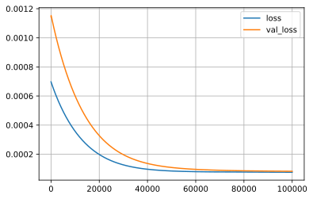
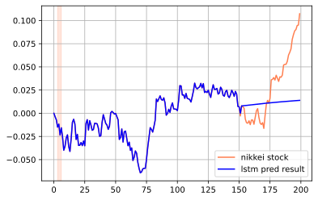

## LSTMを使った株価予測

LSTMは時系列データの予測のために利用されます。時系列データには、ある場所の気温や、来客数、商品の価格など多岐にわたりますが、最もデータを入手しやすい株価をLSTMで予測を行ってみたいと思います。

ただし、ニューラルネットはあくまでも得られたデータの範囲内でしか予測する事が出来ず、想定外の状況になった場合、そのモデルはほぼ意味をなしません。

例えば、コロナショック前の1年前のデータを用いても、コロナショックを予測する事は出来ません。

株価の形成はランダムな要素もあり、LSTMで未来を予測するのは難しいとは思いますが、LSTMに慣れるためにやってみようと思います。

### github
- jupyter notebook形式のファイルは[こちら](https://github.com/hiroshi0530/wa-src/tree/master/ml/lec/text/lstm_stock/lstm_nb.ipynb)

### google colaboratory
- google colaboratory で実行する場合は[こちら](https://colab.research.google.com/github/hiroshi0530/wa-src/tree/master/ml/lec/text/lstm_stock/lstm_nb.ipynb)

### 筆者の環境
筆者のOSはmacOSです。LinuxやUnixのコマンドとはオプションが異なります。


```python
!sw_vers
```

    ProductName:	Mac OS X
    ProductVersion:	10.14.6
    BuildVersion:	18G6020


```python
!python -V
```

    Python 3.7.3


基本的なライブラリとkerasをインポートしそのバージョンを確認しておきます。


```python
%matplotlib inline
%config InlineBackend.figure_format = 'svg'

import matplotlib
import matplotlib.pyplot as plt
import scipy
import numpy as np
import pandas as pd

import tensorflow as tf
from tensorflow import keras

print('matplotlib version :', matplotlib.__version__)
print('scipy version :', scipy.__version__)
print('numpy version :', np.__version__)
print('tensorflow version : ', tf.__version__)
print('keras version : ', keras.__version__)
```

    matplotlib version : 3.0.3
    scipy version : 1.4.1
    numpy version : 1.19.4
    tensorflow version :  2.4.0
    keras version :  2.4.0


## データの取得

今回は日経平均とアメリカのS&P500の株価のデータの予測を行います。データはそれぞれ以下のサイトからダウンロードしました。

### 日経平均のデータ

- https://indexes.nikkei.co.jp/nkave/index?type=download

### SP500のデータ

- https://kabuoji3.com/stock/download.php


## データの確認
まず最初に日経のデータを見てみます。


```python
!ls 
```

    lstm_nb.ipynb   lstm_nb.md      lstm_nb.py      lstm_nb.txt     lstm_nb_files   nikkei.csv      nikkei_utf8.csv sp500_2019.csv  sp500_2020.csv


```bash
%%bash
head nikkei.csv
```

    �f�[�^���t,�I�l,�n�l,���l,���l
    "2017/01/04","19594.16","19298.68","19594.16","19277.93"
    "2017/01/05","19520.69","19602.10","19615.40","19473.28"
    "2017/01/06","19454.33","19393.55","19472.37","19354.44"
    "2017/01/10","19301.44","19414.83","19484.90","19255.35"
    "2017/01/11","19364.67","19358.64","19402.17","19325.46"
    "2017/01/12","19134.70","19300.19","19300.19","19069.02"
    "2017/01/13","19287.28","19174.97","19299.36","19156.93"
    "2017/01/16","19095.24","19219.13","19255.41","19061.27"
    "2017/01/17","18813.53","19038.45","19043.91","18812.86"


文字コードがshift-jisになっているので、utf-8に直します。


```bash
%%bash
nkf --guess nikkei.csv
```

    Shift_JIS (CRLF)


```bash
%%bash
nkf -w nikkei.csv > nikkei_utf8.csv
```


```bash
%%bash
head nikkei_utf8.csv
```

    データ日付,終値,始値,高値,安値
    "2017/01/04","19594.16","19298.68","19594.16","19277.93"
    "2017/01/05","19520.69","19602.10","19615.40","19473.28"
    "2017/01/06","19454.33","19393.55","19472.37","19354.44"
    "2017/01/10","19301.44","19414.83","19484.90","19255.35"
    "2017/01/11","19364.67","19358.64","19402.17","19325.46"
    "2017/01/12","19134.70","19300.19","19300.19","19069.02"
    "2017/01/13","19287.28","19174.97","19299.36","19156.93"
    "2017/01/16","19095.24","19219.13","19255.41","19061.27"
    "2017/01/17","18813.53","19038.45","19043.91","18812.86"


問題ないようなので、pandasで読み込みます。


```python
df = pd.read_csv('nikkei_utf8.csv')
```


```python
df.head()
```


<div>
<style scoped>
    .dataframe tbody tr th:only-of-type {
        vertical-align: middle;
    }

    .dataframe tbody tr th {
        vertical-align: top;
    }

    .dataframe thead th {
        text-align: right;
    }
</style>
<table border="1" class="dataframe">
  <thead>
    <tr style="text-align: right;">
      <th></th>
      <th>データ日付</th>
      <th>終値</th>
      <th>始値</th>
      <th>高値</th>
      <th>安値</th>
    </tr>
  </thead>
  <tbody>
    <tr>
      <th>0</th>
      <td>2017/01/04</td>
      <td>19594.16</td>
      <td>19298.68</td>
      <td>19594.16</td>
      <td>19277.93</td>
    </tr>
    <tr>
      <th>1</th>
      <td>2017/01/05</td>
      <td>19520.69</td>
      <td>19602.10</td>
      <td>19615.40</td>
      <td>19473.28</td>
    </tr>
    <tr>
      <th>2</th>
      <td>2017/01/06</td>
      <td>19454.33</td>
      <td>19393.55</td>
      <td>19472.37</td>
      <td>19354.44</td>
    </tr>
    <tr>
      <th>3</th>
      <td>2017/01/10</td>
      <td>19301.44</td>
      <td>19414.83</td>
      <td>19484.90</td>
      <td>19255.35</td>
    </tr>
    <tr>
      <th>4</th>
      <td>2017/01/11</td>
      <td>19364.67</td>
      <td>19358.64</td>
      <td>19402.17</td>
      <td>19325.46</td>
    </tr>
  </tbody>
</table>
</div>


```python
df.tail()
```


<div>
<style scoped>
    .dataframe tbody tr th:only-of-type {
        vertical-align: middle;
    }

    .dataframe tbody tr th {
        vertical-align: top;
    }

    .dataframe thead th {
        text-align: right;
    }
</style>
<table border="1" class="dataframe">
  <thead>
    <tr style="text-align: right;">
      <th></th>
      <th>データ日付</th>
      <th>終値</th>
      <th>始値</th>
      <th>高値</th>
      <th>安値</th>
    </tr>
  </thead>
  <tbody>
    <tr>
      <th>971</th>
      <td>2020/12/24</td>
      <td>26668.35</td>
      <td>26635.11</td>
      <td>26764.53</td>
      <td>26605.26</td>
    </tr>
    <tr>
      <th>972</th>
      <td>2020/12/25</td>
      <td>26656.61</td>
      <td>26708.10</td>
      <td>26716.61</td>
      <td>26638.28</td>
    </tr>
    <tr>
      <th>973</th>
      <td>2020/12/28</td>
      <td>26854.03</td>
      <td>26691.29</td>
      <td>26854.03</td>
      <td>26664.60</td>
    </tr>
    <tr>
      <th>974</th>
      <td>2020/12/29</td>
      <td>27568.15</td>
      <td>26936.38</td>
      <td>27602.52</td>
      <td>26921.14</td>
    </tr>
    <tr>
      <th>975</th>
      <td>本資料は日経の著作物であり、本資料の全部又は一部を、いかなる形式によっても日経に無断で複写、...</td>
      <td>NaN</td>
      <td>NaN</td>
      <td>NaN</td>
      <td>NaN</td>
    </tr>
  </tbody>
</table>
</div>


最後の行に著作権に関する注意書きがありますが、これを削除します。複写や流布は行いません。


```python
df.drop(index=975, inplace=True)
```


```python
df.tail()
```


<div>
<style scoped>
    .dataframe tbody tr th:only-of-type {
        vertical-align: middle;
    }

    .dataframe tbody tr th {
        vertical-align: top;
    }

    .dataframe thead th {
        text-align: right;
    }
</style>
<table border="1" class="dataframe">
  <thead>
    <tr style="text-align: right;">
      <th></th>
      <th>データ日付</th>
      <th>終値</th>
      <th>始値</th>
      <th>高値</th>
      <th>安値</th>
    </tr>
  </thead>
  <tbody>
    <tr>
      <th>970</th>
      <td>2020/12/23</td>
      <td>26524.79</td>
      <td>26580.43</td>
      <td>26585.21</td>
      <td>26414.74</td>
    </tr>
    <tr>
      <th>971</th>
      <td>2020/12/24</td>
      <td>26668.35</td>
      <td>26635.11</td>
      <td>26764.53</td>
      <td>26605.26</td>
    </tr>
    <tr>
      <th>972</th>
      <td>2020/12/25</td>
      <td>26656.61</td>
      <td>26708.10</td>
      <td>26716.61</td>
      <td>26638.28</td>
    </tr>
    <tr>
      <th>973</th>
      <td>2020/12/28</td>
      <td>26854.03</td>
      <td>26691.29</td>
      <td>26854.03</td>
      <td>26664.60</td>
    </tr>
    <tr>
      <th>974</th>
      <td>2020/12/29</td>
      <td>27568.15</td>
      <td>26936.38</td>
      <td>27602.52</td>
      <td>26921.14</td>
    </tr>
  </tbody>
</table>
</div>


データを可視化してみます。コロナショックで大きくへこんでいることがわかりますが、2020年の年末の時点では金融緩和の影響を受けて大幅に上がっています。

### データの整形

最初のデータを基準に、その値からの変化率を計算し、そのリストに対して学習を行います。


```python
def shape_data(data_list):
  return [d / data_list[0] - 1 for d in data_list]

df['data_list'] = shape_data(df['終値'])
```


```python
ticks = 10
xticks = ticks * 5 

# plt.plot(df['データ日付'][::ticks], df['data_list'][::ticks], label='nikkei stock')
plt.plot(df.index.values[::ticks], df['data_list'][::ticks], label='nikkei stock')
plt.grid()
plt.legend()
# plt.xticks(df['データ日付'][::xticks], rotation=60)
plt.show()
```


## データの準備

kerasに投入するためにデータを整えます。


```python
NUM_LSTM = 30

# x = np.array((df['データ日付']))
# y = np.array((df['終値']))

# x = np.linspace(0, 5 * np.pi, 100)
# y = np.cos(x)

x = np.array(df.index.values[:40])
y = np.array(df['data_list'][:40])

# x = np.array(df.index.values)
# y = np.array(df['data_list'])

# x = np.linspace(0, 5 * np.pi, 200)
# y = np.exp(-x / 5) * (np.cos(x))

n = len(y) - NUM_LSTM
l_x = np.zeros((n, NUM_LSTM))
l_y = np.zeros((n, NUM_LSTM))
for i in range(0, n):
  l_x[i] = y[i: i + NUM_LSTM]
  l_y[i] = y[i + 1: i + NUM_LSTM + 1]

l_x = l_x.reshape(n, NUM_LSTM, 1)
l_y = l_y.reshape(n, NUM_LSTM, 1)
```


```python
print('shape : ', x.shape)
print('ndim : ', x.ndim)
print('data : ', x[:10])
```

    shape :  (40,)
    ndim :  1
    data :  [0 1 2 3 4 5 6 7 8 9]


```python
print('shape : ', y.shape)
print('ndim : ', y.ndim)
print('data : ', y[:10])
```

    shape :  (40,)
    ndim :  1
    data :  [ 0.         -0.00374959 -0.00713631 -0.01493915 -0.01171216 -0.02344882
     -0.01566181 -0.02546269 -0.03983993 -0.03571421]


```python
print(l_y.shape)
print(l_x.shape)
```

    (10, 30, 1)
    (10, 30, 1)


モデルの構築を定義する関数です。


```python
from tensorflow.keras.models import Sequential
from tensorflow.keras.layers import Dense
from tensorflow.keras.layers import LSTM
from tensorflow.keras.layers import Dropout
from tensorflow.keras.layers import Activation
from tensorflow.keras.layers import SimpleRNN

batch_size = 40
epochs = 150

NUM_MIDDLE = 200 
NUM_MIDDLE_01 = 100
NUM_MIDDLE_02 = 120

def build_lstm_model():
  # LSTMニューラルネットの構築
  model = Sequential()
  # model.add(SimpleRNN(NUM_MIDDLE, input_shape=(NUM_LSTM, 1), return_sequences=True))
  model.add(LSTM(NUM_MIDDLE, input_shape=(NUM_LSTM, 1), return_sequences=True))
  model.add(Dense(1, activation="linear"))
  model.compile(loss="mean_squared_error", optimizer="sgd")
  
  # LSTMニューラルネットの構築
  # model = Sequential()
  # model.add(LSTM(NUM_MIDDLE_01, input_shape = (NUM_LSTM, 1), return_sequences=True))
  # model.add(Dropout(0.2))
  # model.add(LSTM(NUM_MIDDLE_02, return_sequences=True))
  # model.add(Dropout(0.2))
  # model.add(Dense(1))
  # model.add(Activation("linear"))
  # model.compile(loss="mse", optimizer='rmsprop')
  # model.compile(loss="mean_squared_error", optimizer="sgd")
  
  return model

model = build_lstm_model()
```

# 詳細を確認します。


```python
print(model.summary())
```

    Model: "sequential_16"
    _________________________________________________________________
    Layer (type)                 Output Shape              Param #   
    =================================================================
    lstm_14 (LSTM)               (None, 30, 200)           161600    
    _________________________________________________________________
    dense_16 (Dense)             (None, 30, 1)             201       
    =================================================================
    Total params: 161,801
    Trainable params: 161,801
    Non-trainable params: 0
    _________________________________________________________________
    None


```python
# validation_split で最後の10％を検証用に利用します
history = model.fit(l_x, l_y, epochs=epochs, batch_size=batch_size, validation_split=0.1, verbose=1)
```

    Epoch 1/150
    1/1 [==============================] - 5s 5s/step - loss: 5.5445e-04 - val_loss: 4.4779e-04
    Epoch 2/150
    1/1 [==============================] - 0s 176ms/step - loss: 5.1066e-04 - val_loss: 4.1185e-04
    Epoch 3/150
    1/1 [==============================] - 0s 265ms/step - loss: 4.7135e-04 - val_loss: 3.7976e-04
    Epoch 4/150
    1/1 [==============================] - 0s 183ms/step - loss: 4.3606e-04 - val_loss: 3.5111e-04
    Epoch 5/150
    1/1 [==============================] - 0s 195ms/step - loss: 4.0439e-04 - val_loss: 3.2555e-04
    Epoch 6/150
    1/1 [==============================] - 1s 774ms/step - loss: 3.7597e-04 - val_loss: 3.0275e-04
    Epoch 7/150
    1/1 [==============================] - 0s 289ms/step - loss: 3.5045e-04 - val_loss: 2.8241e-04
    Epoch 8/150
    1/1 [==============================] - 0s 201ms/step - loss: 3.2754e-04 - val_loss: 2.6429e-04
    Epoch 9/150
    1/1 [==============================] - 0s 153ms/step - loss: 3.0698e-04 - val_loss: 2.4814e-04
    Epoch 10/150
    1/1 [==============================] - 0s 112ms/step - loss: 2.8852e-04 - val_loss: 2.3375e-04
    Epoch 11/150
    1/1 [==============================] - 0s 101ms/step - loss: 2.7196e-04 - val_loss: 2.2095e-04
    Epoch 12/150
    1/1 [==============================] - 0s 85ms/step - loss: 2.5708e-04 - val_loss: 2.0956e-04
    Epoch 13/150
    1/1 [==============================] - 0s 121ms/step - loss: 2.4373e-04 - val_loss: 1.9943e-04
    Epoch 14/150
    1/1 [==============================] - 0s 133ms/step - loss: 2.3174e-04 - val_loss: 1.9042e-04
    Epoch 15/150
    1/1 [==============================] - 0s 116ms/step - loss: 2.2098e-04 - val_loss: 1.8242e-04
    Epoch 16/150
    1/1 [==============================] - 0s 113ms/step - loss: 2.1132e-04 - val_loss: 1.7533e-04
    Epoch 17/150
    1/1 [==============================] - 0s 197ms/step - loss: 2.0265e-04 - val_loss: 1.6903e-04
    Epoch 18/150
    1/1 [==============================] - 0s 241ms/step - loss: 1.9486e-04 - val_loss: 1.6345e-04
    Epoch 19/150
    1/1 [==============================] - 0s 216ms/step - loss: 1.8786e-04 - val_loss: 1.5851e-04
    Epoch 20/150
    1/1 [==============================] - 0s 205ms/step - loss: 1.8158e-04 - val_loss: 1.5414e-04
    Epoch 21/150
    1/1 [==============================] - 0s 170ms/step - loss: 1.7594e-04 - val_loss: 1.5027e-04
    Epoch 22/150
    1/1 [==============================] - 0s 247ms/step - loss: 1.7088e-04 - val_loss: 1.4686e-04
    Epoch 23/150
    1/1 [==============================] - 0s 129ms/step - loss: 1.6633e-04 - val_loss: 1.4385e-04
    Epoch 24/150
    1/1 [==============================] - 0s 129ms/step - loss: 1.6225e-04 - val_loss: 1.4120e-04
    Epoch 25/150
    1/1 [==============================] - 0s 238ms/step - loss: 1.5858e-04 - val_loss: 1.3887e-04
    Epoch 26/150
    1/1 [==============================] - 0s 181ms/step - loss: 1.5528e-04 - val_loss: 1.3682e-04
    Epoch 27/150
    1/1 [==============================] - 1s 553ms/step - loss: 1.5232e-04 - val_loss: 1.3502e-04
    Epoch 28/150
    1/1 [==============================] - 0s 241ms/step - loss: 1.4965e-04 - val_loss: 1.3345e-04
    Epoch 29/150
    1/1 [==============================] - 0s 219ms/step - loss: 1.4726e-04 - val_loss: 1.3208e-04
    Epoch 30/150
    1/1 [==============================] - 0s 213ms/step - loss: 1.4511e-04 - val_loss: 1.3088e-04
    Epoch 31/150
    1/1 [==============================] - 0s 256ms/step - loss: 1.4318e-04 - val_loss: 1.2983e-04
    Epoch 32/150
    1/1 [==============================] - 0s 321ms/step - loss: 1.4144e-04 - val_loss: 1.2893e-04
    Epoch 33/150
    1/1 [==============================] - 0s 108ms/step - loss: 1.3988e-04 - val_loss: 1.2814e-04
    Epoch 34/150
    1/1 [==============================] - 0s 226ms/step - loss: 1.3847e-04 - val_loss: 1.2747e-04
    Epoch 35/150
    1/1 [==============================] - 0s 93ms/step - loss: 1.3720e-04 - val_loss: 1.2689e-04
    Epoch 36/150
    1/1 [==============================] - 0s 89ms/step - loss: 1.3607e-04 - val_loss: 1.2639e-04
    Epoch 37/150
    1/1 [==============================] - 0s 96ms/step - loss: 1.3504e-04 - val_loss: 1.2597e-04
    Epoch 38/150
    1/1 [==============================] - 0s 92ms/step - loss: 1.3412e-04 - val_loss: 1.2561e-04
    Epoch 39/150
    1/1 [==============================] - 0s 94ms/step - loss: 1.3328e-04 - val_loss: 1.2531e-04
    Epoch 40/150
    1/1 [==============================] - 0s 100ms/step - loss: 1.3253e-04 - val_loss: 1.2505e-04
    Epoch 41/150
    1/1 [==============================] - 0s 91ms/step - loss: 1.3186e-04 - val_loss: 1.2484e-04
    Epoch 42/150
    1/1 [==============================] - 0s 150ms/step - loss: 1.3125e-04 - val_loss: 1.2467e-04
    Epoch 43/150
    1/1 [==============================] - 0s 133ms/step - loss: 1.3070e-04 - val_loss: 1.2453e-04
    Epoch 44/150
    1/1 [==============================] - 0s 94ms/step - loss: 1.3020e-04 - val_loss: 1.2442e-04
    Epoch 45/150
    1/1 [==============================] - 0s 274ms/step - loss: 1.2975e-04 - val_loss: 1.2434e-04
    Epoch 46/150
    1/1 [==============================] - 0s 142ms/step - loss: 1.2934e-04 - val_loss: 1.2427e-04
    Epoch 47/150
    1/1 [==============================] - 0s 130ms/step - loss: 1.2898e-04 - val_loss: 1.2422e-04
    Epoch 48/150
    1/1 [==============================] - 0s 128ms/step - loss: 1.2864e-04 - val_loss: 1.2419e-04
    Epoch 49/150
    1/1 [==============================] - 0s 362ms/step - loss: 1.2834e-04 - val_loss: 1.2418e-04
    Epoch 50/150
    1/1 [==============================] - 0s 144ms/step - loss: 1.2806e-04 - val_loss: 1.2417e-04
    Epoch 51/150
    1/1 [==============================] - 0s 152ms/step - loss: 1.2781e-04 - val_loss: 1.2417e-04
    Epoch 52/150
    1/1 [==============================] - 0s 112ms/step - loss: 1.2759e-04 - val_loss: 1.2418e-04
    Epoch 53/150
    1/1 [==============================] - 0s 97ms/step - loss: 1.2738e-04 - val_loss: 1.2420e-04
    Epoch 54/150
    1/1 [==============================] - 0s 92ms/step - loss: 1.2719e-04 - val_loss: 1.2422e-04
    Epoch 55/150
    1/1 [==============================] - 0s 90ms/step - loss: 1.2702e-04 - val_loss: 1.2424e-04
    Epoch 56/150
    1/1 [==============================] - 0s 495ms/step - loss: 1.2686e-04 - val_loss: 1.2427e-04
    Epoch 57/150
    1/1 [==============================] - 0s 112ms/step - loss: 1.2671e-04 - val_loss: 1.2430e-04
    Epoch 58/150
    1/1 [==============================] - 0s 107ms/step - loss: 1.2658e-04 - val_loss: 1.2433e-04
    Epoch 59/150
    1/1 [==============================] - 0s 105ms/step - loss: 1.2646e-04 - val_loss: 1.2436e-04
    Epoch 60/150
    1/1 [==============================] - 0s 353ms/step - loss: 1.2634e-04 - val_loss: 1.2439e-04
    Epoch 61/150
    1/1 [==============================] - 0s 247ms/step - loss: 1.2624e-04 - val_loss: 1.2443e-04
    Epoch 62/150
    1/1 [==============================] - 0s 194ms/step - loss: 1.2614e-04 - val_loss: 1.2446e-04
    Epoch 63/150
    1/1 [==============================] - 0s 148ms/step - loss: 1.2605e-04 - val_loss: 1.2449e-04
    Epoch 64/150
    1/1 [==============================] - 0s 214ms/step - loss: 1.2597e-04 - val_loss: 1.2452e-04
    Epoch 65/150
    1/1 [==============================] - 0s 161ms/step - loss: 1.2589e-04 - val_loss: 1.2455e-04
    Epoch 66/150
    1/1 [==============================] - 0s 312ms/step - loss: 1.2581e-04 - val_loss: 1.2458e-04
    Epoch 67/150
    1/1 [==============================] - 0s 235ms/step - loss: 1.2574e-04 - val_loss: 1.2460e-04
    Epoch 68/150
    1/1 [==============================] - 0s 258ms/step - loss: 1.2568e-04 - val_loss: 1.2463e-04
    Epoch 69/150
    1/1 [==============================] - 0s 188ms/step - loss: 1.2562e-04 - val_loss: 1.2465e-04
    Epoch 70/150
    1/1 [==============================] - 0s 212ms/step - loss: 1.2556e-04 - val_loss: 1.2467e-04
    Epoch 71/150
    1/1 [==============================] - 0s 159ms/step - loss: 1.2550e-04 - val_loss: 1.2469e-04
    Epoch 72/150
    1/1 [==============================] - 0s 144ms/step - loss: 1.2545e-04 - val_loss: 1.2470e-04
    Epoch 73/150
    1/1 [==============================] - 0s 134ms/step - loss: 1.2540e-04 - val_loss: 1.2472e-04
    Epoch 74/150
    1/1 [==============================] - 0s 144ms/step - loss: 1.2535e-04 - val_loss: 1.2473e-04
    Epoch 75/150
    1/1 [==============================] - 0s 131ms/step - loss: 1.2530e-04 - val_loss: 1.2474e-04
    Epoch 76/150
    1/1 [==============================] - 0s 160ms/step - loss: 1.2526e-04 - val_loss: 1.2475e-04
    Epoch 77/150
    1/1 [==============================] - 0s 172ms/step - loss: 1.2522e-04 - val_loss: 1.2476e-04
    Epoch 78/150
    1/1 [==============================] - 0s 200ms/step - loss: 1.2517e-04 - val_loss: 1.2476e-04
    Epoch 79/150
    1/1 [==============================] - 0s 111ms/step - loss: 1.2513e-04 - val_loss: 1.2477e-04
    Epoch 80/150
    1/1 [==============================] - 0s 171ms/step - loss: 1.2509e-04 - val_loss: 1.2477e-04
    Epoch 81/150
    1/1 [==============================] - 0s 264ms/step - loss: 1.2506e-04 - val_loss: 1.2477e-04
    Epoch 82/150
    1/1 [==============================] - 0s 102ms/step - loss: 1.2502e-04 - val_loss: 1.2477e-04
    Epoch 83/150
    1/1 [==============================] - 0s 130ms/step - loss: 1.2498e-04 - val_loss: 1.2477e-04
    Epoch 84/150
    1/1 [==============================] - 0s 123ms/step - loss: 1.2495e-04 - val_loss: 1.2476e-04
    Epoch 85/150
    1/1 [==============================] - 0s 118ms/step - loss: 1.2491e-04 - val_loss: 1.2476e-04
    Epoch 86/150
    1/1 [==============================] - 0s 106ms/step - loss: 1.2488e-04 - val_loss: 1.2475e-04
    Epoch 87/150
    1/1 [==============================] - 0s 123ms/step - loss: 1.2484e-04 - val_loss: 1.2474e-04
    Epoch 88/150
    1/1 [==============================] - 0s 123ms/step - loss: 1.2481e-04 - val_loss: 1.2473e-04
    Epoch 89/150
    1/1 [==============================] - 0s 101ms/step - loss: 1.2477e-04 - val_loss: 1.2472e-04
    Epoch 90/150
    1/1 [==============================] - 0s 245ms/step - loss: 1.2474e-04 - val_loss: 1.2471e-04
    Epoch 91/150
    1/1 [==============================] - 0s 225ms/step - loss: 1.2471e-04 - val_loss: 1.2469e-04
    Epoch 92/150
    1/1 [==============================] - 0s 165ms/step - loss: 1.2468e-04 - val_loss: 1.2468e-04
    Epoch 93/150
    1/1 [==============================] - 0s 200ms/step - loss: 1.2465e-04 - val_loss: 1.2466e-04
    Epoch 94/150
    1/1 [==============================] - 0s 270ms/step - loss: 1.2461e-04 - val_loss: 1.2464e-04
    Epoch 95/150
    1/1 [==============================] - 0s 237ms/step - loss: 1.2458e-04 - val_loss: 1.2463e-04
    Epoch 96/150
    1/1 [==============================] - 0s 158ms/step - loss: 1.2455e-04 - val_loss: 1.2461e-04
    Epoch 97/150
    1/1 [==============================] - 0s 164ms/step - loss: 1.2452e-04 - val_loss: 1.2459e-04
    Epoch 98/150
    1/1 [==============================] - 0s 185ms/step - loss: 1.2449e-04 - val_loss: 1.2457e-04
    Epoch 99/150
    1/1 [==============================] - 0s 168ms/step - loss: 1.2446e-04 - val_loss: 1.2454e-04
    Epoch 100/150
    1/1 [==============================] - 0s 142ms/step - loss: 1.2443e-04 - val_loss: 1.2452e-04
    Epoch 101/150
    1/1 [==============================] - 0s 186ms/step - loss: 1.2440e-04 - val_loss: 1.2450e-04
    Epoch 102/150
    1/1 [==============================] - 0s 154ms/step - loss: 1.2437e-04 - val_loss: 1.2448e-04
    Epoch 103/150
    1/1 [==============================] - 0s 169ms/step - loss: 1.2434e-04 - val_loss: 1.2445e-04
    Epoch 104/150
    1/1 [==============================] - 0s 141ms/step - loss: 1.2431e-04 - val_loss: 1.2443e-04
    Epoch 105/150
    1/1 [==============================] - 0s 157ms/step - loss: 1.2428e-04 - val_loss: 1.2440e-04
    Epoch 106/150
    1/1 [==============================] - 0s 166ms/step - loss: 1.2425e-04 - val_loss: 1.2437e-04
    Epoch 107/150
    1/1 [==============================] - 0s 114ms/step - loss: 1.2422e-04 - val_loss: 1.2435e-04
    Epoch 108/150
    1/1 [==============================] - 0s 114ms/step - loss: 1.2419e-04 - val_loss: 1.2432e-04
    Epoch 109/150
    1/1 [==============================] - 0s 129ms/step - loss: 1.2416e-04 - val_loss: 1.2429e-04
    Epoch 110/150
    1/1 [==============================] - 0s 171ms/step - loss: 1.2414e-04 - val_loss: 1.2426e-04
    Epoch 111/150
    1/1 [==============================] - 0s 159ms/step - loss: 1.2411e-04 - val_loss: 1.2424e-04
    Epoch 112/150
    1/1 [==============================] - 0s 254ms/step - loss: 1.2408e-04 - val_loss: 1.2421e-04
    Epoch 113/150
    1/1 [==============================] - 0s 139ms/step - loss: 1.2405e-04 - val_loss: 1.2418e-04
    Epoch 114/150
    1/1 [==============================] - 0s 142ms/step - loss: 1.2402e-04 - val_loss: 1.2415e-04
    Epoch 115/150
    1/1 [==============================] - 0s 135ms/step - loss: 1.2399e-04 - val_loss: 1.2412e-04
    Epoch 116/150
    1/1 [==============================] - 0s 159ms/step - loss: 1.2396e-04 - val_loss: 1.2409e-04
    Epoch 117/150
    1/1 [==============================] - 0s 405ms/step - loss: 1.2393e-04 - val_loss: 1.2406e-04
    Epoch 118/150
    1/1 [==============================] - 0s 92ms/step - loss: 1.2391e-04 - val_loss: 1.2403e-04
    Epoch 119/150
    1/1 [==============================] - 0s 99ms/step - loss: 1.2388e-04 - val_loss: 1.2399e-04
    Epoch 120/150
    1/1 [==============================] - 0s 113ms/step - loss: 1.2385e-04 - val_loss: 1.2396e-04
    Epoch 121/150
    1/1 [==============================] - 0s 100ms/step - loss: 1.2382e-04 - val_loss: 1.2393e-04
    Epoch 122/150
    1/1 [==============================] - 0s 115ms/step - loss: 1.2379e-04 - val_loss: 1.2390e-04
    Epoch 123/150
    1/1 [==============================] - 0s 109ms/step - loss: 1.2376e-04 - val_loss: 1.2387e-04
    Epoch 124/150
    1/1 [==============================] - 0s 93ms/step - loss: 1.2374e-04 - val_loss: 1.2383e-04
    Epoch 125/150
    1/1 [==============================] - 0s 87ms/step - loss: 1.2371e-04 - val_loss: 1.2380e-04
    Epoch 126/150
    1/1 [==============================] - 0s 193ms/step - loss: 1.2368e-04 - val_loss: 1.2377e-04
    Epoch 127/150
    1/1 [==============================] - 0s 101ms/step - loss: 1.2365e-04 - val_loss: 1.2374e-04
    Epoch 128/150
    1/1 [==============================] - 0s 84ms/step - loss: 1.2362e-04 - val_loss: 1.2370e-04
    Epoch 129/150
    1/1 [==============================] - 0s 97ms/step - loss: 1.2360e-04 - val_loss: 1.2367e-04
    Epoch 130/150
    1/1 [==============================] - 0s 80ms/step - loss: 1.2357e-04 - val_loss: 1.2364e-04
    Epoch 131/150
    1/1 [==============================] - 0s 119ms/step - loss: 1.2354e-04 - val_loss: 1.2360e-04
    Epoch 132/150
    1/1 [==============================] - 0s 115ms/step - loss: 1.2351e-04 - val_loss: 1.2357e-04
    Epoch 133/150
    1/1 [==============================] - 0s 180ms/step - loss: 1.2348e-04 - val_loss: 1.2354e-04
    Epoch 134/150
    1/1 [==============================] - 0s 151ms/step - loss: 1.2346e-04 - val_loss: 1.2350e-04
    Epoch 135/150
    1/1 [==============================] - 0s 143ms/step - loss: 1.2343e-04 - val_loss: 1.2347e-04
    Epoch 136/150
    1/1 [==============================] - 0s 149ms/step - loss: 1.2340e-04 - val_loss: 1.2343e-04
    Epoch 137/150
    1/1 [==============================] - 0s 154ms/step - loss: 1.2337e-04 - val_loss: 1.2340e-04
    Epoch 138/150
    1/1 [==============================] - 0s 165ms/step - loss: 1.2335e-04 - val_loss: 1.2337e-04
    Epoch 139/150
    1/1 [==============================] - 0s 252ms/step - loss: 1.2332e-04 - val_loss: 1.2333e-04
    Epoch 140/150
    1/1 [==============================] - 0s 196ms/step - loss: 1.2329e-04 - val_loss: 1.2330e-04
    Epoch 141/150
    1/1 [==============================] - 0s 143ms/step - loss: 1.2326e-04 - val_loss: 1.2326e-04
    Epoch 142/150
    1/1 [==============================] - 0s 166ms/step - loss: 1.2324e-04 - val_loss: 1.2323e-04
    Epoch 143/150
    1/1 [==============================] - 0s 152ms/step - loss: 1.2321e-04 - val_loss: 1.2319e-04
    Epoch 144/150
    1/1 [==============================] - 0s 297ms/step - loss: 1.2318e-04 - val_loss: 1.2316e-04
    Epoch 145/150
    1/1 [==============================] - 0s 151ms/step - loss: 1.2316e-04 - val_loss: 1.2313e-04
    Epoch 146/150
    1/1 [==============================] - 0s 181ms/step - loss: 1.2313e-04 - val_loss: 1.2309e-04
    Epoch 147/150
    1/1 [==============================] - 0s 147ms/step - loss: 1.2310e-04 - val_loss: 1.2306e-04
    Epoch 148/150
    1/1 [==============================] - 0s 206ms/step - loss: 1.2307e-04 - val_loss: 1.2302e-04
    Epoch 149/150
    1/1 [==============================] - 0s 294ms/step - loss: 1.2305e-04 - val_loss: 1.2299e-04
    Epoch 150/150
    1/1 [==============================] - 0s 230ms/step - loss: 1.2302e-04 - val_loss: 1.2295e-04


## 損失関数の可視化

学習によって誤差が減少していく様子を可視化してみます。


```python
loss = history.history['loss']
val_loss = history.history['val_loss']

plt.plot(np.arange(len(loss)), loss, label='loss')
plt.plot(np.arange(len(val_loss)), val_loss, label='val_loss')
plt.grid()
plt.legend()
plt.show()
```





## 結果の確認


```python
# 初期の入力値
res = []
res = np.append(res, 0)
res = np.append(res, l_y[0].reshape(-1))
# res = l_y[0].reshape(-1)

res = np.append(res, 0)

for i in range(0, n):
  _y = model.predict(res[- NUM_LSTM:].reshape(1, NUM_LSTM, 1))
  res = np.append(res, _y[0][NUM_LSTM - 1][0])

res = np.delete(res, -1)  
res = np.delete(res, -1)  

plt.plot(np.arange(len(y)), y, label="nikkei stock")
plt.plot(np.arange(len(res)), res, label="lstm pred result")
plt.legend()
plt.grid()

plt.fill_between(np.arange(len(y)),
                 res,
                 0,
                 facecolor="orange", # The fill color
                 color='blue',       # The outline color
                 alpha=0.2)          # Transparency of the fill

plt.fill_between(np.arange(len(y)),
                 y,
                 0,
                 facecolor="orange", # The fill color
                 color='blue',       # The outline color
                 alpha=0.2)          # Transparency of the fill
plt.show()
```





```python

```


```python

```


```python

```


```python

```


```python

```


```python

```


```python


import os
import time
import warnings
import numpy as np
from numpy import newaxis
from keras.layers.core import Dense, Activation, Dropout
from keras.layers.recurrent import LSTM
from keras.models import Sequential

os.environ['TF_CPP_MIN_LOG_LEVEL'] = '3'
warnings.filterwarnings("ignore")

def load_data(filename, seq_len, normalise_window):
    f = open(filename, 'rb').read()
    data = f.decode().split('\n')

    sequence_length = seq_len + 1
    result = []
    for index in range(len(data) - sequence_length):
        result.append(data[index: index + sequence_length])

    if normalise_window:
        result = normalise_windows(result)

    result = np.array(result)

    row = round(0.9 * result.shape[0])
    train = result[:int(row),:]
    np.random.shuffle(train)
    x_train = train[:,:-1]
    y_train = train[:,-1]
    x_test = result[int(row):, :-1]
    y_test = result[int(row):, -1]

    x_train = np.reshape(x_train, (x_train.shape[0], x_train.shape[1],1))
    x_test = np.reshape(x_test, (x_test.shape[0], x_test.shape[1], 1))

    return [x_train, y_train, x_test, y_test]

def normalise_windows(window_data):
    normalised_data = []
    for window in window_data:
        normalised_window = [((float(p) / float(window[0])) - 1) for p in window]
        normalised_data.append(normalised_window)
    return normalised_data

def build_model(layers):
    model = Sequential()

    model.add(LSTM(input_shape = (layers[1], layers[0]),
                    output_dim=layers[1],
                    return_sequences=True))
    model.add(Dropout(0.2))

    model.add(LSTM(layers[2],return_sequences=False))
    model.add(Dropout(0.2))

    model.add(Dense(output_dim=layers[3]))
    model.add(Activation("linear"))

    start = time.time()
    model.compile(loss="mse", optimizer='rmsprop')
    print(" 実行時間：　", time.time() - start)
    return model

def predict_point_by_point(model, data):
    predicted = model.predict(data)
    predicted = np.reshape(predicted, (predicted.size,))
    return predicted

def predict_sequence_full(model, data, window_size):
    curr_frame = data[0]
    predicted = []
    for i in range(len(data)):
        predicted.append(model.predict(curr_frame[newaxis,:,:])[0,0])
        curr_frame = curr_frame[1:]
        curr_frame = np.insert(curr_frame, [window_size-1], predicted[-1], axis=0)
    return predicted

def predict_sequences_multiple(model, data, window_size, prediction_len):
    prediction_seqs = []
    for i in range(int(len(data)/prediction_len)):
        curr_frame = data[i*prediction_len]
        predicted = []
        for j in range(prediction_len):
            predicted.append(model.predict(curr_frame[newaxis,:,:])[0,0])
            curr_frame = curr_frame[1:]
            curr_frame = np.insert(curr_frame, [window_size-1], predicted[-1], axis=0)
        prediction_seqs.append(predicted)
    return prediction_seqs

 import os
import time
import warnings
import numpy as np
from numpy import newaxis
from keras.layers.core import Dense, Activation, Dropout
from keras.layers.recurrent import LSTM
from keras.models import Sequential

os.environ['TF_CPP_MIN_LOG_LEVEL'] = '3'
warnings.filterwarnings("ignore")

def load_data(filename, seq_len, normalise_window):
    f = open(filename, 'rb').read()
    data = f.decode().split('\n')

    sequence_length = seq_len + 1
    result = []
    for index in range(len(data) - sequence_length):
        result.append(data[index: index + sequence_length])

    if normalise_window:
        result = normalise_windows(result)

    result = np.array(result)

    row = round(0.9 * result.shape[0])
    train = result[:int(row),:]
    np.random.shuffle(train)
    x_train = train[:,:-1]
    y_train = train[:,-1]
    x_test = result[int(row):, :-1]
    y_test = result[int(row):, -1]

    x_train = np.reshape(x_train, (x_train.shape[0], x_train.shape[1],1))
    x_test = np.reshape(x_test, (x_test.shape[0], x_test.shape[1], 1))

    return [x_train, y_train, x_test, y_test]

def normalise_windows(window_data):
    normalised_data = []
    for window in window_data:
        normalised_window = [((float(p) / float(window[0])) - 1) for p in window]
        normalised_data.append(normalised_window)
    return normalised_data

def build_model(layers):
    model = Sequential()

    model.add(LSTM(input_shape = (layers[1], layers[0]),
                    output_dim=layers[1],
                    return_sequences=True))
    model.add(Dropout(0.2))

    model.add(LSTM(layers[2],return_sequences=False))
    model.add(Dropout(0.2))

    model.add(Dense(output_dim=layers[3]))
    model.add(Activation("linear"))

    start = time.time()
    model.compile(loss="mse", optimizer='rmsprop')
    print(" 実行時間：　", time.time() - start)
    return model

def predict_point_by_point(model, data):
    predicted = model.predict(data)
    predicted = np.reshape(predicted, (predicted.size,))
    return predicted

def predict_sequence_full(model, data, window_size):
    curr_frame = data[0]
    predicted = []
    for i in range(len(data)):
        predicted.append(model.predict(curr_frame[newaxis,:,:])[0,0])
        curr_frame = curr_frame[1:]
        curr_frame = np.insert(curr_frame, [window_size-1], predicted[-1], axis=0)
    return predicted

def predict_sequences_multiple(model, data, window_size, prediction_len):
    prediction_seqs = []
    for i in range(int(len(data)/prediction_len)):
        curr_frame = data[i*prediction_len]
        predicted = []
        for j in range(prediction_len):
            predicted.append(model.predict(curr_frame[newaxis,:,:])[0,0])
            curr_frame = curr_frame[1:]
            curr_frame = np.insert(curr_frame, [window_size-1], predicted[-1], axis=0)
        prediction_seqs.append(predicted)
    return prediction_seqs
 
"""
model.fit(X_train, y_train, batch_size=512, nb_epoch=epoch, validation_split=0.05)
predictions = lstm.predict_sequences_multiple(model, X_test, seq_len, 50)
model = lstm.build_model([1, 50, 100, 1])
"""

```


      File "<tokenize>", line 92
        import os
        ^
    IndentationError: unindent does not match any outer indentation level


