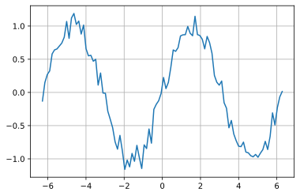
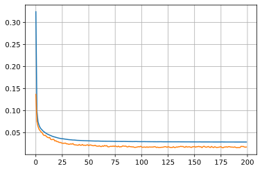
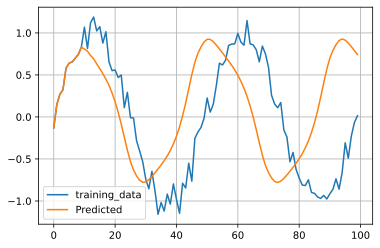

## word2vec と doc2vec

単語や文章を分散表現（意味が似たような単語や文章を似たようなベクトルとして表現）を取得します。

### github
- jupyter notebook形式のファイルは[こちら](https://github.com/hiroshi0530/wa-src/blob/master/article/library/scipy/template/template_nb.ipynb)

### google colaboratory
- google colaboratory で実行する場合は[こちら](https://colab.research.google.com/github/hiroshi0530/wa-src/blob/master/article/library/scipy/template/template_nb.ipynb)

### 筆者の環境
筆者のOSはmacOSです。LinuxやUnixのコマンドとはオプションが異なります。


```python
!sw_vers
```

    ProductName:	Mac OS X
    ProductVersion:	10.14.6
    BuildVersion:	18G6032


```python
!python -V
```

    Python 3.8.5


基本的なライブラリをインポートしそのバージョンを確認しておきます。


```python
%matplotlib inline
%config InlineBackend.figure_format = 'svg'

import matplotlib
import matplotlib.pyplot as plt
import scipy
import numpy as np

print('matplotlib version :', matplotlib.__version__)
print('scipy version :', scipy.__version__)
print('numpy version :', np.__version__)
```

    matplotlib version : 3.3.2
    scipy version : 1.5.2
    numpy version : 1.18.5


```python

```


```python
x = np.linspace(-2 * np.pi, 2 * np.pi, 100)
y = np.sin(x) + 0.1 * np.random.randn(len(x))

plt.plot(x, y)
plt.grid()
plt.show()
```


    

    


```python

```


```python
n_rnn = 10
n_sample = len(x) - n_rnn
x1 = np.zeros((n_sample, n_rnn))
t1 = np.zeros((n_sample, n_rnn))

for i in range(0, n_sample):
  x1[i] = y[i : i + n_rnn]
  t1[i] = y[i + 1 : i + n_rnn + 1]

x1 = x1.reshape(n_sample, n_rnn, 1)
t1 = t1.reshape(n_sample, n_rnn, 1)

print(x1.shape)
print(t1.shape)
```

    (90, 10, 1)
    (90, 10, 1)


### RNNの構築

Kerasの中で最もシンプルなSimpleRNNを利用する


```python
from tensorflow.keras.models import Sequential
from tensorflow.keras.layers import Dense, SimpleRNN

batch_size = 8
n_in = 1
n_mid = 20
n_out = 1
```


```python
model = Sequential()

model.add(SimpleRNN(n_mid, input_shape=(n_rnn, n_in), return_sequences=True))
model.add(Dense(n_out, activation='linear'))
model.compile(loss="mean_squared_error", optimizer='sgd')

model.summary()
```

    Model: "sequential"
    _________________________________________________________________
    Layer (type)                 Output Shape              Param #   
    =================================================================
    simple_rnn (SimpleRNN)       (None, 10, 20)            440       
    _________________________________________________________________
    dense (Dense)                (None, 10, 1)             21        
    =================================================================
    Total params: 461
    Trainable params: 461
    Non-trainable params: 0
    _________________________________________________________________


```python
history = model.fit(x1, t1, epochs=200, batch_size=batch_size, validation_split=0.1)
```

    Epoch 1/200
    11/11 [==============================] - 0s 17ms/step - loss: 0.3244 - val_loss: 0.1369
    Epoch 2/200
    11/11 [==============================] - 0s 3ms/step - loss: 0.0989 - val_loss: 0.0758
    Epoch 3/200
    11/11 [==============================] - 0s 3ms/step - loss: 0.0752 - val_loss: 0.0645
    Epoch 4/200
    11/11 [==============================] - 0s 3ms/step - loss: 0.0671 - val_loss: 0.0579
    Epoch 5/200
    11/11 [==============================] - 0s 3ms/step - loss: 0.0616 - val_loss: 0.0545
    Epoch 6/200
    11/11 [==============================] - 0s 3ms/step - loss: 0.0584 - val_loss: 0.0517
    Epoch 7/200
    11/11 [==============================] - 0s 3ms/step - loss: 0.0559 - val_loss: 0.0498
    Epoch 8/200
    11/11 [==============================] - 0s 3ms/step - loss: 0.0533 - val_loss: 0.0453
    Epoch 9/200
    11/11 [==============================] - 0s 3ms/step - loss: 0.0515 - val_loss: 0.0436
    Epoch 10/200
    11/11 [==============================] - 0s 3ms/step - loss: 0.0498 - val_loss: 0.0440
    Epoch 11/200
    11/11 [==============================] - 0s 3ms/step - loss: 0.0481 - val_loss: 0.0413
    Epoch 12/200
    11/11 [==============================] - 0s 3ms/step - loss: 0.0468 - val_loss: 0.0396
    Epoch 13/200
    11/11 [==============================] - 0s 3ms/step - loss: 0.0456 - val_loss: 0.0384
    Epoch 14/200
    11/11 [==============================] - 0s 3ms/step - loss: 0.0445 - val_loss: 0.0393
    Epoch 15/200
    11/11 [==============================] - 0s 4ms/step - loss: 0.0436 - val_loss: 0.0350
    Epoch 16/200
    11/11 [==============================] - 0s 3ms/step - loss: 0.0424 - val_loss: 0.0341
    Epoch 17/200
    11/11 [==============================] - 0s 3ms/step - loss: 0.0415 - val_loss: 0.0348
    Epoch 18/200
    11/11 [==============================] - 0s 3ms/step - loss: 0.0407 - val_loss: 0.0346
    Epoch 19/200
    11/11 [==============================] - 0s 3ms/step - loss: 0.0402 - val_loss: 0.0312
    Epoch 20/200
    11/11 [==============================] - 0s 3ms/step - loss: 0.0394 - val_loss: 0.0318
    Epoch 21/200
    11/11 [==============================] - 0s 3ms/step - loss: 0.0388 - val_loss: 0.0296
    Epoch 22/200
    11/11 [==============================] - 0s 3ms/step - loss: 0.0380 - val_loss: 0.0297
    Epoch 23/200
    11/11 [==============================] - 0s 3ms/step - loss: 0.0375 - val_loss: 0.0278
    Epoch 24/200
    11/11 [==============================] - 0s 3ms/step - loss: 0.0371 - val_loss: 0.0281
    Epoch 25/200
    11/11 [==============================] - 0s 3ms/step - loss: 0.0365 - val_loss: 0.0269
    Epoch 26/200
    11/11 [==============================] - 0s 3ms/step - loss: 0.0364 - val_loss: 0.0261
    Epoch 27/200
    11/11 [==============================] - 0s 3ms/step - loss: 0.0360 - val_loss: 0.0259
    Epoch 28/200
    11/11 [==============================] - 0s 3ms/step - loss: 0.0355 - val_loss: 0.0261
    Epoch 29/200
    11/11 [==============================] - 0s 3ms/step - loss: 0.0352 - val_loss: 0.0264
    Epoch 30/200
    11/11 [==============================] - 0s 3ms/step - loss: 0.0348 - val_loss: 0.0247
    Epoch 31/200
    11/11 [==============================] - 0s 3ms/step - loss: 0.0346 - val_loss: 0.0247
    Epoch 32/200
    11/11 [==============================] - 0s 3ms/step - loss: 0.0343 - val_loss: 0.0237
    Epoch 33/200
    11/11 [==============================] - 0s 3ms/step - loss: 0.0341 - val_loss: 0.0239
    Epoch 34/200
    11/11 [==============================] - 0s 3ms/step - loss: 0.0338 - val_loss: 0.0247
    Epoch 35/200
    11/11 [==============================] - 0s 3ms/step - loss: 0.0337 - val_loss: 0.0240
    Epoch 36/200
    11/11 [==============================] - 0s 3ms/step - loss: 0.0334 - val_loss: 0.0254
    Epoch 37/200
    11/11 [==============================] - 0s 3ms/step - loss: 0.0334 - val_loss: 0.0229
    Epoch 38/200
    11/11 [==============================] - 0s 3ms/step - loss: 0.0331 - val_loss: 0.0224
    Epoch 39/200
    11/11 [==============================] - 0s 3ms/step - loss: 0.0329 - val_loss: 0.0222
    Epoch 40/200
    11/11 [==============================] - 0s 4ms/step - loss: 0.0327 - val_loss: 0.0218
    Epoch 41/200
    11/11 [==============================] - 0s 3ms/step - loss: 0.0326 - val_loss: 0.0215
    Epoch 42/200
    11/11 [==============================] - 0s 3ms/step - loss: 0.0325 - val_loss: 0.0233
    Epoch 43/200
    11/11 [==============================] - 0s 3ms/step - loss: 0.0324 - val_loss: 0.0216
    Epoch 44/200
    11/11 [==============================] - 0s 3ms/step - loss: 0.0322 - val_loss: 0.0216
    Epoch 45/200
    11/11 [==============================] - 0s 3ms/step - loss: 0.0321 - val_loss: 0.0232
    Epoch 46/200
    11/11 [==============================] - 0s 3ms/step - loss: 0.0320 - val_loss: 0.0213
    Epoch 47/200
    11/11 [==============================] - 0s 3ms/step - loss: 0.0319 - val_loss: 0.0217
    Epoch 48/200
    11/11 [==============================] - 0s 3ms/step - loss: 0.0317 - val_loss: 0.0212
    Epoch 49/200
    11/11 [==============================] - 0s 3ms/step - loss: 0.0316 - val_loss: 0.0219
    Epoch 50/200
    11/11 [==============================] - 0s 3ms/step - loss: 0.0316 - val_loss: 0.0225
    Epoch 51/200
    11/11 [==============================] - 0s 3ms/step - loss: 0.0315 - val_loss: 0.0207
    Epoch 52/200
    11/11 [==============================] - 0s 3ms/step - loss: 0.0314 - val_loss: 0.0221
    Epoch 53/200
    11/11 [==============================] - 0s 4ms/step - loss: 0.0313 - val_loss: 0.0220
    Epoch 54/200
    11/11 [==============================] - 0s 3ms/step - loss: 0.0313 - val_loss: 0.0211
    Epoch 55/200
    11/11 [==============================] - 0s 3ms/step - loss: 0.0311 - val_loss: 0.0205
    Epoch 56/200
    11/11 [==============================] - 0s 3ms/step - loss: 0.0311 - val_loss: 0.0205
    Epoch 57/200
    11/11 [==============================] - 0s 3ms/step - loss: 0.0310 - val_loss: 0.0215
    Epoch 58/200
    11/11 [==============================] - 0s 3ms/step - loss: 0.0311 - val_loss: 0.0199
    Epoch 59/200
    11/11 [==============================] - 0s 3ms/step - loss: 0.0310 - val_loss: 0.0194
    Epoch 60/200
    11/11 [==============================] - 0s 3ms/step - loss: 0.0311 - val_loss: 0.0193
    Epoch 61/200
    11/11 [==============================] - 0s 3ms/step - loss: 0.0309 - val_loss: 0.0203
    Epoch 62/200
    11/11 [==============================] - 0s 3ms/step - loss: 0.0308 - val_loss: 0.0188
    Epoch 63/200
    11/11 [==============================] - 0s 3ms/step - loss: 0.0308 - val_loss: 0.0185
    Epoch 64/200
    11/11 [==============================] - 0s 3ms/step - loss: 0.0308 - val_loss: 0.0202
    Epoch 65/200
    11/11 [==============================] - 0s 3ms/step - loss: 0.0307 - val_loss: 0.0190
    Epoch 66/200
    11/11 [==============================] - 0s 5ms/step - loss: 0.0306 - val_loss: 0.0209
    Epoch 67/200
    11/11 [==============================] - 0s 3ms/step - loss: 0.0306 - val_loss: 0.0198
    Epoch 68/200
    11/11 [==============================] - 0s 3ms/step - loss: 0.0306 - val_loss: 0.0207
    Epoch 69/200
    11/11 [==============================] - 0s 3ms/step - loss: 0.0306 - val_loss: 0.0180
    Epoch 70/200
    11/11 [==============================] - 0s 3ms/step - loss: 0.0307 - val_loss: 0.0179
    Epoch 71/200
    11/11 [==============================] - 0s 3ms/step - loss: 0.0306 - val_loss: 0.0186
    Epoch 72/200
    11/11 [==============================] - 0s 3ms/step - loss: 0.0304 - val_loss: 0.0194
    Epoch 73/200
    11/11 [==============================] - 0s 3ms/step - loss: 0.0305 - val_loss: 0.0186
    Epoch 74/200
    11/11 [==============================] - 0s 3ms/step - loss: 0.0303 - val_loss: 0.0199
    Epoch 75/200
    11/11 [==============================] - 0s 3ms/step - loss: 0.0302 - val_loss: 0.0186
    Epoch 76/200
    11/11 [==============================] - 0s 3ms/step - loss: 0.0302 - val_loss: 0.0201
    Epoch 77/200
    11/11 [==============================] - 0s 3ms/step - loss: 0.0302 - val_loss: 0.0189
    Epoch 78/200
    11/11 [==============================] - 0s 3ms/step - loss: 0.0301 - val_loss: 0.0179
    Epoch 79/200
    11/11 [==============================] - 0s 3ms/step - loss: 0.0302 - val_loss: 0.0196
    Epoch 80/200
    11/11 [==============================] - 0s 3ms/step - loss: 0.0301 - val_loss: 0.0177
    Epoch 81/200
    11/11 [==============================] - 0s 3ms/step - loss: 0.0301 - val_loss: 0.0182
    Epoch 82/200
    11/11 [==============================] - 0s 3ms/step - loss: 0.0300 - val_loss: 0.0182
    Epoch 83/200
    11/11 [==============================] - 0s 3ms/step - loss: 0.0301 - val_loss: 0.0200
    Epoch 84/200
    11/11 [==============================] - 0s 3ms/step - loss: 0.0302 - val_loss: 0.0197
    Epoch 85/200
    11/11 [==============================] - 0s 3ms/step - loss: 0.0300 - val_loss: 0.0192
    Epoch 86/200
    11/11 [==============================] - 0s 3ms/step - loss: 0.0301 - val_loss: 0.0196
    Epoch 87/200
    11/11 [==============================] - 0s 3ms/step - loss: 0.0300 - val_loss: 0.0181
    Epoch 88/200
    11/11 [==============================] - 0s 3ms/step - loss: 0.0299 - val_loss: 0.0177
    Epoch 89/200
    11/11 [==============================] - 0s 3ms/step - loss: 0.0299 - val_loss: 0.0193
    Epoch 90/200
    11/11 [==============================] - 0s 3ms/step - loss: 0.0299 - val_loss: 0.0182
    Epoch 91/200
    11/11 [==============================] - 0s 3ms/step - loss: 0.0299 - val_loss: 0.0183
    Epoch 92/200
    11/11 [==============================] - 0s 3ms/step - loss: 0.0298 - val_loss: 0.0177
    Epoch 93/200
    11/11 [==============================] - 0s 3ms/step - loss: 0.0299 - val_loss: 0.0181
    Epoch 94/200
    11/11 [==============================] - 0s 4ms/step - loss: 0.0299 - val_loss: 0.0168
    Epoch 95/200
    11/11 [==============================] - 0s 3ms/step - loss: 0.0299 - val_loss: 0.0167
    Epoch 96/200
    11/11 [==============================] - 0s 3ms/step - loss: 0.0300 - val_loss: 0.0171
    Epoch 97/200
    11/11 [==============================] - 0s 3ms/step - loss: 0.0298 - val_loss: 0.0176
    Epoch 98/200
    11/11 [==============================] - 0s 3ms/step - loss: 0.0298 - val_loss: 0.0183
    Epoch 99/200
    11/11 [==============================] - 0s 3ms/step - loss: 0.0297 - val_loss: 0.0178
    Epoch 100/200
    11/11 [==============================] - 0s 3ms/step - loss: 0.0296 - val_loss: 0.0192
    Epoch 101/200
    11/11 [==============================] - 0s 3ms/step - loss: 0.0297 - val_loss: 0.0175
    Epoch 102/200
    11/11 [==============================] - 0s 3ms/step - loss: 0.0296 - val_loss: 0.0168
    Epoch 103/200
    11/11 [==============================] - 0s 3ms/step - loss: 0.0298 - val_loss: 0.0174
    Epoch 104/200
    11/11 [==============================] - 0s 3ms/step - loss: 0.0296 - val_loss: 0.0174
    Epoch 105/200
    11/11 [==============================] - 0s 3ms/step - loss: 0.0296 - val_loss: 0.0168
    Epoch 106/200
    11/11 [==============================] - 0s 3ms/step - loss: 0.0296 - val_loss: 0.0179
    Epoch 107/200
    11/11 [==============================] - 0s 3ms/step - loss: 0.0296 - val_loss: 0.0167
    Epoch 108/200
    11/11 [==============================] - 0s 3ms/step - loss: 0.0296 - val_loss: 0.0177
    Epoch 109/200
    11/11 [==============================] - 0s 3ms/step - loss: 0.0295 - val_loss: 0.0174
    Epoch 110/200
    11/11 [==============================] - 0s 3ms/step - loss: 0.0295 - val_loss: 0.0174
    Epoch 111/200
    11/11 [==============================] - 0s 3ms/step - loss: 0.0295 - val_loss: 0.0173
    Epoch 112/200
    11/11 [==============================] - 0s 3ms/step - loss: 0.0295 - val_loss: 0.0175
    Epoch 113/200
    11/11 [==============================] - 0s 3ms/step - loss: 0.0295 - val_loss: 0.0184
    Epoch 114/200
    11/11 [==============================] - 0s 3ms/step - loss: 0.0295 - val_loss: 0.0179
    Epoch 115/200
    11/11 [==============================] - 0s 3ms/step - loss: 0.0294 - val_loss: 0.0165
    Epoch 116/200
    11/11 [==============================] - 0s 3ms/step - loss: 0.0295 - val_loss: 0.0172
    Epoch 117/200
    11/11 [==============================] - 0s 3ms/step - loss: 0.0295 - val_loss: 0.0164
    Epoch 118/200
    11/11 [==============================] - 0s 3ms/step - loss: 0.0295 - val_loss: 0.0165
    Epoch 119/200
    11/11 [==============================] - 0s 3ms/step - loss: 0.0295 - val_loss: 0.0167
    Epoch 120/200
    11/11 [==============================] - 0s 3ms/step - loss: 0.0294 - val_loss: 0.0170
    Epoch 121/200
    11/11 [==============================] - 0s 3ms/step - loss: 0.0294 - val_loss: 0.0171
    Epoch 122/200
    11/11 [==============================] - 0s 4ms/step - loss: 0.0294 - val_loss: 0.0176
    Epoch 123/200
    11/11 [==============================] - 0s 3ms/step - loss: 0.0294 - val_loss: 0.0184
    Epoch 124/200
    11/11 [==============================] - 0s 3ms/step - loss: 0.0293 - val_loss: 0.0180
    Epoch 125/200
    11/11 [==============================] - 0s 3ms/step - loss: 0.0293 - val_loss: 0.0168
    Epoch 126/200
    11/11 [==============================] - 0s 3ms/step - loss: 0.0294 - val_loss: 0.0184
    Epoch 127/200
    11/11 [==============================] - 0s 3ms/step - loss: 0.0293 - val_loss: 0.0174
    Epoch 128/200
    11/11 [==============================] - 0s 3ms/step - loss: 0.0293 - val_loss: 0.0167
    Epoch 129/200
    11/11 [==============================] - 0s 3ms/step - loss: 0.0293 - val_loss: 0.0166
    Epoch 130/200
    11/11 [==============================] - 0s 3ms/step - loss: 0.0293 - val_loss: 0.0165
    Epoch 131/200
    11/11 [==============================] - 0s 3ms/step - loss: 0.0293 - val_loss: 0.0181
    Epoch 132/200
    11/11 [==============================] - 0s 3ms/step - loss: 0.0293 - val_loss: 0.0164
    Epoch 133/200
    11/11 [==============================] - 0s 3ms/step - loss: 0.0293 - val_loss: 0.0166
    Epoch 134/200
    11/11 [==============================] - 0s 3ms/step - loss: 0.0293 - val_loss: 0.0177
    Epoch 135/200
    11/11 [==============================] - 0s 3ms/step - loss: 0.0293 - val_loss: 0.0172
    Epoch 136/200
    11/11 [==============================] - 0s 3ms/step - loss: 0.0293 - val_loss: 0.0182
    Epoch 137/200
    11/11 [==============================] - 0s 3ms/step - loss: 0.0292 - val_loss: 0.0181
    Epoch 138/200
    11/11 [==============================] - 0s 3ms/step - loss: 0.0293 - val_loss: 0.0192
    Epoch 139/200
    11/11 [==============================] - 0s 3ms/step - loss: 0.0293 - val_loss: 0.0184
    Epoch 140/200
    11/11 [==============================] - 0s 3ms/step - loss: 0.0293 - val_loss: 0.0188
    Epoch 141/200
    11/11 [==============================] - 0s 3ms/step - loss: 0.0292 - val_loss: 0.0174
    Epoch 142/200
    11/11 [==============================] - 0s 3ms/step - loss: 0.0292 - val_loss: 0.0169
    Epoch 143/200
    11/11 [==============================] - 0s 3ms/step - loss: 0.0292 - val_loss: 0.0188
    Epoch 144/200
    11/11 [==============================] - 0s 3ms/step - loss: 0.0292 - val_loss: 0.0174
    Epoch 145/200
    11/11 [==============================] - 0s 3ms/step - loss: 0.0292 - val_loss: 0.0177
    Epoch 146/200
    11/11 [==============================] - 0s 3ms/step - loss: 0.0291 - val_loss: 0.0181
    Epoch 147/200
    11/11 [==============================] - 0s 3ms/step - loss: 0.0292 - val_loss: 0.0174
    Epoch 148/200
    11/11 [==============================] - 0s 3ms/step - loss: 0.0291 - val_loss: 0.0166
    Epoch 149/200
    11/11 [==============================] - 0s 3ms/step - loss: 0.0292 - val_loss: 0.0180
    Epoch 150/200
    11/11 [==============================] - 0s 3ms/step - loss: 0.0291 - val_loss: 0.0182
    Epoch 151/200
    11/11 [==============================] - 0s 3ms/step - loss: 0.0291 - val_loss: 0.0187
    Epoch 152/200
    11/11 [==============================] - 0s 3ms/step - loss: 0.0291 - val_loss: 0.0170
    Epoch 153/200
    11/11 [==============================] - 0s 3ms/step - loss: 0.0291 - val_loss: 0.0183
    Epoch 154/200
    11/11 [==============================] - 0s 3ms/step - loss: 0.0291 - val_loss: 0.0182
    Epoch 155/200
    11/11 [==============================] - 0s 3ms/step - loss: 0.0291 - val_loss: 0.0189
    Epoch 156/200
    11/11 [==============================] - 0s 3ms/step - loss: 0.0292 - val_loss: 0.0179
    Epoch 157/200
    11/11 [==============================] - 0s 3ms/step - loss: 0.0290 - val_loss: 0.0182
    Epoch 158/200
    11/11 [==============================] - 0s 3ms/step - loss: 0.0291 - val_loss: 0.0162
    Epoch 159/200
    11/11 [==============================] - 0s 3ms/step - loss: 0.0291 - val_loss: 0.0183
    Epoch 160/200
    11/11 [==============================] - 0s 3ms/step - loss: 0.0291 - val_loss: 0.0192
    Epoch 161/200
    11/11 [==============================] - 0s 3ms/step - loss: 0.0291 - val_loss: 0.0177
    Epoch 162/200
    11/11 [==============================] - 0s 3ms/step - loss: 0.0290 - val_loss: 0.0170
    Epoch 163/200
    11/11 [==============================] - 0s 3ms/step - loss: 0.0291 - val_loss: 0.0177
    Epoch 164/200
    11/11 [==============================] - 0s 3ms/step - loss: 0.0290 - val_loss: 0.0187
    Epoch 165/200
    11/11 [==============================] - 0s 3ms/step - loss: 0.0290 - val_loss: 0.0172
    Epoch 166/200
    11/11 [==============================] - 0s 3ms/step - loss: 0.0290 - val_loss: 0.0165
    Epoch 167/200
    11/11 [==============================] - 0s 3ms/step - loss: 0.0290 - val_loss: 0.0188
    Epoch 168/200
    11/11 [==============================] - 0s 3ms/step - loss: 0.0290 - val_loss: 0.0172
    Epoch 169/200
    11/11 [==============================] - 0s 3ms/step - loss: 0.0290 - val_loss: 0.0163
    Epoch 170/200
    11/11 [==============================] - 0s 3ms/step - loss: 0.0289 - val_loss: 0.0182
    Epoch 171/200
    11/11 [==============================] - 0s 3ms/step - loss: 0.0290 - val_loss: 0.0172
    Epoch 172/200
    11/11 [==============================] - 0s 3ms/step - loss: 0.0290 - val_loss: 0.0164
    Epoch 173/200
    11/11 [==============================] - 0s 3ms/step - loss: 0.0290 - val_loss: 0.0169
    Epoch 174/200
    11/11 [==============================] - 0s 3ms/step - loss: 0.0290 - val_loss: 0.0171
    Epoch 175/200
    11/11 [==============================] - 0s 3ms/step - loss: 0.0289 - val_loss: 0.0176
    Epoch 176/200
    11/11 [==============================] - 0s 3ms/step - loss: 0.0290 - val_loss: 0.0182
    Epoch 177/200
    11/11 [==============================] - 0s 3ms/step - loss: 0.0292 - val_loss: 0.0163
    Epoch 178/200
    11/11 [==============================] - 0s 3ms/step - loss: 0.0290 - val_loss: 0.0158
    Epoch 179/200
    11/11 [==============================] - 0s 3ms/step - loss: 0.0290 - val_loss: 0.0174
    Epoch 180/200
    11/11 [==============================] - 0s 3ms/step - loss: 0.0290 - val_loss: 0.0174
    Epoch 181/200
    11/11 [==============================] - 0s 3ms/step - loss: 0.0289 - val_loss: 0.0181
    Epoch 182/200
    11/11 [==============================] - 0s 3ms/step - loss: 0.0289 - val_loss: 0.0170
    Epoch 183/200
    11/11 [==============================] - 0s 3ms/step - loss: 0.0289 - val_loss: 0.0183
    Epoch 184/200
    11/11 [==============================] - 0s 4ms/step - loss: 0.0289 - val_loss: 0.0183
    Epoch 185/200
    11/11 [==============================] - 0s 3ms/step - loss: 0.0289 - val_loss: 0.0175
    Epoch 186/200
    11/11 [==============================] - 0s 4ms/step - loss: 0.0289 - val_loss: 0.0174
    Epoch 187/200
    11/11 [==============================] - 0s 3ms/step - loss: 0.0288 - val_loss: 0.0172
    Epoch 188/200
    11/11 [==============================] - 0s 3ms/step - loss: 0.0289 - val_loss: 0.0169
    Epoch 189/200
    11/11 [==============================] - 0s 3ms/step - loss: 0.0290 - val_loss: 0.0178
    Epoch 190/200
    11/11 [==============================] - 0s 3ms/step - loss: 0.0288 - val_loss: 0.0166
    Epoch 191/200
    11/11 [==============================] - 0s 3ms/step - loss: 0.0288 - val_loss: 0.0159
    Epoch 192/200
    11/11 [==============================] - 0s 3ms/step - loss: 0.0289 - val_loss: 0.0165
    Epoch 193/200
    11/11 [==============================] - 0s 3ms/step - loss: 0.0288 - val_loss: 0.0162
    Epoch 194/200
    11/11 [==============================] - 0s 3ms/step - loss: 0.0289 - val_loss: 0.0164
    Epoch 195/200
    11/11 [==============================] - 0s 3ms/step - loss: 0.0288 - val_loss: 0.0191
    Epoch 196/200
    11/11 [==============================] - 0s 3ms/step - loss: 0.0289 - val_loss: 0.0186
    Epoch 197/200
    11/11 [==============================] - 0s 4ms/step - loss: 0.0288 - val_loss: 0.0189
    Epoch 198/200
    11/11 [==============================] - 0s 3ms/step - loss: 0.0289 - val_loss: 0.0177
    Epoch 199/200
    11/11 [==============================] - 0s 3ms/step - loss: 0.0287 - val_loss: 0.0171
    Epoch 200/200
    11/11 [==============================] - 0s 3ms/step - loss: 0.0289 - val_loss: 0.0175


```python
loss = history.history['loss']
val_loss = history.history['val_loss']
```


```python
plt.plot(np.arange(len(loss)), loss)
plt.plot(np.arange(len(val_loss)), val_loss)
plt.grid()
plt.show()
```


    

    


```python
predicted = x1[0].reshape(-1)

for i in range(0, n_sample):
  y1 = model.predict(predicted[ -n_rnn:].reshape(1, n_rnn, 1))
  predicted = np.append(predicted, y1[0][n_rnn - 1][0])
  
plt.plot(np.arange(len(y)), y, label='training_data')
plt.plot(np.arange(len(predicted)), predicted, label='Predicted')

plt.legend()
plt.grid()
plt.show()

```


    

    


```python

```


```python

```


```python

```


```python

```


```python
len(x)
```


    100


```python
len(np.linspace(-10,10, 100))
```


    100


```python
x
```


    array([-6.28318531, -6.15625227, -6.02931923, -5.9023862 , -5.77545316,
           -5.64852012, -5.52158709, -5.39465405, -5.26772102, -5.14078798,
           -5.01385494, -4.88692191, -4.75998887, -4.63305583, -4.5061228 ,
           -4.37918976, -4.25225672, -4.12532369, -3.99839065, -3.87145761,
           -3.74452458, -3.61759154, -3.4906585 , -3.36372547, -3.23679243,
           -3.10985939, -2.98292636, -2.85599332, -2.72906028, -2.60212725,
           -2.47519421, -2.34826118, -2.22132814, -2.0943951 , -1.96746207,
           -1.84052903, -1.71359599, -1.58666296, -1.45972992, -1.33279688,
           -1.20586385, -1.07893081, -0.95199777, -0.82506474, -0.6981317 ,
           -0.57119866, -0.44426563, -0.31733259, -0.19039955, -0.06346652,
            0.06346652,  0.19039955,  0.31733259,  0.44426563,  0.57119866,
            0.6981317 ,  0.82506474,  0.95199777,  1.07893081,  1.20586385,
            1.33279688,  1.45972992,  1.58666296,  1.71359599,  1.84052903,
            1.96746207,  2.0943951 ,  2.22132814,  2.34826118,  2.47519421,
            2.60212725,  2.72906028,  2.85599332,  2.98292636,  3.10985939,
            3.23679243,  3.36372547,  3.4906585 ,  3.61759154,  3.74452458,
            3.87145761,  3.99839065,  4.12532369,  4.25225672,  4.37918976,
            4.5061228 ,  4.63305583,  4.75998887,  4.88692191,  5.01385494,
            5.14078798,  5.26772102,  5.39465405,  5.52158709,  5.64852012,
            5.77545316,  5.9023862 ,  6.02931923,  6.15625227,  6.28318531])


```python
y
```


    array([-0.12978556,  0.14752079,  0.26889198,  0.3246585 ,  0.57953381,
            0.64038861,  0.65467499,  0.69877549,  0.74312695,  0.83076897,
            1.06835493,  0.81474763,  1.12101587,  1.18871147,  1.02380357,
            1.07382441,  0.87910157,  1.01365736,  0.65810414,  0.5511794 ,
            0.55842442,  0.4699888 ,  0.49825024,  0.11077019,  0.29211941,
           -0.008937  , -0.01332787, -0.28411732, -0.40434915, -0.53246324,
           -0.74294249, -0.85405591, -0.64710155, -0.88019043, -1.15857855,
           -1.01814147, -1.12016689, -0.91857285, -1.03690219, -0.7972165 ,
           -0.97949147, -1.14541038, -0.78961768, -0.84484296, -0.55063504,
           -0.76366024, -0.25494279, -0.17909831, -0.12460136, -0.01481693,
            0.22509912,  0.05799086,  0.15116603,  0.37538127,  0.63937325,
            0.61863278,  0.67422833,  0.85049045,  0.86722847,  0.8696308 ,
            0.99341562,  0.89076641,  0.85350992,  1.14614331,  0.87091546,
            0.85673122,  0.80021973,  0.65650302,  0.84296361,  0.75073174,
            0.59050663,  0.25605964,  0.15325458,  0.10973767,  0.17158015,
           -0.15477729, -0.23845948, -0.53200601, -0.42236372, -0.62580385,
           -0.72702696, -0.81013164, -0.81606938, -0.74823949, -0.89792081,
           -0.90926582, -0.95258998, -0.96898989, -0.93368865, -0.97567092,
           -0.91450697, -0.86097864, -0.73670896, -0.85926455, -0.66287527,
           -0.30803123, -0.49036972, -0.22754274, -0.06676858,  0.01434108])


```python
from scipy.stats import norm

norm?
```


```python
a = [i for i in range(100)]
```


    ---------------------------------------------------------------------------

    TypeError                                 Traceback (most recent call last)

    <ipython-input-6-e19f3b6db115> in <module>
          1 a = [i for i in range(100)]
    ----> 2 a[[1,3,4,5] < 3]
    

    TypeError: '<' not supported between instances of 'list' and 'int'


```python

```
