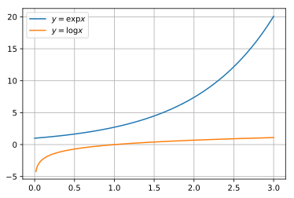
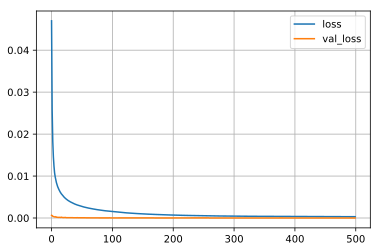

## kerasとsequnece to sequence

前回、LSTMによる実装を行いましたので、次はsquence to sequenceモデルを実装していこうと思います。今現在では、機械翻訳などの自然言語処理では、このsequnece to sequenceとAttentionを基本としたモデルがよく利用されています。BERTなどもAttentionモデルが基本となっています。

ここでは、復習もかねて、基本的なsequnece to sequenceを実装します。$y=\exp x$を$y=\log x$に翻訳するモデルの構築を行います。なお、モデルの詳細は検索すればいくらでも出てきますのでここでは割愛します。文献や教科書、技術者によっては、sequnece to sequenceモデルは、「Encoder-Decoderモデル」、「系列変換モデル」などと呼ばれることも多いようです。

### github
- jupyter notebook形式のファイルは[こちら](https://github.com/hiroshi0530/wa-src/tree/master/ml/lec/text/seq2seq/seq2seq_nb.ipynb)

### google colaboratory
- google colaboratory で実行する場合は[こちら](https://colab.research.google.com/github/hiroshi0530/wa-src/tree/master/ml/lec/text/seq2seq/seq2seq_nb.ipynb)

### 筆者の環境
筆者のOSはmacOSです。LinuxやUnixのコマンドとはオプションが異なります。


```python
!sw_vers
```

    ProductName:	Mac OS X
    ProductVersion:	10.14.6
    BuildVersion:	18G6020


```python
!python -V
```

    Python 3.7.3


基本的なライブラリとkerasをインポートしそのバージョンを確認しておきます。


```python
%matplotlib inline
%config InlineBackend.figure_format = 'svg'

import matplotlib
import matplotlib.pyplot as plt
import scipy
import numpy as np

import tensorflow as tf
from tensorflow import keras
import gensim

print('matplotlib version :', matplotlib.__version__)
print('scipy version :', scipy.__version__)
print('numpy version :', np.__version__)
print('tensorflow version : ', tf.__version__)
print('keras version : ', keras.__version__)
print('gensim version : ', gensim.__version__)
```

    matplotlib version : 3.0.3
    scipy version : 1.4.1
    numpy version : 1.19.4
    tensorflow version :  2.1.0
    keras version :  2.2.4-tf
    gensim version :  3.8.3


## サンプルデータ

サンプル用のデータとして、以下の式を利用します。

$$
encoder_y = \exp x
$$

$$
dencoder_y = \log x
$$


```python
x = np.linspace(0, 3, 200)
ey = np.exp(x)
dy = np.log(x)
```

    /Users/hiroshi/anaconda3/lib/python3.7/site-packages/ipykernel_launcher.py:3: RuntimeWarning: divide by zero encountered in log
      This is separate from the ipykernel package so we can avoid doing imports until


### データの確認

$x$と$y$のデータの詳細を見てみます。


```python
print('shape : ', x.shape)
print('ndim : ', x.ndim)
print('data : ', x[:10])
```

    shape :  (200,)
    ndim :  1
    data :  [0.         0.01507538 0.03015075 0.04522613 0.06030151 0.07537688
     0.09045226 0.10552764 0.12060302 0.13567839]


```python
print('shape : ', y1.shape)
print('ndim : ', y1.ndim)
print('data : ', y1[:10])
```

    shape :  (200,)
    ndim :  1
    data :  [1.         1.01518958 1.03060989 1.04626443 1.06215675 1.07829047
     1.09466925 1.11129682 1.12817695 1.14531349]


グラフを確認してみます。


```python
plt.plot(x, y1, label='$y=\exp x$')
plt.plot(x, y2, label='$y=\log x$')
plt.legend()
plt.grid()
plt.show()
```





```python
from keras.models import Model
from keras.layers import LSTM
from keras.layers import Input
from keras.layers import Dense

n_mid = 20

encoder_input = Input(shape=(n_rnn, 1))
encoder_lstm = LSTM(n_mid, return_state=True)
encoder_output, encoder_state_h, encoder_state_c = encoder_lstm(encoder_input)
encoder_state = [encoder_state_h, encoder_state_c]

decoder_input = Input(shape=(n_rnn, 1))
decoder_lstm = LSTM(n_mid, return_sequences=True, return_state=True)
decoder_output, _, _ = decoder_lstm(decoder_input, initial_state=encoder_state)
decoder_dense = Dense(1, activation='linear')
decoder_output = decoder_dense(decoder_output)

model = Model([encoder_input, decoder_input], decoder_output)
model.compile(loss="mean_squared_error", optimizer="adam")
print(model.summary())
```


```python

```


```python

```


```python

```


```python

```


```python

```


```python

```


```python

```


```python

```

## ニューラルネットの構築

kerasに投入するためにデータの前処理を行い、再帰型のニューラルネットの構築を行います。

構築が終了したら、compileメソッドを利用して、モデルをコンパイルします。compileの仕様は以下の様になっています。

```bash
compile(self, optimizer, loss, metrics=None, sample_weight_mode=None, weighted_metrics=None, target_tensors=None)
```


```python
from tensorflow.keras.models import Sequential
from tensorflow.keras.layers import SimpleRNN
from tensorflow.keras.layers import Dense

NUM_RNN = 20
NUM_MIDDLE = 40

# データの前処理
n = len(x) - NUM_RNN
r_x = np.zeros((n, NUM_RNN))
r_y = np.zeros((n, NUM_RNN))
for i in range(0, n):
  r_x[i] = y[i: i + NUM_RNN]
  r_y[i] = y[i + 1: i + NUM_RNN + 1]

r_x = r_x.reshape(n, NUM_RNN, 1)
r_y = r_y.reshape(n, NUM_RNN, 1)

# ニューラルネットの構築
model = Sequential()

model.add(SimpleRNN(NUM_MIDDLE, input_shape=(NUM_RNN, 1), return_sequences=True))
model.add(Dense(1, activation="linear"))
model.compile(loss="mean_squared_error", optimizer="sgd")
```

投入するデータや、モデルの概要を確認します。


```python
print(r_y.shape)
print(r_x.shape)
print(model.summary())
```

    (180, 20, 1)
    (180, 20, 1)
    Model: "sequential"
    _________________________________________________________________
    Layer (type)                 Output Shape              Param #   
    =================================================================
    simple_rnn (SimpleRNN)       (None, 20, 40)            1680      
    _________________________________________________________________
    dense (Dense)                (None, 20, 1)             41        
    =================================================================
    Total params: 1,721
    Trainable params: 1,721
    Non-trainable params: 0
    _________________________________________________________________
    None


## 学習

fitメソッドを利用して、学習を行います。
fitメソッドの仕様は以下の通りになっています。[こちら](https://keras.io/ja/models/sequential/)を参照してください。

```bash
fit(self, x=None, y=None, batch_size=None, epochs=1, verbose=1, callbacks=None, validation_split=0.0, validation_data=None, shuffle=True, class_weight=None, sample_weight=None, initial_epoch=0, steps_per_epoch=None, validation_steps=None)
```


```python
batch_size = 10
epochs = 500

# validation_split で最後の10％を検証用に利用します
history = model.fit(r_x, r_y, epochs=epochs, batch_size=batch_size, validation_split=0.1, verbose=0)
```

## 損失関数の可視化

学習によって誤差が減少していく様子を可視化してみます。


```python
loss = history.history['loss'] # 訓練データの損失関数
val_loss = history.history['val_loss'] #テストデータの損失関数

plt.plot(np.arange(len(loss)), loss, label='loss')
plt.plot(np.arange(len(val_loss)), val_loss, label='val_loss')
plt.grid()
plt.legend()
plt.show()
```





## 結果の確認


```python
# 初期の入力値
res = r_y[0].reshape(-1)

for i in range(0, n):
  _y = model.predict(res[- NUM_RNN:].reshape(1, NUM_RNN, 1))
  res = np.append(res, _y[0][NUM_RNN - 1][0])
  
plt.plot(np.arange(len(y)), y, label=r"$\exp\left(-\frac{x}{\tau}\right) \cos x$")
plt.plot(np.arange(len(res)), res, label="RNN result")
plt.legend()
plt.grid()
plt.show()
```


単純なRNNだと少しずつずれが顕著になってきます。epochやモデルを改良すればもっと良い結果が出るかもしませんが、復習なのでここで一旦終わりとします。次はLSTMをやってみようと思います。
