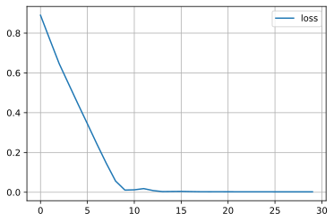

## kerasとsequnece to sequence

前回、LSTMによる実装を行いましたので、次はsquence to sequenceモデルを実装していこうと思います。今現在では、機械翻訳などの自然言語処理では、このsequnece to sequenceとAttentionを基本としたモデルがよく利用されています。BERTなどもAttentionモデルが基本となっています。

ここでは、復習もかねて、基本的なsequnece to sequenceを実装します。$y=\exp x$を$y=\log x$に翻訳するモデルの構築を行います。なお、モデルの詳細は検索すればいくらでも出てきますのでここでは割愛します。文献や教科書、技術者によっては、sequnece to sequenceモデルは、「Encoder-Decoderモデル」、「系列変換モデル」などと呼ばれることも多いようです。

### github
- jupyter notebook形式のファイルは[こちら](https://github.com/hiroshi0530/wa-src/tree/master/ml/lec/text/seq2seq/seq2seq_nb.ipynb)

### google colaboratory
- google colaboratory で実行する場合は[こちら](https://colab.research.google.com/github/hiroshi0530/wa-src/tree/master/ml/lec/text/seq2seq/seq2seq_nb.ipynb)

### 筆者の環境
筆者のOSはmacOSです。LinuxやUnixのコマンドとはオプションが異なります。


```python
!sw_vers
```

    ProductName:	Mac OS X
    ProductVersion:	10.14.6
    BuildVersion:	18G6020


```python
!python -V
```

    Python 3.7.3


基本的なライブラリとkerasをインポートしそのバージョンを確認しておきます。


```python
%matplotlib inline
%config InlineBackend.figure_format = 'svg'

import matplotlib
import matplotlib.pyplot as plt
import scipy
import numpy as np

import tensorflow as tf
from tensorflow import keras
import gensim

print('matplotlib version :', matplotlib.__version__)
print('scipy version :', scipy.__version__)
print('numpy version :', np.__version__)
print('tensorflow version : ', tf.__version__)
print('keras version : ', keras.__version__)
print('gensim version : ', gensim.__version__)
```

    matplotlib version : 3.0.3
    scipy version : 1.4.1
    numpy version : 1.19.4
    tensorflow version :  2.4.0
    keras version :  2.4.0
    gensim version :  3.8.3


## sequence to sequence モデルの入出力データ

最初にsequence to sequence モデルのアルゴリズムの概要と、それをkerasで実行する場合、どのようなデータの入出力になるのかを簡単に説明しようと思います。

### データの入出力のイメージ


sequence to sequence はencoderとdecoderという二つの部分で構成されています。それぞれの部分はRNNやLSTMなどのモデルで構築されます。
このような特徴から時系列データの解析に強く、機械翻訳や音声認識などの分野で利用されているようです。

kerasでseq2seqを実装するには、encoderとdecoderそれぞれへの入力データ（図で言うdataset 1と2）と正解データ（dataset 3)が必要になります。

正解データは、decoderへの入力セットから時系列的に一つずれていることがポイントになります。

以下のサイトを参考にさせていただきました。

- https://blog.octopt.com/sequence-to-sequence/


## サンプルデータ

サンプル用のデータとして、以下の式を利用します。

$$
encoder_y = \exp x
$$

$$
dencoder_y = \log x
$$


```python
x = np.linspace(0, 3, 200)
seq_in = np.exp(x)
seq_out = np.log(x)
```

    /Users/hiroshi/anaconda3/lib/python3.7/site-packages/ipykernel_launcher.py:3: RuntimeWarning: divide by zero encountered in log
      This is separate from the ipykernel package so we can avoid doing imports until


### データの確認

$x$と$y$のデータの詳細を見てみます。


```python
print('shape : ', x.shape)
print('ndim : ', x.ndim)
print('data : ', x[:10])
```

    shape :  (200,)
    ndim :  1
    data :  [0.         0.01507538 0.03015075 0.04522613 0.06030151 0.07537688
     0.09045226 0.10552764 0.12060302 0.13567839]


```python
print('shape : ', seq_in.shape)
print('ndim : ', seq_in.ndim)
print('data : ', seq_in[:10])
```

    shape :  (200,)
    ndim :  1
    data :  [1.         1.01518958 1.03060989 1.04626443 1.06215675 1.07829047
     1.09466925 1.11129682 1.12817695 1.14531349]


```python
print('shape : ', seq_out.shape)
print('ndim : ', seq_out.ndim)
print('data : ', seq_out[:10])
```

    shape :  (200,)
    ndim :  1
    data :  [       -inf -4.19469254 -3.50154536 -3.09608025 -2.80839817 -2.58525462
     -2.40293307 -2.24878239 -2.11525099 -1.99746796]


グラフを確認してみます。


```python
plt.plot(x, seq_in, label='$y=\exp x$')
plt.plot(x, seq_out, label='$y=\log x$')
plt.legend()
plt.grid()
plt.show()
```


### データの準備

kerasに入力するためのデータをnumpy配列に格納します。


```python
NUM_LSTM = 10

n = len(x) - NUM_LSTM
ex = np.zeros((n, NUM_LSTM))
dx = np.zeros((n, NUM_LSTM))
dy = np.zeros((n, NUM_LSTM))

for i in range(0, n):
  ex[i] = seq_in[i:i+NUM_LSTM]
  dx[i, 1:] = seq_out[i:i+NUM_LSTM-1]
  dy[i] = seq_out[i:i+NUM_LSTM]

ex = ex.reshape(n, NUM_LSTM, 1)
dx = dx.reshape(n, NUM_LSTM, 1)
dy = dy.reshape(n, NUM_LSTM, 1)
```

## モデルの構築

sequence to sequenceのモデルをkerasを用いて実装します。
単純なRNNやLSTMとは異なり、モデルが複数あり、それぞれから入力する必要があるため、Sequenceではなく、Modelを利用します。


```python
from tensorflow.keras.layers import LSTM
from tensorflow.keras.layers import Input
from tensorflow.keras.layers import Dense
from tensorflow.keras.models import Model

NUM_MID = 20

def build_seq2se2_model():
  e_input = Input(shape=(NUM_LSTM, 1))
  e_lstm = LSTM(NUM_MID, return_state=True)
  e_output, e_state_h, e_state_c = e_lstm(e_input)
  e_state = [e_state_h, e_state_c]
  
  d_input = Input(shape=(NUM_LSTM, 1))
  d_lstm = LSTM(NUM_MID, return_sequences=True, return_state=True)
  d_output, _, _ = d_lstm(d_input, initial_state=e_state)
  d_dense = Dense(1, activation='linear')
  d_output = d_dense(d_output)
  
  model = Model([e_input, d_input], d_output)
  model.compile(loss="mean_squared_error", optimizer="adam")
  print(model.summary())
  
  return model

seq2seq_model = build_seq2se2_model()
```

    Model: "model_1"
    __________________________________________________________________________________________________
    Layer (type)                    Output Shape         Param #     Connected to                     
    ==================================================================================================
    input_3 (InputLayer)            [(None, 10, 1)]      0                                            
    __________________________________________________________________________________________________
    input_4 (InputLayer)            [(None, 10, 1)]      0                                            
    __________________________________________________________________________________________________
    lstm_2 (LSTM)                   [(None, 20), (None,  1760        input_3[0][0]                    
    __________________________________________________________________________________________________
    lstm_3 (LSTM)                   [(None, 10, 20), (No 1760        input_4[0][0]                    
                                                                     lstm_2[0][1]                     
                                                                     lstm_2[0][2]                     
    __________________________________________________________________________________________________
    dense_1 (Dense)                 (None, 10, 1)        21          lstm_3[0][0]                     
    ==================================================================================================
    Total params: 3,541
    Trainable params: 3,541
    Non-trainable params: 0
    __________________________________________________________________________________________________
    None


## モデルの学習


```python
# 学習用のパラメタを設定します
batch_size = 10
epochs = 20

history = seq2seq_model.fit([ex, dx], dy, epochs=epochs, batch_size=8)
```

    Epoch 1/20
    24/24 [==============================] - 5s 12ms/step - loss: nan
    Epoch 2/20
    24/24 [==============================] - 0s 14ms/step - loss: nan
    Epoch 3/20
    24/24 [==============================] - 0s 19ms/step - loss: nan
    Epoch 4/20
    24/24 [==============================] - 0s 13ms/step - loss: nan
    Epoch 5/20
    24/24 [==============================] - 0s 12ms/step - loss: nan
    Epoch 6/20
    24/24 [==============================] - 0s 10ms/step - loss: nan
    Epoch 7/20
    24/24 [==============================] - 0s 9ms/step - loss: nan
    Epoch 8/20
    24/24 [==============================] - 0s 10ms/step - loss: nan
    Epoch 9/20
    24/24 [==============================] - 0s 17ms/step - loss: nan
    Epoch 10/20
    24/24 [==============================] - 0s 11ms/step - loss: nan
    Epoch 11/20
    24/24 [==============================] - 0s 12ms/step - loss: nan
    Epoch 12/20
    24/24 [==============================] - 1s 23ms/step - loss: nan
    Epoch 13/20
    24/24 [==============================] - 0s 17ms/step - loss: nan 0s - l
    Epoch 14/20
    24/24 [==============================] - 0s 16ms/step - loss: nan
    Epoch 15/20
    24/24 [==============================] - 0s 16ms/step - loss: nan
    Epoch 16/20
    24/24 [==============================] - 0s 14ms/step - loss: nan
    Epoch 17/20
    24/24 [==============================] - 0s 16ms/step - loss: nan
    Epoch 18/20
    24/24 [==============================] - 0s 16ms/step - loss: nan
    Epoch 19/20
    24/24 [==============================] - 0s 15ms/step - loss: nan
    Epoch 20/20
    24/24 [==============================] - 0s 16ms/step - loss: nan


## 損失関数

損失関数が減少していく様子を可視化してみます。


```python
loss = history.history['loss']
plt.plot(np.arange(len(loss)), loss)
plt.show()
```





```python

```

## 予測するためのencoderとdecoderのモデルを返す関数を作成します


```python
def build_predict_encoder_d_model():
  e_model = Model(e_input, e_state)
  
  d_input = Input(shape=(1, 1))
  d_state_in_h = Input(shape=(NUM_MID,))
  d_state_in_c = Input(shape=(NUM_MID,))
  d_state_in = [d_state_in_h, d_state_in_c]
  
  d_output, d_state_h, d_state_c = d_lstm(d_input, initial_state=d_state_in)
  d_state = [d_state_h, d_state_c]
  
  d_output = d_dense(d_output)
  d_model = Model([d_input] + d_state_in, [d_output] + d_state)
  
  return e_model, d_model
```

データを変換するための関数を実装します。


```python
def translate(input_data):
  state_value = encoder_model.predict(input_data)
  y_decoder = np.zeros((1, 1, 1))
  translated = []
  
  for i in range(0, n_rnn):  # 各時刻ごとに予測を行う
    y, h, c = decoder_model.predict([y_decoder] + state_value)
    y = y[0][0][0]
    translated.append(y)
    y_decoder[0][0][0] = y
    state_value = [h, c]

  return translated
```

結果の確認


```python
demo_idices = [0, 13, 26, 39]
for i in demo_idices:
  x_demo = x_encoder[i : i + 1]
  y_demo = translate(x_demo)
  
  plt.plot(axis_x[i : i + n_rnn], x_demo.reshape(-1), color="b")
  plt.plot(axis_x[i : i + n_rnn], y_demo, color="r")
  
plt.show()  
```


```python

```


```python

```


```python

```


```python

```
