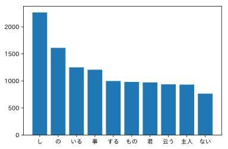
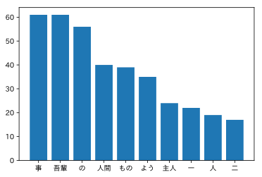
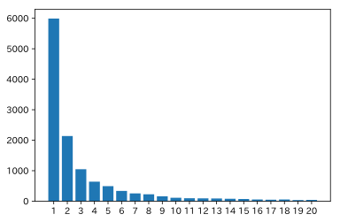
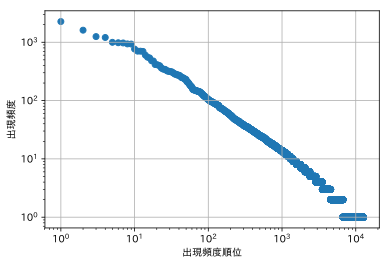

## [第4章 形態素解析](https://nlp100.github.io/ja/ch04.html)
結果だけ載せました。正解かどうかは保障しません笑

### github
- githubのjupyter notebook形式のファイルは[こちら](https://github.com/hiroshi0530/wa/blob/master/src/ml/nlp100/02/02_nb.ipynb)

### 筆者の環境


```python
!sw_vers
```

    ProductName:	Mac OS X
    ProductVersion:	10.14.6
    BuildVersion:	18G95


```python
!python -V
```

    Python 3.5.5 :: Anaconda, Inc.


```python
!bash --version
```

    GNU bash, version 3.2.57(1)-release (x86_64-apple-darwin18)
    Copyright (C) 2007 Free Software Foundation, Inc.


### 共通部分


```python
import MeCab
import re
import collections

%matplotlib inline
%config InlineBackend.figure_format = 'svg'

import matplotlib.pyplot as plt
import japanize_matplotlib
```

### データのダウンロード


```python
!wget https://nlp100.github.io/data/neko.txt -O ./neko.txt
```

    --2020-04-22 13:13:03--  https://nlp100.github.io/data/neko.txt
    nlp100.github.io (nlp100.github.io) をDNSに問いあわせています... 185.199.111.153, 185.199.108.153, 185.199.109.153, ...
    nlp100.github.io (nlp100.github.io)|185.199.111.153|:443 に接続しています... 接続しました。
    HTTP による接続要求を送信しました、応答を待っています... 200 OK
    長さ: 965825 (943K) [text/plain]
    `./neko.txt' に保存中
    
    ./neko.txt          100%[===================>] 943.19K  --.-KB/s 時間 0.1s       
    
    2020-04-22 13:13:04 (8.75 MB/s) - `./neko.txt' へ保存完了 [965825/965825]
    


```python
in_file_name = './neko.txt'
out_file_name = './neko.txt.mecab'
```


```python
mecab= MeCab.Tagger()

with open(in_file_name, mode='r') as f:
  n = mecab.parse(f.read())
  with open(out_file_name, mode='w') as f1:
    f1.write(n)
```

### 30問 形態素解析結果の読み込み
最終的に1分の形態素のリストのリストとなるようにします。


```python
!head -n 5 $out_file_name
```

    一	名詞,数,*,*,*,*,一,イチ,イチ
    　	記号,空白,*,*,*,*,　,　,　
    吾輩	名詞,代名詞,一般,*,*,*,吾輩,ワガハイ,ワガハイ
    は	助詞,係助詞,*,*,*,*,は,ハ,ワ
    猫	名詞,一般,*,*,*,*,猫,ネコ,ネコ


```python
!tail -n 5 $out_file_name
```

    。	記号,句点,*,*,*,*,。,。,。
    ありがたい	形容詞,自立,*,*,形容詞・アウオ段,基本形,ありがたい,アリガタイ,アリガタイ
    ありがたい	形容詞,自立,*,*,形容詞・アウオ段,基本形,ありがたい,アリガタイ,アリガタイ
    。	記号,句点,*,*,*,*,。,。,。
    EOS


最後の一行は除外します。


```python
sentence_list = []

with open(out_file_name, mode='r') as f:
  temp = []
  for s in f.readlines()[:-1]:
    s1 = s.split('\t')
    s2 = s1[1].split(',')
    _dic = {
      'surface': s1[0],
      'base': s2[6],
      'pos': s2[0],
      'pos1': s2[1],
    }
    
    temp.append(_dic)
    
    if s1[0] == '。':
      sentence_list.append(temp)
      temp = []
```

### 31問 動詞


```python
result = []
for sentence in sentence_list:
  for _dic in sentence:
    if _dic['pos'] == '動詞':
      result.append(_dic['surface'])

print(set(result))
```

    {'れれ', '切り刻ん', '抜き', '見当り', '罷り', '剥げる', 'わる', '流行り', '問う', '心付く', '落す', '調子づく', '失わ', 'たくっ', 'かかわら', '押しやり', '容れ', '据える', '能い', '払い', '掛り', '雇う', '這い出そ', '探し', '止め', '覚める', '撲っ', '禁じ', '聞える', 'しきら', '執っ', '過ごす', 'づく', '鳴かせる', 'やっ', '上がん', '下る', '突か', 'とまり', '変り', 'なくなる', '恐れ入っ', '痛め', '有り', 'つく', '試みよ', '舞っ', 'ねじ伏せる', '笑わ', '遺す', '試し', '跳ね', 'こびりつい', '心掛け', '落とし', '欠く', 'つか', '喰っ', '取る', '聞き及び', '救い出し', '渡り', '掻く', '臨む', '飛びつき', '透かし', '疲れる', 'て', 'ふう', 'ぼっ', '見抜い', 'あるか', '略する', 'とまる', '使い', '助け', '捨て', '残し', '焚き', '断わっ', '輝い', '磨き', '帰さ', '重んじ', '沿う', '称する', '逸する', 'こす', 'いやがれ', '離れる', '防ぐ', '打つ', '似', '払う', '問い返さ', '焼か', '供える', '求め', '出来ん', '渋り', '出', '抛り出さ', '悟る', '吸取り', '捕り', '抓ん', '命じ', '着こなし', '打ち明ける', '舐め', '浮き', '結い', 'のび', '棄てる', 'いらせられ', '暮さ', '注ぎ', '残る', '乗り越え', '睡ら', 'なさろ', '解せ', '取り扱っ', '捻る', '罵り', '驚かす', '逢い', '鼓する', '競っ', '写し', '寄せ', 'くっ', '浮べ', 'すわ', '繙け', '懸かっ', 'わかっ', 'いける', '費やし', '書きつけ', '切っ', '見ろ', '怒鳴る', '御し', '出掛け', '納め', '欠き', 'やろ', '掻ける', 'やむを得', '触る', 'もたし', 'かい', '曲がっ', '表し', '着け', 'せら', 'かかる', '見立て', '出直す', '遊ばし', '並ん', '分ら', '叩き付ける', 'まわる', '振れ', 'あこがれ', '売', '震わせ', '這っ', '重んぜ', '弁ずる', '扱か', '突っつい', '要する', 'いか', '垂らす', '沈む', '陥っ', '吐き出す', '掻きむしる', '飲み込む', '鳴き', 'ぬっ', '云っ', '借りる', '歌っ', '枯れ', '怒鳴り', '願い', '遠ざかる', '燻っ', '延べ', '漕ぎつけ', '読みかけ', '並べ', '伺お', 'のせ', '附し', 'つかみ合い', '書き付け', '差しかかっ', 'たれる', '好み', '思い出す', '巡り', '証拠立て', '障ら', '住み込ん', 'におっ', '癒せる', 'ちまい', '砕けよ', '相成', '取り払っ', '引き起し', '引っ張ら', '噴き出し', 'もっ', '呼びかけ', '思い', '忍び', '押し込む', '感じ', '込み', '属し', '戻す', '着く', '生し', '浮く', '退ける', '収めん', '思い出し', '重なる', '分る', '死な', '行く', '絞', '照り付け', '飛ん', '尋ねる', '訴える', '引き込ん', 'もぎとる', '叩か', '受け取ら', '措い', '吊るし', 'たてる', 'いたっ', '上っ', '目する', '間に合わ', '告げん', '失う', '突い', '飼わ', '暮れれ', '醸す', 'ござい', '造ろ', '散らす', '恐る', 'ぼり', 'あまる', 'ひる', '飲も', 'わかし', '出掛けよ', '指す', '磨る', '買お', '脱し', '垂れる', 'はち切れる', '揮っ', '恐れ入ら', '待ち兼ね', 'やむを得ん', '食わせろ', '退', 'ほのめい', '魅入ら', '布か', 'かがやい', 'ける', '握る', 'うく', '分から', 'なれる', '相成り', 'こし', '増す', '就き', 'てっ', 'やけ', '申さ', '枉げ', '寄れ', 'おひゃらかす', '己惚れ', 'はれ', '伝わっ', '得れ', '正す', '飛び上がっ', '向っ', '済む', '召し上がら', '調子づい', '飾る', '追払わ', 'いろ', '抛り出し', '受け取り', '結っ', '買い込ん', '寝ぼけ', '涸らす', 'めで', 'あらわす', 'あ', '睨ま', 'ころがる', '続け', '臨ま', '片づか', '極め', '押し寄せ', '引き寄せる', '乗ん', '立ち寄っ', '追っかけ', '凋ん', '明かし', 'わめく', '変ら', 'しゃべり', '教える', 'すまさ', '置き', '寄こし', '通す', '奪っ', '任じ', '与える', 'なさら', '恐れ入り', '疲れ', '蒸し', 'しかる', '仰', '窘め', '届い', 'ふさい', 'ゆるん', '炊き', '驚きゃ', 'やむをえ', '聞き合せ', 'すう', 'つっ', '暮れ', '通ずる', '評せ', '持て', '弾か', '取り残さ', '抛っ', '干し', '崩れ', 'まえる', '読ま', 'はりつけ', 'ぬすみ', '漲ら', '動ずる', '乗る', '施し', '食わせる', 'ねじり', '感ぜ', '御する', '執る', '逢っ', '食べる', '張り付け', 'こらし', '引き受ける', '熾ん', '忍び込ん', '成れ', '断り', '出来れ', '明い', 'しまえ', '絶つ', '感じる', '思っ', '当る', '極まる', '沁み', '能う', '引け', 'かくす', '降り', '乗せ', '誂え', '略す', '引きつけ', '鳴かし', '衰える', '始め', '務める', '弾ずる', '過ぎ去っ', '漂う', '打っ', '綯っ', '聞きつけ', '改まる', 'かこつ', 'ずる', '云お', '切り上げ', '逃げ延び', '吹き払い', 'のさばり', '据わっ', '断て', 'なぐさみ', '壊し', '笑っ', '見合せ', '渡る', '染み', '改めれ', '切らし', '動き', '揺れ', 'あせる', '溯っ', '乾かす', '引き込ま', '萌す', '真似る', 'ときゃ', '構わ', '読め', '恐れ入る', '引ずり', '犯し', 'やってのけ', '向け', '絞る', 'いざっ', '用いる', '引張っ', '試みる', '失し', 'みよ', '欠い', '叩きつける', '膨らまし', 'なめる', '装い', 'すり', 'どっ', '待つ', '沈み', '片付ける', '差出す', 'やりゃ', '送っ', '取りとめ', '憤っ', '立ち退く', '盗ら', '覗き', '割き', '吹か', '倒れ', 'しゃべら', '留ら', '差し引か', '開け放っ', '詰め込む', '突く', '振り撒い', 'とく', '困っ', 'おくれ', '償わ', '叫び', 'そそのかさ', '起す', '消し', 'むける', '参ら', 'すべり', '示す', '縮め', '向き直っ', 'すくん', '代り', '降っ', '住む', '払え', '応ずる', '吹かし', '訳す', 'はずれ', '重んず', '迎え', 'はいる', 'から', '取り囲ん', '沈めろ', '決し', '耽る', '休み', 'とまっ', 'あけ', '寝そべっ', '保つ', '繰り', '振り', '勧める', '持たし', '比べる', '分捕っ', 'きる', 'わら', '推せ', 'はいり', '立て通す', '載せ', '投げ', '止めよ', '洩らす', '漲っ', 'しめつける', 'ふくらまし', 'あらわれる', 'かおっ', '煎じ', '斬っ', '片付く', '較べる', 'とばす', '取りつい', '潰れる', '持て余し', '奪い合っ', '傾ける', '得よ', '積み', '詰ら', '咎める', '綻びる', 'しごき', '噛ん', '消そ', 'かじっ', '譲ら', '潰せる', 'ひそめ', '取り払わ', '出せる', '重ねる', '招い', '受け合え', '下っ', 'こしらえれ', 'た', '平らげ', '壊れる', 'ちまお', '待ち構え', '処する', '取り巻い', '落ちれ', '取れ', '曲げ', '差し支える', 'き', 'られる', '混ぜ', '見つけ', '預っ', '返り', '述べ', '覗い', 'へい', '散らし', '離さ', '振っ', '行き違う', '込めん', '頼み', '背負っ', '見舞う', '包む', '仰ぐ', '働い', '潜っ', '唱う', '乱れ', 'わかれる', '裂き', 'すくっ', '溜ら', '説い', '押し付け', '集っ', 'よそ', '喰わ', '曝さ', '睨め', '動き出し', '跳ねのけ', 'つぶやい', '痛む', '伺えれ', '寄り', '歩く', '引っ張る', '呑み込ま', '括っ', '布く', '作る', '惚れる', '巻き込ま', '仕上がっ', 'くだけ', '違い', 'させる', 'ゆるめ', '切ら', '追い出さ', '上がる', '届く', '勧め', 'せろ', '関し', '過す', '促し', '攻め', 'たたく', 'くばり', '話せ', 'つけ込ん', '気に入る', 'あきれ', '拗じ', '立っ', '突こ', '出る', '放と', 'やれ', '擦る', '生える', '迷わさ', '飛ばし', 'ぶら', '浮い', '立ち上がる', '迷い込ん', '利く', '売れ残っ', '考え付い', 'からかわ', 'さしゃ', '寝込ま', '分ける', '下さい', '戻る', 'こぼし', '通う', '破ら', 'なりゃ', '返', '下ら', '疑っ', 'ひっくり返し', '持ち', '離す', 'そい', '重んずる', '憤', '吐か', '考え込む', '足りん', 'かせ', '栄え', '叱りつけ', '役に立つ', '堪り', '悩み', '詫び入る', '雇わ', 'とち', 'あたわ', 'はらっ', '蒔き', '籠る', 'はちきれん', '撞く', '痛み入る', '据え', '見廻す', '押し返し', '奏する', '云え', '乗り出す', '滑り込む', '靡く', '殖えれ', '名づけ', 'のぼる', '打ち消す', '生れ変っ', 'っ', '曝し', '応じ', '追付こ', '衝く', '登り', '考え直し', '欲する', '返さ', '肥っ', '騒ぎ立てる', '下がれ', '貼っ', 'あい', 'あやまっ', '這出', '装っ', 'きれ', 'あらわし', '脱ぎ', '蓄える', 'しかっ', '入れよ', '磨り', '観', '衒い', '使わ', '申し渡し', '罹っ', '起き直っ', 'かため', '限ら', '蹴ら', '妨げ', '担い', '合う', '仰ぎ', 'いがみ合い', 'いっ', '貪る', '陥る', '兼ね', '洩らし', '聞き糺し', '聞き返す', '舐める', '引き抜く', 'がる', '帰ろ', '言い', '生き返る', '寄り付く', '暮らし', '漏る', '行き過ぎよ', '開く', '違わ', '滑っ', '買い被っ', 'はおら', 'とりゃ', '引き', '透き', 'たどっ', '敷き', '割っ', '価する', '踏み', '縛ら', '飛ば', '借', '縫いつけ', '復する', '繰返す', '見違える', '抱え', '祝し', '頼も', '透し', 'しよ', '振り翳し', '契っ', '聞きゃ', '崩し', 'のしかかっ', 'いいかね', '起きる', '釣れ', '劣っ', '弄する', 'ぶ', '採る', 'さめ', '振りかけ', '飛び上がる', '抗する', '超し', '這入ら', '動じ', '動け', 'きい', 'ふるえ', 'すい', 'こうっ', '名乗っ', '捩じ', '慮', '禿げ', '戒め', '知り', '及ぼし', 'いわ', '傾い', '映ずる', '減ら', 'かしこまっ', 'ごまかす', '示し', '劃し', 'いじっ', '吐き', 'むけ', '停', '掘っ', '裏返し', 'もぐり込ん', '汚す', '於け', '上がれ', '巻き付け', '飲み込め', 'きか', '寄りつい', '泣く', '似合う', '仕', '見積っ', '待っ', '云わ', 'あつかい', '片付い', 'はなち', '差し', '買う', '翻せ', '伝わる', '近寄り', '乗り', '見つかっ', '起り', '帰っ', '居り', '窮する', '懸る', '合わ', 'いやがる', 'からかっ', '話そ', '冒し', '洩らさ', '見受け', '踏ま', '見て取っ', '取り留め', '引き返す', '直っ', 'くれれ', '図ら', '捏ね', '使っ', '間に合い', '服せ', '引き受け', '忘れ', '悟り', '頼ま', 'うなされる', '醒ます', '使い分け', '張れる', '掬い', '行きゃ', '遊ぶ', '滅す', '振り立て', '訴え', '見透かさ', '蹴返す', '真似', 'あつまる', 'あいかわら', '目ざす', '突っ伏し', '溜め', 'なれ', '喜ぶ', '病ん', '究めよ', '病み', 'ふくれ', '害し', '落ちる', '進める', '廻る', 'かしこまる', '滑る', '助から', 'やれる', '飽き飽きし', '移っ', '並みいる', '溶かし', '持ち上がる', '拭き込ん', '彫り', '焦', 'ふい', '遊ば', 'たまる', '廻す', '充ち', '見廻っ', '焦る', 'とりとめ', '折ら', 'せり出し', '間に合っ', '具え', 'せまら', 'ひく', 'まかり間違っ', '入れる', '悟れ', '合せ', '伺う', 'ふむ', 'よせ', 'ふれ', '働け', '襲う', '発し', '呼び立て', '奉', '出さ', '聞え', '見識張っ', '見離さ', 'つまみ出さ', '称せ', '還す', '説き', '食み出し', 'つとめ', '丸め', '面し', '集め', '使お', '洗っ', '立た', '落ちつけ', 'してやろ', '突き戻す', 'しく', '重なっ', '這う', '横切っ', '洒落れ', '勤まる', 'すて', 'ころばし', '任せ', '願う', '持ち出し', '繰り返す', '貪', '積ま', '絶っ', '鳴か', 'はね', '待ち受け', '捕まる', '這入っ', '書きゃ', '睨み合っ', '垂れ', '放り込ん', '読む', '罵っ', '終る', '争っ', '動かし', 'おる', '嘲', '吹い', '切れ', '割い', '拝む', 'すれ', '提げ', '釣り込ま', '睨みつける', '構える', 'さ', 'つくす', 'や', '張付け', '載っ', '近づき', '生ん', 'もらえ', 'よべ', 'かねる', '生やし', 'もてなす', 'たらし', '描く', '逃げ出す', 'じみ', '祟り', '出よ', '逆立て', '好か', 'あう', '怪しん', '張りつめ', '進も', '記さ', '奉じ', '眠れ', '属する', 'おっしゃる', '択ば', 'かわし', '押し出し', 'ほめ', 'あしらっ', '惹い', '浸ら', '飛び越える', '躍り込ん', '盗ま', 'よそい', '困ら', '脱ぐ', '踊ら', 'こたえる', '乗り出し', '勤まっ', '流れる', '押し通す', '近づく', '明け放し', '殺し', '着せ', '及ぼ', '期す', '見習お', 'おい', '叩い', 'つけよ', '懸っ', 'まします', '知れ', '弾け', '選ん', '思い込ん', '張れ', '変りゃ', 'もらっ', 'ちまう', '聞こ', '引き上げ', '出逢え', '従え', '起ら', '見下し', 'かきまぜ', 'か', '為し', '釣っ', 'はぐっ', '飲ん', '釣り合う', '届か', '承っ', '変ずる', '嘆ぜ', '捲い', 'かむ', 'とき', 'やめ', '仕立てる', '嚇し', '食お', 'あける', 'じらせる', '引っ掻い', 'まぜ返す', '推し', '陥れる', '見向き', '突き通し', '誇る', '下り', '絞め', '逃げ込む', '見かね', '干', '移ら', '気に入り', '考え出す', 'どい', '付けよ', '捲か', 'やれん', '作っ', 'かぶせ', '証拠立てよ', '足る', 'ねじ上げ', 'ぬかり', 'ぬけ', '産まれ', '折れん', '知らせ', '振い落す', 'どやし', '読ん', '背く', '目立っ', '自惚れ', 'つき', '省い', '捕える', 'まぜ返し', '見せろ', '言いつけ', '申し込む', 'おいたっ', '甘んじ', 'しゃがん', '揉み', '向わ', '果さ', '暮す', 'やって来', '見出す', 'もらお', '這入れ', 'しまお', '忌む', '聞かさ', 'しら', '列ね', '寝転び', 'わから', '吹き付ける', 'づい', '瘠せ', '潜れ', '始まら', 'ならん', '着か', '罵', 'たなびき', '信ずる', '図抜け', '迷っ', '流し', '登っ', '突き当っ', '蒙', 'かえる', '極まっ', '勝た', 'ずれ', '泣かし', 'れ', '跳ね返る', '合わせ', '這入', '損する', 'ぶら下がる', '致す', '律する', '噛む', '売っ', '営む', 'あてがう', 'がら', '気がつか', '舂き', '歴', '騒ぎ立て', '洩る', '消え', '取り', 'つづい', '有ろ', '気に入ら', '心得る', '減っ', '填め', '突っ込ん', '済ませ', '巻く', '試み', '叱', '喜ん', '真面目くさっ', '講ずる', '給う', '有する', 'え', '抜く', '割り込ん', '生れる', '見習う', 'やっつける', '直す', 'なさ', '生れれ', 'あつまっ', '結ん', '素っ破抜く', 'あるい', '泊っ', '突き飛ばし', '解き', '割る', '並べる', 'れりゃ', '呼ばわり', '突き合せ', 'あてつける', '見せびらかす', '弾きゃ', '押しかけ', '話しかける', '引き立た', 'くれろ', 'よれ', '下ろし', 'うけ', '運ん', 'あぶり', '引っ掻き', '暮れる', '答え', '逐っ', 'わける', '正し', '見逃し', '障る', '頼ん', '取れれ', '躍っ', '投げ込む', '忍び込む', 'かから', '添え', '濁っ', '察し', '教えろ', '戦っ', 'けれ', '群がる', 'やる', '住め', '拝する', '書い', 'つづける', '踞っ', '称え', '眺める', '分っ', '浸す', 'つめ', '奪い', 'ありゃ', '富ん', '守ら', '嗅い', 'きかかっ', 'よら', '放り出し', '立ち上がっ', '亡くなら', '傭う', '塗りつけ', '断わる', '結べ', '捕え', '破', 'つける', 'だまる', '来たし', '立ち至り', '引っ張り', '鳴らさ', '思いやら', '降さ', 'おっしゃっ', '埋', '起き直り', 'さし', '致さ', 'すべっ', '廻り', '読み出し', '授ける', '利かす', 'あやまれ', '登ら', 'こい', '知らし', '好ま', '燻り', '話す', '詠ん', '引きずり出し', '流れ', '滑', '打ち殺す', '取り寄せ', '下され', '逃げる', '見つかり', '恋い', '入る', '引き付け', '持つ', 'あばれる', '蒙っ', 'おれ', '見届け', '張り切れ', '撓る', 'フケ', 'うかがう', 'けりゃ', '話さ', '揚げ', '助かり', '化す', '通せ', '阿', '捕れる', 'しまい', '折れろ', '浮ぶ', '組み合せ', '尋ね', 'やり直す', '負え', '冷かし', '暮し', '抛り出す', '略し', 'かしこまり', '懸ら', '覚っ', '避ける', '反り返っ', '誂える', 'ぱくつく', '払わ', '確かめ', 'さておい', '捕ら', '懲り', '嵌っ', '召し', '削る', '怒り', '切り付ける', '叱りつける', '上ら', 'たべる', '抱い', 'のぞく', '脱する', '画い', 'つれ', '討と', '断わり', '使える', 'はっ', '動こ', 'くずれ', '陥れ', '垂れん', '上げよ', 'あせっ', '添える', '掛っ', 'ととのっ', '真似れ', '向か', '笑える', '立ち行か', '張り', '奉る', '分け', '見上ぐる', 'ほ', '余す', '熱し', 'くう', '願お', '用い', '去る', 'ち', '潰し', 'なさる', 'やっつけ', '恨む', '収める', '見張っ', 'ささ', '着る', '死ん', '見せよ', '得ろ', '歩み寄っ', 'だまさ', '消え失せ', '分りゃ', '見くびら', '途切れ', '出向い', 'うる', '懸け', '殺せ', '就く', '起っ', '飛び下りる', '引込ん', 'くぐっ', '造っ', '見合わせ', '愛し', '弾き出す', '守っ', '立ち去っ', '係わら', '告げ', '越し', 'かよう', '足ら', '拭い', '引き取っ', '下せる', '参ろ', 'のめり', '悟っ', 'もし', '達し', '生かし', '入り込み', 'ゆき', '振り落とそ', 'のむ', '臭え', '誘わ', '書き流し', '捲く', 'おき', 'まじない', 'ぐれ', '置く', '載せる', '設け', 'うかがっ', '付か', '下がろ', '気がつい', '下し', '儲かっ', '交ぜ', '口走る', '責める', '埋っ', '腐っ', '仕ら', '計っ', 'せき込む', 'せよ', 'ぬか', '優っ', '出張っ', 'あたら', '鳴り', '転がる', '持ちかけ', '与', '忍ばし', '遣', 'かきつけ', 'ぱちつかせ', 'もらう', '穿っ', 'のぼら', '聴い', 'だい', 'み', '飛び出す', '償お', '突き', '纏める', '寄っ', '踏み込む', '振い落し', '点じ', 'いう', '攫み', '困り', '持ち上げる', 'つかし', 'さげる', '散る', '窶す', 'なされ', '飲む', 'こすっ', '充たさ', 'いりゃ', '冠せ', '叶っ', '引きあげる', 'まがっ', 'いる', '嘲り', '飛込め', '持て余す', '吸い出し', '引っ繰り返し', '尖ん', '割り込む', 'しから', '忍ば', 'ほのめかし', '呼ん', '上げる', '可愛がら', 'わす', '掘り', 'ねだん', '着', 'そろ', 'くるみ', '留まっ', '扱が', '太れる', '絞める', '印せ', '捧ぐ', 'よむ', '見出し', 'くらむ', 'ごまかし', '避け', '変っ', 'とる', '極める', 'やってのける', 'どく', '寝よ', '食わ', 'むく', '棄て', '言い付け', 'こぼれ', '去っ', 'ききつけ', '当ら', 'より', '引き下がる', '許し', '貰う', 'あつかう', '放', '比べ', '起る', '帰り', 'どき', '張り詰め', '仕損じ', 'おこせ', 'ほめる', '捨てる', '伺い', '取ら', '残ら', '司', 'しかけ', 'からまっ', 'ひやかし', 'かん', 'まする', 'れろ', '分', '行こ', '侵し', '引き摺り込ま', '承ら', 'あく', '湧き出', 'ひねくる', '見下ろし', '作り', '吐い', 'やめる', '照らさ', '放っ', '占め', '押し込め', '怠っ', '解し', '歩き', 'ひ', '泳ぐ', '下さっ', '控える', '仰せ', '移す', '乗り越える', '引き払う', 'かたどっ', 'しなび', 'ほてっ', '歩い', 'もぐり込む', '至る', 'かざら', '這い出し', '訪う', '擦り', 'だまっ', '誤', 'かる', '役に立た', 'すぼめる', '出直し', '作ろ', '延びる', 'ひねくっ', '被れ', '代え', '已めろ', '畳む', '羨ま', '思い切っ', 'れよ', 'なる', '考える', 'のみ', 'たつ', '表わし', '呈し', 'ねばり', 'られ', '連ね', '手こずっ', '死に', 'あつめ', '進ん', '寝つか', '下さら', 'おっしゃれ', 'ゆ', 'よそう', '追いかけ', '始める', '憤る', '引き戻し', 'ごろつい', 'もぐる', '見よ', '向く', '焦っ', '引き返し', 'しつけ', '切り抜けよ', '落ち着く', '来ん', '見て取る', '拡げ', '誘う', '引い', 'あき', 'しめ', '満ち', '諦め', 'もがけ', '聞く', '思え', '取りあげ', '戴く', '云い', '命ぜ', '退い', '値する', '敗れ', '成し', 'まくっ', 'いこ', '煮', '覚め', '呑ま', 'しまわ', 'かえし', '放し', 'しゃべる', '堪え', '焦れ', '押しつける', '終っ', 'なげ', '入り乱れ', '潰れ', '備われ', '残っ', '異な', 'やん', '潜り込ん', '添う', '蒙ろ', '終', 'おっ', 'す', '済し', '凝らし', '光る', '演ずる', 'ゆく', '見渡し', '使いこなせ', 'ぶらさがっ', '飲ま', '引きずっ', 'せる', '破れる', '乗じ', '仕入れ', '感ずる', '咲い', '溜まっ', 'ひろげる', 'おどかさ', '儲け', '吐き出し', '這い出す', '習お', '散っ', '通る', '化ける', '付き添う', '行ける', 'してやる', '適する', '解い', '破る', '亡くなっ', '取り殺し', 'たたる', '引っ込ん', '聞け', 'ござっ', '消え去っ', '受取る', '申し込も', '張り上げ', '間に合う', 'つかえる', '更け', '復し', '祝う', 'あがり', '唸っ', '較べ', '響き', '撲', 'こか', '切り', '拱い', '食える', '詰め込ん', 'とぼけ', '困りゃ', '推す', '捌け', '呑み', '聞き合わせ', '押し出す', '掠め', '融け', '務まる', '申し込ん', '腐る', 'ぶら下げ', '固まっ', '届け出る', '呑み込ん', 'やってくる', '仕る', '騒が', 'まつわっ', 'おか', '見え', '尽き', 'すら', '貪り', '許さ', '騒ぐ', '払っ', '留まり', 'しょ', 'くる', '抜き取っ', '言い放っ', '擦っ', '縫っ', 'すかし', '兼ねる', '彩っ', '出せ', 'ござら', '振る', '凝らす', '亡ぼさ', '測る', '張れれ', 'はいっ', '結え', '飛び降りる', '起きろ', '置か', '承る', '焼け', '許す', '雇っ', '制する', '切り落し', '通っ', 'のしかかる', '考え', '取り去る', '候え', '転がっ', '暮らさ', '解する', '破っ', '気に入っ', '書か', 'つかまえ', '流れ出し', '責め', '来よ', 'とおっ', '浮かれ', 'はずす', '眠っ', 'ふくらし', '描き', 'じらし', '死ぬ', 'かれ', '初める', '見つめ', '与っ', '乗りゃ', '慕っ', '逃げ', 'やられる', '受け合わ', '行き', '綴っ', '擦り付け', '浸っ', '擦り切れ', 'しつくし', '読める', 'まし', '打殺さ', '釣れる', '聞か', '答える', 'あか', '包み', '近付く', '吹きかける', 'なぐりつける', '迷う', 'はいら', 'むき出し', '出す', 'しる', '習う', 'きっ', 'ゆす', '盛り込ま', '叩く', 'で', '数え立て', '磨っ', '喰う', '聞き', '撫で', 'くれ', '見上げる', 'たたき', '通さ', '起せ', 'よごれる', '来ら', '春めい', '留める', '謡わ', '申し立て', '押し込ん', '当て', '寄せる', '掛ける', 'たで', 'くりゃる', 'しまう', '練り', '聞こえよ', 'ならべる', '掻か', '近づい', '片づい', '保と', '窺う', '飛び込ん', '張ら', 'とり', '能わ', '余る', 'やら', '受け取れ', 'くらす', 'ぬくもっ', '納まり', '突きつけ', '洗い', '冷やかし', '打ちゃ', '寝込ん', '逝い', '浴びる', '中る', '酔っ払っ', '悲しむ', '言わ', 'られれ', 'つけ加え', '減る', 'なで', '撓め', '縊れる', 'こん', '吸い取ら', '起そ', '蘇', '思い立ち', '違う', '滑れ', '誘っ', '張る', '翳し', '斬り', 'まっ', 'うたっ', '達する', '咎めん', '在り', 'なさい', '撚り', '果せる', '荒立て', '授け', '惹く', '択ぶ', '仕切っ', '書く', '取払っ', '判ぜ', 'ためし', '飛込ん', '探', 'すぎ', '叶わ', '応える', '削っ', '抑え', '見せびらかし', 'さえ', '迎える', '降る', '絶え', 'いつく', '引っ張っ', 'すん', 'すぎる', '去ら', '合せる', '断わら', '計る', '買え', '生え', '休ま', '重ね', 'さばけ', '凌ぐ', '召し上がり', '包ん', 'すむ', '聳やかし', '接し', '鳴', '振り上げ', 'すま', '尽くさ', '障', '寝', '飛び上がろ', '受け合う', '亡くなり', '気づかい', '越える', 'つき合わ', '呑ん', '塞ぐ', '差支え', '伺っ', '知れ渡っ', 'あてこすり', 'あきらめ', '掘り出す', '画き', '転がり', '聞き返し', '寝転ん', '起つ', '明け', '笑い', 'やみ', '入っ', '頬張っ', '越さ', '比し', '凹ん', 'からげ', 'いよ', '惚れ込ん', 'からかお', '死す', 'しでかす', '打ち落す', '狂わせ', '吸っ', '鳴らす', '戴い', '圧し', 'いけ', '湧き出る', 'せ', '滅する', '交ぜ返す', '削り取ら', 'ここ', '数え', 'うめろ', '威張っ', '繰り返さ', '周章てる', '切り開い', '抜か', 'くずさ', '乗っ', '怪しま', '含める', '糺せ', '続く', '挿し', '振り返る', 'とろ', 'なん', '出合っ', '彫っ', 'たまり', '優る', '入れ', '被っ', '清め', '問いかける', '触れ', '見詰める', 'たべ', '過ぎる', '舞わ', '驚き', '取っ', '捻っ', '拾っ', '思わ', '苦しん', '投ぜ', 'てりゃ', '隔て', '出会わ', '構っ', '目だた', '晴れ', 'さまし', '果す', 'ぬい', 'いやし', 'はおり', 'われ', '通そ', 'わかる', '痛み', '打ち出し', '卸し', 'してやれ', '曲っ', 'うつし', '恨も', '悔やん', '加える', 'たぎり', '照らし', 'ならべ', '申し聞け', '稼い', '飛び越え', '増し', 'つくろっ', '迂', '割り切れる', '上げ', '掻き', '崇め', '吊ら', '飾り付け', '載っけ', '蒔い', '交ぜ返し', '洩り', '有りゃ', '尽し', '惚れ', '中っ', '当っ', '号する', '踊り', '腐れ', 'よん', '揉ま', '加わっ', 'おっしゃら', 'なりすまし', '出逢っ', 'いたす', '望ん', 'あばれ', '近付い', '間違っ', '嘯い', '留め', '与えん', '光らし', '顧み', '着こなさ', 'わかり', '終え', '組ん', '食っ', '追い廻し', '転がれ', 'あらそう', '進む', '奮っ', '流行っ', '通り抜けよ', '語ら', '廻し', '乗り越す', '養う', '除け', 'あやまる', 'たかる', '飛び下り', '立ち行く', '通り掛っ', '悟ら', '馴らし', '除き', '知れる', '捉え', '煙り', '押す', '曇っ', '聞き分ける', '忍ん', '見送っ', '暴く', 'せしめ', 'つまむ', '振ら', '気が付く', '写せ', 'ふかす', 'なっ', '廃せ', '解く', 'やき', '分れ', '射る', '読み', '叫ぶ', '変え', '省け', '吹き出す', '狭め', '問い', '立ちすくん', '反し', '寝ころん', '問い掛ける', '教わっ', '嫌っ', '撃ち', 'ちゃい', 'なり', '送', '苦しむ', '越す', '積み込ま', '達せ', '燃え', '挟む', 'じゃらし', '擦', '合い', 'ぶらさげ', '追払っ', 'れる', '見捨て', '起き', 'くるん', '論ずる', '反っ', '扱き', '込ん', '接い', '浮ば', 'かく', 'なわ', '切り抜ける', 'しめる', '食い込ん', '厭き', '殺す', '叫ん', '行き詰る', 'つまみ出す', 'ととのう', '取', '損なっ', '降ら', 'つくばい', '来れ', '知ろ', '断っ', '押しやる', '遊び', '広げ', 'すくい', '及ば', '据え付け', '取り違える', 'よこし', '薫ずる', 'からかう', '仕込む', 'おける', 'いら', '冷え', '売る', '凌い', '吃', '働く', '縺れ', 'おろす', '廻っ', 'あら', 'とっ', '仕り', '焦げ', '怒る', 'はす', '覚ます', '引っ掛け', '躍ら', '言い兼ね', '問わ', '奪わ', '疲らし', '言い触らす', '捕まっ', '驚い', '隠す', '言っ', '盗ん', '渡っ', 'い', '畏まっ', '見上げ', '叩き込み', '徹っ', 'あびせる', '続い', '拾い', '改める', '来し', '傾く', 'がっ', 'かさね', 'おく', '足そ', 'たのま', '帰る', 'してやり', '踞る', '誘い出し', '糺し', '聞こえ', '向き直る', '潰す', '述べる', 'たけ', '遊ん', '存する', '焼い', '痛み入っ', '踏み付け', '損じ', '揉ん', '渡す', '込める', 'おっしゃい', 'つん', '映じ', '浴びせ', '光り', '寝つき', '詫び', '着せる', '振り向い', 'かま', 'いただか', '曲がろ', '屠ら', '焦がれ', '争う', 'あて', 'しゃくい', '名乗る', '講じ', 'よみ', '引き裂い', 'かこう', '含ん', '帯び', '聴き', 'わく', 'ねぼけ', '慰む', 'くらし', '差し込む', '誘い出す', '失っ', 'まて', '気が付い', 'あび', 'くれる', '下さる', 'つづけ', '驚く', '吐く', 'きく', '思い立っ', '分かる', '失する', 'くべる', '填める', '通り', '及ぶ', '察せ', '負っ', '与え', '聞き出し', 'ぬける', '栄える', '潰そ', 'ふり', '張り付ける', 'がす', '這入ろ', '焚く', 'つづき', 'はなす', '飛び', '呼びつけ', 'づけ', '窶し', 'なす', 'もらい', '待て', '逆上せ', '見棄て', 'いただき', 'かえ', '余っ', '行け', '踏み込ん', '頼む', '平伏し', '握ろ', '行っ', '抜こ', '含まっ', '焚け', '回っ', '罵る', '因っ', '結う', '酬い', '踏む', '貰わ', '思い出せ', '対し', '担ぎ出す', '失せ', '在っ', '錬', '有し', '苦しめん', '乗り込ん', '演じ', '蒙り', '読み出す', '転げ落ち', '差し出す', '刺し通し', 'とまら', '失せる', '思いつい', '割り出し', '罹る', '外し', '滞り', 'だし', '着い', '窺っ', '書き', '見下せる', '圧さ', '聞かし', '寝る', '話せる', '買い', 'ふざけ', 'いらっ', '経っ', '愛する', '当り', '遺し', '心得', 'さり', '寄りつか', 'わか', 'ふかし', '挟ま', 'ふわ', '吹き込む', '駆ら', '急き込ん', '持た', 'ひやかす', '明け放っ', 'いそが', 'すっ', '焦れる', '流れ出す', 'とん', '合っ', '候わ', 'くん', 'らっしゃい', '見縊', '打ち抜い', 'つかん', '追い込ん', 'しくじっ', '負け', '換え', 'こびりつく', '綴る', '研ぎ', '呑む', '立ち上っ', '参り', 'ござる', '構え', '借り', '売り捌い', '変じ', 'ころがり', 'あらわ', '込め', '呼ば', '交わし', '切り抜か', '整え', '食え', '恐れ', '鳴る', 'かろ', '蹶', '畳ん', '留っ', '崩れる', '打た', '片づけ', 'はみ出し', 'しらべ', 'まかり', '係わる', '立ち上る', 'しめん', '云う', 'かくれ', '済み', 'かき', '笑う', '冷め', '認め', '掛れ', '弾く', '伝っ', 'そり返っ', '引きずり', '閉じ', '出会っ', '飛び出し', 'しかめ', '差し支え', 'なやん', 'つまん', 'そらす', '貰い', '帰そ', '砕ける', '立つ', '布い', '磨り潰し', '心付か', 'しっ', 'うなら', '世帯染み', '解さ', '足し', '喫せ', '見える', '貰お', '光っ', '感じ入っ', '掛る', '差し出し', '寝過ごし', 'いり', '描い', 'ひっくり返っ', 'つまら', '倍し', '挑む', '給え', '溯ら', 'しまっ', '刻み', '有ん', '湧い', '思う', 'うたう', '受ける', '突き立て', '有す', '書き立て', '擲つ', '志す', '思い返し', '追いやっ', '捕っ', 'こぼす', '整っ', 'とりのけ', 'こきゃ', '浴び', '戻ら', '取り出し', '痛ん', '懸り', 'しい', '飛び込ま', '踏ん', 'なか', '惹か', 'たとえ', '陥ら', '急い', '浮き出し', '片付け', '殖え', '弾い', '手伝っ', '追いつく', '取り払う', 'すまい', 'しかり', '来', '喩える', 'やま', '気取っ', '注い', '上る', '通じ', '上り', '磨く', '貰え', '勝つ', '嵌め', '期し', '開け放し', 'れん', '食い', '返し', '守る', 'こなし', '直ら', '飛び込め', 'じれ', '相成る', 'からん', '起こそ', '休ん', '誓っ', '縮まる', '上がっ', '茂っ', '繰り返し', '集まっ', '負ける', '写し出す', '近寄る', 'やむ', 'ふて', 'くば', '反り', '取上げ', '落ちつか', '履い', '被る', '念じ', '調べ', '問い返し', '売り', 'ちまっ', '見る', '追え', '立ち退き', 'いつわり', 'ぶんなぐる', '引込め', '為す', '明けれ', '怒鳴っ', '申し上げ', '登る', '見詰め', '出掛ける', '背い', '捧げ', '届け', '無くなっ', '恐', '追い', '通れ', '嗅ぎ', '懸かり', '飲み干し', '逆らわ', '指し', '鳴っ', '持ち上がっ', '聳え', '伏し', '語る', '詰まら', 'あずかり', 'あばか', '籠っ', 'おっしゃろ', '返る', 'かくし', '見おろす', 'ふる', '小突き', '着ける', '引張る', '打ち殺し', '受合っ', '運ぶ', 'しむ', '好い', '祈ら', '濡れる', '撚っ', '起し', '覚まし', 'すみ', '飛び込も', '剥がれ', '入ら', '古る', '抓み', '静まり返っ', '飾っ', 'あらわれ', '使え', '休む', 'こ', '引越す', '吸い', '浮かれ出す', '障っ', 'むすん', '現われる', 'あろ', 'させ', '開け', '放つ', '気に入れ', 'もぐっ', 'なろ', 'かい出す', '企て', '張り込ん', 'あれ', '及ぼす', '連れ出し', 'でる', 'られん', '盗む', '申し', '損なう', '振り向く', '仰向き', '折れる', '追い出し', '教え', 'ゆか', '行う', '除い', '記し', 'こぼれ落ちる', 'あるき', 'つくっ', '通り越し', '利かし', 'ふ', '及び', 'あるけ', '取れん', 'あたっ', '魂消', '遠のい', 'すり抜け', '眩む', '付ける', '釣ら', '寄り添う', '勝と', 'ざんす', '下げ', '連れ添う', '造る', 'る', '考えつい', '翳す', '出れ', '遂げ', '躍る', '滑らし', '這入り', 'ごねる', '来っ', '売り飛ばし', '引き上げる', '直そ', '取りはずす', '遣っ', '見廻し', 'いじめ', '陣取っ', '弾こ', 'ともり', '移し', '評し', '欠け', '諦める', 'やり過ごし', '飲み下し', '見計らっ', '廻さ', '砕け', '許せ', '伝える', '飛びつい', '鳴く', '作り上げ', '寝かさ', '焚い', '浴びせかけ', '吹きかけ', '縛せ', 'つつま', 'く', '通り過ぎる', 'あぶら', '取り合わ', '汚れ', '気が付か', 'とれる', '通り過ぎ', '忘れる', '交っ', '甘える', '飲み', '明か', 'すき', 'なすっ', 'つら', 'とろけ', '異なる', '舞い込ん', '落し', '止す', '叩き', '尖', '動かす', '鑑みる', 'みん', '支え', '衰え', 'ひねくり', '祝い', '存じ', '凹まし', '消える', 'もとづく', '掛', '敷か', '吹き込ん', 'からかい', 'よる', '担が', '聞き惚れ', '途切れる', '計り', '使う', 'かね', '引き続い', 'とめ', '終り', '考え出し', '問い返す', 'きら', '済ます', '加え', '併せ', '魂消る', '仕ろ', '担ぐ', '騒ぎ出す', '伝え', '写っ', 'はじめる', '付け', '抱え込ん', '直さ', '狼狽え', '懸', '弱ら', '得ん', 'つづか', '過ぎ', 'えん', 'かぎっ', '立てる', '究め', '受合え', '化け', '欺く', '有れ', '滑ら', '揃え', '祟っ', '取り合せ', '連れ出さ', '強い', '刺し', '潜り', '通ら', '蔽う', 'しろ', '感じ入る', '離れ', '携え', 'せい', '寝かし', '労する', 'どやさ', '制さ', '初め', '濁す', '生ぜ', '過ぎん', '砕い', '待ち合せ', '開ける', '入れ違い', 'すまし', '打ち', '直る', '勝る', '挙げる', '降り込ん', '得る', 'され', '構う', '始まっ', '譲っ', '剰', '逃がす', '溺れ', '放さ', '知る', '期する', '盛っ', '押し', '坐る', '褪め', '描き出さ', '施す', 'きつける', 'もったいぶっ', '突き出し', '生きる', '坐り込ん', '持っ', '買わ', '縫う', '踏切り', 'いん', '有っ', '洒落', '下がっ', '降りる', '追い詰め', '隠れる', 'くらべ', 'のろけ', '気がつく', '違っ', '聞い', '撚', '下れ', '結び付け', '坐', 'あらし', '見馴れ', 'し', '分り', '見付け', '打ち立て', 'きせ', '勤め', '掻い', '踏み出せ', 'いい', 'おら', 'いいかえ', '洩', 'したがっ', '消す', '撮っ', '挟ん', '余ら', '力め', '揚げる', '関せ', 'おどる', '立ち入っ', '来たそ', '捲き', '折る', 'あげ', '劣ら', '取り上げ', '送れ', '殺さ', '乞わ', '延び', '醒め', '繋が', '黙っ', '事足る', '羨む', '流れ込む', '見廻', '驚か', '落つ', 'おどかす', '通し', '陳べ', '目立つ', '分かれ', '食わす', '立ち', 'くべ', '上がら', '騰', 'かけ', '割り出さ', 'ぶる', '帰れ', '古ぼけ', '抓ま', 'もうし', '馴れ', '伏せ', '起き上がる', '吟じ', '怒っ', 'からげる', '放す', '表する', 'ざれ', '衒う', '捕る', '癒す', '決する', '弾き', '浮かば', '愛す', '置ける', '敬い', '決める', '抜け', '形づくる', '吹く', '逆らっ', '間違え', 'かう', 'ぶら下がっ', 'たまら', '剥げ', '動かさ', '敷い', '濡れ', '舞い', 'あてがえ', 'やめよ', '挙っ', '疑わ', '飼い', '仰せつけ', '見つかれ', '就い', '肥り', '救っ', 'はめ', '拭く', '印し', 'ぶっ', 'つかれ', '斬る', '抑える', '若か', 'がり', 'うむ', '催し', '切ろ', '依る', '開き', 'つきつける', '延し', '証す', '起さ', '直し', '切る', '生れ', '済ん', '滑べっ', '飛出', 'ぼ', 'ねぶっ', '聴く', '洩れ', 'こすり', '行き過ぎ', '逆上せん', '運ば', 'そそのかし', '返っ', '噛め', '戻っ', '拭う', '禿げる', 'もらわ', 'あん', '犯さ', '見', '律すれ', 'とれ', 'ひっくり返る', '観る', 'いらっしゃる', '崩す', '延ばし', '畳み込ん', '引き揚げ', '穿つ', 'かかえ', '浴びろ', '繙く', '始まる', '考え出そ', '狂っ', 'むい', 'かかっ', '定め', '泳い', '構い', 'つくし', '置い', '罹り', '突き付け', '開い', '逃げ惑う', '瞬く', '織', '潜ら', 'ある', '臨め', 'まえ', '括り', 'いただく', 'なれん', '持ち直す', 'いただい', '向う', '釣り合わ', '通り抜け', '跳ねかす', '倦ん', '話し', '浚い', '傾け', '踊っ', '下がる', 'こめ', '伏せっ', '居ら', '居', '貰っ', 'たた', '響く', 'とりかかる', '勝っ', 'やって来る', 'あたる', '引く', '取り掛る', '帰し', '跨い', '開き直っ', '過し', '跳ね返し', 'あがる', '下りる', '捧げる', '涼み', '越せ', 'つかみ', 'ほり', '致そ', '卸せ', '心付い', '言いつける', '超える', '追っ', '寄ら', '発せ', '返す', 'さげ', '申し合せ', '取りかかる', '帰ら', '這入る', '劣る', 'よし', 'もぐり', '咎め', '纏まる', '冷える', '飛び降り', '付い', '積ん', 'こせつい', 'ほかなら', '行わ', '反り返る', '佇ん', '剥い', 'かたまっ', '切り落す', '生き', 'ねる', 'ねじる', '承', '謹ん', '遮っ', '吸い込ん', 'とどめ', '打ち解け', '問いかけ', '忘れろ', '係ら', '折れ', 'はやる', '溢れる', '転がし', 'できる', 'なさっ', '泣か', '習っ', '申し聞ける', 'いえ', '沸き上がっ', '掻い込ん', '飛び込む', '進ぜる', '思い付い', '進め', '取り上げる', 'おどし', '心づか', '現われ', 'おけ', 'よごれ', 'かくれる', '付く', '褒め', '食い切っ', '食わし', '食わせ', '似合わ', '減り', '参っ', '動い', 'とら', '舞い戻っ', 'おくっ', 'すてる', '娶る', '隠', '咽び', 'あり', '曲る', '吠え', '出来る', '走る', '打て', '合わし', '依っ', 'ともっ', '奢る', '掛け', 'あっ', 'くらさ', '起こす', '巫山戯', '食わせれ', '続ける', '攫ん', '引か', '気が付き', 'かすん', '知ら', 'ほてる', '流れれ', 'たれ', 'せれ', '投げ込ん', 'ぶら下げる', '引掻い', '冷やかす', '関する', '食べ', '寝れ', '降りよ', '活け', '致し', 'ぬから', '緩め', '見せ', '取り立て', 'めさ', 'にたて', '穿い', 'やり', '見合せよ', '極め付け', '奢り', '害する', '取払う', '外れ', '廃する', '縮める', '驚かさ', '取り極め', '押し通そ', '行か', '起こさ', '敲き', '刈り', 'ぬう', '書こ', '処せ', '通り抜ける', '取り乱さ', 'がたつく', '怒鳴りつけれ', '考え込ん', '伸し', '脱が', '合わせる', '祝す', '冷かす', 'わかれ', '立ち返っ', '頬張る', '見つかる', '押しつけ', '鳴い', '保っ', '申し込ま', '利き', '挙げ', '澄まし', '敬す', 'しだす', '怠', '送る', '説く', 'かなう', '読み直し', 'なら', '投げ入れる', '名づける', '頂い', 'つかっ', '折っ', '沈ん', 'ひねっ', '煮え', '穿く', '収め', '廻れ', 'ほのめかす', 'もが', '出来', '求める', 'あったまり', '立て', '覗く', 'いたろ', '刈っ', 'のぼせる', '貼り', '泣かせ', '込ま', 'のばし', '隠れ', '爛れ', '限る', '刻ん', '描き出し', 'きつけ', '滅入っ', 'まじり', '置け', '持ち切っ', '困る', '握っ', '飛び離れ', '来い', '引き下がっ', '忌み嫌っ', '勝れん', '発する', '乗ら', '休める', 'くるまっ', '鍛え上げ', '迎えれ', '飛びつく', '参る', '噛み', 'もがい', 'あつかっ', '端折っ', '合し', 'のべる', '纏う', '傭っ', '逢える', 'わっ', '見付かる', '好ん', 'おこ', '告げる', '滅すれ', '流行る', '住ん', '承り', '向い', '怒ら', '騒い', '呑み込む', 'つ', '縛り付け', '漕ぎ', '比すれ', '逢え', 'さす', 'こり', '集まれ', '入り', '障り', '褒める', '威張る', '振り返っ', '信じ', '死ね', '信じよ', '巻き', '切らす', '命ずる', '供し', '及ん', 'おどろかさ', '待たさ', 'おどり', '生ず', '述べよ', '並べ立て', '奏し', '落ちつき', '参らせる', '刈り込ん', 'よす', '巡っ', '乱す', '喚び', '朽ち', '笑われる', 'こじ開ける', '眺め', '卸す', '吹き', 'あきらめる', 'あきれ返っ', '打ちつけ', '別れ', '思い及ば', '炊い', '響い', 'つまり', '従っ', '抱く', 'けら', '限っ', '勝ち', '挟まっ', '減ぜ', '惚れ込ま', '込む', 'かかり', '注す', '覚える', 'きめ', '埋め', 'がかっ', '退く', 'つかまっ', '利い', '遇っ', '留まる', '視る', '勝れ', '転じ', '召し上がれ', '弱り', '蒙る', '晴れ渡っ', '注する', '追う', '考えれ', '代っ', '差し控え', '計ら', 'うっ', '懲らしめ', 'くっつい', 'こまっ', '振り立てる', 'でき', '依', '損ね', '越え', '和する', '引っ込ま', '移る', '切り上げよ', 'つい', '慣れ', '這入ん', '唱え', '逢わ', '弁じ', 'かくそ', '引き寄せ', '詣り', '拾う', '担ぎ', '頑張っ', '顧みる', 'やり込め', '燃える', '学ぶ', '磨け', '買っ', '見れ', '弱っ', 'たっ', '剃っ', '息ん', '侮る', '取り落し', '飲み込ん', 'ふくれる', '拾わ', '敲い', 'うたい', '叱る', '祭り', 'もぐれ', '任せる', '臨ん', 'なし', '恐れる', '引っかかっ', 'どけ', 'つけ', '書き散らし', '廻', '足り', 'すすめる', '乞う', '漬け', '坐っ', '習い', '投げ出さ', '利か', 'くらん', '安んずる', 'せめ', '絞め殺さ', 'かき合せ', 'つぐ', 'なくなっ', '評する', 'おり', '塗っ', '植え付け', 'ふっ', '泣い', 'かぶっ', '向ける', '落ちつい', '奉っ', 'やらし', '動く', 'わり', '下す', 'だす', '寝転ぶ', 'くだら', '怖がっ', '叩き上げ', '禁ずる', 'たまっ', '還せ', '這い', '生き延び', 'きまっ', '欠ける', '綻び', '悩まし', '申す', 'うて', '結びつけ', 'つけれ', '動か', '諭し', '疑', '惜しめ', '煩わし', '嫌う', 'あるく', '落ち', '泣き', '吹き付け', '懸ける', '捻り出し', '折り', '揃っ', '可愛がっ', '数え切れ', '出直そ', '待ちかね', '浮かし', '引こ', '取り寄せる', '沁む', 'さがし', '躍り出', '鋳', '極め込ん', '舞い込む', 'おろし', '喰い', 'ねむり', 'はずし', '活かす', '至っ', '踏みつけ', '待た', '貫く', 'やって退け', '振', '抜ける', '流す', '出来上がっ', '生ずる', '律す', '至ら', '換える', '疑う', '眠る', '凝り固まっ', '止せ', 'おえ', '書き入れ', '隣り', '映り', 'てる', '生じ', '儲ける', '置こ', '切れる', '済まし', 'じゃれ', '逢う', 'いな', '転ずる', '立てれ', '洗う', '驚かし', 'めぐらし', '飛ばさ', '抛り', 'おこす', '得', 'つくり', '取り扱い', '釣る', 'やり込める', '続か', '好く', '溜っ', '返ら', '済ま', 'のしかから', '来る', '引き起す', 'きき', '撫でる', '逸す', 'いらっしゃい', '浮ん', '係わり', '働か', '送ら', 'いらっしゃれ', 'まごつい', '出し', '詰め', '磨い', 'かかわる', '起こし', '吹き出し', '角張っ', '塗り', '噛ま', '撓り', '刈り込ま', '叶え', '響け', '張っ', '割り切れ', '覚え', '飲め', '称し', '充たす', '織り', '追っかける', '抜け出し', '曲がり', '食う', 'える', '呼ぶ', '乗', '連れ', 'いに', 'さすっ', '遣わし', '打ち返し', '建つ', '立ち入り', 'いき', '論じ', 'のぼせ', '光ら', 'やい', '譲る', 'かか', '見渡す', 'なぐる', '好む', '在る', '控え', '浴びせかける', '受け', '後れ', 'ひるん', '捕れん', '端折り', '囃し', '染め出し', 'かぶる', '縮ま', '相成っ', '集まる', '覚し', 'ありがたがる', '案ずる', '押し倒し', 'する', '抜い', '草臥れ', '求む', '撰ん', '開か', '味わう', '飽き', '蹴', 'すも', '敲く', '拾える', '破れ', '坐せ', '言う', '覆せ', '入り込ん', '拵え', 'ぶらつい', '過ぎれ', '膨れ', '繋い', 'とれん', '拾え', '詰る', 'うなり', '引きかえそ', 'あまり', '掛ら', 'たて', '飛ぶ', '恥ずる', '下げ渡し', '上がろ', '鳴らし', '適し', '回ら', 'もとめ', 'かける', '隠し', '附け', 'ちょろまかし', 'ひき', '果し', '仰向い', '見せる', '見や', '成っ', '費やさ', '有る', 'ゆい', 'すべれ', '食いつく', 'かたちづくっ', '持ち上げ', '降らせる', '覆う', 'ひやかさ', '凝っ', '下げる', '変る', '伺わ', '減れ', 'こしらえ', '抛', '訳し', 'られりゃ', '怒', 'いれ', '脱い', '走ら', '繰返し', '洗え', 'つけろ', '知っ'}


### 32問 動詞の原形


```python
result = []
for sentence in sentence_list:
  for _dic in sentence:
    if _dic['pos'] == '動詞':
      result.append(_dic['base'])

print(set(result))
```

    {'引きずる', 'わる', '剥げる', '問う', '心付く', '落す', '調子づく', 'たなびく', '据える', 'くだる', '雇う', '跳ねのける', '覚める', '思いつく', '聞える', '飲める', '過ごす', '接す', '忌み嫌う', 'づく', '引き立つ', '鳴かせる', 'ふるえる', '転がれる', '下る', 'なくなる', '留る', 'かざる', 'つく', 'つくばう', 'ねむる', 'ねじ伏せる', '遺す', '図る', '泊る', '吹き払う', 'うめる', '欠く', 'つかまる', '取る', 'ずれる', '掻く', '臨む', '疲れる', '洩れる', 'うてる', 'ふう', '略する', 'とまる', '持ち切る', 'まじる', '縛り付ける', '伸す', '挟まる', '引っ掻く', '沿う', '称する', '逸する', 'こす', '離れる', '防ぐ', '打つ', '払う', 'じみる', '供える', '悟る', '懲らしめる', '交ぜる', '打ち明ける', '括る', '棄てる', 'まかる', '残る', '唸る', 'つぶやく', '捻る', '凝る', '載っける', '驚かす', '鼓する', '寝かす', '使いこなせる', '吸う', '透す', 'いける', '怒鳴る', 'のめる', '掻ける', '触る', '探す', '詰まる', 'ぬくもる', 'かかる', 'かきつける', '出直す', 'じゃらす', '平伏す', '叩き付ける', 'まわる', '急き込む', '写す', '稼ぐ', '弁ずる', 'かかえる', '要する', '振り落とす', '垂らす', '飲み込む', '沈む', '吐き出す', '見合せる', '掻きむしる', '砕く', '借りる', '取りつく', 'たらす', '足りる', '遠ざかる', '埋る', '混ぜる', 'ほのめく', '世帯染みる', 'たれる', '思いやる', '思い出す', 'たくる', '癒せる', '祈る', '拗じる', '因る', '突っ伏す', 'かわす', '引き続く', '押し込む', '見離す', '戻す', 'いやす', '着く', '思い付く', '浮く', '押しかける', '退ける', '刈り込む', '選ぶ', '悩ます', '重なる', '比する', '分る', '行く', '訴える', '尋ねる', '焚ける', '起き直る', 'もぎとる', '魅入る', '嘲る', 'たてる', '目する', '失う', '散らす', '醸す', '恐る', '連ねる', 'よぶ', 'あまる', '突き飛ばす', '佇む', 'ひる', 'つかみ合う', '指す', '磨る', '浴びせる', '垂れる', 'はち切れる', '曝す', '閉じる', '打殺す', '朽ちる', 'ける', '握る', 'うく', 'のさばる', 'だます', 'なれる', '増す', '交う', '取りとめる', 'おひゃらかす', '溜る', '取り極める', 'くだける', '正す', '済む', '飾る', '敷く', '涸らす', 'あらわす', 'ころがる', '撓める', '引き寄せる', 'つき合う', 'かたどる', 'わめく', '手伝う', '教える', '通す', '通り掛る', '重んじる', '与える', '草臥れる', '漬ける', 'しかる', '繰る', 'すう', '悟れる', '通ずる', '落ちつける', 'まえる', 'おえる', '映じる', '動ずる', '乗る', 'あきる', '食わせる', 'あげる', '引っかかる', '御する', '執る', '厭く', '食べる', '引き受ける', '絶つ', '見やる', '感じる', '見廻る', '当る', 'まごつく', '極まる', '能う', 'かくす', '反る', '略す', 'しいる', '省く', '衰える', '務める', '妨げる', '断る', '弾ずる', '取り合う', '漂う', '飛出る', '寄りつく', '改まる', '坐する', 'かこつ', 'ずる', 'こむ', '引き揚げる', 'やく', 'なでる', 'ちる', '滑べる', '渡る', 'しゃがむ', 'せり出す', '溜まる', 'あせる', '冠する', '乾かす', '萌す', '真似る', '陣取る', '恐れ入る', '眠れる', '堪える', '含む', '絞る', '拵える', 'ゆる', 'いらう', '具える', '用いる', '酔っ払う', '試みる', '叩きつける', 'なめる', 'さがす', '見立てる', 'もうす', '待つ', '片付ける', '干る', '差出す', '落とす', 'せく', '見抜く', '聞かす', '立ち退く', 'せしめる', '突く', 'かたまる', '詰め込む', 'とく', '取り合せる', 'いそぐ', '起す', '数える', 'むける', '示す', '住む', '応ずる', '訳す', 'はいる', '塗る', 'すれる', '耽る', '蒔く', '命じる', '据わる', '保つ', 'おくれる', '勧める', '比べる', 'ます', 'きる', '書き入れる', 'のせる', '変じる', '立て通す', '働ける', '言い兼ねる', '洩らす', 'しめつける', 'あらわれる', '申し上げる', '書き散らす', '片付く', '較べる', 'とばす', '飾り付ける', '潰れる', 'いいかえる', 'あてる', '通り越す', '抛る', '傾ける', '図抜ける', '擦り付ける', '咎める', '綻びる', 'たぎる', 'つけ込む', '潰せる', '出せる', '生れ変る', '膨らます', '重ねる', '表す', '若く', '壊れる', '処する', '挿す', '差し支える', '跨ぐ', 'られる', '脱す', '飽く', '行き違う', 'つづく', '見舞う', '包む', '仰ぐ', '唱う', 'わかれる', '結ぶ', '縛する', '察す', '積む', '痛む', '積み込む', '歩く', 'ふてる', '引っ張る', '極め付ける', '戒める', '隣る', '布く', '作る', '惚れる', '染め出す', 'させる', '候う', '上がる', '届く', '吹かす', '過す', 'たたく', '開け放す', '開け放つ', '抱える', '充ちる', 'えむ', '気に入る', 'さめる', '出る', '浸る', '成る', '擦る', '生える', 'なう', '見送る', '立ち上がる', '利く', '浚う', 'すくう', '焦がれる', '分ける', '噴き出す', '戻る', '見下ろす', '通う', '生やす', '煎じる', '取り巻く', '離す', '重んずる', 'きせる', '考え込む', '富む', '食み出す', '仕上がる', '役に立つ', '褪める', '詫び入る', '倦む', '仕損じる', '籠る', '撞く', '痛み入る', '奏する', '見廻す', '乗り出す', '滑り込む', '靡く', 'のぼる', '打ち消す', '放る', '広げる', 'なする', '衝く', '欲する', '引きかえす', '騒ぎ立てる', '生す', '干す', '入り乱れる', '待ち合せる', 'たのむ', '祟る', '吟じる', '印す', '蓄える', 'よこす', 'つる', '注ぐ', '合う', '押し寄せる', '証拠立てる', '貪る', '陥る', '聞き返す', '喫する', '舐める', '曲がる', '刻む', '追いやる', 'がる', 'わかす', '片づく', '引き抜く', '躍り込む', '無くなる', '生き返る', '寄り付く', '漏る', '開く', '済す', '価する', '懸かる', '輝く', '繰返す', '供する', '明く', '復する', '古ぼける', '見違える', '勤める', 'くるまる', '乗せる', '起きる', '弄する', '採る', 'いつわる', '飛び上がる', '抗する', '歩み寄る', 'まじなう', 'しごく', 'いえる', '映ずる', '見計らう', 'ごまかす', '嗅ぐ', '慕う', '汚す', '手こずる', '吊る', '泣く', '似合う', '反す', '呼ばわる', '買う', '考えつく', '伝わる', '交わす', '生む', '冒す', '窮する', '染む', 'くぐる', '懸る', 'いやがる', '引き返す', 'すまう', '陳べる', '抓む', '引ずる', '評す', 'なやむ', 'はぐる', 'うなされる', '醒ます', '思い及ぶ', '張れる', '遊ぶ', 'あつまる', '蹴返す', 'やり過ごす', 'めでる', '刈る', '目ざす', '喜ぶ', '更ける', '買える', '懲りる', '踏みつける', '落ちる', '進める', '廻る', 'かしこまる', '滑る', 'やれる', '認める', '並みいる', '張付ける', '持ち上がる', 'たまる', '揃える', '於く', '廻す', '焦る', '降す', '張り込む', 'やける', 'ひく', '入れる', '取り囲む', '伺う', 'ふむ', '襲う', '奮う', '捌ける', '撰ぶ', '立ち返る', '省ける', '損じる', '還す', '突き当る', 'あつめる', '飲み干す', '枉げる', '借る', '叩き上げる', '吸取る', '突き戻す', 'しく', '表わす', '爛れる', '這う', '勤まる', '突き通す', '願う', '繰り返す', '望む', 'ふざける', '捕まる', '読む', '終る', '逃げ延びる', '打ち立てる', 'おる', '見当る', 'まう', '動き出す', '拝む', '詫びる', '慣れる', '睨みつける', '仰せつける', '構える', 'つくす', '跳ねる', 'ひそめる', 'なげる', '揮う', 'かねる', '舞う', '思える', 'もてなす', '描く', '逃げ出す', '待ちかねる', '記す', '見かねる', 'あう', '奪い合う', '盛り込む', '殖える', '尽くす', '属する', 'おっしゃる', '攻める', '飛び越える', 'はりつける', '脱ぐ', 'こたえる', '取り残す', '流れる', '押し通す', '近づく', '期す', 'ゆう', '戦う', 'まします', 'あらす', '打ち解ける', '招く', '滅入る', '似る', 'ちまう', 'あしらう', '拡げる', '浮かぶ', 'とおる', '催す', '失す', '明かす', '釣り合う', 'とりのける', '変ずる', '拱く', '知れ渡る', 'かむ', '亡くなる', '考え付く', '仕立てる', 'あける', '陥れる', 'じらせる', 'まぜ返す', '寄れる', 'つかす', '誇る', '逃げ込む', '考え出す', '嚇す', '沈める', 'たとえる', '足る', '振い落す', '背く', '翻す', '費やす', 'つくる', 'きめる', '捕える', '思い込む', '申し込む', '暮す', 'さる', '見出す', '駆る', 'もがく', '忌む', '嵌める', '占める', '吹き付ける', '盗る', '巡る', '見棄てる', '信ずる', 'かえる', '整う', '描き出す', '跳ね返る', 'ぶら下がる', '致す', '損する', '律する', '噛む', '覆す', '営む', 'あてがう', 'ぶらさがる', '洩る', '言い放つ', '心得る', '巻く', '乗じる', '捻り出す', '加わる', '吃る', '弾ける', '講ずる', '給う', '有する', '切り上げる', 'いらせられる', '抜く', '生れる', '見習う', '撃つ', 'やっつける', '直す', '納める', 'あきれ返る', '素っ破抜く', '睨む', '売り捌く', 'あてつける', '割る', '並べる', 'ぼる', '見せびらかす', '話しかける', 'もたす', '思い切る', '企てる', '定める', '暮れる', '代える', 'わける', '障る', '食い込む', '惜しむ', '投げ込む', '害す', '忍び込む', '産まれる', '群がる', 'やる', '拝する', 'つづける', '眺める', '浸す', 'ちょろまかす', '弁じる', 'じれる', '醒める', '傭う', 'やって退ける', '断わる', '阿る', 'すべる', '差し引く', 'われる', 'つける', 'だまる', 'わする', '惚れ込む', 'かき合せる', '授ける', '利かす', 'こせつく', '下げ渡す', '載る', '話す', '伏す', '盛る', '逃げる', '入る', '持つ', 'あばれる', '迷わす', '撓る', 'うかがう', 'おりる', '食い切る', '寝込む', '化す', '捕れる', '歌う', '裂く', '見積る', '浮ぶ', '据え付ける', 'やり直す', '抛り出す', 'さする', '避ける', 'ぱくつく', '誂える', '彩る', '糺す', '消え失せる', 'のぞく', '叱りつける', '削る', '切り付ける', '脱する', 'ざれる', 'たべる', '伝う', 'あらう', '飼う', '使える', 'はする', 'こまる', '申し立てる', '瘠せる', '添える', '練る', '笑える', '釣り込む', '奉る', 'つめる', 'くう', '余す', '去る', '諭す', 'なさる', '恨む', '収める', '着る', '寄る', '応じる', 'うる', '出合う', '就く', '飛び下りる', '迂る', '固まる', '弾き出す', '捏ねる', '見つめる', 'かよう', 'かためる', '下せる', 'しつくす', '這出る', '装う', '待ち構える', '入れ違う', 'のむ', '引き戻す', '捲く', '載せる', '置く', 'はらう', '騰る', '接ぐ', '口走る', '責める', 'せき込む', '亡ぼす', '融ける', 'もらう', 'のろける', '飛び出す', '代る', '踏み込む', '纏める', '待たす', 'いう', '持ち上げる', 'まかり間違う', '撮る', 'つむ', 'さげる', '散る', '窶す', '飲む', 'しかめる', '侵す', '引きあげる', 'いる', '持て余す', '清める', '割り込む', '心づく', '上げる', '引込む', '称す', '叩き込む', '謡う', '太れる', '絞める', '捧ぐ', 'よむ', 'くらむ', '挙る', 'とる', '極める', 'やってのける', '忍ぶ', 'どく', '聞き惚れる', '寝ころぶ', 'むく', 'からむ', '引き下がる', '貰う', 'あつかう', '角張る', '投ずる', '起る', '切り抜く', '真面目くさる', '決す', '堪る', 'ほめる', '泣かす', '捨てる', '明け放す', '投げる', 'くらべる', 'まする', '蒸す', 'ねだる', 'あく', '提げる', 'ひねくる', '連れる', 'やめる', '泳ぐ', '控える', '乗り越える', '移す', '引き払う', 'もぐり込む', '至る', '存じる', '除く', '訪う', 'かる', 'すぼめる', '踊る', '延びる', '畳む', '連れ出す', 'なる', '考える', 'たつ', 'ほかなる', '経つ', '転がる', 'うつ', 'うつす', 'よそう', 'もぐる', '始める', '憤る', '蹴る', '向く', '遣わす', '落ち着く', '冷める', 'へぐ', '振りかける', '見て取る', '畳み込む', '誘う', '容れる', 'ならぶ', '聞く', '戴く', '関す', '解せる', '値する', 'はれる', '溜める', 'ねぶる', 'しゃべる', '囃す', '彫る', '念じる', '押しつける', '晴れる', 'うなる', 'もつ', '貼る', '黙る', '添う', 'す', 'ゆるめる', '光る', '乗り込む', 'ゆく', '演ずる', '通じる', 'せる', '破れる', '感ずる', 'ひろげる', '減ずる', '支える', '狂う', 'じらす', '這い出す', '考え直す', '通る', '見受ける', '化ける', '付き添う', '行ける', 'してやる', '適する', '剥く', '破る', 'たたる', 'こく', 'そそのかす', '受取る', '属す', '平らげる', 'こらす', '祝う', '除ける', '間に合う', 'つかえる', '研ぐ', '食える', '救い出す', '取り乱す', '推す', '覚す', '押し出す', '溯る', '務まる', '腐る', '写る', '倍する', '仕る', '届け出る', 'やってくる', '舂く', '引ける', '見届ける', 'どる', 'かぐ', '端折る', '呼び立てる', '騒ぐ', 'はずれる', '疲らす', 'くる', '荒立てる', 'しくじる', '兼ねる', '振る', '凝らす', '測る', 'いく', '申し渡す', '思い返す', 'ぶらさげる', '煩わす', '飛び降りる', '承る', '燻る', '許す', '見張る', '間違える', '溶かす', '制する', 'のしかかる', '抜き取る', '並べ立てる', '取り去る', '解する', '切り開く', '已める', 'はずす', '吸い込む', 'つつむ', '延す', '死ぬ', 'はねる', '初める', 'やられる', 'くばる', 'きかかる', '畏まる', '削り取る', '仕切る', '弱る', '読める', '釣れる', '澄ます', '答える', '春めく', '急ぐ', '片づける', '停る', '近付く', '吹きかける', '迷う', 'なぐりつける', '取り扱う', '出す', '習う', 'しる', '叩く', '敬する', '狭める', '熾る', '喰う', '突き出す', '見上げる', 'よごれる', '察する', '究める', '差支える', '来たす', '絶える', 'すり抜ける', '留める', '振れる', '掛ける', '買い込む', '寄せる', 'くりゃる', 'しまう', 'のばす', '廻れる', '試す', 'ならべる', '被れる', '窺う', 'くらす', '余る', 'らっしゃる', '浴びる', '下ろす', '中る', '悲しむ', '減る', '投げ出す', '引っ掛ける', '縊れる', 'ふくらす', '肥る', '違う', 'かおる', '突っつく', '結びつける', '掬う', 'ふれる', '張る', '変える', '痛める', '跳ね返す', 'あたう', '並ぶ', '達する', '惹く', '果せる', '択ぶ', '立ち去る', '書く', '凝り固まる', '取りあげる', 'おきる', '引きつける', '応える', '迎える', '降る', '聞きつける', 'いつく', '尖る', 'すぎる', '見上ぐ', '合せる', '悩む', '計る', '凌ぐ', 'いざる', '結び付ける', '植え付ける', 'すむ', '振り上げる', 'あびる', 'おれる', '受け合う', '剥ぐ', '越える', 'こめる', '押し込める', '凹む', '塞ぐ', 'かれる', '掘り出す', '負える', '謹む', '起つ', 'くずす', '出向く', '納まる', '飲み下す', 'ぬる', '死す', 'しでかす', '打ち落す', '被う', '背負う', 'ぬく', '鳴らす', '着こなす', '持ち出す', '遂げる', '確かめる', '湧き出る', 'つとめる', 'こりる', '唱える', '滅する', '交ぜ返す', '周章てる', '含める', '印せる', '擦り切れる', '教わる', '続く', '立ち至る', '詣る', '振り返る', '優る', 'どやす', '問いかける', '見詰める', 'たける', '過ぎる', 'もぐ', 'ざんする', '織る', 'あばく', '扱ぐ', 'たどる', '果す', '係る', 'わかる', '飛び込める', 'めす', '吊るす', '躍り出る', '綯う', '加える', '止める', '晴れ渡る', '突き立てる', '割り切れる', '救う', 'おどす', '漕ぐ', '見捨てる', '任じる', 'おいたつ', '炊く', '取り落す', '競う', '号する', '与る', 'ふさぐ', '見合わせる', 'ほる', 'いたす', 'おくる', '集る', '損ねる', 'あらそう', '苦しめる', '進む', '追い込む', '泣かせる', '繋ぐ', '乗り越す', '養う', 'づける', 'あやまる', 'たかる', '別れる', '立ち行く', 'まくる', '知れる', '押す', 'いむ', '聞き分ける', '売れ残る', '突っ込む', '暴く', 'つまむ', '気が付く', '言い付ける', 'ふかす', '解く', '射る', '揉む', '叫ぶ', '扱く', '吹き出す', '持てる', '飲み込める', '見付ける', '問い掛ける', 'はおる', '越す', '苦しむ', 'ねばる', '挟む', 'におう', '講じる', '滑らす', '崇める', '嵌る', 'れる', '論ずる', '剃る', '拭き込む', 'せまる', 'かく', '映る', '切り抜ける', '沁みる', 'しめる', 'いがみ合う', '殺す', '行き詰る', 'つまみ出す', '飽き飽きする', 'ととのう', '押しやる', '仰向く', '浮べる', '甘んじる', 'さばける', '履く', '恥づ', '取り違える', '討つ', '薫ずる', 'からかう', '仕込む', 'おける', '突き合せる', '残す', '悔やむ', '剰る', '売る', '働く', 'とぶ', 'たでる', '売り飛ばす', 'おろす', '怠る', '成れる', 'しつける', '怒る', 'とりとめる', '覚ます', 'くるむ', '潜り込む', '震わせる', 'まつわる', '静まり返る', 'からまる', '言い触らす', '隠す', '煮る', '叶う', '見縊る', '伏せる', '当てる', '聳える', '吸い取る', 'あびせる', '迷い込む', '改める', '傾く', 'あいかわる', 'おく', '踞る', '帰る', '掻い込む', '向き直る', '潰す', '述べる', '通せる', '分つ', '存する', '寝そべる', 'あきれる', '生き延びる', '列ねる', '渡す', '遮る', '仕入れる', '込める', '暮らす', 'いじめる', '着せる', '争う', '引き取る', '名乗る', '磨ける', 'かこう', '論じる', '追い詰める', 'ともる', 'わく', '切り刻む', '慰む', 'とちる', '差し込む', '誘い出す', '生かす', 'さえる', '睡る', '倒れる', '撲る', '詰める', 'くれる', '下さる', '驚く', '吐く', 'きく', '分かる', '失する', 'くべる', '填める', '及ぶ', '召す', '転がす', 'ぬける', '栄える', '張り付ける', '数え切れる', '焚く', '放り出す', 'はなす', '附す', 'なす', 'フケる', '画く', '頼む', '罵る', 'しかける', '結う', '自惚れる', '踏む', '立ち寄る', '間違う', '担ぎ出す', '屠る', '読み直す', '読み出す', '儲かる', 'かせる', 'ねぼける', '横切る', '厭きる', '差し出す', '失せる', '罹る', '満ちる', '逆上せる', '見下せる', '話せる', '寝る', '尽きる', '上がれる', '愛する', '打ち返す', '回る', '吹き込む', '踏切る', 'ひやかす', 'くっつく', '出来上がる', '演じる', '巻き込む', 'かすむ', '焦れる', '流れ出す', '活ける', 'つかれる', '償う', '動ける', '外す', 'こびりつく', '綴る', '呑む', '読みかける', '裏返す', 'いたる', '取れる', 'こなす', '対す', '聞き出す', 'ござる', '鳴る', '煮える', '行き過ぎる', '動じる', '崩れる', '生じる', '後れる', '馴らす', '立ち上る', '係わる', '云う', '笑う', '弾く', '併せる', '逝く', '洒落る', '曲げる', 'そらす', '砕ける', '立つ', '慮る', '含まる', 'なりすます', '張り上げる', '取り立てる', '見える', '縮む', '睨める', '掛る', '沸き上がる', '書き流す', '挑む', 'そり返る', 'やらす', '思う', 'うたう', 'まがる', '受ける', '光らす', '有す', 'ひるむ', '擲つ', '志す', 'くむ', 'こぼす', '措く', 'どける', '焼く', '数え立てる', '成す', '帰す', 'ふくらます', '腐れる', '巫山戯る', '強いる', '発す', 'こぼれる', '預る', '知らせる', '寝つく', '追いつく', '打ち抜く', '取り払う', '取り留める', '喩える', '縛る', '上る', '磨く', '勝つ', '追付く', 'しきる', '抜け出す', '守る', '鳴かす', 'たる', '相成る', '縮まる', '浮かす', '負ける', '写し出す', '曇る', '近寄る', '頑張る', 'やむ', 'はる', '死ねる', '被る', '見る', '調べる', '疑る', 'ぶんなぐる', '為す', '立ち入る', '登る', 'ひっくり返す', 'そる', '出掛ける', '攫む', '丸める', '持たす', '蹶る', '聞き及ぶ', '語る', '届ける', '思い出せる', '返る', '焼ける', '見おろす', 'ふる', 'あずかる', '着ける', '犯す', '引張る', '受合う', '開き直る', '捩じる', 'めぐらす', '退る', '仰る', '詠む', '運ぶ', '打ち出す', 'しむ', 'みる', '濡れる', '嘯く', '比す', '古る', 'ぬすむ', '緩める', '休む', '出逢う', 'ころばす', '溺れる', '引越す', '浮かれ出す', '狂わせる', '尽す', '現われる', '放つ', 'かい出す', 'つかむ', '及ぼす', '聞き合せる', '張り詰める', 'でる', '歴る', '盗む', '頂く', '損なう', '振り向く', '折れる', '行う', 'こぼれ落ちる', '焦げる', '解す', '刺し通す', '申し合せる', '眩む', '転じる', '付ける', '寄り添う', '臭う', '造る', 'ためす', '連れ添う', 'る', '揺れる', '翳す', '附ける', '躍る', 'ごねる', '引き上げる', '助かる', '取りはずす', '逆らう', 'すます', 'やむを得る', '狼狽える', '諦める', 'かえす', 'こうる', '寝過ごす', '遣る', '過ぎ去る', '伝える', '鳴く', 'すかす', 'がかる', '持ちかける', '合す', 'く', '通り過ぎる', 'とれる', '甘える', '忘れる', '適す', '異なる', 'ねじ上げる', '止す', '取上げる', '誤る', '動かす', '隠る', '鑑みる', '恋う', 'さておく', '仰せる', 'すくむ', '縫いつける', '消える', '取り出す', 'もとづく', '点じる', 'よる', '途切れる', '凹ます', 'はなつ', '使う', '探る', '押し返す', '問い返す', '受け取る', '済ます', '魂消る', '覚る', '遊ばす', '担ぐ', '騒ぎ出す', '取り殺す', '携える', 'はじめる', 'つけ加える', 'もとめる', '住み込む', 'つかう', '立てる', '欺く', '蔽う', '感じ入る', '使い分ける', '労する', '枯れる', '伺える', '濁す', '茂る', '居る', '開ける', '入り込む', '直る', '勝る', '挙げる', '得る', '構う', '逃がす', '振り翳す', '知る', '期する', '坐る', '施す', 'きつける', 'ひねる', '生きる', 'ちゃう', '縫う', '透く', '書き付ける', '引きずり出す', '降りる', '隠れる', '気がつく', '煙る', 'つかまえる', 'いじる', '嘆ずる', '見馴れる', '呼びつける', '落ちつく', '促す', '禁じる', 'こする', '割り出す', '消す', '助ける', '咲く', '組み合せる', '済ませる', '合わす', '揚げる', '転げ落ちる', '消え去る', 'おどる', '劃する', '引掻く', '突きつける', '折る', '見下す', '流れ込む', '羨む', '事足る', '落つ', 'おどかす', '目立つ', '食わす', 'いぬ', 'ぶる', '撚る', '帯びる', 'うける', '起き上がる', 'むすぶ', 'からげる', '放す', '表する', '衒う', '捕る', '寝ぼける', '癒す', '決する', '愛す', '置ける', '決める', '断つ', '形づくる', '吹く', '踏み付ける', 'かう', '追払う', '拭く', 'ごろつく', '己惚れる', '斬る', '抑える', '叶える', 'うむ', '依る', 'つきつける', '引き摺り込む', '証す', '切る', '受け合える', 'はちきれる', '聴く', '聞こえる', '透かす', 'しまる', '睨み合う', '拭う', '怪しむ', '禿げる', '心掛ける', '錬る', '出会う', 'ひっくり返る', '打ちつける', '観る', 'いらっしゃる', '崩す', 'もったいぶる', '敬う', '穿つ', '来す', '遇う', '繙く', '始まる', '遠のく', '刺す', '浮き出す', '外れる', '吠える', '熱す', '膨れる', '滞る', '逃げ惑う', '奏す', '瞬く', '隔てる', 'ある', '突き付ける', 'いただく', '設ける', '召し上がる', '持ち直す', '向う', '気づかう', '馴れる', '跳ねかす', '力む', '下がる', 'ぶらつく', '可愛がる', '響く', 'とりかかる', 'やって来る', '押し倒す', '引く', 'あたる', '取り掛る', '照り付ける', '足す', '下りる', 'あがる', '捉える', '捧げる', '窘める', '呼びかける', '漕ぎつける', '言いつける', '超える', '返す', '巻き付ける', '取りかかる', '這入る', '劣る', '抱え込む', '洗える', '纏まる', '冷える', '極め込む', '引き付ける', '作り上げる', '反り返る', '舞い戻る', '追い廻す', 'ゆする', '降り込む', '涼む', '切り落す', 'ねる', '受け取れる', 'ねじる', 'ぬかる', 'はみ出す', 'はやる', '溢れる', 'できる', '病む', 'いいかねる', 'こしらえる', '申し聞ける', '奉じる', '塗りつける', '終える', '飛び込む', '進ぜる', 'なく', '取り上げる', 'かさねる', 'かくれる', '付く', '引っ込む', 'はめる', 'すてる', '娶る', '打てる', 'あり', '曲る', 'せめる', '出来る', '走る', '忍ばす', '奢る', '掘る', '罷る', '起こす', '磨り潰す', '勝れる', 'かたちづくる', '続ける', '待ち兼ねる', 'ほてる', '書き立てる', 'ぶら下げる', '冷やかす', '関する', 'とぼける', 'じゃれる', 'とめる', '咽ぶ', '鋳る', '逆立てる', '害する', '吸い出す', 'おどろかす', '明ける', '取払う', '鍛え上げる', '廃する', '縮める', '追いかける', '司る', 'ぬう', '通り抜ける', '集める', 'がたつく', '洒落れる', '合わせる', '祝す', '冷かす', '頬張る', '見つかる', '渋る', '超す', 'かぎる', '怒鳴りつける', 'しらべる', 'しだす', '説く', '送る', '引き裂く', '壊す', 'かなう', '投げ入れる', 'がする', '名づける', '穿く', 'ほのめかす', '飛込む', 'なぐさむ', '求める', '達す', '称える', '覗く', 'のぼせる', 'あてこする', '限る', '蘇る', '見識張る', '困る', '休める', '発する', '知らす', '小突く', '徹る', '息む', '飛びつく', '参る', '寄こす', 'もす', '絞め殺す', 'ぶつ', '従う', 'のべる', '纏う', '買い被る', '逢える', '見付かる', '告げる', '喚ぶ', '流行る', '奪う', '呑み込む', '組む', '思い立つ', 'さす', 'だく', '坐り込む', '書きつける', '褒める', '威張る', '湧く', '切らす', '命ずる', '触れる', '参らせる', 'よす', 'まつ', 'あぶる', '乱す', '笑われる', 'こじ開ける', '卸す', '目だつ', 'きまる', 'あきらめる', 'さます', '聞き糺す', '抱く', '込む', '覚える', '注す', 'とろける', '退く', '視る', '留まる', '集う', '蒙る', '注する', '追う', 'くずれる', '待ち受ける', '気取る', '延ばす', '引き込む', '振り立てる', '移る', '和する', 'かぶせる', '見逃す', '拾う', '顧みる', '立ちすくむ', '燃える', '学ぶ', '備わる', '侮る', 'かじる', '埋める', 'しゃくう', '振り撒く', 'ふくれる', '叱る', '任せる', '恐れる', '張りつめる', 'すすめる', '乞う', 'かす', '掠める', '引っ繰り返す', 'むき出す', '安んずる', '漲る', '呈す', 'つぐ', '浮かれる', '剥がれる', '評する', 'にたてる', '服せる', '怖がる', '逐う', '差す', '整える', '制す', '向ける', '動く', 'だす', '下す', '寝転ぶ', '見くびる', '復す', '分捕る', '禁ずる', '汚れる', '飛び離れる', '欠ける', '申す', '見向く', '敗れる', '嫌う', '差しかかる', '判ずる', 'そぐ', 'あるく', '懸ける', '打ち殺す', '取り寄せる', '祭る', '沁む', '見透かす', '舞い込む', '押し付ける', '聳やかす', '濁る', 'ぐれる', '活かす', '凋む', 'つれる', '貫く', '負う', '抜ける', '流す', '見つける', 'のびる', 'ききつける', '生ずる', '明け放つ', '律す', '換える', 'ゆるむ', '疑う', '眠る', 'すく', 'てる', 'かがやく', '儲ける', '切れる', '担う', '逢う', 'あったまる', '転ずる', '洗う', 'おこす', '得', '釣る', 'やり込める', '好く', '飛ばす', '通れる', '来る', '契る', '引き起す', '撫でる', '逸す', '張り切れる', 'かかわる', '乱れる', '追っかける', 'ふく', '充たす', '圧す', 'あこがれる', '差し控える', '食う', 'える', '面す', '呼ぶ', '建つ', '潜る', 'つくろう', 'よべる', 'とどめる', '出張る', '譲る', '信じる', '浴びせかける', 'やむをえる', 'なぐる', '好む', '見渡す', '在る', 'かきまぜる', '割く', 'かぶる', '集まる', 'ありがたがる', '案ずる', '味わう', '延べる', 'する', '求む', '聞き合わせる', 'ぱちつかせる', '敲く', '拾える', '言う', '詰る', 'しなびる', '飛ぶ', '誓う', '追い出す', 'かける', '放り込む', '見せる', '揃う', '有る', '食いつく', 'したがう', '降らせる', '覆う', '照らす', '下げる', '変る', '踏み出せる', '縺れる', 'つまる', '酬いる'}


### 33問 「AのB」


```python
result = []
for sentence in sentence_list:
  if len(sentence) >= 3:
    for i, _dic in enumerate(sentence[1:-1]):
      if _dic['base'] == 'の' and \
         sentence[i-1+1]['pos'] == '名詞' and \
         sentence[i+1+1]['pos'] == '名詞' :
        result.append(sentence[i-1+1]['base'])
        result.append(sentence[i+1+1]['base'])

print(set(result))
```

    {'満山', '孔明', 'わる', '舞台', '旧暦', '隅田川', '御作', '臥竜', '鮑', 'あばた', '懐中', '勧工場', '消息', '払い', '御国', '盛', '至当', 'レンズ', 'ご存じ', '軍鶏', '洋服', '不断', '益', '中止', '現代', '一身上', '隅', '鼎坐', '液体', 'ふみ', '一流', '紋', '週間', '平', '羽織', '崎', '乱入', '光', '勧誘', '厄介', '近火', '利益', '無能力', '要求', '下', '戸棚', '車屋', '医者', '盤', '草履', '頭領', '同盟', '黒白', '学校', '双眸', '肴', '脚本', '川', '縄暖簾', '娼家', '腹', '両人', '巻煙草', '県', '漆喰', '後', '罪人', '名誉', '留守', '紀', '身元', '柱時計', '質', '安眠', '戦争', '諾否', '打', '門前', '出任せ', '助け', '心配', '四角', '雲', '無念', '縮緬', '女連', '足跡', '平家', '不審', '以上', '逡巡', '麦藁', '平凡', '部分', '阿弥', '右', '苦しまぎれ', '帯', '座', '碁', 'ジャム', '席', '奥さん', '赤蛙', '息女', '主意', '革命', '絵', '衛門', '内', '堤', '暮', '苦', '盛徳', '定石', '麺', '装飾', '木彫', '耳', '探偵', '啓', '群小', '長時間', '身の丈', '旻', '建仁寺', '鼠賊', '覚悟', '相当', '大根卸', '渋柿', '崇高', '股', '櫃', '家内', 'ひま', '食物', '山羊', '断腸', '吟', '希望', '私有', '世話物', '神様', '幼少', '老若', '平生', 'こちら', '業務', '書物', '名簿', '立場', '咽喉', '入口', '狂', '無上', '想像', '布団', '八百屋', '孑孑', '虎', '相違', '寺内', '間隔', '廂', '築山', '果敢', '死目', '罪悪', '小町', '庭先', '御名', '構造', '考究', '額', '左右', '環視', '洗髪', '代理人', '良人', '髯', '朝', '今昔', '社', '末孫', '機能', '生蕃', '薨去', '傘', '火箸', '方向', '北国', '開化', '竹垣', '鈴木', '障害', '護身', '無駄骨', '妨害', '躄', '殺伐', '天涯', '連想', '鏡花', '正体', '入会', '在来', '人口', 'よう', '随意', '団子', '万丈', '半', 'こっち', '気焔', '富子', '半紙', '虚栄', '狸', '局部', '誹謗', '鬘', '思い', '忍び', '鼻柱', '木の根', '感じ', '新道', '後部', '身体', '夫婦', '鉱山', '柔', '哀願', '言葉', '先日', '闇', '落葉', '階', '刑', '先祖', '教育', '牧山', '象牙', '際', '下等', '手足', '半袖', '塀', '同勢', '姿', '沙弥', '権利', '策略', '関', '不可思議', '何', '場', '宮廷', '珍重', '伝来', '室内', '外套', '後架', '形式', '脳天', '指', '時節', '珍', '世', '梢', '武', '赤松', '蕪村', '心眼', '活力', '両替', '神経', '蒙昧', '候', '光栄', '気合', '越智', '刺', '提灯', '御歳暮', '学理', '物理', 'マン', '遺伝', '名', '生活', '安全', '擂粉木', '読売新聞', '切売', 'ロース', '痕', '参上', '結婚', '活眼', '来客', '日本橋', '没交渉', '御殿', '返事', '月並', '歯', '盆', '炎熱', '仇', '清国', '筆', '呪い', '性行', '思索', '逸話', '月形', '語', '云', '印象', 'まわり', '種', '諸家', '言いよう', '一定', '一種', '隠居', '中学校', '二枚重ね', '棚', '無能', '常人', '房', 'あすこ', '性格', '平面', '日', '学生', '難所', '驚嘆', '南側', '役者', '諸君', '弾', '水甕', 'いくら', '忍び足', '襟髪', '奥', '情操', '最前', '匙', '堪能', '能', '丸み', '面', '理窟', '江湖', 'いい加減', '命題', '東西', '崩れ', '木村', '交換', '器用', '格別', '礼服', '狂人', '災', '逆', '蔭', 'しよう', '残り', '英国', '生徒', '賢哲', '口癖', '夜寒', '年賀', '叉', '強弩', '所在地', '朝日', '場所', '青大将', '磁力', '正成', 'シンフォニー', '皿', '勇猛', 'そり', '一般', '靴', '非', '春風', '満足', 'しみ', '烏合', '穴', '不言', '話し声', '個性', '始め', '失策', '豪傑', '象', 'ステッキ', '人指しゆび', '姑', 'ん', '一部分', '贋物', '寺院', '勢', '解釈', '釜', '酔', '一部', '千', '目盛り', '佇立', '天稟', '番頭', '体操', '勘', '売薬', 'ぺん', '室', '去年', '協会', '端緒', '変', '純粋', '将来', '敷居', '隠れ家', '辻', '女房', '風来坊', 'お蔭', '言語', '大方', '稀', '瓦', '食', '模様', '要', '草臥儲', 'とそ', '無線', '胴間声', '手', '得意', '帽子', '雑兵', '痛憤', '椎茸', '微衷', '持ち主', '労力', '穂', '代用', '円滑', '論文', '泥棒', '町内', '何等', '針仕事', '仕事', '路', '風習', '愚劣', '斑入り', '笊蕎麦', '天才', '狼藉', '場合', 'とく', '小本', '家庭', '管轄', '片側', '醍醐', '智識', '湯', '槽', '代り', '生国', '尋常', '命令', '春着', '首縊り', '折', '時機', '頓珍漢', '江', '宅', '肋骨', '空家', '赤十字', '境', '文明', '理想', '獣類', 'ば', '同等', '公平', '元気', '大道', '庸', '細工', '壁', 'タイムス', '千載', '有望', '交通', '僅少', '非常識', '麩', '嫦娥', '紅', '陣立て', '評論', '矛盾', '今朝', '太刀', '才人', '本気', '電信', '息', '年', '世間', '畜生', '好例', '猫', '癖', '坊や', '褒美', '横浜', '源', '所', '腰障子', '沈吟', '女郎', '方便', '点', '丁目', '三角', '天璋院', '退校', '力石', '叙述', '教室', '回', '種々', '雨上り', '長閑', '我々', '売れ残り', 'つもり', '歌留多', '勝手次第', '文金', '方寸', '機転', '煉瓦', '演芸', '銅像', '理詰', '南', '周囲', '雪', '名筆', '職業', '日本一', '瓶', '釦', '候補', '下士官', '積', '右手', '段', '体', '法学', '寄り', '別々', '天地', '味', '女学生', '造作', 'いずれ', '笑', 'じじい', '以外', '気', '違い', '紅白', 'ズボン', '市', '鉄', '鍛冶屋', '死物狂い', '日記', '噺', '法則', '独逸', 'せんだって', '大鵬', '死体', '恋', '側', '修行', '喧嘩', '運動', '府', '茶托', '柿', '類', '松の木', '群', '知名', '言動', '舌', '騒ぎ', '禅師', '竜馬', '銀製', '利潤', '者', '天長節', '宇宙', '由', '釜中', '肉', '華族', '信女', '堵', '欧州', '倫理', '酒屋', '衣食', '在天', '本', '為', '名宛', '嘘', '分量', '浮世', '有用', '品位', '徴', '自ら', '藤', '博多', '間違い', '十分', '小僧', '末', '相伝', '章', 'むすこ', 'この間', '監督', '海水浴', '下女', '首脳', '膏', '無意義', '筍', '泡沫', '黒柿', '格言', '宗', '不可能', '甘木', '護', '遣り口', '旧友', '手段', '禿頭', '寄生虫', '糸瓜', '冬空', '輩', '名称', '様', '列席', 'ファンクション', '駄弁', '調和', '音楽', '背', '傾向', '開き戸', '登り', '鬼', '督', '番', '笹山', '亭主', '出処', '木魚', '易者', '飛花落葉', '切り通し', '孔雀', '学士', '記', '内幕', '産物', '労', '柳行李', '邸', '男児', '神聖', '義', '松風', '限り', '所有', '警察', '一疋', '旗本', '湯上がり', '鮪', '堅気', '収入', '並べ方', '手中', '役員', '帳面', '陵', '有名', '幽冥', 'そこ', '自弁', '行', 'カステラ', '湯槽', '英文', '胆力', '頭蓋骨', '区域', '起', '溝', '淑女', '暁', '化学', '弥生', '使', '高潮', '総身', 'あちら', '刻限', '文', '外国', '鋲', '緑', '骨頂', '花形', '主', '不振', '揚板', '爪', 'さっき', '無謀', '餅', '事蹟', '満腔', '対句', '洗いざらし', '員', '故事', '口論', '悲壮', '真正', '講釈', '合', '劣情', '手柄', '刑事', '横', '部屋', '袖', '天子', '怪', '遺誡', '酒', '恩顧', '一言', '裾模様', '弊', '力', '諺', '裸体', '人さし指', '害', '卵', '水', '卒業生', '記述', '同情', '余', '効', '真中', '母', '感', '君臣', '店先', '咄嗟', '骨抜き', '自慢', '哲学', '学問', '誰', 'パスカル', '内弟子', '独身', 'ところ', '悟り', '一間', '至り', '食い気', '行脚', '美', '的', '貴女', '蝦夷', '帝都', '墨', '真似', '退屈', '年頃', '衆', '悪もの', '出口', '訪問', '会場', '猫又', '目下', '胴', '明', '讒訴', 'ブライトン', '蟇', '住', '食卓', '小石川', '仏陀', '傍聴', '性質', '因果', '玉', '細胞', '私', '一人前', '連', '瞬時', '創作', '木目', '新聞', '合せ', '人質', '稀代', '器械', '光線', '希', 'お寺', '両君', '多々良', '品物', '面影', '憎悪', '京都', '軒', '旧悪', '持前', '姓名', '腹合せ', '質問', '全体', '奇特', '介', '無粋', '台所', '無言', '邪魔', '粉', '糞', '陣', '松樹', '同様', '用意', '狂乱', '空', '名人', '墓', '狡猾', '軍', '株', '囲炉裏', '不人情', '付き', '老', '望み', '必要', '垂れ', '精細', '笑い声', '円', '鍋', '千秋', '志', '今日', '分身', '囚人', '仕立', '思いのほか', '切れ', '態度', '一穂', '駱駝', '寸', '木越', '無才', 'シャンパン', '年長', 'さ', '秋', '古人', '稽古', '日本堤', '道', '団扇', '問題', '天気', '所為', '物', '許', '手懸り', '物笑い', '具', '叔母さん', '地位', 'いつ', '疱瘡', '白粉', 'そば', '狼狽', '無名', '火鉢', '一世', '泊り', '肥前', 'レール', '双方', 'じいさん', '境内', '答', '恐悦', '煙', '舌頭', '入学', '中央', '堅炭', '殺し', '供', '変物', '白雲', '校舎', '恵', '初春', '厨子', '念', '小皿', '向き', '俳人', '爺', '自覚', '日蓮', '処置', '丹精', '裸', '筋', '影', '真理', '条件', '令夫人', '服', '古来', '順序', '同人', '我儘', '袴', '隣室', '贅沢', '妙味', '男子', '障子', '欄干', '喜悦', 'とき', '精神', '望外', '未婚', '琵琶', '愛', '板', '灰色', '写生', '向上', '毎日', '意味', '滋味', '白木', '胸中', '払込', '字義', '一縷', '三十一文字', '防禦', '曲線', '河野', '味噌', '三', '嗜好', '兄', '眉目', '異状', 'つき', '親子', '親友', '妙齢', '万全', '楽', '融通', '冗談', '一掬', '格子', '立葵', '代理', '自身', '慶賀', '真鍮', '五', '適例', '数学', '固有', '謙遜', '大詔', '未曾有', '重み', '不利', '下界', '絶対', '冊', '栄', '復讐', '報酬', '流し', '予期', '帳場', '牛込', '小説', '功', '火', '平均', '下手', '赤裸々', '花川戸', '遊子', '楼門', '満身', '健全', '牡丹餅', '香', '写真', '取り', '妙手', 'うち', '丹', '遺物', '製造', '自我', '赤本', '伯父', '知識', '横文字', '事実', '櫓', '観念', '清聴', '時', '当番', '袋', 'お話', '戸袋', '例', '竹', '制服', '膳', '絵葉書', '書翰', '熱度', '時代', '石灰', 'ドクトル', '説明', '内容', '襲撃', '審美', 'わし', '面目', '距離', '定義', 'ツユ', '壺', '日暮れ', '鉄砲', '歯軋り', '凶作', '魔', '物置', '蘭', '紺', '答え', '懐', '半ば', '彩色', '途', '屋敷', '暫時', '年月', '奥様', '以後', '賛同', 'あたり', '節', '干瓢', 'あした', '外出', '伝兵衛', '第一義', '人道', '隙', '大声', '末席', '倉', '専売', 'まあ', '学', '講義', '当時', '真', '正義', 'からだ', '丹波', 'あさって', '礼', '内心', '詮', '石火', 'やり方', '師', '床', '居士', '表通り', '軍人', 'いろいろ', '烏', '大胆', '誰彼', '平等', '重箱', '煩悶', '鰹節', '義捐', '剣突', '価値', '塩焼', '屋', '等', '茶色', '古物', '碁石', '賞与', '詩人', '血の道', 'これら', '連発', '文章', '夜光', '孔', '廻り', '一道', '青年', '善悪', 'ランプ', '裏手', '予定', '鳥屋', '以前', '仏', '流れ', '最明寺', '風波', '積極', '大根', '余り', '沼', '飛道具', 'おれ', 'メリンス', '名産', '山', '首実検', '最高', '接待', 'ベーコン', '動静', '皮', '磁気', '便利', '昨日', '中心', '主客', '本性', '廊下', '克己', '淫靡', '凱旋', '義理', '平坦', '怒り', '御馳走', '均一', 'コメディー', '朱', '陶器', '月給', '活動', '結論', '事物', '熱湯', '打算', '療養', '万里', '法螺吹き', '反応', '幕', '二', '問答', '役', '我流', '張り', '半可通', '御存じ', '半径', '反対', 'どころ', '用', '悟道', '探検', '苦心', '臨時', '無名氏', '髪', 'アンチモニー', '四半分', '自在', '弟', 'ダムダム弾', 'キューピッド', '飯', '優勢', 'ぐる', '眷顧', '国家', '物思い', '奈良', '万', '殊勝', '今', '越し', '機鋒', '帆', '天が下', '曰く付き', '河豚', '壮士', '天の河', '料理', '西川', '船', '我', '茶の間', '太古', '野中', '鳴き声', '瓦解', '遠因', '建具', '芭蕉', 'ビール', '寄合', '不安', '大', '承知', '注意', '人生', '鼠', '宿', '武士', '出入', '洞窟', '女性', '英語', '神田', '白木屋', '茶園', '会社', '甲羅', '掃除', '不平', '氏', '透綾', '立木', '音色', '落着', '生息', '健康', '五感', '長者', '関知', '辺', '鷲', '不即不離', '卒業', '恥辱', '眼窩', '十', '知人', '蒔絵', '嬢', '近松', '芸者', 'どこ', '不動', '桶', '朦朧', '頭巾', '掛矢', '頭脳', '利口', '紬', 'わたし', '変化', '南蛮', '涙', '館', '股肱', 'ゴロ', '赤ん坊', '葉蘭', '細君', '多量', '嘆賞', '大学', '天下', '満天下', '驚愕', '矮小', '練', '謹聴', '行李', '恨事', '左', '海鼠', '小春', '容貌', '馬鹿', '法事', '風', '蓋', '活版', '身上', '戸', '帰り', '日脚', '召使', '頬', '工事', '御意', '玉子', '摩擦', '各部', '菩提所', '保護', '病気', '一滴', '情勢', '炭坑', '有余', '口中', '購求', '死', '意地', '皮膚', '水島', '作り', '慈善', 'したて', '海老', '亡魂', '遥か', '尾', '標本', 'ちゃん', '机', '活気', 'ふち', '恥', '身投げ', '芝生', '尺寸', '程度', '商', 'まさ', '令嬢', '学位', '宝', '仰せ', '神頼み', '墓場', '実質', '衰退', '孤灯', '沙漠', '光彩', '服装', '相貌', '天職', '*\n', '習癖', '庭', '恰好', '無地', '毛布', '之', '毛穴', '日本', '伯', '昔', '人様', '取次', '長範', '当分', '誉', '博士', '綿', '瓜', '早計', '小形', '百獣', '余地', '抵抗', '御慶', '紫色', '病院', '助役', '水晶', '藁', '業', '方面', '古代', 'ふたり', '紙', '恐縮', '仲間', '到来', '力学', '人情', '刺激', '物件', '版', '大幅', '局面', '今更', '感謝', '南北', '眼', '気色', '釘', '前後', '居候', '徳利', '異名', '芸術', '妹', '権衡', '本社', '彼等', '雨戸', '不幸', '仕舞', '俗人', '辛', '安宅', '都会', '素足', '禅', '県庁', '昨夜', '一樹', '大家', '美妙', '威光', '情け', '事情', '唐人', '才子', '奇術', '醸造', '薪水', '香の物', '著述', '陛下', '歳月', '襦袢', '任意', '挨拶', '尊敬', '半面', '法螺', '夫', '箍', '取扱', '裏', '記号', '柱', '眼前', '贋造', '山盛り', '儲け', '銭', '度', '一切', '水車', '書斎', 'すれすれ', '母堂', '知らん顔', '文句', '仙', '観音', '体内', '目', '熱心', '大戦', '両方', '好き', '庚申山', '独歩', 'ページ', '字', '窮措大', '策', '元信', '世紀', '血', '麦酒', '容赦', '輪廓', '歌', '空前', 'シーザー', '作家', '代', '邦', '大金持ち', '呑気', '方角', '胃弱', '松', '上皮', '毎夜', '心中', '朗読', '真相', '袖口', '野原', '隣家', '針箱', '正宗', '次', '良縁', '祐筆', '黒谷', '鼻孔', '大仏', '鉢', '東風', 'すそ', '典', '通路', '章魚', '勝手口', '処分', '救い', '膏薬', '私立', '児', '寒', '梅', '錬金術', '百', '教授', '紐', '考え', '篇', '清廉', '貧民', '洞', '淵', '火の手', '倦怠', '棒', '正面', '中の間', '安心', '北面', '不都合', '成功', '三々九度', '実験', '調子', '箸', '以心伝心', 'もってのほか', '欠け目', '他人', '関白', '橋', '詰', '休暇', '状袋', '寝床', '向', 'ハイカラ', '短日月', '連中', '分署', '遺書', '似顔', '形而下', '月', '試験', 'いろは', '仕合せ', '顔', '親鸞', '以来', '鯛', '本来', 'がち', '住民', '役割', '椀', '商売', '機微', 'そのもの', '時期', '親指', '目標', '自国', '世界', '斑', '国民', '竣功', 'あか', '差出人', '有為転変', '柳', '巣鴨', '毒', '独特', '水仙', '小学校', 'むき出し', '芋', '権幕', '当人', '樽', '至', '始末', '表面', '名主', '失望', '秋冷', 'ぐたぐた', '中形', '言辞', '演説', '本懐', '先生', '不明', '己', '大礼', '饗宴', '詩歌', '工夫', '先刻', '顎', '魚', '首', '眉', '談判', '初恋', '弁護', 'フロック', '紋付', '赤', '物体', '御利益', '通信', '封', '横腹', 'もの', '会合', '凝結', '願', '鳶口', '義経', '先', '文壇', '羽根', '犬', '蛇蝎', '衣装', 'とこ', '発明', '風流', '虫', '名前', '嫌', '吸口', '甘干し', '馬琴', '陽性', '生涯', '人形', '鰹', '欅', '一寸', '連勝', '暗黒', '勉強', '溷濁', '勇気', '紳士', '尺', '拝趨', '坊', '所々', '小倉', '分際', '敷島', '上', '群衆', '迷惑', '了見', '米', '電動', '爺さん', '庭口', '弁当', '野良猫', '蒼生', '電光', '熱誠', '当り前', '呉服', '対象', '知事', '針', '印', '演者', '辟易', '一代', '唐桟', '本家', '傾城', '意義', '団体', '休養', '鏡', '当家', '今世紀', '運行', '快事', '背中', '人民', '秘密', '叔父さん', '兵', '体重', '披露', '罪', '上着', '方法', '職人', '芸', '自転車', '教師', '更紗', '猿股', '紅涙', '足音', 'やみ', '好奇', '小間使', '百科全書', '難行苦行', '袱紗', 'あくび', '落第', '語気', '元祖', '毛並', '思想', '批評', '相談', '門口', '一夜作り', '丸', '袋戸', '珠', 'ナポレオン', '村', '髷', '御用', '極度', '不器量', '野良犬', '喪家', 'ここ', '車', '唯一', 'いきさつ', '玄関', '品行', '集合', '棺', '麓', '白楽天', '自己', '経験', '巌', '茂み', '愚', '野蛮', '危険', '日曜', 'お正月', '異境', '入れ', '臭', 'ずくめ', '坊主', '口取', '臓腑', '特色', '小鼻', '顔色', '軽蔑', '逸事', '萎縮', '驚き', '手先', '胸', '御代', '破天荒', '隔て', '体面', '耶蘇教', '癇癪', '新形', '年廻り', '円転滑脱', '痛み', '三毛', '行き帰り', '高輪', '相思', '直線', '一隅', '旅順', '派', '続き', '座布団', '蹴合い', '雨', '適当', '八', '月謝', '元', '阿部', '許諾', '寂滅', 'トロイ', '光来', '客間', '苦痛', '統計', '灯', '交番', '馬', '主義', '油', '毛', '小生', '多人数', '交渉', '不透明', '勢力', '状況', '談話', '相', '烏賊', '木綿', '煙草', '趨勢', '国', '掌', '来訪', '化', '唱道', '翻訳', '動物', '衣服', '旦那', '故', '西側', '増殖', '団栗', '羊', '遺憾', '理由', '界', '最中', '一時', 'せりふ', '独り言', '点滴', 'はか', '眼球', '目貫', '坂', '本会', '寝言', '前', '金', '登場', '代目', '半兵衛', '牛鍋', '岩崎', '端正', '直接', '比較', '土手', '珍宝', '俳句', '根元', '作用', '塗', '心的', '表情', '貧乏性', '硝子', '自他', '手桶', '切', '炭', '奴', '校長', '間', '本質', '苦悶', '勘定', 'それ', '感応', '権力', '安', '一家', 'ほか', '属', '新年', '高島田', '上野', '慈悲', '美学', '吾', '充分', '往生', '温泉', '刺身', '多忙', '木', '家々', '朋友', '一つ', '戦', '藤村', '品性', '部下', '訳', '一軒屋', '石', '出で立ち', '黒', '個', '自説', 'かく', '満腹', '御用達', '檜', '音', '外', '竪', '吸い殻', '御前', '小使', '銘', '一助', '趣味', '外部', '定', '見ず知らず', '結び目', '酢味噌', '町人', '床の間', '相手', '逆茂木', '真下', '苦労', '形勝', '結婚式', '夏', '離合', '如く', '健児', 'ペンペン草', '雲母', '夜具', '多年', '唐縮緬', '持ち腐れ', 'モデル', '専断', '雑煮', '白', '書生', 'いびき', '貝', '千載一遇', '悲境', '砂糖', '近所', '忠告', '肺', '金切り声', '端', '睡眠', '海', '身の上', '利害', '霊', '小人', '寒村', 'い', 'パナマ', '芽生え', '働き', '碁盤', '地', '夕べ', '方案', '安楽', '身代り', '命', '三つ', '雌', '杯', '一端', '仲居', '失敗', '理論', '艶', '困却', '正銘', '弾丸', '皇', 'シャツ', 'ホヤ', '懺悔', '肖像', '真先', 'そ', '観察', '期', '臭気', '若い衆', '法律', 'バス', '寄宿', '蒲団', '趣向', '石炭', '聖母', '岡山', '先君', '胃', '後ろ', '仮死', '征伐', '親', '枕', '機会', '上段', '味方', '初', '役目', '昨今', '御両人', '通り', '定規', '時分', '絶', '引窓', '三平', '本校', '大事', '籠', '何とか', '熾', 'かみさん', '出来事', '最初', '頂点', '金魚', '猫背', '性', '地面', '風上', '誘惑', '形', '時刻', '尻尾', '丼', '黄金', '象徴', '類似', '三面', '同類', '見識', '歳', '六', 'かた', '覚', '列', '力量', '家', '妻君', '躁狂', '拝顔', 'そもそも', '区劃', '沙汰', '板の間', '山伏', '精進', '薔薇', '独', '腰', '座蒲団', '気の毒', '変色', '一刻', '吶喊', '無勢', '像', '一', '画', '女の子', '心得', '著書', '君子', '一物', '大抵', '巡査', '不足', '難', 'ダム', '元日', '昼飯', 'あなた', '伝', '旅', '交叉', 'ニュートン', '鴻', '術', '浄瑠璃', '蛙', '計略', '系統', '交際', '飛白', 'つんつるてん', '訣別', '返答', '動作', '姉御', '不時', '標準', '目垣', '主宰', '生命', '逸民', '徽章', '風呂敷', '東京', 'ありがた味', '手品', '住居', '恐れ', '方丈', '作法', '引力', '練習', '仁', 'フライ', '貸費', '有様', '必然', '意中', '沈思', '非凡', '所作', '身', '険', '逸出', '見解', '山下', '老木', '鰡', '紫', '店', '夢', '摂津', '最大', '笹', '長吉', '幹', '保険', '地上', '勺', '姉さん', '園', '華厳', '前途', '御釜', '身分', '都合', '今代', '寄贈', '知らず', '弾道', '寝室', '暖簾', '疑団', '敵', '野良', '姫小松', '計画', '餓鬼大将', '骨', '臨月', 'なめくじ', '童子', '白雨', '師匠', '箱', '王族', '至境', '余波', '意志', '多く', '獅子', '蝸牛', '持主', '考', 'なか', '寂寞', '芝居', '肩', '些少', '詩', '処士', '与太郎', '富', 'いかん', '博文', '進化', '君', '駒下駄', '御法度', '貴婦人', '千金', '手製', '来', '智慧', 'コート', '注文', 'しるし', '大兄', '寺', '帰りがけ', '嵩', '公民', '食い', '自由', 'その他', 'たる', '侍女', 'ろ', '一廉', '甲', '樹', '心', '糸織', '癪', '甥', '千鳥', '化物', '世人', '消極', '術中', '堂', '夜長', '縦', '嫌い', '鼻', '焼', '不便', '川上', '町', '腕前', '胃病', '病者', '態', '夢幻', 'さまざま', 'かご', '粗末', '道楽', '差別', '池', '虞', '枝', '昼寝', '号外', '勝手', '流', '附近', '心持ち', '一族', '妙薬', '魔力', '二つ', '奨励', '一騎当千', '風変り', '会', '厳命', '局', '談笑', '句', '薄紫', '子', '藪', '片方', '一路', '匹', '忠臣蔵', '唱歌', '桐', '洗湯', '綿ネル', '台', '隊長', '開明', '挙動', 'しようが', '俗', '奇人', '口調', '衰弱', '背骨', '製作', '居住', '下宿', '看板', 'ニッケル', '込', '径路', '軸', '茶屋', '企て', '加減', '万物', '目障り', 'こと', '一所不住', '横丁', '未練', '損', '両者', '理', '師弟', '厭味', '裾', '具合', '葛藤', '妙', '姿勢', '慣用', '兵隊', '薬', '憫然', '金剛不壊', '鳥', '匹敵', '俎', '二絃琴', '白髪', '計', '流儀', '日本人', '一枚岩', '奇観', '位置', '出所', '入', '結果', '茫漠', '男爵', '拇指', '一軒家', '大名', '最後', '天秤棒', '軒下', '気候', '能力', '次郎', '結び', '機外', '一大', '冥々', '格子戸', '謝罪', '血液', '山高帽子', '方程式', '位牌', 'お客', '懐手', '気位', '遊戯', '根', 'たま', '箪笥', '熟睡', 'あいつ', '山上', '士官', '反響', '考案', '結城紬', '相互', '知', '露地', '手続き', '一室', '猿', '重量', '世話', '意見', '稿', '自然', 'たき', '文士', 'ごと', '英雄', '張本', '竈', '外側', '発展', '慰安', '脳裏', '住人', '天文学', '親切', '紙幣', '逆鱗', '春', '鶉', '軍隊', '千古', '競争', '逆上', '半纏', '柔術', '烏金', '吾輩', '日影', '大差', '化け物', '夫子', '根拠地', '痘痕', '狂態', '発端', '煮汁', '恭謙', '語り物', '蕎麦', '失恋', '借金', '目白', 'かかりつけ', '由来', '温厚', '東', '秩序', '次第', '天女', '同一', '蟷螂', '越後獅子', '多勢', '蝉', '攻撃', '光沢', '持説', '寝顔', '頑固', '内部', '秀才', '大王', '門下', '骨格', '末流', '味噌汁', 'たち', '付け', '空地', '友達', 'シドニー', '義務', '蜂', '心理', '杢', '所得', '甕', '赤裸', '適', 'ぺてん', '倍', '無学', '精神病', '古今', '残念', '刀', '昨年', '敬服', '本職', '前歯', '吉野紙', '潜り', '蒲鉾', '自殺', '液', '離れ', 'せい', '作中', '畏服', '初め', '雪隠', '精一杯', '伝説', '欧', '長物', 'ただ', '卓', '豪', '埒', '混乱', '着物', '緞帳役者', '色', '裡', '天来', '天井', '気風', '西洋', '露', '枚', '蟻', '洒落', '九州', '平地', '鼠色', '十一月', 'くせ', '巴里', '沢山', '親密', '不可測', '欠', '再来', '天', '筧', '才芸', '歓迎', '宵', '顔面', 'ドル', '評価', '状態', '起源', '植物', '山の芋', '公園', '什麼', 'すべて', '評', '根性', '歴史', '車夫', '茶', '腸', '相応', '灯明', 'お嬢さん', '神', '肝心', '大和魂', '酔っぱらい', 'だらけ', '遠く', '灯影', 'あいだ', '気魄', '総会', '行為', '電気', '四辺', '竜頭蛇尾', '乱射', '近辺', '鵜', 'さま', '四隣', '一両日', '縄', '滑り', '修養', '立ち', '印籠', '月影', '侍従', '雑誌', '風呂', '演習', '比', 'おもちゃ', '無惨', '朝飯', '士', '割合', '旋毛曲り', '良家', '手紙', '頭', '聯隊', '同志', '座敷', '唐皮', '女学校', 'さん', '股引', '手持無沙汰', '縁辺', '塵', '春宵', '参考', '王者', '星霜', '論理', '本態', '雁', '何者', '無用', '七', '軽侮', '脈', '初対面', '寝巻', '静坐', '唐紙', '全盛', '身内', '処', '修業', '庵', '足', 'ナイス', '戒名', '交友', '炯々', '差', '損害', '芽生', '刑罰', '臍', '合図', '拍手', '花瓶', '関係', 'しどころ', '牛', '隆盛', 'ヴァイオリン', '陥落', 'いそ', 'つづら', '勘弁', '死骸', '見地', '頻繁', '年来', '太陽', '全能', '端書', '僕', '円覚寺', '白磁', '名文', '蝦蟇口', '心臓', 'はん', '汁', '浩然', '鐘', '峠', '中', '畠', '課業', '秘法', '小牛', '形容', '普通', '本堂', 'たい', '九拝', 'しそ', '友人', '口', '脳', '通例', '権化', '衣', '老人', '本人', '謀叛', '無限', '場末', '鍔', '草', '在所', '一致', '性分', '正当', '切身', 'ゴワゴワ', '向う', '子分', '使い道', '友', '口上', '本意', '歓喜', '洗い晒し', '頃', '先方', '居', '小笠原', '伴奏', '程', '品', '厘', '食事', 'バケツ', '実', '従卒', '制帽', 'どっち', '不満', '大勢', '森', '三助', '水彩', '苦しみ', '公式', '域', '学者', '越後', '色々', '人間', '不意', '門', '屋根', '垣根', '組', '竹槍', '汗', '話', '原理', '画工', '天狗', '唐津', '高齢', '自分', '生者必滅', '上家', '角', '問屋', '容子', '校', '本因坊', '負けん気', '制裁', '四つ', '相撲', '兄弟分', '功力', '紹介', '向後', '間男', '曙光', '角屋敷', '娘', '幽霊', '近く', '海水', '下着', '泥', '天辺', '明瞭', '独言', '事件', '吉原', '愚物', '行水', '泣顔', '納戸', '手前', '意向', '新式', '一過', '友愛', '羊羹', 'もっとも', '行き当りばったり', '出来心', '目的', '蠅', '母親', '行動', '別', '作', '僧', '畳', '北側', 'まま', '呉絽', '機', '責任', '陸軍', '往来', '吉利', '出版', '夫人', '恩', 'ほこり', '空気', 'ストーブ', '横手', 'クラス', '腕まくり', '大将', '燕', '当夜', '人格', 'ため', 'しゃけ', '間柄', '長夜', '山茶花', '宴会', '湯銭', '名刺', '資格', '読本', '浅草', '木の葉', '法外', '湯気', '異性', '栄達', '艶聞', '専門', '材', '伎倆', 'ベル', '道場', '素琴', '汽車', '用事', '便宜', '全智', '亡国', '光輝', '区別', '社会', '布令', '手際', '幼稚園', '現象', '感服', '冬', '吐月峰', 'かさん', '怒号', '鴨', '乱暴', '子供', '我慢', '輓近', '払底', '威厳', '人文', '合併', '幅', '底', '模写', 'あす', '教場', '日常', 'あと', '催促', '共', '表', '線', '盗難', '杉', '声', '久遠', '他', '健吉', '太平', '魂', '垣', '王様', '人物', '愚妻', '領分', '垢擦り', 'おやじ', '意', '家主', '泣き声', '夏蜜柑', '待合', '根本', '特別', 'こいつ', '砲撃', '中間', '個人', '静岡', '昭代', 'グレー', '記憶', '田舎', '生理', '筆法', 'クレオパトラ', '禿', '窓', '東郷', '尻', '下婢', '廓清', '当世', '出来', '請求', '要素', '鉄扇', '論拠', '立て', '福音', '戦役', '庭前', '今年', '数', '模', '変遷', '第一流', '朝夕', '公徳', '小指', '糸', '俺', '浪', '岡', '羽', '胎毒', '片割れ', '職員', '荒磯', '灯火', '人類', '酒飲み', '風采', '発作', '取り付き', '鼻毛', '梧桐', '金銭', '上級生', '悪口', '議論', '近来', '気味', '横っ面', '愉快', '入り', '望', '地震', '糟', '珍品', '掛金', '四方', '個中', '土俵', '火桶', '蓮池', '同族', '劇変', '感想', '滝', '金剛石', '代言', '異類', '黒髪', '婦人', '幸福', '曲者', '珍味', '天体', '乾', '揃い', '歴々', '渇仰', '無聊', '下駄', '御寺', '息災', '男女', '命懸け', '徴候', 'かかり', '出征', '賛成', '嘔吐', '中学', '台湾', '隊', '鋭鋒', '幾分', '上乗', '君代', '銷沈', 'もと', '拍子抜け', '述懐', '亀', '増加', '時計', '付', '碗', '評判', '大概', '胡乱', '罵詈', 'こないだ', '蛇', '僭上', '汁粉', '方', 'だき', '砌', '国事', '下隅', '強盗', '親愛', 'ハリソン', '哲人', '父祖', '養子', '熊', '茶碗', '鮭', '棒鱈', '舶来', '図', '利', '朝鮮', 'つけ', '縁', '巨人', '腕', '依頼', '客', '習い', '姉', '元来', '地蔵', '研究', '新体詩', '道具', '夜着', '地球', '劇', '葉', '笹原', '度合', '凡眼', '民', '永久', '妻', '唐茄子', '自信', '軍略', '署', '発見', '隣', '鰻', '消沈', '本当', '冷淡', '法', '署名', '表紙', '分間', '天道', '極致', '種類', '落日', '裁縫', '約束', '名医', '立', 'ソップ', '弁解', '尊公', '近頃', '北方', 'おさん', '傍', '野暮', '大師', '脱兎', '眼中', '今度', '周り', '膝', '行末', '女', '鳩', '上手者', '向島', '砲手', '消毒', '真丸', '未来', '呼吸', '代々', '上下', '対話', '歯磨', '毛髪', '境遇', '前足', '飯櫃', '縄張', '分別', '自炊', '仲間入り', '城壁', '後学', '小犬', '時間', '案', '敷石', '寿命', '冷風', '姪', '矢', '金縁', '霊気', '将官', '馬の骨', '習慣', '陰気', '御蔭', '泥足', '銀', '大切', '刃', '明治', '墓碑銘', '壮', '正一', '百姓', '機嫌', '息子', '僥倖', '腹の中', 'これしき', '枕元', 'アダム', '得', '餌食', '花', 'はず', '病人', '木像', '狐付き', '咎', '溜り', '人', '発達', '金米糖', '琴線', '塗り', '輪', '美人', '不用意', '袂', '夜', '一生', '騒動', '珍客', '連判', '財産', '逆戻り', '金田', '運命', '異様', '不徳', '球', '炬燵', '波', '煩悩', 'せがれ', '生霊', '怪物', '骨折り損', '晩', '情', '説', '仏壇', 'ベースボール', '砲火', '条', '営養', '襟', '事', '蕪', '長火鉢', '壮観', '汝', '男', '後れ', '襖', 'らい', '参堂', '毛脛', '娯楽', '後進', '様子', '灰', '初心', '奥山', '筋肉', '形体', '滑稽', '世の中', '咳払い', '虚言', '彼', '破れ', '一文', '眼鏡', '午後', '言', '仮定', '警視庁', '青春', '不思議', '影響', '沙門', '良心', 'あまり', '塊', '行徳', '微塵', 'たて', '山芋', '書籍', '女子', '猶予', '善', '材料', '御上', '血脈', '官員', '銅', '極', '剛健', '感慨', '呑舟', '趣', '割', '不磨', '陰', '牡蠣', '知己', '初秋', '野郎', '光景', '価', '脊髄', '遺風', '行路', '速度', '宣戦', '曲', '四', '挙止', '印度', '主人', '寒月'}


### 34問 名詞の連接


```python
result = []
temp_list = []
for sentence in sentence_list:
  temp_01 = list(map(lambda x: x['surface'] if x['pos'] == '名詞' else "", sentence))
  temp_02 = list(map(lambda x: 'a' if x['pos'] == '名詞' else 'b', sentence))
  
  a = ''.join(temp_02)
  temp_03 = list(re.sub('(aa+)','c' * len('\\1'),a))
  
  b = []
  t = '' 
  for i,j in zip(temp_01, temp_03):
    if j == 'c':
      t += i
    else:
      b.append(t)
      t = '' 
  
  result.extend(list(filter(lambda x: x != '',b)))
 
print(result)
```

    ['人間中', '一番獰悪', '時妙', '一毛', 'その後猫', '一度', 'ぷうぷうと煙', '邸内', '三毛', '書生以外', '四五', 'この間おさん', '三馬', '御台所', 'まま奥', '住家', '終日書斎', '勉強家', '勉強家', '勤勉家', '二三', '主人以外', '限り吾輩', '朝主人', '一番心持', '二人', '一つ床', '一人', '最後大変', '——猫', '神経胃弱', '物指', '尻ぺたをひどく', '言語同断', '家内総', '筋向', '白君', '度毎', '白君', '先日玉', '四疋', '三日', '四', '白君', '我等', '三毛', '所有', '我々同族', '目', '一番', '彼等人間', '我等', '吾人', '白君', '三毛', 'いくら人間', '間違いだらけ', '後架先生', '宗盛', '宗盛', '月給日', '水彩絵具', '毎日毎日', '人の', '自ら筆', '眼鏡越', '一室内', '以太利', '大家アンドレア・デル・サルト', '露華', '寒鴉', 'これ一', '活', '翌日吾輩', '一分', '辛棒', '今吾輩', '今吾輩', '波斯産', 'ただ一', '上不思議', '盲猫', '心中ひそか', 'いくらアンドレア・デル・サルト', '一分', 'あと大', '壊わし', '馬鹿野郎', '馬鹿野郎', '辛棒', '馬鹿野郎', '平生吾輩', '馬鹿野郎', '元来人間', 'みんな増長', '先どこ', '数倍', '十坪', '腹加減', '穏かな', '二', '吾輩', '後', '一本', '西側', '猫', '庭内', '忍び入り', '黒猫', '柔毛', '出ずる', '猫中', '杉垣', '二三', 'ぐべき力', '険呑', '時吾輩', '言葉付', '誰だい', '乱暴猫', '同盟敬遠', '一体車', '大分強', 'おれなん', '茶畠', '箆棒', 'あら', 'その後吾輩', '車屋相当', '不徳事件', '日例', '茶畠', '何匹', '元来黒', '近付', '事彼', '手柄話', '欠所', '三四', '二百', '一人', '何鼠', 'こん畜生', '泥溝', '奴め', '二三', '百年', '考げ', '——一', '五銭', '壱円', 'おい人間', '胡魔', '鼠以外', '水彩画', '十二月一', '大分放蕩', '元来放蕩', '放蕩家', '水彩画', '料理屋', '水彩画家', '水彩画', '通人論', '水彩画', '批評眼', '二日', '十二月四', '水彩画', '通り下手', '水彩画', '水彩画家', '所謂', '水彩画', '翌日例', '金縁眼鏡', '美学者', '結果今日', '美学者', '美学者', 'アンドレア・デル・サルト事件', '情線', '滑稽的', '仏国', '文学会', '傍聴者', '百名', '皆熱心', '文学者', '歴史小説', '歴史', '女主人公', '鬼気人', '僕同様', '神経胃弱', '差支', 'ただ化', '美学者', '時ゃ', 'けら', '美学者', '美学者', '模様画', '君注意', '半分降参', 'その後跛', '眼脂', '一杯', '最後屁', '肴屋', '二三', '三間半', '南向', '木枯', '毎日学校', '水彩画', '功能', '一枚', '絵端書', '年始状', '険呑', '絵端書', '絵端書', '吾輩猫', 'いくら猫', '粗末簡便', '一列', '自家', '十', '十色', '鼻付', '張り具合', '立ち按排', '垂れ加減', '粋無粋', '同類相', 'いくら人間', '面構', '征露', '二年', '大方', '絵端書', '四五', '春一', '不思議そう', '絵端書', '乍恐縮', '伝声', '願上', '明ら', '眼付', '一個', '眼付', 'チリン', 'チリン', '大方来客', '肴屋', '梅公', '顔付', '寒月さん', 'さそう', '牡蠣的', '黒木綿', '紋付羽織', 'べら者', '五分', '寒月君', '一枚', '君歯', 'なんざ', '例の', '寒月君', '賞め', '近頃大分', '自慢そう', '賞め', '一昨夜', '合奏会', '寒月君', '三挺', '三挺', '二人', '元来主人', '枯木寒', '顔', '七割', '諷刺', '牡蠣的', '吾輩', '寒月君', '女連れ', '寒月君', '半分前歯', 'なに二', '余所', '寒月君', '黒木綿', '紋付羽織', '紀念', '二十', '結城紬', 'いくら結城紬', 'ふだん着', '余所ゆき', '寒月君', '普通一般', '桃川如燕', '偸', '吾等', '留守中', '四五', '毎朝主人', '麺麭', '砂糖壺', '一匙', 'らく両人', '一杯', '一杯', '一杯', '一杯', '皿', '中', '利己主義', '山盛', '甞め', '寒月君', '翌日食卓', '九時', '六切', '七切', '一切れ', '廻わし', 'あなた澱粉', '大変', 'せんだってじゅう', '毎日毎日', 'こないだうち', '功能', '辛防', '五六', '日記帳', '神田辺', 'さそう', '喜多床', '宝丹', '一人', '源ちゃん', '旅鴉', '源ちゃん', '物外', '一日記', '暗室内', '我等', '行住坐臥', '二三', '本色', '二三', '是非香の物', 'すべて胃病', '源因', '一週間', '按腹揉', '普通の', '皆川流', '一二', '安井息軒', '按摩術', '坂本竜馬', '癒ら', '昏睡病', '一度', '是非固形', '一日', '横膈膜', '五六', '横膈膜', '美学者', '功能', 'すべて駄目', '昨夜寒月', '三杯', '毎晩二', '永持', '上日記', '大分研究', '見当違い', '虚栄心', '今朝雑煮', '昨夜寒月', '肴屋', '三毛', '麺麭', 'ため沢庵', '二切', '小説家', '贅沢屋', '贅沢屋', '小説家', '日自分', '小説中', '目付よう', '巴理', '裁縫屋', 'Z.', '一人', '小説中', '一日', '牡蠣的', '一辺', '奥座敷', '兎さん', '椀底', '一辺', '歯答え', '歯答え', '美学者', '尽未来際', '際吾輩', '直覚的', '適不適', '極尻尾', '功能', '振り損', '立て損', '事これ', '辛防', '左右交', '一度', '後足二', '顔中', '一つ所', '台所中', '一生懸命餅', 'あら猫', '馬鹿野郎', '大分見聞', '通り四つ', '眼付', '寒月君', '情け容赦', '奥座敷', '事気', '師匠さん', '三毛', '三毛子', '美貌家', '一通り', '険突', '杉垣', '三毛子', 'さ加減', '静粛端正', '関ら', '天鵞毛', '三毛子', '三毛子', 'あら先生', '鈴がち', 'あら先生', '吾等', '三毛子', '三毛', '先生', '師匠さん', 'たちゃらちゃら', 'ゃらちゃらちゃらちゃら続け様', '師匠さん', '大変あなた', '吾身', '三毛子', '咽喉仏', '師匠さん', '師匠さん', '御身分', '師匠さん', '三毛', '全体何', '師匠さん', '師匠さん', '六十', '六十', '天璋院様', '先きの', '天璋院様', '天璋院様', '天璋院様', '天璋院様', '祐筆の', '先きの', 'ところ天璋院', '天璋院様', '先きの', '師匠さん', '三毛', '三毛', '三毛子', '師匠さん', 'あなた大変', '心配そう', '認むるや', 'いくら教師', '面ら', '人つけ', '黒君', '変元気', 'なんざあ', '向う面', '手め', '正月野郎', '正月野郎', 'まま無言', '神さん', '俗了', '一切れ', '鮭', '感投', '二切', 'びった事', '黒君', '神さん', '西川さん', '西川さん', '一斤', '一斤', '牛肉注文', 'へん年', '一遍牛肉', '牛肉一', '四つ', '一斤', '驚ろ', '真面目そう', '書生体', '春慶塗り', '巻煙草入れ', '越智東風', '紹介', '名前', '美学者', '是非いっしょ', '西洋料理', '午飯', 'アンドレア・デル・サルト事件', '君何', '誂ら', '君仏蘭西', '英吉利', '天明調', '万葉調', '西洋料理', '——全体', '何迷亭', '客はさ', '好奇的', '感投', 'めんぼう', 'おいトチメンボー', '二人前', 'メンチボー', 'メンチボー', '西洋通', '気の毒様', '生憎様', 'メンチボー', '二人前', '二十', '懐', '席', '十五', '生憎', '気の毒', '内材料', '日本派', 'えさよう', '気の毒様', 'アハハハそれ', '自分一', '二人', '橡面', '午飯', '大変空腹', '東風君', '文学美術', '朗読会', '毎月一', '白楽天', '蕪村', 'せんだって', '戯曲家', '藪睨み', '東風子', '一人', '嬢さん', '一回', '心中物', '東風子', '東風子', '朗読家', '法学士', '口髯', '心配そう', '東風子', '文芸家', '一回', '東風子', '東風子', '四五', '日', '会場', '耐ら', '一度', '驚ろ', '驚', 'るい', 'それ', '一', '朗読', '咽喉仏', '二回', '消極的', '賛助員', '大事そう', '小菊版', '現今知名', '文学博士', '文学士', '勢', '賛成員', '牡蠣先生', '掛念', '連判状', '顔付', '東風子', '菓子皿', '一口', '雑煮事件', '東風子', '菓子皿', '東風子', '迷亭先生', '申納', '迷亭先生', '其後別', '艶書', '候間', '休心可', '下候', '年始状', '世間的', '一寸参堂', '消極主義', '限り積極', '計画', '多忙', '東風子', '候処', '材料払底', '為め', '遺憾', '万', '歌留多会', '審美学', '新年', '其明', '鳥', '教授歓迎', '謡曲会', '俳句会', '短歌会', '新体詩会', '幕', '候', '宥恕', '度心得', '御座候', '寒厨', '心', '材料払底', '為め', '兼候', '申候', '通り孔雀', '大兄', '是非共', '捕獲', '可ら', '所孔雀', '動物園', '浅草花屋敷', '鳥屋', '苦心', '御座', '此孔雀', '往昔羅', '流行', '次第', '可', '十六', 'レスター', '候', '候', '候饗宴', '儘卓上', '横わり', '料理史', 'さそう', '如く御馳走', '歴史家', '羅馬', '二', '宴会', '二度', '三度', '食饌', '健胃', '消化機能', 'の必要', '入浴致候', '入浴後', '胃内', '吐出', '愚考致候', '廿世紀', '今日交通', '軍国多事', '折柄', '国', '是非共', '研究', '切角', '胃病患者', '此際吾', '者', '萌', '申', '此間中', 'モンセン', 'スミス等', '存', '候事', '嘔吐方', '候次第', '発見次第', '報道可', '承知可', '下候', '申上', '便宜', '新年匆々', 'ひま人', '四五', '青軸', '一両度', '師匠さん', '手水鉢', '三毛', '私共', '一日', '医者様', '三毛', '診察場', '三毛', '天璋院様', '天璋院様', '馬鹿叮嚀', '旧幕時代', '毎朝無作法', '朝風呂場', '一日', '吾等', '維新前', '屋敷町', '一人', '野良猫さ', '三毛', '三毛', '師匠さん', '当分多忙', '年始状', '迷亭君', '今翻訳', '文章だい', '全体どこ', '二読本', '二読本', '二読本', '二読本', '口髯', '先生近頃', '催促', '審美', '迷亭先生', '審美眼', '禅坊主', '燈国師', '巨人引力', '巨人引力', 'め念', '三度', '巨人引力', '巨人引力', '巨人引力', '巨人引力', 'それぎりかい', '驚ろ', '降参降参', '一人', '一人', '喋舌', '本もの', '水彩画', '差別黒白', '水彩', '疳違い', '寒月君', '迷亭先生', '越智東風', '越智東風', '是非紹介', 'んだい', '迷亭君', '大変気', '迷亭先生', '金唐皮', '煙草入', '越智東風', '越智こ', '文学熱', '迷亭先生', '戸迷い', '朗読会', 'それそれ', '迷亭先生', '険呑', '朗読会', 'せんだってトチメンボー', '二回', '金色夜叉', '是非出席', '寒月君', '笑い方', '一度', '迷亭君', '永年教師', '胡魔', '社交', '迷亭先生', '二十', '上是非', '滑稽物', '夜間外出', '冷水浴', '迷亭先生', '仕合せ者', '働ら', '節季師走', '——僕', '小学校時代', '一番仕舞', '今度限り', 'なおのこと気', '晩飯', '十二', '六尺', '十', '一日', '富士見町', '土手三番', '神楽坂', '土手下', '無常迅速', '何だい', '断句', '台の', '土手三番', '何十', '二三', '希臘人', '一人', '約束通り', '拠処', 'んだい', '一足違い', '意識下', '幽冥界', '現実界', '因果法', '空也餅', '私の', '空也餅', '忘年会兼', '十五', '○子', '三', '私', '睡眠剤', '否や一', '固形体', '○○', '○子', 'すべて曖', '一杯', '一度', '吾妻橋', '一台', '札幌ビール', '今時分人', '一足二', '三度目', '○子', '○子', '間違', 'ハハハハこれ', 'ゼームス教授', '写生文', '○子', '迷亭', '二三', 'んだい', '僕の', 'みんな去年', '空也餅', 'いや日', '二十', '三味線もの', '三十', '摂津', '三十', '眼付', '君代さん', '晩飯', '四時', '四時', '君代さん', '四時', '君不思議', 'なに細君', '風船玉', '一度', '一度', '洒掃薪水', '四五', '堵', '靴脱', '四時', '甘木', '二時', '帰り', '杏仁水', '四時', '顔付', '四時', '四時', 'manya', '英語', '君等', '通り風呂', '甘木君', '三時', '四時', '一時間', 'ぴかついて黒', '有形無形', '一ぷくふかしているとようやく', '注文通り', '甘木先生', '険呑', '三十', '薬取り', '四時', '四時', '十五', '四時', '四時', '四時', '愚図愚図', '四時', '四時', '四時', '十五', '甘木', '十', '語り了', '三人', '言葉数', '慾気', '談笑中', '一歩', '俗骨共', '一つ穴', '言語動作', '文切り', '三人', '三毛子', '師匠さん', '門松注目', '十', '一', '四海', '一', '十', '師匠さん', '師匠さん', '三毛子', 'まま椽側', '転ろ', '三毛子', '師匠さん', '仏師屋', '三毛', '猫誉', 'どれ', '三毛', '猫誉', '南無阿弥陀仏', '師匠', 'チーン', '猫誉', '甘木さん', '甘木さん', '三毛', '三毛子', '甘木先生', '三毛', '二人', '二匹', '種族もの', '吾等', '三毛', '火消壺', '白君', '三毛子', '月桂寺さん', 'なに猫', '野良野良', 'その後野良', '何百', '八万', 'その後二絃琴', '師匠さん', '師匠さん', '月桂寺', '無性猫', '放逐論', '普通一般', '左甚五郎', '彼等鈍', '三毛子', '名産吉備', '二本', '人間世界', '一人', '三毛', '人間同等', '評隲', '一般猫', '吉備', '上天気', '原稿用紙', '腹這', '大方草稿', '香一', '香一', '香一', '天然居士', '甞め', '天然居士', '言文一致', '一本', '二本', '奇麗', '八本', '麺麭', '幾缶', '五六', '一', '一本', '粘着力', '一本', '経済問題', '天然居士', '香一', '天然居士', '原稿紙', '文人画', '一字', '天然居士', '意味', '気兼', '時どこ', '巨人引力', 'まま主人', '巨人引力', '天然居士', '墓銘', '天然居士', '偶然童子', '変出鱈目', '偶然童子', '偶然童子', '天然居士', '天然居士', 'んだい', '曾呂崎', '空間論', '曾呂崎', '曾呂崎', '天然居士', '所作だい', '元来坊主', '天然居士', '天然居士', '天然居士', '墓銘', '沢庵石', '天然居士', '迷亭先生', '接待掛り', 'イヨー大分', 'あと足', '鼠どころ', '迷惑そう', '退屈様', '甘木さん', '甘木さん', '甘木さん', '甞め', '甞め', '甞め', '驚ろ', '——たま', '二三', 'なに趣向', '転婆', '上腹の中', '辛防', '上の分', '苦沙弥', '世帯', '何冊', '月々の', 'なあに書物', '書籍費', '羅馬', '好奇心', '何ん', '羅馬', '樽金', '樽金', '樽金', '七代目', '七代目', '七代目', 'ただ七', 'お待ち', '羅馬', '一人', '九冊', '九冊', '三冊', '九冊', '六冊', '六冊', '通り一文', '三冊', '三冊', '九冊', '九冊', '六冊', '六冊', '三冊', '通り一', '三', '三', '力', '矢鱈', '文学雑誌', '苦沙弥', 'なあに二', '苦沙弥', 'それ', '——', '賞め', '商買', '妙', 'あなた外套', '火燵櫓', '——私', '沙弥君', '苦沙弥', '月並月並', '——さ', 'さ', '女人', '論理', '二八', '二九', '天気晴朗', '墨堤', '一二', 'まま納得', '万事あれ', '今君', '留守中', '甞め', 'それ以来', '午後一', '苦', 'んだい', 'なあに今日', '寒月', '先生何', '理学協会', '苦沙弥', '——なあに', 'ひま', '——', '物理学', '乾燥無味', '脱俗超凡', '僕なん', 'まま吾輩', '七分', '注文通り', '白襟', '二割', '二人', '寒月君', '寒月君', '徐ろ', 'アングロサクソン民族', '太人中', '旧約全書', '肉食鳥', '太人', '夜中死骸', 'エジプト人', '波斯人', '寒月君', '辛防', '波斯人', '退屈そう', '沙弥君', '講釈師', '云い草', '演舌家', '迷亭先生', '寒月君', '迷亭の', '寒月君', '弥次', '二十', '十二', '希臘語', '四百', '五行', '御覧', '云々', '希臘語', '三句', '西洋洗濯', '何本', '足台', '提灯玉', '間違', '提灯玉', '——それ', '力学的', '一番地', '二', '１α', '多角形', '平均性', '十', 'T1', '1', '2', '(', 'cos', '寒月君', '力学的', '絞首架', 'ガルガ', '二度', '一度', '千七', '一度目', '損い', '間違', 'だい苦', '寒月', '寒月君', '生理作用', '珍語', '寒月君', 'よう訳', '二三', '午後', '時頃', '空々', '越智東風', '高輪事件', '旅順陥落', '通り陰気', '東風子', '失策物語', '全体不埒', 'ハハハハハ不埒', '天然居士', '東風子', '高輪泉岳寺', '一今時', '田舎', '勝手', '寺内', '義士遺物', '驚ろ', '大変東風', '江戸っ子', '天然居士', '展覧場', '独逸人', '夫婦連', '先生例', '通り独逸', '二口', '——あと', '独逸人', '大鷹源', '時東風', '大分景気', '独逸人', '先生何', '独逸人', '先生大', 'んだい', '西洋人', '東風子', '西洋人', '西洋人', '折柄', '女客', '所有主', '四十', '堤防工事', '二分の', '三坪', '招魂社', '石灯', '鍵鼻', 'ひと度', 'かく著', '鼻子', '鼻子', '座敷中', '鼻子', '三人', 'まま', '鼻子', '鼻子', '向う横丁', '西洋館', '西洋館', '金田夫人', '大変忙', '眼付', '鼻子', '言葉遣い', '顔付', '大学教授', '実業家', '実業家', 'おらん', '実業家', '金満家', '覚束', '諦ら', 'いくら先方', '勢力家', '財産家', '学者社会', '実業界', '尊敬畏服', '鼻子', '金田夫人', '金田さん', 'この間なん', '伯父さん', '誰だい', '牧山男爵', '鼻子', '古渡更紗', '牧山様', '牧山様', '言葉使', '二人', '牧山さま', '鼻子', '水島寒月', '婚儀上', '寒月君', '一斑', '大変都合', '鼻子', '鼻子', '銀煙管', '軍配団扇', '婦人鉄砲', '——寒月', '行司気取り', '鼻子', '好奇心', '嬢さん', '一人', '二人', '鼻子', '馬鹿気', '御両人共', '鼻', '一度', '暮向島', '阿部さん', '演奏会', '寒月さん', '晩帰り', '——あれ', '金剛石入り', '指環', '不意撃', '一度', '鼻子', '嬢さん', '沙弥君', '鼻子', '寒月君', 'おい苦', '驚ろ', '一人', '喋舌', '鼻子', '神さん', '黒猫', '寒月さん', '寒月さん', '神さん', '苛い', '寒月さん', '——全体', '神さん', '一人', '鼻子', '大分いろいろ', '寒月さん', '馬鹿野郎', '御門違い', '鼻子', '言葉使い', '鉄枴仙', '鼻子', '嬢さん', '迷亭君', '嬢さん', '始め病気', '金田夫人', '直線流', '言葉使い', '寒月さん', '寒月君', '葉堀', '手障り', '沙弥君', '私', '沙弥', '言葉使い', '寒月さん', '理学士', '鼻子', '不愉快そう', '鼻子', '僕等', '——何', '二三', '結果', '金田夫人', 'せんだって団栗', '寒月君', '鼻子', '学問上', '二枚', '空也餅', '吾縄張', '空也餅', '鼻子', '三四', '沢山拝見', '二三', 'どれ', 'どれ拝見', '鼻子', '御山婦', '鼻子', '一枚', '一人', '天文学者', '天文学者', '天文学者', 'うそつき', '理学士', '文芸倶楽部', 'さそう', '寒月君', '十六', '船乗り波', 'ほかの', '一人', '鼻子', '寒月さん', '得手勝手', '一切寒月', '内御礼', '何だい', '何だい', '奥さん奥さん', '十九', '二', '神さん', '——それ', '鼻子', '迷亭君', '大分引き', '全体教師', '車屋', '了見さ', '九十', '百歳', '八十', '妙詩', '——甘木', '——', '苦茶', '羽織', '迷亭さん', '伯父さん', '伯父さん', '伯父さ', '十九', '主人', '恐縮しま', '四時間', '四時間', '睡眠時間', '四時間', '永年修業', '随処任意', '六十', 'んだい', 'せんだって妙', '差し合', 'フロックコート', '驚ろ', '老人自身', '二十', '静岡', '命令中', 'さの', '当日牧山', 'フロック', '大間', '山高帽子さ', '候間', '帽子屋', '下度', '申上', '不思議そう', '伯父さま', 'なあに漢学', '時', '電気', '牧山男爵', '心配そう', '顔付', '女の', 'みんな魂胆', '猿智慧', '滑稽趣味', '実業家', '鼻子', '艶美', '寒月君', '神さん', '寒月君', '卒業したて', '理学士', '偶然童子', '敵城', '世間一般', '愚猫', '義侠心', '寒月君', '血気躁狂', '天晴', '経ずし', '吾妻橋事件', 'ごろつき書生', '日雇婆', '頓馬', '国家有用', '——猫', '霜解', '勇猛精進', '脳力', '三年生', '金田邸', '寒月君', '迷亭先生', '上り口', '一度', '時黒雲', '無駄死', '苦沙弥', '三寸', '技倆', 'それ自身', '吾一', '向う横町', '西洋館', '角地面', '吾物', '西洋館', 'ただ人', '二階', '植込', '苦沙弥', '十', 'せんだって日本', '大隈', '模範勝手', '二坪', '神さん', '水桶', '飯焚', '金田さん', '抱え車夫', '神さん', '金田さん', '——そりゃあ', '今戸焼', '——あれ', '一人前', '苦沙弥', '飯', 'さっき奥様', '神さん', '三分の', '沙弥先生', '三人', 'きがごと', '洞裏', '甞め', '言詮', '冷暖', '西洋館', '模範勝手', '神さん', '飯焚', '嬢さま', '鼻子', '旦那', '明珠', '神祇釈教', '金田家', '仁王様', '時吾輩', '普段大事', '尻尾大明神', 'ニャン運', '三拝', '三寸', '霊', '事', '鼻子', '貧乏教師', '津木', '助', '吾輩', '金田君', '神さん', '先生番茶', 'Savagetea', '教員間', 'ん奴', '牧山男爵', 'んざ', '大変残念', '寒月君', '評判記', '鼻子', '令嬢寒月', '未遂', '惜哉障子', '喋舌', '——なに', '——何', '——いや', '全体御前', '誰だい', '神さん', '電話口', '——なに', '——お前', '——金田', '——なに', '——毎度', '——何', '——仰せ', '驚ろ', '折柄', '近く', '嬢様', '旦那様', '水島寒月', '——大嫌い', '戸迷い', '寒月君', '留守中', '嬢様', '——鶯', '番', 'んだい', 'んだい', '事局', '金田君', '電話室', '十二', '探険中', '実業家', '迷亭先生', '寒月君', '寒月君', '当時秘密', '博士夫人', '寒月君', '天保調', '金田事件', '日露', '織田信長', '聟入', 'とき頭', '長州征伐', '寒月君', '理学士', '——」「御存じ', '誰だい', '横合', 'さそう', '向う横丁', '僕等', '母堂様', '寒月君', '通り静か', '所有主', 'おい君', '俳体詩', '鼻祭り', '神酒供え', 'それぎりしか', '寒月君', '穴二つ', '今戸焼', '狸今戸', '四', '驚ろ', '今戸焼', '何だい', '不思議そう', '寒月君', '美学上', '一斑', 'まま迷亭', '実用上', 'ただ二', '状', 'かく著', '通り鼻汁', '是非鼻', '進化論', 'ため他', '——そう', '一足', '理学', '寒月', '通り骨', '賓頭顱', '不思議薫', '局部', '寒月君', '素晴', 'ゴールドスミス', '美的価値', '迷亭自身', '愉快そう', '——」「先生', '講釈師', '寒月君', '一言論及', '鼻論', '鼻——', '展覧', '一等', '美的価値', '英姿颯爽', '顔面的', '八字', '上げら', '神さん', '傍聴者', '宛転', '一点', '艶味', '通俗的', '佳人淑女', '力学上', '婦人方', '辛防', '寒月君', '黄金律', '力学上', '寒月君', '苦沙弥', '理学士', '不思議そう', '当り前さ', '西洋', '両君', 'ワイスマン', '先天的', '心意的', '後天', '寒月君', '金田令嬢', '何時', '学理', 'おら', '寒月君', '大変熱心', '二声', '寒月君', '先生方', '——」「ハハハハハ', '三四', '一人', '一人', '一人', '蔭弁慶', '一人', '金田邸', '二度', '二度', '三度', '好奇心', '心理的', '三度', '生活', '金田邸', '恥かし', '金田邸', '金田邸', '眼鼻', '痙攣的', '狆君', '——何', '——', '寒月君', '義侠心', '一度', '金田家', '一遍', '——そん', 'ため大地', '大空大地', '彼等人類', '手伝', '棒杭', '某々所有', '一坪', '所有', '我', '一', '如是観', '如是法', '東西南北', '肴屋', '我理', '邸内', '金田邸', '自然金田', '印象', '鼻子', '富子', '阿倍', 'それ', '君自身', '顔全体', '時分喧嘩', '四十', '平かな', '金田君', '熊坂長範', '金田君', '実業家', '熊坂長範', '五尺', '邸内', '金田家', '十五', '金田', '一', '話', '鼻子', '池', '金田君', '代り鼻', '胡麻塩色', '口髯', '滑かな', '客さん', '三人', '一番普通', '極平凡', '庸俗', '面構', '金田君', '言葉使', '平板尨', '水島さん', 'ずくめの', '客さん', '客さん', '鼻子', '鼻子', '鼻嵐', '十年', 'ほろろ', 'ん訳', '上貧乏', '客さん', '言語同断', '必竟世間', '客さん', '金田君', '鈴木さん', '福地さん', '津木', '——三', '跣足', '髯面', '客さん', '金田君', '三人', '酔興人', '変梃', '男の', '矢鱈', 'あなた真面目', '私ゃ剛腹', '一ダース', '——言い草', '客さん', '金田君', '馬鹿者', '見えよう', '近来', '——今度', '客さん', '金田君', '偶然方丈', '金田君', '鼻子', '寒月君', '神さん', '鈴木君', '次第さ', '学生時代', '苦沙弥', '君当人', '通り愚', '——水島', '苦沙弥', '先生先生', '苦沙弥', '苦沙弥', '水島さん', '鼻子', '水島さん', '苦沙弥', '苦沙弥', 'せんだって妻', '性行学才', '一丁', '黒塀', '鼻子', 'さそう', '黒塀', '一軒', '鈴木君', '大丈夫沢山', '白毛布', '腹這', '金田君', '唐物屋', '十二', '暗黒色', '万遍', '竪横', '一年', '二年', '五年', '十年', '通り腹', '——なに', '解釈次第', '結婚後', '間', '麩海苔', '髪毛', '是非共', '——主人', '得顔', '一彼', '家伝来', '灯明皿', '身分不相応', '灯明皿', '灯明皿', '灯明皿', '供心', '何遍', '灯明皿', '一分', '観音様', '観音様', '一皿', '文久二つ', '模範妻君', '結婚後', 'んざどうだって', '四十', '甘木さん', '時頭', '承知さ', '——あなた', 'よっぽど人', '返答次第', '滋養分', '鈴木君', '苦沙弥', '臥竜', '倉皇針箱', '驚ろ', '顔付', 'まま後架', '鈴木藤十郎', '名刺君', '鈴木君', '花開', '時鈴木', '間', '鈴木君', '鈴木君', '鈴木君', '早晩自分', '鈴木君', '気の毒そう', '誰だい', '鈴木君', '頸根っこ', 'さそう', '鈴木君', '鈴木君', '一個', '自重心', '三尺', '金田君', '鈴木藤十郎', '二尺', '猫', '座席争い', '鈴木君', '鈴木君', '鈴木君', '無言劇', '鈴木藤十郎', '無期', '厄運', '鈴木君', '十年', 'なにその後', '十年', '鈴木君', '鈴木君', '英国仕立', '金鎖', '沙弥君', '鈴木君', '金鎖', '十八', '鈴木', '大分', '一人', '二人', '三人', '三人', '先幾', 'ハハハ教師', '三日', 'さそう', '実業家', '実業家', 'かん猪口', '実業家', '学校時代', '素町人', '実業家', '——そう', '——今', '実業家', '三角術', '——義理', '実業界', '何ん', '三角術', 'せんだって僕', '俳体詩', '何だい', '君シャーレ', 'んだい', '君パスカル', 'んだい', '水島——', '寒月寒月', '結婚事件', '今日金田', '苦沙弥', '迷亭君', '一遍僕', '当人同士', '——それ', '御苦労様', '当人同士', '頑固光沢', '冷酷', '先日鼻', '実業家', '実業家', '金田某', '鈴木君', '当人同志', '——苦', '当人同志', '確め', '娘自身', '——何', '——何', '鈴木君', '寒月君', '嬢さん', '鈴木君', 'これゃちょっと', '——細君', '寒月君', 'ん奴', '一それ', '寒月さん', '鈴木君', '大道易者', '鈴木君', '——いや', '——財産', '寒月君', '鈴木君', '代り当人', '——資格', '——博士', '——誤解', 'せんだって細君', '迷亭君', '賞め', '迷亭君', '水島君', '博士論文', 'なあに——', '鈴木君', '依頼通り', '鈴木君', '今度寒月', '博士論文', '一番近道', '——なに', '迷亭君', '今度寒月', '迷亭君', '迷亭先生', '苦沙弥', '苦沙弥', '十年', '一遍', '鈴木君', '無言劇', '一生旅烏', '鈴木君', '十年', '迷亭君', '鈴木君', '金鎖', '神経的', '君電気', '鈴木', 'なんぼ田舎者', '——これ', '街鉄', '六十', '八百', '十株', '千年', '苦沙弥', '菓子皿', '万事積極', '真似', '曾呂崎', '一度', '歯痕', '曾呂崎', '天然居士', '沢庵石', '曾呂崎', '鈴木君', '一番下手', '曾呂崎', '僕あいつ', '曾呂崎', '鈴木君', '十年', '苦沙弥', '曾呂崎', '毎晩いっしょ', '慢性胃弱', '苦沙弥', '曾呂崎', '毎晩竹刀', '卵塔婆', 'アハハハそう', '坊主', '僕の', '鈴木将軍', '手', '大小三', '怒り', '是非元', 'いかん懺悔', '水溜り', '苛い', '言草', '十年', '言', '帰', '院殿', '美学上', 'ゴシック趣味', '言草', '——吾輩', '天地間', '泥だらけ', '写生帖', '法螺吹', '二人', '美学原論', '西洋料理', '西洋料理', '先生一', '七日', '二十', '一', '一輪', '当人平気', '西洋料理', '契約履行', '鈴木君', '君方', '剛情', '一枚', '迷亭君', '時君', '一点', '何人', '一歩', '美学原論', '西洋料理', '迷亭君', '鈴木', '気の毒様', '一大珍', '珍', '齎', '珍', '珍', '正札付', '君寒月', '博士論文', '博士論文', '是非通知', '団栗博士', '鈴木君', 'さっき鈴木', '先日', '博士論文', '迷亭先生', '珍', '珍報', '珍報', '損い', '仏師屋', '一日', '鈴木君', 'ぐる男', '鈴木君', 'その後鼻', '頃トリストラム・シャンデー', '鼻論', '鼻名', '果つる', '不憫千', '今度ここ', '美学上', '喋舌', '鈴木君', '鈴木君', '顔付', '鼻恋', '鼻恋', '実業家', '一人', '金田某', '秀才水島', '我々', '十年', '鈴木', '胡麻', '希臘人', '百方奨励', '鈴木君', '三日', '美学', '一', '漆桶', '歓天喜', '鈴木', '顔', '菓子皿', '吾人', '希臘', '逍遥派', '元祖アリストートル', '曰くさ', '——彼等', '何物', '智識以上', '智識以上', '黄白青', '十分', '時事問題', '金田某', '何だい', '眼', '一', '活動', '活動紙幣', '活動切手', '寒月君', '学問最高', '一位', '長州征伐', '日夜', '吾妻橋', '発作的', '問屋', '迷亭一流', '寒月君', '活動図書館', '二十', '一たび', '——', '——」', '迷亭', '活動', '何', '沙弥君', '菓子皿', '鈴木君', '揚句ここ', '鈴木君', '利口者', '封建時代', '思い通り', '極楽流', '鈴木君', '卒業後', '極楽主義', '極楽主義', '金時計', '極楽主義', '金田夫婦', '極楽主義', '沙弥君', '当該事件', '人間以外', '心理作用', '極楽主義', '極楽主義', '鈴木藤十郎', '極楽', '鈴木', '言葉寡', '沙弥君', '愚図愚図', '古今独歩', '評論家', '巴里大学', 'ため外出', '君ゃ', 'リードル', 'リードル', '空気銃', '鈴木君', '鈴木君', '金田事件', '一息つき', '十年', '君', '我々仲間', '書生時代', '一番遠慮', '迷亭君', '鈴木君', '演芸矯風', '二十', '二六時中精細', '奇言', '関', '鈴木君', '迷亭君', '六畳', '一間半', '南向', '数え年三つ', 'めん子', '隣町', '耳底', '半ぺん', '鮑貝', '俳諧趣味', '同族共', '心的変化', '宇宙的', '神ジュピター', '吾輩ども', '風流気', '三毛', '三角主義', '張本金田', '令嬢', '富子', '雌猫', '煩悩', '吾輩目下', '二頁', 'さそう', 'ご苦労千', '三四', 'せんだってじゅう', '毎晩ウェブスター', '竜文堂', '睡眠剤', '口髯', '五六', '袂時計', '乳呑児', '一尺', '元来口', 'ため鼻', '結果鼻', '一天井', '時危険', '双方共', '九十', '何時', '紳士淑女', '——夜', '今頃人', '大方例', '乱暴狼藉', '練修', '今の', '戸締', '外ずし', '迷亭先生', '鈴木君', '泥棒陰', '陰士', '陰士', '二足', '三足', '頃', '靴刷毛', '陰士', '時吾輩', '蹲踞まり', '陰士', '——足音', '陰士', 'それぎり', '主人夫婦', '二三', '陰士', '諦ら', '間', '陰士', '已む', '陰士', '三つ目', '向側', '陰士', '何物', '一分', '陰士', '泥棒陰', '際', '全智全能', '二十', '全智', '全智全能', '智無能', '天地開闢以来', '虚栄', '是非', '高慢', '天地万有', '人間自身', '数千', '玄妙', '全智', '一人', '関ら', '一人', '製造家', '独創的', '想像力', '十二', '人間社会', '全能的', '観察点', '人間以上', '彼等顔面', '紀念', '痕迹', '彼等人間', '視線内', '日夜間断', '本人逆', '悟りよう', '模傚', '二枚', '二', '模傚', '彼等人間', '実用上', '十年', '完全', '模傚', '彼等人間', '曝ら', '事さ', '泥棒陰', '陰士', '——平常', '出来', '好男子水島', '君', '一銭銅貨', '毬栗頭', '陰士', '字眉', '二十', 'それ', '二個', '寒月君', '寒月君', 'しった好男子', '活動小切手', '金田富子', '念', '製作', '陰士', '引力上', '寒月君', '一歩', '寒月君', '眼付', '泥棒君', '寒月君', '琴瑟調和', '寒月君', '陰士', '富子嬢', '泥棒君', '富子嬢', '一大要件', '陰士', '先刻主人', '時寝返り', '陰士', '二本', 'まま微か', '我知らず', '陰士', 'まま室内', '主人夫婦', '春灯', '六畳', '陰士', '二分', '陰士', '三分の', '八つ頭', '陰士', '寒月君', '四寸', '一', '住人多々良', '君', '適不適', '陰士', '陰士', '陰士', '大分目方', '陰士', '兵古', '陰士', '二枚', '陰士', '雑物', '帯上げ', '一本', '乳色', '陰士', '主人夫婦', '喋舌', '主人夫婦', 'あなた方', '睡眠中', '何時', '主人夫婦', '何時', '夕べ何', '何', '七', '何', '形式的', '主人夫婦', '明治三', 'どこ', 'どこ', '何', '羽織何', '——いや', '盗難告訴', '細帯', 'ままどっか', '宿場女郎', '出来損', '宿場女郎', '何本', '黒繻子', '黒繻子', '帯一筋', '一円', '女房なんど', '自分さい', '形身', '十五', '十', '二十', '山の芋', 'とろろ汁', '十二', '五十', '——俺', '盗難告訴', '廃そう', '両人共', '寄贈者', '多々良三平', '法科', '鉱山', '実業家', '鈴木藤十郎', '後進', '三平君', '草廬', '一日', '唐津訛り', '多々良さん', 'ごと勉強', 'そればってん', '三平君', '座敷中', '嬢さん', '半分妻君', '多々良さん', '三平君', '否や催促', '多々良君', '嬢さん', '三平', '東京の', '三平君', '国自慢', '多々良さん', '誂', '夕べ', 'そげん山の芋', '三平君', '夕べ泥棒', '——泥棒', '多々良君', '多々良さん', '気の毒そう', 'ハハハハ私', '多々良君', '直径一', '一カ月', '多々良さん', '母さま', '多々良君', '御前さん', '多々良さん', 'みんなバク', 'わたし', 'バク', '奥さん', 'バク', '——奥さん', '勘定違い', '嬢さん', '多々良さん', '——それ', 'ハハハハそう', '不断着', '奥さん犬', '是非一', '——猫', '一匹', '多々良さん', '野蛮人', '平生眷顧', '多々良君', '一個', '法学士', '六つ井', '二世', '猫食い', '多々良君', '表裏二', '合せ', 'の', '多々良君', '最前細君', '一反書斎', '多々良君', '先生泥棒', 'ゅ愚', '劈頭一', '多々良さん', '一番賢', '一番愚', '——先生', '胃弱性', '多々良君', '綿入', '二枚', '先生教師', 'たちゃとうていあかんですばい', '——一', '先生', '傍', '実業家', '先生学校', '何年', '九年', '九年', 'いくら勉強', '郎君', '実業家', '多々良君', '一番嫌', 'つけよう', '実業家', '五十', '三十', '毎月五', '——奥さん', '銭', '今', '二倍', '三倍', '実業家', '三四', '——先生', '鈴木藤十郎', '工学士', '時先生', '苦沙弥', '苦', '——先生', '二百', '何', 'リーダー専門', '十年', '狐裘', 'よう', '否困窮', '多々良君', '実業家', '水島寒月', '大変学問', 'ホホホホ多々良', '多々良', '多々良君', '寒月以上', '多々良君', '博士論文', '多々良さん', '蔭弁慶', '鈴木さん', '袷一', '多々良君', '芋坂', '先生あすこ', '奥さん一', '沓脱', '多々良君', '芋坂', '幾皿', 'その間休養', '旻天', '日曜以外', '自弁休養', '多感多恨', '日夜心神', '主人以上', '先刻多々良', '休養', '刺激以外', '形骸以外', '渉らん', '働ら', '眼口', '脳中', '外見上', '沈静端', '知識', '昏睡', '庸', '皆形', '多々良三平', '三平', '乾', '三平', '猫', '一歩', '陽春白', '形体以外', '己霊', '必竟無理', '社会的', '社会的', '自ら', '三平連', '吾輩相当', '結果皮', '三味線屋', '多々良君', '古今来', '堂陲', '徒ら', '吾身', '動物園', '糞豚', '鴻雁', '擒ら', '雛鶏', '庸人', '庸猫', '庸猫', '——吾輩', 'せんだってじゅう', '日本贔負', '混成猫', '露西亜', '元気旺盛', '二疋', '人当時', '勝手用', '大手柄', 'うちじゅう', '戦闘線', '畳数', '四畳', '一', '酒屋', '貧乏勝手', '銅壺', '羽目板の間', '二尺', '鮑貝', '六尺', '膳椀', '摺鉢', '摺鉢', '摺小木', '火消壺', '樽木', '一本', '作戦計画', '一人', '東郷大将', 'さっき湯', '芋坂', '——細君', '大方居眠り', '猫中', '東郷大将', '一大心配', '何疋来', '火消壺', '風呂場', '時上', '半月形', '横合', '三方', '二口', '三口', '本能的', '付けよう', '一番安心', '聟殿', '玉椿千代', 'いくら心配', '三面攻撃', '三面攻撃', '三個', 'うちいずれ', '自ら明瞭', '吾輩これ', '風呂場', '東郷大将', 'バルチック', '津軽', '今', '吾輩', '東郷閣下', '東郷閣下', 'ゅうする者', '判然眸', '戸締', '易水', '幅一', '夏', '驚ろ', '二三', 'ことこと', 'ごとごと', '一匹', '戸一', '向う', '旅順椀', '舞踏会', '鮑貝', 'ことり', 'そー', '風呂場', 'がい茶碗', '五寸', '先天的鼠', '風呂場', '三方面', '十五', '東郷大将', '馬鹿気', '張り合', '敵中', '横向', '一塊', '器械的', '護謨管', '釣り段', '五尺', '二三', '棚板', '爪一', '吾輩の', '廻わる', '覘い', '投ぐる', '塊まり', '摺鉢', '摺鉢', '空缶', '一塊', '火消壺', '寝ぼけ眼', '身分相応', '鮑貝', '二疋', '英吉利', '斑入', '毛衣', '中質', '春夏秋冬一', '一度', '毛衣', '綿畠', '生存上', '一頭', '鋸様', '七分', '上', '芭蕉葉', '植木屋', '杉垣根', 'ほか五', '刈', '分刈', '裏', 'マイナス', '四本', '二本', '四本', '二本', '二本', '廻わる', '二十', '毛衣', '毛衣', '一手', '人間社会', '酔興', '暑中休暇', '張', '胃弱性', '風呂場', 'ざあざあ水', '一杯', '今日半日', '先生汗', '苦沙弥', '隣座敷', 'ワンワン', '驚ろ', '扇使い', '風呂場', '三日', '私なん', '苦沙弥', '迷亭君', 'んざ', 'ホホホ口', '土用中', 'せんだってじゅう', 'あとびさりをするんですよ', '変ちきり', '希臘', '牛肉屋', '一軒', '希臘', 'お話しな', '希臘', '希臘', '希臘', '——」「あら', '鍛冶', '鍛冶屋', '迷亭先生', '支那人', '苦沙弥', '一あなた', '迷亭先生', '——それ', '誂ら', '一つここ', '驚ろ', '欠伸交', '鳳眠', '坐りたまえ', 'まま座', '寄木細工', '巻煙草入', '一本', '君帽子', '大変目', '横ッ', '突ッ', '帰天', '君大丈夫', '事心配', '壊', 'まま細君', '沙弥君', '価段', '迷亭君', 'ケース入り', '十四', 'パナマ', '好奇', '厄', '十四', '迷亭', '三日', 'ぷつりと', '度盛', '物指', '螺旋鋲', '釘付', 'んざあ', '損い', '眼玉', '覚束', '眼玉', '眼玉', '時急', '美くし', '客さま', '二個', '奥さんこれ', 'なあに大丈夫', '辛らい', '心配そう', 'むざと突き', '二寸', '奥さん蕎麦', '一尺', '迷亭先生', '十二', 'さ加減', '三分', '八分目', '一杯', '五寸', 'ゅうと音', '咽喉笛', '一二', '迷亭君', '一二', '二三', '奥さん', '大抵', '口半', '寒月君', '冬帽', '埃だらけ', '迷亭君', '衆人環', '平', '食方', '蒸籠二つ', '寒月君', '寒月君', '薄気味', '寒月流', '比較的', '電動作用', '紫外', '寒月先生', '沙弥君', '論文脱稿', '金田', '寒月', '一蛙', 'ガラス屋', '寒月先生', '幾何学', '理想', '現実', '実験上', '寒月君', 'こっち側', '大変今度', '向側', 'ガラス玉', '大小六', 'んだい', '実験室', '毎日日曜', '珠作り', '先日僕', '梅君', '卒業後', '先生', 'なに', '梅', '迷亭', '毎日毎日', '十年', '寒月君', '十年', '十年', '廿年', '一日', '安心さ', '寒月君', '二三', '三人', '金田さん', '家族中', '不審そう', '寒月君', '迷亭君', '横合', '先月大磯', '三日', '沙弥君', '生涯恋', '何物', 'さそう', 'みんな七', 'ん', '寒月君', '懐旧談', '僕の', '大分神秘', '小泉', 'ところ', '事——', '——何', '大変物覚え', '寒月君', '蒲原郡', 'これこれ', '裸蝋燭', '八畳', '四人', '客さま', '蛇飯', 'なんぼ越後', '寒月君', '悪もの食い', '蛇飯', '爺さん囲炉裏', '大小十', '源因', '一分', '驚ろ', '鍋中', '面', 'ん', '寒月君', '事骨', '矢鱈', '蛇飯', '一遍', '薬缶頭', '驚ろ', '島田さ', '丸薬缶', '寒月君', '寒月君', '迷亭君', '寒月君', '丸薬缶', '蛇飯', '蛇飯', '全体どこ', '神秘的', 'んだい', '神秘さ', '迷亭君', '最後生涯', '険呑', '寒月君', '異見め', '寒月', '顔', '梅君', 'んだい', '昔静岡', '東西館', '——それ', '夏さん', '梅君', '夏さん', '何とか峠', '夏さん', '水瓜', '夏さん', '水瓜', '夏さん', 'なんぼ静岡', '水瓜', '水瓜', '梅君', '水瓜', '夏さん', '夏さん', '夏さん', 'なんぼ静岡', '千字', '十五', '梅君', '僕同様', 'せんだってミュッセ', '羅馬', '——羽', '力味', '弁難攻撃', '賞め', '布衍', '口返答', '一人', '一つ二つ', '二十', '先祖代々', '男女間', '寒月君', '朦朧体', '気の毒様', '寒月君', '気の毒さ', '奥さん近頃', 'なに昔', '苦沙弥', '僕', '五', '君', '時僕', '油町', '通町', '僕等', '二丁目', '伊勢源', '呉服屋', '伊勢源', '十間', '五つ戸前', '呉服屋', '三日', '甚兵衛君', '初さん', '二十', '七二', '初さん', '昨日火事', 'どんと併', '呉服屋', '伊勢源', '奇譚', '二十', '——', '伊勢', '旦那', '仕舞', '一人', '一', '両方', 'これぎりかいと', '散々価', '末おやじ', '間違', '価段', '供心', '明治三', '方', '泰西文明', '寒月君', '寒月君', '咳払', '合奏会', '托販売', '独立心', '一人', '五十', '六十', '寒月君', '二十', '当世', '迷亭', '通り方今', '自尊自信', '二階', '古代希', '希', '希', '美学者', '希臘', '物知り顔', '寒月君', '当時亜', '女さ', '三日', '三日', '暁', '豁然', 'みんなAgnodice', '人間万事', '亜典', '一同連署', '無罪放免', '産婆営業', '細君相', '客様', '越智東風', '東風君', '生涯人間', '先生', '一', '苦沙弥', '門下', '一騎当千', '豪傑連', '毛袋', '東風君', '鹿爪', '榊原健吉', '東風君', '出掛', '通りたまえ', '迷亭先生', '朗読会', '朗読会', '盛かね', 'その後御宮', '君気', '七八', '東風君', '寒月', '寒月君', '三人', '東風君', '寒月先生', 'なに喜劇', 'ものだい', '俳句趣味', '二字', '東風君', '俳句趣味', '毒悪', '一幕物', '一本', '一本', '一羽', '何わけ', '行水盥', '一誰', 'んだい', '何これ', '美術学校', '裸体画', '写生なん', '寒月君', '東風君', '俳人高浜', '灯心', '薩摩', '句案', '句案', '一羽', '虚子先生', '五', '声', '東風君', '顔付', '上田敏', '消極', '敏', '上田君', '一劇', '消極的', '寒月君', '実験室', '二百', '寒月君', '消極的', '積極的', '虚子先生', '積極的', '理学士', '心理的', '必竟自分', '虚子自身', '癇違い', '癇違い', '文学的', '積極的', '積極主義', '東風君', '東風さん', '東風君', '近日詩集', '——稿本', '袱紗包', '五六', '一頁', '富子嬢', '二行', '神秘的', '一頁', '横合', '何だい', '東風君', '富子嬢', '賞め', '不思議そう', '東風さん', '前迷亭', '朗読', '一', '苦沙弥', '二', '東風君', '全体何', '富子嬢', '三字', '大変感じ', '東風君', '一頁', '一章', '香裏', '東風君', '十年', '詩', '詩', '分りよう', '訓義', '私共', '送籍君', '東風君', '痕迹', '十七味', '東風君', '一枚', '東風君', '天然居士', '二三', '東風さん', '是非伺', '寒月君', '六十', '肺病やみ', '寒月君', '新聞屋', '天然居士', '迷亭', '東郷大将', '肴屋', '銀さん', '詐偽師', '先生そこ', '五六', '東風君', 'それ天狗', '一結', '三', 'それぎりですか', '一巻', '先刻細君', 'ちょきちょき', '寒月君', '東風君', '春朗読', '寒月君', 'いくら駄弁', '大分', '斑ら', '一雨', '何者たる', '無事是', '当分霞', '神経衰弱', '一歳', '風中', '一年', '十年', '吾等', '二倍', '三倍', '猫一疋', '一歳', '三女', '転地療養', '驚ろ', '二本', '野呂間', '野呂間', '功能', '一海水', '何疋', 'みんな健全', '印度洋', 'いくら往復', '一匹', '——呼吸', '——潮', '古往今来一', '功能', '一七', 'みんな鎌倉', '維新前', '功能', '帰宅せん', '吾等', '機能', '適当', '二十', '今日', '吾人', '眼玉', '眼玉', '品隲', '寸方', '股倉', '千古万古', '股倉', '文界', '源因', '四本', '力学的', 'いくら運動', 'す者', '鰹節競争', '対象物', '懸賞的', '家根', '家根', '梅花形', '四本', '事', '——これ', '三度', '事——', '——これ', '旧式運動', '蟷螂狩り', '——蟷螂', '鼠', '一匹', '一匹', '二匹', '蟷螂君', '身構', 'ぐにゃり横', '蟷螂君', '平生大事', '御苦労千', '時君', '一本', '野蛮的', '覘いす', '二三', '二三', '蟷螂君', '五六', '手向い', '一大活躍', '元来蟷螂', '装飾用', '独逸語', '一大活躍', '功能', 'よう訳', '時蟷螂', 'まま', '七擒', '三十', '滋養分', '蟷螂狩り', '蝉取り', '油野郎', '八つ口', 'しょ風邪', '頃熾', '蝉取り', '解釈次第', '研究上', '蝉取り', 'ただ声', '四本', '二本', '四本', '数学的', '木登り', '大分吾輩', '蝉取り', '蟷螂君', '一たび', '木登り', '択むところなしと', '心理的', '生理', '刺物', '羅甸語', '蝉学', 'すべ', '博士論文', 'もっとも集', '——集', '集', '——蝉', 'もっとも集', '漢名', '皆団扇', '蝉取り', 'ただ声', '注文通り', 'ここ', '一羽', '二叉', '樹寂', '蝉気', '黒甜郷', '二叉', '黒甜郷', '手答', '蝉取り', '蝉世界', '一偉観', '美術的', '蝉取り', '松滑り', '松滑り', '木登り', '一種', '蝉取り', '松滑り', '元来松', '以来今日', '——換言', '二法', '一はさ', '君等', 'みんな後ろ', '今吾輩', '元来地上', '許さん', '義経流', '体量', '通り鵯越', '松滑り', '垣巡り', '八九', '双方共', '今吾輩', '垣巡り', '三羽', '次の', '三羽', '三分間', '勘左衛門', '勘左衛門', '勘左衛門', '右向', '左向', '勘左衛門', '三羽', '一そう', '大分労', '芸当兼', '障害物', '三個', '自ら運動', '口嘴', '万一', '左向', '次の', '鄭寧', '阿呆阿呆', '二声', '一自己', '邸内', '烏輩', '三羽', '五六', '事先鋒', '五六', '勘', '羽', '一', '外ずし', '三羽', '象徴詩', '勘公', '実業家', '主人苦', '銅像', '晩飯', '運動中', '毛ごろ', '矢鱈', '摩擦術', '二者', '——猫なで声', '近来吾輩', '毛中', '二千疋', '人間世界', '一条', '——自己', '——人間', '松皮', '利害相', '一たび', 'バルチック', '五本', '十本', '十本', '三十', '茶人的', '美猫', '毛衣', '頓痴奇', '二方法', '一工夫', '結果病気', '三四', '一歳', 'ひま潰し', '功験', '洪量', '気の毒様', '嫉妬半分', '紳士養成', '二', '一', '五', '自身徳', '二十', '八寸', '松薪', '悪もの食い', 'がんがら', '向側', '松薪', '硝子窓', '本意千', '桶', '四五', '間', '一メートル', '一週三', '洗湯', '三', '分', '是非見物', '硝子窓', '二十', 'トイフェルスドレック君', '——人間', '十八', '英国', '温泉', '浴場', '男女', '事六', '図案学校', '裸体画', '裸体像', '開校式', '当局者', '初め学校', '開校式', '貴婦人方', '模写模型', '妾等', '職員共', '東西両国', '一種', '装飾品', '米舂', '志願兵', '開校式', 'ざる化', '呉服屋', '黒布', '三十', '裸体画', '一日', '希臘', '羅馬', '文芸復興', '希', '羅', '英吉利', '一たび', '裸体', '欧洲', '北方', '洲人', '裸体画', '西洋婦人', '西洋婦人', '十四', '術師', '風態', '得々たる', '爪一', '頓珍漢的', '日中', '裸体信者', '西洋人', '西洋人', '西洋人', '馬鹿気', '以下略', '人間自身', '一人', '十年間', '十年', '十何', '十年', '我物', '横行', '六', '羽織全盛', '生薬屋', '呉服屋', '発明家', '猿股期', '羽織期', '袴期', '武士今', '種属', '化物共', '勝ちたい', '勇猛心', '一大発見', 'これ等', '杢阿弥', '公平時代', '開明人', '世界何', '今吾輩', '一団体', '衆目環視', '先刻一', '三尺', '一間半', '膏ぎって', '一週間', '一度', '普通一般', '天水桶', '大分骨', '天水桶', '二人', 'ざぶざぶ腹', '双方共', '大分逞', '一人', '金さん', '金さん', '胃さ', '左肺', '金さん', '二十', '鉄気', '五分', '双方共', '駄目さ', '百二', '百', '百三', '百三', '普通一般', '模様画', '岩見重太郎', '重太郎先生', '箆棒', '温るい', '一人', '重太郎先生', 'やあ親方', '民さん', '民さん', 'んざあ', 'ぱし腕', '——つまり', '白銀', '煉瓦', 'えな', '民さん', 'んざあ', '民さん', '天水桶', '一人', '一週間', '苦沙弥', '誰か路', '二銭', '一軒', 'なあにこれ', '凸凹頭', '黄瓜', '所有者', '丈夫そう', '三日', '四', '今日等', '物知り顔', '奇体', '驚ろ', '関係上', '三介', '小判形', 'ざあと旦那', '談議', '和唐', '和唐', '清和', '大変学', '三代', '三', '——何', '——それ', '二年', '和唐', '二十', '十七', '喋', '十六', '四個', '十六', '一斑', '浅黄木綿', '七十', 'どなた様', '毎日相', '——番頭', '湯', '番頭さん', '和唐', '愛嬌', '商買', '驚ろ', '上り立て', '源さん', '近江屋', '行ん', '巡りさん', '一人', '捉ら', 'あなた方', 'ただ一', '苦沙弥', '驚ろ', 'あいだ我慢', 'ため逆上', '咎むる', '充分', '生意気書生', '万人', '一人', '高山彦九郎', '当人自身', '思い通り', '席そのもの', '馬鹿野郎', '時心中', '学校教員', '元来主人', 'たき殻', 'むかしハンニバル', 'アルプス山', '通行上', '不便邪魔', '功能', '何百', '何', '規常道', '和唐', '清和', '一たび', '歓言愉色', '一飯', '胸一', '柘榴口', '一面', '籠め', '一種', '浴場', '一歩', '一大長', '先生方', '三寸', '浴場全体', '男一', '魔中', '頭梁', '三介', '一塊', '三介', '三介', 'テラテラ', '今頃どこ', '二三', '昨日あたり', '台場近辺', '残喘', '顔付', 'まま箸', '離合開', '二度', '顔付', '一度', '二度', '三度', '事それ', '失敬千', '金田君', 'ところ主人', '注文通り', '感投', '近所合壁有名', '神経病', '神経病', '神経病', 'ため必要', '朝食前', '神経病', '感投', '馬鹿', '国語', '比較研究', '芋の', '——御前', '関白', '——御酒', 'Ar', 'もの', '六寸', '二杯', '四杯', '二杯', '一杯', '大町桂月', '現今一流', '批評家', '批評家', '飯茶', '三ぜん', '夜豚肉', '垣巡り', '南隣', '次郎ちゃん', '苦沙弥', '次郎ちゃん', 'ちゃん付き', '垣一', '五六', '五', '往む', '群鶴館', '群鶴', '臥竜', '幅五', '事', '二側', '臥竜窟', '霊猫', '七八', '周囲一', '下駄', 'せんだって学校', '一本', '俎下駄', '主人家族', '下駄屋', '屋賃', '珍譚', 'これぎり', '通行御免', '源因', '源因', '種類如何', '大抵君子', '間違', '落雲館', '中学校——', 'ため', '落雲館', '間違', '群鶴館', '臥竜窟', '主人苦', '以上', '君子', '三日', '引き越し', '落雲館', '桐畠', '——いろいろ', '大概ここ', '後彼等', '驚ろ', '彼等君子', '君等', '二三', '高声', '維新前', '専門的', '二', '今日歓迎', '君子流', '一人', '植物園', '邸内', '桐畠', '功果', '一書', '落雲館', '二三', '落雲', 'さ', '全体人', '落雲館', '沙弥先生', 'この間主人', '動物園', 'ひまつぶし', '一人', '馬鹿大名', '恃む', '恃みたい', '恃め', '柔術使', '一折', '一番手頃', '——猿', '通り奥山', 'いくら歯', '落雲館', '落雲館', '功果', '休暇中', '間抜', '落雲館', '四つ目垣', '落雲館', '四つ目', '繞', '四寸', '奇術', '功能', '分界線', '四つ目垣', '乗り踰', '幾人', '敵地', '密猟船', '張り番', '方専門', '主人方', '——吾輩', '後架後架', '迷惑千', '一二', '何度', '何度', '大概逆上', '一人', '古来欧', '鈍液', '壮ん', 'その後人文', '鈍液', '憂液', '大抵一', '付', '五升', '交番焼', '当時', '警察', '一', '医学上', '濡れ手拭', '延命息災', '傷寒論', '濡れ手拭', '長寿法', '一日', 'ざる者', '沙門雲水', '樹下', '樹下石上', '六祖', '大分発明', '一日', '気違', '気違', '勿体そう', '一寸八', '気違', '臨時気', '気違', '一生涯', '向う間', '気違', '逆上術', '毎日渋柿', '十二', 'かん徳利', '鉄砲風呂', '葡萄酒', '功能', '態度動作', '心的状態', '線香一', '間', '快走船', '逆上受合', '腹這', '人為的', '早晩随意', '一日', '歴史家', '弊竇', '天晴', '張り合', '落雲館', '敵軍', '一種', '任意これ', '敵中', 'いくらダム', '落雲', '運動', '間接射撃', '功果', '一発', '軍力', '威嚇性', '希臘', '学者作家', '学者作家', '営養不足', '学者作家', '学者作家', 'みんな営養', '金柑頭', '先生例', '頭——', '時イスキラス', '一羽', '希臘', '甲羅つき', '鬼殻', '折柄', '時鷲', '禿岩', '落雲館', '六畳', '学者', '落雲館', 'ダムダム', '二週間', '銅', '二週間', '銅壺', '苦沙弥', '雁鍋', '誂ら', '塩煎餅', '茶羅', '山下', '一斤', '椽側一', '落雲館', '十八', '一', '四', '韋駄天', '主人自ら', '通り主人', '逆上家', '夫子自身', '今一', 'うの', '敵', 'こと', '邸内', '虎闘', '散文的', '結了', '腹這', '防禦策', '落雲館', '授業中', '運動場', '昨日敵', '英吉利', 'らん国', '昔人', '道一', '唐詩選', '高声', '皮肉家', '冷評的', '教師たる', '永久', 'うち頭', '漸次回復', '濡れ手拭', '樹下石', '二十', '一度', '八百', '一尺', '沙河', '野蛮人', 'アキリス', '三匝', '燕ぴ', '張飛', '長坂橋', '丈八', '蛇矛', '軍百', 'それ以外', '太古蒙昧', '馬鹿気', '日本国帝都', '野蛮的', '焼打', '臥竜窟主', '苦', '先生', '戦争', '左氏', '陣勢', '陣立ていかん', '四つ目垣', '一隊', '戦闘線', '縦隊総', '運動場', '砲隊', '臥竜窟', '一人', '五六', '一', '一', '臥竜', '戦闘準備', '何物', '文盲', '今日中学', '砲隊', '近所迷惑', '米国人', '運動遊戯', '使いよう', '運動術', '働ら', '世間一般', '今吾輩', '攻城', 'たる砲', '一', '所有', '局外者', '鄭寧', '一人', '一人', 'ポカン', '神経性', '周囲附近', '弥次', '三度', '臥竜窟邸', '近来諸', '大抵一', 'たま拾', '一部隊', '落ち場所', '邸内', '邸内', '邸内', '邸内', '邸内', '四つ目', '四つ目垣', 'あまり頭', '敵軍', '一弾', '四つ目', '運動律', '一則', '二則', '二則', '曰く運動', '邸内', '廻わる', 'すべて敵', '邸内', 'ダムダム弾以上', '夕月', '毎日毎日', '邸', '必竟ずる', '消極的', 'さっき座敷', '一人', '十四', '時万', '一年生', '二年生', '愚図愚図', '落雲', '程度以上', '車引き', '見境い', '中学一', '敵将', '敵軍', '我もと', '木戸口', '一ダース', '上衣もち', '白シャツ', '帆木綿', '洒落者', '手伝', 'ぎり黙然', '間双方', '貴様等', '落雲館', '落雲館', '庭宅', '落雲館', 'ん奴', '以後注意', '邸内', '落雲館', '落雲館', '何年生', '三年生', '埼玉生れ', '落雲館', '逆上的', 'ところ自分', '校長さん', 'ただ今邸', '一通り', 'みんな学校', '君等', '教育上', '代り向後', '連れ帰り', '落雲館', '末勢', '滑稽文', '十四', '大町桂月', '余瀾', 'すべて吾輩', 'かく事', '一字', '宇宙', '連続', '首尾', '相', '足', '五行', '柳宗', '吾輩自ら', '藤さん', '金田君', '鈴木君', '金田君', '邸内', '自然両君', '金田君', '偶然君', '藤さん', '鄭寧', '——それ', '苦沙弥', '事件以来', '苦', '剛', '社会', '実業家', '実業家', '大分弱', '驚ろ', '一人', 'なに訳', '意気銷沈', '実業家', '結果主人', '蠅滑り', '実業家', '実業家', '一', '実業家', '実業家', '冥頑不', '冥頑不', '鈴木君', '悟り具合', '愚図愚図', '鈴木君', '鈴木君', '世間話', '一番毒', '希臘', '哲学者', '昔しだ', '——適宜', '——そう', '鈴木君', '落雲館', '碌々勉強', '文部大臣', 'ハハハ大分', '失敬千', 'んだい', '源因', '十六', '自分一', '鈴木君', '鈴木君', '大概訪問', '甘木先生', '逆上家', '竜頭蛇尾たる', '晩書斎', '落雲館', 'いくら中学校', '平生かかりつけ', '甘木先生', '甘木先生', '一体医者', '甘木先生', '驚ろ', 'いくら薬', '甘木先生', 'どれ一つ', 'せんだって催眠', '催眠', '催眠術', 'なに訳', 'なに大丈夫', '催眠術', '心ひそか', '上瞼', '摩擦法', '三四', '甘木先生', '甘木先生', '催眠術', '甘木先生', '——主人', '余瀾', '余瀾', 'ただ顔', '四十', '美学者', '哲学者', '哲学者', '哲学者', '両人共', '金魚麩', 'せんだって友人', '——そう', '代り考', '金魚麩', '——あれ', '世間的', '金時計', '円滑円滑', '金魚麩', '何だい', 'なに普通', '麺麭', '一番都合', '仕立屋', '着たて', '裁縫屋', '駄目さ', '出来損', '毎日喧嘩', '一人', '全体何', 'んだい', '落雲館', '今戸', 'ぴん', '哲学', '哲学者', 'ぴん助', 'なに妨害', '西洋人', '西洋人', '積極的', '一積極', '積極的', '下宿屋', '下宿屋', '西洋人', 'みんなこれ', '一人', '法庭', '法庭', '間違', '寡人政治', '代議政体', '代議政体', '永久満足', 'ものどこ', '積極的', '積極的', '進取的', '自分以外', '根本的', '一大仮定', '欧洲', '夫婦君臣', '武士町人', '——山', '根本的', 'いくら自分', '落雲館', '今戸焼', 'ぴん助', '馬鹿野郎', '時電光', '霊活', '西洋人', '積極', '積極主義', '積極的', '積極的', '恃む', '一人', '積極的', '藤さん', '甘木先生', '催眠術', '消極的', '痘痕面', '維新前', '日英', '時候', '医学上', '現今地球', '何', '区域', '一', '一人', '一人', '二十', 'さそう', 'あばた自身', '党勢不振', '顔一', '万古不磨', '集合体', '吾人', '山伏町', '浅田宗伯', '漢法', '宗伯老', '葛根湯', '東京市', '宗伯', '宗伯老', 'ざる事', '宗伯老', '漢法', '孤城', '毎日', 'リー', '紀念', '授業以外', '彼等生徒', '吾人', '埃及人', '顔一', '顔中', '観音様', '西洋人', '保証人', 'もの主人', '宗伯老', '度毎', 'あばた面', '今日何', '場所', '洋行帰り', '君西洋', '哲学者', '落雲館', 'その後書斎', '霊活', '消極的', '英書', '喇叭節', '五六', '七日', '一七', 'じい', '結', '南向き', '六畳', 'さ六', '幅', '建具屋', '寝台兼', '一種', '精神病者', '吾人', '二個', 'それ以来', 'こま結び', '二三', '風呂場', '朝風呂場', '毎朝顔', '——主人', '五分', '二寸', '御大そう', '五分', '三', '根本', '曝くに', '——これ', '風呂場', '風呂場', '離魂', '風呂', '消極的', '驚ろ', '風呂場', '大分物騒', '一張', '元来鏡', '深夜蝋燭', '一人', '三度', 'あまり気味', '気違', '一歩', '吾身', '徹骨', 'ぷうっと頬', '二三', '時吾輩', '河豚提灯', '両方共', '万遍', '多角性', '骨格通り', '六角', 'ぺたをふくらませたる彼', '通り手のひら', '頬ぺた', '独り語', '奇体', '大分感心', '——顔', '三寸', '右眼', '蒟蒻問答', '見性', 'すべて人間', '誰人', '自己以外', '自己以外', 'みんな自力', '梧前灯下', '五車', '鵜呑', '己惚', '醸造器', '消毒器', '浮華虚栄', 'うた事蹟', '三分の', '仏国', '当時', 'さん', '妍醜瞭然', '生涯中', '期節', '自覚性', '軽侮嘲笑', '賤しき', '哲学者', '大分充血', '慢性結膜炎', '塩鯛', '眼玉', '黒眼', '不得要領底', '吾輩ひそか', '眼玉', '晦渋溷濁', '透不明', '憺溟濛', 'いくら個人', '迷惑', '限り', '功果', '成効', '前途有望', '独逸皇帝', '横向', '十把', '当局者', '教育者', '多角性', '一信', '活版ずり', '多祥奉賀', '戦役', '将士', '凱歌', '大詔', '寒', '銘', '二', '五日', '区内', '将校下士', '代表', '祝賀会', '兼', '慰藉', '聊感謝', '盛典', 'こと', '黙読一過', 'せんだって東北', '義捐', '二', '三', '人', '華族様', '華族様', '二信', '時下秋冷', '候処', '隆盛', '上候', '儀', '承知', '二三', '為', '不肖針', '所', '自ら警', '苦辛', '以', '新築費', '途', '別冊', '秘術綱要', '命名', '出版', '原理', '製本実費', '斯道発達', '一助', 'つる', '恐縮', '下', '候', '綱要一部', 'なり', '分与', '下候', '屑籠', '針作', '臥', '紅白の', '珍野', '沙弥先生', '太さん', '西江', '其胆力', '其勇気', '苦沙弥', '頭中', '汝何', '臭骸', '恃むまじきを', '酔漢漫', '灯自ら', '何物', '苦沙弥', '得たる', '只他', '馬鹿野郎', '発作的', '此発作', '先生何', '天道公平', '針作', '寄附金', '七拝', '寄附金', '寸断寸断', '苦沙弥', 'るいの', '七日間', 'コロンバス', '三日', '朝鮮', 'グード・モーニング流', '意味深長', '天晴', '大変賞賛', '喋舌', '道徳経', '易経', '臨済録', '——主人', '八分', 'まま', '冥', '先刻洗濯', '沓脱', '敷台', '二三', 'おい冗談', '客さん', '云えん', '僕一', '客さん', 'んだい', '是非君', '誰だい', '六尺', '一個', '双方共', '昔堅気', '礼義', '三年', 'わる', '年長者', '上座どころ', '精神修養', '迷亭君', '苦沙弥', '伯父さん', '沙弥', '毎度', 'いつか', '御礼', '今後', '朝鮮仁', '——迷亭', '入国以来', '宮様', '通り今日', '宮殿下', '東京見物', '苦沙弥', '今度赤十字', '今日いっしょ', '通り先日', 'フロック', 'フロックコート', 'フロックコート', '上白シャツ', '白襟', '咽喉仏', 'チョン髷', '精神修養', '話以上', '歴史的', 'チョン', 'それ', '甲割り', '苦沙弥', '伯父さん', '参詣人', '蓮生', '苦', '鉄扇鉄扇', '甲割', '——敵', '楠正成', '伯父', '甲', '誰', '建武', '建', '苦沙弥', '実験', '甲割', '建武', 'いくら', 'ガラス球', '玉人', 'すべて今', '皆形而下', '皆命懸け', '商買', 'ゃろうがなかなか玉', '伯父さん', '求放心', '邵康節', '中峯和尚', '具不退転', '沢菴禅', '不動', '我太刀', '伯父さん', '苦沙弥', '伯父さん', '毎日書斎', '——御前', '伯父さん', '忙中自ら', '閑中', '苦沙弥', '伯父さん', '竹葉', '間違', 'なに妙', '名目読み', '名目よみ', '蝦蟆', '驚ろ', '蝦蟆', '名目読み', '透垣', '茎立', '田舎もの', 'なに厭', 'わし一', '一', 'チョン髷', '山高', '伯父さん', '伯父さん', 'ハハハ豪傑', '伯父さん', '君驚', '迷亭', '驚', '伯父さん', '六十', '一今', '東洋流', '消極的', '心そのもの', 'せんだって哲学', '八木独', '主人', 'せんだって臥竜', '説', '哲学', '八木', '主人', '名', '君独', '十年', '一八木', '寄宿舎時代', '独仙', '通り消極', '先生気楽', '消極論', '晩鼠', '独仙', '夜なか', '近来独逸', '印度人', '独仙', '糸屑', '山羊髯', '一週間', '独仙', '消極', '時', '一体君', '独仙', '君九', '時寄宿', '二階', '独仙', '当人', '峻峭', '二階', '惜みの', '一体禅', '苦沙弥', '時禅宗', '電光', '十年', '覚禅師', '寄宿舎中', '電光影', '春風', 'いたずらもの', 'いたずら者', '禅坊主', '南蔵', '八', '時寺', '和尚泰然', '独仙', '一人', '独仙', '二人', '気狂', '一人', '理野', '独仙', '気狂', '代り今度', 'その後東京', '万年', '独', '顔', '独仙', '一人', '誰だい', '梅君', '独仙', '君本物', '何だい', '事だい', '独仙', '豚仙', '禅', 'わる', '君表', '二三', '豚', '元来豚', '気狂', '独仙', '独仙', '自大狂', '自ら天道', '天道公平', '天道公平', '気狂', '孔平', '四五', '不足', '二', '豚仙', '気狂', '気狂', '朝鮮仁', '朝鮮', '朝鮮仁', '気狂', 'それっきり', '苦沙弥', '天道公平', '反覆読誦', '金箔つき', '瘋癲病者', '顔付', 'あらら', '沓脱', '書生同様', 'いくら迷亭', '客さん', '客さん', '苦沙弥', '沙弥先生', '迷亭君', '一枚', '警視庁刑事', '虎蔵', '二', 'いなせ', 'この間深夜', '泥棒君', '刑事巡査', '鄭寧', '虎蔵', '驚ろ', '理論上', '自分達', '昔場末', '上の者', '午前九', '日本', '——盗難', '盗難', '先生', '多々良三平', '盗難品', '一人前', '盗難品', '山の芋一', '——九', '日本堤', '——浅草', '署', '内', '——それ', '泥棒君', 'アハハハ君', '大変尊敬', '鄭寧', 'あたり前', 'ハハハそれ', '間あいつ', '自信家', '時以後', '豚的', '九時', '八時', '東京通', 'ハハハ日本', '迷亭君', '力味', '迷亭君', '一波瀾', '刑事事件', '日暮れ方', '晩飯', '八木独', '瘋癲的', '二人', '気狂', '系統内', '天道公平', '棒大', '瘋癲院', '擅', '自ら', '同気相', '同類相', '気狂', '文章言辞', '——自分', '気狂', '同型中', '一重', '同室内', 'このほどじゅう', '奇上', '変傍', '脳漿一', '化学', '舌上', '腋下', '狂臭', '筋頭', '出かさん', '東京市民', '積極の', '気狂', '気狂', '気狂', 'フロックコート', '伯父さん', '弁当持参', '気狂', '四はと', '毒悪', '金田君', '金田君', '琴瑟調和', '気狂', '落雲館', '天晴', 'みんな気', '寄り', '気狂', '瘋癲院', '瘋癲院', '気狂', '気狂', '気狂', '気狂', '気狂', '当夜煢', '沈思熟慮', '心的作用', '八字', '思索力', '脳力', '毛衣', '当夜主人', '気狂', '何条', '七時', '襖越し', 'ぎり返事', '間違', '親兄弟', '世間一般', '異性間', '際こと', '考え違', 'ぱたぱた書斎', '一体掃除', '掃除法', '一通り', '源因', '毎日奇麗', '告朔', '毎日毎日', '器械的', '形式論理', '鮑貝', '自ら事実', '鮑貝', '七輪', '幾条', 'さそう', '望通り', '怨ずる', '思あらし', '声盲', '声盲', 'この間しめ', '家', '終夜', 'これ等', 'ゃごおうにゃごおうと三', '一枚', '四寸', '一本', '七輪', '三個', '七輪', '風呂場', '三人', '二人', '三番目', '濡れ雑巾', '顔中', '廻わし', '八木独', 'がい茶碗', '坊やちゃん', '坊やちゃん', '自信家', '坊やちゃん', '時姉', '坊やちゃん', '坊やちゃん', '喋舌', '言葉ちがい', '間違', 'わたしゃ藁', '藁', '間違', '——当人', '——元禄', '騒動中', '一本', 'かたまり', '坊ば', '代り十', '裾', '二歩', '時主人', '首もろ', '一回', '三尺', '驚ろ', '倍以上', '九時', '我儘者', '一度', '時裏', '怒り出し', '最後朝', '金田君', '天道公平', '金田君', 'ゴロツキ', '今戸焼', '犯罪者', '所刑', '国境外', '落雲館', 'ほか苦手', '町内中', '精神修養', '八木独', '頭中', '一ヵ月', '驚ろ', '一本', '独乙', '精神修養', '野猪的', '金田君', '金田君', '天道公平', '時主人', '昨日紹介', 'さ一間', '上下共', '二枚', '天然自然', '活版摺', '反古紙', '癇癪持ち', '襖一', '五六', '元来意地', '伊藤博文', '明治十', '韓国統監', '大蔵卿', '大蔵卿', '大蔵卿', '木板', '二字', '二字', 'それぎれで', '気狂', '大分県', '伊藤博文', '大分県', '風呂場', '通り掃除', '十年', '先日紹介', 'げー', '西洋手拭', '如輪木', '沙弥先生', '元来不明瞭', '当分留守番', 'その後一', '隠居', '銀行家', '毎日人', '委托', '毎日事務', '長火鉢事件', 'みんな泥棒根性', '先刻雑巾', '白粉罎', '勢揃', '三女子', '南蛮鉄', '琉球塗', '朱盆', '坊ば', '独り異彩', '子の', '禅寺', '三令嬢', '坊ば', '坊ば', '三歳', '三歳', '坊ば', '無能無才', '坊ば', '勢暴威', '坊ば', '二本', '八分', '一', '三十', '坊ば', '坊ば', '米粒', '米粒', 'ぺたと顋', '金田君', '勢力家', '公等', '坊ば', '公等', '米粒', '戸迷', '敏腕家', '坊ば', '一杯', '三口', 'ちの方', '四膳', '五杯', 'ちの蓋', 'さそう', 'ゃもじの上', 'まま畳', '驚ろ', '鄭寧', 'ちの中', '坊ば', '一大活躍', '坊ば', 'あら坊', '驚ろ', '大分群', '二十', '一粒', '顔中', '時ただ今', 'ん子', '盛り立て', '二三', '坊', '坊ば', '専心自分', '絶体', '三人', '海老茶式部', '鼠式部', '三人', '眼玉', 'ごろつき手', '一人', '関ら', 'ごろつき手', '日本堤', '日本堤', '日本堤', '欠勤届', '驚ろ', '通り針箱', 'その後三', '分間', '十七', '算盤珠', '一二', '叔母さん今日', '八時半', 'かいら', 'なあに品物', '昨日巡査', '七時', '二度目', '神経衰弱', 'なに学校', '蒟蒻閻魔', '蒟蒻閻魔', '蒟蒻閻魔', '思い通り', 'こないだ蝙蝠傘', 'こないだ保険', '——', '何', '三人', '不安心', '十七', '保険会社', '大丈夫僕', '是非及第', '保険社員', '保険会社', '一人', '鈴木さん', '鈴木さん', 'みんな逆', '八木さん', '八木さん', '大分閉口', '昨日迷亭', '——こないだ', '八木', '八木', '雪江', '淑徳', '天神様', 'みんな感心', '雪江さん', '三人', 'あら雪江', '二', 'みんな静か', '雪江さん', '雪江さん', '坊ば', '三女', '坊ば', '坊ば', '坊', '雪江さん', '坊ば', '坊ば', '雪江さん', '坊たん', '坊たん', 'わたち', '稲刈', '坊ば', '坊ば', 'それ', '雪江', '雪江さん', 'それぎり', '八木先生', '雪江さん', '石地蔵', '大変賑やか', '石地蔵', 'そりゃ訳', '一人', '石地蔵', '一番利口', '地蔵さん', '三時間', '雪江さん', '地蔵様', '二度', 'ば', '地蔵様', '付け髯', '地蔵様', '地蔵様', '地蔵様', '法螺吹', '付け髯', '紙屑籠', '岩崎男爵', '地蔵様', '殿下さま', '殿下さま', '八木先生', '殿下様', '一不敬', '殿下さま', '殿下さま', '殿下さま', '殿下さま', 'ゴロツキ', '地蔵様', '地蔵様', '夜昼交替', '御苦労様', '地蔵様', '毎日毎日', '大分みんな', 'ゴロツキ', '幾日', '雪江さん', 'ホホホホいや', '子さん', '——それ', '毎日毎晩', '時町内', '馬鹿竹', '何年', '地蔵一つ', '馬鹿竹', 'ゴロツキ', '地蔵様', '雪江さん', '馬鹿', '雪江', '多々良三平', '多々良', '多々良', '——それ', '馬鹿竹', '地蔵様', '地蔵様', '地蔵様', '地蔵様', '八木先生', '女性的', 'これ等', '畸形児', '馬鹿竹', 'あなた方', '馬鹿竹', '嫁姑', '三分', '平均男子', '馬鹿竹', '雪江さん', '馬鹿竹', '馬鹿竹', '富子さん', '富子さん', 'ハイカラさん', '雪江さん', '婦人会', '驚ろ', '雪江さん', '金田さん', '馬鹿竹', '新体詩集', '東風さん', '物数奇', '東風さん', '大変真面目', '——それ', '此間だれ', '艶書', '宗教家', '三人', '寒月さん', '寒月さん', '寒月さん', '寒月さん', '雪江さん', '雪江さん', '結婚事件', '雪江さん', '招魂社', '水道橋', '雪江さん', '招魂社', '招魂社', 'わたし一', '坊', '坊', '三人', '招魂社', '日本堤分署', '風呂敷包', '雪江さん', '徳利様', '徳利様', '一種異様', 'らしった', '雪江さん', '雪江さん', '油壺', '油壺', '花活', '花活', '油壺', '油壺', '風呂敷包', '皿眼', '盗難品', '驚ろ', '洗い張', '油壺', '一体叔父さん', '日本堤', '賤業婦', '驚ろ', '元来九', '十', '三時間', '日本服', '油壺', '油壺', 'らしった', '石地蔵', '女大学', '二百', '驚ろ', '没分', '論理学', '馬鹿竹', '雪江さん', '言ここ', '心理作用', '雪江さん', '敷居越', 'お客さま', '生徒さん', '雪江さん', '種取り兼', '張合', '神秘的', '吾輩', '雪江さん', '雪江さん', 'うちはさ', '油壺', '死竜', '蒸汽喞筒', '二六時中間断', '灼然炳乎', '奇特家', '吾知らず', '旦那様', '大分多く', '十七', '雪江', '青坊主', '伊予絣', '袖短', '四つ目', '窮屈そう', '毬栗頭', '乱暴者', '三十', '運動場', '一人', '幾分', '塵積', '一生徒', '排斥運動', 'ばかよう', '自ら襖', '苟め', '毬栗先生', '毬栗君', '祖父さん', '毬栗坊主', '下宿屋', '気兼', '否大', '働らく', 'るい毬栗', '雪江さん', '一碗', '主人一', '小笠原', '雪江さん', '雪江さん', '双方無言', '辛防', '古井何とか', '古井武', '四年生', '三年生', '二年生', '二年', '監督組', '古井武', '辞職勧告', '武右', '一身上', '武右', '君遊び', '武右', '武右', '中学', '割', 'せんだってコロン', '日本', '武', '姫様', '云わく', '武右', '武右', '毬栗頭', '浜田平助', '下宿料', 'たんだい', 'んだい', '艶書', '投函役', 'んだい', '艶書', '艶書', '艶書', 'んだい', '艶書', '実業家', '事だい', '艶書', '——浜田', '古井武', '艶書', 'んだい', '夜あすこ', '三人', '二三', '文明中学', '文明中学', 'おやじさん', '武右', '雪江さん', '何物', '際武', '主人', '鉢合', '個々別々', '一主人', '武右', '君', '驚ろ', '武右', '千人', 'みんな', '古井', '賦税', 'ごまかし性', '大分', '芸術的', '大変', '武右', '冷淡以上', 'それ以上', '向う三', '一歩', '武右', '武右', '諸君女', 'はかよう', '武右', '武右', '君', '功名心', '顔面神経', '反射作用', '鉄砲丸', '塊まり', '三日', '平生学校', '雪江さん', '武右', '武右', '武右', '金田君', '金田令夫人', '武右', '金田君', '居住地', '文明中学', '退校どころ', '武右', '半分', '寒月君', '顔半分', 'んだい', 'んだい', '寒月君', '談判不調', '武右', '方々散歩', '夜十', '理科大学', '深夜闃寂', '四望', '鬼気', '魑魅', '魑魅', '事', '夜なか', '武右', '武右', '寒月君', '京焼', '雪江さん', '憚りさま', '驚ろ', '雪江さん', '寒月さん', '一字', '雪江さん', 'あら人', 'それ御覧', '雪江さん', '寒月君', '先生障子', '嬢さん', '寒月君', '張りたて', '超絶的', '理学', '武右', '武右', '巌頭', '華厳滝', '金田令嬢', '武右', '一人', '二人', '寒月君', 'こないだコロン', 'なあに好い加減', '政治家', 'なに愚', '艶書', '驚ろ', '艶書', '艶書', '驚ろ', '三人', '三人', '一本', '西洋料理', '三人', '一人', '一人', '一人', '一番愚', '間違', 'なに金田', '一番心配', '一人', '大分迷亭', '時代思潮', '艶書', 'たいがい常識', '僧共', '二三', '今日', '——それ', '雪江さん', 'けらけら', '迷亭君', '独仙', '迷亭君', '独仙', '山羊', '清戯', '俗了', '一局', '列仙', '新奇発明', '一尺', '三四', '天空海', '両足', '小刀', '迷亭君', '禅機', '独仙', '各自任意', '横竪', '一手', '禅', '迷亭君', '禅坊主', '臣死', '薫風南', '殿閣微', '八幡鐘', '一剣', '大変大変', 'おい冗談', 'Doyou', '——なに', '君さっき', '春風影', '春風', '君の', '生死事大', '無常迅速', '迷亭先生', '迷亭君', '独仙', '寒月', '東風', '寒月君', '三本', 'まま畳', '寒月君', '東風君', '寒月君', '四日', '方々馳', '一本', 'なに大丈夫', '全体どこ', 'んだい', 'なに鼠', 'だき心', 'かい巻', '東風君', '迷亭先生', '東風君', '調戯', '章魚同然', '独', '——こっち', '——こっち', '一目打ち', '——それ', '——寒月', '以太', '亜', '迷亭君', '同一視', '金田某', '独仙', 'けいまさ', 'ッぱり', '当り前', '君の', '本因坊流', '金田流', '当世紳士', '——おい', '鎌倉', '後ろ向', '迷亭君', '独仙', '東風君', '寒月君', '恃むところがあるんだが', '高等学校', '——先生', '高等', '寒月君', '寒月君', '高等学校', '麻裏草履', '一人', '独仙', '二', '禅学者', '——寒月', '高等学校', '兵式', '一個', '一個', '元気旺盛', '独仙', '質朴', '灰吹きが', '頃吐月峰', '一個', '質朴剛健', '美譚', '独仙', '——僕', '楚辞', '寒月君', '——なに', '勘定所', '才人ウェルテル', '寒月', '独仙', '寒月君', '土地柄', '土地柄', '一あれ', '塩風', '迷亭君', '一人', '一国', '沙弥君', '己惚', '一国', '東風', '迷亭先生', 'なに大丈夫', '東風君', '寒月君', '迷亭君', '独仙', '妻君', '四六', '十四', '二十', '二', '四十', '十八', '——何', '妻君難', 'アハハハハ別段', '独仙', '独', '寒月君', '寒月君', '是非結婚', '東風君', '迷亭君', '御名論', '我々未婚', '寒月君', '経験譚', 'ウェルテル君', 'ヴァイオリン物語', '迷亭君', '遊戯三昧', '独仙', '東風', '東風', '望み', '僕', '麻裏草履', '東風君', '天才呼ばわり', '毎日散歩', '一日', '東風君', '独仙', '毎日ヴァイオリン', '二三', '水癲癇', '人癲癇', '君の', 'ヴァイオリン癲癇', '迷亭君', '芸術家', '天才肌', '東風君', '奇体', 'その後今日', '独仙', '毎日毎日', '三', '三度目', '鉄拳制裁', '——、これ', '音楽会', '東風君', '——それ', '一人', '偽病', '迷亭君', '六尺', '一面', '東風君', '三四', '六', '三四', '障子', '東風君', '六尺', '一面', 'んだい', '迷亭君', '独仙', '寒月君', 'いつ頭', '今あなた', '東風君', '芸術家', '本来多情', '東風', '独仙', '性来', '人迹稀', '百姓家', '人迹', '写生的', '迷亭君', '東風君', '独仙', '何里', '四五', '元来学校', '独仙', '百姓家', '一人', '二人', '人迹稀', '正面攻撃', '人迹', '手織木綿', '綿入', '金釦', '制服外套', '折柄', '宿', '路', '一歩', '東嶺寺', '東嶺寺', '松平家', '一丁', '筋違', '——末', '布哇', '布哇', '迷亭君', '南郷街道', '二丁', '鷹台', '古城', '仙石', '喰代', '通', '一', '二', '三', '尾張', '名古屋', '鯱', '町', '金善', '金子善', '金善', '一', '二', '通り一', '東風君', '独仙', '五円', '二', 'ヴァイオリン一', '二', '三', '二千', '沈澱党', 'さそう', '寒月君', '一冊', '腹這', '独仙', '一', '一人', '二人', '東風君', '迷亭先生', '寒月君', '東風君', '金善', '金善', '十時', '十時', '二時間', '三時間', 'の何', '——千秋', '迷亭先生', '芸術家', '東風君', '寒月君', '徒町', '百騎', '両替', '鷹匠', '紺屋', '二', '十時', '——紺屋', '三', '芝居がかり', '音楽学校', 'みんな罪人', '罪人さ', '好男子寒月', '十時', '三ダース', '十時', '寒月先生', '十時', '十時', '金善', '両替町', '金善', '薄気味', '時主人', '東風君', '独仙', 'ままヴァイオリン', '四五', 'おいヴァイオリン', '二度目', '一番前', '覚束', '三四', '五円', 'みんな丈夫', '拵ら', '五円', '二', '事風呂敷', '幸誰', '一丁', '二三', '町内', '金善', '濠端', '薬王師', '二時', '東風君', '迷亭君', '根気負け', '仏作', '随意さ', '沙弥先生', '東風君', '張合', '大分人', '天井裏', '東風君', '百姓家', '東風君', '寒月君', '迷亭君', 'のだい', '二行', '君羅', '羅', 'の', '平生', '何だい', '羅甸語', '寒月君', '寒月君', '寒月君', '祖母さん', '祖母さん', '東風君', '天井裏', '寒月君', '東風先生', '先生今日', '大分俳句', '子規子', '驚ろ', '子規さん', '東風君', '無線電信', '肝胆相', '東風先生', '寒月君', '木槿垣', '一重', '沈澱組', '東風君', '気の毒そう', '証拠音', '僕等', '藤さん', '藤さん', '大変味', '味', '一', '日藤さん', '苦沙弥', '味', '——両君', '苦沙弥', '味淋', '顔中', '二目', 'さまさ', '羅甸語', '藤さん', '半分以上', '大将隅', '朱泥', '三人', '独り独', '姥子', '一人', '呉服屋', '呉服屋', '古着屋', '姥子', '三日', '姥子', '一杯', '邯鄲夢', '洞入り', 'びらかす', '衣装道具', 'びらかす', '偸ん', '奴さん手拭', '一それ', '失敬さ', 'ハハハハじじい', '二日間', '悪事千里', '五六', 'の', '爺さん', '相', '先生——', '独仙', '——', '独仙', '独仙', '山羊', '一筋', '苦沙弥', '寒月君', 'きいきい', '寒月君', '白', '寒月君', '珍語', '一日', '東風君', '迷亭君', '刀屋', '迷亭君', '鞘払', '東風君', '迷亭君', '独仙', '顔', '裏表共', '五分間', '——幸い', '一句毎', 'おい諸君', '謹聴謹聴', 'まま二', '東風君', '東風君', '二三', 'とき', '十銭', '事草履', '柿落葉', '赤毛布', '東嶺寺', 'ボーン', '九時', '一人', '山道八', '一杯', '——そう', '百坪', '八畳', '三', '一軒', 'ため道', '空霊', '二十', '一', '一人', '僕の', '——いや', '迷亭君', '独仙', 'よう', '東風君', '迷亭君', '大死一', '寒月君', '庚申山一', '紛然雑然', 'コン', '当時', 'ステテコ', '山道八', '東風君', '寒月君', 'ハハハハこれ', '苦心惨憺', '東方君子', '迷亭君', '以太利', '月中', '驚ろか', '怪狸', '一人', '寒月君', '全体山の上', '鬼窟裏', '独仙', 'すべて独', '寒月君', '寒月君', '矢張り', '迷亭', 'こないだうち', '暫時中止', '一件', '一件', '鼻事件', '天下一般', '万朝', '花聟花嫁', '掲ぐる', '東風君', '鴛鴦歌', '一大長篇', '三箇月', '寒月', '東風君', '秘密結婚', '苦沙弥', '通り', '予審判事', '今日先生', '結婚祝', '三本', 'なに沢山', '三本', '気だい', '鴛鴦歌', '東風君', 'なに鴛鴦', '金田家', '——なあに', '十人', '二十', '所有品', '偸むの', 'ダンビラ', 'なに大丈夫', '千人', '二千', '名人理', '新婚学士', '元気旺盛', '沙弥さん', '金田君', '熊坂長範', '慾張り', '寒月君', '寒月君', '宝生流', '二十', '独', '君', '君', '寒月君', '芸術趣味', '東風君', '迷亭君', '探偵的', '自覚', '自覚心', '独仙', '苦沙弥', '刑事巡査', 'スリ泥棒', '変怪', '父母未生', '自覚心', '鴻溝', '自覚心', '一日', '一挙手一投足', '行為言動', '人工的', '探偵的', '泥棒的', '勢自覚', '勢自覚', '勢探偵', '自覚', '二六時中キョトキョト', '独仙', '独仙', '苦沙弥', '昔しの', '二六時中己', '二六時中太平', '焦熱地獄', '三更月下', '英吉利', '存外自覚', '二本', '英', 'これ', '一人', '硝子鉢', '硝子鉢', '聯隊長', '水盃', '迷亭君', '侍従官女', 'みんな椅子', '寒月君', '自覚心', '独仙', '自覚心', '自覚心', '平穏至極', '自覚心', '迷亭先生', '格言通り', '斃す', '水力', '寒月君', '独仙', '貧時', '富時', '喜時', '苦沙弥', '癇癪', '迷亭', '苦', '——娘', '卒塔婆小町', '東風君', '応無所', '電光影', '寒月君', 'みんな心配', '迷亭君', '幸福さ', '独仙', '出世間', '禅語', '鉄牛', '鉄', '心', '鉄面', '神経衰弱', '神経衰弱', '独', '寒月', '錬金術以前', '自殺クラブ', '神経衰弱', '世界向後', '自殺者', '自殺者', '独創的', '大分物騒', '哲学者', '千年', 'みんな実行', '万年', '大分研究', '落雲館', '自殺学', '正科', '迷亭先生', '苦沙弥', '御名', '落雲館', '諸君公徳', 'むところはこれを人', '一歩', '窮措大珍', 'ため功徳', '生命財産', '犬殺し', '大概自殺', '不具者', '張札', '志望通り', '東風君', '独仙', '通り', '現象世界', '寒月君', '独仙', '顔', '賤老若', '一人', '交ら', '暮色蒼然', '東風君', 'コルドヴァさ', '趣向だい', '迷亭君', '鐘つき', '一', 'めいめい河岸', 'ざぶりざぶりと水', '詐欺師', '書画骨董', '道具類', '正直正銘', '上等品', '上等品', 'みんな高価', '物数奇', '客さん', '六百', '六', '迷亭君', 'なに代', '十円', '五円', '二三', '狩野法眼', '六', '円', 'たしか', 'たまえ月', '百円', '五年', '独仙', '一念', '年', '五年', '間毎月', '六十', '六', '六十', '六十', '何度', '十円', '毎月得', '寒月君', '毎月毎月', '人間', '未来記', '六十', '寒月君', '東風君', '青年諸君', '六十', '仙君', '苦沙弥', '迷亭', '世態人情', '迷亭君', '未来記', '未来記', '独仙', '二', '時代後れ', '烏金', '——僕', '記', '人間全体', '社会的', '目下文明', '通り今', '個性中心', '一郡', '一国', '代表者', '生存者', '半毛', '親子別居', '一家一', '一', '欧洲', '親子同居', '下宿料', '早晩日本', '是非輸入', '親子兄弟', '異体同心', '夫婦二', '一', '一つ穴', '束髪姿', '思い通り', '勢夫', '賢妻', '賢妻', '双方共', '水平線', '働ら', '夫婦雑居', '寒月君', 'みんな分', '寒月君', '未来記', '一二', '近眼者', '未来記', '時一', '哲学', '人間自然', '弊竇', '高潮度', '二個', '普通以上', '関ら', '青年男女', '挙ぐる', '悖徳没', '吾人', '彼等青年', '個性', '先生', '東風', '吾人', '吾人', '現実世界', '哲学者', 'なに芸術', '芸術家', '享受者', '新体詩家', '一人', '鴛鴦歌', 'いく篇', '一大哲学', '結婚', 'よみ', '人々個々', '現今英国', '小説家中', '直覚的', '直覚的', '曲覚', '曲', '今度', '不平さ', '十九', '心', '勇猛精進', '怨恨痛憤', '一人', '天下翕然', '一人', '一人', '幾人', '吾人', '結果不自由', '個性発展', '結果みんな', '王者', 'アルコール中毒', '先生方', '大分厭世', '寒月君', '迷亭君', '間違', '最前書斎', '寒月君', '十六', '驚', '是非君', '女性観', 'アリストートル曰く', '寒月君', 'これ最大', '曰く青年', '先生樽', 'ピサゴラス曰く', '曰く', '曰く', '曰く', '希', '哲学', '独仙', '迷亭先生', '最大難事', '云えり', 'デモスセニス曰く', '得', '二大厄', 'つて書', '友某', '曰く天下', '皇天', '曰く女子', '棄つる', 'わる口', '四五', '迷亭先生', '今の', '十六', 'ナッシ', '寒月君', '迷亭君', '多々良三平', '三平君', '卸', '四', '縄', '先生胃病', '先生顔色', '一艘', '——私', '乗り廻', '迷亭君', '寒月君', '文学者', '文学者', '一番大切', '先生私', '埃及煙草', 'なかばってん', '大変信用', '寒月君', '軽便信用', '三平君', '寒月さん', '金田家', '寒月さん', '寒月君', 'さっき僕', '聟さん', '東風君', '迷亭君', '三平君', '東風君', '君シャンパン', '——先生', '落第', '一瓶', '円', '君一つ', '一', '七八', '先生候補', '寒月君', '東風君', 'うちどれ', '一枚', '是非周旋', '一枚', '是非周旋', '十七', '——これ', '持参金', '千円', '——こっち', '一', '君一夫多妻', '多妻', '肉食', '写真', '独仙', '五君', '三平君', '艶福', '三平君', '披露会', '一度', '癒らん', 'そげん頑固', '媒酌人たる', '——なに', '藤', '二人', '一竿', '閑生計', '何', '寒月君', '東風君', '先生私', '一杯', '一', '独仙', '肌寒', '不断着', '独仙', '迷亭君', '寒月君', '東風君', '今十', '三平君', '生涯三', '藤さん', '二年', '見識家', '先達てカーテル・ムル', '百年', '好奇', '一匹', '不孝もの', '一世紀', '何有', '早晩胃病', '大概落ち', '定業', '三平君', '火消壺', '酔興', '一度', '良薬口', '儲け者', '一杯', '一杯', '二杯', '腹内', '独仙', '月様', 'そこかしこ', '驚ろか', 'ぐにゃりと前', '矢鱈', '手応', '水葵', 'その後烏', '勘公', '大分減', '吾輩自身', '四寸', '三寸', '五寸', '百年', '間身', '馬鹿気', 'これぎりご', '否楽', '粉韲', '南無阿弥陀仏南無阿弥陀仏']


### 35問 単語の出現頻度
単語の品詞は何なのかわかりませんが、ここは、名詞、動詞、形容詞に限定します。多い10個の単語を表示しています。


```python
result_list = []
for sentence in sentence_list:
  for w in sentence:
    if w['pos'] in ['名詞','動詞','形容詞']:
      result_list.append(w['surface'])
    
for w in sorted(collections.Counter(result_list).items(), key=lambda x:x[1], reverse=True)[0:10]:
  print(w)
```

    ('し', 2265)
    ('の', 1611)
    ('いる', 1251)
    ('事', 1207)
    ('する', 998)
    ('もの', 981)
    ('君', 973)
    ('云う', 937)
    ('主人', 932)
    ('ない', 765)


### 36問 頻度上位10語


```python
result_list = []
for sentence in sentence_list:
  for w in sentence:
    if w['pos'] in ['名詞','動詞','形容詞']:
      result_list.append(w['surface'])
    
x = list(map(lambda x:x[0],sorted(collections.Counter(result_list).items(), key=lambda x:x[1], reverse=True)[0:10]))
y = list(map(lambda x:x[1],sorted(collections.Counter(result_list).items(), key=lambda x:x[1], reverse=True)[0:10]))

plt.bar(x,y)
```


    <BarContainer object of 10 artists>





### 37問 「猫」と共起頻度の高い上位10語
猫を含む文章から、そこに含まれる単語を抽出します。ここでは名詞と限定しています。


```python
result_list = []
for sentence in sentence_list:
  if '猫' in list(map(lambda x:x['surface'], sentence)):
    for w in sentence:
      if w['pos'] in ['名詞'] and w['surface'] != '猫':
        result_list.append(w['surface'])
    
x = list(map(lambda x:x[0],sorted(collections.Counter(result_list).items(), key=lambda x:x[1], reverse=True)[0:10]))
y = list(map(lambda x:x[1],sorted(collections.Counter(result_list).items(), key=lambda x:x[1], reverse=True)[0:10]))

plt.bar(x,y)
```


    <BarContainer object of 10 artists>





### 38問 ヒストグラム
出現頻度の高い上位20までを表示しています。


```python
result_list = []
for sentence in sentence_list:
  for w in sentence:
    if w['pos'] in ['名詞','動詞','形容詞']:
      result_list.append(w['surface'])

hist_dic = collections.Counter(list(map(lambda x:x[1],sorted(collections.Counter(result_list).items(), key=lambda x:x[1], reverse=True))))

x = list(map(lambda x:str(x[0]),hist_dic.items()))[0:20]
y = list(map(lambda x:x[1],hist_dic.items()))[0:20]

plt.bar(x,y)
```


    <BarContainer object of 20 artists>





### 39問 Zipfの法則


```python
result_list = []
for sentence in sentence_list:
  for w in sentence:
    if w['pos'] in ['名詞','動詞','形容詞']:
      result_list.append(w['surface'])

sorted_list = sorted(collections.Counter(result_list).items(), key=lambda x:x[1], reverse=True)

x = list(range(1,len(sorted_list) + 1))
y = list(map(lambda x:x[1],sorted_list))

plt.grid()
plt.xscale('log')
plt.yscale('log')
plt.xlabel('出現頻度順位')
plt.ylabel('出現頻度')
plt.scatter(x,y)
```


    <matplotlib.collections.PathCollection at 0x125a2ee10>





## 関連記事
- [第1章 準備運動](/ml/nlp100/01/)
- [第2章 UNIXコマンド](/ml/nlp100/02/)
- [第3章 正規表現](/ml/nlp100/03/)
- [第4章 形態素解析](/ml/nlp100/04/)
- [第5章 係り受け解析](/ml/nlp100/05/)
- [第6章 機械学習](/ml/nlp100/06/)
- [第7章 単語ベクトル](/ml/nlp100/07/)
- [第8章 ニューラルネット](/ml/nlp100/08/)
- [第9章 RNN,CNN](/ml/nlp100/09/)
- [第10章 機械翻訳](/ml/nlp100/10/)
