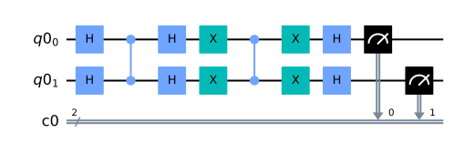

## blueqat tutorial 100番代

すべては[blueqat tutorial](https://github.com/Blueqat/Blueqat-tutorials)を勉強しながらやってみた程度ですので、詳細はそちらを参照してください。

これはまではIBM社のQiskitを利用していましたが、日本製のblueqatも使ってみることにしました。

### github
- jupyter notebook形式のファイルは[こちら](https://github.com/hiroshi0530/wa-src/blob/master/ml/data100/05/05_nb.ipynb)

### google colaboratory
- google colaboratory で実行する場合は[こちら](https://colab.research.google.com/github/hiroshi0530/wa-src/blob/master/ml/data100/05/05_nb.ipynb)

### 筆者の環境


```python
!sw_vers
```

    ProductName:	Mac OS X
    ProductVersion:	10.14.6
    BuildVersion:	18G6020


```python
!python -V
```

    Python 3.7.3


```python
from blueqat import __version__
print('blueqat version : ', __version__)
```

    blueqat version :  0.3.17


基本的なライブラリをインポートしそのバージョンを確認しておきます。


```python
%matplotlib inline
%config InlineBackend.figure_format = 'svg'

import matplotlib
import matplotlib.pyplot as plt
import scipy
import numpy as np
import pandas as pd

print('matplotlib version :', matplotlib.__version__)
print('scipy version :', scipy.__version__)
print('numpy version :', np.__version__)
print('pandas version :', pd.__version__)
```

    matplotlib version : 3.0.3
    scipy version : 1.4.1
    numpy version : 1.19.4
    pandas version : 1.0.3


```python

```


```python
from qiskit import QuantumCircuit, ClassicalRegister, QuantumRegister
from qiskit import Aer, execute
from qiskit.visualization import plot_histogram
```


```python
# 量子ビット、古典ビットの準備
qr = QuantumRegister(2)
cr = ClassicalRegister(2)

# 量子回路初期化
qc = QuantumCircuit(qr,cr)

# オラクル(|11>を反転)
qc.h(qr)
qc.cz(qr[0],qr[1])
qc.h(qr)

# 振幅増幅
qc.x(qr)
qc.cz(qr[0],qr[1])
qc.x(qr)
qc.h(qr)

# 測定
qc.measure(qr,cr)
```


    <qiskit.circuit.instructionset.InstructionSet at 0x12af26f28>


```python
qc.draw(output='mpl')

```





```python

```
