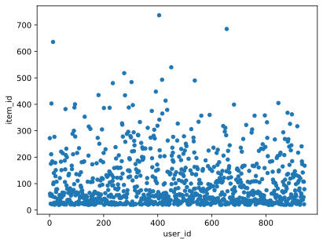
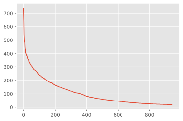

## Marketing と Recommender Systems と Information Retrival

主に推薦システムの理解に必要な線型代数の知識をまとめていこうと思います。
推薦システムで利用される、user-itemの行列（嗜好行列）に対して、しばしば低ランク近似が成立する事を前提に議論が進められることがあります。


## 記事案

### 

### Recommender Systems
1. コンテンツベースフィルタリング
2. 


```python
%matplotlib inline
%config InlineBackend.figure_format = 'svg'

import json
import math
import numpy as np
import matplotlib.pyplot as plt

import networkx as nx

from tabulate import tabulate

import torch
import torch.nn.functional as F
import torch.optim as optim
import torch.nn as nn

import matplotlib

print('matplotlib  : {}'.format(matplotlib.__version__))
print('networkdx   : {}'.format(nx.__version__))
print('numpy       : {}'.format(np.__version__))
print('torch       : {}'.format(torch.__version__))
```

    matplotlib  : 3.5.2
    networkdx   : 2.5
    numpy       : 1.19.2
    torch       : 1.10.0


```python
!ls -alh ../dataset/ml-100k/
```

    total 4056
    drwxr-xr-x  5 hiroshi.wayama  staff   160B 11 10  2021 .
    drwxr-xr-x  9 hiroshi.wayama  staff   288B  6 15 01:36 ..
    -rw-r--r--  1 hiroshi.wayama  staff   1.9M 11 10  2021 ml-100k.inter
    -rw-r--r--  1 hiroshi.wayama  staff    65K 11 10  2021 ml-100k.item
    -rw-r--r--  1 hiroshi.wayama  staff    22K 11 10  2021 ml-100k.user


```python
import pandas as pd

df = pd.read_csv('../dataset/ml-100k/ml-100k.inter', sep='\t')
df
```


<div>
<style scoped>
    .dataframe tbody tr th:only-of-type {
        vertical-align: middle;
    }

    .dataframe tbody tr th {
        vertical-align: top;
    }

    .dataframe thead th {
        text-align: right;
    }
</style>
<table border="1" class="dataframe">
  <thead>
    <tr style="text-align: right;">
      <th></th>
      <th>user_id:token</th>
      <th>item_id:token</th>
      <th>rating:float</th>
      <th>timestamp:float</th>
    </tr>
  </thead>
  <tbody>
    <tr>
      <th>0</th>
      <td>196</td>
      <td>242</td>
      <td>3</td>
      <td>881250949</td>
    </tr>
    <tr>
      <th>1</th>
      <td>186</td>
      <td>302</td>
      <td>3</td>
      <td>891717742</td>
    </tr>
    <tr>
      <th>2</th>
      <td>22</td>
      <td>377</td>
      <td>1</td>
      <td>878887116</td>
    </tr>
    <tr>
      <th>3</th>
      <td>244</td>
      <td>51</td>
      <td>2</td>
      <td>880606923</td>
    </tr>
    <tr>
      <th>4</th>
      <td>166</td>
      <td>346</td>
      <td>1</td>
      <td>886397596</td>
    </tr>
    <tr>
      <th>...</th>
      <td>...</td>
      <td>...</td>
      <td>...</td>
      <td>...</td>
    </tr>
    <tr>
      <th>99995</th>
      <td>880</td>
      <td>476</td>
      <td>3</td>
      <td>880175444</td>
    </tr>
    <tr>
      <th>99996</th>
      <td>716</td>
      <td>204</td>
      <td>5</td>
      <td>879795543</td>
    </tr>
    <tr>
      <th>99997</th>
      <td>276</td>
      <td>1090</td>
      <td>1</td>
      <td>874795795</td>
    </tr>
    <tr>
      <th>99998</th>
      <td>13</td>
      <td>225</td>
      <td>2</td>
      <td>882399156</td>
    </tr>
    <tr>
      <th>99999</th>
      <td>12</td>
      <td>203</td>
      <td>3</td>
      <td>879959583</td>
    </tr>
  </tbody>
</table>
<p>100000 rows × 4 columns</p>
</div>


```python
# plt.figure(figsize=(18, 6)).patch.set_facecolor('white')
# plt.style.use('ggplot')
df.groupby('user_id:token').count().sort_values(by='item_id:token', ascending=False).reset_index() \
.plot.scatter(x='user_id:token', y='item_id:token')
```


    <AxesSubplot:xlabel='user_id:token', ylabel='item_id:token'>


    

    


```python
df.groupby('user_id:token').count().sort_values(by='item_id:token', ascending=False).reset_index() \
['item_id:token'].plot()
```


    <AxesSubplot:>


    

    


```python

```


## まとめ

- aa

## 参考文献

- [1][現代線形代数](https://www.amazon.co.jp/%E7%8F%BE%E4%BB%A3%E7%B7%9A%E5%BD%A2%E4%BB%A3%E6%95%B0-%E2%80%95%E5%88%86%E8%A7%A3%E5%AE%9A%E7%90%86%E3%82%92%E4%B8%AD%E5%BF%83%E3%81%A8%E3%81%97%E3%81%A6%E2%80%95-%E6%B1%A0%E8%BE%BA-%E5%85%AB%E6%B4%B2%E5%BD%A6/dp/4320018818)
