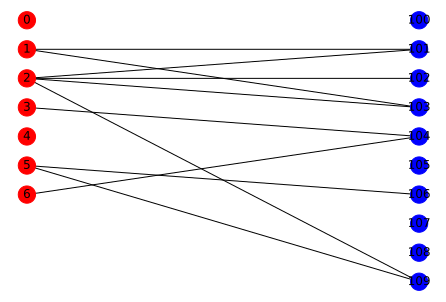

## Graph Convolutional Networks

グラフ畳み込みネットワーク(GCN)についてまとめる。

### github
- jupyter notebook形式のファイルは[こちら](https://github.com/hiroshi0530/wa-src/blob/master/rec/gcn/base_nb.ipynb)

### google colaboratory
- google colaboratory で実行する場合は[こちら](https://colab.research.google.com/github/hiroshi0530/wa-src/blob/master/rec/gcn/base_nb.ipynb)

### 筆者の環境


```python
!sw_vers
```

    ProductName:	Mac OS X
    ProductVersion:	10.14.6
    BuildVersion:	18G103


```python
!python -V
```

    Python 3.8.5


基本的なライブラリをインポートしそのバージョンを確認しておきます。
学習をpytorchを利用し、ネットワーク関係はnetworkxを利用する。


```python
%matplotlib inline
%config InlineBackend.figure_format = 'svg'

import json
import math
import numpy as np
import matplotlib.pyplot as plt

import networkx as nx

from tabulate import tabulate

print(nx.__version__)
```

    2.5


```python
# torchの読み込み
import torch
import torch.nn.functional as F
import torch.optim as optim
import torch.nn as nn

print(torch.__version__)
```

    1.10.0


## 二部グラフの作成、L、A、D、正規化行列の計算

わかりやすく、小さなグラフで作成する

$$
R_{u, i}=\left\lbrace\begin{array}{lr}
1, & \text { if }(u, i) \text { interaction is observed } \\
0, & \text { otherwise }
\end{array}\right.
$$

$$
\begin{array}{|l|r|r|r|r|}
\hline & \text { item_1 } & \text { item_2 } & \text { item_3 } & \text { item_4 } \\
\hline \text { user_1 } & 0 & 1 & 0 & 0 \\
\hline \text { user_2 } & 0 & 0 & 1 & 1 \\
\hline \text { user_3 } & 1 & 0 & 0 & 0 \\
\hline \text { user_4 } & 0 & 1 & 0 & 0 \\
\hline \text { user_5 } & 1 & 0 & 1 & 0 \\
\hline
\end{array}
$$


```python
np.random.seed(seed=16)
np.set_printoptions(threshold=10000000)

B = nx.Graph()

user_num = 3
item_num = 4

user_nodes = [i for i in range(user_num)]
item_nodes = [i for i in range(100, 100 + item_num)]

B.add_nodes_from(user_nodes, bipartite=0)
B.add_nodes_from(item_nodes, bipartite=1)

node_color = []
node_size = [600 for i in range(user_num + item_num)]

for u in user_nodes:
  node_color.append('red')
for i in item_nodes:
  node_color.append('lightblue')

edge_nodes = []
pos = {}
for _i, u in enumerate(user_nodes):
  pos[u] = np.array([-1, - 1.75 * _i])
  for _j, i in enumerate(item_nodes):
    pos[i] = np.array([1, - 1.75 * _j])
    if np.random.random() < 0.45:
      edge_nodes.append((u,i))

B.add_edges_from(edge_nodes)

nx.draw(B, pos=pos, with_labels=True, node_color=node_color, node_size=node_size)

plt.show()
```


    

    


上の二部グラフを嗜好行列で表すと以下のようになります。

|  | item_100 | item_200 | item_300 | item_400 |
| :---: | :---: | :---: | :---: | :---: |
| user_0 | 1 | 0 | 0 | 1 |
| user_1 | 1 | 1 | 0 | 1 |
| user_2 | 1 | 0 | 0 | 1 |

networkx型のオブジェクトから、嗜好行列や隣接行列を作ることができます。


```python
A = np.array(nx.adjacency_matrix(B).todense())
L = np.array(nx.laplacian_matrix(B).todense())
D = L + A
A
```


    array([[0, 0, 0, 1, 0, 0, 1],
           [0, 0, 0, 1, 1, 0, 1],
           [0, 0, 0, 1, 0, 0, 1],
           [1, 1, 1, 0, 0, 0, 0],
           [0, 1, 0, 0, 0, 0, 0],
           [0, 0, 0, 0, 0, 0, 0],
           [1, 1, 1, 0, 0, 0, 0]], dtype=int64)


```python
R = A[0:user_num, user_num:]
R
```


    array([[1, 0, 0, 1],
           [1, 1, 0, 1],
           [1, 0, 0, 1]], dtype=int64)


```python
D_I = np.sum(R, axis=0)
D_I
```


    array([3, 1, 0, 3], dtype=int64)


```python
D_U = np.sum(R, axis=1)
D_U
```


    array([2, 3, 2], dtype=int64)


```python
R_hat = np.diag(np.power(D_U + 1e-15, -1/2)) @ R @ np.diag(np.power(D_I + 1e-15, -1/2))
R_hat.round(2)
```


    array([[0.41, 0.  , 0.  , 0.41],
           [0.33, 0.58, 0.  , 0.33],
           [0.41, 0.  , 0.  , 0.41]])


```python
A_hat = np.block([[A[:user_num, :user_num], R_hat], [R_hat.T, A[user_num:, user_num:]]])
A_hat.round(2)
```


    array([[0.  , 0.  , 0.  , 0.41, 0.  , 0.  , 0.41],
           [0.  , 0.  , 0.  , 0.33, 0.58, 0.  , 0.33],
           [0.  , 0.  , 0.  , 0.41, 0.  , 0.  , 0.41],
           [0.41, 0.33, 0.41, 0.  , 0.  , 0.  , 0.  ],
           [0.  , 0.58, 0.  , 0.  , 0.  , 0.  , 0.  ],
           [0.  , 0.  , 0.  , 0.  , 0.  , 0.  , 0.  ],
           [0.41, 0.33, 0.41, 0.  , 0.  , 0.  , 0.  ]])


```python
# user-user 正規化隣接行列
P_item_hat = R_hat @ R_hat.T
P_item_hat.round(2)
```


    array([[0.33, 0.27, 0.33],
           [0.27, 0.56, 0.27],
           [0.33, 0.27, 0.33]])


```python
# item-item 正規化隣接行列
P_user_hat = R_hat.T @ R_hat
P_user_hat.round(2)
```


    array([[0.44, 0.19, 0.  , 0.44],
           [0.19, 0.33, 0.  , 0.19],
           [0.  , 0.  , 0.  , 0.  ],
           [0.44, 0.19, 0.  , 0.44]])


```python

```


```python
n_users = 3
n_items = 4
embedding_size = 64

user_embedding = nn.Embedding(n_users, embedding_size)
item_embedding = nn.Embedding(n_items, embedding_size)

```


```python
user_embedding
```


    Embedding(3, 64)


```python
item_embedding
```


    Embedding(4, 64)


```python
def forward(X, A_hat):
  H = torch.mm(torch.mm(A_hat, X), self.W_0)
  H = F.relu(H)
  H = torch.mm(torch.mm(A_hat, H),self.W_1)
  return F.log_softmax(H, dim=1)
```


```python
class GCN(nn.Module):
  def __init__(self, A_hat, num_feat, num_hidden, num_class):
    super(GCN, self).__init__()
    self.num_feat = num_feat
    self.num_hidden = num_hidden
    self.num_class = num_class
    self.A_hat = A_hat
    self.W_0 = nn.Parameter(torch.Tensor(num_feat, num_hidden))
    self.W_1 = nn.Parameter(torch.Tensor(num_hidden, num_class))
    self.reset_parameters()

  def reset_parameters(self):
    stdv = 1. / math.sqrt(self.W_0.size(1))
    self.W_0.data.uniform_(-stdv, stdv)
    stdv = 1. / math.sqrt(self.W_1.size(1))
    self.W_1.data.uniform_(-stdv, stdv)

  def forward(self, X, A_hat):
    H = torch.mm(torch.mm(A_hat, X), self.W_0)
    H = F.relu(H)
    H = torch.mm(torch.mm(A_hat, H),self.W_1)
    return F.log_softmax(H, dim=1)
```

pytorchの場合は


```python

```


```python

```

## Graph Convolutional Networks 


```python
import numpy as np
import networkx as nx
import matplotlib.pyplot as plt

np.set_printoptions(threshold=10000000)

B = nx.Graph()

user_num = 7
item_num = 10

user_nodes = [i for i in range(user_num)]
item_nodes = [i for i in range(100, 100 + item_num)]

B.add_nodes_from(user_nodes, bipartite=0)
B.add_nodes_from(item_nodes, bipartite=1)

node_color = []

for u in user_nodes:
  node_color.append('red')
for i in item_nodes:
  node_color.append('blue')

edge_nodes = []
pos = {}
for _i, u in enumerate(user_nodes):
  pos[u] = np.array([-1, - 1.75 * _i])
  for _j, i in enumerate(item_nodes):
    pos[i] = np.array([1, - 1.75 * _j])
    if np.random.random() < 0.15:
      edge_nodes.append((u,i))

B.add_edges_from(edge_nodes)

nx.draw(B, pos=pos, with_labels=True, node_color=node_color)

plt.show()
```


    

    


```python
m = nn.LogSoftmax(dim=1)
loss = nn.NLLLoss()

print(loss)

# 入力のサイズはN x C = 3 x 5
input = torch.randn(3, 5, requires_grad=True)

print(input)
# ターゲットの各要素は0 <=値<Cである必要があります
target = torch.tensor([1, 0, 4])
print(target)
output = loss(m(input), target)
print(output)
output.backward()
```

    NLLLoss()
    tensor([[ 0.1064,  0.4910,  0.7079,  1.4534,  0.4364],
            [ 0.1860,  0.4660,  0.4329, -1.0039,  0.3334],
            [-0.1303,  0.4550,  0.3146,  0.0974,  0.7234]], requires_grad=True)
    tensor([1, 0, 4])
    tensor(1.5711, grad_fn=<NllLossBackward>)


```python

```


```python

```

レコメンドにおけるグラフは、通常2部グラフとして表現されます。

$$
\tilde{R}=D_{U}^{-\frac{1}{2}} R D_{I}^{-\frac{1}{2}}
$$

networkxにはグラフラプラシアン$L$を求める関数が酔いされています。
$$
L=D-A
$$

次数行列は以下の様に求める事が出来ます。

$$
D = L + A
$$

## グラフラプラシアンの正規化

$$
\tilde{L}=I-\tilde{A}
$$

$$
\Delta f=\frac{\partial^{2} f}{\partial x^{2}}+\frac{\partial^{2} f}{\partial y^{2}}+\frac{\partial^{2} f}{\partial z^{2}}
$$

$$
\Delta h_{\omega}(x)=\lambda_{\omega} h_{\omega}(x)
$$

$$
h_{\omega}(x)=e^{i \omega x}
$$

$$
g(t) * f(t)=\sum_{\tau} g(\tau) f(t-\tau)
$$

$$
F[g(t) * f(t)]=F[g(t)] F[f(t)]
$$

$$
\begin{gathered}
\hat{\mathbf{x}}=\mathbf{U}^{T} \mathbf{x} \\
\mathbf{x}=\mathbf{U} \widehat{\mathbf{x}}
\end{gathered}
$$

$$
\mathcal{H}(\boldsymbol{L})=\operatorname{UDiag}\left(h\left(\lambda_{1}\right), \cdots, h\left(\lambda_{n}\right)\right) U^{T}
$$


```python

```


```python

```


```python

```
