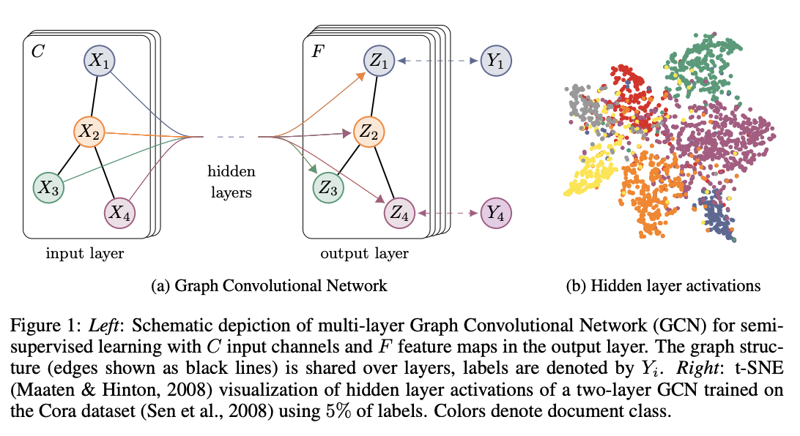
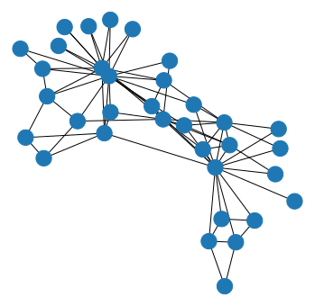
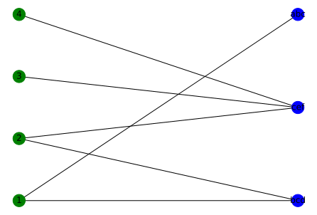
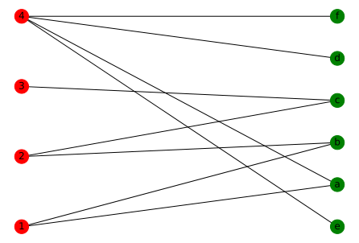

## Graph Convolutional Networks


### github
- jupyter notebook形式のファイルは[こちら](https://github.com/hiroshi0530/wa-src/blob/master/rec/gcn/base_nb.ipynb)

### google colaboratory
- google colaboratory で実行する場合は[こちら](https://colab.research.google.com/github/hiroshi0530/wa-src/blob/master/rec/gcn/base_nb.ipynb)

### 筆者の環境


```python
!sw_vers
```

    ProductName:	Mac OS X
    ProductVersion:	10.14.6
    BuildVersion:	18G103


```python
!python -V
```

    Python 3.8.5


基本的なライブラリをインポートしそのバージョンを確認しておきます。


```python
%matplotlib inline
%config InlineBackend.figure_format = 'svg'

import json
import math
import numpy as np
import matplotlib.pyplot as plt

import networkx as nx

print(nx.__version__)
```

    2.5


```python
# torchの読み込み
import torch
import torch.nn as nn
import torch.optim as optim
import torch.nn.functional as F

print(torch.__version__)
```

    1.4.0


## Graph Convolutional Networks 

## 参照論文
  - [1][SEMI-SUPERVISED CLASSIFICATION WITH GRAPH CONVOLUTIONAL NETWORKS](https://arxiv.org/pdf/1609.02907.pdf)
  - [2][Neural Graph Collaborative Filtering](https://arxiv.org/pdf/1905.08108.pdf)
  - [3][LightGCN: Simplifying and Powering Graph Convolution Network for Recommendation](https://arxiv.org/pdf/2002.02126.pdf)
  - [4][UltraGCN: Ultra Simplification of Graph Convolutional Networks for Recommendation](https://arxiv.org/abs/2110.15114)





```python

```


```python
m = nn.LogSoftmax(dim=1)
loss = nn.NLLLoss()

print(loss)

# 入力のサイズはN x C = 3 x 5
input = torch.randn(3, 5, requires_grad=True)

print(input)
# ターゲットの各要素は0 <=値<Cである必要があります
target = torch.tensor([1, 0, 4])
print(target)
output = loss(m(input), target)
print(output)
output.backward()
```

    NLLLoss()
    tensor([[ 0.1064,  0.4910,  0.7079,  1.4534,  0.4364],
            [ 0.1860,  0.4660,  0.4329, -1.0039,  0.3334],
            [-0.1303,  0.4550,  0.3146,  0.0974,  0.7234]], requires_grad=True)
    tensor([1, 0, 4])
    tensor(1.5711, grad_fn=<NllLossBackward>)


```python

```


```python

```


```python
G = nx.karate_club_graph()

pos = nx.spring_layout(G)
color = []
for node in G.nodes:
  print(G.node)
  if G.node[node]['club'] == 'Mr. Hi':
    color.append('r')
  elif G.node[node]['club'] == 'Officer':
    color.append('b')

plt.figure(figsize=(5, 5))
#nx.draw(G, pos=pos, node_size=200, node_color=color, with_labels=True)
nx.draw_networkx(G, pos=pos, node_size=200, node_color=color, with_labels=True)
```


    ---------------------------------------------------------------------------

    AttributeError                            Traceback (most recent call last)

    <ipython-input-5-7c6845b86451> in <module>
          4 color = []
          5 for node in G.nodes:
    ----> 6   print(G.node)
          7   if G.node[node]['club'] == 'Mr. Hi':
          8     color.append('r')


    AttributeError: 'Graph' object has no attribute 'node'


```python
# networkx, matplotlib の import
import networkx as nx
import matplotlib.pyplot as plt

# グラフの構築
G = nx.karate_club_graph()

# レイアウトの取得
pos = nx.spring_layout(G)

# 可視化
plt.figure(figsize=(6, 6))
nx.draw_networkx_edges(G, pos)
nx.draw_networkx_nodes(G, pos)
plt.axis('off')
plt.show()
```


    

    


レコメンドにおけるグラフは、通常2部グラフとして表現されます。


```python
B = nx.Graph()
B.add_nodes_from([1,2,3,4,5], bipartite=0)
B.add_nodes_from(['a', 'b', 'c', 'd', 'e', 'f', 'g'], bipartite=1)
B.add_edges_from([(1,'a'), (1,'b'), (2, 'a'), (2, 'c'), (3, 'g'), (4, 'd'), (5, 'e'), (5, 'f')])

node_color = []
for i in range(5):
  node_color.append('red')
for i in range(7):
  node_color.append('blue')
print(node_color)
print(nx.bipartite.sets(B))
top = nx.bipartite.sets(B)[0]
pos = nx.bipartite_layout(B, top)
nx.draw(B, pos=pos, with_labels=True, node_color=node_color)
plt.show()
```

    ['red', 'red', 'red', 'red', 'red', 'blue', 'blue', 'blue', 'blue', 'blue', 'blue', 'blue']


    ---------------------------------------------------------------------------

    AmbiguousSolution                         Traceback (most recent call last)

    <ipython-input-24-1b3a087710d2> in <module>
         10   node_color.append('blue')
         11 print(node_color)
    ---> 12 print(nx.bipartite.sets(B))
         13 top = nx.bipartite.sets(B)[0]
         14 pos = nx.bipartite_layout(B, top)


    ~/anaconda3/lib/python3.8/site-packages/networkx/algorithms/bipartite/basic.py in sets(G, top_nodes)
        199         if not is_connected(G):
        200             msg = "Disconnected graph: Ambiguous solution for bipartite sets."
    --> 201             raise nx.AmbiguousSolution(msg)
        202         c = color(G)
        203         X = {n for n, is_top in c.items() if is_top}


    AmbiguousSolution: Disconnected graph: Ambiguous solution for bipartite sets.


```python
B = nx.Graph()
B.add_nodes_from([1,2,3,4], bipartite=0) # Add the node attribute "bipartite"
B.add_nodes_from(['abc','bcd','cef'], bipartite=1)
B.add_edges_from([(1,'abc'), (1,'bcd'), (2,'bcd'), (2,'cef'), (3,'cef'), (4,'cef')])

top = nx.bipartite.sets(B)[0]
pos = nx.bipartite_layout(B, top)
nx.draw(B, pos=pos, with_labels=True, node_color=['green','green','green','green','blue','blue','blue'])
plt.show()
```


    

    


```python
B = None
B = nx.Graph()
B.add_nodes_from([1,2,3,4], bipartite=0) # Add the node attribute "bipartite"
B.add_nodes_from(['a','b','c', 'd', 'e','f'], bipartite=1)
B.add_edges_from([(1,'a'), (1,'b'), (2,'b'), (2,'c'), (3,'c'), (4,'a'), (4, 'd'),(4, 'e'), (4,'f')])

node_color = []
for i in range(4):
  node_color.append('red')
for i in range(6):
  node_color.append('green')


top = nx.bipartite.sets(B)[0]
pos = nx.bipartite_layout(B, top)
nx.draw(B, pos=pos, with_labels=True, node_color=node_color)
# nx.draw(B, pos=pos, with_labels=True, node_color=['green','green','green','green','blue','blue'])
plt.show()
```


    

    


レコメンドにおいて、嗜好行列


|  | item_1 | item_2 | item_3 | item_4 | item_5 |
| :---: | :---: | :---: | :---: | :---: | :---: |
| user_1 | 0 | 1 | 1 | 0 | 0 |
| user_2 | 0 | 0 | 0 | 1 | 0 |
| user_3 | 1 | 0 | 0 | 0 | 1 |
| user_4 | 1 | 1 | 1 | 1 | 0 |
| user_5 | 0 | 0 | 0 | 0 | 1 |
| user_6 | 0 | 0 | 1 | 0 | 0 |


$$
\begin{equation}
\mathbf{R}_{u, i}=\left\{\begin{array}{l}
1 \\
0
\end{array}\right.
\end{equation}
$$

$$
R_{u, i}=\left\{\begin{array}{lr}
1, & \text { if }(u, i) \text { interaction is observed } \\
0, & \text { otherwise }
\end{array}\right.
$$

$$
\boldsymbol{R} \in\{0,1\}^{|\mathcal{U}| \times|\mathcal{I}|}
$$

$$
\mathbf{R}_{u, i}=\left\{\begin{array}{lr}
1, & \text { if }(u, i) \text { interaction is observed } \\
0, & \text { otherwise }
\end{array}\right.
$$

レコメンドにおいて、嗜好行列


|  | item_1 | item_2 | item_3 | item_4 | item_5 |
| :---: | :---: | :---: | :---: | :---: | :---: |
| user_1 | 0 | 1 | 1 | 0 | 0 |
| user_2 | 0 | 0 | 0 | 1 | 0 |
| user_3 | 1 | 0 | 0 | 0 | 1 |
| user_4 | 1 | 1 | 1 | 1 | 0 |
| user_5 | 0 | 0 | 0 | 0 | 1 |
| user_6 | 0 | 0 | 1 | 0 | 0 |


$$
A=\left(\begin{array}{cc}
0 & R \\
R^{T} & 0
\end{array}\right)
$$

$$
\tilde{R}=D_{U}^{-\frac{1}{2}} R D_{I}^{-\frac{1}{2}}
$$


```python

```


```python
A = nx.adjacency_matrix(B).todense()
A
```


    matrix([[0, 0, 0, 0, 1, 1, 0, 0, 0, 0],
            [0, 0, 0, 0, 0, 1, 1, 0, 0, 0],
            [0, 0, 0, 0, 0, 0, 1, 0, 0, 0],
            [0, 0, 0, 0, 1, 0, 0, 1, 1, 1],
            [1, 0, 0, 1, 0, 0, 0, 0, 0, 0],
            [1, 1, 0, 0, 0, 0, 0, 0, 0, 0],
            [0, 1, 1, 0, 0, 0, 0, 0, 0, 0],
            [0, 0, 0, 1, 0, 0, 0, 0, 0, 0],
            [0, 0, 0, 1, 0, 0, 0, 0, 0, 0],
            [0, 0, 0, 1, 0, 0, 0, 0, 0, 0]], dtype=int64)


networkxにはグラフラプラシアン$L$を求める関数が酔いされています。
$$
L=D-A
$$


```python
L = nx.laplacian_matrix(B).todense()
L
```


    matrix([[ 2,  0,  0,  0, -1, -1,  0,  0,  0,  0],
            [ 0,  2,  0,  0,  0, -1, -1,  0,  0,  0],
            [ 0,  0,  1,  0,  0,  0, -1,  0,  0,  0],
            [ 0,  0,  0,  4, -1,  0,  0, -1, -1, -1],
            [-1,  0,  0, -1,  2,  0,  0,  0,  0,  0],
            [-1, -1,  0,  0,  0,  2,  0,  0,  0,  0],
            [ 0, -1, -1,  0,  0,  0,  2,  0,  0,  0],
            [ 0,  0,  0, -1,  0,  0,  0,  1,  0,  0],
            [ 0,  0,  0, -1,  0,  0,  0,  0,  1,  0],
            [ 0,  0,  0, -1,  0,  0,  0,  0,  0,  1]], dtype=int64)


次数行列は以下の様に求める事が出来ます。

$$
D = L + A
$$


```python
D = L + A
D
```


    matrix([[2, 0, 0, 0, 0, 0, 0, 0, 0, 0],
            [0, 2, 0, 0, 0, 0, 0, 0, 0, 0],
            [0, 0, 1, 0, 0, 0, 0, 0, 0, 0],
            [0, 0, 0, 4, 0, 0, 0, 0, 0, 0],
            [0, 0, 0, 0, 2, 0, 0, 0, 0, 0],
            [0, 0, 0, 0, 0, 2, 0, 0, 0, 0],
            [0, 0, 0, 0, 0, 0, 2, 0, 0, 0],
            [0, 0, 0, 0, 0, 0, 0, 1, 0, 0],
            [0, 0, 0, 0, 0, 0, 0, 0, 1, 0],
            [0, 0, 0, 0, 0, 0, 0, 0, 0, 1]], dtype=int64)


```python
import numpy as np
import numpy.linalg as LA

Lambda = np.linalg.eig(L)[0]
```


```python
U = np.linalg.eig(L)[1]
```


```python
U @ np.diagflat(Lambda) @ U.T
```


    matrix([[ 2.00000000e+00, -2.46981255e-16, -3.10515502e-16,
              2.42969707e-15, -1.00000000e+00, -1.00000000e+00,
              7.15465014e-16, -8.91935267e-16, -8.43993182e-16,
             -7.99586751e-16],
            [-1.36067373e-16,  2.00000000e+00, -1.70002901e-16,
              1.26461341e-15,  1.83186799e-15, -1.00000000e+00,
             -1.00000000e+00, -3.03656075e-16, -3.87629330e-16,
             -4.08529279e-16],
            [-3.66026653e-16, -2.81025203e-16,  1.00000000e+00,
              2.01227923e-16, -2.68882139e-16,  5.37764278e-17,
             -1.00000000e+00, -1.39667317e-16, -7.70490482e-17,
             -9.55338606e-17],
            [ 2.49214711e-15,  1.27849120e-15,  2.04697370e-16,
              4.00000000e+00, -1.00000000e+00, -1.89084859e-15,
              2.79290480e-16, -1.00000000e+00, -1.00000000e+00,
             -1.00000000e+00],
            [-1.00000000e+00,  1.88737914e-15, -1.56125113e-16,
             -1.00000000e+00,  2.00000000e+00, -1.86049093e-16,
              1.20563282e-16,  2.36884101e-17,  5.05086767e-16,
              5.74508954e-16],
            [-1.00000000e+00, -1.00000000e+00,  1.09287579e-16,
             -1.91513472e-15, -3.80771803e-16,  2.00000000e+00,
             -1.45022883e-15,  7.10896422e-16,  3.64826845e-16,
              3.39811090e-16],
            [ 6.11490025e-16, -1.00000000e+00, -1.00000000e+00,
              3.62557206e-16,  1.12757026e-16, -1.28889954e-15,
              2.00000000e+00, -2.57069936e-17,  5.76046858e-17,
              7.21857164e-17],
            [-8.98982582e-16, -3.19268586e-16, -1.46606211e-16,
             -1.00000000e+00,  6.27196883e-17,  6.90079740e-16,
             -2.91764406e-17,  1.22140609e+00,  1.77800863e-01,
             -3.99206957e-01],
            [-8.64809864e-16, -3.78955712e-16, -7.01101543e-17,
             -1.00000000e+00,  5.02484682e-16,  3.57887951e-16,
              6.10741328e-17,  1.77800863e-01,  6.00793043e-01,
              2.21406094e-01],
            [-8.20403432e-16, -3.99855662e-16, -8.85949667e-17,
             -1.00000000e+00,  5.71906868e-16,  3.32872196e-16,
              7.56551633e-17, -3.99206957e-01,  2.21406094e-01,
              1.17780086e+00]])


```python

```

## グラフラプラシアンの正規化

$$
\tilde{L}=I-\tilde{A}
$$

$$
\Delta f=\frac{\partial^{2} f}{\partial x^{2}}+\frac{\partial^{2} f}{\partial y^{2}}+\frac{\partial^{2} f}{\partial z^{2}}
$$


```python
nD = np.diagflat(np.power(np.array(np.sum(D, axis=0))[0] + 1e-15, -1/2))
nA = nD @ A @ nD
nL = np.eye(len(nA)) - nA
nLambda = np.linalg.eig(nL)[0]
nU = np.linalg.eig(nL)[1]
nU @ np.diagflat(nLambda) @ nU.T
```


    matrix([[ 1.00000000e+00,  6.46184495e-17, -5.05238212e-17,
              1.24856722e-15, -5.00000000e-01, -5.00000000e-01,
             -3.61039323e-16, -6.19510098e-16, -6.59214287e-16,
             -7.23905449e-16],
            [ 5.07406617e-17,  1.00000000e+00, -9.19403442e-16,
             -3.03576608e-16,  1.70002901e-16, -5.00000000e-01,
             -5.00000000e-01,  2.04890223e-16,  1.53518028e-17,
              1.89152714e-16],
            [-2.28766658e-17, -9.22872889e-16,  1.00000000e+00,
             -6.41847686e-17, -4.76181594e-16,  1.11022302e-16,
             -7.07106781e-01,  7.66347748e-17, -1.01105375e-16,
              2.25698524e-16],
            [ 1.25528928e-15, -2.48065457e-16, -9.71445147e-17,
              1.00000000e+00, -3.53553391e-01, -4.29344060e-16,
              2.77555756e-17, -5.00000000e-01, -5.00000000e-01,
             -5.00000000e-01],
            [-5.00000000e-01,  1.70002901e-16, -4.48426019e-16,
             -3.53553391e-01,  1.00000000e+00,  7.73252989e-16,
              4.51028104e-16,  2.60613411e-16,  2.69603637e-16,
              2.90740837e-16],
            [-5.00000000e-01, -5.00000000e-01,  1.04950770e-16,
             -4.21537805e-16,  7.73252989e-16,  1.00000000e+00,
             -5.37764278e-17,  1.59189670e-16,  2.01807468e-16,
              2.70442207e-16],
            [-3.46944695e-16, -5.00000000e-01, -7.07106781e-01,
             -3.46944695e-18,  4.50160742e-16, -5.29090660e-17,
              1.00000000e+00, -1.24436896e-17,  2.02146761e-16,
              4.58595776e-18],
            [-6.26448991e-16,  1.70195754e-16,  6.27569870e-17,
             -5.00000000e-01,  2.60613411e-16,  1.86945246e-16,
             -8.97424262e-18,  1.01158431e+00, -1.48312106e-02,
              3.24690156e-03],
            [-6.69622627e-16,  2.22906967e-17, -8.72275876e-17,
             -5.00000000e-01,  2.83047744e-16,  2.26093596e-16,
              1.81330079e-16, -1.48312106e-02,  1.00324690e+00,
              1.15843090e-02],
            [-7.27483316e-16,  1.88285353e-16,  2.10953374e-16,
             -5.00000000e-01,  2.91174518e-16,  2.93860974e-16,
             -2.14348944e-17,  3.24690156e-03,  1.15843090e-02,
              9.85168789e-01]])


```python
embedding = torch.nn.Embedding(num_embeddings=len(nA), embedding_dim=len(nA))
dir(embedding)
```


    ['__call__',
     '__class__',
     '__constants__',
     '__delattr__',
     '__dict__',
     '__dir__',
     '__doc__',
     '__eq__',
     '__format__',
     '__ge__',
     '__getattr__',
     '__getattribute__',
     '__gt__',
     '__hash__',
     '__init__',
     '__init_subclass__',
     '__le__',
     '__lt__',
     '__module__',
     '__ne__',
     '__new__',
     '__reduce__',
     '__reduce_ex__',
     '__repr__',
     '__setattr__',
     '__setstate__',
     '__sizeof__',
     '__str__',
     '__subclasshook__',
     '__weakref__',
     '_apply',
     '_backward_hooks',
     '_buffers',
     '_forward_hooks',
     '_forward_pre_hooks',
     '_get_name',
     '_load_from_state_dict',
     '_load_state_dict_pre_hooks',
     '_modules',
     '_named_members',
     '_parameters',
     '_register_load_state_dict_pre_hook',
     '_register_state_dict_hook',
     '_replicate_for_data_parallel',
     '_save_to_state_dict',
     '_slow_forward',
     '_state_dict_hooks',
     '_version',
     'add_module',
     'apply',
     'buffers',
     'children',
     'cpu',
     'cuda',
     'double',
     'dump_patches',
     'embedding_dim',
     'eval',
     'extra_repr',
     'float',
     'forward',
     'from_pretrained',
     'half',
     'load_state_dict',
     'max_norm',
     'modules',
     'named_buffers',
     'named_children',
     'named_modules',
     'named_parameters',
     'norm_type',
     'num_embeddings',
     'padding_idx',
     'parameters',
     'register_backward_hook',
     'register_buffer',
     'register_forward_hook',
     'register_forward_pre_hook',
     'register_parameter',
     'requires_grad_',
     'reset_parameters',
     'scale_grad_by_freq',
     'share_memory',
     'sparse',
     'state_dict',
     'to',
     'train',
     'training',
     'type',
     'weight',
     'zero_grad']


$$
\Delta h_{\omega}(x)=\lambda_{\omega} h_{\omega}(x)
$$

$$
h_{\omega}(x)=e^{i \omega x}
$$

$$
g(t) * f(t)=\sum_{\tau} g(\tau) f(t-\tau)
$$

$$
F[g(t) * f(t)]=F[g(t)] F[f(t)]
$$

$$
\begin{gathered}
\hat{\mathbf{x}}=\mathbf{U}^{T} \mathbf{x} \\
\mathbf{x}=\mathbf{U} \widehat{\mathbf{x}}
\end{gathered}
$$

$$
\mathcal{H}(\boldsymbol{L})=\operatorname{UDiag}\left(h\left(\lambda_{1}\right), \cdots, h\left(\lambda_{n}\right)\right) U^{T}
$$


```python

```


```python

```


```python

```
