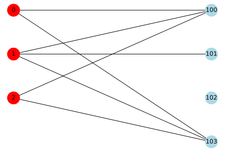

## [PyTorch] Matrix Factorization

pytorchで行列分解(Matrix Factorization)をやってみる。


### データセット

### 評価指標
#### ランキング上位
- recall
- precision
- nDCG

#### 多様性の評価
- ユークリッド距離

### model
- MF
- 

### github
- jupyter notebook形式のファイルは[こちら](https://github.com/hiroshi0530/wa-src/blob/master/rec/gcn/base_nb.ipynb)

### google colaboratory
- google colaboratory で実行する場合は[こちら](https://colab.research.google.com/github/hiroshi0530/wa-src/blob/master/rec/gcn/base_nb.ipynb)

### 筆者の環境


```python
!sw_vers
```

    ProductName:	macOS
    ProductVersion:	11.6.7
    BuildVersion:	20G630


```python
!python -V
```

    Python 3.8.13


基本的なライブラリをインポートしそのバージョンを確認しておきます。
学習をpytorchを利用し、ネットワーク関係はnetworkxを利用する。


```python
%matplotlib inline
%config InlineBackend.figure_format = 'svg'

import json
import math
import numpy as np
import matplotlib.pyplot as plt

import networkx as nx

from tabulate import tabulate

import torch
import torch.nn.functional as F
import torch.optim as optim
import torch.nn as nn

import matplotlib

print('matplotlib  : {}'.format(matplotlib.__version__))
print('networkdx   : {}'.format(nx.__version__))
print('numpy       : {}'.format(np.__version__))
print('torch       : {}'.format(torch.__version__))
```

    matplotlib  : 3.5.1
    networkdx   : 2.7.1
    numpy       : 1.22.3
    torch       : 1.12.0


```python
class MF(torch.nn.Module):
    def __init__(self, n_users, n_items, n_factors=20):
        super(MF, self).__init__()
        self.user_factors = torch.nn.Embedding(n_users, n_factors, sparse=True)
        self.item_factors = torch.nn.Embedding(n_items, n_factors, sparse=True)

    def forward(self, user, item):
        return (self.user_factors(user) * self.item_factors(item)).sum(1)

n_users = 2000
n_items = 2000

model = MF(n_users, n_items, n_factors=128)
```


```python
class MF(torch.nn.Module):

    def __init__(self, n_users, n_items, latent_dim):
        super(MF, self).__init__()

        # define layers and loss
        self.user_embedding = torch.nn.Embedding(num_embeddings=n_users, embedding_dim=latent_dim)
        self.item_embedding = torch.nn.Embedding(num_embeddings=n_items, embedding_dim=latent_dim)

    def forward(self):
        all_embeddings = self.get_ego_embeddings()
        embeddings_list = [all_embeddings]

        for layer_idx in range(self.n_layers):
            all_embeddings = torch.sparse.mm(self.norm_adj_matrix, all_embeddings)
            embeddings_list.append(all_embeddings)

        lightgcn_all_embeddings = torch.stack(embeddings_list, dim=1)
        lightgcn_all_embeddings = torch.mean(lightgcn_all_embeddings, dim=1)

        user_all_embeddings, item_all_embeddings = torch.split(lightgcn_all_embeddings, [self.n_users, self.n_items])
        return user_all_embeddings, item_all_embeddings

    def calculate_loss(self, interaction):
        # clear the storage variable when training
        if self.restore_user_e is not None or self.restore_item_e is not None:
            self.restore_user_e, self.restore_item_e = None, None

        user = interaction[self.USER_ID]
        pos_item = interaction[self.ITEM_ID]
        neg_item = interaction[self.NEG_ITEM_ID]

        user_all_embeddings, item_all_embeddings = self.forward()
        u_embeddings = user_all_embeddings[user]
        pos_embeddings = item_all_embeddings[pos_item]
        neg_embeddings = item_all_embeddings[neg_item]

        # calculate BPR Loss
        pos_scores = torch.mul(u_embeddings, pos_embeddings).sum(dim=1)
        neg_scores = torch.mul(u_embeddings, neg_embeddings).sum(dim=1)
        mf_loss = self.mf_loss(pos_scores, neg_scores)

        # calculate BPR Loss
        u_ego_embeddings = self.user_embedding(user)
        pos_ego_embeddings = self.item_embedding(pos_item)
        neg_ego_embeddings = self.item_embedding(neg_item)

        reg_loss = self.reg_loss(u_ego_embeddings, pos_ego_embeddings, neg_ego_embeddings)
        loss = mf_loss + self.reg_weight * reg_loss

        return loss

    def predict(self, interaction):
        user = interaction[self.USER_ID]
        item = interaction[self.ITEM_ID]

        user_all_embeddings, item_all_embeddings = self.forward()

        u_embeddings = user_all_embeddings[user]
        i_embeddings = item_all_embeddings[item]
        scores = torch.mul(u_embeddings, i_embeddings).sum(dim=1)
        return scores

n_users = 2000
n_items = 2000
latent_dim = 128
model = MF(n_users, n_items, latent_dim)
```


```python
model.user_embedding()
```


    ---------------------------------------------------------------------------

    TypeError                                 Traceback (most recent call last)

    Input In [14], in <cell line: 1>()
    ----> 1 model.user_embedding()


    File ~/anaconda3/envs/rec/lib/python3.8/site-packages/torch/nn/modules/module.py:1130, in Module._call_impl(self, *input, **kwargs)
       1126 # If we don't have any hooks, we want to skip the rest of the logic in
       1127 # this function, and just call forward.
       1128 if not (self._backward_hooks or self._forward_hooks or self._forward_pre_hooks or _global_backward_hooks
       1129         or _global_forward_hooks or _global_forward_pre_hooks):
    -> 1130     return forward_call(*input, **kwargs)
       1131 # Do not call functions when jit is used
       1132 full_backward_hooks, non_full_backward_hooks = [], []


    TypeError: forward() missing 1 required positional argument: 'input'


```python
loss_function = nn.MSELoss()
optimizer = optim.SGD(model.parameters(), lr=1e-2)
```


```python
from torch import autograd

for epoch in range(10):  # 最大10反復
    accum_loss = 0.

    # 学習データのシャッフル
    random.shuffle(samples_train)

    for u, i, r in samples_train:
        # PyTorchでは勾配は累積するのでサンプルごとに初期化
        model.zero_grad()

        # 入力値を `torch.Tensor` でラップして `autograd.Variable` 化
        user = autograd.Variable(as_long_tensor(u))  # user index
        item = autograd.Variable(as_long_tensor(i))  # item index
        rating = autograd.Variable(as_float_tensor(r))  # target

        # forward pass (prediction)
        prediction = model(user, item)

        # compute loss
        loss = loss_function(prediction, rating)
        accum_loss += loss.data[0]

        # gradient of loss
        loss.backward()

        # update model parameters
        optimizer.step()

    print('MF (PyTorch)', epoch + 1, accum_loss)
    if abs(accum_loss - last_accum_loss) < 1e-3:  # 収束判定
        break
    last_accum_loss = accum_loss
```


```python
for i in model.parameters():
  print(i) 
```


```python

```


```python

o
```


```python

```


```python

```

## 二部グラフの作成、L、A、D、正規化行列の計算

わかりやすく、小さなグラフで作成する

$$
R_{u, i}=\left\lbrace\begin{array}{lr}
1, & \text { if }(u, i) \text { interaction is observed } \\
0, & \text { otherwise }
\end{array}\right.
$$

$$
\begin{array}{|l|r|r|r|r|}
\hline & \text { item_1 } & \text { item_2 } & \text { item_3 } & \text { item_4 } \\
\hline \text { user_1 } & 0 & 1 & 0 & 0 \\
\hline \text { user_2 } & 0 & 0 & 1 & 1 \\
\hline \text { user_3 } & 1 & 0 & 0 & 0 \\
\hline \text { user_4 } & 0 & 1 & 0 & 0 \\
\hline \text { user_5 } & 1 & 0 & 1 & 0 \\
\hline
\end{array}
$$


```python
np.random.seed(seed=16)
np.set_printoptions(threshold=10000000)

B = nx.Graph()

user_num = 3
item_num = 4

user_nodes = [i for i in range(user_num)]
item_nodes = [i for i in range(100, 100 + item_num)]

B.add_nodes_from(user_nodes, bipartite=0)
B.add_nodes_from(item_nodes, bipartite=1)

node_color = []
node_size = [600 for i in range(user_num + item_num)]

for u in user_nodes:
  node_color.append('red')
for i in item_nodes:
  node_color.append('lightblue')

edge_nodes = []
pos = {}
for _i, u in enumerate(user_nodes):
  pos[u] = np.array([-1, - 1.75 * _i])
  for _j, i in enumerate(item_nodes):
    pos[i] = np.array([1, - 1.75 * _j])
    if np.random.random() < 0.45:
      edge_nodes.append((u,i))

B.add_edges_from(edge_nodes)

nx.draw(B, pos=pos, with_labels=True, node_color=node_color, node_size=node_size)

plt.show()
```


    

    


上の二部グラフを嗜好行列で表すと以下のようになります。

|  | item_100 | item_200 | item_300 | item_400 |
| :---: | :---: | :---: | :---: | :---: |
| user_0 | 1 | 0 | 0 | 1 |
| user_1 | 1 | 1 | 0 | 1 |
| user_2 | 1 | 0 | 0 | 1 |

networkx型のオブジェクトから、嗜好行列や隣接行列を作ることができます。


```python
A = np.array(nx.adjacency_matrix(B).todense())
L = np.array(nx.laplacian_matrix(B).todense())
D = L + A
A
```


    array([[0, 0, 0, 1, 0, 0, 1],
           [0, 0, 0, 1, 1, 0, 1],
           [0, 0, 0, 1, 0, 0, 1],
           [1, 1, 1, 0, 0, 0, 0],
           [0, 1, 0, 0, 0, 0, 0],
           [0, 0, 0, 0, 0, 0, 0],
           [1, 1, 1, 0, 0, 0, 0]], dtype=int64)


```python
R = A[0:user_num, user_num:]
R
```


    array([[1, 0, 0, 1],
           [1, 1, 0, 1],
           [1, 0, 0, 1]], dtype=int64)


```python
D_I = np.sum(R, axis=0)
D_I
```


    array([3, 1, 0, 3], dtype=int64)


```python
D_U = np.sum(R, axis=1)
D_U
```


    array([2, 3, 2], dtype=int64)


```python
R_hat = np.diag(np.power(D_U + 1e-15, -1/2)) @ R @ np.diag(np.power(D_I + 1e-15, -1/2))
R_hat.round(2)
```


    array([[0.41, 0.  , 0.  , 0.41],
           [0.33, 0.58, 0.  , 0.33],
           [0.41, 0.  , 0.  , 0.41]])


```python
A_hat = np.block([[A[:user_num, :user_num], R_hat], [R_hat.T, A[user_num:, user_num:]]])
A_hat.round(2)
```


    array([[0.  , 0.  , 0.  , 0.41, 0.  , 0.  , 0.41],
           [0.  , 0.  , 0.  , 0.33, 0.58, 0.  , 0.33],
           [0.  , 0.  , 0.  , 0.41, 0.  , 0.  , 0.41],
           [0.41, 0.33, 0.41, 0.  , 0.  , 0.  , 0.  ],
           [0.  , 0.58, 0.  , 0.  , 0.  , 0.  , 0.  ],
           [0.  , 0.  , 0.  , 0.  , 0.  , 0.  , 0.  ],
           [0.41, 0.33, 0.41, 0.  , 0.  , 0.  , 0.  ]])


```python
# user-user 正規化隣接行列
P_item_hat = R_hat @ R_hat.T
P_item_hat.round(2)
```


    array([[0.33, 0.27, 0.33],
           [0.27, 0.56, 0.27],
           [0.33, 0.27, 0.33]])


```python
# item-item 正規化隣接行列
P_user_hat = R_hat.T @ R_hat
P_user_hat.round(2)
```


    array([[0.44, 0.19, 0.  , 0.44],
           [0.19, 0.33, 0.  , 0.19],
           [0.  , 0.  , 0.  , 0.  ],
           [0.44, 0.19, 0.  , 0.44]])


```python

```


```python
n_users = 3
n_items = 4
embedding_size = 64

user_embedding = nn.Embedding(n_users, embedding_size)
item_embedding = nn.Embedding(n_items, embedding_size)

```


```python
user_embedding
```


    Embedding(3, 64)


```python
item_embedding
```


    Embedding(4, 64)


```python
def forward(X, A_hat):
  H = torch.mm(torch.mm(A_hat, X), self.W_0)
  H = F.relu(H)
  H = torch.mm(torch.mm(A_hat, H),self.W_1)
  return F.log_softmax(H, dim=1)
```


```python
class GCN(nn.Module):
  def __init__(self, A_hat, num_feat, num_hidden, num_class):
    super(GCN, self).__init__()
    self.num_feat = num_feat
    self.num_hidden = num_hidden
    self.num_class = num_class
    self.A_hat = A_hat
    self.W_0 = nn.Parameter(torch.Tensor(num_feat, num_hidden))
    self.W_1 = nn.Parameter(torch.Tensor(num_hidden, num_class))
    self.reset_parameters()

  def reset_parameters(self):
    stdv = 1. / math.sqrt(self.W_0.size(1))
    self.W_0.data.uniform_(-stdv, stdv)
    stdv = 1. / math.sqrt(self.W_1.size(1))
    self.W_1.data.uniform_(-stdv, stdv)

  def forward(self, X, A_hat):
    H = torch.mm(torch.mm(A_hat, X), self.W_0)
    H = F.relu(H)
    H = torch.mm(torch.mm(A_hat, H),self.W_1)
    return F.log_softmax(H, dim=1)
```

pytorchの場合は


```python

```


```python

```

## Graph Convolutional Networks 


```python
import numpy as np
import networkx as nx
import matplotlib.pyplot as plt

np.set_printoptions(threshold=10000000)

B = nx.Graph()

user_num = 7
item_num = 10

user_nodes = [i for i in range(user_num)]
item_nodes = [i for i in range(100, 100 + item_num)]

B.add_nodes_from(user_nodes, bipartite=0)
B.add_nodes_from(item_nodes, bipartite=1)

node_color = []

for u in user_nodes:
  node_color.append('red')
for i in item_nodes:
  node_color.append('blue')

edge_nodes = []
pos = {}
for _i, u in enumerate(user_nodes):
  pos[u] = np.array([-1, - 1.75 * _i])
  for _j, i in enumerate(item_nodes):
    pos[i] = np.array([1, - 1.75 * _j])
    if np.random.random() < 0.15:
      edge_nodes.append((u,i))

B.add_edges_from(edge_nodes)

nx.draw(B, pos=pos, with_labels=True, node_color=node_color)

plt.show()
```


    

    


```python
m = nn.LogSoftmax(dim=1)
loss = nn.NLLLoss()

print(loss)

# 入力のサイズはN x C = 3 x 5
input = torch.randn(3, 5, requires_grad=True)

print(input)
# ターゲットの各要素は0 <=値<Cである必要があります
target = torch.tensor([1, 0, 4])
print(target)
output = loss(m(input), target)
print(output)
output.backward()
```

    NLLLoss()
    tensor([[-2.1383, -0.6961, -1.1747,  2.1168, -1.4791],
            [ 1.8073,  1.5682,  0.5385,  1.5459, -0.0277],
            [ 1.3852, -1.1378,  0.1540, -0.5693,  1.8205]], requires_grad=True)
    tensor([1, 0, 4])
    tensor(1.5746, grad_fn=<NllLossBackward0>)


```python

```


```python

```

レコメンドにおけるグラフは、通常2部グラフとして表現されます。

$$
\tilde{R}=D_{U}^{-\frac{1}{2}} R D_{I}^{-\frac{1}{2}}
$$

networkxにはグラフラプラシアン$L$を求める関数が酔いされています。
$$
L=D-A
$$

次数行列は以下の様に求める事が出来ます。

$$
D = L + A
$$

## グラフラプラシアンの正規化

$$
\tilde{L}=I-\tilde{A}
$$

$$
\Delta f=\frac{\partial^{2} f}{\partial x^{2}}+\frac{\partial^{2} f}{\partial y^{2}}+\frac{\partial^{2} f}{\partial z^{2}}
$$

$$
\Delta h_{\omega}(x)=\lambda_{\omega} h_{\omega}(x)
$$

$$
h_{\omega}(x)=e^{i \omega x}
$$

$$
g(t) * f(t)=\sum_{\tau} g(\tau) f(t-\tau)
$$

$$
F[g(t) * f(t)]=F[g(t)] F[f(t)]
$$

$$
\begin{gathered}
\hat{\mathbf{x}}=\mathbf{U}^{T} \mathbf{x} \\
\mathbf{x}=\mathbf{U} \widehat{\mathbf{x}}
\end{gathered}
$$

$$
\mathcal{H}(\boldsymbol{L})=\operatorname{UDiag}\left(h\left(\lambda_{1}\right), \cdots, h\left(\lambda_{n}\right)\right) U^{T}
$$


```python

```


```python

```


```python
import torch
from torch.utils.data import DataLoader, Dataset

from SVDppRecommender import SVDpp

class RateDataset(Dataset):
    def __init__(self, user_tensor, item_tensor, target_tensor):
        self.user_tensor = user_tensor
        self.item_tensor = item_tensor
        self.target_tensor = target_tensor

    def __getitem__(self, index):
        return self.user_tensor[index], self.item_tensor[index], self.target_tensor[index]
    
    def __len__(self):
        return self.user_tensor.size(0)

data = {(0,0): 4, 
        (0,1): 5, 
        (0,2): 3,
        (0,3): 4, 
        (1,0): 5, 
        (1,1): 3,
        (1,2): 4, 
        (1,3): 1, 
        (2,0): 3,
        (2,1): 2, 
        (2,2): 5, 
        (2,3): 5,
        (3,0): 4, 
        (3,1): 2, 
        (3,2): 3,
        (3,3): 1
        }
Iu = {key:[0,1,2,3] for key in range(4)}

user_tensor = torch.LongTensor([key[0] for key in data.keys()])
item_tensor = torch.LongTensor([key[1] for key in data.keys()])
rating_tensor = torch.FloatTensor([val for val in data.values()])

params = {'num_users': 4, 
          'num_items': 4,
          'global_mean': 3, 
          'latent_dim': 10
        }

model = SVDpp(params)
criterion = torch.nn.MSELoss()
optimizer = torch.optim.SGD(model.parameters(), lr=0.01, momentum=0.9)

dataset = RateDataset(user_tensor, item_tensor, rating_tensor)
train_loader = DataLoader(dataset, batch_size=10, shuffle=True)

for epoch in range(30):
    for bid, batch in enumerate(train_loader):
        u, i, r = batch[0], batch[1], batch[2]
        r = r.float()
        # forward pass
        preds = model(u, i, Iu)
        loss = criterion(preds, r)

        # backward and optimize
        optimizer.zero_grad()
        loss.backward()
        optimizer.step()

    print('Epoch [{}/30], Loss: {:.4f}'.format(epoch + 1, loss.item()))
    
```


    ---------------------------------------------------------------------------

    ModuleNotFoundError                       Traceback (most recent call last)

    <ipython-input-68-7cab36334607> in <module>
          2 from torch.utils.data import DataLoader, Dataset
          3 
    ----> 4 from SVDppRecommender import SVDpp
          5 
          6 class RateDataset(Dataset):


    ModuleNotFoundError: No module named 'SVDppRecommender'


```python
import numpy as np
X = np.array([[1, 1], [2, 1], [3, 1.2], [4, 1], [5, 0.8], [6, 1]])
from sklearn.decomposition import NMF
model = NMF(n_components=2, init='random', random_state=0)
W = model.fit_transform(A_hat)
H = model.components_
```


```python
X
```


    array([[1. , 1. ],
           [2. , 1. ],
           [3. , 1.2],
           [4. , 1. ],
           [5. , 0.8],
           [6. , 1. ]])


```python
W
```


    array([[1.55391099e-11, 3.40767530e-01],
           [0.00000000e+00, 4.17373793e-01],
           [1.55391099e-11, 3.40767530e-01],
           [5.83954597e-01, 0.00000000e+00],
           [3.37146309e-01, 0.00000000e+00],
           [0.00000000e+00, 0.00000000e+00],
           [5.83954597e-01, 0.00000000e+00]])


```python
H
```


    array([[5.99236855e-01, 7.33912241e-01, 5.99236855e-01, 2.27854326e-12,
            0.00000000e+00, 0.00000000e+00, 2.27854326e-12],
           [0.00000000e+00, 0.00000000e+00, 0.00000000e+00, 1.02685282e+00,
            5.92873174e-01, 0.00000000e+00, 1.02685282e+00]])


```python
np.dot(W, H).round(2)
```


    array([[0.  , 0.  , 0.  , 0.35, 0.2 , 0.  , 0.35],
           [0.  , 0.  , 0.  , 0.43, 0.25, 0.  , 0.43],
           [0.  , 0.  , 0.  , 0.35, 0.2 , 0.  , 0.35],
           [0.35, 0.43, 0.35, 0.  , 0.  , 0.  , 0.  ],
           [0.2 , 0.25, 0.2 , 0.  , 0.  , 0.  , 0.  ],
           [0.  , 0.  , 0.  , 0.  , 0.  , 0.  , 0.  ],
           [0.35, 0.43, 0.35, 0.  , 0.  , 0.  , 0.  ]])


```python

```
