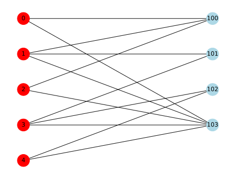

## ラプラシン行列、隣接行列、次数行列

推薦システムのモデル構築でしばしば利用される、ラプラシン行列、隣接行列、次数行列についてまとめる。
Pythonのネットワークライブラリ Networkx を利用して、具体的にこれらの行列を計算する。

これらはグラフ理論やグラフスペクトル理論でも頻出の行列で、とても重要な概念である。

### ラプラシアン行列 (Laplacian Matrix)

ラプラシアン行列は、グラフの構造を表すために使用されます。

- 定義: ラプラシアン行列は、次数行列（D）から隣接行列（A）を引いたものです。つまり、$\mathbf{L} = \mathbf{D} - \mathbf{A}$。
- 特徴: ラプラシアン行列の各要素は、対角要素がそのノードの次数であり、非対角要素は、ノード間の接続の有無に基づいて-1または0です（接続がある場合は-1、ない場合は0）。
- 用途: ネットワークの接続性やクラスタリング、スペクトルグラフ理論などに使用されます。


### 隣接行列 (Adjacency Matrix)

隣接行列は、グラフ内のノード間の接続関係を表します。

- 定義: グラフの各ノードを行と列に対応させ、ノード間の接続がある場合（エッジが存在する場合）には1を、ない場合には0を配置した行列。
- 特徴: 隣接行列は、グラフのエッジの情報を直接的に表すために使用されます。
- 用途: ネットワーク分析、グラフの特性を理解するため、または推薦システムにおけるユーザー間やアイテム間の関連性をモデリングする際に用いられます。


### 次数行列 (Degree Matrix)

次数行列は、グラフ内の各ノードの次数（つながりの数）を表します。

- 定義: 対角行列で、各対角要素はグラフの対応するノードの次数を示します。
- 特徴: 非対角要素はすべて0です。対角要素は、そのノードに接続するエッジの数を示します。
- 用途: ラプラシアン行列を構成する際や、ネットワークの特性を分析する際に使用されます。


これらの行列は、グラフの特性を理解し、ネットワーク内でのパターンや関係性を分析するための基本的なツールです。特に推薦システムでは、ユーザーとアイテム間の関係性をモデル化する際にこれらの概念が重要になります。


### github
- jupyter notebook形式のファイルは[こちら](https://github.com/hiroshi0530/wa-src/blob/master/rec/graph/01/01_nb.ipynb)

### google colaboratory
- google colaboratory で実行する場合は[こちら](https://colab.research.google.com/github/hiroshi0530/wa-src/blob/master/rec/graph/01/01_nb.ipynb)

### 筆者の環境


```python
!sw_vers
```

    ProductName:		macOS
    ProductVersion:		13.5.1
    BuildVersion:		22G90


```python
!python -V
```

    Python 3.9.12


基本的なライブラリをインポートしそのバージョンを確認しておきます。
学習をpytorchを利用し、ネットワーク関係はnetworkxを利用する。


```python
%matplotlib inline
%config InlineBackend.figure_format = 'svg'

import json
import math
import numpy as np
import matplotlib.pyplot as plt

import networkx as nx

import torch
import torch.nn.functional as F
import torch.optim as optim
import torch.nn as nn

import matplotlib

import scipy

scipy.__version__

print('matplotlib  : {}'.format(matplotlib.__version__))
print('networkdx   : {}'.format(nx.__version__))
print('numpy       : {}'.format(np.__version__))
print('torch       : {}'.format(torch.__version__))
print('scipy       : {}'.format(scipy.__version__))
```

    matplotlib  : 3.8.1
    networkdx   : 3.1
    numpy       : 1.25.2
    torch       : 2.0.1
    scipy       : 1.11.2


## 二部グラフの作成、L、A、D、正規化行列の計算

わかりやすく、小さなグラフで作成する

$$
R_{u, i}=\left\lbrace\begin{array}{lr}
1, & \text { if }(u, i) \text { interaction is observed } \\
0, & \text { otherwise }
\end{array}\right.
$$


$$
\begin{array}{|l|r|r|r|r|}
\hline & \text{ item1 } & \text{ item2 } & \text{ item3 } & \text{ item4 } \\
\hline \text{ user1 } & 0 & 1 & 0 & 0 \\
\hline \text{ user2 } & 0 & 0 & 1 & 1 \\
\hline \text{ user3 } & 1 & 0 & 0 & 0 \\
\hline \text{ user4 } & 0 & 1 & 0 & 0 \\
\hline \text{ user5 } & 1 & 0 & 1 & 0 \\
\hline
\end{array}
$$


```python
np.random.seed(seed=16)
np.set_printoptions(threshold=10000000)

B = nx.Graph()

user_num = 5
item_num = 4

user_nodes = [i for i in range(user_num)]
item_nodes = [i for i in range(100, 100 + item_num)]

B.add_nodes_from(user_nodes, bipartite=0)
B.add_nodes_from(item_nodes, bipartite=1)

node_color = []
node_size = [600 for i in range(user_num + item_num)]

for u in user_nodes:
    node_color.append("red")
for i in item_nodes:
    node_color.append("lightblue")

edge_nodes = []
pos = {}
for _i, u in enumerate(user_nodes):
    pos[u] = np.array([-1, -1.75 * _i])
    for _j, i in enumerate(item_nodes):
        pos[i] = np.array([1, -1.75 * _j])
        if np.random.random() < 0.45:
            edge_nodes.append((u, i))

B.add_edges_from(edge_nodes)

nx.draw(B, pos=pos, with_labels=True, node_color=node_color, node_size=node_size)

plt.show()
```


    

    


```python
edge_nodes
```


    [(0, 100),
     (0, 103),
     (1, 100),
     (1, 101),
     (1, 103),
     (2, 100),
     (2, 103),
     (3, 101),
     (3, 102),
     (3, 103),
     (4, 102),
     (4, 103)]


```python
dir(nx.adjacency_matrix(B))
print(nx.adjacency_matrix(B))
```

      (0, 5)	1
      (0, 8)	1
      (1, 5)	1
      (1, 6)	1
      (1, 8)	1
      (2, 5)	1
      (2, 8)	1
      (3, 6)	1
      (3, 7)	1
      (3, 8)	1
      (4, 7)	1
      (4, 8)	1
      (5, 0)	1
      (5, 1)	1
      (5, 2)	1
      (6, 1)	1
      (6, 3)	1
      (7, 3)	1
      (7, 4)	1
      (8, 0)	1
      (8, 1)	1
      (8, 2)	1
      (8, 3)	1
      (8, 4)	1


```python
A = np.array(nx.adjacency_matrix(B).todense())
L = np.array(nx.laplacian_matrix(B).todense())
D = L + A
A
```


    array([[0, 0, 0, 0, 0, 1, 0, 0, 1],
           [0, 0, 0, 0, 0, 1, 1, 0, 1],
           [0, 0, 0, 0, 0, 1, 0, 0, 1],
           [0, 0, 0, 0, 0, 0, 1, 1, 1],
           [0, 0, 0, 0, 0, 0, 0, 1, 1],
           [1, 1, 1, 0, 0, 0, 0, 0, 0],
           [0, 1, 0, 1, 0, 0, 0, 0, 0],
           [0, 0, 0, 1, 1, 0, 0, 0, 0],
           [1, 1, 1, 1, 1, 0, 0, 0, 0]])


```python
R = A[0:user_num, user_num:]
R
```


    array([[1, 0, 0, 1],
           [1, 1, 0, 1],
           [1, 0, 0, 1]])


```python
D_I = np.sum(R, axis=0)
D_I
```


    array([3, 1, 0, 3])


```python
D_U = np.sum(R, axis=1)
D_U
```


    array([2, 3, 2], dtype=int64)


```python
R_hat = np.diag(np.power(D_U + 1e-15, -1 / 2)) @ R @ np.diag(np.power(D_I + 1e-15, -1 / 2))
R_hat.round(2)
```


    array([[0.41, 0.  , 0.  , 0.41],
           [0.33, 0.58, 0.  , 0.33],
           [0.41, 0.  , 0.  , 0.41]])


```python
A_hat = np.block([[A[:user_num, :user_num], R_hat], [R_hat.T, A[user_num:, user_num:]]])
A_hat.round(2)
```


    array([[0.  , 0.  , 0.  , 0.41, 0.  , 0.  , 0.41],
           [0.  , 0.  , 0.  , 0.33, 0.58, 0.  , 0.33],
           [0.  , 0.  , 0.  , 0.41, 0.  , 0.  , 0.41],
           [0.41, 0.33, 0.41, 0.  , 0.  , 0.  , 0.  ],
           [0.  , 0.58, 0.  , 0.  , 0.  , 0.  , 0.  ],
           [0.  , 0.  , 0.  , 0.  , 0.  , 0.  , 0.  ],
           [0.41, 0.33, 0.41, 0.  , 0.  , 0.  , 0.  ]])


```python
# user-user 正規化隣接行列
P_item_hat = R_hat @ R_hat.T
P_item_hat.round(2)
```


    array([[0.33, 0.27, 0.33],
           [0.27, 0.56, 0.27],
           [0.33, 0.27, 0.33]])


```python
# item-item 正規化隣接行列
P_user_hat = R_hat.T @ R_hat
P_user_hat.round(2)
```


    array([[0.44, 0.19, 0.  , 0.44],
           [0.19, 0.33, 0.  , 0.19],
           [0.  , 0.  , 0.  , 0.  ],
           [0.44, 0.19, 0.  , 0.44]])


レコメンドにおけるグラフは、通常2部グラフとして表現されます。

$$
\tilde{R}=D_{U}^{-\frac{1}{2}} R D_{I}^{-\frac{1}{2}}
$$

networkxにはグラフラプラシアン$L$を求める関数が酔いされています。
$$
L=D-A
$$

次数行列は以下の様に求める事が出来ます。

$$
D = L + A
$$

## グラフラプラシアンの正規化

$$
\tilde{L}=I-\tilde{A}
$$

$$
\Delta f=\frac{\partial^{2} f}{\partial x^{2}}+\frac{\partial^{2} f}{\partial y^{2}}+\frac{\partial^{2} f}{\partial z^{2}}
$$

$$
\Delta h_{\omega}(x)=\lambda_{\omega} h_{\omega}(x)
$$

$$
h_{\omega}(x)=e^{i \omega x}
$$

$$
g(t) * f(t)=\sum_{\tau} g(\tau) f(t-\tau)
$$

$$
F[g(t) * f(t)]=F[g(t)] F[f(t)]
$$

$$
\begin{gathered}
\hat{\mathbf{x}}=\mathbf{U}^{T} \mathbf{x} \\
\mathbf{x}=\mathbf{U} \widehat{\mathbf{x}}
\end{gathered}
$$

$$
\mathcal{H}(\boldsymbol{L})=\operatorname{UDiag}\left(h\left(\lambda_{1}\right), \cdots, h\left(\lambda_{n}\right)\right) U^{T}
$$


```python

```


```python

```


```python
import torch
from torch.utils.data import DataLoader, Dataset

from SVDppRecommender import SVDpp


class RateDataset(Dataset):
    def __init__(self, user_tensor, item_tensor, target_tensor):
        self.user_tensor = user_tensor
        self.item_tensor = item_tensor
        self.target_tensor = target_tensor

    def __getitem__(self, index):
        return self.user_tensor[index], self.item_tensor[index], self.target_tensor[index]

    def __len__(self):
        return self.user_tensor.size(0)


data = {
    (0, 0): 4,
    (0, 1): 5,
    (0, 2): 3,
    (0, 3): 4,
    (1, 0): 5,
    (1, 1): 3,
    (1, 2): 4,
    (1, 3): 1,
    (2, 0): 3,
    (2, 1): 2,
    (2, 2): 5,
    (2, 3): 5,
    (3, 0): 4,
    (3, 1): 2,
    (3, 2): 3,
    (3, 3): 1,
}
Iu = {key: [0, 1, 2, 3] for key in range(4)}

user_tensor = torch.LongTensor([key[0] for key in data.keys()])
item_tensor = torch.LongTensor([key[1] for key in data.keys()])
rating_tensor = torch.FloatTensor([val for val in data.values()])

params = {"num_users": 4, "num_items": 4, "global_mean": 3, "latent_dim": 10}

model = SVDpp(params)
criterion = torch.nn.MSELoss()
optimizer = torch.optim.SGD(model.parameters(), lr=0.01, momentum=0.9)

dataset = RateDataset(user_tensor, item_tensor, rating_tensor)
train_loader = DataLoader(dataset, batch_size=10, shuffle=True)

for epoch in range(30):
    for bid, batch in enumerate(train_loader):
        u, i, r = batch[0], batch[1], batch[2]
        r = r.float()
        # forward pass
        preds = model(u, i, Iu)
        loss = criterion(preds, r)

        # backward and optimize
        optimizer.zero_grad()
        loss.backward()
        optimizer.step()

    print("Epoch [{}/30], Loss: {:.4f}".format(epoch + 1, loss.item()))
```


    ---------------------------------------------------------------------------

    ModuleNotFoundError                       Traceback (most recent call last)

    セル56 を /Users/83005814_mac/private/wa_src/rec/gcn/01/base_nb.ipynb in <cell line: 4>()
          <a href='vscode-notebook-cell:/Users/83005814_mac/private/wa_src/rec/gcn/01/base_nb.ipynb#ch0000055?line=0'>1</a> import torch
          <a href='vscode-notebook-cell:/Users/83005814_mac/private/wa_src/rec/gcn/01/base_nb.ipynb#ch0000055?line=1'>2</a> from torch.utils.data import DataLoader, Dataset
    ----> <a href='vscode-notebook-cell:/Users/83005814_mac/private/wa_src/rec/gcn/01/base_nb.ipynb#ch0000055?line=3'>4</a> from SVDppRecommender import SVDpp
          <a href='vscode-notebook-cell:/Users/83005814_mac/private/wa_src/rec/gcn/01/base_nb.ipynb#ch0000055?line=5'>6</a> class RateDataset(Dataset):
          <a href='vscode-notebook-cell:/Users/83005814_mac/private/wa_src/rec/gcn/01/base_nb.ipynb#ch0000055?line=6'>7</a>     def __init__(self, user_tensor, item_tensor, target_tensor):


    ModuleNotFoundError: No module named 'SVDppRecommender'


```python
import numpy as np

X = np.array([[1, 1], [2, 1], [3, 1.2], [4, 1], [5, 0.8], [6, 1]])
from sklearn.decomposition import NMF

model = NMF(n_components=2, init="random", random_state=0)
W = model.fit_transform(A_hat)
H = model.components_
```


```python
X
```


    array([[1. , 1. ],
           [2. , 1. ],
           [3. , 1.2],
           [4. , 1. ],
           [5. , 0.8],
           [6. , 1. ]])


```python
W
```


    array([[1.55391099e-11, 3.40767530e-01],
           [0.00000000e+00, 4.17373793e-01],
           [1.55391099e-11, 3.40767530e-01],
           [5.83954597e-01, 0.00000000e+00],
           [3.37146309e-01, 0.00000000e+00],
           [0.00000000e+00, 0.00000000e+00],
           [5.83954597e-01, 0.00000000e+00]])


```python
H
```


    array([[5.99236855e-01, 7.33912241e-01, 5.99236855e-01, 2.27854326e-12,
            0.00000000e+00, 0.00000000e+00, 2.27854326e-12],
           [0.00000000e+00, 0.00000000e+00, 0.00000000e+00, 1.02685282e+00,
            5.92873174e-01, 0.00000000e+00, 1.02685282e+00]])


```python
np.dot(W, H).round(2)
```


    array([[0.  , 0.  , 0.  , 0.35, 0.2 , 0.  , 0.35],
           [0.  , 0.  , 0.  , 0.43, 0.25, 0.  , 0.43],
           [0.  , 0.  , 0.  , 0.35, 0.2 , 0.  , 0.35],
           [0.35, 0.43, 0.35, 0.  , 0.  , 0.  , 0.  ],
           [0.2 , 0.25, 0.2 , 0.  , 0.  , 0.  , 0.  ],
           [0.  , 0.  , 0.  , 0.  , 0.  , 0.  , 0.  ],
           [0.35, 0.43, 0.35, 0.  , 0.  , 0.  , 0.  ]])


```python
a = "test"
```


```python

```


```python

```
