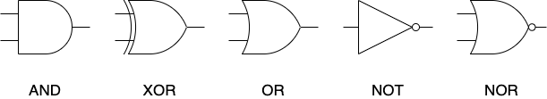
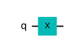
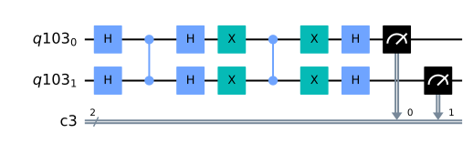
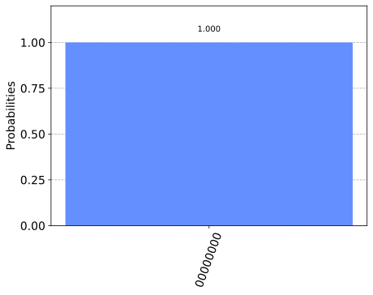
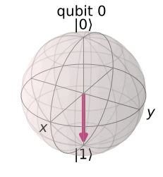
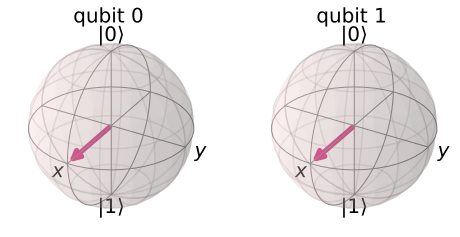

## qiskit

qiskitを利用して、量子アルゴリズムについて自分なりに勉強していこうと思います。

### github
- jupyter notebook形式のファイルは[こちら](https://github.com/hiroshi0530/wa-src/blob/master/ml/data100/05/05_nb.ipynb)

### google colaboratory
- google colaboratory で実行する場合は[こちら](https://colab.research.google.com/github/hiroshi0530/wa-src/blob/master/ml/data100/05/05_nb.ipynb)

### 筆者の環境


```python
!sw_vers
```

    ProductName:	Mac OS X
    ProductVersion:	10.14.6
    BuildVersion:	18G103


```python
!python -V
```

    Python 3.8.5


基本的なライブラリをインポートしそのバージョンを確認しておきます。


```python
%matplotlib inline
%config InlineBackend.figure_format = 'svg'

import matplotlib
import matplotlib.pyplot as plt
import scipy
import numpy as np
import pandas as pd

print('matplotlib version :', matplotlib.__version__)
print('scipy version :', scipy.__version__)
print('numpy version :', np.__version__)
print('pandas version :', pd.__version__)
```

    matplotlib version : 3.3.2
    scipy version : 1.5.2
    numpy version : 1.19.2
    pandas version : 1.1.3


```python
import qiskit
qiskit.__qiskit_version__
```


    {'qiskit-terra': '0.17.4', 'qiskit-aer': '0.8.2', 'qiskit-ignis': '0.6.0', 'qiskit-ibmq-provider': '0.13.1', 'qiskit-aqua': '0.9.1', 'qiskit': '0.26.2', 'qiskit-nature': None, 'qiskit-finance': None, 'qiskit-optimization': None, 'qiskit-machine-learning': None}


```python
from qiskit import QuantumCircuit, ClassicalRegister, QuantumRegister
from qiskit import Aer, execute
from qiskit.visualization import plot_histogram
```


```python

```

## 単一の量子ビット

単一の量子ビットは以下の様に表現できます。$\theta$、$\phi$は実数です。

$$
|q\rangle=\cos \left(\frac{\theta}{2}\right)|0\rangle+e^{i \phi} \sin \left(\frac{\theta}{2}\right)|1\rangle
$$


## 古典コンピュータのゲート
通常のロジック半導体は、



$$
\begin{array}{|c|c||c|}
\hline A & B & Z \\
\hline 0 & 0 & 0 \\
\hline 0 & 1 & 0 \\
\hline 1 & 0 & 0 \\
\hline 1 & 1 & 1 \\
\hline
\end{array}
$$

$$
\begin{array}{|c|c||c|}
\hline A & B & Z \\
\hline 0 & 0 & 0 \\
\hline 0 & 1 & 1 \\
\hline 1 & 0 & 1 \\
\hline 1 & 1 & 1 \\
\hline
\end{array}
$$

$$
\begin{array}{|c||c|}
\hline A & Z \\
\hline 0 & 1 \\
\hline 1 & 0 \\
\hline
\end{array}
$$

$$
\begin{array}{|c|c||c|}
\hline A & B & Z \\
\hline 0 & 0 & 1 \\
\hline 0 & 1 & 1 \\
\hline 1 & 0 & 1 \\
\hline 1 & 1 & 0 \\
\hline
\end{array}
$$

$$
\begin{array}{|c|c||c|}
\hline A & B & Z \\
\hline 0 & 0 & 1 \\
\hline 0 & 1 & 0 \\
\hline 1 & 0 & 0 \\
\hline 1 & 1 & 0 \\
\hline
\end{array}
$$

$$
\begin{array}{|c|c||c|}
\hline A & B & Z \\
\hline 0 & 0 & 0 \\
\hline 0 & 1 & 1 \\
\hline 1 & 0 & 1 \\
\hline 1 & 1 & 0 \\
\hline
\end{array}
$$

## パウリ行列

$$
X=\left(\begin{array}{ll}
0 & 1 \\
1 & 0
\end{array}\right)=|0\rangle\langle 1|+| 1\rangle\langle 0|
$$

$$
X|0\rangle=\left(\begin{array}{ll}
0 & 1 \\
1 & 0
\end{array}\right)\left(\begin{array}{l}
1 \\
0
\end{array}\right)=\left(\begin{array}{l}
0 \\
1
\end{array}\right)=|1\rangle
$$

$$
X|1\rangle=\left(\begin{array}{ll}
0 & 1 \\
1 & 0
\end{array}\right)\left(\begin{array}{l}
0 \\
1
\end{array}\right)=\left(\begin{array}{l}
1 \\
0
\end{array}\right)=|0\rangle
$$


```python

```

$$
|00\rangle=|0\rangle|0\rangle=|0\rangle \otimes|0\rangle=\left(\begin{array}{l}
1 \times\left(\begin{array}{l}
1 \\
0
\end{array}\right) \\
0 \times\left(\begin{array}{l}
1 \\
0
\end{array}\right)
\end{array}\right)=\left(\begin{array}{l}
1 \\
0 \\
0 \\
0
\end{array}\right)
$$


```python

```


```python
# |0> 量子ビットに対してゲート作用させてみましょう。
qc = QuantumCircuit(1)
qc.x(0)
qc.draw('mpl')
```


    

    


```python
# 結果を見てみましょう
backend = Aer.get_backend('statevector_simulator')
out = execute(qc,backend).result().get_statevector()
plot_bloch_multivector(out)
```


    

    


```python

```


```python

```


```python

cr = ClassicalRegister(2)
```


```python

```


```python
# 量子ビット、古典ビットの準備
qr = QuantumRegister(2)
cr = ClassicalRegister(2)

# 量子回路初期化
qc = QuantumCircuit(qr,cr)

# オラクル(|11>を反転)
qc.h(qr)
qc.cz(qr[0],qr[1])
qc.h(qr)

# 振幅増幅
qc.x(qr)
qc.cz(qr[0],qr[1])
qc.x(qr)
qc.h(qr)

# 測定
qc.measure(qr,cr)
```


    <qiskit.circuit.instructionset.InstructionSet at 0x130a87280>


```python
qc.draw(output='mpl')
```


    

    


$ |q\rangle = \cos{\tfrac{\theta}{2}}|0\rangle + e^{i\phi}\sin{\tfrac{\theta}{2}}|1\rangle $

$$
|+++\rangle=\frac{1}{\sqrt{8}}\left[\begin{array}{l}
1 \\
1 \\
1 \\
1 \\
1 \\
1 \\
1 \\
1
\end{array}\right]
$$


```python

```


```python

```

$$
|b a\rangle=|b\rangle \otimes|a\rangle=\left[\begin{array}{l}
b_{0} \times\left[\begin{array}{l}
a_{0} \\
a_{1}
\end{array}\right] \\
b_{1} \times\left[\begin{array}{l}
a_{0} \\
a_{1}
\end{array}\right]
\end{array}\right]=\left[\begin{array}{l}
b_{0} a_{0} \\
b_{0} a_{1} \\
b_{1} a_{0} \\
b_{1} a_{1}
\end{array}\right]
$$


```python

```


```python
from qiskit import QuantumCircuit, execute, Aer
from qiskit.visualization import plot_histogram
```


```python
from qiskit_textbook.widgets import binary_widget
binary_widget(nbits=5)
```


    VBox(children=(Label(value='Toggle the bits below to change the binary number.'), Label(value='Think of a numb…


    HTML(value='<pre>Binary   Decimal\n 00000 = 0</pre>')


```python
n = 8
n_q = n
n_b = n
qc_output = QuantumCircuit(n_q,n_b)
```


```python
for j in range(n):
    qc_output.measure(j,j)
```


```python
qc_output.draw()
```


<pre style="word-wrap: normal;white-space: pre;background: #fff0;line-height: 1.1;font-family: &quot;Courier New&quot;,Courier,monospace">     ┌─┐                     
q_0: ┤M├─────────────────────
     └╥┘┌─┐                  
q_1: ─╫─┤M├──────────────────
      ║ └╥┘┌─┐               
q_2: ─╫──╫─┤M├───────────────
      ║  ║ └╥┘┌─┐            
q_3: ─╫──╫──╫─┤M├────────────
      ║  ║  ║ └╥┘┌─┐         
q_4: ─╫──╫──╫──╫─┤M├─────────
      ║  ║  ║  ║ └╥┘┌─┐      
q_5: ─╫──╫──╫──╫──╫─┤M├──────
      ║  ║  ║  ║  ║ └╥┘┌─┐   
q_6: ─╫──╫──╫──╫──╫──╫─┤M├───
      ║  ║  ║  ║  ║  ║ └╥┘┌─┐
q_7: ─╫──╫──╫──╫──╫──╫──╫─┤M├
      ║  ║  ║  ║  ║  ║  ║ └╥┘
c: 8/═╩══╩══╩══╩══╩══╩══╩══╩═
      0  1  2  3  4  5  6  7 </pre>


```python
counts = execute(qc_output,Aer.get_backend('qasm_simulator')).result().get_counts()
plot_histogram(counts)
```


    

    


```python
from qiskit_textbook.widgets import bloch_calc
bloch_calc()
```


    VBox(children=(Label(value='Define a qubit state using $\\theta$ and $\\phi$:'), Text(value='', placeholder='T…


    HTML(value='<pre></pre>')


    Image(value=b'\x89PNG\r\n\x1a\n\x00\x00\x00\rIHDR\x00\x00\x01h\x00\x00\x01h\x08\x06\x00\x00\x00z\xe5a\xd5\x00\…


```python

```


```python
qc = QuantumCircuit(1)
qc.x(0)
qc.draw('mpl')
```


    

    


```python
from qiskit import *
from math import pi
from qiskit.visualization import plot_bloch_multivector

# 結果を見てみましょう
backend = Aer.get_backend('statevector_simulator')
out = execute(qc,backend).result().get_statevector()
plot_bloch_multivector(out)
```


    

    


```python

```

$|ba\rangle = |b\rangle \otimes |a\rangle = \begin{bmatrix} b_0 \times \begin{bmatrix} a_0 \\ a_1 \end{bmatrix} \\ b_1 \times \begin{bmatrix} a_0 \\ a_1 \end{bmatrix} \end{bmatrix} = \begin{bmatrix} b_0 a_0 \\ b_0 a_1 \\ b_1 a_0 \\ b_1 a_1 \end{bmatrix}$


```python

```


```python
# このセルのコードを実行してウィジェットを表示します。
from qiskit_textbook.widgets import gate_demo
gate_demo(gates='pauli+h')
```


    HBox(children=(Button(description='X', layout=Layout(height='3em', width='3em'), style=ButtonStyle()), Button(…


    Image(value=b'\x89PNG\r\n\x1a\n\x00\x00\x00\rIHDR\x00\x00\x01 \x00\x00\x01 \x08\x06\x00\x00\x00\x14\x83\xae\x8…


```python
from qiskit.extensions import Initialize # Inititialize機能をインポートします。
# X測定関数を作成します。
def x_measurement(qc,qubit,cbit):
    """Measure 'qubit' in the X-basis, and store the result in 'cbit'"""
    qc.h(qubit)
    qc.measure(qubit, cbit)
    qc.h(qubit)
    return qc

# 量子ビットを初期化して測定します。
qc = QuantumCircuit(1,1)
initial_state = [0,1]
initialize_qubit = Initialize(initial_state)
qc.append(initialize_qubit, [0])
x_measurement(qc, 0, 0)
qc.draw()
```


<pre style="word-wrap: normal;white-space: pre;background: #fff0;line-height: 1.1;font-family: &quot;Courier New&quot;,Courier,monospace">     ┌─────────────────┐┌───┐┌─┐┌───┐
q_0: ┤ initialize(0,1) ├┤ H ├┤M├┤ H ├
     └─────────────────┘└───┘└╥┘└───┘
c: 1/═════════════════════════╩══════
                              0      </pre>


```python

```

$$
\|\mathbf{x}\|_{p}=\left(\sum_{i=1}^{n}\left|x_{i}\right|^{p}\right)^{\frac{1}{p}}
$$

$ X\otimes H = \begin{bmatrix} 0 & 1 \\ 1 & 0 \end{bmatrix} \otimes \tfrac{1}{\sqrt{2}}\begin{bmatrix} 1 & 1 \\ 1 & -1 \end{bmatrix} = \frac{1}{\sqrt{2}}
\begin{bmatrix} 0 \times \begin{bmatrix} 1 & 1 \\ 1 & -1 \end{bmatrix}
              & 1 \times \begin{bmatrix} 1 & 1 \\ 1 & -1 \end{bmatrix}
                \\ 
                1 \times \begin{bmatrix} 1 & 1 \\ 1 & -1 \end{bmatrix}
              & 0 \times \begin{bmatrix} 1 & 1 \\ 1 & -1 \end{bmatrix}
\end{bmatrix} = \frac{1}{\sqrt{2}}
\begin{bmatrix} 0 & 0 & 1 & 1 \\
                0 & 0 & 1 & -1 \\
                1 & 1 & 0 & 0 \\
                1 & -1 & 0 & 0 \\
\end{bmatrix} $


```python
from qiskit_textbook.tools import array_to_latex
```


```python
qc = QuantumCircuit(2)
qc.h(0)
qc.h(1)
qc.cx(0,1)
display(qc.draw())

# Let's see the result
statevector_backend = Aer.get_backend('statevector_simulator')
final_state = execute(qc,statevector_backend).result().get_statevector()
array_to_latex(final_state, pretext="\\text{Statevector} = ", precision=1)
plot_bloch_multivector(final_state)
```


<pre style="word-wrap: normal;white-space: pre;background: #fff0;line-height: 1.1;font-family: &quot;Courier New&quot;,Courier,monospace">     ┌───┐     
q_0: ┤ H ├──■──
     ├───┤┌─┴─┐
q_1: ┤ H ├┤ X ├
     └───┘└───┘</pre>


$\displaystyle 
\text{Statevector} = \begin{bmatrix}
\tfrac{1}{2} \\
\tfrac{1}{2} \\
\tfrac{1}{2} \\
\tfrac{1}{2}
\end{bmatrix}
$


    

    


```python

```

$$ \int f(x) dx$$

$$
\lambda=\frac{(2 \pi) \times 1.97 \times 10^{3} \mathrm{eV} \cdot \angstrom}{\sqrt{2 \times 0.511 \times 10^{6} \mathrm{eV} \times V \cdot \mathrm{eV}}}=\frac{12.3}{\sqrt{V}} \AA
$$

$$
\begin{aligned}
\frac{1}{\sqrt{2^{n}}} \sum_{k=0}^{2^{n}-1} \exp \left(i \frac{2 \pi k j}{2^{n}}\right)|k\rangle &=\frac{1}{\sqrt{2^{n}}} \sum_{k_{0}=0,1} \sum_{k_{1}=0,1} \cdots \sum_{k_{n-1}=0,1} \exp \left(i \frac{2 \pi j}{2^{n}} \sum_{l=0}^{n-1} k_{l} 2^{l}\right)\left|k_{n-1} \cdots k_{0}\right\rangle \\
&=\frac{1}{\sqrt{2^{n}}} \sum_{k_{0}=0,1} \sum_{k_{1}=0,1} \cdots \sum_{k_{n-1}=0,1} \prod_{l=0}^{n-1} \exp \left(i 2 \pi j k_{l} 2^{l-n}\right)\left|k_{l}\right\rangle \\
&=\frac{1}{\sqrt{2^{n}}} \prod_{l=0}^{n-1}\left(\sum_{k_{l}=0,1} \exp \left(i 2 \pi j k_{l} 2^{l-n}\right)\left|k_{l}\right\rangle\right) \\
&=\frac{1}{\sqrt{2^{n}}} \prod_{l=0}^{n-1}\left(|0\rangle+\exp \left(i 2 \pi j 2^{l-n}\right)|1\rangle\right) \\
&=\frac{1}{\sqrt{2^{n}}} \prod_{l=0}^{n-1}\left(|0\rangle+\exp \left(i 2 \pi 0 . j_{n-1-l} \cdots j_{0}\right)|1\rangle\right) \\
&=\frac{1}{\sqrt{2^{n}}}\left(|0\rangle+e^{i 2 \pi 0 . j_{0}}|1\rangle\right)\left(|0\rangle+e^{i 2 \pi 0 . j_{1} j_{0}}|1\rangle\right) \cdots\left(|0\rangle+e^{i 2 \pi 0 . j_{n-1} j_{n-2} \cdots j_{0}}|1\rangle\right)
\end{aligned}
$$

$$
|x\rangle=\sum_{i_{1} \ldots i_{k}=0}^{1} x_{i_{1}, \ldots, i_{n}}\left|i_{1}, \ldots, i,\right\rangle \in \underbrace{\mathbf{C}^{2} \otimes \cdots \otimes \mathbf{C}^{2}}_{, 1}
$$

$$
\frac{\partial^{2} u}{\partial t^{2}}=c^{2}\left(\frac{\partial^{2} u}{\partial \xi^{2}}-2 \frac{\partial^{2} u}{\partial \xi \partial \eta}+\frac{\partial^{2} u}{\partial \eta^{2}}\right)
$$


```python

```


```python

```


```python
import numpy as np
import sympy as sp
import pandas as pd
import matplotlib.pyplot as plt
```


```python
plt.style.use('ggplot')
```


```python
sp.init_printing()
```


```python
_x = sp.Symbol('x')
```


```python
_x
```


$\displaystyle x$


```python
y = _x ** 2 + 3 * _x + 1
```


```python
y
```


$\displaystyle x^{2} + 3 x + 1$


```python
sp.diff(y, _x)
```


$\displaystyle 2 x + 3$


```python

```


```python

```
