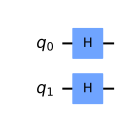
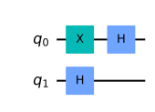
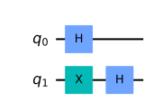
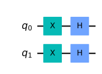

## 2量子ビット

qiskitを利用して、量子アルゴリズムについて自分なりに勉強していこうと思います。
個人的な勉強の記録なので、説明などを大幅に省いている可能性があります。

qiskitのウェブサイト通りに勉強を進めています。

- https://qiskit.org/textbook/ja/ch-algorithms/deutsch-jozsa.html

今回は、ドイチ-ジョサのアルゴリズムを数式を追って理解を深めようと思います。

私の勉強不足ですが、学生時代、量子情報を勉強した際はドイチ-ジョサのアルゴリズムというのは知りませんでした。ショアのアルゴリズムなどと比較すると有名ではないのかもしれませんが、qiskitのサイトに寄ると、古典アルゴリズムよりも優れたパフォーマンスを持つと発表された最初の量子アルゴリズムという事で、理解は必須のような気がしています。

### github
- jupyter notebook形式のファイルは[こちら](https://github.com/hiroshi0530/wa-src/blob/master/rec/qiskit/base3/base_nb.ipynb)

### google colaboratory
- google colaboratory で実行する場合は[こちら](https://colab.research.google.com/github/hiroshi0530/wa-src/blob/master/rec/qiskit/base3/base_nb.ipynb)

### 筆者の環境


```python
!sw_vers
```

    ProductName:	Mac OS X
    ProductVersion:	10.14.6
    BuildVersion:	18G103


```python
!python -V
```

    Python 3.8.5


基本的なライブラリをインポートしそのバージョンを確認しておきます。


```python
%matplotlib inline
%config InlineBackend.figure_format = 'svg'

import matplotlib
import matplotlib.pyplot as plt
import scipy
import numpy as np
import pandas as pd

print('matplotlib version :', matplotlib.__version__)
print('scipy version :', scipy.__version__)
print('numpy version :', np.__version__)
print('pandas version :', pd.__version__)
```

    matplotlib version : 3.3.2
    scipy version : 1.5.2
    numpy version : 1.19.2
    pandas version : 1.1.3


```python
import qiskit
import json

dict(qiskit.__qiskit_version__)
```


    {'qiskit-terra': '0.17.4',
     'qiskit-aer': '0.8.2',
     'qiskit-ignis': '0.6.0',
     'qiskit-ibmq-provider': '0.13.1',
     'qiskit-aqua': '0.9.1',
     'qiskit': '0.26.2',
     'qiskit-nature': None,
     'qiskit-finance': None,
     'qiskit-optimization': None,
     'qiskit-machine-learning': None}


```python
from qiskit import IBMQ, Aer, execute
from qiskit.providers.ibmq import least_busy
from qiskit import QuantumCircuit, assemble, transpile

from qiskit.visualization import plot_histogram
from qiskit_textbook.tools import array_to_latex
```

## 問題設定

ドイチ-ジョサ問題はビット列を入力として、0か1を返すと、いう関数を考え、その関数が、定数型か、分布型に限定される場合、どちらの型の関数を決定する問題になります。定数型の場合は、どのような入力でも0か1のどちらかを返し、分布型の場合は、半分の入力に対して0を返し、残りの半分の入力に対しては1を返します。

簡単に考えると、1回目の試行で0が出て、2回目の試行で1が出れば分布型であると分かりますが、2回目も0の場合、決定することが出来ずに再度試行を重ねることになります。

量子コンピュータを利用して、ドイチ-ジョサアルゴリズムを適用すると、$f(x)$を一度実行させるだけでどちらの型かを決定することが出来るというものです。

$$
\left|\psi_{0}\right\rangle=|0\rangle^{\otimes n}|1\rangle
$$

$$
\left|\psi_{1}\right\rangle=\frac{1}{\sqrt{2^{n+1}}} \sum_{x=0}^{2^{n}-1}|x\rangle(|0\rangle-|1\rangle)
$$


```python

```


```python

```


```python

```


```python

```

$$
\begin{aligned}
\left|\psi_{2}\right\rangle &=\frac{1}{\sqrt{2^{n+1}}} \sum_{x=0}^{2^{n}-1}|x\rangle(|f(x)\rangle-|1 \oplus f(x)\rangle) \\
&=\frac{1}{\sqrt{2^{n+1}}} \sum_{x=0}^{2^{n}-1}(-1)^{f(x)}|x\rangle(|0\rangle-|1\rangle)
\end{aligned}
$$

$$
\begin{aligned}
\left|\psi_{3}\right\rangle &=\frac{1}{2^{n}} \sum_{x=0}^{2^{n}-1}(-1)^{f(x)}\left[\sum_{y=0}^{2^{n}-1}(-1)^{x \cdot y}|y\rangle\right] \\
&=\frac{1}{2^{n}} \sum_{y=0}^{2^{n}-1}\left[\sum_{x=0}^{2^{n}-1}(-1)^{f(x)}(-1)^{x \cdot y}\right]|y\rangle
\end{aligned}
$$


```python

```

$$
H^{\otimes n}\left[\begin{array}{l}
1 \\
0 \\
0 \\
\vdots \\
0
\end{array}\right]=\frac{1}{\sqrt{2^{n}}}\left[\begin{array}{c}
1 \\
1 \\
1 \\
\vdots \\
1
\end{array}\right] \stackrel{\text { after } U_{f}}{\longrightarrow} \quad H^{\otimes n} \frac{1}{\sqrt{2^{n}}}\left[\begin{array}{c}
1 \\
1 \\
1 \\
\vdots \\
1
\end{array}\right]=\left[\begin{array}{c}
1 \\
0 \\
0 \\
\vdots \\
0
\end{array}\right]
$$

$$
U_{f} \frac{1}{\sqrt{2^{n}}}\left[\begin{array}{c}
1 \\
1 \\
1 \\
\vdots \\
1
\end{array}\right]=\frac{1}{\sqrt{2^{n}}}\left[\begin{array}{c}
-1 \\
1 \\
-1 \\
\vdots \\
1
\end{array}\right]
$$


```python

```

## 複数ビットへのアダマールゲートを適用した際の表記

複数量子ビットへのアダマールゲートの演算に関して公式みたいなのがさらって出てきたので、簡単に実際に計算して確認してみます。

$$
\left|x\right\rangle \stackrel{H}{\rightarrow} \frac{1}{\sqrt{2^n}}\left(\sum_{y=0}^{2^{n}-1}(-1)^{x \cdot y}|y\rangle\right)
$$

ただし、$x \cdot y$はビット単位の積の和です。

$$
x \cdot y=x_{0} y_{0} \oplus x_{1} y_{1} \oplus \ldots \oplus x_{n-1} y_{n-1}
$$


### ビット表記

よくあるのですが、以下の様なシグマ記号を見ると、$|3\rangle$というのが出てくるのですが、これはビット表記に頭の中で変換する必要があります。

$$
\sum_{y=0}^{2^{n}-1}(-1)^{x \cdot y}|y\rangle
$$

ブラ記号の中に$x$が含まれる場合、以下の様な量子状態を意味します。

$$
|x\rangle = |x_nx_{n-1} \cdots x_2x_1x_0 \rangle
$$

$x_k$は0か1だけです。3量子ビットの具体的な表記としては以下の様になります。

$$
\begin{aligned}
&|0\rangle=|000\rangle \\
&|1\rangle=|001\rangle \\
&|2\rangle=|010\rangle \\
&|3\rangle=|011\rangle \\
&|4\rangle=|100\rangle \\
&|5\rangle=|101\rangle \\
&|6\rangle=|110\rangle \\
&|7\rangle=|111\rangle 
\end{aligned}
$$


### 確認


まず、１ビットから。

$$
\begin{aligned}
&|0\rangle \stackrel{H}{\rightarrow} \frac{1}{\sqrt{2}} \sum_{y=0}^{1}(-1)^{0 \cdot y}|y\rangle=\frac{1}{\sqrt{2}}(|0\rangle+|1\rangle) \\
&|1\rangle \stackrel{H}{\rightarrow} \frac{1}{\sqrt{2}} \sum_{y=0}^{1}(-1)^{1 \cdot y}|y\rangle=\frac{1}{\sqrt{2}}(|0\rangle-|1\rangle)
\end{aligned}
$$

１ビットはわかりやすいので、２ビットについても手計算してみます。答え合わせのためにqiskitも利用します。

まずは、$|00\rangle$からです。


```python
qc = QuantumCircuit(2)
qc.h(0)
qc.h(1)
qc.draw('mpl')
```


    

    


```python
backend = Aer.get_backend('statevector_simulator')
final_state = execute(qc,backend).result().get_statevector()
array_to_latex(final_state, pretext="\\text{Statevector} = ")
```


$\displaystyle 
\\text{Statevector} = \begin{bmatrix}
\tfrac{1}{2} \\
\tfrac{1}{2} \\
\tfrac{1}{2} \\
\tfrac{1}{2}
\end{bmatrix}
$


手計算してみます。

$$
\begin{aligned}
\mid 00) & \stackrel{H}{\rightarrow} \frac{1}{\sqrt{2^2}} \sum_{y=0}^{3}(-1)^{x \cdot y}|y\rangle \\
&=\frac{1}{\sqrt{2^{2}}} \sum_{y=0}^{3}(-1)^{x_{0} t_{0}+x_{1}, y_{1}}|y\rangle \\
&=\frac{1}{\sqrt{2^{2}}} \sum_{y=0}^{3}|y\rangle \\
&=\frac{1}{\sqrt{2^{2}}} \left(|00\rangle+|01\rangle+|10\rangle+|11\rangle\right)
\end{aligned}
$$

となり、一致していることが分かります。

$|01\rangle$です。


```python
qc = QuantumCircuit(2)
qc.x(0)
qc.h(0)
# qc.x(1)
qc.h(1)
qc.draw('mpl')
```


    

    


```python
backend = Aer.get_backend('statevector_simulator')
final_state = execute(qc,backend).result().get_statevector()
array_to_latex(final_state, pretext="\\text{Statevector} = ")
```


$\displaystyle 
\\text{Statevector} = \begin{bmatrix}
\tfrac{1}{2} \\
-\tfrac{1}{2} \\
\tfrac{1}{2} \\
-\tfrac{1}{2}
\end{bmatrix}
$


$$
\begin{aligned}
\mid 01) & \stackrel{H}{\rightarrow} \frac{1}{\sqrt{2^2}} \sum_{y=0}^{3}(-1)^{x \cdot y}|y\rangle \\
&=\frac{1}{\sqrt{2^{2}}} \sum_{y=0}^{3}(-1)^{x_{0} t_{0}+x_{1}, y_{1}}|y\rangle \\
&=\frac{1}{\sqrt{2^{2}}} \sum_{y=0}^{3}(-1)^{y_{0}}|y\rangle \\
&=\frac{1}{\sqrt{2^{2}}} \left(|00\rangle-|01\rangle+|10\rangle-|11\rangle\right)
\end{aligned}
$$
となり、こちらも一致しています。


$|10\rangle$です。


```python
qc = QuantumCircuit(2)
qc.x(1)
qc.h(0)
qc.h(1)
qc.draw('mpl')
```


    

    


```python
backend = Aer.get_backend('statevector_simulator')
final_state = execute(qc,backend).result().get_statevector()
array_to_latex(final_state, pretext="\\text{Statevector} = ")
```


$\displaystyle 
\\text{Statevector} = \begin{bmatrix}
\tfrac{1}{2} \\
\tfrac{1}{2} \\
-\tfrac{1}{2} \\
-\tfrac{1}{2}
\end{bmatrix}
$


$$
\begin{aligned}
\mid 10) & \stackrel{H}{\rightarrow} \frac{1}{\sqrt{2^2}} \sum_{y=0}^{3}(-1)^{x \cdot y}|y\rangle \\
&=\frac{1}{\sqrt{2^{2}}} \sum_{y=0}^{3}(-1)^{x_{0} t_{0}+x_{1}, y_{1}}|y\rangle \\
&=\frac{1}{\sqrt{2^{2}}} \sum_{y=0}^{3}(-1)^{y_{1}}|y\rangle \\
&=\frac{1}{\sqrt{2^{2}}} \left(|00\rangle+|01\rangle-|10\rangle-|11\rangle\right)
\end{aligned}
$$


$|11\rangle$です。


```python
qc = QuantumCircuit(2)
qc.x(0)
qc.h(0)
qc.x(1)
qc.h(1)
qc.draw('mpl')
```


    

    


```python
backend = Aer.get_backend('statevector_simulator')
final_state = execute(qc,backend).result().get_statevector()
array_to_latex(final_state, pretext="\\text{Statevector} = ")
```


$\displaystyle 
\\text{Statevector} = \begin{bmatrix}
\tfrac{1}{2} \\
-\tfrac{1}{2} \\
-\tfrac{1}{2} \\
\tfrac{1}{2}
\end{bmatrix}
$


$$
\begin{aligned}
\mid 11) & \stackrel{H}{\rightarrow} \frac{1}{\sqrt{2^2}} \sum_{y=0}^{3}(-1)^{x \cdot y}|y\rangle \\
&=\frac{1}{\sqrt{2^{2}}} \sum_{y=0}^{3}(-1)^{x_{0} y_{0}+x_{1}, y_{1}}|y\rangle \\
&=\frac{1}{\sqrt{2^{2}}} \sum_{y=0}^{3}(-1)^{y_{0} + y_{1}}|y\rangle \\
&=\frac{1}{\sqrt{2^{2}}} \left(|00\rangle-|01\rangle-|10\rangle+|11\rangle\right)
\end{aligned}
$$

となりこちらも一致しています。簡単にですが、braの中のビット表記とか少しややこしいですが、慣れるとそうでもないですね。


```python

```


```python

```


```python

```


```python

```

$$
\begin{aligned}
&|0\rangle \stackrel{H}{\rightarrow} \frac{1}{\sqrt{2}} \sum_{y=0}^{1}(-1)^{0 \cdot y}|y\rangle=\frac{1}{\sqrt{2}}(|0\rangle+|1\rangle) \\
&|1\rangle \stackrel{H}{\rightarrow} \frac{1}{\sqrt{2}} \sum_{y=0}^{1}(-1)^{1 \cdot y}|y\rangle=\frac{1}{\sqrt{2}}(|0\rangle-|1\rangle)
\end{aligned}
$$


```python

```


```python

```

こんなアルゴリズムを考える人はすごいですね。


```python

```


```python

```


```python
import numpy as np

A = np.array([[2, 2, 2, 2], [1, -1, 1, -1], [-1, 1, -1, 1]])
u, s, v = np.linalg.svd(A)
```


```python
u
```


    array([[ 1.        ,  0.        ,  0.        ],
           [ 0.        , -0.70710678,  0.70710678],
           [ 0.        ,  0.70710678,  0.70710678]])


```python
s
```


    array([4.00000000e+00, 2.82842712e+00, 2.10974835e-17])


```python
v
```


    array([[ 0.5       ,  0.5       ,  0.5       ,  0.5       ],
           [-0.5       ,  0.5       , -0.5       ,  0.5       ],
           [ 0.1860521 ,  0.68219104, -0.1860521 , -0.68219104],
           [ 0.68219104, -0.1860521 , -0.68219104,  0.1860521 ]])


```python
import numpy as np
import array_to_latex as a2l
A = np.array([[1.23456, 23.45678],[456.23, 8.239521]])
a2l.to_ltx(A, frmt = '{:6.2f}', arraytype = 'array')
```

    \begin{array}
        1.23 &   23.46\\
      456.23 &    8.24
    \end{array}


\begin{array}
    1.23 &   23.46\\
  456.23 &    8.24
\end{array}


```python
import numpy as np
import array_to_latex as a2l
A = np.array([[1.23456, 23.45678],[456.23, 8.239521]])
a2l.to_clp(A, frmt = '{:6.2f}', arraytype = 'array')
```

$$
\left(\begin{array}
    1.23 &   23.46\\
  456.23 &    8.24
\end{array}\right)
$$


```python


```


```python

```


```python
import pandas as pd
movielens = pd.read_csv(
  'http://files.grouplens.org/datasets/movielens/ml-100k/u.data', 
  sep='\t', header=None, index_col=None)

_ITEM_FEATURES = """
item_id | movie title | release date | 
video release date | IMDb URL | unknown | 
Action | Adventure | Animation | 
Children | Comedy | Crime | 
Documentary | Drama | Fantasy | 
Film-Noir | Horror | Musical | 
Mystery | Romance | Sci-Fi | 
Thriller | War | Western"""

# item_features = map(lambda f: f.replace('\n', '').replace(' ', '-').lower(), _ITEM_FEATURES.split(' | '))
# movielens.columns = item_features
movielens
```


<div>
<style scoped>
    .dataframe tbody tr th:only-of-type {
        vertical-align: middle;
    }

    .dataframe tbody tr th {
        vertical-align: top;
    }

    .dataframe thead th {
        text-align: right;
    }
</style>
<table border="1" class="dataframe">
  <thead>
    <tr style="text-align: right;">
      <th></th>
      <th>0</th>
      <th>1</th>
      <th>2</th>
      <th>3</th>
    </tr>
  </thead>
  <tbody>
    <tr>
      <th>0</th>
      <td>196</td>
      <td>242</td>
      <td>3</td>
      <td>881250949</td>
    </tr>
    <tr>
      <th>1</th>
      <td>186</td>
      <td>302</td>
      <td>3</td>
      <td>891717742</td>
    </tr>
    <tr>
      <th>2</th>
      <td>22</td>
      <td>377</td>
      <td>1</td>
      <td>878887116</td>
    </tr>
    <tr>
      <th>3</th>
      <td>244</td>
      <td>51</td>
      <td>2</td>
      <td>880606923</td>
    </tr>
    <tr>
      <th>4</th>
      <td>166</td>
      <td>346</td>
      <td>1</td>
      <td>886397596</td>
    </tr>
    <tr>
      <th>...</th>
      <td>...</td>
      <td>...</td>
      <td>...</td>
      <td>...</td>
    </tr>
    <tr>
      <th>99995</th>
      <td>880</td>
      <td>476</td>
      <td>3</td>
      <td>880175444</td>
    </tr>
    <tr>
      <th>99996</th>
      <td>716</td>
      <td>204</td>
      <td>5</td>
      <td>879795543</td>
    </tr>
    <tr>
      <th>99997</th>
      <td>276</td>
      <td>1090</td>
      <td>1</td>
      <td>874795795</td>
    </tr>
    <tr>
      <th>99998</th>
      <td>13</td>
      <td>225</td>
      <td>2</td>
      <td>882399156</td>
    </tr>
    <tr>
      <th>99999</th>
      <td>12</td>
      <td>203</td>
      <td>3</td>
      <td>879959583</td>
    </tr>
  </tbody>
</table>
<p>100000 rows × 4 columns</p>
</div>


```python
!ls -al
```

    total 32
    drwxr-xr-x  6 hiroshi.wayama  staff   192  8 15 00:33 .
    drwxr-xr-x  5 hiroshi.wayama  staff   160  8 14 23:30 ..
    drwxr-xr-x  3 hiroshi.wayama  staff    96  8 13 21:11 .ipynb_checkpoints
    -rw-r--r--  1 hiroshi.wayama  staff  6979  8 15 00:33 base_nb.ipynb
    -rw-r--r--  1 hiroshi.wayama  staff  3278  8 15 00:33 base_nb.md
    -rw-r--r--  1 hiroshi.wayama  staff  2343  8 15 00:33 base_nb.py


```python

```
