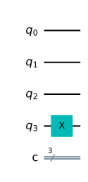
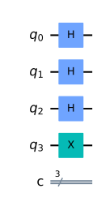
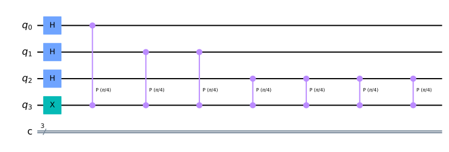
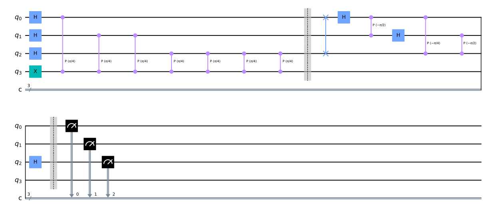
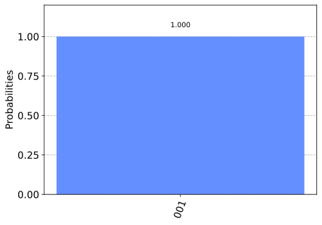

## 量子位相推定

qiskitを利用して、量子アルゴリズムについて自分なりに勉強していこうと思います。
個人的な勉強の記録なので、説明などを大幅に省いている可能性があります。

qiskitのウェブサイト通りに勉強を進めています。

- https://qiskit.org/textbook/ja/ch-algorithms/quantum-phase-estimation.html

量子アルゴリズムとしては最も重要な量子位相推定を勉強してみます。様々なアルゴリズムに利用されおり、理解は必須となっています。位相キックバックと量子フーリエ逆変換の組み合わせ、ある固有ベクトルのユニタリ演算子に対する固有値を（その位相）を推定します。

### github
- jupyter notebook形式のファイルは[こちら](https://github.com/hiroshi0530/wa-src/blob/master/rec/qiskit/base6/base_nb.ipynb)

### google colaboratory
- google colaboratory で実行する場合は[こちら](https://colab.research.google.com/github/hiroshi0530/wa-src/blob/master/rec/qiskit/base6/base_nb.ipynb)

### 筆者の環境


```python
!sw_vers
```

    ProductName:	Mac OS X
    ProductVersion:	10.14.6
    BuildVersion:	18G103


```python
!python -V
```

    Python 3.8.5


基本的なライブラリをインポートしそのバージョンを確認しておきます。


```python
%matplotlib inline
%config InlineBackend.figure_format = 'svg'

import qiskit
import json

import matplotlib.pyplot as plt
import numpy as np
import math

from qiskit import IBMQ, Aer, transpile, assemble
from qiskit import QuantumCircuit, ClassicalRegister, QuantumRegister

from qiskit.visualization import plot_histogram

dict(qiskit.__qiskit_version__)
```


    {'qiskit-terra': '0.17.4',
     'qiskit-aer': '0.8.2',
     'qiskit-ignis': '0.6.0',
     'qiskit-ibmq-provider': '0.13.1',
     'qiskit-aqua': '0.9.1',
     'qiskit': '0.26.2',
     'qiskit-nature': None,
     'qiskit-finance': None,
     'qiskit-optimization': None,
     'qiskit-machine-learning': None}


## 理論部分の理解

固有ベクトル$|\psi\rangle$のユニタリ演算子に対する固有値$e^{2 \pi i \theta}$を求めます。固有ベクトルやユニタリ演算子は既知とします。

$$
U|\psi\rangle=e^{2 \pi i \theta}|\psi\rangle
$$


位相推定の量子回路は以下の様になります。左側のビットから順番に上から並んでいます。
位相推定の量子回路は以下の様になります。左側のビットから順番に上から並んでいます。


上位$N$ビットを量子状態を格納するレジスター、一番下のビットを固有ベクトルとします。
第一レジスターの量子ビットにアダマールゲートを適用し、上記のユニタリ演算子を制御ユニタリ演算子として、第一レジスターの各量子ビットに適用します。適用する回数は$k$番目のビットに対しては$2^k$回です。

$$
\begin{aligned}
&|0\rangle^{\otimes n}\otimes|\psi\rangle \\
&\stackrel{H}{\rightarrow} \sum_{k=0}^{2^{n}-1}|k\rangle \otimes|\psi\rangle \\
&\stackrel{CU}{\rightarrow} \sum_{k=0}^{2^{n}-1} e^{2 \pi i k \theta}|k\rangle \otimes|\psi\rangle
\end{aligned}
$$

最後の式変形がやや分かりづらいので式変形を$n=2$の場合の式変形を具体的に行ってみます。

$$
\begin{aligned}
&|00\rangle\otimes|\psi\rangle \\
&\stackrel{H}{\rightarrow} \frac{1}{2}\left(|00\rangle+|01\rangle+|10\rangle+|01\rangle\right) \otimes |\psi\rangle\\
&\stackrel{CU_{1}}{\rightarrow} \frac{1}{2}\left(|00\rangle+e^{2 \pi i\theta}|01\rangle+\left|10\rangle+e^{2 \pi i \theta}\right| 11\rangle\right)\otimes|\psi\rangle\\
&\stackrel{CU_{2}}{\rightarrow} \frac{1}{2}\left(|00\rangle+e^{2 \pi i \theta}|01\rangle+e^{2 \pi i  \theta}|10\rangle+e^{2 \pi i \theta \times 2}|11\rangle\right)\otimes \psi\rangle\\
&\stackrel{C U_{2}}{\rightarrow} \frac{1}{2}(|00\rangle+e^{2 \pi i \theta}|01\rangle+e^{2 \pi 1 \theta \times 2}|10\rangle+e^{2 \pi i \theta \times 3}|11\rangle\otimes|\psi\rangle\\
&=\sum_{k=0}^{3} e^{2 \pi i \theta k}|k\rangle \otimes|\psi\rangle
\end{aligned}
$$

となります。この表記はショアのアルゴリズムなどでも出てくるので、ぱっと見て覚えておくと良さそうです。

$$
\frac{1}{\sqrt{2^n}} \sum_{k=0}^{2^{n}-1} e^{2 \pi i \theta k}|k\rangle \otimes|\psi\rangle \stackrel{\mathcal{Q F T}^{-1}}{\longrightarrow} \frac{1}{2^{n}} \sum_{x=0}^{2^{n}-1} \sum_{k=0}^{2^{n}-1} e^{-\frac{2 \pi i k}{2^{n}}\left(x-2^{n} \theta\right)}|x\rangle \otimes|\psi\rangle
$$

この状態で測定を行うと、振幅が最大になる$x=2^n\theta$が観測される確率が最大になります。

## qiskitで実装

サイトを参考にqiskitで実装して、位相推定が出来ていることを確認しようと思います。
固有ベクトルとユニタリ演算子は既知なので、qiskitに従ってTゲートを例に実装します。

Tゲートは$|1\rangle$に対して、固有値$\displaystyle e^{\frac{i \pi}{4}}$を持ちます。

$$
T|1\rangle=e^{\frac{i \pi}{4}}|1\rangle
$$

よって、

$$
\theta=\frac{1}{8}
$$

が求める答えになります。

最初に回路を用意し、固有ベクトル$|1\rangle$をNOTゲートを利用して作ります。


```python
qpe = QuantumCircuit(4, 3)
qpe.x(3)
qpe.draw('mpl')
```


    

    


アダマールゲートを適用します。


```python
for qubit in range(3):
    qpe.h(qubit)
qpe.draw('mpl')
```


    

    


制御ユニタリ演算子を順次量子ビットに対して適用します。


```python
repetitions = 1
for counting_qubit in range(3):
    for i in range(repetitions):
        qpe.cp(math.pi/4, counting_qubit, 3);
    repetitions *= 2
qpe.draw('mpl')
```


    

    


IQFTの関数を実装します。


```python
def qft_dagger(qc, n):
    
    for qubit in range(n//2):
        qc.swap(qubit, n-qubit-1)
    for j in range(n):
        for m in range(j):
            qc.cp(-math.pi/float(2**(j-m)), m, j)
        qc.h(j)
```


```python
qpe.barrier()
qft_dagger(qpe, 3)

qpe.barrier()
for n in range(3):
    qpe.measure(n,n)
```


```python
qpe.draw('mpl')
```


    

    


```python
aer_sim = Aer.get_backend('aer_simulator')
shots = 2048
t_qpe = transpile(qpe, aer_sim)
qobj = assemble(t_qpe, shots=shots)
results = aer_sim.run(qobj).result()
answer = results.get_counts()

plot_histogram(answer)
```


    

    


結果は$(001)_2=1$ですので、$2^3\theta=1$を解いて、求める答えである$\displaystyle \frac{1}{8}$を得ます。

## 感想

有名なショアのアルゴリズムも量子位相推定の応用ですので、おそらく非常に重要なアルゴリズムだと思います。
それにしてもこういうことを最初に考える人は本当にすごいと思います。さらに、こういうフリーのツールを用意してくれているIBMにも感謝しないといけません。
