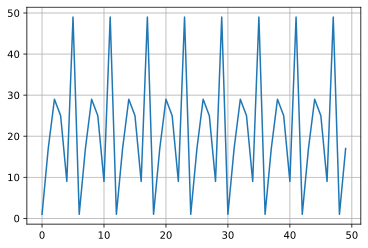
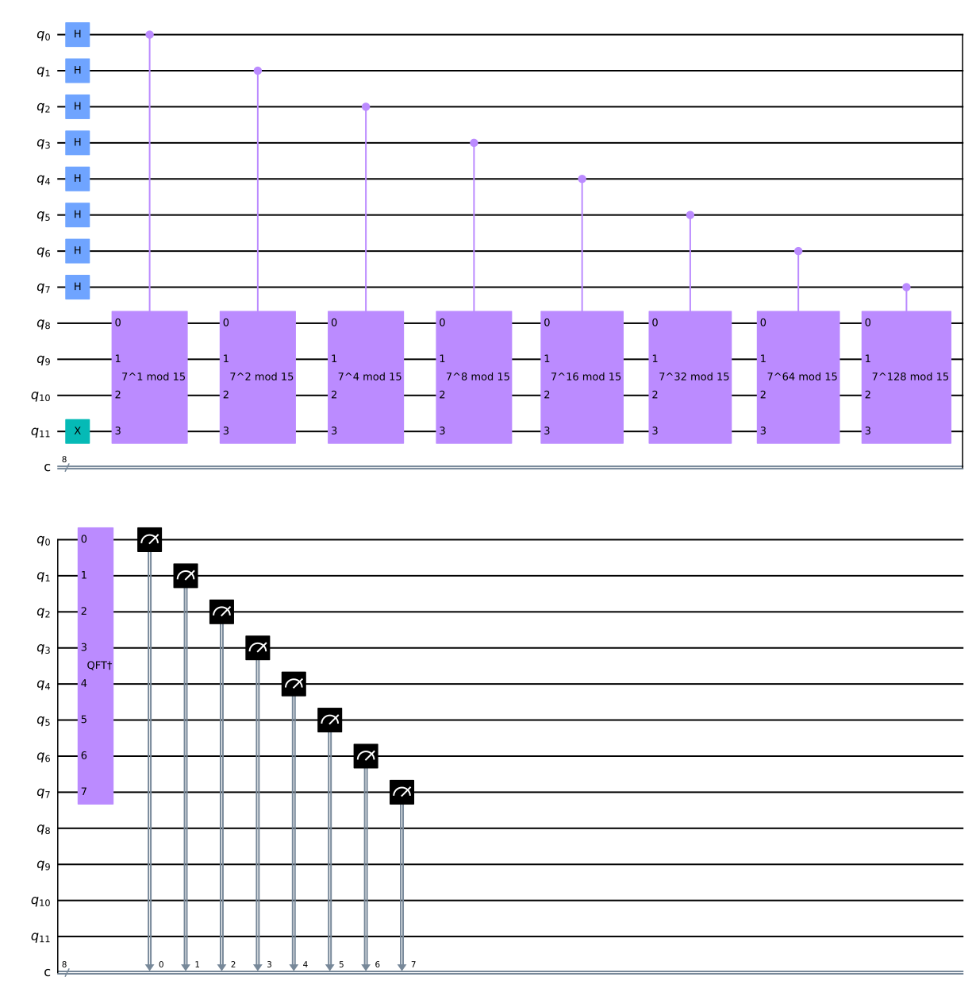

## ショアのアルゴリズム

qiskitを利用して、量子アルゴリズムについて自分なりに勉強していこうと思います。
個人的な勉強の記録なので、説明などを大幅に省いている可能性があります。

qiskitのウェブサイト通りに勉強を進めています。

- https://qiskit.org/textbook/ja/ch-algorithms/quantum-phase-estimation.html

量子コンピュータが一番のインパクトを与えるとされるRSA暗号を破る可能性があるショアのアルゴリズムに進みたいと思います。
現在Webシステムで利用されているRSAは二つの素数の積を計算することは簡単だが、逆の因数分解には$O(N)$の計算量がかかり、現在では１０００ビット（約３００桁）になると、スーパーコンピュータを使っても宇宙の歴史と同じぐらい時間がかかり、現実的には不可能という事になります。

### github
- jupyter notebook形式のファイルは[こちら](https://github.com/hiroshi0530/wa-src/blob/master/rec/qiskit/base7/base_nb.ipynb)

### google colaboratory
- google colaboratory で実行する場合は[こちら](https://colab.research.google.com/github/hiroshi0530/wa-src/blob/master/rec/qiskit/base7/base_nb.ipynb)

### 筆者の環境


```python
!sw_vers
```

    ProductName:	Mac OS X
    ProductVersion:	10.14.6
    BuildVersion:	18G103


```python
!python -V
```

    Python 3.8.5


基本的なライブラリをインポートしそのバージョンを確認しておきます。


```python
%matplotlib inline
%config InlineBackend.figure_format = 'svg'

import qiskit
import json

import matplotlib.pyplot as plt
import numpy as np
import math

from qiskit import IBMQ, Aer, transpile, assemble
from qiskit import QuantumCircuit, ClassicalRegister, QuantumRegister

from qiskit.visualization import plot_histogram

dict(qiskit.__qiskit_version__)
```


    {'qiskit-terra': '0.17.4',
     'qiskit-aer': '0.8.2',
     'qiskit-ignis': '0.6.0',
     'qiskit-ibmq-provider': '0.13.1',
     'qiskit-aqua': '0.9.1',
     'qiskit': '0.26.2',
     'qiskit-nature': None,
     'qiskit-finance': None,
     'qiskit-optimization': None,
     'qiskit-machine-learning': None}


## RSA暗号の復習

### 準備
最初に量子コンピュータが注目される理由となっているRSA暗号の理論部分を簡単に復習してみようと思います。
大学時代は理学部で、群論などの数学も勉強しましたが、今現在はただのIT系のエンジニアなので、正確性は保障しません。
関連する定理などの説明は割愛します。

$p,q$を素数、$n=pq$、$\varphi(n)=(p-1)(q-1)$でオイラーの$\varphi$関数とします。

$a$を$n$と互いの素な整数とすると、フェルマーの小定理より

$$
a^{\varphi(n)} \equiv 1\left(\text{mod} n\right)
$$

が成立します。

また、$e$と$de\equiv 1\left(\text{mod} \varphi(n)\right)$を満たすように$d$を計算します。
$d$は、ある整数$k$を利用して、

$$
d e=k \cdot \varphi(n)+1
$$

とかけます。

メッセージの受信側は公開鍵$(n, e)$を公開し、秘密鍵$d$は非公開とします。

### メッセージの送信

メッセージの送信者とあるメッセージ$m$を$c \equiv m^e(\bmod n)$と暗号化して、$c$を送信します。

### メッセージの受信

$c$の受信者は、$m^{ed}$を計算すると、

$$
m^{ e d}=m^{k \varphi(n)+1} \equiv m \cdot (m^{\varphi(n)})^{k} \equiv m \quad \text{mod} n 
$$

となり、$m$が求まります。途中でフェルマーの小定理を利用しています。

### 解読方法

RSA暗号を解読するには、

1. $n$から$p$と$q$を求める
2. $c \equiv m^e(\bmod n)$から$m$を求める($c, e, n$は既知)

ショアのアルゴリズムは1.の因数分解を通してRSA暗号を突破しようという試みになります。

## 位数を用いた素因数分解

素因数分解の対象となる$n$と互いに素な$a$を準備し、

$$
a^r \equiv 1 \operatorname{mod} n
$$

となる偶数$r>1$を見つけます。その$r=2r'$を用いると、

$$
a^{2r'} - 1 = \left(a^{r'} + 1\right)\left(a^{r'} - 1\right) \equiv 0 \operatorname{mod} n
$$

となるため、$\left(a^{r'} + 1\right)\left(a^{r'} - 1\right) $に$n$の素因数がすべて含まれていることになります。よって、それぞれの値と元の数字$n$の最大公約数を求める事で、素因数分解が出来る可能性があります。ただ、運悪く、片方に$n$が含まれる可能性があるので、その場合は別の$a$を選択し、再度$r$を計算し直すことになります。

$$
p=\operatorname{gcd}\left(a^{r'}+1, n\right), q=\operatorname{gcd}\left(a^{r'}-1, n\right)
$$


##  pythonで実装

せっかくなので、簡単な$N$と$a$を用いて上記のアルゴリズムをpythonで実装し、計算できるか確認してみます。

$n=52$と$x=17$を利用して、位数を求めます。


```python
n = 52
x = 17

ret_list = []
max_iter = 50
for a in range(max_iter):
  ret_list.append(x**a % n)

plt.grid()
plt.plot(range(max_iter), ret_list)
plt.show()

ret_list.index(1, 10)

r = [i for i, v in enumerate(ret_list) if v == 1]
print('位数 r = {}'.format(r[1] - r[0]))
```


    

    


    位数 r = 6


位数が偶然６で偶数だったので、3と５２の最大公約数を求めます。


```python
import math

r = 6

math.gcd(int(x**(r/2) + 1), n)
```


    26


```python
math.gcd(int(x**(r/2) - 1), n)
```


    4


となり、26と４という５２の素因数を求める事が出来ました。後は再帰的に２６を素因数分解し、４を素因数分解し・・・として行けば、最終的に５２を素因数分解する事が可能です。

## 位数 r を求める

### u_sを定義

上記アルゴリズムのメイン部分は、位数$r$を求める事になります。この問題は、古典コンピュータでは多項式時間で求めるアルゴリズムは見つかっていないようです。量子コンピュータで量子位相推定を利用する事でこの$r$を求める事が出来ます。

ショアのアルゴリズムのコアな部分は以下の様なユニタリ演算子を利用するです。

$$
U_{a, N}|y\rangle = |a y \bmod N\rangle \cdots (1)
$$

このユニタリ演算子は、

$$
U_{a, N}|1\rangle = | a \bmod N\rangle \\
U_{a, N}^2|1\rangle = | a^2 \bmod N\rangle \\
U_{a, N}^3|1\rangle = | a^3 \bmod N\rangle \\
\vdots \\
U_{a, N}^r|1\rangle = | a^r \bmod N\rangle = | 1 \bmod N\rangle \\
$$

という感じで循環します。この循環性を利用すると、和を取ることにより、新たなベクトル$|u_0\rangle$

$$
\left|u_{0}\right\rangle=\frac{1}{\sqrt{r}} \sum_{k=0}^{r-1}\left|a^{k} \bmod N\right\rangle
$$

はユニタリ演算子$U$の固有ベクトルになります。

$$
U\left|u_{0}\right\rangle=\frac{1}{\sqrt{r}} \sum_{k=0}^{r-1}U\left|a^{k} \bmod N\right\rangle = |u_0\rangle
$$

次に、この$|u_0\rangle$に模した次のベクトルを考えます。

$$
\left|u_{1}\right\rangle=\frac{1}{\sqrt{r}} \sum_{k=0}^{r-1} e^{-\frac{2 \pi i k}{r}}\left|a^{k} \bmod N\right\rangle
$$

このベクトルに$U$を作用させると、

$$
\begin{aligned}
&U\left|u_{1}\right\rangle=\frac{1}{\sqrt{r}} \sum_{k=0}^{r-1} e^{-\frac{2 \pi i}{r} k} U\left|a^{k} \operatorname{mod} N\right\rangle\\
&=\frac{1}{\sqrt{r}} \sum_{k=0}^{r-1} e^{-\frac{2 \pi \cdot i}{r} \cdot k}\left|a^{k+1} \bmod N\right\rangle\\
&=\frac{1}{\sqrt{r}} e^{\frac{2 \pi i}{r}} \sum_{k=0}^{r-1} e^{-\frac{2 \pi i}{r}(k+1)}\left|a^{k+1} \bmod N\right\rangle \\
&=e^{\frac{2 \pi i}{r} } |u_1\rangle
\end{aligned}
$$

となり、こちらも$U$の固有ベクトルとなり、固有値は$\displaystyle e^{\frac{2 \pi i}{r}}$になります。


一般化すると、

$$
\left|u_{s}\right\rangle=\frac{1}{\sqrt{r}} \sum_{k=0}^{r-1} e^{-\frac{2 x i k}{r}s}\left|a^{k} \bmod N\right\rangle
$$

と$|u_s\rangle$を定義でき、これにユニタリ演算子を作用させると、

$$
\begin{aligned}
&U\left|u_{s}\right\rangle=\frac{1}{\sqrt{r}} \sum_{k=0}^{r-1} e^{-\frac{2 \pi i}{r} ks} U\left|a^{k} \operatorname{mod} N\right\rangle\\
&=\frac{1}{\sqrt{r}} \sum_{k=0}^{r-1} e^{-\frac{2 \pi \cdot i }{r} ks}\left|a^{k+1} \bmod N\right\rangle\\
&=\frac{1}{\sqrt{r}} e^{\frac{2 \pi i}{r} s} \sum_{k=0}^{r-1} e^{-\frac{2 \pi i}{r}(k+1)s}\left|a^{k+1} \bmod N\right\rangle \\
&=e^{\frac{2 \pi i}{r}s } |u_s\rangle \cdots (2)
\end{aligned}
$$

と、固有値$e^{\frac{2 \pi i}{r}s } $が得られます。

この$u_s$は$U$の固有ベクトルであり、量子位相推定を見据えて利用する事が出来そうです。

### u_sの別な表現

この$u_s$は$\left|a^{k} \bmod N\right\rangle$から定義されていますが、以下の方法で、$\left|a^{k} \bmod N\right\rangle$を$u_s$を用いて表現することが出来ます。

$$
\begin{aligned}
&|u_s\rangle=\frac{1}{\sqrt{r}} \sum_{k=0}^{r-1} e^{-\frac{2 \pi i k}{r} s} \mid a^{k} \bmod N \rangle\\
\end{aligned}
$$

$\frac{1}{\sqrt{r}} e^{\frac{2 \pi i k^{\prime}}{r} s}\left|u_{s}\right\rangle$を両辺にかけます。

$$
\begin{aligned}
&\frac{1}{\sqrt{r}} e^{\frac{2 \pi i k^{\prime}}{r} s}\left|u_{s}\right\rangle=\frac{1}{r} \sum_{k=0}^{r-1} e^{-\frac{2 \pi i^{\prime} S}{r}\left(k-k^{\prime}\right)}\left|a^{k} \bmod N\right\rangle 
\end{aligned}
$$

$s$について和を取ります。

$$
\begin{aligned}
&\frac{1}{\sqrt{r}} \sum_{s=0}^{r-1} e^{\frac{2 \pi i k^{\prime}}{r} s}\left|u_{s}\right\rangle=\frac{1}{r} \sum_{s=0}^{r-1} \sum_{k=0}^{r-1} e^{-\frac{2 \pi i s}{r}\left(k-k^{\prime}\right)}\left|a^{k} \bmod N\right\rangle
\end{aligned}
$$

右辺は$k$と$k'$の完成から簡略化する事が出来ます。

$k=k'$の時、

$$
\sum_{s=0}^{r-1} e^{-\frac{2 \pi_{n} i s}{r}\left(k-k^{\prime}\right)}=r
$$

$k\neq k'$の時、
$$
\sum_{s=0}^{r-1} e^{-\frac{2 \pi i s}{t}\left(k-k'\right)}=0
$$

$$
\frac{1}{\sqrt{r}} \sum_{s=0}^{r-1} e^{\frac{2 \pi i k}{r}s}\left|u_{s}\right\rangle=\left|a^{k} \bmod N\right\rangle \cdots (3)
$$

### u_sの重要な性質

もう一つ、$u_s$について重要な性質があります。(3)において、$k'=0$とすると、

$$
\frac{1}{\sqrt{r}} \sum_{s=0}^{r-1}\left|u_{s}\right\rangle=|1\rangle \cdots (4)
$$

となります。固有ベクトルのすべての和を取ると、$|1\rangle$になります。$r$は実際の問題を解く際には分からないので、固有ベクトルの重ね合わせの状態である$|1\rangle$と量子位相推定を利用する事で、$u_s$の固有値$\displaystyle \boldsymbol{e}^{\frac{2 \pi i}{r} s}$の位相$\frac{s}{r}$を測定します。

## 量子回路

以上で準備が整ったので、以下の量子回路に沿って計算を進めます。基本的には量子位相推定と同じです。

量子レジスタを二つ用意し、一つ目が位相を格納するレジスタで、二つ目が冪乗剰余を計算するためのレジスタです。

第一レジスターはすべての量子ビットを$|0\rangle$に初期化し、第二レジスタは$|0\cdots 1\rangle$に初期化します。


$$
|\varphi_1 \rangle = |0 \cdots 0\rangle | 0 \cdots 1\rangle
$$

### アダマールゲートを適用

第一のレジスタのすべての量子ビットにアダマールゲートを適用します。

$$
\begin{aligned}
\left|\varphi_{2}\right\rangle &=\frac{1}{\sqrt{2^{n}}}(|0\rangle+|1\rangle)^{\otimes n} \otimes|0 \cdots 1\rangle \\
&=\frac{1}{\sqrt{2^{n}}} \sum_{k=0}^{2^{n}-1}|k\rangle \otimes |0 \cdots 1 \rangle
\end{aligned}
$$

### 冪乗剰余演算(コントロールユニタリ演算)

コントロールユニタリ演算を実行します。ここで、(3)を利用して$|u_s\rangle$で表記します。

$$
\begin{aligned}
&\left|\varphi_{3}\right\rangle=\frac{1}{\sqrt{2^{n}}} \sum_{k=0}^{2^{n}-1}|k\rangle\otimes\left|a^{k} \bmod n\right\rangle\\
&=\frac{1}{\sqrt{2^{n}}} \sum_{k=0}^{2^{n}-1} |k\rangle \otimes\frac{1}{\sqrt{r}} \sum_{s=0}^{r-1} e^{\frac{2 \pi i k}{r}} s\left|u_{s}\right\rangle\\
&=\frac{1}{\sqrt{r}} \sum_{s=0}^{r-1}\frac{1}{\sqrt{2^{n}}} \sum_{k=0}^{2^{n}-1} e^{\frac{2 \pi i k}{r} s}|k\rangle\otimes\left|u_{s}\right\rangle
\end{aligned}
$$

### 逆量子フーリエ変換

逆量子フーリエ変換を行うことで、$\frac{s}{k}$の位相が第一のレジスターの各量子ビットに格納されます。

$$
\left|\varphi_{4}\right\rangle=\frac{1}{\sqrt{r}} \sum_{s=0}^{r-1}\left|\frac{s}{r}\right\rangle\otimes\left|u_{s}\right\rangle
$$


```python

```


```python

```

$$
a_{0}+\frac{1}{a_{1}+\frac{1}{a_{2}+\frac{1}{\cdots+\frac{1}{a_{M}}}}}
$$


```python

```


```python

```


```python
def c_amod15(a, power):
    """mod 15による制御ゲートをかける"""
    if a not in [2,7,8,11,13]:
        raise ValueError("'a' must be 2,7,8,11 or 13")
    U = QuantumCircuit(4)        
    for iteration in range(power):
        if a in [2,13]:
            U.swap(0,1)
            U.swap(1,2)
            U.swap(2,3)
        if a in [7,8]:
            U.swap(2,3)
            U.swap(1,2)
            U.swap(0,1)
        if a == 11:
            U.swap(1,3)
            U.swap(0,2)
        if a in [7,11,13]:
            for q in range(4):
                U.x(q)
    U = U.to_gate()
    U.name = "%i^%i mod 15" % (a, power)
    c_U = U.control()
    return c_U
```


```python
# Specify variables
n_count = 8 # number of counting qubits
a = 7
```


```python
def qft_dagger(n):
    """n量子ビットの逆QFTを回路の最初のn量子ビットにかける"""
    qc = QuantumCircuit(n)
    # Swapsを忘れない!
    for qubit in range(n//2):
        qc.swap(qubit, n-qubit-1)
    for j in range(n):
        for m in range(j):
            qc.cu1(-np.pi/float(2**(j-m)), m, j)
        qc.h(j)
    qc.name = "QFT†"
    return qc
```


```python
# n_count個の測定用量子ビットとUを操作するための4量子ビットで
# 量子回路を作る
qc = QuantumCircuit(n_count + 4, n_count)

# 測定用量子ビットを
# |+>状態に初期化
for q in range(n_count):
    qc.h(q)
    
# アンシラレジスターを|1>の状態にする
qc.x(3+n_count)

# 制御Uを操作
for q in range(n_count):
    qc.append(c_amod15(a, 2**q), 
             [q] + [i+n_count for i in range(4)])

# 逆QFTを操作
qc.append(qft_dagger(n_count), range(n_count))

# 回路を測定
qc.measure(range(n_count), range(n_count))
qc.draw('mpl')
```


    

    


```python

```


```python

```
