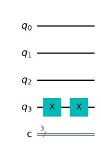
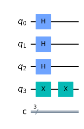
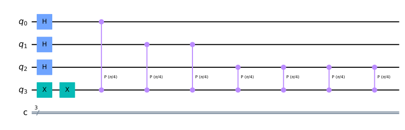

## 量子位相推定

qiskitを利用して、量子アルゴリズムについて自分なりに勉強していこうと思います。
個人的な勉強の記録なので、説明などを大幅に省いている可能性があります。

qiskitのウェブサイト通りに勉強を進めています。

- https://qiskit.org/textbook/ja/ch-algorithms/quantum-phase-estimation.html

量子アルゴリズムとしては最も重要な量子位相推定を勉強してみます。様々なアルゴリズムに利用されおり、理解は必須となっています。位相キックバックと量子フーリエ逆変換の組み合わせ、ある固有ベクトルのユニタリ演算子に対する固有値を（その位相）を推定します。

### github
- jupyter notebook形式のファイルは[こちら](https://github.com/hiroshi0530/wa-src/blob/master/rec/qiskit/base6/base_nb.ipynb)

### google colaboratory
- google colaboratory で実行する場合は[こちら](https://colab.research.google.com/github/hiroshi0530/wa-src/blob/master/rec/qiskit/base6/base_nb.ipynb)

### 筆者の環境


```python
!sw_vers
```

    ProductName:	Mac OS X
    ProductVersion:	10.14.6
    BuildVersion:	18G103


```python
!python -V
```

    Python 3.8.5


基本的なライブラリをインポートしそのバージョンを確認しておきます。


```python
%matplotlib inline
%config InlineBackend.figure_format = 'svg'

import qiskit
import json

import matplotlib.pyplot as plt
import numpy as np
import math

from qiskit import IBMQ, Aer, transpile, assemble
from qiskit import QuantumCircuit, ClassicalRegister, QuantumRegister

from qiskit.visualization import plot_histogram

dict(qiskit.__qiskit_version__)
```


    {'qiskit-terra': '0.17.4',
     'qiskit-aer': '0.8.2',
     'qiskit-ignis': '0.6.0',
     'qiskit-ibmq-provider': '0.13.1',
     'qiskit-aqua': '0.9.1',
     'qiskit': '0.26.2',
     'qiskit-nature': None,
     'qiskit-finance': None,
     'qiskit-optimization': None,
     'qiskit-machine-learning': None}


## 理論部分の理解

固有ベクトル$|\psi\rangle$のユニタリ演算子に対する固有値$e^{2 \pi i \theta}$を求めます。固有ベクトルやユニタリ演算子は既知とします。

$$
U|\psi\rangle=e^{2 \pi i \theta}|\psi\rangle
$$


```python

```


```python

```


```python
qpe = QuantumCircuit(4, 3)
qpe.x(3)
qpe.draw('mpl')
```


    

    


```python
for qubit in range(3):
    qpe.h(qubit)
qpe.draw('mpl')
```


    

    


```python
repetitions = 1
for counting_qubit in range(3):
    for i in range(repetitions):
        qpe.cp(math.pi/4, counting_qubit, 3);
    repetitions *= 2
qpe.draw('mpl')
```


    

    


```python

```


```python
if 1 <= 2:
  print('aa')
  pass
```

    aa


## 感想
